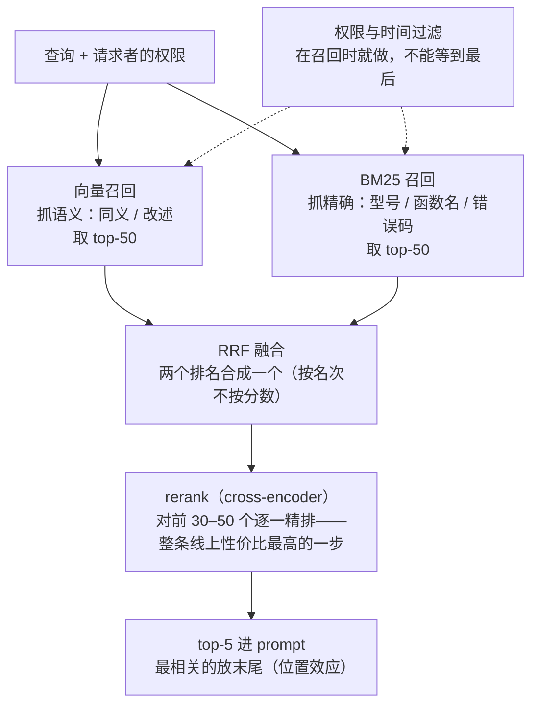

上一篇把文档变成了带元数据的块。这一篇讲怎么把块存起来、怎么找回来：选哪个 embedding 模型、用什么索引结构、放在哪个向量库、怎么把 BM25 与向量的结果合起来、为什么 rerank 是整条流水线上性价比最高的一步、以及权限过滤为什么必须发生在这一步。

这一层的选型与 L1 第五篇的模型选型同构：榜单（MTEB）只能缩范围，决定要在自己的查询集上做；并且它有一个模型选型没有的隐藏成本——**换 embedding 模型意味着全量重建索引**。2026 年的候选很多（Qwen3-Embedding 登顶 MMTEB、Gemini Embedding、Voyage-3-large、Cohere Embed v4 支持 128K 与多模态、OpenAI text-embedding-3），而 MTEB 本身被指出用二元相关性抹平了模型之间的差异。选对模型之后，混合检索与 rerank 带来的提升常常比换模型大。

本篇要回答的核心问题是：

> **embedding 模型怎么选、MTEB 为什么不能直接用？[^q0] 向量索引与向量库怎么选，混合检索与 RRF 是什么，rerank 为什么性价比最高？[^q1] 权限为什么必须在检索时过滤，增量更新与删除怎么做？[^q2]**

## 一、总览

### 1. 一次检索的路径




```text
查询
 ├─ embedding ─→ 向量索引（ANN）─→ top-50   ← 元数据过滤（权限、时间）
 └─ 分词 ──────→ 倒排索引（BM25）─→ top-50   ← 元数据过滤
          ↓ 两路合并
       RRF 融合 ─→ top-20
          ↓
       rerank（cross-encoder）─→ top-5
          ↓
       进入上下文
```

四段：**两路召回**（向量抓语义、BM25 抓精确）各取几十个候选，**融合**（RRF）合成一个列表，**精排**（rerank）对前几十个逐一打分取前几个，**过滤**在两路召回时就做（权限、时间）。每一段是本文一章。

### 2. 本文的章节安排

第二章 embedding 模型的选法；第三章向量索引与向量库；第四章混合检索与 RRF；第五章 rerank；第六章权限过滤与元数据；第七章增量更新、删除与重建；第八章实践建议。

## 二、embedding 模型

### 1. 候选（2026 年 9 月）

| 模型 | 类型 | 特点 |
|---|---|---|
| Qwen3-Embedding-8B / 4B / 0.6B | 开放（Apache 2.0） | 8B 以 70.58 登顶 MTEB Multilingual（2025-06）；32K 上下文；配套 Qwen3-Reranker；三个尺寸 |
| Gemini Embedding 001 | 闭源 API | MMTEB 68.32；跨语言检索强（XOR-Retrieve 90.42）；**输入上限 2K token** |
| Voyage-3-large | 闭源 API（MongoDB 旗下） | 32K 上下文；Matryoshka 2048 / 1024 / 512 / 256；量化感知训练支持 int8 与二值；面向法律、金融、代码等领域 |
| Cohere Embed v4 | 闭源 API | **128K 上下文**；多模态（PDF 里的图、幻灯片、商品图与文本同一空间） |
| OpenAI text-embedding-3-large | 闭源 API | 集成最广；Matryoshka——256 维仍胜旧的 ada-002 1,536 维 |
| BGE-M3、multilingual-e5、embeddinggemma-300m | 开放 | 生产基线：便宜、快、多语言；BGE-M3 同时输出稠密、稀疏、多向量 |
| KaLM-Embedding-Gemma3-12B | 开放（社区许可） | MMTEB 榜首量级的"天花板"模型；11.7B 参数、3,840 维，索引与服务成本高 |

### 2. MTEB 为什么不能直接用

与 L1 第五篇讲的 Arena 同一类问题：

- **版本不可比**：MTEB 与 MMTEB、Multilingual v1 与 v2 的任务集不同，跨版本的分数不能横比。
- **二元相关性**：MTEB 的检索数据集多用"相关 / 不相关"二值标注，nDCG 这类指标在二值标签下退化——分不清"完美答案"与"勉强相关"。ZeroEntropy 2026 年用三个 judge 对 28 个 MTEB 检索数据集重标分级相关性，重评 16 个 embedding 模型与 7 个 rerank 模型，排名明显变化。
- **聚合分数掩盖任务方差**：一个模型在分类上强、在检索上弱，平均分看不出来；你只关心检索。
- **领域与语言**：中文法律文书、内部代码、医疗记录不在榜单的分布里。

用法与 L1 第五篇相同：**榜单缩范围，自己的查询集决定**。

### 3. 判据

| 判据 | 问什么 |
|---|---|
| 语言与领域 | 你的语料是中文为主？代码？法律？榜单第一在你的领域未必第一 |
| 上下文长度 | 块能多长——Gemini 的 2K 与 Cohere 的 128K 差 64 倍；长块能减少分块的影响 |
| 维度与 Matryoshka | 维度决定存储与检索成本；支持截断维度的模型让你事后调（先存 1,024 维，需要时截到 256） |
| 多模态 | 语料含图表、幻灯片、商品图时 Cohere Embed v4 一类是唯一主流选项 |
| 开放 vs API | 数据出域、成本（大规模自托管 Qwen3 便宜）、**版本稳定性** |
| 版本稳定性 | **换模型 = 全量重建索引**——选供应商承诺长期维护的版本，比选榜单第一重要 |
| 配套 rerank | 同家的 embedding + rerank 通常配合更好 |

### 4. 怎么评

从真实查询里采 50–200 条，人工标注每条的相关块（第七篇的检索评测集），对候选模型算 recall@5 / @20 与 MRR。多数团队会发现：三个候选的差距小于"加 BM25 混合"或"加 rerank"带来的提升——**模型选型不是这一层的主要杠杆**。

## 三、向量索引与向量库

### 1. 索引结构

精确最近邻在百万向量上太慢，用近似（ANN）：

| 结构 | 原理 | 适合 | 代价 |
|---|---|---|---|
| HNSW | 多层图，贪心导航 | 百万级、高召回、低延迟；多数向量库的默认 | 内存驻留（每向量几百字节到几 KB）；构建慢 |
| IVF（倒排文件） | 聚类成若干桶，查最近的几个桶 | 千万到亿级、可放磁盘 | 召回随桶数权衡；聚类要重训 |
| 量化（PQ / SQ / 二值） | 压缩向量（int8、二值） | 降内存与带宽 4–32 倍 | 精度损失；配 rerank 弥补 |
| DiskANN 一类 | 图 + 磁盘 | 十亿级单机 | 延迟比内存 HNSW 高 |

多数应用在百万块以下，HNSW 加标量量化足够；亿级才需要 IVF 与磁盘方案。**带过滤的搜索**是一个专门的问题：先过滤再搜（候选少时准但慢）还是先搜再过滤（快但可能过滤后不够 k 个）——向量库对此有各自的实现（过滤下推到图遍历），选库时要测你的过滤选择性下的召回。

### 2. 向量库

| 选项 | 适合 | 备注 |
|---|---|---|
| pgvector（+ pgvectorscale） | 已有 PostgreSQL、百万级以下 | **先用现有基础设施**；事务、权限、备份现成 |
| Elasticsearch / OpenSearch | 已有全文索引、要混合检索 | BM25 与向量在同一系统，混合最方便 |
| Qdrant、Milvus、Weaviate | 专用、千万级以上、丰富的过滤 | 独立运维 |
| turbopuffer、LanceDB 一类 | 对象存储后端、成本敏感的大规模 | Cursor 用 turbopuffer 存代码索引 |
| 云托管（各云的向量服务） | 不想运维 | 锁定 |

原则：**数据量小时用你已有的数据库**。pgvector 在百万级以下完全够用，且把块、元数据、权限、事务放在一个系统里比跨系统同步简单得多。到了千万级、或需要复杂过滤与高 QPS，再上专用库。

## 四、混合检索

### 1. 为什么要两路

向量抓语义，抓不住精确：型号 "X-200" 与 "X-2000"、函数名、错误码、人名、日期在向量空间里靠得很近。BM25 抓精确，抓不住语义：同义、改述、跨语言。两路各取几十个候选合并，覆盖对方的盲区——这是 2024 年之后企业检索的默认配置，Anthropic 的 contextual retrieval 实验里"embedding + BM25"比纯 embedding 的失败率再降一截。

### 2. RRF：不用调权重的融合

两路的分数不在同一尺度（余弦相似度 0–1 与 BM25 的无界分数），直接加权要调参且不稳定。**倒数排名融合**（Reciprocal Rank Fusion）只用排名：

$$
\text{RRF}(d) = \sum_{r \in \text{路}} \frac{1}{k + \text{rank}_r(d)}
$$

$$k$$ 通常取 60。一个文档在两路都靠前，分数最高；只在一路出现，也有分数。不需要归一化、不需要调权重、对两路的分数分布不敏感——这是它成为默认的原因。Elasticsearch、OpenSearch、多数向量库都内置。

### 3. 三路

BGE-M3 一类模型同时输出稠密向量、稀疏（学习到的词权重，类似 SPLADE）与多向量（ColBERT 式）；三路 RRF 在多语言语料上常再提一截。代价是索引与查询成本三倍。

## 五、rerank

### 1. 为什么双塔不够

embedding 检索是**双塔**：查询与文档各自独立编码成向量，相似度是两个向量的点积——文档向量在索引时就算好了，查询来了只算一次，所以快。代价是查询与文档**没有交互**：模型没有机会"读着查询看文档"。cross-encoder 把（查询，文档）拼在一起过一遍模型，输出一个相关性分数——有交互，精确得多，但每个候选都要算一次，不能预计算，只能用在 top-k 之后。

### 2. 性价比

流水线：两路召回各 50 → RRF → top-20 → rerank → top-5 进上下文。rerank 只对 20 个候选打分，延迟几十到几百毫秒（托管 API）或更少（本地小模型），换来的是 top-5 的精度明显提升——Anthropic 的实验里加 rerank 让失败率从 −49% 再降到 −67%；很多团队的经验是 rerank 带来的提升大于换 embedding 模型。它还**减少进入上下文的块数**：没有 rerank 时为了保证召回要放 top-10，有了 rerank 放 top-3 到 5 就够——直接省 L2 的预算与 L1 的钱。

### 3. 候选

Cohere Rerank、Voyage rerank、Qwen3-Reranker（开放，0.6B / 4B / 8B）、BGE-reranker、ColBERT 式的晚交互模型（介于双塔与 cross-encoder 之间，可预计算文档侧）。选法与 embedding 相同：自己的查询集上比 rerank 前后的 recall@5 与 nDCG@5，看延迟。ZeroEntropy 的分级重评里 rerank 模型之间差距也不小。

### 4. 什么时候不需要

候选本来就少（小语料、精确过滤后只剩几个）；延迟预算极紧（每毫秒都算的自动补全）；或者 agentic 检索里模型自己会多轮筛（第五篇）——此时 rerank 的收益小。

## 六、权限过滤

### 1. 在哪一步

在**两路召回时**：查询带用户的权限（用户 id、组、角色，或可见的 ACL id 集合），向量索引与倒排索引都只在该用户可见的块里搜。不是 RRF 之后、不是 rerank 之后、更不是生成之后（第三篇第六章讲过为什么）。

### 2. 实现

- 元数据里每块有 `acl`（可见的主体集合或 ACL 组 id），查询时 `acl ∩ 用户主体 ≠ ∅`；
- 向量库要支持这种集合过滤且过滤下推到索引（否则先搜 top-50 再过滤可能剩不下几个）；
- 权限变化要同步：源系统的 ACL 变了，块的元数据要更新——这通常是入库流水线里最容易断的一环；
- **测**：第七篇的"不该看到"查询集。

### 3. 多租户

多租户 SaaS 的租户隔离是权限过滤的极端形式：要么每租户独立索引（隔离强、成本高），要么共享索引 + 租户 id 过滤（要确保过滤不可绕过）。多数向量库对此有专门的分区 / 命名空间机制。

## 七、更新、删除与重建

### 1. 增量更新

文档变了：删旧块、加新块（块 id 按文档 id + 块序号或内容哈希）。HNSW 的删除通常是软删除（标记后在查询时跳过，定期重建清理），大量删除后召回与延迟会变差，要有重建窗口。倒排索引的增量更新便宜得多——这是第二篇里词法检索"过期税低"的另一面。

### 2. 删除的合规含义

用户要求删除数据、文档下线、权限收回——块必须真的不可检索，软删除的"标记跳过"要经得起审计；备份与副本里的向量也要处理。

### 3. 全量重建

三种情况要全量重建：换 embedding 模型（向量空间变了，新旧向量不可比）、改分块策略、改 contextual 前缀。百万块的语料重建是几小时到一天的 embedding 调用加索引构建；要有**双写切换**的流程（新索引建好、评测通过、流量切换、旧索引保留一段时间），与 L2 第六篇的发布流程同构。这是"换 embedding 模型很贵"的具体含义。

## 八、实践建议

1. **建检索评测集**（50–200 条真实查询 + 标注的相关块），先测纯向量的 recall@5 作为基线。
2. **加 BM25 混合 + RRF**，再测；多数语料上这一步的提升大于换模型。
3. **加 rerank**（top-20 → top-5），再测；同时把进入上下文的块数从 10 降到 5，看成本与质量。
4. **embedding 选型放最后**：在混合 + rerank 的配置下比两三个候选，判据加上上下文长度、Matryoshka、版本稳定性、出域。
5. **向量库先用现有的**：PostgreSQL + pgvector 到百万级；已有 Elasticsearch 就用它做混合。
6. **权限过滤进召回**：块带 ACL、查询带主体、过滤下推；写"不该看到"的测试。
7. **规划重建**：块 id 用内容哈希、软删除加重建窗口、换模型走双写切换。

## 九、本文小结

- embedding 选型与模型选型同构：MTEB 版本不可比、二元相关性抹平差异（ZeroEntropy 分级重评后排名变化）、聚合分掩盖任务方差、领域不在分布里——榜单缩范围，自己的查询集决定；判据是语言领域、上下文长度（2K 到 128K）、维度与 Matryoshka、多模态、开放 vs API、**版本稳定性（换模型 = 全量重建）**。
- 索引：百万级以下 HNSW + 标量量化；亿级 IVF / 磁盘方案；带过滤的搜索要测。向量库：先用现有的（pgvector、Elasticsearch），千万级或复杂过滤再上专用库。
- 混合：向量抓语义、BM25 抓精确，RRF 只用排名融合（$$k = 60$$）不需要调权重；BGE-M3 一类可三路。
- rerank：cross-encoder 有查询—文档交互，只用于 top-20 后的精排；性价比最高（Anthropic：−49% → −67%），且让进入上下文的块从 10 降到 5。
- 权限在两路召回时过滤，元数据带 ACL、过滤下推、与源系统同步；多租户用分区。
- 更新：块 id 用哈希，HNSW 软删除要重建窗口，删除要经得起审计；换模型 / 改分块 / 改前缀要全量重建，走双写切换。

## 十、自测

1. 一个团队在 MTEB 上选了榜首模型，上线后中文合同检索效果不如原来的 BGE-M3。可能原因有哪几个？

   <details markdown="1">
   <summary>答案</summary>
   榜单分布里没有中文法律文书（领域与语言）；聚合分掩盖了检索子任务的表现；二元相关性下的排名与真实分级相关性下不同；榜首模型可能上下文更短导致分块被切得更碎。正确做法是在自己的 50–200 条合同查询上比 recall@5 与 MRR。详见[第二章](#二embedding-模型)。
   </details>

2. 查询"X-200 的额定电压"在纯向量检索下返回了 X-2000、X-20 的文档。为什么？怎么修？

   <details markdown="1">
   <summary>答案</summary>
   型号这类精确标识符在向量空间里靠得很近，向量抓语义不抓字面。修：加 BM25 一路（精确匹配 "X-200"），用 RRF 融合两路——两路都命中的 X-200 文档分数最高；再加 rerank 精排。详见[第四章](#四混合检索)。
   </details>

3. 用 RRF（$$k = 60$$）计算：文档 A 在向量路排第 1、BM25 路排第 10；文档 B 在向量路排第 3、BM25 路排第 2。谁分数高？

   <details markdown="1">
   <summary>答案</summary>
   A：$$1/61 + 1/70 \approx 0.01639 + 0.01429 = 0.03068$$。B：$$1/63 + 1/62 \approx 0.01587 + 0.01613 = 0.03200$$。B 更高——两路都靠前胜过一路第一、一路靠后。详见[第四章](#四混合检索)。
   </details>

4. 为什么 rerank 不能替代 embedding 检索直接对全库打分？它在流水线里的正确位置与收益是什么？

   <details markdown="1"><summary>答案</summary>
   cross-encoder 要对每个（查询，文档）对过一遍模型，不能预计算，百万文档每次查询要百万次前向——不可行。正确位置是召回 + RRF 之后的 top-20 精排，取 top-5 进上下文；收益是精度显著提升（Anthropic：失败率 −49% → −67%），并把进入上下文的块数从 10 降到 5，省预算与钱，延迟增加几十到几百毫秒。详见[第五章](#五rerank)。
   </details>

5. 团队决定把 embedding 模型从 text-embedding-3 换成 Qwen3-Embedding-8B。列出要做的事与顺序。

   <details markdown="1"><summary>答案</summary>
   （1）在检索评测集上验证新模型（在混合 + rerank 配置下）确实更好；（2）新旧向量空间不可比，全量重建：新建索引、对全部块重算 embedding（百万块几小时到一天）；（3）双写期间新旧索引并存，新索引通过评测后切流量，旧索引保留一段时间可回滚；（4）块 id 用内容哈希保证对应；（5）若同时改 rerank 为 Qwen3-Reranker 一起评。这就是"换 embedding 模型很贵"的含义。详见[第七章](#七更新删除与重建)。
   </details>

## 下一篇

[从流水线到 agentic retrieval](/from-rag-pipelines-to-agentic-retrieval.html)

[^q0]: 候选：Qwen3-Embedding-8B（开放，MMTEB 70.58，32K，配 Qwen3-Reranker）、Gemini Embedding 001（68.32，跨语言强，输入 2K）、Voyage-3-large（32K，Matryoshka，量化感知）、Cohere Embed v4（128K，多模态）、OpenAI text-embedding-3-large（256 维胜旧 ada-002 1,536 维）、BGE-M3 / e5 等生产基线。MTEB 不能直接用：版本不可比、二元相关性抹平差异（ZeroEntropy 用分级相关性重标 28 个数据集后排名明显变化）、聚合分掩盖检索子任务、领域与语言不在分布里——榜单缩范围，自己的 50–200 条查询集决定。判据：语言领域、上下文长度、维度与 Matryoshka、多模态、开放 vs API、版本稳定性（换模型 = 全量重建索引）、配套 rerank。多数情况模型间差距小于加混合与 rerank 的提升。详见[第二章](#二embedding-模型)。

[^q1]: 索引：百万级以下 HNSW + 标量量化（内存驻留、高召回），亿级 IVF / DiskANN 一类，带过滤的搜索要在自己的过滤选择性下测召回。向量库先用现有的——pgvector 到百万级、已有 Elasticsearch 用它做混合——千万级或复杂过滤再上 Qdrant / Milvus / Weaviate / turbopuffer。混合检索：向量抓语义、BM25 抓精确（型号、函数名、编号），两路各取几十候选，用 RRF $$\sum 1/(k + \text{rank})$$（$$k = 60$$）只按排名融合，不需归一化与调权重。rerank：cross-encoder 让查询与文档交互，比双塔精确但不能预计算，只用于 RRF 后 top-20 的精排取 top-5；性价比最高——Anthropic 实验失败率从 −49% 再到 −67%，且把进入上下文的块从 10 降到 5 省预算与钱，延迟加几十到几百毫秒。详见[第三章](#三向量索引与向量库)、[第四章](#四混合检索)、[第五章](#五rerank)。

[^q2]: 权限在两路召回时过滤：块的元数据带 ACL，查询带用户主体集合，向量索引与倒排索引只在可见块里搜，过滤下推到索引；不能在 RRF、rerank 或生成之后过滤——模型已看到无权内容且 top-k 位置被无权文档占用；ACL 变化要与源系统同步；多租户用分区 / 命名空间或独立索引；用"不该看到"查询集测。更新：块 id 用文档 id + 序号或内容哈希，文档变了删旧块加新块；HNSW 删除是软删除，大量删除后要重建窗口，删除要经得起合规审计（含副本与备份）；倒排索引增量便宜。全量重建的三种情况：换 embedding 模型（向量空间不可比）、改分块、改 contextual 前缀——百万块数小时到一天，走双写切换：新索引建好、评测通过、切流量、旧索引保留可回滚。详见[第六章](#六权限过滤)、[第七章](#七更新删除与重建)。
