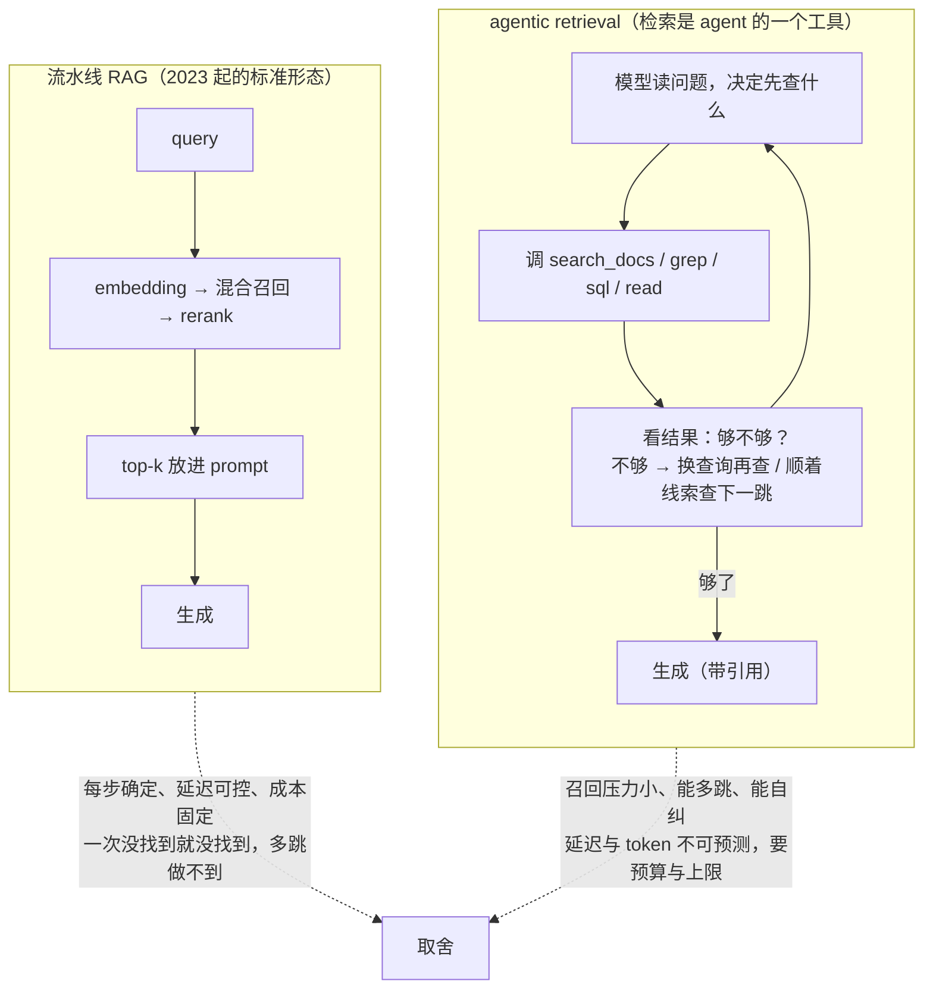

前两篇讲的是一条**流水线**：query → embedding → 混合召回 → rerank → top-k → 放进 prompt → 生成。它是 2023 年以来 RAG 的标准形态，优点是每一步确定、延迟可控、成本固定。它的弱点也来自"确定"：一次检索没找到就没找到，查询与文档不匹配时没有第二次机会，多跳问题（"A 的供应商的母公司在哪"）要先查 A 再查供应商再查母公司，流水线做不到。

2025 年之后另一种形态成为主流：**检索是 agent 的一个工具**。模型看到问题，决定查什么（改写、拆分）、用哪类检索（grep 还是向量还是 SQL）、查几轮、结果够不够、要不要换个词再来——第二篇讲的 coding agent 用 grep 多轮搜索就是它；深度研究类产品是它的极端形态。它把检索的召回压力变小（一次没找到可以再来），把对工具描述、上下文预算、循环控制的要求变大。两种形态不是替代关系，本篇讲各自适合什么、中间的改进手段、以及供应商内置的 file search 在协议上是什么。

本篇要回答的核心问题是：

> **固定流水线与 agentic retrieval 各适合什么？[^q0] query 改写、多查询、多跳各解决什么问题？[^q1] agentic 检索对工具描述、上下文预算、循环控制有什么要求，供应商内置的 file search 在协议上是什么？[^q2]**

## 一、总览

### 1. 两种形态

| | 流水线 RAG | agentic retrieval |
|---|---|---|
| 谁决定查什么 | 代码：用户问题（或固定改写）就是查询 | **模型**：读问题后决定查询词、检索类型、轮数 |
| 检索次数 | 1（或固定几次） | 不定，1 到几十 |
| 模型调用次数 | 1 | 多（每轮一次） |
| 延迟 | 可控：检索几百毫秒 + 一次生成 | 不定：轮数 × （模型 + 检索） |
| 成本 | 固定：一次输入几千 token | 不定；上下文随轮增长（L2 第四篇） |
| 召回压力 | **高**：一次要找对 | 低：没找到再来 |
| 多跳 | 做不到（除非预设） | 天然支持 |
| 可预测性 | 高，易调试 | 低，靠 trace |
| 适合 | 高并发、定位型问答、延迟敏感、问题形态稳定 | 复杂任务、多跳、探索型、问题形态多变、agent 场景 |
| 代表 | 客服 FAQ、文档问答、搜索增强 | coding agent、深度研究、数据分析 agent |

Table: 流水线 RAG 与 agentic retrieval 的对照

### 2. 中间地带

两者之间有一条渐进的路：流水线加 **query 改写**（模型先改写查询再检索一次）、加**多查询**（拆成几个查询并行检索再合并）、加**自检**（生成后判断"检索结果够不够"，不够再来一轮，上限两轮）——每加一步就更接近 agentic 一点、延迟与成本也涨一点。多数生产系统停在这条路的中段。

### 3. 本文的章节安排

第二章讲流水线的改进手段；第三章讲 agentic retrieval 的形态与它对系统的要求；第四章讲供应商内置的 file search；第五章讲决策；第六章实践建议。

## 二、流水线的改进

### 1. query 改写

用户的问题不是好的查询："那个东西上个月为什么坏了"没有关键词、有指代、有时间词。改写让模型先把问题变成检索友好的形式：补全指代（从对话历史）、抽取关键词、加同义词、去掉寒暄。一次额外的小模型调用（Luna / Haiku 级，L1 第五篇的分流），几百毫秒，对对话式 RAG 几乎是必需的——第三轮的"它呢？"不改写就没法检索。

### 2. HyDE：先写假想答案

Hypothetical Document Embeddings：让模型先对问题写一段**假想的答案**（不管对不对），用这段答案去做向量检索。原理是答案与文档在同一"回答"的语义空间里，比问题与文档的距离更近——问题"退货要多久"与文档"逆向流程通常在七个工作日内完成"词汇不同，但假想答案"退货一般需要 7 个工作日"与文档很近。代价是一次生成；风险是假想答案跑偏时检索跟着偏。对词汇不匹配严重的语料有效。

### 3. 多查询与拆分

一个问题拆成几个子查询并行检索，结果合并（RRF）：比较类问题（"A 与 B 的保修有什么区别"拆成 A 的保修、B 的保修）、多面问题（"这个产品的价格、交期和售后"）。也可以让模型生成同一问题的三种改写并行检索，提高召回的鲁棒性。代价是检索次数乘几倍——检索便宜，这通常值得。

### 4. 按元数据路由

问题里有"2025 年"、"华东区"、"合同"这类信号时，先抽取成过滤条件再检索——把语义问题变成结构化过滤 + 语义检索（第四篇的带过滤搜索）。模型抽过滤条件（结构化输出，L2 第三篇），比让 embedding 去"理解"时间范围可靠得多。

### 5. 自检与有限重试

生成之前加一步判断："这些检索结果能回答问题吗？"（一次小模型调用或让主模型在结构化输出里给一个 `sufficient` 字段）——不能则改写再检索一轮，**上限一到两轮**。这是流水线向 agentic 迈的最后半步：有循环，但循环是代码控制的、有硬上限、延迟可算。

## 三、agentic retrieval

### 1. 形态

检索做成一个或几个**工具**（L1 第二篇的工具调用协议）：`search_docs(query, filters)`、`grep(pattern, path)`、`sql(query)`、`read(doc_id, range)`。模型在 agent 循环里（L4）自己决定：先用哪个、查什么词、看到结果后是回答还是再查、要不要换检索类型。第二篇的 coding agent 是它最成熟的实例：grep 找字面 → 读文件 → 发现线索 → 再 grep → LSP 找引用，几轮到几十轮。深度研究产品是另一端：几十次网页搜索与阅读、逐步收窄、最后综合成报告。

### 2. 它换到了什么

- **召回压力下降**：流水线要求 top-5 里有答案；agentic 只要求"有线索"，模型顺着线索再查。第二篇里 grep 的词汇不匹配问题在多轮下被缓解——猜三次通常能猜到。
- **多跳成为可能**：每一跳是一轮。
- **检索类型可选**：三类检索都做成工具，模型按问题选（精确标识符 grep、自然语言向量、关系 SQL）。
- **问题形态不用预设**：流水线要为每类问题设计改写与路由，agentic 让模型临场决定。

### 3. 它要付什么

- **成本与延迟不定**：一个任务 1 轮还是 30 轮由模型决定；L1 第四篇讲的"按任务看分布"在这里是必需的——p95 常是 p50 的 5–10 倍。
- **上下文增长**：每轮的检索结果进入上下文，L2 第一篇的 $$S + (k-1)(r + o)$$ 里 $$r$$ 就是它；L2 第四篇的卸载（大结果写文件留引用）、清理（旧结果删掉）、预算（每轮返回上限）在 agentic 检索里是必需品不是选项。
- **工具描述决定行为**：模型用不用对工具、用对参数，取决于描述（L1 第二篇第三章）："search_docs：对制度、合同等非结构化文档做语义检索，适合自然语言问题；已知条款编号时用 grep_docs；查客户 / 订单等结构化数据用 sql"——不写清，模型会用向量搜编号、用 SQL 搜段落。
- **循环控制**：步数上限、token 预算、循环检测、"没有进展"的判断——L4 运行时的责任。没有上限的 agentic 检索会在找不到答案时无限换词。
- **可预测性低**：同一个问题两次走的路径不同（L1 第一篇的非确定性）；调试靠 trace（L5）：每一轮查了什么、返回了什么、为什么决定再查。

### 4. 检索工具的设计

| 要素 | 做法 |
|---|---|
| 粒度 | 一个工具一类检索；不要把所有检索合成一个"万能搜索" |
| 返回 | **摘要 + 引用**而不是全文：每条结果给标题、一两句摘要、id、相关分；全文用 `read(id)` 另取——这是 L2 第四篇卸载原则的应用 |
| 数量 | 每次返回上限（5–10 条），让模型翻页而不是一次吐 50 条 |
| 过滤 | 参数里暴露元数据过滤（时间、类型、来源），让模型能收窄 |
| 权限 | 工具内部按调用用户过滤（第四篇），模型无法绕过 |
| 失败 | 返回"无结果 + 建议"（"没有匹配，试试同义词 X 或去掉时间限制"）而不是空——帮模型决定下一步 |
| 幂等与缓存 | 同一查询重复调用返回缓存结果，省钱且防止模型反复查同一件事 |

Table: 检索工具的设计要素

### 5. 与 rerank 的关系

agentic 检索里 rerank 的收益变小：模型自己在多轮里筛选，且每轮只需"有线索"。但每轮返回的排序仍影响模型看到什么——保留轻量 rerank 或用 RRF 的排序即可。

## 四、供应商内置的 file search

OpenAI Responses 的 file search、Gemini 的 file search、Anthropic 的 files 与相关工具，都提供"上传文件、供应商建索引、模型调用检索"的一体化能力。在协议上它们是**服务端工具**（L1 第二篇第三章）：模型决定调用、供应商执行、结果直接回到模型、你的代码不经手。

| 你得到 | 你失去 |
|---|---|
| 零基础设施：不用管解析、分块、embedding、向量库 | 解析与分块的控制（第三篇的三个失败你看不到也修不了） |
| 与模型的紧密集成，几行代码上线 | embedding 与 rerank 的选择 |
| 供应商维护的更新 | **权限过滤**：多数内置 file search 以"文件集合"为粒度，细粒度 ACL 要靠你按用户建不同集合 |
| | 检索过程的可观测（返回了什么、为什么） |
| | 可移植性：换供应商索引要重建 |

Table: 供应商内置 file search 的得与失

适合：单用户或小团队的文档问答、原型、语料小且权限简单的场景。不适合：企业级权限、需要调解析与分块、多供应商策略。一个务实的路径是用它做原型验证价值，需要控制时再换自建流水线——两者对模型的接口（工具调用）相同，切换成本主要在索引侧。

## 五、决策

### 1. 三问

| 问 | 倾向流水线 | 倾向 agentic |
|---|---|---|
| 问题形态稳定吗？ | 稳定（FAQ、文档定位） | 多变（分析、研究、调试） |
| 需要多跳吗？ | 不需要 | 需要 |
| 延迟与成本要可预测吗？ | 要（面向用户的同步问答） | 可接受不定（后台任务、专业用户等得起） |

Table: 选流水线还是 agentic 的三问

三问都倾向流水线就用流水线加第二章的改进；都倾向 agentic 就做工具；混合时——最常见——**流水线做默认路径，agentic 做兜底**：先一次检索生成，自检不够时升级到 agent 循环（有步数上限），把不定的成本只花在难题上。这与 L1 第五篇的级联分流是同一个思路。

### 2. 与 L2 第六篇的决策表接上

L2 给了全放上下文 / 流水线检索 / agentic 三选一的四个维度（语料大小、变化频率、查询类型、缓存后成本）；本篇补的是后两者之间怎么选、以及中间的渐进路。合起来：小而稳定全放；大语料 + 定位型 → 流水线 + 改写 + 混合 + rerank；大语料 + 多跳 / 探索 → agentic 工具 + 卸载 + 步数上限；混合 → 级联。

## 六、实践建议

1. **先把流水线做好**：混合 + rerank + query 改写 + 元数据路由，这四步解决大多数问题，且延迟成本可控。
2. **加自检一轮**：结构化输出里加 `sufficient` 字段，不够改写再查一次，上限一轮；看它解决了多少之前答不出的问题。
3. **把三类检索做成工具**再给 agent：描述写清各自适合什么，返回摘要 + 引用、有上限、有过滤、有失败建议、有缓存。
4. **agentic 检索必配**：步数上限、每轮返回上限、大结果卸载、旧结果清理、按任务的成本分布监控。
5. **级联**：流水线默认、agentic 兜底，只在难题上花不定的成本。
6. **内置 file search 用于原型**，需要权限与控制时换自建；两者的模型接口相同。

## 七、本文小结

- 流水线（一次检索、代码决定、可预测、召回压力高、无多跳）与 agentic retrieval（模型决定查什么查几轮、召回压力低、天然多跳、成本延迟不定）各有适用；中间有一条渐进的路：query 改写、HyDE、多查询与拆分、元数据路由、自检加有限重试。
- agentic 换到召回压力下降、多跳、检索类型可选、问题形态不用预设；付出成本延迟不定（按任务看分布）、上下文增长（卸载清理必需）、工具描述决定行为、循环控制、可预测性低（靠 trace）。
- 检索工具的设计：一类一工具、返回摘要 + 引用、有上限、暴露过滤、内部做权限、失败给建议、幂等缓存。
- 供应商内置 file search 是服务端工具：零基础设施换失去解析、分块、embedding、权限、可观测的控制；适合原型与简单场景。
- 决策三问（形态稳定？多跳？可预测？）；最常见的答案是级联——流水线默认、agentic 兜底。

## 八、自测

1. 对话式 RAG 里用户第三轮问"那它呢？"，直接拿这句话检索会怎样？该加哪一步？

   

答案

   "那它呢"没有关键词、有指代，检索结果随机。加 query 改写：让模型结合对话历史把它改写成完整的检索查询（"产品 B 的保修期"），一次小模型调用几百毫秒。对话式 RAG 几乎必需。详见[第二章](#二流水线的改进)。
   

2. HyDE 为什么能缓解词汇不匹配？它的风险是什么？

   

答案

   问题与文档在不同的语义空间（提问 vs 陈述），假想答案与文档都是陈述、词汇更接近，向量距离更小。风险：假想答案跑偏（编造了错误的方向）时检索跟着偏；且多一次生成。适合词汇不匹配严重、问题简短的语料。详见[第二章](#二流水线的改进)。
   

3. 一个 agentic 检索工具每次返回 50 条结果的全文。按第三章列出至少四个问题与修法。

   

答案

   （1）上下文爆炸：50 条全文每轮进上下文，几轮后触顶——改为返回摘要 + 引用，全文用 `read(id)` 另取（卸载）；（2）没有上限：模型无法翻页收窄——每次 5–10 条，支持分页；（3）没有过滤参数：模型不能按时间 / 类型收窄——暴露元数据过滤；（4）可能没做权限——工具内部按调用用户过滤；（5）失败时返回空让模型无从下手——返回建议；（6）重复查询重复花钱——加缓存。详见[第三章](#三agentic-retrieval)。
   

4. 一个面向公众的客服问答，p95 延迟要求 3 秒，问题多为定位型但 15% 需要两跳。该用什么架构？

   

答案

   级联：流水线做默认（混合 + rerank + query 改写 + 元数据路由，延迟可控），生成前自检，不够时升级到有步数上限（如 2–3 轮）的 agentic 循环——把不定的成本只花在 15% 的难题上；对超出延迟预算的难题降级为"转人工 / 稍后回复"。不要全量 agentic（延迟不可预测），也不要纯流水线（15% 答不了）。详见[第五章](#五决策)。
   

5. 团队用 OpenAI 的内置 file search 做了一个全公司文档问答，上线后发现员工能搜到不属于自己部门的合同。原因与修法？

   

答案

   内置 file search 以文件集合为粒度，没有按用户的细粒度 ACL；所有文档在一个集合里，检索对所有人一样。修法：按权限组建不同的文件集合并按用户路由（粗粒度、维护成本高），或换自建流水线在召回时按块的 ACL 过滤（第四篇）。这是内置工具"失去权限控制"的具体代价。详见[第四章](#四供应商内置的-file-search)。
   

## 下一篇

[结构化知识：SQL、本体与 GraphRAG](/structured-knowledge-sql-ontology-and-graphrag.html)

[^q0]: 流水线（query → 召回 → rerank → 生成，代码决定、一次检索）：延迟成本可控可预测、易调试，但召回压力高（一次要找对）、不支持多跳、问题形态要预设——适合高并发、定位型问答、延迟敏感、形态稳定的场景（客服 FAQ、文档问答）。agentic retrieval（检索是 agent 的工具，模型决定查什么、用哪类、查几轮）：召回压力低（没找到再来）、天然多跳、三类检索可选、形态不用预设，但成本延迟不定（p95 常是 p50 的 5–10 倍）、上下文随轮增长、依赖工具描述与循环控制、可预测性低——适合复杂任务、多跳、探索型、agent 场景（coding agent、深度研究）。中间有渐进路；最常见的架构是级联：流水线默认、自检不够时升级到有上限的 agentic。详见[第一章](#一总览)、[第五章](#五决策)。

[^q1]: query 改写解决用户问题不是好查询（指代、无关键词、时间词）——一次小模型调用补全指代抽关键词，对话式 RAG 必需。HyDE 解决词汇不匹配——先写假想答案再用它检索，因为答案与文档同在"陈述"空间里更近，风险是假想跑偏。多查询与拆分解决比较类、多面问题——拆成子查询并行检索 RRF 合并，或同一问题三种改写并行提高鲁棒性，代价是检索次数乘几倍。元数据路由解决时间、地区、类型这类结构化条件——模型用结构化输出抽过滤条件再带过滤检索，比让 embedding 理解时间范围可靠。自检加有限重试解决一次没找到——生成前判断结果够不够，不够改写再查，上限一到两轮，是向 agentic 迈的最后半步但循环由代码控制。详见[第二章](#二流水线的改进)。

[^q2]: 要求：工具描述写清每类检索适合什么（否则模型用向量搜编号、用 SQL 搜段落）；每次返回摘要 + 引用而非全文（全文另取——卸载）、有数量上限与分页、暴露元数据过滤、工具内部按用户做权限、失败返回建议、同一查询缓存；上下文预算——每轮结果进上下文，L2 的卸载与清理必需；循环控制——步数上限、token 预算、循环检测、无进展判断（L4）；可观测——每轮查了什么返回了什么进 trace；成本按任务看分布。内置 file search（OpenAI、Gemini 等）在协议上是服务端工具：模型调用、供应商执行、结果直回模型、你的代码不经手——零基础设施换失去解析分块、embedding 与 rerank、细粒度权限（以文件集合为粒度）、检索过程可观测、可移植性；适合原型与权限简单的场景，需要控制时换自建，模型接口相同。详见[第三章](#三agentic-retrieval)、[第四章](#四供应商内置的-file-search)。
