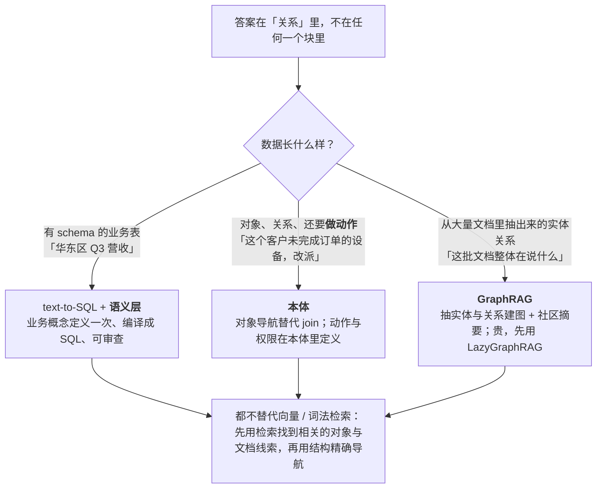

第二篇说三类检索都缺一样东西：**关系**。embedding 是向量空间里的点，"近"是相似不是"调用"、"属于"、"下单"；grep 能找到字面出现的地方但分不清定义与引用。"这个客户去年的投诉涉及哪些产品"、"改这个接口会影响哪些服务"、"这批文档整体在说什么"——这些问题的答案在**结构**里，不在任何一个块里。本篇讲三种把结构交给模型的方式：**SQL**（有 schema 的业务数据）、**本体**（对象、关系、动作与权限的统一模型）、**图**（从文档抽取的实体关系与社区摘要）。

三者解决的问题不同、成本差几个量级。text-to-SQL 在 demo 上很好、在企业真实 schema 上准确率只有两成左右——不是模型不够聪明，是列名不可读、业务规则隐含、多表关系没人告诉它；解法是语义层。本体走得更远：它不只让模型**查**对象，还定义模型能对对象做什么**动作**、需要什么权限——Palantir 的 Ontology 与其上的 AIP 是代表，它不是检索技术，是业务世界的 harness（L4 会从 agent 的角度再讲一次）。GraphRAG 回答向量检索答不了的全局性问题（"这批文档的主要主题"），代价是建图时对全部文档跑一遍模型。

本篇要回答的核心问题是：

> **text-to-SQL 的真实水平如何、为什么需要语义层？[^q0] 本体解决的是什么问题、为什么说它是 harness 而不是检索？[^q1] GraphRAG 什么时候值得、成本多少、LazyGraphRAG 改了什么？[^q2]**

## 一、总览

### 1. 三种结构化接入




| | SQL / API + 语义层 | 本体 | 图（GraphRAG 一类） |
|---|---|---|---|
| 知识形态 | 已有 schema 的业务数据库 | 业务对象、属性、关系、**动作**、权限的统一模型 | 从非结构化文档抽取的实体、关系、社区摘要 |
| 回答的问题 | 聚合、过滤、join："华东区 Q3 逾期订单金额" | 对象导航 + 动作："给这个客户的这笔订单改派仓库"（有校验、有权限） | 全局与关系："这 2,000 份报告的主要风险主题"、"A 与 B 通过谁关联" |
| 模型做什么 | 生成查询（对语义层而不是裸表） | 在本体上导航、调用动作 | 遍历图、读社区摘要、综合 |
| 建设成本 | 语义层：几十到几百个业务概念的定义 | 高：建模全部核心对象与动作，是企业级项目 | 建图：全部文档过一遍模型（抽实体关系）+ 社区检测 + 摘要；LazyGraphRAG 把大部分推到查询时 |
| 更新 | 数据实时；语义层随业务变 | 对象实时；模型随业务变 | 文档变了要重抽、重聚类 |
| 代表 | 语义层工具（dbt semantic layer、Cube 一类）；各家 text-to-SQL | Palantir Foundry Ontology / AIP | Microsoft GraphRAG、LazyGraphRAG、LightRAG |

### 2. 本文的章节安排

第二章 text-to-SQL 的真实水平与语义层；第三章本体——它是什么、解决什么、为什么是 harness；第四章 GraphRAG——机制、成本、LazyGraphRAG、什么时候值得；第五章三者与前两类检索的组合；第六章实践建议。

## 二、text-to-SQL 与语义层

### 1. 真实水平

在学术基准 Spider（单库、干净 schema、短查询）上前沿模型早已接近饱和；在 **Spider 2.0** 一类企业级基准上——真实的云数据仓库、几百张表、列名像 `cust_stat_cd`、查询要几十行、涉及窗口函数与方言——前沿模型的准确率只有两成左右。差距不在 SQL 语法，在**知道该查什么**：

- **列名不可读**：`cust_stat_cd = 'A'` 是"活跃客户"，没人告诉模型；
- **业务规则隐含**："营收"要排除退款与内部转账，写在某个 BI 报表的 SQL 里而不在 schema 里；
- **多表关系**：客户到订单要经过三张中间表，外键没有声明；
- **同名异义**：`amount` 在五张表里含义不同；
- **方言与性能**：一条对的 SQL 可能全表扫描几十亿行。

让模型直接对裸 schema 生成 SQL，等于让一个新员工第一天就写报表——他会写出语法正确、业务错误的查询。

### 2. 语义层

解法是在裸表之上放一层**业务概念的定义**：

```text
指标   营收 = SUM(orders.amount) WHERE status = 'paid' AND type != 'internal'
维度   区域 = customers.region（华东 / 华北 / …）
维度   时间 = orders.paid_at 按日 / 周 / 月 / 季
实体   活跃客户 = customers WHERE cust_stat_cd = 'A' AND last_order_at > now() - 90d
关系   客户 →(1:n) 订单 →(1:n) 订单行 →(n:1) 产品
```

模型对**语义层**生成查询（"华东区 Q3 营收" → 指标 × 维度 × 过滤），语义层编译成 SQL——业务规则写一次、对所有查询生效、可审查、可版本化。dbt 的 semantic layer、Cube、各 BI 工具的指标层都是这一类；没有现成工具时，一份几十个概念的 YAML 加一个编译器也能起步。语义层还是**权限**的落点：哪些指标哪些角色能看，在这里定义，模型无法绕过。

### 3. 检索的角色

几百张表、几千个指标时，模型不能把整个语义层放进上下文（L2 的预算）。检索在这里的任务是**找到相关的概念**——对指标与维度的名字、描述、同义词做词法 + 向量检索（第四篇），取 top-10 放进上下文，再让模型组合。这是"检索找对象、结构化查数据"的模式，第五章展开。

### 4. 验证

生成的查询在执行前要过：语法检查、只读权限、行数与成本上限（EXPLAIN 估算）、超时；执行后把结果（截断）与 SQL 一起给模型，让它检查结果是否合理（空结果、量级异常）——这是 L4 工具调用循环的一个实例。评测集是（问题，正确 SQL 或正确结果）对，从真实的 BI 查询里采。

## 三、本体

### 1. 是什么

本体（ontology）把企业的业务世界建成一个统一模型：**对象类型**（客户、订单、设备、工单）及其**属性**，对象之间的**关系**（客户拥有订单、订单关联设备），每类对象允许的**动作**（改派、审批、下单、关闭工单）及动作的**校验规则**与**权限**。数据来自底层的多个系统（ERP、CRM、MES），本体是它们之上的一层语义与操作模型。Palantir Foundry 的 Ontology 是最完整的商业实现，其上的 AIP 让 agent 在本体上工作。

### 2. 它解决什么

与 SQL + 语义层比，本体多了两样东西：

- **对象导航替代 join**："这个客户的未完成订单的设备"是沿关系走三步，不是写 join；模型看到的是对象与关系，不是表。
- **动作**：模型不只查，还能做——但只能做本体定义的、有类型、有校验、有权限的动作，不能碰裸 API 或裸表。"给订单 #123 改派到华东仓"是一个动作，它检查订单状态允许改派、华东仓有库存、发起人有权限，然后落库并记审计。

第二样是本体在 agent 时代重新流行的原因：**它把"agent 能做的错事"结构性地压小了**。L1 第一篇的越界问题（PocketOS 的删库）在本体里不会发生——没有"删除卷"这个动作，或者它要求审批。这就是应用地图把本体列为业务侧 harness 案例的理由：它做的事与 coding agent 的沙箱、权限模型、验证循环一一对应，只是对象从文件变成了业务实体。L4 会从 agent 运行时的角度再讲一次。

### 3. 与检索的关系

本体**不是检索技术**：它不替代向量检索非结构化文档、不替代 grep 找代码。它是结构化数据与动作的统一入口。三者的组合：向量 / 词法检索找到相关的文档与对象线索，本体导航到精确的对象与关系，动作在本体上执行。

### 4. 代价

建本体是企业级项目：要建模核心对象、对齐多个源系统、定义动作与权限、持续维护。多数团队不会从零建一个完整本体；务实的做法是从语义层起步（第二章），对最核心的两三类对象加上关系导航与动作定义——这已经是一个"小本体"，足以让 agent 安全地做业务操作。

## 四、GraphRAG

### 1. 它回答什么

向量检索回答"哪几段最像这个问题"，答不了两类问题：**全局性**（"这 2,000 份事故报告的主要风险类别是什么"——答案不在任何一段里，在全部文档的聚合里）与**多跳关系**（"公司 A 与公司 B 通过哪些人或机构关联"——要沿实体关系走）。GraphRAG（Microsoft，2024 年 7 月）的做法：

1. **抽取**：让模型读每个块，抽出实体（人、组织、地点、概念）与关系（A 收购 B、C 任职于 D），建图；
2. **社区检测**：对图做层次聚类（Leiden 算法），得到多个层级的"社区"；
3. **社区摘要**：让模型为每个社区写摘要；
4. **查询**：全局问题用社区摘要（map-reduce：每个摘要回答一部分再综合），局部问题沿实体与关系取邻域加原文块。

### 2. 成本

建图要对**全部文档跑一遍模型**抽实体关系，再为每个社区跑一遍摘要——索引成本是普通向量索引的几十到几百倍（每个块一次生成调用，而不是一次 embedding）。百万 token 的语料几十美元，千万 token 几百到几千美元，且文档更新要重抽、重聚类。这是 GraphRAG 没有成为默认的原因。

### 3. LazyGraphRAG 与轻量变体

Microsoft 2024 年 11 月的 **LazyGraphRAG** 把大部分工作推到查询时：索引阶段只做便宜的实体抽取（NLP 方法而不是模型）与社区结构，不预生成摘要；查询时先用向量 / 词法检索找相关块，再沿图扩展、按需让模型摘要——索引成本降到接近普通向量索引，全局问题的质量接近完整 GraphRAG。LightRAG 一类开源变体走类似的路：双层检索（实体级 + 关系级）加轻量图。判断方向：**图的价值在查询时的遍历，不一定要在索引时把一切都算好**。

### 4. 什么时候值得

| 场景 | 值得吗 |
|---|---|
| 定位型问答（"退货政策是什么"） | 不值得——向量 + 混合 + rerank 够了 |
| 全局综合（"这批报告的主题分布"、"总结这个领域一年的进展"） | 值得——向量做不了 |
| 多跳关系（"A 与 B 的关联路径"） | 值得——或者如果关系本来就在结构化数据里，用 SQL / 本体更便宜 |
| 语料小（几百份文档） | 全放上下文（L2 第六篇）或让模型多轮读，不必建图 |
| 语料频繁变 | LazyGraphRAG 一类，避免重抽 |

一个常见的误判是为定位型问答建图——花几千美元建了图，查询走的还是向量路径。先用第七篇的评测集看有多少问题是全局或多跳的，比例低就不建。

## 五、组合

### 1. 检索找对象，结构化查数据

最通用的模式：用户的自然语言问题先经向量 / 词法检索找到**相关的概念、对象或实体**（哪个指标、哪个客户、哪个函数），再用结构化查询（SQL、本体导航、LSP、图遍历）拿到精确的数据与关系，最后把结构化结果（表格、对象列表、路径）作为上下文给模型生成回答。三类检索各做擅长的一段。

### 2. 结构化结果怎么进上下文

结构化查询的结果是表格或对象列表，直接塞进上下文有两个问题：量（一万行）与形式（模型读 CSV 不如读 markdown 表）。做法：截断加聚合（前 20 行 + 总行数 + 关键统计）、markdown 表或紧凑 JSON、字段名用业务名而不是列名、大结果卸载到文件留引用（L2 第四篇）。让模型看"华东区 Q3 营收 1.2 亿，同比 +8%，前五客户如下表"，而不是一万行原始订单。

### 3. 在 agentic 检索里

第五篇的工具集加上 `sql(question)`（对语义层）、`ontology.navigate(object, relation)`、`graph.neighbors(entity)`——模型按问题选：自然语言找文档用向量，精确数用 SQL，关系用本体或图。工具描述要把这三类的适用说清（"sql：查客户、订单、营收等业务数据的精确数值与聚合；不用于查制度文档"）。

## 六、实践建议

1. **不要对裸 schema 做 text-to-SQL**：先为最常查的 20–50 个指标、维度、实体写语义层（YAML 即可），模型对它生成查询；权限定义在语义层。
2. **生成的 SQL 过四道门**：语法、只读、成本上限、超时；结果回模型自检。
3. **从"小本体"起步**：对两三类核心对象定义关系导航与有校验、有权限的动作，让 agent 只能通过动作改数据——这是 L4 权限模型在业务侧的落点。
4. **建图前先数问题**：在评测集里标出全局 / 多跳问题的比例，低于一成不建；要建优先 LazyGraphRAG 一类查询时计算的方案。
5. **结构化结果先聚合再进上下文**：截断、统计、业务字段名、markdown 表、大结果卸载。
6. **三类做成工具**，描述里写清各自查什么。

## 七、本文小结

- 关系在结构里不在块里；三种结构化接入：SQL + 语义层（聚合与过滤）、本体（对象导航 + 有校验有权限的动作）、图（全局综合与多跳关系）。
- text-to-SQL 在企业级基准（Spider 2.0 一类）上只有两成左右，原因是列名不可读、规则隐含、关系未声明、同名异义；解法是语义层——业务概念写一次、模型对它生成查询、权限在这里定义；概念多时用检索找相关概念；生成的查询过语法 / 只读 / 成本 / 超时四道门。
- 本体是业务世界的 harness：对象、属性、关系、动作、校验、权限的统一模型，agent 只能做本体定义的动作，把"能做的错事"结构性压小；它不是检索技术，与向量 / 词法检索组合；从语义层加两三类对象的动作起步。
- GraphRAG：抽实体关系建图 → Leiden 社区检测 → 社区摘要 → 全局问题 map-reduce、局部问题邻域；索引成本是向量索引的几十到几百倍；LazyGraphRAG 把摘要推到查询时降成本；只在全局 / 多跳问题比例可观时建。
- 组合模式：检索找对象，结构化查数据，结果聚合后进上下文；三类做成 agent 的工具。

## 八、自测

1. 前沿模型在 Spider 上接近满分，为什么在企业数据仓库上只有两成？给出四个原因与统一的解法。

   <details markdown="1"><summary>答案</summary>
   列名不可读（`cust_stat_cd`）、业务规则隐含（营收要排除退款，写在报表 SQL 里不在 schema）、多表关系未声明（外键缺失、中间表）、同名异义（五张表的 `amount`）——差距在"知道该查什么"不在语法。解法是语义层：把指标、维度、实体、关系用业务概念定义一次，模型对语义层生成查询再编译成 SQL；权限也在语义层。详见[第二章](#二text-to-sql-与语义层)。
   </details>

2. 本体与"SQL + 语义层"多了什么？为什么说这多出来的东西让本体成为 harness？

   <details markdown="1"><summary>答案</summary>
   多了对象导航（沿关系走替代 join）与**动作**（有类型、有校验、有权限的业务操作，落库带审计）。agent 只能通过本体定义的动作改数据，不能碰裸表与裸 API——"能做的错事"被结构性压小，没有"删除卷"这样的动作或它要求审批；这与 coding agent 的沙箱、权限模型、验证循环一一对应，所以是业务世界的 harness，不是检索技术。详见[第三章](#三本体)。
   </details>

3. GraphRAG 的索引成本为什么是向量索引的几十到几百倍？LazyGraphRAG 怎么降的？

   <details markdown="1"><summary>答案</summary>
   建图要让模型读每个块抽实体与关系（每块一次生成调用，而向量索引是一次 embedding），再为每个社区生成摘要（又一轮调用）；文档更新要重抽重聚类。LazyGraphRAG 索引时只做便宜的实体抽取与社区结构、不预生成摘要，查询时先向量 / 词法找相关块、再沿图扩展、按需摘要——把成本推到查询时且只花在被问到的部分，索引成本接近普通向量索引。详见[第四章](#四graphrag)。
   </details>

4. 一个法律知识库 95% 的问题是"某条规定是什么"，团队计划建 GraphRAG。评价。

   <details markdown="1"><summary>答案</summary>
   不值得：定位型问题走向量 + 混合 + rerank 已足够，建图花几千美元后查询仍走向量路径。只有全局综合（"这批判决的主要争议类型"）与多跳关系问题需要图；先用评测集数比例，低于一成不建，要建优先 LazyGraphRAG。详见[第四章](#四graphrag)。
   </details>

5. 用"检索找对象，结构化查数据"的模式设计"华东区去年投诉最多的三个产品的退货政策"这个问题的处理路径。

   <details markdown="1"><summary>答案</summary>
   （1）检索：从问题里识别"投诉"、"产品"、"退货政策"对应的语义层概念与文档类型；（2）结构化：对语义层生成查询——华东区、去年、按产品聚合投诉数、取前三（SQL 或本体导航：区域 → 客户 → 工单（投诉）→ 产品）；结果聚合成三行的小表；（3）检索：对这三个产品名做向量 + 词法检索找退货政策条款（第四篇）；（4）把小表与条款块作为上下文生成回答，引用条款编号。三类各做一段。详见[第五章](#五组合)。
   </details>

## 下一篇

[检索评测与运营](/retrieval-evaluation-and-operations.html)

[^q0]: 学术基准 Spider 已饱和，企业级的 Spider 2.0 一类（真实数仓、几百张表、不可读列名、几十行查询、方言）上前沿模型只有两成左右——差距在"知道该查什么"：列名不可读、业务规则隐含在报表 SQL 里、多表关系未声明、同名异义、性能与方言。语义层在裸表之上定义业务概念——指标（营收 = SUM(amount) WHERE paid AND not internal）、维度、实体（活跃客户）、关系（客户 → 订单 → 订单行 → 产品）——模型对语义层生成查询再编译成 SQL，规则写一次、可审查、可版本化，权限也定义在这里；概念多时用词法 + 向量检索找相关概念再组合；生成的查询过语法、只读、成本上限、超时四道门，结果回模型自检；评测集从真实 BI 查询采。详见[第二章](#二text-to-sql-与语义层)。

[^q1]: 本体是业务世界的统一模型：对象类型与属性、对象间关系、每类对象允许的动作及其校验规则与权限，数据来自多个源系统。它比 SQL + 语义层多了对象导航（沿关系走替代 join）与动作（有类型、有校验、有权限、带审计的业务操作）。它是 harness 而不是检索：agent 只能做本体定义的动作、不能碰裸 API 与裸表，"能做的错事"被结构性压小（没有"删除卷"这个动作或它要求审批）——与 coding agent 的沙箱、权限、验证循环一一对应；它不替代向量检索文档或 grep 找代码，三者组合使用。Palantir Foundry Ontology / AIP 是代表；建完整本体是企业级项目，务实的起步是语义层加两三类核心对象的关系与动作。详见[第三章](#三本体)。

[^q2]: 值得的场景：全局综合（"这批报告的主题分布"——答案在全部文档的聚合里）与多跳关系（"A 与 B 的关联路径"）；定位型问答不值得，关系已在结构化数据里的用 SQL / 本体更便宜，语料小的全放或多轮读，先在评测集里数全局 / 多跳问题比例。成本：建图要模型读每块抽实体关系 + Leiden 社区检测 + 每社区生成摘要，索引成本是向量索引的几十到几百倍（百万 token 几十美元、千万 token 几百到几千），更新要重抽重聚类。LazyGraphRAG（2024-11）索引时只做便宜的实体抽取与社区结构、不预生成摘要，查询时先向量 / 词法找块再沿图扩展按需摘要，索引成本接近向量索引、全局问题质量接近完整 GraphRAG；LightRAG 一类轻量变体同向——图的价值在查询时的遍历。详见[第四章](#四graphrag)。
