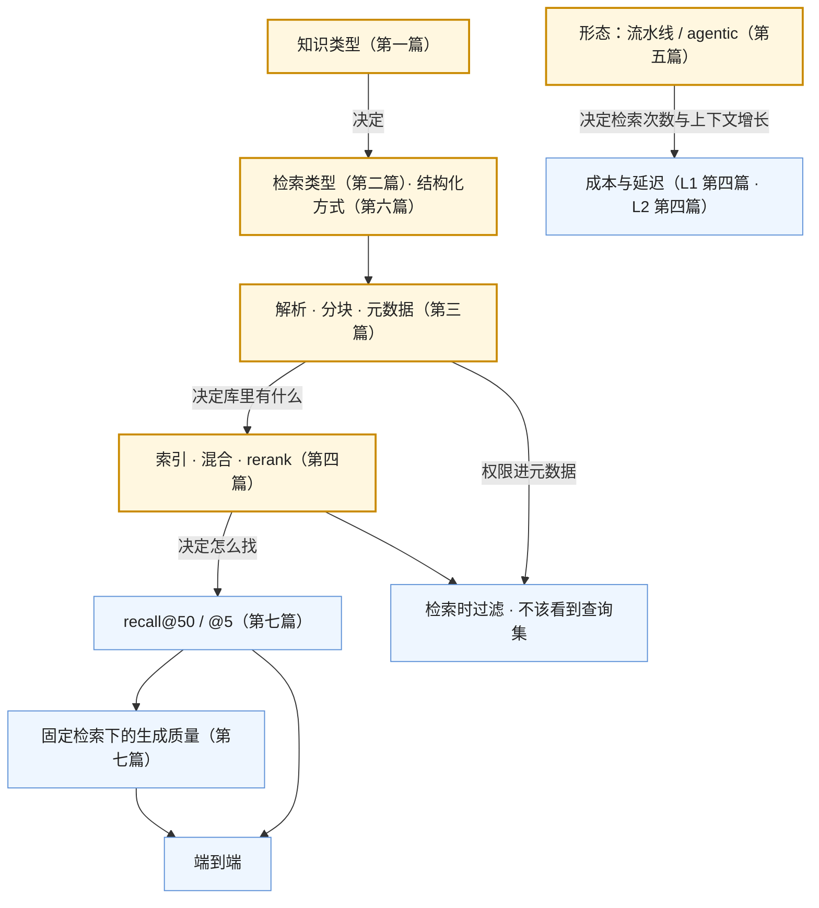

七篇正文回答了一个问题：**私域知识怎么进入模型**。第一篇决定路（进上下文还是进权重），第二篇选检索的类型（词法、向量、结构化），第三、四篇讲流水线的两段（解析分块、索引混合 rerank），第五篇讲从流水线到 agentic，第六篇讲结构化知识（SQL、本体、图），第七篇讲怎么评、怎么运营。七篇合起来是[《AI 应用工程师学习地图》](/ai-application-engineer-learning-roadmap.html)第三层：把"让模型知道我们的业务"变成一组**可选择、可实现、可评测**的接入方式。

本文不讲新内容：一张总表与七段回顾，贯穿七篇的四条线，常见误区，然后是三段式通关自测——判断与计算、跨篇综合、面试题。

> **读完这七篇，你应该能回答哪些问题？[^q0] 哪些数字与结论必须能脱口而出？[^q1] 怎么判断自己是"读过"还是"掌握"了？[^q2]**

## 一、总览：系列回答的问题与主线

系列的一句话主张是：**事实进上下文、行为进权重；检索有三类按前提选、失败大多在检索之前；检索与生成分开评**。

| 篇 | 回答的问题 | 一句话结论 | 必记的数字 / 结论 |
|---|---|---|---|
| [第一篇：进上下文还是进权重](/knowledge-in-context-or-in-weights.html) | 知识该进哪里？ | 微调不是灌知识的工具（不可靠、遗忘、不可引用、不可更新与过滤）；知识类型表六行；默认顺序 prompt → few-shot → 检索 / 工具 → 微调 → 继续预训练，每步在评测集上证明前一步不够 | *Fine-Tuning or Retrieval?*：检索显著优于微调；四问（会变？有 schema？要引用？按用户不同？）任一为是不进权重；RAFT 微调"怎么用检索" |
| [第二篇：三类检索](/three-kinds-of-retrieval-lexical-vector-structured.html) | 用 grep、向量还是 SQL？ | 按前提选：词法三前提（精确标识符、可枚举、能迭代）；向量解决词汇不匹配；结构化独占关系；coding agent 的分歧是过期税由写路径还是读路径付 | Claude Code 放弃向量库、Anthropic"从 agentic 搜索开始"；Cursor Merkle 树 + 块哈希缓存 + turbopuffer；Cody 5.3 移除 embedding；embedding 是点不是边 |
| [第三篇：解析与分块](/document-parsing-and-chunking-for-retrieval.html) | 检索失败的上游在哪？ | 三个梯级（规则 → 布局模型 → VLM）先低后高；三个静默失败（阅读顺序、表格、页眉页脚）；按结构切、父子块；contextual retrieval；权限进元数据 | PaddleOCR-VL-1.6 0.9B 参数 OmniDocBench 96.34 > Gemini 3 Pro 92.91 > GPT-5.2 86.59；Mistral OCR 4 每千页 \$4；Anthropic 失败率 −49% / −67%；块 200–800 token |
| [第四篇：索引、混合与 rerank](/indexing-hybrid-search-and-reranking.html) | 怎么存、怎么找？ | MTEB 缩范围自己的查询集决定，换模型 = 全量重建；百万级 HNSW + 现有数据库；BM25 + 向量用 RRF；rerank 性价比最高；权限在召回时过滤 | Qwen3-Embedding-8B 70.58；Gemini Embedding 2K vs Cohere v4 128K；RRF $$k = 60$$；top-50 → RRF → top-20 → rerank → top-5 |
| [第五篇：流水线到 agentic](/from-rag-pipelines-to-agentic-retrieval.html) | 一次检索还是让模型自己查？ | 流水线可预测、召回压力高、无多跳；agentic 召回压力低、多跳、成本不定；中间有改写 / HyDE / 多查询 / 路由 / 自检；最常见是级联 | 工具返回摘要 + 引用不返全文；步数上限必配；内置 file search 是服务端工具，失去权限与分块控制 |
| [第六篇：结构化知识](/structured-knowledge-sql-ontology-and-graphrag.html) | 关系在哪里？ | text-to-SQL 企业级只有两成，用语义层；本体 = 对象 + 关系 + 动作 + 权限，是 harness 不是检索；GraphRAG 答全局与多跳，索引贵几十到几百倍，LazyGraphRAG 推到查询时 | Spider 2.0 两成左右；四道门（语法、只读、成本、超时）；全局 / 多跳比例低于一成不建图 |
| [第七篇：评测与运营](/retrieval-evaluation-and-operations.html) | 好不好、怎么维持？ | 没找到 vs 找到了没说对分开评；固定检索评生成；评测集从真实查询采；在线信号带 trace；新鲜度与重建预算；权限泄漏是评测项 | recall@50 / @5 分层；judge 一致率 ≥ 85%；50–100 条起；Slack AI 跨权限注入、Copilot 暴露 SharePoint 权限债 |

### 1. 本文的章节安排

| 章 | 内容 |
|---|---|
| 二 | 逐篇回顾 |
| 三 | 贯穿七篇的四条线 |
| 四 | 常见误区表 |
| 五 | 通关自测：A 判断与计算 10 题、B 跨篇综合 5 题、C 面试题 7 题、D 掌握判据 |
| 六 | 下一步 |

## 二、逐篇回顾

### 1. 第一篇：进上下文还是进权重

**核心问题**：为什么微调不是灌知识的工具？哪些知识进哪里？默认顺序与代价？

**结论**：四个技术原因（不可靠、遗忘、不可引用、不可更新与过滤）加微软的对比实验；微调擅长行为（风格、格式、术语、工具调用模式）。决策表六行：会变的事实 → 检索 / 工具；结构化数据 → SQL / API / 本体；非结构化文档 → 检索；术语 → few-shot 再微调；流程 → 示例 + 工具再 SFT；海量领域语料 → 继续预训练 + 检索。默认顺序每步代价上一个量级，每步要在评测集上证明前一步不够；微调的正确位置是末端的行为优化（RAFT、微调 embedding / rerank）。

**必记**：事实进上下文、行为进权重；四问；多数应用停在第三步。

**常见误解**：SFT 能记住事实；跳过 few-shot 与检索直接微调；继续预训练之后不需要检索。

### 2. 第二篇：三类检索

**核心问题**：三类各适合什么？coding agent 为什么分歧？为什么 grep 经验不能搬到企业文档？

**结论**：词法三前提满足时买到零过期、不出机器、透明、无基础设施，付多轮与 token；向量解决词汇不匹配与大规模，付过期、精确匹配差、不透明、基础设施；结构化独占关系（embedding 是点不是边）。coding agent：Claude Code / Codex / Cline / Cody 走 agentic grep，Cursor / Windsurf 索引（Merkle 树、块哈希缓存、turbopuffer）；轴是过期税由写路径还是读路径付，取决于读写比；两个阵营都混合；索引不等于省 token。企业文档三前提都不满足，默认混合 + rerank。

**必记**：三类表；Anthropic 的判断句；读写比；关系查询单走结构化。

**常见误解**："RAG 已死 / 永生"；用向量搜函数名；用 grep 搜企业制度。

### 3. 第三篇：解析与分块

**核心问题**：解析三个梯级？三个静默失败？分块、contextual retrieval、元数据？

**结论**：规则抽取（毫秒、免费）→ 布局模型（Docling / Marker / MinerU，本地）→ VLM（Mistral OCR 4、PaddleOCR-VL——小而专胜前沿通用）；先低后高按文档路由。三个静默失败与检测方法。分块按结构、表格不切断、200–800 token、父子块。结构路径前缀（免费）→ contextual retrieval（−49% / −67%，用缓存控成本）→ late chunking。元数据七项，权限必填且与源 ACL 同步。

**必记**：三梯级表；96.34 / 92.91 / 86.59；\$4 / 千页；三个失败的检测；权限进元数据以便检索时过滤。

**常见误解**：调 OCR API 是默认；固定长度切一切；生成后过滤权限。

### 4. 第四篇：索引、混合与 rerank

**核心问题**：embedding 怎么选？索引与库？混合与 RRF？rerank？权限？更新？

**结论**：候选表（Qwen3 / Gemini / Voyage / Cohere / OpenAI / BGE-M3）；MTEB 版本不可比、二元相关性、聚合分、领域——缩范围，查询集决定；判据加上下文长度、Matryoshka、多模态、版本稳定性（换模型 = 全量重建）。HNSW + 量化到百万级，先用现有数据库；混合 + RRF（$$k = 60$$）不调权重；rerank 只精排 top-20、性价比最高、让 k 从 10 降到 5。权限在两路召回时过滤、过滤下推、与源同步。更新：内容哈希 id、软删除重建窗口、换模型双写切换。

**必记**：路径图；RRF 公式；三步消融（混合、rerank、换模型）的收益顺序；重建的三个触发。

**常见误解**：榜首模型直接用；只上向量；rerank 对全库打分；换模型不重建。

### 5. 第五篇：流水线到 agentic

**核心问题**：两种形态各适合什么？改进手段？agentic 的要求？内置 file search？

**结论**：对比表；渐进路（改写、HyDE、多查询与拆分、元数据路由、自检一轮）；agentic 换到召回压力低、多跳、类型可选，付成本延迟不定、上下文增长、工具描述、循环控制、可预测性低；检索工具的七要素；内置 file search 是服务端工具的取舍；决策三问，最常见是级联。

**必记**：p95 是 p50 的 5–10 倍；摘要 + 引用；步数上限；级联。

**常见误解**：全量 agentic；工具返回全文；内置 file search 有细粒度权限。

### 6. 第六篇：结构化知识

**核心问题**：text-to-SQL 真实水平与语义层？本体是什么？GraphRAG 何时值得？

**结论**：Spider 2.0 两成左右——列名、规则、关系、同名异义；语义层写一次、权限在此、概念多时检索找概念、四道门。本体 = 对象 + 属性 + 关系 + 动作（校验、权限、审计），agent 只能做本体定义的动作——harness 不是检索；从语义层加两三类对象的动作起步。GraphRAG 抽实体关系 → Leiden → 社区摘要 → map-reduce；索引贵几十到几百倍；LazyGraphRAG 推到查询时；全局 / 多跳比例低不建。组合模式：检索找对象、结构化查数据、聚合后进上下文。

**必记**：两成；语义层的五类定义；本体多出的两样；建图前先数问题。

**常见误解**：对裸 schema 做 text-to-SQL；本体是检索技术；为定位型问答建图。

### 7. 第七篇：评测与运营

**核心问题**：分清两种病？评测集？在线信号？运营？权限泄漏？

**结论**：两段评测图；检索侧 recall@k 分层、MRR、nDCG（分级）、消融；生成侧 faithfulness、answer relevance、context precision、引用与拒答正确率，固定检索评生成，三个数字定位；judge 一致率 ≥ 85%。评测集真实采样 50–100 起、每周补、hold-out、版本化。在线信号八项带 trace。运营：新鲜度、重建预算、五项成本、三种漂移。权限泄漏：Slack AI、Copilot；"不该看到"查询集进 CI、ACL 延迟、注入测试、审计日志、上线前审计源权限。

**必记**：三个数字；合成问题高估 recall；检索放大权限错误。

**常见误解**：只评端到端；合成评测集替代真实；权限泄漏是安全团队的事。

## 三、贯穿全系列的几条线

### 1. 先问类型，再问方法

第一篇的知识类型表是入口，第二篇的三类检索按前提选，第六篇的三种结构化按问题类型选，第五篇的两种形态按三问选。每一处决策都是"这份知识 / 这个问题属于哪一类"，方法随类型定。

### 2. 失败在上游

第三篇比第四篇重要：解析与分块决定向量库里有什么，索引参数只决定怎么找。第七篇的分开评把这条线变成可测的：recall@50 低先看解析分块，再看 embedding。

### 3. 权限贯穿每一层

第一篇（权重没有权限概念）、第三篇（权限进元数据）、第四篇（召回时过滤）、第五篇（工具内部按用户过滤、内置 file search 的粒度）、第六篇（语义层与本体是权限的落点）、第七篇（不该看到查询集）。检索系统放大权限错误，所以权限不是某一篇的事。

### 4. 选型同构、评测同源

embedding 与 rerank 的选型（第四篇）与 L1 第五篇的模型选型同一方法：榜单缩范围、自己的集决定、警惕榜单的失真、算隐藏成本（重建）。评测集（第七篇）与 L1 第五篇、L2 第六篇的评测集同源：从真实流量采、几十条起、每周补、hold-out、版本化、作为门禁。

### 5. 概念表

| 概念 | 出处 | 一句话 |
|---|---|---|
| 事实 vs 行为 | 第一篇 | 事实进上下文（可引用、可更新、可过滤），行为进权重 |
| 四问 | 第一篇 | 会变？有 schema？要引用？按用户不同？任一为是不进权重 |
| 词法三前提 | 第二篇 | 精确标识符、可枚举、能迭代 |
| 过期税 | 第二篇 | 索引付在写路径，agentic 付在读路径；看读写比 |
| 点 vs 边 | 第二篇 | embedding 是相似不是关系；关系归结构化 |
| 三个梯级 | 第三篇 | 规则 → 布局模型 → VLM，先低后高 |
| 三个静默失败 | 第三篇 | 阅读顺序、表格、页眉页脚 |
| contextual retrieval | 第三篇 | 每块前置位置与含义说明，−49% / −67% |
| 父子块 | 第三篇 | 小块检索、大块返回 |
| RRF | 第四篇 | $$\sum 1/(k + \text{rank})$$，只按排名融合 |
| rerank | 第四篇 | cross-encoder 精排 top-20，性价比最高，降 k |
| 召回时过滤 | 第四篇 | 权限进查询、过滤下推、与源同步 |
| 双写切换 | 第四篇 | 换 embedding / 分块 / 前缀的全量重建流程 |
| 级联 | 第五篇 | 流水线默认、agentic 兜底 |
| 语义层 | 第六篇 | 业务概念写一次、模型对它生成查询、权限落点 |
| 本体 | 第六篇 | 对象 + 关系 + 动作 + 权限，业务世界的 harness |
| LazyGraphRAG | 第六篇 | 图的价值在查询时遍历，索引不必算好一切 |
| 分开评 | 第七篇 | recall@k / 固定检索下的生成 / 端到端三个数字 |
| 不该看到查询集 | 第七篇 | 权限泄漏作为评测项进 CI |

## 四、常见误区

| 误区 | 为什么错 | 出处 |
|---|---|---|
| "把手册 SFT 进模型就学会了" | SFT 学分布不学事实；编造、遗忘、不可引用、不可更新 | 第一篇 |
| "prompt 调不好就微调" | 跳过 few-shot 与检索；微调是末端的行为优化 | 第一篇 |
| "RAG 就是向量库" | 三类之一；词法与结构化各有领地 | 第二篇 |
| "Claude Code 不用向量库所以向量检索过时了" | 代码满足词法三前提，企业文档不满足 | 第二篇 |
| "向量索引比 grep 省 token" | 检索结果作为上下文进每轮，噪声多时更费；看精确度 | 第二篇 |
| "用向量库找'谁调用了这个函数'" | embedding 是点不是边；用 LSP / 图 | 第二篇 |
| "直接调 OCR API" | 开放文档 VLM 更准更便宜，先规则抽取按需升级 | 第三篇 |
| "固定长度切一切" | 切断函数、条款、表格；按结构切 | 第三篇 |
| "生成后过滤权限" | 模型已看到；权限进元数据、召回时过滤 | 第三、四篇 |
| "MTEB 榜首直接用" | 版本不可比、二元相关性、领域；查询集决定；换模型全量重建 | 第四篇 |
| "只上向量就够" | 精确匹配抓不住；BM25 + RRF 是默认 | 第四篇 |
| "rerank 太慢不要" | 只精排 top-20，几十到几百毫秒，且降 k 省钱 | 第四篇 |
| "全部改成 agentic" | 成本延迟不定；级联——流水线默认、agentic 兜底 | 第五篇 |
| "检索工具返回全文" | 上下文爆炸；摘要 + 引用，全文另取 | 第五篇 |
| "对裸 schema 做 text-to-SQL" | 企业级两成；语义层 | 第六篇 |
| "本体是一种检索" | 它是 harness：动作 + 权限 | 第六篇 |
| "上 GraphRAG 提升 RAG 效果" | 只对全局 / 多跳有用；索引贵几十到几百倍 | 第六篇 |
| "只看端到端准确率" | 分不清检索还是生成；三个数字 | 第七篇 |
| "合成评测集就够了" | 措辞贴合原文高估 recall；真实查询决定 | 第七篇 |
| "权限泄漏是安全团队的事" | 检索放大权限错误；不该看到查询集进 CI | 第七篇 |

## 五、通关自测

### A. 判断与计算（10 题）

1. 判断：把每周更新的价格表 SFT 进模型，比接工具查系统更省。

   

答案

   错。每周重训加回归远贵于一次工具调用，且价格会被编造、不可引用；会变的事实永远不进权重。
   

2. 判断：Claude Code 的代码搜索工具里没有向量检索。

   

答案

   对（就公开的工具列表而言：Glob、Grep、LSP）。团队公开说从向量库起步后放弃；Anthropic 建议从 agentic 搜索开始。
   

3. 计算：RRF（$$k = 60$$），文档 A 向量路第 2、BM25 路第 4；文档 B 只在向量路第 1。谁高？

   

答案

   A：$$1/62 + 1/64 \approx 0.01613 + 0.01563 = 0.03176$$；B：$$1/61 \approx 0.01639$$。A 高——两路都出现胜过一路第一。
   

4. 判断：PaddleOCR-VL-1.6 在 OmniDocBench 上的分数低于 GPT-5.2。

   

答案

   错。96.34 vs 86.59（Gemini 3 Pro 92.91）；0.9B 的开放模型更高。
   

5. 计算：一次问答进上下文 10 块 × 600 token，Sonnet 5 输入 \$2 / 百万，每天 20,000 次。加 rerank 后降到 5 块，每次 rerank 成本 \$0.0005。每天省多少？

   

答案

   原：6,000 × 2 / 10⁶ = \$0.012 / 次 → \$240 / 天。后：3,000 × 2 / 10⁶ + 0.0005 = \$0.0065 / 次 → \$130 / 天。省 \$110 / 天（且质量通常更好）。
   

6. 判断：Anthropic 的 contextual retrieval 是把整篇文档过长上下文 embedding 模型再按块池化。

   

答案

   错。那是 late chunking。Contextual retrieval 是让模型为每块生成一段位置与含义说明前置到块上再 embedding + BM25。
   

7. 判断：内置 file search（OpenAI / Gemini）能按每个用户的细粒度 ACL 过滤。

   

答案

   错（就多数实现而言）。以文件集合为粒度；细粒度要按权限组建不同集合或自建流水线在召回时过滤。
   

8. 计算：常驻层 15K、每轮检索工具返回全文 8K、输出 300，200K 窗口预留 35K。agentic 检索大约第几轮触顶？改为摘要 + 引用（每轮 1.5K）呢？

   

答案

   触发线 165K。$$15{,}000 + (k-1) \times 8{,}300 \ge 165{,}000 \Rightarrow k - 1 \ge 18.1$$，约第 20 轮。摘要后每轮 1,800：$$k - 1 \ge 83.3$$，约第 85 轮。
   

9. 判断：GraphRAG 的索引成本与普通向量索引在同一量级。

   

答案

   错。每块一次生成调用抽实体关系加每社区一次摘要，是向量索引（每块一次 embedding）的几十到几百倍；LazyGraphRAG 才把它降到接近。
   

10. 判断：端到端准确率下降时，先看 recall@5 是否下降。

    

答案

    对（作为三个数字之一）。recall@5 掉了是检索问题；不掉再看固定检索下的生成质量；两者之差是检索损失。
    

### B. 跨篇综合（5 题）

1. 一个制造企业要做"设备维修助手"：知识源有维修手册 PDF（扫描件为主，大量表格）、设备台账与工单数据库、老师傅的经验总结、每天更新的备件价格。为每个源选接入方式与检索类型，说明解析梯级与权限处理。

   

答案

   维修手册：非结构化、扫描件 → 检索，解析用梯级 ③（VLM：Mistral OCR 4 或自托管 PaddleOCR-VL），表格一表一块，按章节结构切，结构路径前缀，向量 + BM25 + rerank，元数据带设备型号与权限。设备台账与工单：结构化 → SQL + 语义层（"近 30 天故障率"等概念），或小本体（设备 → 工单 → 备件，动作如"创建工单"带权限）。老师傅经验：非结构化文本，量小 → 检索（或小而稳定时全放上下文配缓存，L2 第六篇）；术语（"跳机"）做 few-shot 术语表。备件价格：每天变 → 工具查系统，不入索引。agentic 形态：三类做成工具（search_manual、sql、read），级联——流水线默认、复杂故障诊断走 agent 循环有步数上限。权限：手册与工单按工厂 / 角色的 ACL 进元数据，召回时过滤，"不该看到"查询集进 CI。
   

2. 一个 RAG 客服系统 recall@50 为 0.92、recall@5 为 0.61、固定检索下 faithfulness 0.95、端到端正确率 0.70。定位问题并给出改法与预期。

   

答案

   召回阶段够（0.92），精排差（0.61）——问题在 rerank（或没有 rerank、或 RRF 后直接取 top-5）；生成侧健康（0.95）。改法：加或换 rerank（Cohere / Voyage / Qwen3-Reranker），在评测集上比 rerank 前后的 recall@5 与 nDCG@5；若已有 rerank 则换模型或检查它是否收到了完整的候选（top-20 而不是 top-5）。预期 recall@5 向 0.85+ 靠近，端到端随之上升；同时可把 k 从 5 保持不变甚至降到 3。不要改 embedding 或分块——召回阶段没有问题。
   

3. 团队从 OpenAI text-embedding-3-large 换到 Qwen3-Embedding-8B 自托管，同时把分块从固定 512 改为按结构切并加 contextual 前缀。列出要做的全部事情与顺序，指出哪一步最容易漏。

   

答案

   （1）先在检索评测集上分别消融：只换模型、只改分块、只加前缀、全改，确认每步的收益（否则不知道哪个起作用）；（2）三个改动都触发全量重建——向量空间变、块边界变、块内容变；（3）评测集的标注块 id 随分块变化失效，要重标或用可映射的 id（最容易漏）；（4）新索引双写、评测通过、灰度切流、旧索引保留；（5）自托管的容量规划（8B 模型的 embedding 吞吐）、版本钉住；（6）配套换 Qwen3-Reranker 一起评；（7）contextual 前缀的生成成本用 prompt caching 控制；（8）权限元数据在新块上完整；（9）更新 L2 的预算（块大小变了）。
   

4. 一个 text-to-SQL 数据分析 agent 在演示数据库上 90% 正确，接入真实数仓后 25%。用第六篇诊断，用第五、七篇设计验证与评测。

   

答案

   诊断：真实数仓的列名不可读、业务规则隐含在报表 SQL 里、多表关系未声明、同名异义——模型不知道该查什么，这与 Spider 2.0 上前沿模型只有两成一致。改：建语义层（最常查的 50 个指标 / 维度 / 实体 / 关系），模型对语义层生成查询，权限在语义层；概念多时先检索相关概念再组合（第五篇的检索找对象）。验证：生成的查询过语法 / 只读 / 成本 / 超时四道门，结果回模型自检（L4 工具循环）。评测：从真实 BI 查询采（问题，正确 SQL 或结果）50–100 条，按执行结果匹配率评，分"找对概念"与"组合正确"两层；在线看零结果率、超时率、用户修改查询的比例。
   

5. 把本系列七篇与 L1 的七条失效模式、L2 的六篇对应起来：检索主要对付哪几条失效？检索结果作为上下文的一层受 L2 哪几篇约束？

   

答案

   失效：幻觉（检索给依据与引用——第三、四、七篇的 faithfulness）、知识截止（会变的事实随时查——第一篇、第五篇的工具）、越界（本体把动作约束住——第六篇）、上下文标称 ≠ 有效（检索让模型只看相关的几块而不是全文——第二篇）。L2 约束：第一篇（检索结果是 ⑤ 层，占多少预算）、第四篇（agentic 检索的返回要卸载、旧结果要清理）、第五篇（检索结果放动态段末尾，否则毁缓存前缀）、第六篇（全放 / 检索 / agentic 的决策表是本系列的入口）、第三篇（元数据路由用结构化输出抽过滤条件）。
   

### C. 面试题（7 题）

1. 产品经理说："我们把公司所有文档微调进模型，就不用 RAG 了。"你怎么回应？

   

答案

   **答案要点**：(1) 微调学的是分布不是事实：SFT 会让模型用同样句式编造训练集外的内容，微软的对比实验里检索显著优于微调；(2) 四个做不到：会遗忘、不可引用（法律责任要求有依据）、不可更新（改一条政策重训）、不可按权限过滤；(3) 决策表：事实进上下文、行为进权重；文档属于非结构化知识 → 检索；(4) 微调的正确位置是末端的行为优化（风格、格式、工具调用），或 RAFT 让模型更会用检索结果；(5) 默认顺序每步在评测集上证明前一步不够。
   **追问方向**：什么情况下微调有意义（术语稳定量大、把调好的 prompt 编译进小模型省 token）；继续预训练之后还要检索吗。
   **好答案与一般答案的区别**：一般答案说"微调贵"；好答案给四个技术原因、引用实验、并指出微调的正确用途。

   

2. 解释 Claude Code 与 Cursor 在代码检索上的架构分歧，并说明这个分歧对企业知识库有什么启示。

   

答案

   **答案要点**：(1) Claude Code / Codex / Cline / Cody 5.3：agentic grep + LSP，无索引；Anthropic 说从向量库起步后放弃，"语义搜索更快但更不准、更难维护、更不透明"；(2) Cursor / Windsurf：语法块 embedding + Merkle 树同步 + 块哈希缓存 + 远端向量库；(3) 轴是过期税由写路径还是读路径付，看读写比；两个阵营都混合；(4) 代码满足词法三前提（精确标识符、可枚举、能迭代），企业文档不满足（词汇不匹配、语料大、单次问答）——不能照搬，企业文档默认向量 + BM25 + rerank；(5) 两者都缺关系：embedding 是点不是边，关系归 LSP / SQL / 本体。
   **追问方向**：索引是否省 token（不一定）；什么时候代码也该建索引（超大仓库、词汇不匹配查询、读写比高）。
   **好答案与一般答案的区别**：一般答案说"各有优劣"；好答案说出三前提、过期税与读写比、以及"点 vs 边"。

   

3. 设计一条企业文档的入库流水线，说明每一步的选择依据与质量检测。

   

答案

   **答案要点**：(1) 变更检测（webhook / 轮询）→ 解析：先梯级 ① 规则抽取，检测失败信号（连贯性抽检、表格计数、重复行）后路由到 ② Docling 一类，扫描 / 公式 / 密集表格走 ③（自托管 PaddleOCR-VL 或 Mistral OCR 4，按成本与出域）；(2) 分块：按结构（标题层级、条款、代码边界），表格不切断，200–800 token，父子块；(3) 前缀：结构路径（免费）+ 高价值语料 contextual retrieval（缓存控成本）；(4) 元数据：来源、位置、时间、类型、语言、**权限（与源 ACL 同步）**、置信度，无权限不入库；(5) 索引：embedding（钉版本）+ BM25 双写，块 id 内容哈希，软删除与重建窗口；(6) 监控：新鲜度、解析失败率、零结果率；(7) 评测：检索评测集 recall@50 / @5，"不该看到"查询集。
   **追问方向**：换 embedding 模型怎么切（双写）；权限同步断了怎么发现（ACL 延迟监控 + 不该看到测试）。
   **好答案与一般答案的区别**：一般答案列步骤；好答案每步给选择依据（梯级路由、按结构切）与检测手段（三个静默失败、权限测试）。

   

4. 为什么 rerank 是 RAG 流水线里性价比最高的一步？它不能做什么？

   

答案

   **答案要点**：(1) 双塔 embedding 让查询与文档独立编码、无交互，为了能预计算；cross-encoder 把（查询，文档）一起过模型、有交互、精确得多，但不能预计算；(2) 所以只用于 top-20 的精排，几十到几百毫秒；(3) 收益：精度明显提升（Anthropic：失败率 −49% → −67%），且让进上下文的块从 10 降到 5，直接省 L2 预算与 L1 的钱，很多团队发现它的提升大于换 embedding；(4) 不能做：全库打分（不可行）、补救召回没捞到的文档（recall@50 低它无能为力）、替代权限过滤；(5) agentic 检索里收益变小（模型自己多轮筛）。
   **追问方向**：怎么评（recall@5 / nDCG@5 前后对比，分级标注）；ColBERT 式晚交互的位置。
   **好答案与一般答案的区别**：一般答案说"更准"；好答案解释双塔 vs cross-encoder 的交互差异、给数字、说出降 k 的经济含义与它的边界。

   

5. 什么时候该把检索从流水线改成 agentic？改了之后系统要多做什么？

   

答案

   **答案要点**：(1) 三问：问题形态多变、需要多跳、可接受不定的成本延迟 → agentic；稳定、单跳、要可预测 → 流水线加改写 / HyDE / 多查询 / 路由 / 自检；(2) 最常见是级联：流水线默认、自检不够时升级到有步数上限的 agent 循环；(3) 多做的：三类检索做成工具且描述写清适用；工具返回摘要 + 引用不返全文、有上限、暴露过滤、内部做权限、失败给建议、缓存；上下文的卸载与清理（L2）；步数与 token 上限、循环检测（L4）；trace 每轮查了什么（L5）；成本按任务看 p50 / p95。
   **追问方向**：内置 file search 能不能用（原型可以，权限与控制不行）；agentic 下 rerank 还要不要（轻量即可）。
   **好答案与一般答案的区别**：一般答案说"复杂问题用 agent"；好答案给三问、级联、工具七要素与运行时的四项配套。

   

6. 一家银行要让 agent 能查询并操作客户账户信息。你会用检索、语义层、还是本体？为什么？

   

答案

   **答案要点**：(1) 账户信息是结构化数据，不进向量库；(2) 只查：SQL + 语义层（"可用余额"、"近 90 天活跃"写一次），权限在语义层，生成的查询过四道门；(3) 要操作（转账、冻结、改限额）：本体——对象（客户、账户）、关系、动作（有类型、有校验、有权限、有审批、带审计），agent 只能通过动作改数据，"能做的错事"被结构性压小，不可逆动作走确认门（L4）；(4) 非结构化的部分（合同、对话记录）走检索，权限进元数据召回时过滤；(5) 从语义层加两三类核心对象的动作起步，不必先建完整本体；(6) 评测含"不该看到"查询集与动作的权限测试。
   **追问方向**：与 PocketOS 删库事件的关系（本体里没有那个动作）；GraphRAG 在这里有用吗（关系已在结构化数据里，不需要）。
   **好答案与一般答案的区别**：一般答案说"用 SQL"；好答案区分查与操作、说出本体的动作与权限是 harness、并给起步路径。

   

7. 上线三个月的 RAG 系统，用户满意度在下降但离线评测集分数没变。你怎么排查？

   

答案

   **答案要点**：(1) 离线集过时——查询分布漂移：用户在问评测集没覆盖的新类型问题，从零结果率、拒答率、追问率的变化与负反馈的查询内容看；(2) 语料漂移：文档大量更新后新鲜度落后、或分块假设变了；(3) 模型漂移：embedding / rerank / 生成模型被供应商静默换版本（钉版本、看变更通知）；(4) 索引健康：软删除堆积让召回与延迟变差；(5) 权限同步：过滤过严让可见块变少（拒答率升）；(6) 方法：带 trace 的负反馈进 bad case 队列，重新采样真实查询更新评测集，跑三个数字（recall@5 / 固定检索生成 / 端到端）定位段；(7) 评测集要每周从 bad case 补、hold-out、版本化。
   **追问方向**：怎么区分"用户变了"与"系统变了"（同一批旧查询重跑）；在线 A/B 怎么做。
   **好答案与一般答案的区别**：一般答案说"重新评测"；好答案列出三种漂移与索引 / 权限两个运营原因，并给出用 trace 与三个数字定位的方法。

   

### D. 掌握判据

| 层次 | 判据 |
|---|---|
| 读过 | 能说出事实进上下文、行为进权重；知道三类检索；知道解析有三个梯级；知道混合 + rerank；知道要分开评 |
| 掌握 | 能对一组知识源按四问分类并选接入方式；能对一份语料判断三前提并选检索类型；能设计入库流水线（梯级路由、按结构切、前缀、元数据含权限）；能建检索评测集做消融并读三个数字；能设计检索工具的七要素与级联架构；能为一个业务库写语义层的前十个概念并判断是否需要本体或图 |
| 能教人 | 能解释 coding agent 分歧的过期税与读写比；能解释 embedding 是点不是边、为什么关系归结构化；能解释 RRF 为什么不需调权重、rerank 为什么不能预计算；能解释 contextual retrieval 与 late chunking 的机制差异；能解释 GraphRAG 的索引成本来源与 LazyGraphRAG 的改动；能用 Slack AI 与 Copilot 的事件说明检索放大权限错误 |

通关标准：A 组 8 题以上正确（计算题误差 5% 以内），B 组 4 题以上能写出完整推理链，C 组每题能说出至少三个要点并回答一个追问。

## 六、下一步

本系列是[《AI 应用工程师学习地图》](/ai-application-engineer-learning-roadmap.html)的第三层。

- **L4 工具、Agent 与运行时**：本系列第五篇把检索做成了 agent 的工具、第六篇把本体叫作 harness——L4 讲工具调用循环的运行时、权限与沙箱、durable execution、子 agent，以及 coding agent 与本体驱动业务 agent 两个 harness 案例的全貌。
- **L5 评测、可观测与可追溯**：本系列第七篇用了 LLM-as-judge、评测集、trace，L5 讲它们本身：judge 的偏差与校准、评测集的运营、trace 的结构、录制回放。
- **L6 生产化与运营**：prompt injection 的分层防御（Slack AI 事件的另一半）、网关、成本预算、发布与回滚。
- **L2 Prompt 与上下文工程**：检索结果作为上下文一层的预算、位置、卸载——本系列反复引用的前置。

前置的 [L1《模型作为组件》](/model-as-a-component.html)是本系列"失效模式"（幻觉、知识截止）与"选型方法"（榜单缩范围、评测集决定）的出处。三张地图的分工见[《AI 全栈学习地图》](/ai-fullstack-learning-roadmap.html)。

## 七、延伸阅读

本系列有意不展开的内容，以及它们在哪个系列里：

- **不讲微调的方法**：SFT / LoRA / DPO / 继续预训练属于算法地图 L5；本系列只讲何时该微调与它不能做什么。
- **不讲 embedding 模型怎么训**：对比学习属于算法地图；本系列只讲怎么选、怎么评。
- **不讲向量检索的算力与部署**：属于 Infra 地图；本系列只讲索引结构的选择依据。
- **不讲 agent 循环本身**：agentic retrieval 里的循环控制、工具运行时、权限模型属于 L4；本系列只讲检索作为工具的设计要求。
- **不讲评测方法论本身**：LLM-as-judge 的校准、评测集的运营属于 L5；本系列只讲检索专属的指标与分开评的原则。

[^q0]: 面对一份私域知识：它该进上下文还是进权重，微调能不能解决（第一篇）；该用 grep、向量还是 SQL，coding 场景要不要建索引，读写比怎么算（第二篇）；这批 PDF 用哪个梯级解析、三个静默失败怎么检测、块按什么切、要不要 contextual 前缀、权限怎么进元数据（第三篇）；用哪个 embedding、要不要混合与 rerank、权限在哪一步过滤、换模型怎么重建（第四篇）；固定流水线还是 agentic，改写 / HyDE / 多查询 / 路由 / 自检各解决什么，检索工具怎么设计（第五篇）；业务库建语义层、本体还是图，text-to-SQL 为什么两成（第六篇）；答错了是没找到还是找到了没说对，三个数字怎么定位，在线看什么，权限泄漏怎么测（第七篇）。详见[第一章](#一总览系列回答的问题与主线)。

[^q1]: 数字：*Fine-Tuning or Retrieval?* 检索显著优于微调；PaddleOCR-VL-1.6 0.9B 参数 OmniDocBench 96.34 > Gemini 3 Pro 92.91 > GPT-5.2 86.59；Mistral OCR 4 每千页 \$4、170 语言；Anthropic contextual retrieval −49% / 加 rerank −67%；块 200–800 token、重叠 10–20%；Qwen3-Embedding-8B MMTEB 70.58、Gemini Embedding 68.32、Gemini 输入 2K vs Cohere v4 128K；RRF $$k = 60$$；top-50 → RRF → top-20 → rerank → top-5；Spider 2.0 两成左右；GraphRAG 索引贵几十到几百倍；p95 是 p50 的 5–10 倍；评测集 50–100 条起；judge 一致率 ≥ 85%。结论：事实进上下文行为进权重；四问；词法三前提；过期税看读写比；点不是边；先低后高的梯级；三个静默失败；权限进元数据召回时过滤；换 embedding 全量重建双写切换；级联；语义层；本体是 harness；建图先数问题；分开评三个数字；不该看到查询集。详见[第一章](#一总览系列回答的问题与主线)、[第三章](#三贯穿全系列的几条线)。

[^q2]: 用第五章 D 节的三级判据：读过——能说出几条口诀；掌握——能对知识源分类选路、对语料判前提选类型、设计含梯级路由与权限元数据的入库流水线、建评测集做消融读三个数字、设计检索工具与级联、为业务库写语义层并判断本体 / 图；能教人——能解释过期税与读写比、点 vs 边、RRF 与 rerank 的机制、contextual retrieval 与 late chunking 的差异、GraphRAG 的成本来源与 LazyGraphRAG 的改动、用两个公开事件说明检索放大权限错误。通关：A 组 8 题以上（误差 5% 内）、B 组 4 题以上完整推理链、C 组每题三个要点加一个追问。详见[第五章](#五通关自测)。
