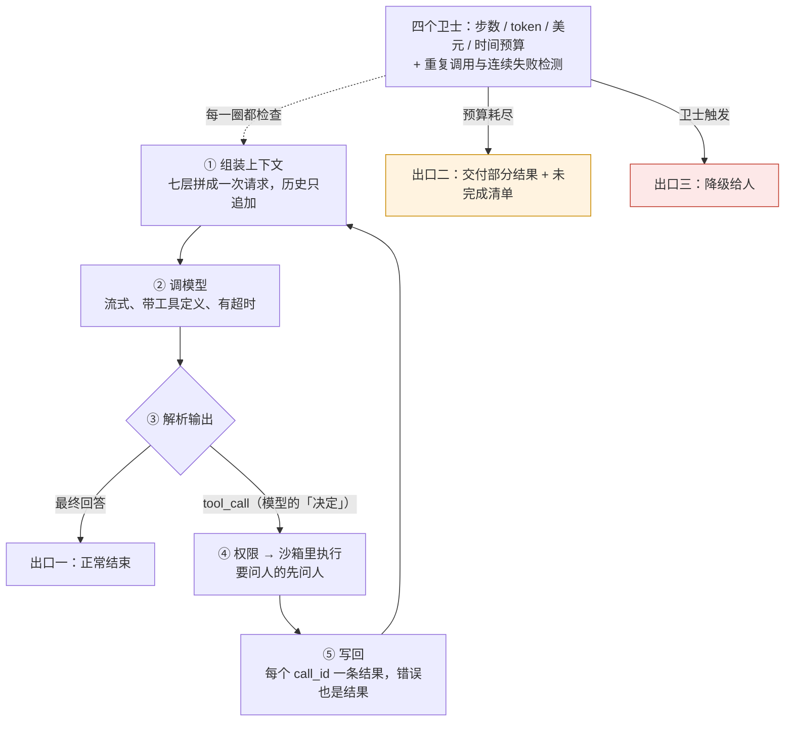

agent 的核心机制不复杂：模型看上下文，决定调用什么工具，应用执行，把结果放回上下文，模型再决定——直到它给出最终回答。用任何一家的 API 写这个循环不超过 40 行。复杂的是把这个循环做**可靠**：它什么时候停、跑飞了谁拦、一步失败了怎么办、几十步之后上下文怎么办、每一步的状态放在哪、哪些动作要问人。这些问题的答案加起来就是 harness——本系列九篇的内容。这一篇先把循环本身解剖清楚，然后看两个生产实现——OpenAI Codex 的三层循环与 DeepSeek Harness 的日志驱动循环——各在最小循环之上加了什么。

先立一个原则：**不是所有多步任务都需要循环**。Anthropic 2024 年 12 月的《Building effective agents》把"工作流"（代码预先定义步骤与分支，模型只在每步里工作）与"agent"（模型自己决定步骤）分开，并建议能用工作流就不用 agent——前者可预测、可测试、便宜。循环是给"步骤事先不知道"的任务的。

本篇要回答的核心问题是：

> **agent 循环的最小形态是什么，它在哪些地方会失控？[^q0] Codex 与 DeepSeek Harness 的循环各分几层、每层管什么？[^q1] 什么任务该用循环、什么任务该用工作流？[^q2]**

## 一、总览

### 1. 最小循环




```text
loop(task):
    ctx = [system, tools, task]
    for step in 1..MAX_STEPS:                       # 卫士 ①：步数
        resp = model(ctx)                           # 一次调用（L1 第二篇的契约）
        ctx.append(resp.message)                    # 含 thinking 块（L1 第三篇）
        if no resp.tool_calls: return resp.text     # 终止条件 A：模型说完了
        for call in resp.tool_calls:                # 可并行
            if is_repeat(call, ctx): warn(ctx)       # 卫士 ②：重复调用
            if not permitted(call): result = deny(call)   # 权限（第五篇）
            else: result = run(call, timeout=T)     # 卫士 ③：单次超时；沙箱（第五篇）
            ctx.append(tool_result(call.id, result))       # 配对（L1 第二篇）
        if tokens(ctx) > BUDGET: compact(ctx)       # 卫士 ④：预算；压缩（第四篇）
    return partial(ctx)                             # 终止条件 B：预算耗尽，交付部分结果
```

四个卫士与两个终止条件是最小循环与"能上生产的循环"之间的第一道差别。没有它们，一个找不到答案的 agent 会无限换词重试（L3 第五篇），一个卡住的工具会让整个会话挂死，一个长任务会在第 50 步撞上下文上限（L2 第一篇）。

### 2. 本文的章节安排

第二章讲循环的每一段与它的失控点；第三章讲 Codex 的三层循环；第四章讲 DeepSeek Harness 的日志驱动循环；第五章讲工作流 vs agent 的选择；第六章实践建议。

## 二、循环的每一段

### 1. 组装上下文

L2 的七层在这里被拼成一次请求。循环特有的部分：**只追加**（历史不修改，否则缓存与推理状态都坏——L1 第三篇、L2 第五篇）、**工具返回的截断与卸载**（L2 第四篇）、**当前目标的复述**（第四篇）。失控点：动态内容混进前缀让每一步都是缓存写入；工具返回不截断让上下文在十几步内爆掉。

### 2. 调模型

一次 L1 第二篇的调用：流式、带工具定义、带 effort（L1 第三篇）。失控点：没有超时（一次调用挂住整个循环）；重试策略不区分错误类型（L1 第六篇）；每步都用最高 effort（成本与 TTFT，L1 第三篇的按步选档）。

### 3. 解析输出

模型返回文本、工具调用、或两者。**工具调用是模型的"决定"，不是执行**——这是 L1 第二篇的协议：`call_id`、`name`、`arguments`。失控点：参数不是合法 JSON（strict 工具 schema 解决）、调用了不存在的工具（把错误作为结果送回让它改）、同一步返回了互相矛盾的多个调用。

### 4. 权限与执行

每个调用先过权限（能不能做、要不要问人——第五篇），再在沙箱里执行（第五篇），并行的调用并行执行（Codex 的 `tools/parallel.rs`），每个有独立超时。失控点集中在这里，PocketOS 的五环全在这一段（L1 第一篇）。

### 5. 写回

每个 `call_id` 对应一条结果，缺一个就 400；错误也是结果（`is_error`）；大结果卸载留引用。失控点：漏配对；结果里带了注入文字（工具返回是不可信输入——L1 第二篇、L6）。

### 6. 终止

三种出口：模型给出最终回答（正常）；预算耗尽（步数、token、美元、时间任一）——交付部分结果并说明；卫士触发（重复调用超过阈值、连续失败）——降级给人。**没有第二、三种出口的循环不能上生产**。

### 7. 卫士

| 卫士 | 检测 | 动作 | 生产实现 |
|---|---|---|---|
| 步数上限 | step > N | 交付部分结果 | 所有 harness 都有 |
| token / 美元预算 | 累计 usage > B | 同上 | Codex 的 `compact_token_budget`、`get_context_remaining` 工具让模型自己看剩余 |
| 重复调用 | 与最近 k 步完全相同的工具 + 参数 | 提醒模型换方法或结束 | DeepSeek Harness `guard/repeat-tool-reminder`（咨询式：提醒而不强制） |
| 单次工具超时 | 工具运行 > T | 杀掉、把超时作为结果送回 | DeepSeek Harness `guard` 的单次工具超时策略；Codex 的 exec 超时 |
| 连续失败 | 连续 k 次工具错误 | 降级 | 应用侧 |
| 无进展 | 上下文增长但目标状态不变 | 提醒或降级 | 复述机制辅助判断（第四篇） |

## 三、Codex 的三层循环

Codex CLI 的 `codex-rs` 是一个几十个 crate 的 Rust 工作区，`core` 是重心——agent 循环状态机、配置、模型客户端、沙箱管理器都在里面。循环分三层：

### 1. `submission_loop`：会话的生命周期

最外层的无限循环，从提交通道接收 `Op`（用户输入、审批决定、中断、关闭……）并分发。它活到会话结束（`Op::Shutdown`）。客户端面（TUI、`exec` 无头模式、`app-server` 的 JSON-RPC / WebSocket 服务）与运行循环的会话之间是一对**操作 / 事件通道**：客户端发操作、会话推事件（`SessionConfigured`、`ExecApprovalRequest`、流式增量……）。这个设计让同一个核心服务多种 UI——第六篇会讲它与 DeepSeek Harness 的 profile 机制的对应。

### 2. turn loop：一次用户输入触发

收到 `Op::UserInput` 后：组装 prompt（系统指令、`AGENTS.md`——`core/src/agents_md.rs`、工具定义、对话历史），调 Responses API（L1 第二篇：Codex 只对接 Responses，reasoning item 跨轮保留），处理返回的输出项——文本推给客户端，工具调用交给第三层，直到模型不再返回工具调用。压缩在这一层的边界触发（L2 第四篇讲过：轮前检查 + 长工具链的循环边界，`core/src/compact.rs` 一族）。

### 3. 工具编排器

`core/src/tools/orchestrator.rs` 是每个工具调用的路径，源码里的注释把顺序写得很清楚：

1. **审批**：按 `AskForApproval` 策略（`untrusted`——未信任项目里的命令除非有显式规则允许否则都要审批；`on-request`——默认，模型决定何时问；细粒度控制；`never`）与 `execpolicy` 规则（第五篇）决定是否向会话请求审批，请求经事件通道到 UI，等用户；可选的 Guardian 审查——一个模型审另一个模型的高风险调用。
2. **首次尝试，在选定的沙箱下**：`SandboxManager` 按权限档、工具的沙箱偏好、平台、是否有托管网络选初始沙箱（Seatbelt / bubblewrap + Landlock / Windows）。
3. **成功则返回**；**被沙箱拒绝**则看策略：`never` 与 `on-request` 下不会去掉沙箱重试，只返回一条保留原始输出的简洁拒绝说明；允许升级的策略下请求（新的）审批后**第二次尝试**不带沙箱——"严格自动审查的审批只覆盖沙箱内的尝试，去掉沙箱重试需要新的 Guardian 审查"。

工具本身经 `tools/registry.rs` 注册、`tools/router.rs` 路由、`tools/parallel.rs` 并行；处理器在 `tools/handlers/`（shell、`apply_patch`、`plan`、`request_user_input`、`tool_search`、`multi_agents`、MCP、`view_image`……）。这一层是"权限范围是错误上限"原则的代码形态：任何工具调用都要先过审批再过沙箱，沙箱拒绝不自动升级。

## 四、DeepSeek Harness 的日志驱动循环

DeepSeek Harness（`dsh`）是 TypeScript 单体仓库，几十个 `@deepseek-ai/dsh-*` 包，全部是 Cordis 插件——包括循环本身。`packages/core` 是每个组合都要启动的六个包：

| 包 | 拥有什么 |
|---|---|
| `session/` | append-only 的 `SessionEvent` 日志与内存存储——**唯一事实来源** |
| `system-prompt/` | prompt 段与工具 schema 的组装 |
| `tools/` | 作用域工具注册表与带守卫的执行管线 |
| `agent/` | `Agent` 接口、活动注册表、发起者作用域、`agent/*` 事件词表 |
| `agent-loop/` | 实现 `Agent` 契约的具体驱动 |
| `scope/` | 作用域注册的原语 |

一个 turn 的路径（架构文档的原话改述）：`agent-loop` 的驱动**领取**一个排队的 prompt → 在会话日志上**开一个 turn** → 经 `system-prompt` 组装请求前缀、**从日志派生**历史 → 经 LLM 接缝流式调模型 → 经工具注册表分发工具调用 → **把每个模型可见的事实追加回日志**，下一步再从日志派生。

与 Codex 的差别在于**状态在哪**：Codex 的会话对象持有历史，日志（rollout）是它的持久化；DeepSeek Harness 反过来——日志是状态，历史是从日志**派生**的视图。这带来一条它写进仓库规范的不变量："**模型可见 ⟺ 已记录**：任何进入模型请求的东西都必须能从会话日志重建；一个新的模型可见输入需要一个会话事件。"第三篇讲这条不变量对 resume / fork / replay 意味着什么。

循环之外的"一切皆插件"：模型适配器、工具、沙箱、审批策略、压缩、子 agent、UI 都是可从配置替换的插件；`guard` 包组的两个卫士也是——不想要重复调用提醒可以卸掉。四种**模式**是不同的插件组合：Standard（全部工具）、Code（工具经 Code Mode SDK 暴露，模型写一个 TypeScript 程序组合多步——第二篇）、Minimal（只留 shell 与文件编辑器，用于在最小环境里公平比较模型）、Creator（检视运行时、在内存里测插件、组合新模式）。

## 五、工作流还是 agent

### 1. 区分

| | 工作流 | agent |
|---|---|---|
| 谁决定步骤 | 代码：预定义的顺序与分支 | 模型：每步决定下一步 |
| 模型的角色 | 每步里的一次调用（分类、抽取、生成） | 循环的驾驶员 |
| 可预测性 | 高：步数、成本、延迟固定 | 低：按分布看 |
| 适合 | 步骤事先知道的任务：审核流程、报告生成、批处理 | 步骤事先不知道的任务：调试、研究、开放式修改 |
| 失控风险 | 低 | 需要四个卫士 |
| 代表 | prompt 链、路由、并行（Anthropic 的五种工作流模式） | coding agent、深度研究 |

### 2. 判据

问三个问题：步骤能不能事先写出来？每步的输入输出能不能定义清楚？失败了能不能在代码里处理？三个都能，用工作流——它便宜、可测、可预测。有一个不能，那一段用循环，其余仍用工作流。多数生产系统是**工作流里嵌一段 agent**：固定的入口与出口，中间一个有卫士的循环。

### 3. 常见的过度设计

把一个"读文档 → 抽字段 → 校验 → 入库"的流程做成 agent，让模型决定每一步——成本高、不可预测、且多数时候它决定的顺序就是你本来会写的顺序。反过来的错误更少见：把真正开放的任务硬写成工作流，结果分支爆炸。

## 六、实践建议

1. **手写一次 40 行循环**，带四个卫士与两个终止条件，用真实 API 跑一个多步任务；不要先用框架。
2. **读一遍生产循环**：Codex 的 `core/src/tools/orchestrator.rs`（审批 → 沙箱 → 重试的顺序）或 DeepSeek Harness `packages/core/agent-loop` 的 README（领取 → 开 turn → 派生 → 流式 → 分发 → 追加）。
3. **给每个终止条件写测试**：模型正常结束、步数耗尽、预算耗尽、重复调用触发、连续失败——每个都要能触发并交付部分结果。
4. **先问要不要循环**：把你的任务用第五章的三个问题过一遍，能写成工作流的部分不要用 agent。
5. **卫士的阈值上配置**，并在 trace 里记每次触发——它们的触发频率是 agent 健康度的指标（第九篇）。

## 七、本文小结

- 最小循环 40 行：组装 → 调模型 → 无工具调用则结束 → 权限 → 执行 → 写回 → 预算检查；加四个卫士（步数、预算、重复调用、单次超时）与两个额外出口（预算耗尽交付部分结果、卫士触发降级）才能上生产。
- 每一段的失控点：前缀混入动态内容、返回不截断、调用无超时、参数非法、漏配对、注入、没有第二出口。
- Codex 三层：`submission_loop`（会话生命周期，操作 / 事件通道连 TUI / exec / app-server）→ turn loop（组装、调 Responses API、处理输出项、边界处压缩）→ 工具编排器（审批 → 选沙箱首次尝试 → 沙箱拒绝时按策略决定是否审批后无沙箱重试，`never` / `on-request` 不重试）。
- DeepSeek Harness：日志驱动——领取 prompt → 开 turn → 从 append-only 会话日志派生历史 → 流式 → 经注册表分发 → 追加；"模型可见 ⟺ 已记录"；一切皆插件（含循环与卫士）；四种模式是插件组合。
- 工作流 vs agent：步骤能事先写出来就用工作流；多数系统是工作流里嵌一段带卫士的循环。

## 八、自测

1. 一个循环只有"模型不再返回工具调用"这一个出口。列出三种它会永远跑下去或挂死的情形，各对应哪个卫士。

   <details markdown="1"><summary>答案</summary>
   （1）找不到答案时不断换词重试同类搜索——重复调用检测 / 步数上限；（2）一个工具（如等待网络的命令）永不返回——单次工具超时；（3）每步都有新的工具返回、上下文与费用无限增长——token / 美元预算。缺任何一个都不能上生产。详见[第二章](#二循环的每一段)。
   </details>

2. Codex 的工具编排器在沙箱拒绝一个命令后，什么情况下会去掉沙箱重试？什么情况下不会？为什么"严格自动审查的审批只覆盖沙箱内的尝试"？

   <details markdown="1"><summary>答案</summary>
   `AskForApproval` 为 `never` 或 `on-request` 时不重试，只返回保留原始输出的拒绝说明；允许升级的策略下要先请求新的审批（含新的 Guardian 审查）再无沙箱重试。因为审批的对象是"在沙箱里执行这条命令"，去掉沙箱是另一个风险等级的动作，不能沿用之前的批准。详见[第三章](#三codex-的三层循环)。
   </details>

3. "模型可见 ⟺ 已记录"这条不变量在 DeepSeek Harness 里意味着历史是怎么来的？它与 Codex 的状态模型有什么差别？

   <details markdown="1"><summary>答案</summary>
   历史不是一个被持有的对象，而是每一步从 append-only 会话日志派生的视图；任何要进模型请求的新输入都必须先成为一个会话事件。Codex 的会话对象持有历史、日志是它的持久化；DeepSeek Harness 把日志当作状态本身。后者让 resume / fork / replay 天然一致（第三篇）。详见[第四章](#四deepseek-harness-的日志驱动循环)。
   </details>

4. 一个"审核报销单"的任务：读单据 → 抽字段 → 查政策 → 判断 → 写结论。该用工作流还是 agent？哪一步可能需要循环？

   <details markdown="1"><summary>答案</summary>
   主体是工作流——五步事先知道、每步输入输出清楚、失败可在代码里处理（抽取失败转人工）。可能需要循环的只有"查政策"：单据情形复杂时要多轮检索与追问（L3 第五篇的 agentic retrieval），在这一步嵌一个有步数上限的小循环，其余保持固定。详见[第五章](#五工作流还是-agent)。
   </details>

5. DeepSeek Harness 的重复调用提醒是"咨询式"的——提醒模型而不强制终止。这样设计的理由是什么？什么情况下你会改成强制？

   <details markdown="1"><summary>答案</summary>
   有时重复同一调用是合理的（轮询一个状态、重试一次瞬时失败），强制终止会误杀；提醒把判断留给模型，成本低。改成强制的情形：重复超过一个较高阈值（如同一调用 5 次以上）、或该工具有副作用（重复写入）、或预算接近耗尽——此时降级给人比再让模型判断更安全。卫士是插件，可以替换。详见[第二章](#二循环的每一段)、[第四章](#四deepseek-harness-的日志驱动循环)。
   </details>

## 下一篇

[工具调用与 MCP：协议、tool search 与程序化工具调用](/tool-calling-mcp-tool-search-and-programmatic-tool-calling.html)

[^q0]: 最小形态：组装上下文 → 调模型 → 若无工具调用则返回文本 → 对每个调用过权限、在沙箱里执行（并行、各有超时）→ 按 `call_id` 写回结果（错误也是结果）→ 检查预算与压缩 → 再来。失控点：只有"模型说完"一个出口（找不到答案时无限换词、工具挂住、上下文与费用无限增长）；前缀混入动态内容毁缓存；工具返回不截断爆上下文；参数非法或调用不存在的工具；漏配对 400；工具返回带注入。生产循环加四个卫士——步数上限、token / 美元预算、重复调用检测（DeepSeek Harness 的 `guard/repeat-tool-reminder`）、单次工具超时——与两个额外出口：预算耗尽交付部分结果、卫士触发降级给人。详见[第一章](#一总览)、[第二章](#二循环的每一段)。

[^q1]: Codex（`codex-rs`，Rust）三层：`submission_loop` 管会话生命周期，从提交通道接收 `Op` 并分发，与 TUI / exec / app-server 之间是操作 / 事件通道；turn loop 由一次用户输入触发，组装 prompt（含 `AGENTS.md`）、调 Responses API、处理输出项，在边界处压缩；工具编排器（`tools/orchestrator.rs`）对每个调用：按 `AskForApproval`（`untrusted` / `on-request` 默认 / 细粒度 / `never`）与 `execpolicy` 决定是否审批（可选 Guardian 审查）→ 在 `SandboxManager` 选的沙箱下首次尝试 → 被拒时 `never` / `on-request` 不重试，允许升级的策略要新审批后才无沙箱重试。DeepSeek Harness（TypeScript，Cordis 插件）：`agent-loop` 领取 prompt → 在 `session` 的 append-only 日志上开 turn → 经 `system-prompt` 组装、从日志派生历史 → 流式调模型 → 经 `tools` 注册表分发 → 追加事实回日志；日志是状态、历史是派生视图，不变量"模型可见 ⟺ 已记录"；循环、卫士、沙箱、审批全是可替换插件，四种模式是插件组合。详见[第三章](#三codex-的三层循环)、[第四章](#四deepseek-harness-的日志驱动循环)。

[^q2]: Anthropic 的区分：工作流由代码预定义步骤与分支、模型只在每步里工作，可预测、可测、便宜；agent 由模型决定步骤，成本与延迟按分布看、需要卫士。判据三问：步骤能否事先写出、每步输入输出能否定义清楚、失败能否在代码里处理——三个都能用工作流，有一个不能那一段用循环。多数生产系统是工作流里嵌一段带卫士的循环（固定入口出口、中间开放）；常见过度设计是把"读 → 抽 → 校 → 入库"这类固定流程做成 agent。详见[第五章](#五工作流还是-agent)。
