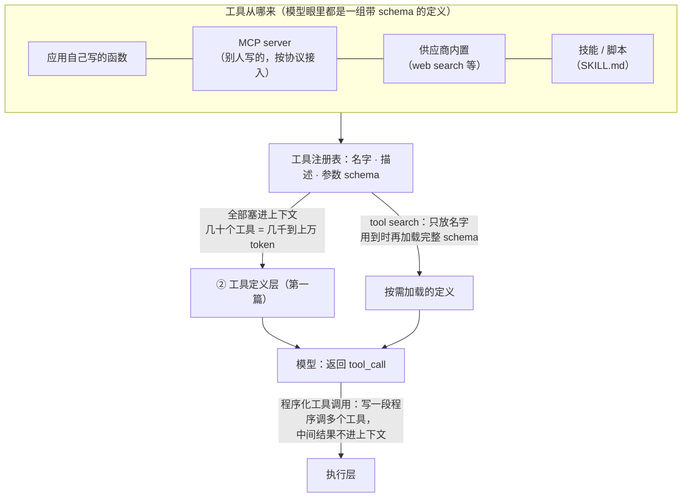

L1 第二篇讲了工具调用在**模型 API** 上的协议：模型返回 `tool_call`，应用执行，结果按 `call_id` 送回。这一篇讲工具的**生态协议**——工具从哪来、怎么被发现、怎么被授权、怎么被描述——以及 2026 年围绕"工具太多"出现的两个新机制：**tool search**（定义按需加载）与**程序化工具调用**（模型写一段程序调多个工具，只把结果送回）。

生态协议的事实标准是 **MCP**（Model Context Protocol）。它 2024 年 11 月由 Anthropic 发布，2025 年 12 月捐给 Linux 基金会下的 Agentic AI Foundation（Anthropic、OpenAI、Block 共同创始，治理按维护者而不是公司席位），TypeScript 与 Python SDK 各过十亿次累计下载，AWS 与 Google 都有几十个托管 MCP server。2026-07-28 版是它发布以来最大的修订，有破坏性变更——本篇第二章讲它改了什么、为什么。

本篇要回答的核心问题是：

> **MCP 2026-07-28 版改了什么，为什么？[^q0] 工具描述怎么写才让模型用对，tool search 解决什么、付什么代价？[^q1] 程序化工具调用是什么，四家各怎么实现，它解决的是哪个问题？[^q2]**

## 一、总览

### 1. 工具的四个来源




| 来源 | 谁执行 | 谁定义 schema | 代表 |
|---|---|---|---|
| 应用自定义函数 | 你的代码 | 你 | L1 第二篇的 function calling |
| MCP server | server（本地进程或远程 HTTP） | server 暴露，client 发现 | 文件系统、GitHub、数据库、企业系统的 MCP server |
| 供应商服务端工具 | 供应商 | 供应商 | web search、code interpreter、file search、computer use（L1 第二篇第三章） |
| harness 内置工具 | harness | harness | Codex 的 shell / `apply_patch` / `plan`；DeepSeek Harness 的 fs / shell / todo |

四个来源在模型眼里是同一种东西——一组带 schema 的工具定义；差别在执行的位置、权限的落点（第五篇）、以及**定义占多少上下文**（第一篇的 ②）。

### 2. 本文的章节安排

第二章 MCP 2026-07-28；第三章工具描述与它在系统提示里的位置；第四章 tool search；第五章程序化工具调用；第六章实践建议。

## 二、MCP 2026-07-28

### 1. 它是什么

MCP 借鉴 LSP（Language Server Protocol）：LSP 让任何编辑器接任何语言的服务器，MCP 让任何模型客户端接任何工具服务器。一个 MCP server 暴露 **tools**（可调用的函数）、**resources**（可读的数据）、**prompts**（模板）；client（Claude Code、Codex、Cursor、你的应用）连接后发现并调用。传输有 stdio（本地进程）与 Streamable HTTP（远程）。

### 2. 2026-07-28 改了什么

| 变更 | 内容 | 为什么 |
|---|---|---|
| **无状态核心** | `initialize` 握手取消；版本与能力协商放进每个请求的 `_meta` 与 `MCP-Protocol-Version` 头；Streamable HTTP 去掉协议级会话与 `Mcp-Session-Id` | 有状态的会话让 server 难以在普通 HTTP 基础设施（负载均衡、无状态函数）上横向扩展；第三篇讲 agent 运行时为什么也在往"状态放日志、服务无状态"走 |
| **多轮往返请求**（MRTR） | 替代 server 发起的请求 | server → client 的反向请求在无状态 HTTP 上难实现 |
| **扩展框架** | 反向 DNS 标识、在 `extensions` 能力映射里协商、独立仓库与版本、默认关闭；官方扩展：**Tasks**（长任务的异步执行——轮询、中途输入、持久句柄，从核心移出）、**MCP Apps**（对话内渲染的 UI：图表、表单）、OAuth 客户端凭据、企业托管授权；社区工作组：Skills over MCP | 核心保持小，专门能力独立演进 |
| **授权加固** | RFC 9207 `iss` 校验（防授权服务器混淆攻击）；RFC 8707 `resource` 参数绑定受众（token 只对目标 server 有效，自 2025-06-18 起为 MUST）；客户端凭据绑定发行者；**动态客户端注册（DCR）弃用**改为客户端元数据文档（CIMD）；`application_type` 让 CLI 的 localhost 重定向不被拒 | 实施者反馈授权是集成里花时间最多的部分 |
| **弃用政策** | Sampling、Roots、Logging 十二个月弃用窗口 | 协议能演进而不突然断 |
| SDK | 四个一级 SDK 当天支持 | — |

一句话：**2026 年的 MCP 把自己从"一个有会话的 RPC 协议"改成"一个能在普通 HTTP 上横向扩展、授权按 OAuth 部署实践对齐、核心小扩展多的协议"**。注册表（server 的目录）仍在预览（API 2025 年 10 月冻结在 v0.1），不要把依赖建在它的稳定性上。

### 3. 对应用工程师的含义

- **用 MCP 接外部工具是默认**：主流 harness 都是 MCP client（Codex 的 `codex-mcp` / `rmcp-client` crate，DeepSeek Harness 的 `mcp` 包组，Claude Code 原生）；自己写的业务工具也可以做成 MCP server 让多个 agent 复用。
- **检查 server 的规范版本**：2026-07-28 有破坏性变更，旧 server 在新 client 上可能要改。
- **远程 server 必须做授权**：HTTP 传输的 server 应实现 OAuth 2.1 流程，token 带 `resource`、server 校验受众；stdio 的 server 从环境取凭据、不做 OAuth。
- **安全**：MCP 规范的安全章节写得直白——它"通过任意数据访问与代码执行路径实现强大能力"，一个恶意或被攻陷的 server 就是一个注入源与数据出口。工具返回是不可信输入（L1 第二篇）；server 的权限要按最小原则给（第五篇）。

## 三、工具描述与它的位置

### 1. 描述是 prompt

L1 第二篇讲过：工具的名字、描述、参数 schema 三部分都是模型读的文本，写法决定用不用对。2026 年的补充是**描述与系统提示的分工**：工具描述说"这个工具做什么、参数是什么、什么时候用 / 不用"；系统提示说跨工具的政策（L2 第二篇：先搜再答、哪些要确认、并行偏好、工具预算）。Codex 把项目的 `AGENTS.md` 拼进系统提示（`core/src/agents_md.rs`），DeepSeek Harness 的 `system-prompt` 包负责 prompt 段与工具 schema 的组装——两家都把"工具怎么用"的政策与"工具是什么"的定义分开放。

### 2. 从模型的视角写

DeepSeek Harness 的仓库规范里有一条值得所有人抄："**从模型的视角写模型可见的契约**：prompt、工具 schema、结果、诊断只含任务相关的概念，不含 UI、传输、实现的词汇。"一个工具描述里出现"调用后端 gRPC 接口"、"返回 Protobuf"对模型没有意义；"按订单号查询订单状态，返回状态、金额、更新时间；订单号未知时先用 `search_orders`"才是。

### 3. 结果也是契约

工具返回的形状同样要为模型设计（L3 第五篇的七要素）：摘要 + 引用而不是全文、结构化、带失败建议、大结果卸载。DeepSeek Harness 把"卸载"做成了独立包组 `spill`：全文存到上下文外、返回一个带取回指引的定位符——第四篇。

## 四、tool search

### 1. 问题

一个 agent 接十几个 MCP server，每个暴露几个到几十个工具，完整 schema 加起来几千到上万 token，每一步都在上下文里（L2 第一篇的 ②）。三个代价：预算、缓存前缀（工具定义在最前，任何一个 server 的变化让一切失效——L2 第五篇）、选择准确率（工具越多模型越容易选错——L1 第二篇）。

### 2. 做法

**定义按需加载**：常驻上下文的只有工具的名字（或一行描述），模型需要时先调一个 `tool_search`（按关键词或语义找工具），返回匹配工具的完整 schema，再调用。三家都有：Codex 的 `tools/handlers/tool_search.rs`（MCP 工具的搜索与延迟暴露，`mcp_tool_exposure.rs` 决定哪些常驻）；Claude Code 默认延迟加载 MCP 工具 schema，只有名字常驻；OpenAI Responses 与 Agents API 的 tool search（"在需要时加载定义"）；Anthropic API 的 tool search 工具。Agent Skills 的 `SKILL.md`（L2 第六篇）是同一原则在技能上的版本——只有 `description` 常驻。

### 3. 代价

- **按需加载的定义不在缓存前缀里**：它出现在历史中间、每次可能不同（L2 第一篇自测 5、第五篇）。总 token 通常下降，但命中率这个比例可能变差——看绝对量。
- **多一步**：先搜再调，延迟与一次模型调用。
- **搜索的质量**：模型能不能用对关键词找到工具，取决于工具名与描述——又回到第三章。

### 4. 什么时候用

工具超过二十个、或多个 MCP server 动态接入时用；工具十个以内且稳定，全部常驻放在前缀里更好（可缓存、无额外步骤）。L2 第五篇的"屏蔽而不删除"是另一个维度：阶段性可用的工具用 `tool_choice` 或 logits 屏蔽，不增删定义。

## 五、程序化工具调用

### 1. 问题

一个数据处理任务："从 API 拉 500 条订单，过滤出逾期的，按客户汇总，取前十"。传统工具调用要四轮：调 `fetch_orders`（500 条 JSON 进上下文）→ 模型读完决定过滤 → 调 `filter`（结果再进上下文）→ 汇总 → 排序。每一轮的中间结果都进上下文、都算 token、都占预算，模型还要在几万 token 的 JSON 里"手动"做本该由代码做的事。

### 2. 做法

**让模型写一段程序**，程序在沙箱里运行，程序里调用工具（作为普通的异步函数），处理中间结果，**只把最终输出送回上下文**：

```text
传统：
  模型 → 工具 A → [结果 A 进上下文]
  模型 → 工具 B → [结果 B 进上下文]
  模型 → 工具 C → [结果 C 进上下文] → 模型给答案

PTC：
  模型 → 写程序 { a = A(); b = B(filter(a)); return top10(b) }
       → 沙箱运行（A、B 在程序内被调用，结果留在程序里）
       → [只有 top10 进上下文] → 模型给答案
```

四家的实现：

| | 名字 | 形态 |
|---|---|---|
| Anthropic | programmatic tool calling | 模型在沙箱里写并运行代码，代码调用你定义的工具，中间结果不进上下文 |
| OpenAI | Programmatic Tool Calling（GPT-5.6 起，Responses API） | 模型"写并在内存里运行协调工具、处理中间结果的程序"；因为中间结果不落服务端存储，同时让它**兼容零数据保留**（ZDR） |
| Cloudflare | Code Mode（2025-09） | 把 MCP server 的工具变成一个 TypeScript API，模型写代码调它，在 Workers 隔离体里运行 |
| DeepSeek Harness | Code 模式 + `ptc-runtime` 包组 | "Standard 模式的全部能力，工具经 Code Mode SDK 暴露，模型在一个 TypeScript 程序里组合多步"；`ptc-runtime` 让模型写一个程序调用宿主提供的函数（普通异步调用），**只返回程序的打印输出与返回值**；TypeScript 后端 |
| Codex | `code-mode` / `code-mode-host` / `code-mode-protocol` / `code-mode-runtime` crate | 同一思想的 Rust 实现 |

四家在 2025–2026 年不约而同做了同一件事，说明它解决的是一个真实且普遍的问题。

### 3. 它换到了什么

- **上下文预算**：中间结果不进上下文——L2 第四篇的"不让它进来"做到极致。一个 500 条订单的任务，传统方式几万 token 进出几轮，PTC 几百 token（程序 + 结果）。
- **确定性**：过滤、汇总、排序由代码做，不由模型在 JSON 里"手算"——L1 第一篇的幻觉在这一段被消除。
- **延迟**：四轮模型调用变一轮。
- **隐私**：中间数据不经过模型供应商的存储（OpenAI 的 ZDR 兼容性正来自这一点）。

### 4. 它付的代价

- **沙箱**：程序要在隔离环境里跑（第五篇）——工具的执行权限现在由程序而不是逐个调用行使，权限模型要能覆盖"程序内的调用"（DeepSeek Harness 的 `ptc-runtime` 与 `sandbox` 是分开的包组，正是为了让这两层各自可替换）。
- **可观测**：一轮里发生了几十次工具调用，trace 要能展开程序内部的调用（第九篇）。
- **模型要会写代码**：对非代码任务的模型，PTC 的失败率高于逐个调用；这是为什么它作为一种**模式**（DeepSeek Harness 的 Code 模式）而不是默认。
- **审批粒度**：逐个调用可以逐个审批，程序是一次性运行——高风险工具在 PTC 里要么禁止、要么让程序在调用它时挂起等审批。

### 5. 什么时候用

多步数据处理、批量操作、需要在工具结果之间做确定性计算的任务。单步查询、每步都要人看的任务不用。

## 六、实践建议

1. **业务工具做成 MCP server**（按 2026-07-28 版，HTTP 传输带 OAuth、`resource` 绑定受众），让多个 agent 复用；检查已接入的 server 的规范版本。
2. **描述审计**：从模型的视角重写每个工具的描述——做什么、参数、什么时候用与不用、返回什么；去掉实现词汇。
3. **工具超过二十个时上 tool search**，同时看未缓存 token 的绝对量而不只是命中率；十个以内全部常驻。
4. **有多步数据处理的任务试 PTC**：比较同一任务传统调用与 PTC 的 token、轮数、正确率；确认沙箱与 trace 能覆盖程序内的调用。
5. **每个 MCP server 当作一个权限主体**：最小权限、工具返回视为不可信输入（第五篇、L6）。

## 七、本文小结

- 工具四个来源（自定义、MCP、供应商服务端、harness 内置）在模型眼里相同，差别在执行位置、权限落点、定义占的上下文。
- MCP 2026-07-28：无状态核心（去掉 `initialize` 与会话 id，协商放进每请求）、多轮往返请求、扩展框架（Tasks、Apps、Skills over MCP、企业授权，默认关闭、独立版本）、授权加固（`iss` 校验、`resource` 绑定受众、DCR 弃用改 CIMD）、十二个月弃用政策；由 Agentic AI Foundation 治理，SDK 各过十亿下载，注册表仍预览。
- 工具描述是 prompt，从模型的视角写、不含实现词汇；跨工具的政策放系统提示（Codex 的 `AGENTS.md`、DeepSeek Harness 的 `system-prompt`）；结果的形状同样是契约。
- tool search：定义按需加载，解决预算、前缀失效、选择准确率；代价是按需定义不在缓存里、多一步、依赖描述质量；二十个以上工具用。
- 程序化工具调用：模型写程序在沙箱里调多个工具、只回结果——Anthropic PTC、OpenAI GPT-5.6（ZDR 兼容）、Cloudflare Code Mode、DeepSeek Harness Code 模式 / `ptc-runtime`、Codex `code-mode`；换到预算、确定性、延迟、隐私，付出沙箱、可观测、模型编码能力、审批粒度。

## 八、自测

1. 2026-07-28 版 MCP 去掉了 `initialize` 握手与 `Mcp-Session-Id`。这解决了什么部署问题？付出了什么？

   <details markdown="1"><summary>答案</summary>
   有状态会话让 server 难以在负载均衡、无状态函数这类普通 HTTP 基础设施上横向扩展；无状态核心把版本与能力协商放进每个请求（`_meta` + 头），任何实例都能处理任何请求。代价是破坏性变更（旧 server / client 要改）、server 发起的请求改为多轮往返请求、每个请求多带协商信息。详见[第二章](#二mcp-2026-07-28)。
   </details>

2. 为什么 MCP 要求 token 带 RFC 8707 的 `resource` 参数、server 校验受众？

   <details markdown="1"><summary>答案</summary>
   MCP 是"一个 client 对多个 server"的部署形态，一个为 server A 签发的 token 若能被 server B 接受，被攻陷的 B 就能用它访问 A 的资源。`resource` 让 token 绑定目标 server，server 只接受为自己签发的 token——防 token 混用。同理 `iss` 校验防授权服务器混淆。详见[第二章](#二mcp-2026-07-28)。
   </details>

3. 一个 agent 接了 8 个 MCP server 共 60 个工具，全部常驻，缓存命中率 40%。上 tool search 后总输入 token 降了 35%，命中率降到 30%。这是变好还是变坏？

   <details markdown="1"><summary>答案</summary>
   变好。命中率是比例，按需加载的定义不在前缀里让比例下降，但未缓存 token 的绝对量与总成本都降了（L2 第五篇：看绝对量与节省美元）。同时应验证工具选择准确率是否上升（60 个工具常驻时容易选错）。详见[第四章](#四tool-search)。
   </details>

4. "拉 2,000 条日志，找出错误率最高的三个服务"这个任务，传统工具调用与 PTC 各要几轮、上下文里进多少东西？PTC 需要额外准备什么？

   <details markdown="1"><summary>答案</summary>
   传统：至少三轮（拉日志——2,000 条进上下文、可能几万 token；模型让工具按服务分组；模型读分组结果排序），每轮中间结果进上下文，且模型"手算"错误率有幻觉风险。PTC：一轮——模型写程序 `logs = fetch(); groupby(service).errorRate().top(3)`，沙箱运行，只有三行结果进上下文。额外准备：程序运行的沙箱、能展开程序内调用的 trace、对 `fetch` 这类工具在程序内调用的权限覆盖、模型的编码能力（作为模式启用而非默认）。详见[第五章](#五程序化工具调用)。
   </details>

5. OpenAI 说 GPT-5.6 的程序化工具调用"让它兼容零数据保留"。解释这个因果关系。

   <details markdown="1"><summary>答案</summary>
   传统多轮工具调用下，中间结果作为消息进入上下文、在服务端状态（Responses 默认存储）里留存；ZDR 组织不能用服务端状态。PTC 让中间结果只存在于程序运行的内存里、不进上下文、不落服务端存储，只有最终输出进入模型——所以整个流程不产生需要保留的中间数据，与 ZDR 兼容。详见[第五章](#五程序化工具调用)。
   </details>

## 下一篇

[agent 运行时：会话、持久化与 durable execution](/agent-runtime-sessions-persistence-and-durable-execution.html)

[^q0]: 2026-07-28 是 MCP 发布以来最大的修订：无状态核心——取消 `initialize` 握手，版本与能力协商放进每个请求的 `_meta` 与 `MCP-Protocol-Version` 头，Streamable HTTP 去掉协议级会话与 `Mcp-Session-Id`，为的是能在普通 HTTP 基础设施上横向扩展；多轮往返请求替代 server 发起的请求；正式的扩展框架——反向 DNS 标识、`extensions` 能力协商、独立仓库与版本、默认关闭，官方扩展有 Tasks（长任务的轮询、中途输入、持久句柄）、MCP Apps（对话内 UI）、OAuth 客户端凭据、企业托管授权，另有 Skills over MCP 工作组；授权加固——RFC 9207 `iss` 校验防混淆、RFC 8707 `resource` 绑定受众防 token 混用、凭据绑定发行者、动态客户端注册弃用改为客户端元数据文档、`application_type` 解决 CLI 的 localhost 重定向；Sampling / Roots / Logging 十二个月弃用窗口。治理在 Agentic AI Foundation（Linux 基金会，Anthropic 2025-12 捐赠，OpenAI、Block 共创），SDK 各过十亿下载，注册表仍预览。详见[第二章](#二mcp-2026-07-28)。

[^q1]: 描述是 prompt：名字、描述、参数 schema 都是模型读的文本，从模型的视角写——做什么、参数、什么时候用与不用、返回什么，不含 UI / 传输 / 实现词汇（DeepSeek Harness 的仓库规范）；跨工具的政策（先搜再答、确认、并行、预算）放系统提示（Codex 拼 `AGENTS.md`，DeepSeek Harness 的 `system-prompt` 组装）；结果的形状同样是契约（摘要 + 引用、结构化、失败建议、大结果卸载——`spill`）。tool search 解决工具太多的三个代价——占预算、工具定义在前缀最前任何变化毁缓存、选择准确率下降——做法是只常驻名字或一行描述，模型需要时先搜再调（Codex `tools/handlers/tool_search.rs`、Claude Code 延迟加载 MCP schema、OpenAI / Anthropic 的 tool search；SKILL.md 是同一原则）；代价是按需定义不在缓存前缀（看绝对量不看命中率）、多一步、依赖描述质量；二十个以上工具用，十个以内全常驻。详见[第三章](#三工具描述与它的位置)、[第四章](#四tool-search)。

[^q2]: 程序化工具调用（PTC）：模型写一段程序在沙箱里运行，程序把工具当普通异步函数调用、处理中间结果，只把最终输出送回上下文。实现：Anthropic programmatic tool calling；OpenAI GPT-5.6 在 Responses 里的 PTC（中间结果不落服务端存储，因此兼容零数据保留）；Cloudflare Code Mode（MCP 工具变 TypeScript API，在 Workers 隔离体里跑）；DeepSeek Harness 的 Code 模式（工具经 Code Mode SDK 暴露、一个 TypeScript 程序组合多步）与 `ptc-runtime` 包组（只返回打印输出与返回值）；Codex 的 `code-mode` 系列 crate。解决的是 L2 的预算问题——中间结果不进上下文——同时换到确定性（过滤汇总由代码做）、延迟（多轮变一轮）、隐私；付出沙箱、能展开程序内调用的 trace、模型编码能力（作为模式不作默认）、审批粒度（高风险工具在程序内要禁止或挂起等审批）。适合多步数据处理与批量操作。详见[第五章](#五程序化工具调用)。
