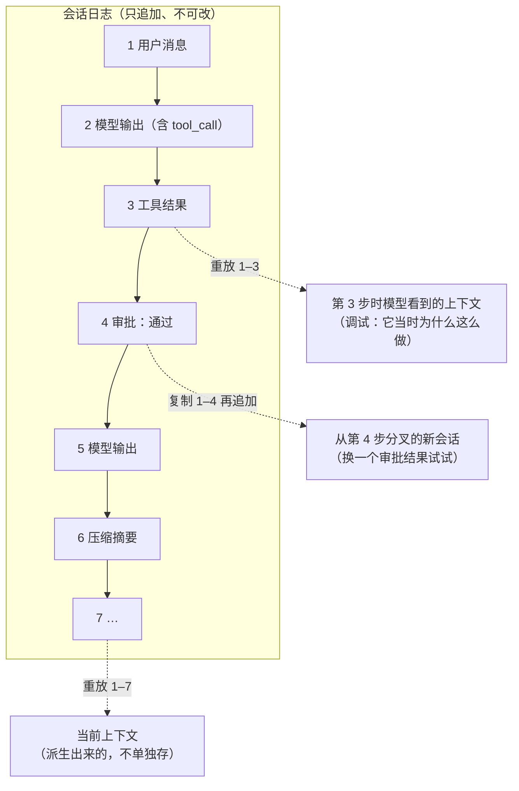

后端工程师熟悉两种服务：传统应用服务（毫秒级、确定性、无状态或状态在数据库）与模型 serving（秒级、一个请求进一串 token 出、状态是请求内的 KV cache）。agent 运行时是第三种：一次"调用"分钟到小时、几十次模型调用与工具执行交替、控制流由模型决定、可能挂起几小时等人批准、每一步都要能在崩溃后续上。直接用 Web 框架写 agent 的团队会在两件事上撞墙——"用户关了页面、任务还在跑"与"服务重启、任务从头开始"。这一篇讲第三种服务形态的核心数据结构与三种交付方式。

核心数据结构是**事件溯源的会话日志**：把模型看到的一切、做的一切按顺序追加到一个不可变的日志里，状态从日志派生。DeepSeek Harness 把它写成不变量"模型可见 ⟺ 已记录"，resume、fork、replay 在同一个事件流上操作；Codex 的 `rollout` 与 `thread-store` 是同一思想的 Rust 实现；LangGraph 的 checkpoint 与 Temporal 一类 durable execution 引擎是它在工作流领域的老前辈。交付方式有三种：托管运行时（OpenAI Agents API，2026-09-10 公测）、库（Agents SDK / Agent SDK）、自托管 harness（DeepSeek Harness）——第六篇比较，这一篇讲它们共同要解决的问题。

本篇要回答的核心问题是：

> **为什么 agent 运行时是一种新的服务形态，它与传统服务、模型 serving 差在哪？[^q0] 事件溯源的会话日志解决什么，"模型可见 ⟺ 已记录"意味着什么？[^q1] durable execution 是什么，托管运行时与自托管各换了什么？[^q2]**

## 一、总览

### 1. 三种服务形态

| | 传统应用服务 | 模型 serving（Infra 地图 08） | agent 运行时 |
|---|---|---|---|
| 一次调用 | 毫秒级，确定性 | 秒级；一个请求进、一串 token 出 | 分钟到小时；几十次模型调用 + 工具执行交替 |
| 状态 | 无状态，或存数据库 | 请求内的 KV cache，引擎自己管 | **每一步都要持久化**：崩溃、重启、等人之后从断点续跑 |
| 控制流 | 代码决定 | 无 | **模型决定**分支；运行时只提供边界（权限、预算、步数） |
| 等待 | 不等人 | 不等人 | 可能挂起几小时等人批准 |
| 副作用 | 代码可控 | 无 | 执行任意工具；需要沙箱与最小权限 |
| 并发单位 | 请求 | 请求 / batch | **会话**；会话内串行，会话间并行 |
| 失败 | 异常、超时 | 超时、OOM | 幻觉、死循环、预算耗尽、工具半成功——大多不是异常 |
| 资源瓶颈 | CPU / DB | GPU 显存与算力 | 模型 API 配额与费用、沙箱资源、等待中的会话数 |
| 最接近的老概念 | Web 框架 | 数据库引擎 | **工作流引擎 / durable execution** + actor + 沙箱 |

Table: 三种服务形态的对照

### 2. 运行时要提供的六件事

持久化与恢复、挂起与唤醒（等人、等外部事件）、事件流（每一步推给前端）、预算与超时、沙箱管理（第五篇）、会话隔离。本篇讲前三件与第六件；预算在第一篇讲过，沙箱在第五篇。

### 3. 本文的章节安排

第二章事件溯源的会话日志；第三章 durable execution——从工作流引擎学什么；第四章挂起、唤醒与事件流；第五章三种交付形态各换了什么；第六章实践建议。

## 二、事件溯源的会话日志

### 1. 为什么是日志

agent 的状态是什么？用户说过的话、模型的每次输出（含思考块）、每次工具调用与结果、每次审批、每次压缩、每次子 agent 的调度、每次注入上下文的内容。把它们存成一个"当前状态"对象有三个问题：崩溃时对象在内存里；无法回答"第 17 步模型看到了什么"（L1 第一篇的非确定性调试要求）；无法从中间分叉。**事件溯源**——只追加不可变的事件、状态从事件派生——三个问题都解决：日志落盘就是持久化；任意一步的上下文可以重放到那一步得到；从任意一步分叉就是复制前缀。

三条虚线就是三个问题的答案：崩溃后从日志尾部重放就是恢复；调试时重放到第 3 步就能看到模型当时的输入；分叉就是复制一段前缀。状态永远不是"存"出来的，是"算"出来的。

### 2. DeepSeek Harness：日志是状态

DeepSeek Harness 把这做成了架构的中心。`packages/core/session` 拥有 append-only 的 `SessionEvent` 日志——"唯一事实来源"；`agent-loop` 每一步从日志**派生**历史（第一篇）。仓库规范里的不变量：

> **模型可见 ⟺ 已记录**：任何进入模型请求的东西都必须能从会话日志重建；一个新的模型可见输入需要一个会话事件。

含义：不存在"偷偷塞进上下文"的东西——系统提示、思考、工具调用与结果、子 agent 调度、每一次上下文注入（压缩摘要、卸载的定位符、记忆）都是事件。产品侧的 Trajectory 视图按来源检视每条记录；**resume、fork、search、replay 在同一个事件流上操作**——不需要为每个功能设计单独的存储。`session` 包组还有：JSONL 存储（默认）、检查点（保护请求、工具副作用、已完成的步骤）、投影包（从日志派生客户端要的值）、标题包、遥测包。会话格式有版本（`SESSION_FORMAT_VERSION`），事件类型默认"读时必须认识"——不认识的类型拒绝加载，除非事件标了 `ignorable: true`——这是日志作为长期资产的纪律：格式变了要迁移，不能静默丢事件。

### 3. Codex：rollout 与 thread-store

Codex 的会话对象持有历史，`rollout` crate 负责把每一步写成 rollout 记录（持久化），`thread-store` 管理线程（会话）的存储与查找，`message-history` 与 `history` crate 处理历史的呈现；"从已有 rollout 恢复会话"是仓库规范里列出的外部兼容面之一（"resuming sessions from existing rollouts"），与 app-server API、CLI 参数并列——说明日志格式被当作契约。远程压缩（`compact_remote_v2`）在日志里也是一条记录（L2 第四篇：加密 blob 作为 `compaction` item）。

### 4. 日志里要有什么

| 事件类 | 内容 | 为什么要记 |
|---|---|---|
| 用户输入 | 原文、附件引用、时间 | 起点 |
| 模型输出 | 文本、工具调用（`call_id`、参数）、思考块（原样，L1 第三篇）、`stop_reason`、usage | 重放、成本、推理状态 |
| 工具执行 | 调用、结果（含错误）、耗时、沙箱、是否卸载与定位符 | 配对、调试、审计 |
| 审批 | 请求、决定、决定者、时间 | 审计（谁批的）；挂起 / 唤醒的边界 |
| 上下文操作 | 压缩（摘要内容或 blob 引用）、清理了哪些、注入了什么（记忆、规则） | "模型可见 ⟺ 已记录" |
| 子 agent | 派发、参数、返回的摘要、子会话 id | 跨会话的追溯 |
| 系统 | 模型版本、prompt 版本、工具集版本、配置 | L2 第六篇的版本绑定；L5 的归因 |
| 卫士 | 哪个卫士触发、动作 | 健康度 |

Table: 会话日志里要记的事件

记完整的请求体（或能重建它的事件）是 L1 第一篇定位非确定性、L5 录制回放的前提。

### 5. 日志的成本

一个 50 步的任务日志几 MB（工具返回是大头——卸载后只剩定位符就小得多）；千万级会话的存储要分层（热的在数据库、冷的归档）；敏感数据（用户输入、工具返回里的业务数据）要脱敏、分级、设保留期（L5 第六章、L6）。

## 三、durable execution

### 1. 概念

durable execution 是工作流引擎领域的老概念：把一段长流程的每一步的**输入、输出、决定**持久化，进程崩溃后从最后一个持久化点继续，而不是从头；等待外部事件（人、定时器、回调）时不占进程。Temporal、Cadence、AWS Step Functions、Azure Durable Functions 是代表。agent 运行时的需求与它几乎一致——只是"步骤"由模型决定而不是代码，这让工作流引擎的"确定性重放"（重放时代码必须做同样的决定）要换成"重放事件而不重跑模型"（L1 第一篇：模型不可复现，所以重放的是记录的输出）。

### 2. LangGraph 的 checkpoint

LangGraph 把 agent 显式建成有状态的图：节点是步骤（调模型、调工具、条件分支），边由代码或模型的输出决定，每一步之后**checkpoint** 整个状态到存储；崩溃后从 checkpoint 恢复，人在环时图在某个节点挂起、审批后继续，`interrupt` 是一等原语。地图里把它作为"agent 运行时"这个概念的抓手——不是因为它是标准，是因为它把"每步持久化 + 挂起 + 恢复"做成了看得见的图。

### 3. 用 Temporal 一类引擎跑 agent

一条常见的架构：agent 循环写成 Temporal 工作流，每次模型调用与工具执行是一个 activity（有重试、超时、幂等 id），审批是一个 signal（工作流挂起等它，不占进程），定时器处理超时降级；Temporal 负责持久化、恢复、可见性。Gemini 的文档把 Temporal 列为官方集成框架之一。代价：模型调用的非确定性与工作流引擎的确定性重放假设要调和（activity 的结果被记录、重放时不重跑）；工作流历史的大小上限要与 agent 的日志大小对齐。

### 4. 自己实现的最小集

不用引擎时，最小实现是：日志 append-only 落盘（每步 fsync 或写数据库）；启动时从日志重建上下文并从最后一个未完成的步骤继续（未完成的工具调用要判断是否已执行——幂等 id，L1 第六篇）；挂起点（等审批）把会话标为等待并释放 worker，唤醒时重新加载；一个调度器分发会话到 worker，会话内串行、会话间并行。这就是一个小型 durable execution 引擎。

## 四、挂起、唤醒与事件流

### 1. 挂起等人

一个需要审批的工具调用：运行时把审批请求写进日志、把会话标为"等待审批"、释放 worker（不能让一个 worker 挂几小时等人点按钮）、把请求推给 UI；用户批准后，一个新的 worker 加载会话、追加审批事件、继续执行。挂起的会话是运行时的一个资源类别——"等待中的会话数"是它的容量指标（第一章的表）。超时策略：等了太久（几小时、一天）自动降级（取消、或以"未批准"继续）。

### 2. 等外部事件

同一机制服务于等待长任务（一个 CI 跑 20 分钟）、等 webhook（付款回调）、等定时器（"明天再检查一次"——DeepSeek Harness 的 `schedule` 包）。MCP 2026-07-28 的 Tasks 扩展在协议层支持这种"提交后轮询、持久句柄"的长操作（第二篇）。

### 3. 事件流推前端

用户要看到 agent 在做什么：每一步的文本增量、工具调用、结果摘要、审批请求、进度。运行时把日志事件（或它的投影）流式推到客户端——Codex 的 app-server 是 JSON-RPC / WebSocket 服务，TUI、IDE 插件、Web 都是它的客户端，会话通过操作 / 事件通道与客户端通信（第一篇）；DeepSeek Harness 的 `web` / `sdk` / `acp` profile 是同一核心的不同面（第六篇）。前端断开不影响任务（任务在运行时里，不在连接里）；重连后从日志补齐——这就是"用户关了页面任务还在跑"的正确形态。

### 4. 中断与取消

用户中途说"停"或"换个方向"：运行时要能在步骤边界中断（正在运行的工具要能取消——超时与进程管理）、把中断作为事件记录、让模型在下一步看到新的指令。Codex 的 `Op` 里有中断；LangGraph 的 `interrupt`；这些都要求循环在每一步之间检查中断信号，而不是一口气跑完。

### 5. 会话隔离

多用户、多租户下每个会话有自己的工作目录 / 沙箱、自己的凭据、自己的预算；日志按会话分区；子 agent 的会话与父会话关联但隔离。一个会话的失控（死循环、大量工具调用）不能影响其他会话——按会话的限流与预算（L1 第六篇的令牌桶在这里按会话分）。

## 五、三种交付形态

### 1. 托管运行时：OpenAI Agents API

2026-09-10 公测。OpenAI 的说法："有用的 agent 需要强大的 harness 管上下文、高效用工具、协调子 agent，还需要能让它们可靠运行几天的基础设施——有文件、能跑代码、能存中间结果的环境"，Agents API 把"驱动 Codex 与 ChatGPT for Work 的同一 harness 与基础设施"以 API 交付。分工是：**OpenAI 托管并维护 harness**（会话状态、编排、上下文压缩、恢复、tool search、程序化工具调用、并行子 agent），**你选计算环境**（OpenAI 托管沙箱、自己的基础设施、或 Blaxel / Cloudflare / Daytona / DigitalOcean / E2B / Modal / Oracle / Runloop / Vercel 九家合作方——覆盖全托管、VPC、不同的 CPU / GPU / 内存配置）；连 MCP server、自定义函数、内置工具；无额外费用，只收模型、工具、容器用量。一位早期用户说"把 harness 与沙箱分开后，失败的 agent 响应减少了 86%"；另一些报告 4 倍延迟降低、60% 每任务成本降低。

它换到：零运行时基础设施、供应商维护的 harness 迭代、上线一次 API 调用。它付出：**绑定 OpenAI 的模型**（harness 与模型是一体交付的）、会话日志在 OpenAI 侧（可观测与合规按它的能力）、harness 的行为不可替换（压缩策略、权限判定用它的）。

### 2. 库：Agents SDK / Claude Agent SDK / LangGraph

控制权在你的进程：循环、工具、持久化、权限回调由你的代码组织，SDK 提供原语（Claude Agent SDK 的 `canUseTool` 回调、hooks、子 agent 定义、`settingSources`；OpenAI Agents SDK 的 handoff；LangGraph 的图与 checkpoint）。换到：全部可控、可换模型（LangGraph）或深度集成一家（两家 SDK）、日志在你这里。付出：持久化、挂起、事件流、隔离都要自己搭——第三、四章的全部。

### 3. 自托管 harness：DeepSeek Harness 一类

一个完整的产品级 harness 的源码，在你的基础设施上跑：循环、会话日志、工具、沙箱、审批、压缩、子 agent、UI 全在，且每一个都是可替换的插件；多模型（官方适配器加 pi-ai 的模型目录）；四个 profile（web / headless / sdk / acp）对应四种面。换到：全部可控、可审计、多模型、不绑供应商。付出：自己运维、跟进它的"会有破坏兼容的变更"、需要有人读得懂它。

### 4. 怎么选

| 判据 | 托管（Agents API） | 库（SDK） | 自托管 harness |
|---|---|---|---|
| 模型 | OpenAI | 一家或多家（LangGraph） | 多家 |
| 运行时工程量 | 零 | 全部自己 | 运维 + 定制 |
| 日志与合规 | 供应商侧 | 你 | 你 |
| 定制深度 | 工具与沙箱 | 全部（自己写） | 全部（换插件） |
| 适合 | 快速上线、OpenAI 模型、接受托管 | 需要深度控制、已有运行时基础 | 多模型、合规要求、平台团队 |

Table: 托管、库与自托管 harness 的选择判据

第六篇把三种形态与四个 harness 的十二个维度放在一起。

## 六、实践建议

1. **把会话改成 append-only 事件日志**：列第二章第 4 节的事件类，每一类一个事件；历史从日志派生，不再持有可变对象。
2. **崩溃测试**：在第 10 步杀掉进程，重启后从日志恢复并继续；确认未完成的工具调用不重复执行（幂等 id）。
3. **挂起要释放 worker**：审批与等外部事件时会话标为等待、worker 归还；监控"等待中的会话数"。
4. **前端从日志订阅**：断开重连后从日志补齐，任务不依赖连接。
5. **按会话限流与预算**，日志按会话分区，敏感字段脱敏与保留期。
6. **选交付形态**：用第五章的表；不确定时先用托管或库做原型，日志格式自己定，以便将来迁移。

## 七、本文小结

- agent 运行时是第三种服务形态：分钟到小时、模型决定控制流、每步持久化、可挂起等人、并发单位是会话、失败多不是异常、瓶颈在 API 配额与等待中的会话数；最接近的老概念是 durable execution + actor + 沙箱。
- 核心数据结构是事件溯源的会话日志：只追加、状态派生——持久化、任意步重放、分叉三个问题一起解决。DeepSeek Harness 的不变量"模型可见 ⟺ 已记录"，resume / fork / search / replay 在同一事件流上，会话格式有版本且不认识的事件拒绝加载；Codex 的 `rollout` / `thread-store`，从 rollout 恢复是外部兼容面。
- durable execution：每步持久化、崩溃后续跑、等待不占进程；LangGraph 的 checkpoint 与 `interrupt`，Temporal 一类引擎（activity + signal），或自己实现的最小集（落盘、重建、幂等、挂起、调度）。
- 挂起要释放 worker，等待中的会话是容量指标；事件流从日志推前端（Codex app-server 的操作 / 事件通道），断开不影响任务；中断在步骤边界；会话隔离与按会话的预算。
- 三种交付形态：Agents API（托管 harness、你选沙箱、九家合作方、无额外费用、绑 OpenAI 模型、日志在供应商侧）、SDK（控制权在你、运行时自己搭）、自托管 harness（全部可换、多模型、自己运维）。

## 八、自测

1. 用第一章的表解释：为什么用 FastAPI 一类 Web 框架直接写 agent 会在"用户关了页面"与"服务重启"两件事上撞墙？

   

答案

   Web 框架的并发单位是请求、状态在请求生命周期里：连接断开请求就结束（任务随连接消失），进程重启内存状态清空（任务从头开始）。agent 的并发单位是会话、一次调用分钟到小时、每步要持久化——需要日志 + 可恢复的执行 + 与连接解耦的事件流，即 durable execution 的形态。详见[第一章](#一总览)、[第四章](#四挂起唤醒与事件流)。
   

2. "模型可见 ⟺ 已记录"排除了哪类实现？它让哪四个功能共用一套存储？

   

答案

   排除了任何"不经日志直接塞进上下文"的做法——临时拼进去的规则、未记录的记忆注入、代码里硬拼的提示；所有进模型请求的内容都必须先成为会话事件。resume（从日志重建继续）、fork（复制前缀分叉）、search（在事件上检索）、replay（重放记录的输出而不重跑模型）共用同一个 append-only 事件流。详见[第二章](#二事件溯源的会话日志)。
   

3. 工作流引擎的"确定性重放"假设与 agent 的非确定性怎么调和？

   

答案

   工作流引擎重放时重新执行代码、期望做出同样的决定；模型不可复现（L1 第一篇），所以模型调用与工具执行要作为 activity——结果被记录、重放时直接用记录的结果不重跑。这正是 L1 第一篇"录制回放"在运行时里的形态。详见[第三章](#三durable-execution)。
   

4. 一个审批请求让 worker 线程阻塞等待用户点击，平均等 40 分钟。100 个并发会话需要多少 worker？正确做法是什么？

   

答案

   阻塞等待下每个等待中的会话占一个 worker，100 个并发会话就要 100 个 worker 大部分在空等。正确做法：把审批请求写进日志、会话标为等待、释放 worker；用户批准后由任意 worker 重新加载会话继续。worker 数按"活跃执行中的会话"定，"等待中的会话数"单独作为容量指标。详见[第四章](#四挂起唤醒与事件流)。
   

5. 一个合规要求会话日志留在自己数据中心、且要能换模型供应商的团队，三种交付形态各排除掉哪个理由？

   

答案

   Agents API 排除：日志在 OpenAI 侧、绑定 OpenAI 模型——两条都不满足。SDK 可选：日志在自己这里、LangGraph 可换模型，但运行时（持久化、挂起、事件流、隔离）要自己搭。自托管 harness（DeepSeek Harness 一类）最合：日志与运行时都在自己基础设施、多模型、全部可替换，代价是运维与跟进破坏性变更。详见[第五章](#五三种交付形态)。
   

## 下一篇

[长任务的上下文管理与子 agent](/long-horizon-context-management-and-subagents.html)

[^q0]: 传统服务毫秒级、确定性、状态在数据库、并发单位是请求、失败是异常；模型 serving 秒级、一请求进一串 token 出、状态是请求内 KV cache；agent 运行时一次调用分钟到小时、几十次模型调用与工具执行交替、控制流由模型决定运行时只给边界、每一步要持久化以便崩溃 / 重启 / 等人后续跑、可能挂起几小时等审批、执行任意工具需要沙箱、并发单位是会话（会话内串行会话间并行）、失败多是幻觉 / 死循环 / 预算耗尽 / 工具半成功而不是异常、瓶颈在 API 配额与费用、沙箱、等待中的会话数。最接近的老概念是工作流引擎 / durable execution 加 actor 加沙箱。用 Web 框架直接写会在"用户关页面任务还在跑"与"重启后从头开始"上撞墙。运行时要提供持久化与恢复、挂起与唤醒、事件流、预算与超时、沙箱管理、会话隔离。详见[第一章](#一总览)。

[^q1]: 事件溯源把模型看到与做的一切按顺序追加为不可变事件，状态从事件派生——落盘即持久化、任意步可重放到那一步看到的上下文、任意步可分叉。DeepSeek Harness 以此为架构中心：`session` 的 append-only `SessionEvent` 日志是唯一事实来源，`agent-loop` 每步从日志派生历史；不变量"模型可见 ⟺ 已记录"——任何进模型请求的东西必须能从日志重建、新的模型可见输入需要一个会话事件——排除了偷偷塞上下文，让 resume / fork / search / replay 共用一个事件流，Trajectory 视图按来源检视；会话格式有版本，不认识的事件类型拒绝加载（除标 `ignorable`）。Codex 的 `rollout` / `thread-store` 是 Rust 实现，"从 rollout 恢复会话"是外部兼容面。日志要记：用户输入、模型输出（含思考块、usage）、工具执行（含卸载定位符）、审批、上下文操作、子 agent、系统版本、卫士触发。详见[第二章](#二事件溯源的会话日志)。

[^q2]: durable execution 是工作流引擎的概念：每步的输入 / 输出 / 决定持久化，崩溃后从最后持久化点继续，等外部事件不占进程；agent 借用它时把"确定性重放"换成"重放记录的模型输出不重跑"。实现：LangGraph 的每步 checkpoint 与 `interrupt`；Temporal 一类（模型调用与工具是 activity、审批是 signal、定时器做超时降级）；或自己的最小集（日志落盘、启动时重建并从未完成步继续、幂等 id、挂起释放 worker、调度器分发会话）。三种交付：OpenAI Agents API（2026-09-10 公测）托管 harness——会话、编排、压缩、恢复、tool search、PTC、子 agent 在 OpenAI 侧，你选沙箱（托管或 Blaxel / Cloudflare / Daytona / DigitalOcean / E2B / Modal / Oracle / Runloop / Vercel），无额外费用，换到零运行时工程、付出绑 OpenAI 模型与日志在供应商侧；SDK（Agents SDK / Claude Agent SDK / LangGraph）控制权在你但运行时自己搭；自托管 harness（DeepSeek Harness）全部可换、多模型、日志在自己处、代价是运维与跟进破坏性变更。详见[第三章](#三durable-execution)、[第五章](#五三种交付形态)。
