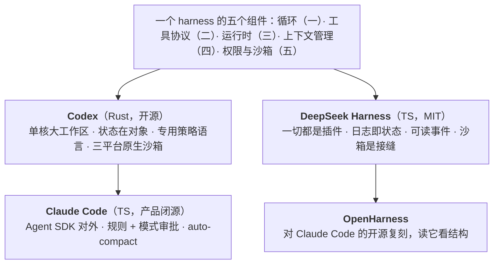

前五篇把 harness 拆成了组件：循环、工具协议、运行时、上下文管理、权限与沙箱。这一篇把四个真实的 harness 放在同一张表上——**OpenAI Codex**（`codex-rs`，Rust，开源，Agents API 的底座）、**DeepSeek Harness**（`dsh`，TypeScript，2026 年 8 月 13 日 v0.1 开发者预览，MIT，"一切都是插件"）、**Claude Code**（TypeScript，产品闭源、Agent SDK 与文件系统约定开放）、**OpenHarness**（HKUDS，Python，2026 年 4 月起，MIT，一万五千多星）——看它们在十二个维度上各怎么选、为什么。然后是三种交付形态的取舍：托管（Agents API）、库（Agents SDK / Agent SDK）、自托管 harness。

对照的依据是 2026 年 9 月中旬的源码快照与文档（总纲的版本基线）。两个开源 harness 都在快速迭代，模块名会变，机制层面的结论比路径稳定。这一篇不评"谁最好"——四个项目的目标不同（一个是产品底座、一个是可组合的研究平台、一个是闭源产品加 SDK、一个是轻量研究实现）——评的是每个选择换到了什么、付出了什么，以及从每家该学什么。

本篇要回答的核心问题是：

> **四个 harness 在架构、循环、工具、上下文、权限、沙箱、会话、子 agent、扩展、UI、模型耦合、基准十二个维度上各怎么选？[^q0] 这些选择背后的取舍是什么？[^q1] Agents API、SDK、自托管 harness 三种交付形态怎么选，从每家该学什么？[^q2]**

## 一、总览

### 1. 十二维对照

| 维度 | Codex | DeepSeek Harness | Claude Code | OpenHarness |
|---|---|---|---|---|
| **语言与架构** | Rust 工作区，几十个 `codex-*` crate；`core` 是重心（循环、配置、模型客户端、沙箱管理器） | TypeScript 单体仓库，几十个 `@deepseek-ai/dsh-*` 包；Cordis 插件树；profile → bundle → patch 三层配置 | TypeScript；产品闭源；Agent SDK（TS / Python）暴露同一基座 | Python（`pip install openharness-ai`）；`src/` 核心 + `ohmo` 个人 agent + React 终端前端 |
| **循环** | 三层：`submission_loop` → turn loop → `tools/orchestrator.rs`；操作 / 事件通道 | `core/agent-loop` 驱动，从 append-only 会话日志派生历史；循环本身是插件 | Agent SDK 的 `query()` 封装循环；hooks 在生命周期点介入 | 流式工具调用循环、API 重试退避、并行工具执行、token 与成本计数 |
| **工具** | `tools/registry.rs` 注册 → `router.rs` 路由 → `parallel.rs` 并行；处理器在 `tools/handlers/`（shell、`apply_patch`、`plan`、`tool_search`、`multi_agents`、MCP…）；`codex-mcp` / `rmcp-client` | `core/tools` 作用域注册表 + 带守卫的执行管线；工具是插件（`fs`、`shell`、`web`、`browser-use`、`computer-use`、`lsp`、`mcp`…） | 内置工具（Read / Edit / Bash / Grep / Glob / LSP / Agent…）+ MCP + 技能；工具 schema 延迟加载 | 工具使用、技能、MCP；插件系统 |
| **上下文** | `compact.rs` 本地 / `compact_remote_v2*` 服务端加密 / 预算 / 回退；`get_context_remaining`；截断规则"无 >10K token 的项" | `compaction` 五个包（自动 / 命令 / 修剪 / 图片卸载）+ `spill` 卸载 + `plan` / `todo` / `goal` | auto-compact 约 83.5%（预留 33K）；微压缩；CLAUDE.md 重注入；子 agent 隔离 | 记忆系统；上下文管理 |
| **权限与审批** | `PermissionProfile` 三档 + `AskForApproval` + `execpolicy`（Starlark 前缀规则）+ Guardian 模型审查 | 三档 + 审批策略插件（`dsh-base`）+ `guard` 卫士 | allow / deny / ask 规则 + 五种模式 + hooks + `canUseTool` 回调；六步判定 | 权限配置 |
| **沙箱** | 三平台原生：Seatbelt / bubblewrap + Landlock + seccomp / Windows 受限令牌；`network-proxy` | `sandbox` 接缝 + `sandbox-local` / `sandbox-policy` / `sandbox-windows-acl`；可换后端 | 工作目录与命令限制；云端由 Claude Code on the web / 云沙箱承担 | 依赖宿主（通常复用底层 CLI 的沙箱） |
| **会话** | `rollout`（每步记录）+ `thread-store`；"从 rollout 恢复"是兼容面 | 事件溯源 JSONL 日志 + 检查点 + 投影；"模型可见 ⟺ 已记录"；resume / fork / replay 同一流 | 会话文件；`--resume` / `--continue` | 会话持久化 |
| **子 agent** | `multi_agents` / `multi_agents_v2` 处理器；`agent-roles`、`agent-graph-store` | `subagent` 七种后端：spawn / fork / 驱动 / SDK / ACP / **Claude Code** / **Codex** | subagent（结果回主）与 agent teams（实验，互通） | 多 agent 协调 |
| **扩展模型** | plugins（`plugin`、`core-plugins`）、hooks（`hooks` crate）、skills（`skills`）、MCP、`AGENTS.md` | **一切皆插件**（含循环、卫士、沙箱、审批）；四种模式（Standard / Code / Minimal / Creator）是插件组合；profile / bundle / `cordis.patch.yml` | hooks、skills、plugins、MCP、CLAUDE.md、`.claude/agents`、`settingSources` | 插件、skills（含 `.claude/skills` 与 `.agents`） |
| **UI 面** | TUI（Ratatui）、`exec` 无头、`app-server`（JSON-RPC / WebSocket）供 IDE 与桌面端、`cloud-tasks` | `web`、`headless`、`sdk`（JSON-RPC）、`acp`（自动化）四个 profile；Python / TS SDK | CLI、IDE 集成、Agent SDK、Claude Code on the web、后台 agent | `oh` CLI、终端 Web 前端、ohmo 接 Feishu / Slack / Telegram / Discord |
| **模型耦合** | Responses API（`codex-api`、`responses-api-proxy`）；另有 `ollama` / `lmstudio` / `model-provider` crate | 多供应商：官方 `deepseek-official` 适配器 + `llm-pi-ai` 接 pi-ai 的模型目录；Python SDK 可指向本地代理 | Claude 专用（API / Bedrock / Vertex / Foundry） | 多 API 格式（含 `--api-format copilot`）；ohmo 复用 Claude Code / Codex 订阅 |
| **基准与研究** | 内部评测；开源便于审计 | **Minimal 模式**只留 shell 与文件编辑器，为在最小环境里公平比较模型；`BENCHMARK.md`、`benchmarks/` 性能门 | 公开 SWE-bench 等成绩 | 面向研究者：114 个单元 / 集成测试、E2E 脚本 |

### 2. 本文的章节安排

第二章逐维度讲取舍；第三章三种交付形态；第四章从每家学什么；第五章实践建议。

## 二、逐维度的取舍

### 1. 语言与架构：单核 vs 插件树 vs SDK

**Codex** 选 Rust 与一个大工作区：性能、单二进制分发、三平台沙箱的系统编程都受益；代价是 `core` 膨胀——仓库规范里专门写了"抵制往 `codex-core` 加代码"、"考虑新建 crate"，说明这是他们在对抗的重力。**DeepSeek Harness** 选"一切皆插件"：没有特权核心，模型适配器、工具、会话、沙箱、审批、压缩、循环都是 Cordis 插件，从 `cordis.yml` 组合；profile（命名的组合）叠 bundle（配置行 + 代码）叠 patch（用户覆盖）。换到的是极致的可替换性——换一个沙箱后端、卸掉一个卫士、加一个模式都不改源码；付出的是学习曲线（要懂 Cordis 的服务 / 事件 / 效果模型）与"预稳定 API，每个消费者都要更新"的迭代成本。**Claude Code** 把产品闭源、把基座以 SDK 开放：用户拿到同一套循环、权限、hooks、子 agent，但不能改内部；换到产品迭代速度与一致性，付出可审计性。**OpenHarness** 选 Python 与轻量：面向研究者与个人 agent（ohmo），复用别家的订阅与 CLI 作为底层。

### 2. 循环：状态在对象还是在日志

第一篇讲过：Codex 的会话对象持有历史、rollout 是持久化；DeepSeek Harness 的日志是状态、历史是派生。前者是多数系统的自然写法，后者让 resume / fork / replay 天然一致、让"模型可见 ⟺ 已记录"可以成为不变量，代价是每一步都要经过日志（性能门与 `benchmarks/` 就是为此）。Claude Code 与 OpenHarness 把循环封装在 SDK / 库里，用 hooks 开口。

### 3. 工具：注册 → 路由 → 并行 → 处理器

两个开源 harness 的工具层结构几乎同构：一个注册表、一个路由 / 分发、并行执行、每个工具一个处理器 / 插件。差别在**注册的作用域**（DeepSeek Harness 的 `scope` 原语让工具按 agent 作用域注册——子 agent 可以有不同的工具集）与**MCP 的位置**（Codex 用独立的 `codex-mcp` / `rmcp-client` crate 并让 `mcp_connection_manager` 集中处理工具与调用的变更；DeepSeek Harness 的 `mcp` 是一个包组）。Claude Code 的 MCP 工具 schema 默认延迟加载（第二篇的 tool search）。

### 4. 上下文：加密 blob vs 可读事件

L2 第四篇与本系列第四篇讲过：Codex 的服务端压缩返回只有 OpenAI 能解的加密 item——保留模型内部状态、损失可能更小、但不可读不可审计且绑供应商；DeepSeek Harness 的压缩摘要是可读的会话事件——可审计、可换 prompt、可跨供应商，但只保留摘要写出的东西。这是"模型耦合"维度在上下文层的投影。两家都有"压缩前的便宜一步"（会话记忆 / 修剪器）与卸载（截断规则 / `spill`）。

### 5. 权限与审批：策略语言 vs 规则 + 模式 vs 插件

Codex 的 `execpolicy` 是四家里唯一的**专用策略语言**（Starlark、前缀匹配、三种决定、带测试）加 Guardian 模型审查——把"哪些命令危险"做成可版本化、可测试的工件，适合企业级的集中管理。Claude Code 的 allow / deny / ask 规则加五种模式加 hooks 加回调——**六步判定顺序**是四家里对"谁能覆盖谁"定义最精确的（deny 高于一切）。DeepSeek Harness 把审批策略做成插件——最灵活，但默认策略的强度取决于组合。OpenHarness 的权限配置相对简单。

### 6. 沙箱：原生三平台 vs 接缝 vs 依赖环境

Codex 在四家里对沙箱投入最重：三个平台各一套原生实现（Seatbelt 的 SBPL 文件、bubblewrap + Landlock + seccomp、Windows 受限令牌 + ACL + Job Objects）加网络代理——因为它是本地 CLI，沙箱是它唯一的强制层。DeepSeek Harness 把沙箱做成接缝加本地后端，可以换容器 / 云沙箱。Claude Code 本地的限制较轻，重的隔离交给云端产品。选择反映了各自的部署假设：本地 CLI 必须自己做沙箱，服务端产品可以靠基础设施。

### 7. 会话：兼容面 vs 不变量

Codex 把"从已有 rollout 恢复会话"列为与 app-server API、CLI 参数并列的外部兼容面——日志格式是契约。DeepSeek Harness 走得更远：日志格式有版本号，不认识的事件类型拒绝加载（除标 `ignorable`），迁移只能新增版本不能改旧的——把会话日志当作长期数据资产管理。

### 8. 子 agent：内建 vs 七种后端

Codex 的 `multi_agents`（含 v2）与 `agent-roles` 是内建的子 agent 机制；Claude Code 区分 subagent（结果回主、便宜）与 agent teams（互通、贵、实验）；DeepSeek Harness 把"委派"做成接缝加七种后端——其中 `subagent-claude-code` 与 `subagent-codex` 让它能把另外两家作为子 agent 拉起（第四篇）。互操作的基础是三家共享的 MCP、SKILL.md、AGENTS.md / CLAUDE.md，与可脚本化的入口。

### 9. 扩展模型：四种模式

DeepSeek Harness 的四种模式是"一切皆插件"最好的展示：Standard（全部工具）、Code（工具经 Code Mode SDK 暴露、模型写 TypeScript 程序组合多步——第二篇的 PTC）、Minimal（只留 shell 与文件编辑器）、Creator（检视运行时、内存里测插件、组合新模式）。同一个核心，四种 agent。Codex 与 Claude Code 的扩展点是 plugins / hooks / skills / MCP——加东西容易、换核心行为难。

### 10. UI 面：一个核心多个面

四家都是"一个核心、多个面"：Codex 的 TUI / exec / app-server（JSON-RPC 让 IDE 与桌面端复用同一会话）、DeepSeek Harness 的 web / headless / sdk / acp 四个 profile、Claude Code 的 CLI / IDE / SDK / web、OpenHarness 的 CLI / Web 前端 / 即时通讯。第三篇讲的"任务在运行时里不在连接里"是这个设计的前提。

### 11. 模型耦合：一家 vs 多家

Codex 对接 Responses API（reasoning item 跨轮、服务端压缩、PTC 都依赖它），另有 Ollama / LM Studio 等本地供应商 crate；Claude Code 是 Claude 专用；DeepSeek Harness 多供应商（官方适配器加 pi-ai 目录里的任何模型）；OpenHarness 多 API 格式。耦合深的一侧换到与模型能力（推理状态、服务端压缩）的紧密集成，松的一侧换到不锁定与多模型评测。

### 12. 基准：Minimal 模式

DeepSeek Harness 的 Minimal 模式值得单独说：只留 shell 与文件编辑器，"为在最小环境里对模型做基准"——它承认 harness 会影响模型的表现，所以比较模型时要把 harness 降到最小。L1 第五篇讲的"供应商自报分数条件不一"里的"脚手架"变量，在这里被显式控制。

## 三、三种交付形态

| | 托管：OpenAI Agents API | 库：Agents SDK / Claude Agent SDK / LangGraph | 自托管 harness：DeepSeek Harness / Codex 自建 / OpenHarness |
|---|---|---|---|
| harness 在哪 | OpenAI 侧（同一 harness 驱动 Codex 与 ChatGPT for Work） | 你的进程里，SDK 给原语 | 你的基础设施上，完整产品级实现 |
| 你管什么 | 工具、知识、工作流、沙箱选择 | 一切（持久化、挂起、事件流、隔离要自己搭） | 运维、组合、定制插件 |
| 沙箱 | OpenAI 托管或九家合作方或自有 | 自己 | 接缝 + 后端 |
| 模型 | OpenAI | 一家（两家 SDK）或多家（LangGraph） | 多家 |
| 日志与合规 | 供应商侧 | 你 | 你 |
| 上线成本 | 一次 API 调用 | 中 | 高（运维 + 学习） |
| 定制深度 | 工具与沙箱层 | 全部（自己写） | 全部（换插件） |
| 费用 | 无额外费，只收 token / 工具 / 容器 | 无 | 基础设施 |
| 早期数据 | 用户报告 4× 延迟降低、60% 每任务成本降低、86% 失败响应减少 | — | — |

选法（第三篇第五章）：快速上线且接受 OpenAI 模型 → 托管；需要深度控制且已有运行时基础 → 库；多模型、合规要求、平台团队 → 自托管。**混合是常态**：用托管做原型验证价值、日志格式自己定，再决定要不要迁到自托管；或自托管 harness 做运行时中心、把子任务委派给托管的 Codex（第四篇的跨 harness 子 agent）。

## 四、从每家学什么

| 家 | 值得学的一件事 | 为什么 |
|---|---|---|
| Codex | **`execpolicy`**：把危险命令的判定做成有测试的策略语言 | 权限从临场判断变成可版本化、可审查的工件；`match` / `not_match` 让规则不会静默放过 |
| Codex | **三平台原生沙箱**与"沙箱拒绝不自动升级" | 审批不够，强制才够；升级要新审批 |
| Codex | **"无 >10K token 的项"审查规则** | 卸载作为代码审查纪律 |
| DeepSeek Harness | **"模型可见 ⟺ 已记录"** | 一个不变量换来 resume / fork / replay / 审计的一致性 |
| DeepSeek Harness | **一切皆插件 + Minimal 模式** | 可替换性让实验（换沙箱、换审批、换循环）与公平基准成为可能 |
| DeepSeek Harness | **`spill` / `guard` / `subagent` 作为独立包组** | 卸载、卫士、委派各是一个可换的接缝，而不是循环里的 if |
| Claude Code | **六步判定顺序与"deny 高于一切"** | 可编程（hooks、回调）与硬边界（deny）的精确分层 |
| Claude Code | **subagent vs agent teams 的诚实取舍表** | 什么时候要贵的那种，文档说清了 |
| Claude Code | **`settingSources`、CLAUDE.md、`.claude/agents`、skills 的文件系统约定** | 把配置放在仓库里、随代码版本化——L2 第六篇 |
| OpenHarness | **轻量与复用** | 不是每个团队都需要五十万行；复用底层 CLI 的订阅与沙箱、把精力放在个人 agent 的交互（即时通讯）上，是一种务实路线 |
| 全部 | **一个核心多个面**、**MCP + SKILL.md + AGENTS.md 的共享层**、**压缩前的便宜一步** | 四家独立收敛到的东西，大概率是对的 |

## 五、实践建议

1. **用十二维表给自己的 harness 打分**：每个维度写现状，空格就是差距；多数团队在"会话"、"执行策略"、"沙箱"三格是空的。
2. **选交付形态**用第三章的表，写下理由；原型阶段日志格式自己定。
3. **读一遍源码**：Codex 的 `execpolicy/README.md` 与 `tools/orchestrator.rs`，DeepSeek Harness 的 `docs/architecture.md` 与 `packages/core` 各 README，Claude Code 的权限文档——各一小时。
4. **抄三样东西**：执行策略语言（或等价的规则 + 测试）、事件溯源日志、可读的压缩摘要——它们不依赖任何一家的产品。
5. **试一次组合**：用一家做运行时、另一家做子 agent，验证互操作的成本。

## 六、本文小结

- 四个 harness 的目标不同：Codex 是产品底座（Rust、单核、Responses 耦合、三平台沙箱、`execpolicy` + Guardian）；DeepSeek Harness 是可组合的研究平台（TypeScript、一切皆插件、事件溯源日志、四种模式、七种子 agent 后端含另两家）；Claude Code 是闭源产品加开放 SDK（六步权限判定、subagent vs agent teams、文件系统约定）；OpenHarness 是轻量的 Python 研究实现（复用底层 CLI、个人 agent）。
- 取舍的主轴：状态在对象还是日志、压缩加密还是可读、权限用策略语言 / 规则 + 模式 / 插件、沙箱原生 / 接缝 / 依赖环境、模型耦合深 / 浅——每个选择换到一样东西付出另一样。
- 三种交付形态：托管（零运行时、绑 OpenAI、日志在供应商）、库（全控、全自建）、自托管（全换、多模型、运维）；混合是常态。
- 四家独立收敛到的东西——一个核心多个面、压缩前的便宜一步、MCP / SKILL.md / AGENTS.md 共享层、卸载、卫士、委派——大概率是 harness 的稳定结构。

## 七、自测

1. 为什么 Codex 的仓库规范要写"抵制往 `codex-core` 加代码"？DeepSeek Harness 用什么结构避免了同样的问题？

   

答案

   单核架构下 `core` 是最大的 crate，加新功能最省事的地方就是它，久而久之膨胀成一切的依赖；规范用审查纪律对抗这个重力。DeepSeek Harness 从架构上没有特权核心——每个能力是独立的插件包（`packages/<group>/<pkg>`），新行为放在扩展点上，"改 agent-loop 要更新架构文档"；代价是要懂 Cordis 与更高的迭代成本。详见[第二章](#二逐维度的取舍)。
   

2. Codex 的服务端加密压缩与 DeepSeek Harness 的可读压缩事件，各对"模型耦合"维度意味着什么？

   

答案

   加密 blob 只有 OpenAI 能解、保留模型内部状态——压缩质量可能更好，但把会话历史与 OpenAI 绑定，换模型时历史不可迁移、不可审计。可读事件可审计、可换摘要 prompt、可携带到任何模型——多供应商的前提，但只保留摘要写出的东西。上下文层的选择是模型耦合深浅的投影。详见[第二章](#二逐维度的取舍)。
   

3. 一个合规要求"每条命令的允许 / 禁止规则可审计、可测试、集中管理"的企业，四家里哪种机制最合？为什么？

   

答案

   Codex 的 `execpolicy`：Starlark 策略文件可放版本库、`match` / `not_match` 是加载时校验的测试、`justification` 进审批提示、CLI 可离线评估一条命令的判定——四个要求都满足。Claude Code 的规则可审计但没有内置测试；DeepSeek Harness 可用插件实现同样的东西但要自己写。详见[第二章](#二逐维度的取舍)、[第四章](#四从每家学什么)。
   

4. DeepSeek Harness 的 Minimal 模式解决 L1 第五篇里的哪个问题？

   

答案

   "供应商自报分数条件不一——脚手架不同不可横比"。Minimal 模式只留 shell 与文件编辑器，把 harness 对模型表现的影响降到最小，让不同模型在同一最小环境里比较；它显式承认 harness 是基准里的一个变量并把它控制住。详见[第二章](#二逐维度的取舍)。
   

5. 一个团队用 Agents API 做了原型，三个月后因为合规要日志留在自己数据中心。迁移到自托管 harness 时哪些东西能带走、哪些带不走？怎么在原型期就降低这个成本？

   

答案

   能带走：工具（MCP server、自定义函数）、技能（SKILL.md）、项目指令（AGENTS.md）、评测集与 prompt。带不走：Agents API 侧的会话历史（含服务端压缩的加密状态）、它的权限判定与压缩行为、对 OpenAI 模型特性（reasoning item、PTC 形态）的依赖。原型期降低成本：自己保留一份可读的会话记录（每步的输入输出与决策）、工具与技能按开放标准写、prompt 与评测集版本化、不依赖服务端状态做业务逻辑。详见[第三章](#三三种交付形态)、[第四章](#四从每家学什么)。
   

## 下一篇

[多 agent：编排、handoff 与 A2A](/multi-agent-orchestration-handoff-and-a2a.html)

[^q0]: 见第一章的十二维表。要点：Codex——Rust 工作区、`core` 为重心、三层循环、`tools/registry → router → parallel → handlers`、`compact*` 含服务端加密、`PermissionProfile` + `AskForApproval` + `execpolicy` + Guardian、三平台原生沙箱 + 网络代理、`rollout` / `thread-store`、`multi_agents` / `agent-roles`、plugins / hooks / skills / MCP、TUI / exec / app-server、Responses 耦合。DeepSeek Harness——TypeScript、一切皆插件（Cordis，profile / bundle / patch）、日志驱动循环、作用域注册表 + 守卫管线、`compaction` 五包 + `spill` + `plan` / `todo` / `goal`、三档 + 审批插件 + `guard`、`sandbox` 接缝、事件溯源 JSONL + 检查点、七种子 agent 后端（含 Claude Code / Codex）、四种模式、web / headless / sdk / acp、多供应商、Minimal 基准模式。Claude Code——TypeScript 闭源 + Agent SDK、`query()` 封装、内置工具 + MCP + skills、auto-compact 83.5%、六步权限判定 + 五模式 + hooks、本地轻沙箱 + 云端、subagent vs agent teams、文件系统约定、Claude 专用。OpenHarness——Python、轻量、工具 / 技能 / 记忆 / 多 agent、ohmo 接即时通讯、复用底层 CLI 订阅。详见[第一章](#一总览)。

[^q1]: 主轴与取舍：架构——单核（性能、单二进制；`core` 膨胀要靠纪律对抗）vs 插件树（极致可替换；学习曲线与预稳定迭代成本）vs 闭源 + SDK（迭代速度；不可审计）vs 轻量复用。循环——状态在对象（自然）vs 在日志（resume / fork / replay 一致、"模型可见 ⟺ 已记录"；每步经日志的性能成本）。上下文——加密 blob（保留内部状态；不可读、绑供应商）vs 可读事件（可审计可迁移；只留写出的）。权限——策略语言 + 模型审查（可版本化可测试，企业级）vs 规则 + 模式 + hooks（精确的覆盖顺序）vs 插件（最灵活，强度看组合）。沙箱——原生三平台（本地 CLI 唯一的强制层）vs 接缝可换后端 vs 依赖环境。会话——兼容面 vs 有版本的不变量。子 agent——内建 vs 七种后端（互操作）。模型耦合——深（推理状态、服务端压缩、PTC 的紧密集成）vs 浅（不锁定、多模型评测）。详见[第二章](#二逐维度的取舍)。

[^q2]: 三种形态：托管（Agents API——harness 在 OpenAI 侧、你管工具与沙箱选择、零运行时工程、无额外费、绑 OpenAI 模型、日志在供应商；早期用户报告 4× 延迟 / 60% 成本 / 86% 失败响应的改善）；库（Agents SDK / Claude Agent SDK / LangGraph——控制权在你的进程、持久化挂起事件流隔离自建）；自托管 harness（DeepSeek Harness 等——全部可换、多模型、日志与合规在自己处、运维与学习成本）。选法：快速上线且接受 OpenAI → 托管；深度控制且有运行时基础 → 库；多模型 / 合规 / 平台团队 → 自托管；混合是常态（托管做原型、自定日志格式、后迁）。从每家学：Codex 的 `execpolicy`、三平台沙箱与不自动升级、">10K token 项"审查规则；DeepSeek Harness 的"模型可见 ⟺ 已记录"、一切皆插件与 Minimal 模式、`spill` / `guard` / `subagent` 作为接缝；Claude Code 的六步判定与 deny 高于一切、subagent vs teams 取舍表、文件系统约定；OpenHarness 的轻量复用；四家共同收敛的一核多面、压缩前的便宜一步、MCP / SKILL.md / AGENTS.md 共享层。详见[第三章](#三三种交付形态)、[第四章](#四从每家学什么)。
