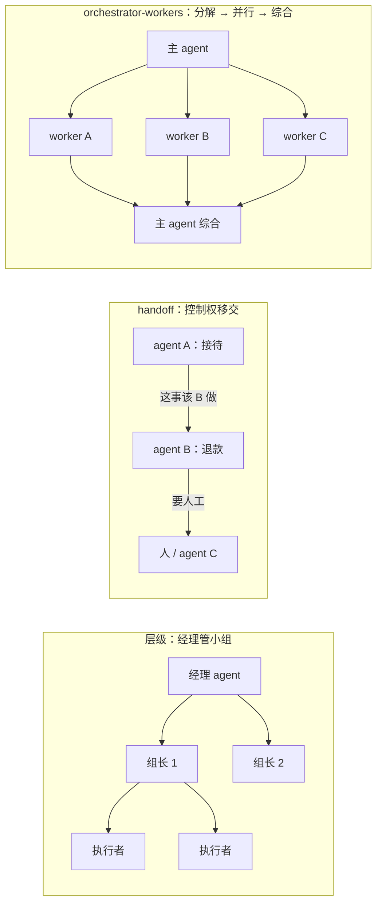

"多 agent"是 2025–2026 年被过度使用的词。多数被叫作多 agent 的系统，要么是一个 agent 加几个子 agent（第四篇），要么是一条工作流里几个模型调用（第一篇）；真正需要多个**对等的、有自己上下文与目标的** agent 协作的场景比想象中少。这一篇先说什么时候不需要，再讲三种真正的模式——orchestrator-workers、handoff、层级——各自的代表实现（Anthropic 的多 agent 研究系统、OpenAI Agents SDK 的 handoff、Claude Code 的 agent teams、GPT-5.6 的 ultra 模式）、跨厂商 agent 之间的协议 A2A，以及成本（Anthropic 的数字：约 15 倍于聊天的 token）与调试代价。

一条纪律贯穿全篇：**先用一个 agent 加更好的工具**。多 agent 是在单 agent 的工具、上下文、权限都做好之后，为了隔离、并行、专业化三个明确理由才引入的。

本篇要回答的核心问题是：

> **什么时候需要多 agent，什么时候不需要？[^q0] orchestrator-workers、handoff、层级三种模式各适合什么，代表实现是什么？[^q1] A2A 是什么、与 MCP 怎么分工，多 agent 的成本与调试代价有多大？[^q2]**

## 一、总览

### 1. 三个理由

| 理由 | 单 agent 的问题 | 多 agent 的解 | 替代方案（先试） |
|---|---|---|---|
| 上下文隔离 | 探索性工作把主窗口填满噪声 | 子 agent 在自己的窗口做，只回摘要 | 卸载与清理（第四篇） |
| 并行 | 几个独立子任务串行太慢 | 同时跑几个 agent | 并行工具调用（一步内多个调用） |
| 专业化 | 一个 agent 的系统提示、工具集、权限要同时满足互相冲突的需求 | 每个角色一个 agent（只读审查者、有写权限的执行者、有网络的研究者） | 按阶段屏蔽工具（L2 第五篇） |

Table: 多 agent 的三个理由

三个理由之一不成立，就不要多 agent。"让系统看起来像一个团队"不是理由。

### 2. 三种模式




```text
orchestrator-workers          handoff                      层级
      ┌─ worker A                agent A ──→ agent B         ┌─ 子 agent ─┬─ 子子 agent
主 ───┼─ worker B  → 主综合         │  （控制权移交）            主 ┼─ 子 agent  └─ 子子 agent
      └─ worker C                  └──→ agent C              └─ 子 agent
主 agent 分解 · 派发 · 综合       控制权在 agent 间流动         树状委派，每层综合下一层
```

### 3. 本文的章节安排

第二章 orchestrator-workers；第三章 handoff；第四章层级与 agent teams；第五章 A2A；第六章成本与调试；第七章实践建议。

## 二、orchestrator-workers

### 1. 模式

一个主 agent 读任务、**分解**成子任务、**派发**给多个 worker（并行）、收集结果、**综合**成最终输出。worker 之间不通信；主 agent 是唯一的协调者。这是第四篇的子 agent 在"多个并行"时的形态，也是多 agent 里最常用、最可控的一种。

### 2. 代表：Anthropic 的多 agent 研究系统

Anthropic 2025 年 6 月公开了他们研究功能的架构：一个 lead agent 规划、把研究问题拆成多个方向、并行派出 subagent 各自搜索与阅读、lead 综合并引用。他们给的经验值得抄：

- **派发指令要具体**：目标、输出格式、工具与来源的指引、任务边界——模糊的指令让 subagent 重复劳动或跑偏；
- **按复杂度定 agent 数与工具调用数**：简单事实一个 agent 几次调用，复杂对比多个 agent 各十几次；
- **让 lead 先想再派**：规划阶段的思考显著提高分解质量；
- **并行是墙钟时间的主要收益**：几个方向同时查，端到端时间从几十分钟到几分钟；
- **token 约 15 倍**：多 agent 系统用的 token 约是聊天的 15 倍（单 agent 约 4 倍），所以它只适合"任务的价值足以覆盖成本"的场景——研究、分析，而不是日常问答。

### 3. 什么时候用

任务可以分解成**互相独立**的子任务、子任务的结果可以**用摘要综合**、且**并行有价值**（子任务各自耗时）。典型：多方向研究、对多个仓库 / 文档做同样的分析、批量评审。

## 三、handoff

### 1. 模式

控制权在 agent 之间**移交**：agent A 处理到某一步，判断这件事该 B 做，把对话（或它的一部分）交给 B，B 接着做；B 可以再交给 C 或交回 A。每个 agent 有自己的指令、工具、权限；同一时刻只有一个 agent 在工作。

### 2. 代表：OpenAI Agents SDK

Agents SDK 把 handoff 做成一等原语：一个 agent 的可用 handoff 列表在模型眼里是一组特殊的工具（"transfer_to_billing"），模型调用它就把控制权与上下文交给目标 agent。典型：客服的分流 agent 把对话交给退款 agent 或技术支持 agent；每个专业 agent 的系统提示与工具集更聚焦、权限更小。

### 3. 与 orchestrator-workers 的区别

handoff 是**串行的专业化**——一个接一个，为的是每个阶段有更聚焦的 agent；orchestrator-workers 是**并行的分解**——同时做，为的是隔离与速度。客服分流用 handoff，多方向研究用 orchestrator-workers。handoff 的一个陷阱：上下文怎么传——全部传（B 看到 A 的所有历史，隐私与预算问题）还是摘要传（B 缺信息）——要按场景设计，与第四篇的派发指令同一问题。

## 四、层级与 agent teams

### 1. 层级

orchestrator-workers 的递归：worker 自己也是 orchestrator，再往下派。Codex 的 `agent-graph-store` 存 agent 之间的关系图；GPT-5.6 的 **ultra 模式**（"用子 agent 加速复杂的长程工作"）与 Responses API 的 multi-agent beta（"一次请求内运行并发子 agent 并综合"）是 API 层的层级——你发一个请求，供应商在内部起子 agent。层级的深度要有上限：每一层都在放大 token（第六章）与失败传播。

### 2. Claude Code 的 agent teams

第四篇的表：subagent 结果只回主 agent、主 agent 管一切、token 较低；agent teams 每个队友是独立实例、**互相直接通信**、**共享任务列表自协调**、token 较高、适合"需要讨论与协作的复杂工作"。它是四家里唯一把"对等 agent 互相通信"做成产品功能的，并且诚实地标为实验（默认关闭，文档写明会话恢复、任务协调、关闭行为有已知限制；v2.1.178 起免设置步骤）。它回答的是 orchestrator-workers 回答不了的情形：子任务之间**有依赖**、需要在过程中交换信息（一个改接口、一个改调用方，两边要对齐）。代价是协调的复杂度与成本——文档的建议是多数情况用 subagent。

### 3. 什么时候用哪种

| 情形 | 模式 |
|---|---|
| 独立子任务、只要结果 | orchestrator-workers（subagent） |
| 阶段性的专业化、一次一个 | handoff |
| 子任务之间有依赖、要协商 | agent teams（或重新分解让它们独立） |
| 任务太大一层放不下 | 层级（限深度） |
| 以上都不是 | 单 agent + 更好的工具 |

Table: 不同情形该用哪种多 agent 模式

## 五、A2A

### 1. 是什么

Agent2Agent 是 Google 2025 年 4 月发布、6 月捐给 Linux 基金会（AWS、Cisco、Microsoft、Salesforce 等参与）的协议，解决**跨厂商、跨组织的 agent 之间**怎么互相发现、委派任务、交换结果：每个 agent 发布一张 **agent card**（能力、端点、认证）、任务有生命周期（提交、进行中、需要输入、完成、失败）、消息与产物有结构。

### 2. 与 MCP 的分工

一句话：**MCP 是 agent 到工具，A2A 是 agent 到 agent**。MCP 让一个 agent 调用一个确定性的能力（读文件、查数据库）并得到结果；A2A 让一个 agent 把一个**任务**交给另一个有自己判断的 agent，任务可能持续很久、中途要输入、结果是开放的。两者互补：一个企业里的采购 agent 通过 A2A 把"比价"任务交给供应商的 agent，供应商的 agent 通过 MCP 查自己的价格系统。MCP 2026-07-28 的 Tasks 扩展（长操作、轮询、持久句柄）与 A2A 的任务生命周期有重叠，边界在演进。

### 3. 现状

A2A 的采用远不如 MCP：跨组织的 agent 协作在 2026 年仍是少数场景，多数多 agent 系统在一个组织、一个 harness 内部，用 harness 自己的子 agent 机制（第四篇）就够。DeepSeek Harness 的 `subagent-acp` 用的是 ACP（一种自动化协议）而不是 A2A，也说明协议层还没有收敛。建议：组织内部不需要 A2A；要与外部 agent 互操作时再看，并做好协议变化的准备。

## 六、成本与调试

### 1. 15 倍从哪来

每个 agent 有自己的系统提示、工具定义、读取的内容——都是输入 token；并行的 agent 各自的历史不同，**无法共享缓存前缀**（L2 第五篇：只有相同前缀才命中；多个 agent 共享同一 system 与工具定义的那一段可以命中，其余不行）；主 agent 要读全部摘要；失败的子任务要重做。Anthropic 的 15 倍是研究场景的数字，其他场景量级相近。**按任务看成本分布**（L1 第四篇）在多 agent 下是必需的：p95 可能是 p50 的十倍。

### 2. 失败传播

一个 worker 幻觉出一个结论，主 agent 综合时把它当事实；一个 handoff 目标拒绝了任务，控制权卡在中间；一个队友在 agent teams 里等另一个永远不来的消息。多 agent 的失败模式是**组合的**：单 agent 的每一条失效（L1 第一篇）乘以 agent 数，再加协调本身的失效。应对：每个 agent 有自己的预算与卫士（第一篇）；主 agent 对 worker 的结果做校验而不是直接信（要求 worker 返回证据与引用）；协调层有超时与死锁检测；整体有步数与美元上限。

### 3. 调试

trace 从一条链变成一棵树（甚至图）：主会话 → 子会话 → 步骤。要能从主 agent 的一个错误结论追到是哪个 worker 的哪一步产生的——每个子会话的完整轨迹进日志（第三篇），跨会话的引用（子会话 id）进主会话的事件。L5 讲轨迹评测与可视化；这里的要求是**日志结构支持树**。DeepSeek Harness 的 `subagent` 接缝里"发现每个创建的子 agent"、Codex 的 `agent-graph-store` 都是为此。

### 4. 评测

多 agent 系统的评测比单 agent 更贵：每次评测跑分是 15 倍的 token；轨迹更长更难标注。做法：先在单 agent 上评测每个角色的能力（worker 单独能不能完成子任务），再评测协调（分解是否合理、综合是否忠实），最后端到端——三层分开，与 L3 第七篇"检索与生成分开评"同一思路。

## 七、实践建议

1. **先写下三个理由中的哪一个成立**，写不出就不做多 agent；先试卸载、并行工具调用、按阶段屏蔽工具。
2. **从 orchestrator-workers 起步**：主 agent 分解 → subagent 并行 → 综合；派发指令按 Anthropic 的经验写（目标、格式、来源、边界）；worker 返回证据与引用。
3. **handoff 只用于阶段性专业化**，并明确上下文传全部还是摘要。
4. **agent teams 一类对等通信只在子任务有依赖时用**，先尝试重新分解让它们独立。
5. **每个 agent 独立预算与卫士，整体有美元与步数上限**；按任务看 p50 / p95。
6. **日志结构支持树**：子会话 id 进主会话事件，每个子会话完整轨迹可追。
7. **分三层评测**：角色能力、协调、端到端。
8. **组织内不需要 A2A**；跨组织互操作时再看，MCP 管工具、A2A 管 agent。

## 八、本文小结

- 多 agent 只为三个理由：上下文隔离、并行、专业化；每个理由都有更便宜的替代（卸载、并行工具调用、屏蔽工具）先试；纪律是先用一个 agent 加更好的工具。
- 三种模式：orchestrator-workers（主分解派发综合、worker 不互通——Anthropic 研究系统：派发指令具体、按复杂度定规模、lead 先想、并行省墙钟、约 15 倍 token）；handoff（控制权串行移交、每个 agent 聚焦——OpenAI Agents SDK；上下文传全部还是摘要要设计）；层级（递归的 orchestrator——GPT-5.6 ultra、Responses multi-agent beta；限深度）；Claude Code 的 agent teams 是对等互通、共享任务列表的实验形态，用于子任务有依赖的情形。
- A2A：agent 到 agent 的跨厂商协议（agent card、任务生命周期），MCP 是 agent 到工具；组织内用 harness 自己的子 agent 机制，跨组织再看 A2A，协议层未收敛。
- 成本 15 倍（独立提示与工具、缓存不共享、主读全部摘要、失败重做）；失败是组合的（每 agent 独立预算与卫士、结果要证据、协调层超时与死锁检测）；trace 是树；评测分角色 / 协调 / 端到端三层。

## 九、自测

1. 一个"读 20 份合同、抽取关键条款、生成对比表"的任务，团队设计了 5 个对等 agent 互相讨论。评价并给出更好的设计。

   <details markdown="1"><summary>答案</summary>
   子任务（每份合同的抽取）互相独立、只要结果、可并行——是 orchestrator-workers 的教科书场景，不需要对等讨论。更好：主 agent 派 20 个（或分批）subagent 各抽一份，返回结构化的条款（带页码引用），主 agent 生成对比表；每个 subagent 只读权限、独立预算。对等讨论只会多花 token 与协调失败。详见[第一章](#一总览)、[第二章](#二orchestrator-workers)。
   </details>

2. 客服系统里，分流 agent 判断问题类型后交给退款 agent 或技术 agent。这是哪种模式？上下文该传全部还是摘要？

   <details markdown="1"><summary>答案</summary>
   handoff：阶段性专业化、一次一个 agent、每个有聚焦的指令与更小的权限（退款 agent 才有退款工具）。上下文：传对话历史（用户说过的话是必要的）但不传分流 agent 的内部推理与与本问题无关的工具返回；隐私敏感字段按目标 agent 的权限过滤。详见[第三章](#三handoff)。
   </details>

3. 为什么并行的多个 agent 无法共享大部分缓存？哪一部分能共享？

   <details markdown="1"><summary>答案</summary>
   缓存只命中逐字节相同的前缀（L2 第五篇）；并行 agent 的历史各不相同，从各自第一条任务消息起就分叉。能共享的是分叉之前的部分——相同的系统提示与工具定义（如果它们真的相同且放在最前）。这是多 agent token 放大的原因之一。详见[第六章](#六成本与调试)。
   </details>

4. MCP 与 A2A 的一句话分工是什么？举一个两者同时出现的例子。

   <details markdown="1"><summary>答案</summary>
   MCP 是 agent 到工具（调用确定性能力得结果），A2A 是 agent 到 agent（把任务交给另一个有判断的 agent，任务有生命周期）。例：采购 agent 通过 A2A 把"比价"任务交给供应商的 agent；供应商 agent 通过 MCP 查自己的价格数据库，把结果作为 A2A 任务的产物返回。详见[第五章](#五a2a)。
   </details>

5. 一个 orchestrator-workers 系统的最终报告里有一个错误结论。按第六章，怎么定位到源头？需要日志具备什么？

   <details markdown="1"><summary>答案</summary>
   从主会话的综合步骤找到它引用的 worker 摘要，沿子会话 id 进入该 worker 的完整轨迹，找到产生该结论的步骤与它读到的内容（是检索到的错误材料、还是幻觉）。需要：主会话事件里记录每次派发与返回的子会话 id，每个子会话的完整轨迹（含工具返回）进日志，trace 结构支持树。预防：要求 worker 返回证据与引用，主 agent 综合时校验。详见[第六章](#六成本与调试)。
   </details>

## 下一篇

[memory 与 human-in-the-loop](/agent-memory-and-human-in-the-loop.html)

[^q0]: 只在三个理由之一成立时需要：上下文隔离（探索性工作填满主窗口——先试卸载与清理）、并行（独立子任务串行太慢——先试一步内的并行工具调用）、专业化（一个 agent 的提示、工具、权限要同时满足冲突的需求——先试按阶段屏蔽工具）。"看起来像团队"不是理由。多数被叫多 agent 的系统其实是单 agent 加子 agent 或一条工作流；纪律是先用一个 agent 加更好的工具，把单 agent 的工具、上下文、权限做好后再考虑。详见[第一章](#一总览)。

[^q1]: orchestrator-workers：主 agent 分解、并行派发、综合，worker 不互通——最常用最可控；代表 Anthropic 多 agent 研究系统，经验是派发指令具体（目标、格式、来源、边界）、按复杂度定 agent 数与调用数、lead 先想再派、并行省墙钟、token 约 15 倍；适合独立子任务、可用摘要综合、并行有价值。handoff：控制权串行移交，每个 agent 有聚焦的指令与更小权限——代表 OpenAI Agents SDK（handoff 在模型眼里是特殊工具）；适合阶段性专业化如客服分流；要设计上下文传全部还是摘要。层级：递归的 orchestrator——Codex `agent-graph-store`、GPT-5.6 ultra 模式与 Responses multi-agent beta 在 API 内起子 agent；限深度。Claude Code 的 agent teams 是对等互通、共享任务列表的实验形态（默认关闭、有已知限制），用于子任务有依赖要协商的情形，多数情况文档建议用 subagent。详见[第二章](#二orchestrator-workers)到[第四章](#四层级与-agent-teams)。

[^q2]: A2A（Google 2025-04 发布、06 捐 Linux 基金会）是跨厂商 agent 到 agent 的协议：agent card（能力、端点、认证）、任务生命周期（提交 / 进行 / 需输入 / 完成 / 失败）、结构化消息与产物；MCP 是 agent 到工具（确定性能力）——采购 agent 经 A2A 委派比价、供应商 agent 经 MCP 查价格；MCP Tasks 扩展与 A2A 有重叠，边界在演进；组织内用 harness 的子 agent 机制，A2A 采用远不如 MCP，协议未收敛（DeepSeek Harness 用 ACP）。成本约 15 倍聊天：每 agent 独立提示与工具、并行 agent 缓存不共享（只有分叉前的相同前缀能命中）、主读全部摘要、失败重做；按任务看 p50 / p95。失败是组合的：每 agent 独立预算与卫士、worker 返回证据与引用供主校验、协调层超时与死锁检测、整体美元与步数上限。调试要 trace 支持树（子会话 id 进主事件、每子会话完整轨迹）。评测分三层：角色能力、协调、端到端。详见[第五章](#五a2a)、[第六章](#六成本与调试)。
