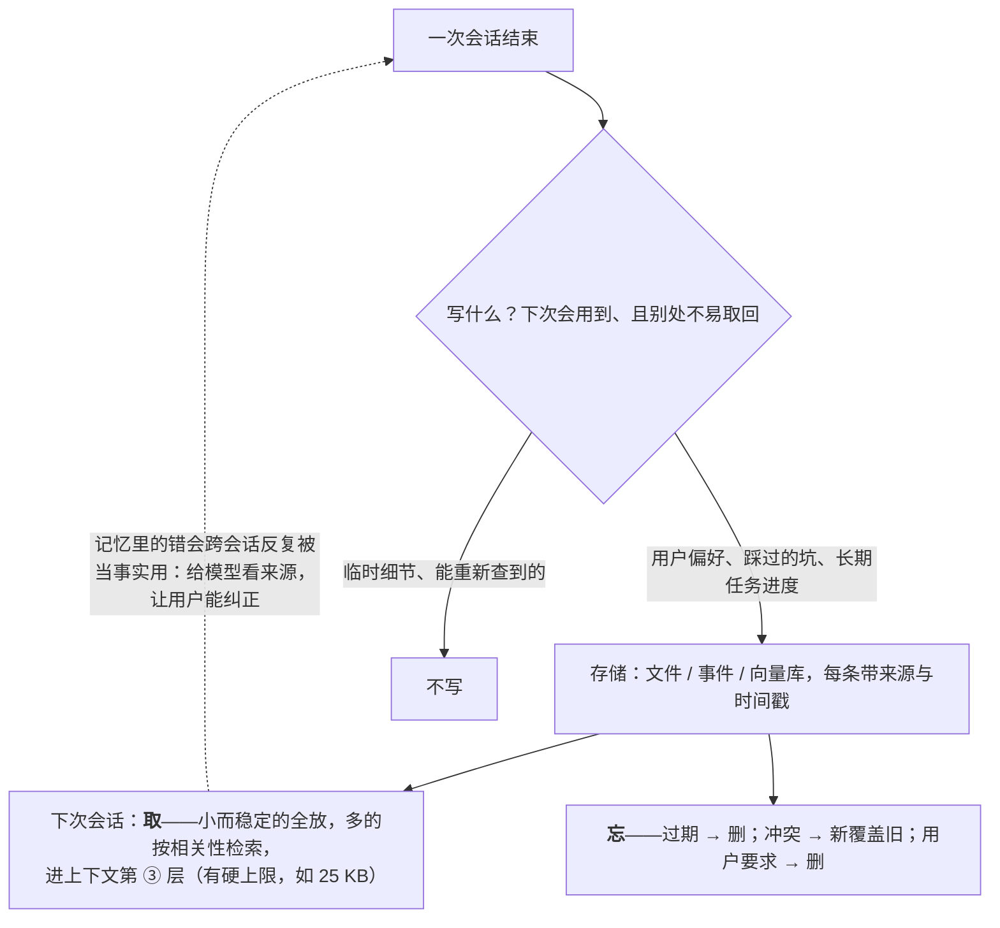

两个看起来不相关的话题放在一篇里，因为它们回答同一个问题：**agent 在一次会话之外靠什么工作**。记忆让它跨会话记住用户的偏好、项目的约定、上次失败的原因；人机分工决定它在多大程度上可以不问人就行动。两者都是"自主性"的组成部分——记得越多、越少问人，agent 越自主；而自主性的每一级都要用验证来换。

记忆的部分讲：记忆是一种特殊的检索（L3），会话内记忆就是上下文，跨会话记忆要存、要取、要忘；实现有 Anthropic 的 memory tool（模型自己驱动的文件式记忆）、Claude Code 的自动记忆（上限 200 行 / 25 KB）、Codex 的 `memories` crate、DeepSeek Harness 的 `goal` / `schedule`。人机分工的部分把地图里那张六级表展开——单步问答 → 短循环 → 长循环 → 策略化授权 → 后台异步 → 无人在环——每升一级把哪类验证从人手里交给系统；审批粒度按风险分级；agent 主动问人的协议（`request_user_input`、MCP 的 elicitation）；后台 agent 的监控形态；以及业务侧的 harness——本体驱动的业务 agent 怎样用结构替代"没有的测试"。

本篇要回答的核心问题是：

> **记忆怎么写、怎么取、怎么忘，四个实现各怎么做？[^q0] 人从环内退到环上、环外的六级各需要什么验证，审批粒度怎么定？[^q1] 业务动作没有测试可跑，本体驱动的业务 agent 怎么验证？[^q2]**

## 一、总览

### 1. 记忆的三个层次

| 层次 | 是什么 | 存在哪 | 生命周期 |
|---|---|---|---|
| 会话内 | 上下文本身（L2） | 会话日志（第三篇） | 一次会话；压缩时部分丢失 |
| 项目级 | 项目的约定、结构、命令（AGENTS.md / CLAUDE.md，L2 第六篇） | 仓库文件 | 随项目；人维护为主 |
| 跨会话 | 用户偏好、历史事实、上次的结论与失败 | 文件 / 数据库 / 向量库 | 长期；要有遗忘 |

Table: 记忆的三个层次

第三层是本篇的对象。它本质是**检索**（L3）：写入时决定存什么、取出时决定放什么进上下文（L2 的 ③ 层）、遗忘时决定删什么。

### 2. 人的六级

| 级 | 形态 | 人的位置 | 验证由谁做 |
|---|---|---|---|
| 1 | 单步问答 | 每步人发起 | 人看每个答案 |
| 2 | 短循环 agent | **in the loop**：每个有副作用的动作都确认 | 人 |
| 3 | 长循环 agent | in the loop，粒度变粗：只读自动、写确认、不可逆二次确认 | 人 + 自动验证循环（测试、lint） |
| 4 | 策略化授权 | 人定策略，运行时执行（第五篇的执行策略） | 策略 + 沙箱 + Guardian |
| 5 | 后台异步 agent | **on the loop**：看结果、看面板、抽检轨迹、处理告警 | 系统；人抽检 |
| 6 | 无人在环 | **out of the loop**，有退路 | 持续的轨迹评测与回归；异常自动降级回环内 |

Table: 人参与的六级

### 3. 本文的章节安排

第二章记忆的写、取、忘；第三章四个实现；第四章六级的每一级换了什么；第五章审批粒度与 agent 主动问人；第六章后台 agent 与 on-the-loop 的监控；第七章本体驱动的业务 agent；第八章实践建议。

## 二、记忆的写、取、忘

### 1. 写什么

不是一切。写入的判据：**下次会话会用到、且不会从别处轻易取回**。用户的偏好（"回答用中文、代码用 TypeScript"）、项目里踩过的坑（"这个仓库的测试要先起数据库"）、长期任务的进度（"上周已完成模块 A 的迁移"）、用户明确说"记住"的事。不写：一次性的工具返回（可再取）、能从文件系统 / 数据库查到的事实（那是 L3 的检索）、敏感信息（除非有明确的授权与存储策略）。

写入的触发有两种：**模型驱动**（模型判断"这值得记"并调用记忆工具——Anthropic memory tool 的模式）与**运行时驱动**（会话结束时自动提取——Claude Code 自动记忆的模式）。前者更准但依赖模型的判断，后者更全但会记很多噪声；生产系统常两者结合，再加人的编辑（用户能看到并修改记忆）。

### 2. 取什么

记忆进入上下文的 ③ 层（L2 第一篇），受预算约束——Claude Code 给自动记忆 200 行 / 25 KB 的硬上限。取法与 L3 相同：小而稳定的全放（项目级记忆），多的按相关性检索（用户的几百条历史事实按当前任务检索 top-k）。放的位置：半静态层（L2 第五篇的断点 ③——会话间变、会话内不变，可缓存）。

### 3. 忘什么

没有遗忘的记忆会变成噪声与错误的来源：过期的事实（"用 Python 3.9"）、互相冲突的记录、用户要求删除的内容。遗忘策略：**过期**（带时间戳、按类型设保留期）、**冲突解决**（新记录覆盖同主题的旧记录，或标记为已修正）、**用户控制**（能查看、编辑、删除——这也是隐私合规的要求）、**使用频率**（长期未被检索的降权或归档）。记忆的权限与 L3 第四篇同理：多用户系统里记忆按用户隔离，检索时过滤。

### 4. 记忆与幻觉

记忆里的错误会被模型当作事实反复使用——一次误记（"用户偏好 A"实际是"讨厌 A"）比一次幻觉危害更大，因为它跨会话持续。写入要有来源（这条记忆来自哪次会话的哪句话），取出时给模型看来源，用户能纠正。

## 三、四个实现

| 实现 | 形态 | 谁驱动 | 上限与遗忘 | 特点 |
|---|---|---|---|---|
| Anthropic memory tool | 模型可读写的文件式记忆目录（`/memories`） | 模型（判断值得记就写文件） | 由应用实现的后端决定 | 与 context editing、compaction 并列为 API 的三个上下文管理原语；cookbook 的研究 agent 例子：Session 2 从 Session 1 的记忆接着做；应用要引导"写什么到 `/memories`" |
| Claude Code 自动记忆 | 会话中自动记录的项目相关事实 | 运行时 | **前 200 行或 25 KB**；压缩后从磁盘重注入 | 与 CLAUDE.md（人维护）分层：自动记忆是机器写的、CLAUDE.md 是人写的 |
| Codex `memories` crate | 记忆的存储与注入 | 运行时 / 模型 | 受"无 >10K token 的项"审查规则约束 | 与 `agents_md` 并列作为常驻上下文的来源 |
| DeepSeek Harness `goal` / `schedule` | 会话目标 + 定时跟进 | 模型 / 运行时 | 作为会话事件进日志（"模型可见 ⟺ 已记录"） | 偏向"任务状态的持久化"而不是"用户画像"；`storage` 包组提供非会话存储 |

Table: 记忆的四个实现

四个实现的共同点：记忆是**文件或事件**，不是模型权重（L3 第一篇：事实进上下文不进权重）；进入上下文时受预算约束；与人维护的项目指令分层。差别在谁驱动写入（模型 vs 运行时）与记忆的对象（用户画像 vs 任务状态）。

## 四、六级：每一级换了什么

### 1. 从 2 到 3：审批粒度变粗

短循环里每个副作用动作都问；长循环里几十步每步都问就没人受得了（第五篇的审批疲劳）。变粗的依据是**风险分级**：只读自动（`read_only` 范围内的一切）、写工作区自动或按规则、不可逆与对外的确认、明确危险的禁止。同时引入**自动验证循环**：改完跑测试与 lint，结果回到上下文让模型自己修——这是 coding agent 能走几十步的原因：验证从人手里交给了测试。

### 2. 从 3 到 4：人定策略，运行时执行

第五篇的执行策略（`execpolicy`）、权限档、Guardian、沙箱：人不再逐个批，而是**写策略**——哪类命令允许、哪类问、哪类禁。审批只出现在策略说"问"的地方。这一级的前提是策略可测试（`match` / `not_match`）、可审计、可回滚的动作设计。

### 3. 从 4 到 5：人退到环上

agent 在后台跑（提 PR、生成报告草稿、批量处理），人不看过程、看**结果与面板**：任务完成率、成本、卫士触发次数、审批请求（异步处理）、异常告警；抽检轨迹（L5）。这一级要求：异步交付的形态（结果是一个可审阅的产物——PR、草稿、提案——而不是直接生效的变更）、完整的 trace、告警。Codex 的 `cloud-tasks`、Claude Code 的后台 agent、Agents API 的"跑几天的 agent"都是这一级的形态。

### 4. 从 5 到 6：无人在环，但有退路

只在**可自动验证 + 可回滚**的动作上：改代码提 PR 由 CI 验证、可 revert；数据分析生成报告可重跑；不能自动验证（给客户发合同）或不可逆（删数据）的动作永远停在环内或环上。这一级的运行要求：持续的轨迹评测与回归（模型升级、prompt 改动后重跑——L1 第五篇、L5）、异常自动降级回环内（卫士触发、评测掉分、成本异常时自动切回需要审批的模式）。

### 5. 一条判据

**能自动验证到什么程度，就能自主到什么程度**。代码有测试 → coding agent 能到 5–6 级；业务动作没有测试 → 停在 2–3 级，除非把验证前移到结构（第七章）；不可逆且验证成本极高（驾驶、电网控制）→ 验证要做成一门独立工程（仿真——地图 L5 的物理世界一节）。自动驾驶的 SAE 分级是同一条路径最严格的版本：L2 人在环内、L3 人在环上、L4 / L5 人在环外，每升一级对应验证体系的一次量级跳跃，不是模型换了一代。

## 五、审批粒度与 agent 主动问人

### 1. 按风险分级

| 级 | 动作 | 处理 |
|---|---|---|
| 只读 | 读文件、搜索、查询 | 自动 |
| 可逆的写 | 改工作区文件（有 git）、写草稿 | 自动或按规则；事后可 revert |
| 不可逆或对外 | 删除、发送、付款、部署、`git push --force` | 确认；高价值的二次确认 |
| 绕过障碍 | 遇到错误后提出删掉重建、换凭据、禁用检查 | 确认，并作为高风险信号（第五篇） |
| 明确危险 | 生产数据库的 DDL、系统级破坏 | 禁止 |

Table: 按风险分级的动作处理

分级写进执行策略；审批提示带 `justification`（为什么问）与影响范围（会改哪些文件、会调哪个外部系统）。

### 2. agent 主动问人

不只是"批准 / 拒绝"：agent 遇到歧义（"你要的是 A 还是 B"）、缺信息（"数据库密码在哪"）、需要决策（"两种方案各有代价，选哪个"）时应该**问**而不是猜——PocketOS 事件的模型侧一环正是"猜测而不是验证"。协议：Codex 的 `request_user_input` 工具处理器（同步与异步两种）、`elicitation.rs`；MCP 2026 版的 elicitation 让 **MCP server** 也能向用户要输入（server 需要一个确认或一个参数时经 client 问人）；Claude Code 的 `canUseTool` 回调与 `AskUserQuestion` 类工具。问人是一个**挂起点**（第三篇）：会话标为等待、释放 worker、人答了再继续。

### 3. 不该问的

问太多是另一种疲劳。系统提示里的主动性档位（L2 第二篇的 eagerness）与执行策略共同决定：只读与可逆的不问；歧义能从上下文合理推断的不问（但要在输出里说明假设）；只在不可逆、缺关键信息、真正的分叉决策时问。

## 六、后台 agent 与 on-the-loop

### 1. 异步交付

后台 agent 的产物是**可审阅的中间物**：PR 而不是直接合并、草稿而不是直接发送、提案而不是直接落库（Palantir 本体的"动作先生成提案，审批后落库"——第七章）。这让人在环上的审阅有一个自然的落点，也让回滚天然存在（不合并、不发送、不批准）。

### 2. 面板

on-the-loop 的人看什么：任务完成率与失败分类（第九篇）、每任务成本的分布、卫士触发（重复调用、预算耗尽、连续失败）的频率、审批请求队列（异步处理，带 `justification`）、评测集的回归趋势、成本预算的消耗。一个健康的后台 agent 系统，人每天看一次面板、处理几个审批、抽检几条轨迹。

### 3. 降级回环内

面板上的任何一项越界（完成率掉、成本涨、卫士频发、评测回归），系统应**自动**把自主级别降一级：从 5 回到 4（所有写操作重新需要审批）、或暂停新任务。这是"无人在环但有退路"的退路。

## 七、本体驱动的业务 agent

### 1. 问题

coding agent 能自主到 5–6 级，因为代码有测试。业务 agent（改派订单、审批工单、调整库存）**没有测试可跑**——一个错误的改派不会让 CI 变红，它直接影响客户。所以业务 agent 长期停在 2–3 级：每个动作人确认。

### 2. 把验证前移到结构

L3 第六篇讲了本体是什么；这里讲它作为 harness 怎样替代测试。Palantir Foundry 的 Ontology 加 AIP 的模式：agent 不碰数据库表与裸 API，只能在本体上工作——

| harness 组件 | 本体驱动的做法 | 对应 coding agent 的 |
|---|---|---|
| 工具集 | 本体动作：有类型、有校验、有权限的业务操作 | 读 / 写 / 执行工具 |
| 上下文 | 按对象与关系取数："这个客户的这几笔订单" | 按需读文件 |
| 权限 | 挂在对象与动作上，agent 继承发起人的权限；动作分自动 / 需审批 | 只读自动、写入确认 |
| 验证 | 动作有前置校验与业务规则；结果写回本体可追溯 | 测试、lint |
| 沙箱 | **动作先生成提案，人审批后才落库** | 工作目录隔离 |
| 可观测 | 每个动作有发起人、依据、时间的审计链 | trace |

Table: 本体驱动 harness 与 coding agent 的对应

它做的事是**把 agent 能做的错事的范围结构性地压小**：没有"删除卷"这个动作，或者它要求审批；"改派"只能改到有库存的仓、只能由有权限的人发起的会话执行、先是提案再落库。验证不是事后跑测试，是事前的类型、规则、权限。这让业务 agent 可以从 2 级走到 4 级（人定策略——哪些动作自动、哪些审批），部分走到 5 级（提案批量审阅）。

### 3. 对多数团队的含义

不必买一个完整的本体平台。务实的版本是 L3 第六篇说的"小本体"：对两三类核心对象定义关系导航与有校验、有权限的动作，让 agent 只能通过这些动作改数据，动作先生成提案。这已经把业务 agent 的错误上限从"任意 SQL"压到"几个受控的动作"。

## 八、实践建议

1. **定记忆的写入判据**（下次会用到且不易取回）与遗忘策略（过期、冲突、用户控制），每条记忆带来源，用户能查看编辑。
2. **记忆进半静态层，设硬上限**（参考 25 KB），多的按相关性检索。
3. **给每类动作标风险级**（只读 / 可逆写 / 不可逆对外 / 绕过障碍 / 危险），写进执行策略；审批提示带理由与影响范围。
4. **实现问人的挂起点**：`request_user_input` 类工具，问在不可逆、缺关键信息、真正分叉时；只读与可逆的不问。
5. **后台 agent 交付可审阅的中间物**（PR、草稿、提案），配面板与自动降级。
6. **业务 agent 先做小本体**：两三类对象、有校验有权限的动作、提案先于落库。
7. **写下你的 agent 现在在第几级、升一级缺什么验证**。

## 九、本文小结

- 记忆三层：会话内（上下文）、项目级（AGENTS.md / CLAUDE.md，人维护）、跨会话（本篇）；跨会话记忆是检索——写（下次会用且不易取回；模型驱动 vs 运行时驱动）、取（进半静态层、设上限、按相关性）、忘（过期、冲突、用户控制、使用频率）；误记比幻觉危害大，要带来源可纠正。
- 四个实现：Anthropic memory tool（模型驱动的 `/memories` 文件）、Claude Code 自动记忆（运行时驱动、200 行 / 25 KB、重注入、与 CLAUDE.md 分层）、Codex `memories`、DeepSeek Harness `goal` / `schedule`（任务状态、进日志）；共同点是文件或事件而非权重。
- 六级：2 → 3 审批按风险分级 + 自动验证循环；3 → 4 人定策略运行时执行（执行策略、Guardian、沙箱）；4 → 5 人退到环上（异步交付、面板、抽检）；5 → 6 只在可验证 + 可回滚的动作上、持续回归、异常自动降级；判据是能自动验证到什么程度就能自主到什么程度，SAE 分级是最严格版本。
- 审批粒度五级；agent 主动问人（`request_user_input`、MCP elicitation）是挂起点，问在不可逆、缺信息、真分叉时。
- 后台 agent 交付可审阅中间物，人看面板抽检，越界自动降级。
- 业务动作没有测试，本体把验证前移到结构（类型、规则、权限、提案先于落库），让业务 agent 从 2 级走到 4–5 级；小本体是务实起步。

## 十、自测

1. 一个 agent 把"用户说这个方案不行"误记成"用户偏好这个方案"，之后每次会话都推荐它。这类错误为什么比一次幻觉危害大？记忆系统该怎么设计以便发现与纠正？

   

答案

   幻觉是一次性的，误记跨会话持续、被模型当作事实反复使用。设计：每条记忆带来源（哪次会话的哪句话），取出时给模型看来源、在输出里能追溯"因为你之前说过…"，用户能查看、编辑、删除记忆；冲突解决让新的明确表述覆盖旧记录。详见[第二章](#二记忆的写取忘)。
   

2. Claude Code 的自动记忆与 CLAUDE.md 有什么分工？为什么自动记忆要设 25 KB 上限？

   

答案

   CLAUDE.md 是人写的项目指令，自动记忆是运行时从会话里提取的机器写的事实；分层让"用户能改的"与"机器累积的"各有生命周期，自动记忆的噪声不污染人维护的指令。上限是 L2 的预算：记忆进常驻层每轮都传，无上限会吞掉上下文；25 KB 是"够记关键事实、不占太多"的取舍。详见[第三章](#三四个实现)。
   

3. 一个数据分析 agent 每天生成报告并直接发给客户。它现在在第几级？要升到无人在环还缺什么？该不该升？

   

答案

   直接发送且无人审阅——形式上是 6 级，但缺 6 级的前提：发送对外且不可撤回、报告内容不能自动验证。它应该降到 5 级：报告作为草稿（可审阅的中间物），人在环上批量审阅后发送；或对报告加自动校验（数字与源数据核对、格式与模板校验）作为部分验证。不可逆且不能自动验证的动作不该无人在环。详见[第四章](#四六级每一级换了什么)、[第六章](#六后台-agent-与-on-the-loop)。
   

4. 业务 agent 为什么长期停在 2–3 级？本体怎样让它升级？给出"小本体"的最小形态。

   

答案

   业务动作没有测试可跑，错误直接影响客户，所以每个动作要人确认。本体把验证前移到结构：动作有类型、校验、权限，agent 只能做本体定义的动作，动作先生成提案再审批落库——错误上限从"任意 SQL"压到"几个受控动作"，人可以定策略（哪些自动、哪些审批）走到 4 级，提案批量审阅走到 5 级。小本体：两三类核心对象、关系导航、每类对象几个有校验有权限的动作、提案机制。详见[第七章](#七本体驱动的业务-agent)。
   

5. agent 在什么情况下应该主动问人、什么情况下不应该？问人在运行时里是什么操作？

   

答案

   应该：不可逆或对外动作前、缺关键信息（凭据、目标）、真正的分叉决策（两种方案代价不同）、遇到障碍想绕过时。不应该：只读与可逆的动作、能从上下文合理推断的歧义（说明假设即可）。运行时里问人是挂起点：把问题写进日志、会话标为等待、释放 worker、通过 `request_user_input` / elicitation 一类协议推给人，答复后任意 worker 加载会话继续。详见[第五章](#五审批粒度与-agent-主动问人)。
   

## 下一篇

[可靠性、评测与运营 agent](/agent-reliability-evaluation-and-operations.html)

[^q0]: 跨会话记忆是一种检索。写：判据是下次会话会用到且不易从别处取回（偏好、踩过的坑、长期任务进度、用户明确要记的），不写可再取的工具返回、能查到的事实、未授权的敏感信息；触发分模型驱动（memory tool）与运行时驱动（自动提取），常结合并加人的编辑；每条带来源。取：进上下文半静态层、设硬上限（Claude Code 25 KB）、小的全放多的按相关性检索、按用户隔离。忘：过期、冲突覆盖、用户可查看编辑删除、长期未用降权。误记比幻觉危害大——跨会话持续。四个实现：Anthropic memory tool（模型读写 `/memories` 文件，与 compaction、context editing 并列的三个原语）、Claude Code 自动记忆（运行时提取、200 行 / 25 KB、压缩后重注入、与人写的 CLAUDE.md 分层）、Codex `memories` crate（受"无 >10K token 项"规则约束）、DeepSeek Harness `goal` / `schedule`（任务状态与定时跟进作为会话事件）；共同点是文件或事件而非权重。详见[第二章](#二记忆的写取忘)、[第三章](#三四个实现)。

[^q1]: 六级：1 单步问答（人看每个答案）；2 短循环（每个副作用动作确认）；3 长循环（审批按风险分级——只读自动、写确认、不可逆二次确认——加自动验证循环：测试与 lint 结果回上下文让模型自修，验证从人交给测试）；4 策略化授权（人写执行策略、权限档，Guardian 与沙箱执行，审批只在策略说"问"处；前提是策略可测试可审计、动作可回滚）；5 后台异步（人在环上：异步交付可审阅中间物——PR、草稿、提案——看面板、抽检轨迹、处理异步审批）；6 无人在环（只在可自动验证 + 可回滚的动作上，持续轨迹评测与回归，异常自动降级回环内）。判据：能自动验证到什么程度就能自主到什么程度；SAE 分级是最严格版本。审批粒度按风险：只读自动、可逆写自动或按规则、不可逆与对外确认、绕过障碍确认并标高风险、危险禁止；提示带理由与影响范围。详见[第四章](#四六级每一级换了什么)、[第五章](#五审批粒度与-agent-主动问人)。

[^q2]: 业务动作没有 CI 可跑、错误直接影响客户，所以业务 agent 长期停在 2–3 级。本体（Palantir Ontology / AIP 的模式）把验证前移到结构：agent 不碰裸表与裸 API，只能在本体上工作——工具集是有类型、有校验、有权限的本体动作；上下文按对象与关系取数；权限挂在对象与动作上、agent 继承发起人权限、动作分自动 / 需审批；验证是动作的前置校验与业务规则、结果写回本体可追溯；沙箱是"动作先生成提案，审批后才落库"；可观测是每个动作的发起人、依据、时间审计链。它把能做的错事的范围结构性压小（没有"删除卷"或它要审批），让业务 agent 从 2 级走到 4 级（人定策略）、部分到 5 级（提案批量审阅）。多数团队不必买平台：小本体——两三类核心对象、关系导航、几个有校验有权限的动作、提案先于落库。详见[第七章](#七本体驱动的业务-agent)。
