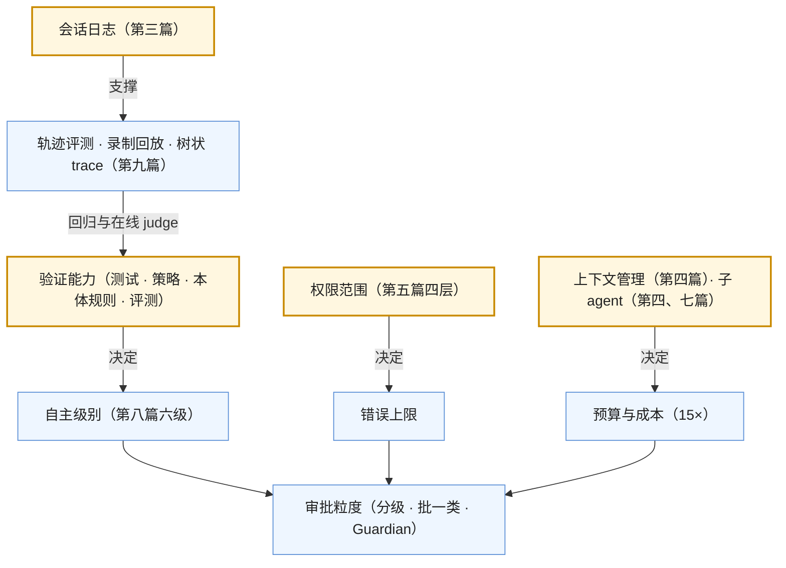

九篇正文回答了一个问题：**模型怎么从回答变成做事，以及让这件事可靠需要什么**。第一篇解剖循环，第二篇讲工具的协议，第三篇讲运行时，第四篇讲长任务的上下文与子 agent，第五篇讲权限与沙箱，第六篇把 Codex、DeepSeek Harness、Claude Code、OpenHarness 放在一张表上，第七篇讲多 agent，第八篇讲记忆与人机分工，第九篇讲可靠性、评测与运营。九篇合起来是[《AI 应用工程师学习地图》](/ai-application-engineer-learning-roadmap.html)第四层：**harness**——模型之外的一切。

本文不讲新内容：一张总表与九段回顾，贯穿九篇的四条线，常见误区，三段式通关自测。

> **读完这九篇，你应该能回答哪些问题？[^q0] 哪些数字与结论必须能脱口而出？[^q1] 怎么判断自己是"读过"还是"掌握"了？[^q2]**

## 一、总览：系列回答的问题与主线

系列的一句话主张是：**循环之外的一切都是 harness；权限范围是错误的上限；能自动验证到什么程度就能自主到什么程度**。

| 篇 | 回答的问题 | 一句话结论 | 必记的数字 / 结论 |
|---|---|---|---|
| [第一篇：最小循环](/anatomy-of-the-agent-loop.html) | 循环的最小形态与失控点？ | 40 行 + 四个卫士 + 两个出口才能上生产；Codex 三层（`submission_loop` → turn → 编排器），DeepSeek Harness 日志驱动；能用工作流就不用 agent | 编排器：审批 → 沙箱首试 → `never` / `on-request` 不升级；"模型可见 ⟺ 已记录" |
| [第二篇：工具与 MCP](/tool-calling-mcp-tool-search-and-programmatic-tool-calling.html) | 工具的生态协议？ | MCP 2026-07-28 无状态核心、扩展框架、授权加固；描述从模型视角写；tool search 换预算付缓存；PTC 让中间结果不进上下文 | AAIF 治理、SDK 十亿下载；DCR → CIMD；`resource` 绑定受众；四家的 PTC；二十个以上工具用 tool search |
| [第三篇：运行时](/agent-runtime-sessions-persistence-and-durable-execution.html) | 第三种服务形态？ | 事件溯源会话日志是核心；durable execution；挂起释放 worker；托管 / 库 / 自托管三种交付 | Agents API 2026-09-10、九家沙箱、无额外费、86% 失败响应减少；resume / fork / replay 同一流 |
| [第四篇：上下文与子 agent](/long-horizon-context-management-and-subagents.html) | L2 策略的实现？子 agent？ | `spill` / 截断规则 → 修剪 → `compact*` / `compaction` 五包；plan / todo / goal；子 agent 三形态；DeepSeek Harness 能拉起 Claude Code 与 Codex | 多 agent 约 15 倍 token；"无 >10K token 的项"；subagent vs agent teams 表 |
| [第五篇：权限与沙箱](/permissions-sandboxes-and-security-boundaries-for-agents.html) | 怎么压低错误上限？ | 四层缺一不可：权限档、审批策略、执行策略（`execpolicy` Starlark + Guardian）、沙箱（三平台）；Claude Code 六步 deny 高于一切；PocketOS 五环三环在基础设施 | `:read_only` / `:workspace` / `:danger_full_access`；allow / prompt / forbidden 带 `match` / `not_match`；审批疲劳用策略化授权 |
| [第六篇：源码对照](/coding-agent-harness-comparison-codex-deepseek-harness-claude-code.html) | 四个 harness 各怎么选？ | 十二维表；取舍主轴是状态在对象 / 日志、压缩加密 / 可读、权限策略语言 / 规则 / 插件、沙箱原生 / 接缝、模型耦合深 / 浅；三种交付形态 | Rust 单核 vs TS 一切皆插件 vs 闭源 + SDK vs Python 轻量；Minimal 模式 |
| [第七篇：多 agent](/multi-agent-orchestration-handoff-and-a2a.html) | 何时需要、哪种模式？ | 三个理由（隔离、并行、专业化）；orchestrator-workers / handoff / 层级；agent teams 实验；MCP 管工具 A2A 管 agent | 15 倍；缓存不共享；trace 是树；三层评测 |
| [第八篇：记忆与人](/agent-memory-and-human-in-the-loop.html) | 会话之外靠什么？ | 记忆是检索（写 / 取 / 忘、带来源）；六级人机分工每级换验证；本体把验证前移到结构 | 25 KB；六级表；风险五级；提案先于落库 |
| [第九篇：可靠性与评测](/agent-reliability-evaluation-and-operations.html) | 可靠吗？怎么运营？ | 十类失败只一类是异常；幂等 / 预算 / 部分结果 / 校验；轨迹评测六维；基准只缩范围；三级 trace + 面板十项 + 门禁 | Terminal-Bench 90.6 / 30.0 / 31.2；demo 到生产十二行清单 |

### 1. 本文的章节安排

| 章 | 内容 |
|---|---|
| 二 | 逐篇回顾 |
| 三 | 贯穿九篇的四条线 |
| 四 | 常见误区表 |
| 五 | 通关自测：A 判断与计算 10 题、B 跨篇综合 5 题、C 面试题 8 题、D 掌握判据 |
| 六 | 下一步 |

## 二、逐篇回顾

### 1. 第一篇：最小循环

**核心问题**：最小形态与失控点？两个生产循环各几层？工作流还是 agent？

**结论**：40 行循环加步数、预算、重复调用、单次超时四个卫士与两个额外出口（预算耗尽交付部分结果、卫士触发降级）。Codex：`submission_loop`（会话生命周期、操作 / 事件通道）→ turn loop（组装、调 Responses、边界处压缩）→ `tools/orchestrator.rs`（审批 → 选沙箱首试 → 被拒时 `never` / `on-request` 不升级、否则新审批后无沙箱重试）。DeepSeek Harness：`agent-loop` 领取 → 开 turn → 从 append-only 日志派生 → 流式 → 分发 → 追加；日志是状态；一切皆插件含卫士；四种模式。能写成工作流的不用 agent，多数系统是工作流里嵌一段循环。

**常见误解**：一个出口够；重复调用一定要强制终止；所有多步任务都是 agent。

### 2. 第二篇：工具与 MCP

**结论**：工具四个来源模型眼里相同。MCP 2026-07-28：无状态核心（去 `initialize` 与会话 id、协商进每请求）、多轮往返请求、扩展框架（Tasks、Apps、Skills over MCP、企业授权）、授权加固（`iss`、`resource`、DCR → CIMD）、弃用政策；AAIF 治理。描述从模型视角写、政策放系统提示、结果也是契约。tool search 换预算与选择准确率、付按需定义不可缓存。PTC（Anthropic、OpenAI GPT-5.6 ZDR 兼容、Cloudflare Code Mode、DeepSeek Harness Code 模式 / `ptc-runtime`、Codex `code-mode`）让中间结果不进上下文，付沙箱、可观测、编码能力、审批粒度。

**常见误解**：MCP 是 RPC 协议加会话；tool search 一定提高命中率；PTC 可以做默认。

### 3. 第三篇：运行时

**结论**：第三种服务形态的九行对比表；事件溯源日志解决持久化、任意步重放、分叉——"模型可见 ⟺ 已记录"、resume / fork / replay 同一流、格式有版本；Codex `rollout` / `thread-store` 是兼容面。durable execution 把确定性重放换成重放记录的输出；LangGraph checkpoint / `interrupt`、Temporal activity / signal、或自实现最小集。挂起释放 worker、等待会话数是容量；事件流从日志推前端；中断在步骤边界；按会话隔离。三种交付：Agents API（托管、九家沙箱、无额外费、绑 OpenAI、日志在供应商）、SDK、自托管。

**常见误解**：Web 框架能直接跑 agent；服务端状态省钱；托管运行时能换模型。

### 4. 第四篇：上下文与子 agent

**结论**：策略到实现的对照表；`spill`（存储 + 后端 + 策略）与 Codex "无 >10K token 的项"；修剪器在压缩前；`compact*` 模块族与 `compaction` 五包都多步可组合、写日志、思考链边界触发；plan / todo / goal 与 `get_context_remaining`。子 agent：Claude Code subagent（回主、便宜）vs agent teams（互通、贵、实验）；Codex `multi_agents`；DeepSeek Harness 七种后端含 Claude Code / Codex——互操作是事实。只为隔离、并行、专业化用；约 15 倍；效果取决于派发指令与返回摘要。

**常见误解**：子 agent 的 token 不算钱；串行任务也拆子 agent；harness 之间互斥。

### 5. 第五篇：权限与沙箱

**结论**：四层——权限档（静态范围）、审批策略（倾向）、执行策略（具体判定：`execpolicy` allow / prompt / forbidden 带测试；Guardian）、沙箱（强制：Seatbelt / bubblewrap + Landlock / 受限令牌；接缝可换；云沙箱）；缺一层各有事故原型；沙箱管不了合法凭据对外部系统的动作。Claude Code 六步：hooks → deny（高于一切）→ ask → 模式（`plan` 强制写送人）→ allow → 回调。工具返回是不可信输入，注入的最终防线是四层。PocketOS 五环三环在基础设施；"绕过障碍"是高风险信号。审批疲劳用分级、批一类、Guardian 先筛、`justification`、监控审批率与拒绝率。

**常见误解**：审批够了不需要沙箱；hook 的 allow 能绕过 deny；agent 安全全在 agent 里。

### 6. 第六篇：源码对照

**结论**：十二维表与逐维取舍；三种交付形态的表；从每家学什么——Codex 的 `execpolicy`、三平台沙箱与不自动升级、10K 规则；DeepSeek Harness 的"模型可见 ⟺ 已记录"、一切皆插件与 Minimal、独立接缝；Claude Code 的六步与 deny、subagent vs teams 表、文件系统约定；OpenHarness 的轻量复用；四家收敛的一核多面、压缩前便宜一步、共享层。

**常见误解**：有"最好的 harness"；加密压缩没有代价；交付形态是三选一。

### 7. 第七篇：多 agent

**结论**：三个理由与更便宜的替代；orchestrator-workers（Anthropic 研究系统的经验、15 倍）、handoff（Agents SDK、上下文传法）、层级（ultra、限深度）、agent teams（有依赖时）；A2A 管 agent、MCP 管工具，组织内不需要 A2A；成本来源、组合的失败、树状 trace、三层评测。

**常见误解**：多 agent 更聪明；并行 agent 能共享缓存；A2A 现在就要用。

### 8. 第八篇：记忆与人

**结论**：记忆三层，跨会话记忆是检索——写的判据、模型 vs 运行时驱动、进半静态层设上限、遗忘四策略、带来源；四个实现的表。六级每级换的验证；判据"能自动验证到什么程度就能自主到什么程度"；SAE 分级同构。风险五级与问人的挂起点（`request_user_input`、elicitation）。后台 agent 交付可审阅中间物、面板、自动降级。本体把验证前移到结构，让业务 agent 从 2 级到 4–5 级；小本体起步。

**常见误解**：记忆越多越好；直接发送 = 6 级；业务 agent 只能停在逐个确认。

### 9. 第九篇：可靠性与评测

**结论**：十类失败一类异常；幂等（`call_id` / 业务键、"已存在"不算失败）、四种预算同一出口、部分结果格式、"已完成"要佐证；轨迹评测六维、评测集从 trace 采固定环境、录制回放；基准四局限只缩范围；三级 trace + 决策点日志、面板十项、在线 judge、变更门禁；demo 到生产十二行。

**常见误解**：完成率够了；改工具要重跑模型；拒绝率降低是好事。

## 三、贯穿全系列的几条线

### 1. 循环之外的一切都是 harness

模型只做两件事——决定下一步、读结果。第一篇立框，第二篇（协议）、第三篇（运行时）、第四篇（上下文）、第五篇（权限）、第七篇（协调）、第八篇（记忆与人）、第九篇（可靠性）填格。第六篇的十二维表就是这个框的一次实例化。

### 2. 权限范围是错误的上限

L1 第一篇的结论在第五篇展开成四层，在第二篇（MCP server 是权限主体、PTC 的审批粒度）、第四篇（子 agent 的权限继承与收紧）、第七篇（handoff 的上下文与权限）、第八篇（风险五级、本体的动作权限）、第九篇（越权尝试作为指标）反复出现。harness 的首要价值是压低上限，其次才是让模型更能干。

### 3. 能自动验证到什么程度就能自主到什么程度

第一篇的自动验证循环让 coding agent 走几十步；第八篇的六级每一级把一类验证从人交给系统；本体把验证前移到结构；第九篇的轨迹评测与在线 judge 是"无人在环但有退路"的退路。

### 4. 日志是一切的底座

第三篇的事件溯源日志支撑：崩溃恢复、挂起唤醒、前端事件流（第三篇）、压缩与卸载的记录（第四篇）、审批与沙箱事件（第五篇）、子会话的追溯（第四、七篇）、记忆与目标（第八篇）、轨迹评测与录制回放与 trace（第九篇）。"模型可见 ⟺ 已记录"是一条不变量换来九件事的一致性。

### 5. 概念表

| 概念 | 出处 | 一句话 |
|---|---|---|
| 四个卫士 | 1 | 步数、预算、重复调用、单次超时 |
| 三层循环 | 1 | `submission_loop` → turn → 编排器 |
| 模型可见 ⟺ 已记录 | 1、3 | 进模型请求的一切都是会话事件 |
| 工作流 vs agent | 1 | 步骤能事先写出就用工作流 |
| 无状态核心 | 2 | MCP 2026-07-28：协商进每请求、去会话 id |
| tool search | 2 | 定义按需加载，换预算付缓存 |
| PTC | 2 | 模型写程序调工具，中间结果不进上下文 |
| 第三种服务形态 | 3 | 分钟到小时、模型决定控制流、每步持久化、会话为单位 |
| durable execution | 3 | 每步持久化、崩溃续跑、等待不占进程 |
| 挂起释放 worker | 3 | 等待中的会话是容量指标 |
| spill | 4 | 全文出上下文、返回定位符 |
| 复述 | 4 | plan / todo / goal 让目标在近端 |
| subagent vs agent teams | 4、7 | 回主 / 互通；便宜 / 贵 |
| 四层权限 | 5 | 权限档、审批策略、执行策略、沙箱 |
| `execpolicy` | 5 | Starlark 前缀规则 allow / prompt / forbidden 带测试 |
| deny 高于一切 | 5 | Claude Code 六步的硬边界 |
| 策略化授权 | 5、8 | 从批一个到批一类，解审批疲劳 |
| 三种交付形态 | 3、6 | 托管 / 库 / 自托管 |
| Minimal 模式 | 6 | 最小 harness 公平比模型 |
| 三个理由 | 7 | 隔离、并行、专业化 |
| MCP vs A2A | 7 | agent 到工具 vs agent 到 agent |
| 六级 | 8 | 环内 → 环上 → 环外，每级换验证 |
| 本体 harness | 8 | 动作有类型校验权限，提案先于落库 |
| 十类失败 | 9 | 只一类是异常 |
| 轨迹评测六维 | 9 | 结果、效率、过程、安全、鲁棒、部分结果 |

## 四、常见误区

| 误区 | 为什么错 | 出处 |
|---|---|---|
| "循环只要模型停就停" | 找不到答案时无限换词、工具挂死、费用无限 | 1 |
| "所有多步任务都做成 agent" | 能写成工作流的更便宜可预测；多数系统是工作流嵌循环 | 1 |
| "MCP 只是一个有会话的 RPC" | 2026-07-28 无状态核心、扩展框架、授权加固 | 2 |
| "tool search 一定提高缓存命中率" | 按需定义不在前缀里，命中率可能降；看绝对量 | 2 |
| "用 Web 框架直接跑 agent" | 任务随连接消失、重启从头；需要 durable execution | 3 |
| "审批等待占着 worker 没问题" | 100 个并发会话要 100 个空等的 worker；挂起要释放 | 3 |
| "托管运行时可以随时换模型" | Agents API 绑 OpenAI 模型、日志在供应商侧 | 3、6 |
| "子 agent 只回摘要所以便宜" | token 不进主窗口但都在账单上；约 15 倍 | 4、7 |
| "串行任务也拆子 agent" | 没有并行收益，多派发与摘要开销 | 4 |
| "审批够了不需要沙箱" | 命令文本看不出脚本的真实效果 | 5 |
| "hook 返回 allow 就放行" | Claude Code 里 deny 高于 hooks 与 `bypassPermissions` | 5 |
| "agent 安全全在 agent 里" | PocketOS 五环三环在基础设施 | 5 |
| "有最好的 harness" | 四家目标不同，每个选择换一样付一样 | 6 |
| "多 agent 更聪明" | 只为隔离、并行、专业化；15 倍成本、组合失败 | 7 |
| "并行 agent 共享缓存" | 只有分叉前的相同前缀能命中 | 7 |
| "现在就要接 A2A" | 组织内用 harness 子 agent；协议未收敛 | 7 |
| "记忆越多越好" | 噪声与误记；设上限、带来源、会遗忘 | 8 |
| "直接发送给客户 = 无人在环成功" | 不可逆且不能自动验证的动作不该无人在环 | 8 |
| "业务 agent 只能逐个确认" | 本体把验证前移到结构，可到 4–5 级 | 8 |
| "完成率 85% 就可靠" | 过程失败看不出；要成本、越权、鲁棒性 | 9 |
| "改工具要重跑模型回归" | 录制回放 | 9 |
| "拒绝率降到零是好事" | 审批疲劳或规则太松 | 5、9 |

## 五、通关自测

### A. 判断与计算（10 题）

1. 判断：Codex 的工具编排器在沙箱拒绝后会自动去掉沙箱重试。

   

答案

   错。`never` 与 `on-request` 下不重试，只返回拒绝说明；允许升级的策略要新审批（含新 Guardian 审查）后才无沙箱重试。
   

2. 计算：一个 orchestrator-workers 任务，主 agent 20K token 输入、5 个 worker 各 40K 输入、各返回 2K 摘要、主综合再 15K；按 Sonnet 5 输入 \$2 / 百万估输入侧成本（忽略缓存与输出）。

   

答案

   主：20K + 15K = 35K；worker：5 × 40K = 200K；摘要进主 5 × 2K = 10K（已含在 15K 里可不重复计）。约 235K × 2 / 10⁶ ≈ \$0.47；单 agent 做同一任务可能只要几十 K——这是"15 倍"的来源之一。
   

3. 判断：MCP 2026-07-28 版里，`initialize` 握手仍然是必需的。

   

答案

   错。核心改为无状态，版本与能力协商放进每个请求的 `_meta` 与 `MCP-Protocol-Version` 头，Streamable HTTP 去掉了会话 id。
   

4. 判断：Claude Code 在 `bypassPermissions` 模式下，deny 规则不再生效。

   

答案

   错。deny 规则在六步判定的第二步，即使 `bypassPermissions` 也生效——它是高于一切的硬边界。
   

5. 计算：一个 agent 的审批面板：每会话 40 次审批请求、拒绝率 0.5%；调整策略后每会话 4 次、拒绝率 15%。哪个状态更健康？为什么？

   

答案

   后者。前者是审批疲劳——人几乎全点允许，审批失效；后者只在真正需要判断处问，人在认真看（15% 被拒说明确实拦住了不该做的）。判据是"审批只出现在需要判断的地方"，不是次数越少越好，也不是越多越安全。
   

6. 判断：DeepSeek Harness 的 `subagent` 包组只能拉起 dsh 自己的子 agent。

   

答案

   错。七种后端里有 `subagent-claude-code` 与 `subagent-codex`，能把另两家 harness 作为子 agent 拉起，以及 ACP 与 SDK 后端。
   

7. 计算：常驻层 20K，每步工具返回 6K、输出 400，200K 窗口预留 35K。不卸载约第几步触发压缩？`spill` 后每步返回 1K 呢？

   

答案

   触发线 165K。不卸载：$$20{,}000 + (k-1) \times 6{,}400 \ge 165{,}000 \Rightarrow k-1 \ge 22.7$$，约第 24 步。卸载后每步 1,400：$$k-1 \ge 103.6$$，约第 105 步。
   

8. 判断：Agents API 对 harness 本身收费。

   

答案

   错。无额外费用，只收模型 token、工具与容器用量。
   

9. 判断：PTC 下工具的审批可以逐个调用进行。

   

答案

   错（默认情况下）。程序一次性运行、内部调用多个工具；高风险工具在 PTC 里要禁止、或让程序在调用它时挂起等审批——审批粒度是 PTC 的代价之一。
   

10. 判断：一个每天把分析报告直接发给客户、无人审阅的 agent 处于健康的第 6 级。

    

答案

    错。发送对外不可撤回、报告内容不能自动验证，不满足 6 级的前提（可验证 + 可回滚）；应降到 5 级交付草稿由人审阅，或加自动校验作为部分验证。
    

### B. 跨篇综合（5 题）

1. 一个团队要做"自动处理客户退款申请"的 agent：读申请与订单 → 查政策 → 判断 → 执行退款 → 通知客户。用第一、五、八篇设计它的循环、权限与自主级别。

   

答案

   循环：主体是工作流（五步固定），"查政策"一步嵌一个有步数上限的检索循环（L3）；四个卫士与部分结果出口。权限：读申请、订单、政策只读自动；"执行退款"是不可逆对外动作——执行策略 `prompt`，金额超过阈值二次确认或 `forbidden` 走人工；"通知客户"是对外发送——确认；工具是本体式的动作（`refund(order, amount)` 有校验：金额 ≤ 订单额、订单状态允许、发起人有权限）而不是裸支付 API；凭据不在 agent 可读处、退款 token 只能退款。自主级别：起步在 3 级（判断自动、退款确认），积累评测后对小额、政策明确的用规则批一类（4 级），大额永远确认；退款先生成提案再由人批量审阅（5 级的中间物）。
   

2. 一个 coding agent 在第 30 步删了一个不该删的目录。用第五篇的四层与第九篇的失败分类分析：哪层失守、属于哪类失败、事后要改什么。

   

答案

   失败类：幻觉的动作（或绕过障碍）。四层排查：权限档——目录在 `workspace` 可写范围内（范围本身合理）；执行策略——`rm -rf` 类命令是否 `prompt`，若是 `allow` 则这层失守；沙箱——工作区内的删除沙箱不拦（沙箱管越界不管范围内破坏）；审批——若有 `prompt` 但人点了允许，是审批疲劳。事后：`rm -rf` 与批量删除设 `prompt` 并带 `justification`；Guardian 把"删除目录"列为高风险；把"绕过障碍"（因为构建失败而删目录重建）写进审查 prompt；工作区用 git 保证可回滚；trace 里查它为什么决定删（第 29 步看到了什么）。
   

3. 比较 Codex 与 DeepSeek Harness 处理"任务跑了 40 步、上下文接近上限、崩溃后重启"的完整路径。

   

答案

   Codex：接近上限时在 turn 边界先试会话记忆压缩（结构化任务状态替代摘要），不够则调 `/responses/compact` 得加密 item 进 rollout；崩溃后从 rollout 恢复会话（外部兼容面），历史里含压缩 item，服务端解密续跑；未完成的工具调用靠幂等判断。DeepSeek Harness：`compaction-tool-result-pruner` 先修剪、`compaction-basic` 生成可读摘要事件写进 append-only 日志；崩溃后 `agent-loop` 从日志派生历史（含摘要事件）resume——"模型可见 ⟺ 已记录"保证重建的上下文与崩溃前一致；检查点保护已完成步骤与工具副作用。差别：压缩形态（加密 vs 可读）、状态模型（对象 + 持久化 vs 日志即状态）。
   

4. 为什么"能自动验证到什么程度就能自主到什么程度"同时解释了 coding agent 最先成熟、业务 agent 停在 2–3 级、自动驾驶花十几年？本体在这条判据里的位置是什么？

   

答案

   代码有测试、lint、类型检查——自动验证循环让 agent 几十步自主并能走到后台 PR（5–6 级）。业务动作没有测试、错误直接影响客户——验证只能靠人，停在逐个确认。自动驾驶不可逆且验证成本极高——每升一级 SAE 要重建验证体系（仿真、影子模式），所以花十几年。本体把业务动作的验证前移到结构（类型、规则、权限、提案）——不是事后跑测试而是事前约束，让业务 agent 有了"部分自动验证"，能到 4–5 级。
   

5. 把本系列九篇对应到 L1 的七条失效模式与 L2、L3 的关键结论：每篇主要防哪条、用了前面哪些层的东西。

   

答案

   1 防非确定性的死循环（卫士），用 L1 工具协议；2 防指令遵循（用错工具）与上下文（定义占预算），用 L1 第二篇、L2 第五篇缓存；3 防"任务丢了"与供应商锁定，用 L1 第三篇推理状态（重放不重跑）；4 防上下文标称 ≠ 有效与预算耗尽，是 L2 第四篇的实现，子 agent 用 L2 第一篇隔离；5 防越界，是 L1 第一篇 PocketOS 的答案，工具返回不可信来自 L1 第二篇；6 综合；7 防预算耗尽（15 倍），缓存不共享来自 L2 第五篇；8 防不可逆错误（人）与知识截止（记忆是 L3 的检索，本体是 L3 第六篇）；9 验证全部，评测集方法来自 L1 第五篇、L3 第七篇。
   

### C. 面试题（8 题）

1. 什么是 harness？为什么 2026 年它成了独立产品？

   

答案

   **答案要点**：(1) 模型之外的一切：循环、工具协议、运行时与会话日志、上下文管理、权限与沙箱、子 agent、记忆、人机分工、评测；模型只决定下一步与读结果；(2) 同一模型、不同 harness，agent 能力差一个量级——DeepSeek 与 OpenAI 都以此为发布理由；(3) 2026 年的三个事件：Agents API（9 月 10 日，托管 Codex 的 harness）、DeepSeek Harness（8 月 13 日，一切皆插件）、Claude Agent SDK；(4) 事故（Replit、PocketOS、OpenAI–HF）说明缺哪一格会怎样；(5) 三种交付形态。
   **追问方向**：harness 与框架（LangChain）的区别（运行时、权限、沙箱、日志的完整性）；从每家学什么。
   **好答案与一般答案的区别**：一般答案说"agent 框架"；好答案列出组件、说出"权限范围是错误上限"与"验证决定自主"两条原则、举出三个 harness 的具体机制。

   

2. 设计一个 agent 的权限系统。要有哪几层，各家怎么做，你会怎么选？

   

答案

   **答案要点**：(1) 四层：权限档（Codex 三档 / Claude Code 规则）、审批策略（`AskForApproval`）、执行策略（`execpolicy` Starlark 前缀规则 allow / prompt / forbidden 带 `match` / `not_match`；Guardian 模型先审）、沙箱（Seatbelt / bubblewrap + Landlock / 受限令牌；接缝可换；云沙箱）；(2) 缺一层的事故原型；(3) Claude Code 六步与 deny 高于一切；(4) 沙箱管不了合法凭据对外部系统的动作——token 范围与环境隔离是基础设施的事；(5) 工具返回不可信；(6) 审批疲劳用策略化授权；(7) 我的选择：默认 `workspace`、执行策略覆盖删除 / 强推 / 对外写、沙箱不自动升级、PocketOS 五环自检。
   **追问方向**：PTC 下的审批粒度；子 agent 的权限继承。
   **好答案与一般答案的区别**：一般答案说"要有审批"；好答案分四层、给三家的具体机制、说出沙箱的边界与基础设施侧的责任。

   

3. 解释事件溯源的会话日志为什么是 agent 运行时的核心，并说明它支撑了哪些功能。

   

答案

   **答案要点**：(1) agent 状态复杂、每步要持久化、要能回答"第 17 步看到了什么"、要能分叉；持有可变对象做不到，append-only 事件 + 派生状态做到；(2) DeepSeek Harness 的不变量"模型可见 ⟺ 已记录"，resume / fork / search / replay 同一流，格式有版本；Codex 的 rollout 是兼容面；(3) 支撑：崩溃恢复（幂等重放）、挂起唤醒（释放 worker）、前端事件流（断开不影响任务）、压缩与卸载记录、审批与沙箱审计、子会话追溯、录制回放与轨迹评测、trace；(4) 与 durable execution 的关系：重放记录的模型输出而不重跑。
   **追问方向**：日志的成本与脱敏；加密压缩 item 在日志里的可迁移性。
   **好答案与一般答案的区别**：一般答案说"要存历史"；好答案说出不变量、派生状态、九件被支撑的事与"重放不重跑"。

   

4. 比较 Codex 与 DeepSeek Harness 的架构选择，各换到什么、付出什么。

   

答案

   **答案要点**：(1) Rust 单核工作区 vs TypeScript 一切皆插件（Cordis，profile / bundle / patch）；(2) 状态在对象 + rollout vs 日志即状态；(3) 压缩加密 blob（保留内部状态、绑 OpenAI）vs 可读事件（可审计可迁移）；(4) `execpolicy` + Guardian vs 审批策略插件；(5) 三平台原生沙箱 vs 接缝 + 后端；(6) Responses 耦合 vs 多供应商；(7) 内建子 agent vs 七种后端含另两家；(8) 目标不同：产品底座（性能、单二进制、沙箱投入重、`core` 膨胀靠纪律）vs 研究平台（极致可替换、Minimal 模式、学习曲线与预稳定成本）。
   **追问方向**：从各家学什么；什么时候选哪个。
   **好答案与一般答案的区别**：一般答案比较语言；好答案在八个维度各说出取舍并落到项目目标。

   

5. 什么时候需要多 agent？设计一个多方向研究 agent 并估成本。

   

答案

   **答案要点**：(1) 三个理由与替代方案；研究任务满足隔离 + 并行；(2) orchestrator-workers：lead 先规划分解、每个方向一个 subagent（只读工具、独立预算、派发指令含目标 / 格式 / 来源 / 边界）、返回带引用的摘要、lead 综合并校验引用；(3) 成本约 15 倍聊天（各自提示与工具、缓存不共享、主读全部摘要），按任务看 p50 / p95；(4) 失败：worker 幻觉被误信——要证据；协调超时；(5) trace 是树；三层评测；(6) 不需要 A2A（组织内）。
   **追问方向**：什么时候用 agent teams（子任务有依赖）；怎么降成本（共享前缀、限制方向数）。
   **好答案与一般答案的区别**：一般答案画一个"多个 agent 协作"的图；好答案给出模式选择理由、派发指令要素、15 倍的来源与三层评测。

   

6. agent 上生产前的清单是什么？哪几项 demo 通常没有？

   

答案

   **答案要点**：第九篇十二行——循环卫士与出口、工具描述与 MCP 授权与 tool search / PTC、日志与恢复与挂起与隔离、卸载清理压缩复述、权限四层与五环自检与审批分级、交付形态理由、多 agent 理由与树 trace、记忆与风险级与问人与中间物与自主级别、幂等与预算与部分结果与校验、轨迹评测集与录制回放、trace 与面板与在线 judge 与门禁、fallback 链与版本钉住。demo 通常只有循环的前半——没有卫士、没有日志、没有执行策略与沙箱、没有评测集、没有面板。
   **追问方向**：优先补哪几项（日志、执行策略、评测集）；怎么衡量补完了（面板十项有数）。
   **好答案与一般答案的区别**：一般答案说"要加监控和测试"；好答案按 harness 组件逐项列并指出 demo 缺的是结构性的几层。

   

7. 解释 PTC（程序化工具调用）解决什么问题、四家怎么做、代价是什么。

   

答案

   **答案要点**：(1) 多步数据处理下中间结果逐轮进上下文、占预算、模型"手算"有幻觉；(2) 模型写程序在沙箱里调多个工具、只回结果——Anthropic PTC、OpenAI GPT-5.6（ZDR 兼容因为中间结果不落存储）、Cloudflare Code Mode、DeepSeek Harness Code 模式 / `ptc-runtime`（只返回打印输出与返回值）、Codex `code-mode`；(3) 换到预算、确定性、延迟、隐私；(4) 付出沙箱、可观测（展开程序内调用）、编码能力（作为模式不作默认）、审批粒度（高风险工具禁止或挂起）；(5) 适用：批量与多步数据处理。
   **追问方向**：与 tool search 的关系（一个减定义、一个减结果）；PTC 里的权限怎么覆盖。
   **好答案与一般答案的区别**：一般答案说"让模型写代码调 API"；好答案说出它在预算上的位置、四家实现、ZDR 的因果与四个代价。

   

8. 你怎么决定一个 agent 该在人机分工的第几级？给一个业务场景走一遍。

   

答案

   **答案要点**：(1) 判据：能自动验证到什么程度就能自主到什么程度，加动作的可逆性；(2) 六级与每级需要的验证；(3) 场景例（工单分类与回复草稿）：分类只读且可校验 → 自动；回复对外 → 草稿由人审（5 级的中间物）；有明确规则的常见类型积累评测后批一类（4 级）；涉及退款等不可逆动作永远确认；(4) 面板与自动降级作为退路；(5) 业务动作用本体式动作让验证前移。
   **追问方向**：怎么知道可以升级（评测集稳定、审批拒绝率、在线 judge）；什么信号要降级。
   **好答案与一般答案的区别**：一般答案说"重要的要人审"；好答案用验证与可逆两个轴定级、给升级与降级的具体信号。

   

### D. 掌握判据

| 层次 | 判据 |
|---|---|
| 读过 | 能说出四个卫士、四层权限、三种交付形态、六级、十类失败；知道 MCP 2026-07-28 改了什么；知道四个 harness 是什么 |
| 掌握 | 能手写带卫士的循环；能为一个场景写权限档与执行策略并放进沙箱；能把会话改成事件日志并做崩溃恢复；能给运行时接卸载 / 清理 / 压缩 / 复述；能判断要不要子 agent、多 agent 与用哪种模式；能定一个 agent 的自主级别与审批粒度；能建轨迹评测集与面板；能用十二维表给自己的 harness 打分 |
| 能教人 | 能解释 Codex 编排器与 DeepSeek Harness 循环的差别及其后果；能解释"模型可见 ⟺ 已记录"换来的九件事；能推导 15 倍的来源；能用 PocketOS 五环讲四层与基础设施的分工；能解释 PTC 与 ZDR 的因果；能说清本体为什么是 harness 而不是检索；能对四个 harness 在任一维度上说出取舍 |

通关标准：A 组 8 题以上正确（计算题误差 5% 以内），B 组 4 题以上能写出完整推理链，C 组每题能说出至少三个要点并回答一个追问。

## 六、下一步

本系列是[《AI 应用工程师学习地图》](/ai-application-engineer-learning-roadmap.html)的第四层。

- **L5 评测、可观测与可追溯**：本系列第九篇的轨迹评测、trace、录制回放、在线 judge 在 L5 展开为方法论——评测集怎么建与运营、judge 怎么校准、trace 的结构与 OpenTelemetry GenAI 语义约定、失败分类学、物理世界的仿真。
- **L6 生产化与运营**：prompt injection 的完整分层防御（本系列第五篇的"工具返回不可信"是它的输入）、网关、成本预算、发布与回滚、治理与审计。
- **L7 产品与体验**：agent 的步骤怎么呈现给用户、审批的交互设计、后台 agent 的产品形态、信任的建立与校准。

前置：[L1《模型作为组件》](/model-as-a-component.html)（工具调用协议、失效模式、推理状态、成本）、[L2《Prompt 与上下文工程》](/prompt-and-context-engineering.html)（预算、压缩、缓存）、[L3《检索与知识接入》](/retrieval-and-knowledge-access.html)（检索作为工具、本体）。三张地图的分工见[《AI 全栈学习地图》](/ai-fullstack-learning-roadmap.html)；agent 能力的训练在算法地图 L5，RL 的 rollout 基础设施在 Infra 地图 09。

[^q0]: 面对一个要让模型做事的场景：要不要循环、卫士设在哪、两个生产循环各几层（1）；工具用 MCP 还是自定义、2026-07-28 版要改什么、几十个工具怎么办、中间结果怎么不进上下文（2）；任务中断怎么续、日志存什么、托管还是自托管（3）；第 40 步满了怎么办、什么交给子 agent、哪种子 agent（4）；这个调用自动 / 问人 / 禁止、沙箱用什么、五环防住了几环、审批疲劳怎么解（5）；四个 harness 各怎么解、学谁（6）；需要多 agent 吗、哪种模式、代价（7）；记忆存什么忘什么、人站在第几级、业务动作怎么验证（8）；可靠吗、轨迹怎么评、上生产还缺什么（9）。详见[第一章](#一总览系列回答的问题与主线)。

[^q1]: 数字：四个卫士、两个出口；Codex 三层与编排器顺序；MCP 2026-07-28（去 `initialize`、DCR → CIMD、`resource`、Tasks / Apps）、AAIF、十亿下载；Agents API 2026-09-10、九家沙箱、无额外费、86% / 4× / 60%；DeepSeek Harness 2026-08-13 v0.1 MIT、四种模式、七种子 agent 后端；Claude Code 六步、83.5%、25 KB、agent teams v2.1.178；Codex `:read_only` / `:workspace` / `:danger_full_access`、`execpolicy` allow / prompt / forbidden、"无 >10K token 的项"；多 agent 15 倍；六级；风险五级；十类失败一类异常；轨迹六维；Terminal-Bench 90.6 / 30.0 / 31.2；十二行清单。结论：循环之外一切是 harness；权限范围是错误上限；验证决定自主；日志是底座（"模型可见 ⟺ 已记录"）；先用一个 agent 加更好的工具；MCP 管工具 A2A 管 agent；本体是业务侧 harness；基准只缩范围。详见[第一章](#一总览系列回答的问题与主线)、[第三章](#三贯穿全系列的几条线)。

[^q2]: 用第五章 D 节：读过——能说出几组名词；掌握——能手写循环、写权限档与执行策略并进沙箱、把会话改成事件日志并崩溃恢复、接上下文管理、判断子 agent / 多 agent、定自主级别与审批粒度、建轨迹评测集与面板、用十二维表打分；能教人——能解释两个循环的差别及后果、日志不变量换来的九件事、15 倍的来源、五环与四层的分工、PTC 与 ZDR 的因果、本体为何是 harness、四个 harness 任一维度的取舍。通关：A 组 8 题以上（误差 5% 内）、B 组 4 题以上完整推理链、C 组每题三个要点加一个追问。详见[第五章](#五通关自测)。
