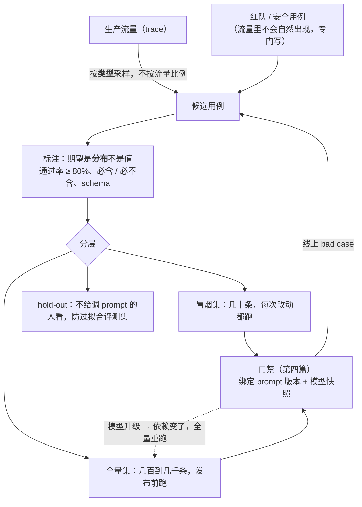

前四层每一篇都在说"在评测集上证明"。这一篇讲评测集本身：它是 AI 应用的单元测试——但与单元测试有三点不同：**期望是分布不是值**（同一输入跑十次结果不同，L1 第一篇），**用例从生产流量来而不是写出来**（你想不出用户会怎么问），**依赖会在你不动的时候变**（模型升级）。这三点决定了评测集怎么建、多大、怎么维护。

一个数字说明这一层的现状：LangChain 2026 年的报告里，89% 的团队接了可观测，只有 52% 接了评测；质量是 agent 部署的最大障碍（32%）。有 trace 没评测集的团队，每次改动靠看几个例子上线——这是"看得见"与"能判断"之间的差距。

本篇要回答的核心问题是：

> **评测集从哪来、每条长什么样、多大够用？[^q0] 怎么防过拟合、怎么随时间维护、怎么与版本绑定？[^q1] 合成数据能用吗，标注怎么组织？[^q2]**

## 一、总览

### 1. 与单元测试的对照




| | 单元测试 | 评测集 |
|---|---|---|
| 用例从哪来 | 开发者写 | **生产流量采样** + 少量手写的边界 |
| 期望 | 一个确定的值 | 精确值 / 可接受集合 / 评分标准 / 验收脚本；**按分布**看（跑 k 次） |
| 通过标准 | 全过 | 指标不低于基线减噪声阈值；逐条 diff |
| 依赖 | 固定 | 模型会变（升级、静默变更）→ 要定期重跑 |
| 维护 | 随代码改 | **随 bad case 长**；hold-out 防过拟合 |
| 规模 | 越多越好 | 几十条开始有区分力，几百条看趋势；每条 k 次的成本要算 |
| 判分 | 断言 | 规则 → judge → 人（第二篇） |

Table: 评测集与单元测试的对照

### 2. 本文的章节安排

第二章来源；第三章每条的结构；第四章规模与分层；第五章维护、hold-out、版本绑定；第六章合成数据；第七章标注的组织；第八章实践建议。

## 二、来源

### 1. 真实流量

评测集的第一来源是日志里的真实输入。三类都要：

| 类 | 作用 | 怎么采 |
|---|---|---|
| 高频 | 决定平均质量；改动的主要影响面 | 按类型聚类后每类抽样 |
| 边界 | 暴露脆弱点 | 长输入、多轮、含数字 / 日期 / 专名、多语言、格式异常、歧义 |
| 失败过的 | 最有信息量 | 点踩、重试、修改后重提、放弃、转人工、追问——每条带 trace（第六篇的反馈绑定） |

Table: 真实流量的三类采样

采样要**覆盖类型**而不是按流量比例——按比例采会让 90% 的用例是最简单的那类，改动对难例的影响看不见。

### 2. 上线前

没有日志时：内部试用的记录、客服工单里的真实提问、竞品的公开案例、领域专家写的"用户一定会问的"——都比工程师坐在那想强。上线后第一件事是换成真实流量。

### 3. 红队与安全

注入、越界请求、敏感信息、边缘的伦理场景——这些不会自然出现在流量里（或出现了也不该等它出现），要专门写。L3 第七篇的"不该看到"查询集、L4 第九篇的注入用例、L6 的红队集都属于这里。

## 三、每条的结构

### 1. 四个字段

```text
input:      用户输入 + 必要的上下文与状态
            - 单步：输入文本（+ 系统提示的版本引用）
            - RAG：查询 + 固定的检索结果（评生成）或标注的相关块（评检索）
            - agent：任务 + 环境快照（容器镜像 / 仓库提交 / 数据库状态）+ 可用工具
            - 多轮：对话历史 + 当前轮
expected:   期望，四种形态之一
            - 精确值（分类标签、抽取的字段）
            - 可接受集合（同义答案；数值容差）
            - 评分标准（rubric：judge 或人按它打分）
            - 验收脚本（测试通过、断言、输出 schema）
meta:       类型 · 难度 · 来源（流量 / 手写 / 红队）· 采样日期 · 标注者 · 关联的 bad case id
score_how:  用哪种评分（规则 / judge + rubric 版本 / 人）
```

### 2. 期望要可检验

L1 第五篇的原则：**没有可检验期望的用例不是评测用例**。"回答要好"不可检验；"回答必须引用第 3.2 条且给出金额 500 元"可检验；"按 rubric（含五条判据）由 judge 打 1–5 分，基线 3.8"也可检验（judge 校准过——第二篇）。写期望时问：两个人独立判会一致吗？不一致就把判据写细。

### 3. 状态是输入的一部分

RAG 的检索结果、agent 的环境、多轮的历史、当前日期——都决定输出，都要固定进用例，否则同一用例每次跑的条件不同，分差不知道是改动造成的还是环境造成的。agent 用例最贵（要可重现的环境——容器快照），所以先几十条。

## 四、规模与分层

### 1. 多少条

统计上：要区分两个版本 5 个百分点的差异、噪声（每条 k 次的方差）中等，几十到一百条能给出方向；几百条能看趋势与分层；上千条是成熟产品的规模。**先几十条上线，再长**——等评测集"完善"再用是最常见的拖延。

### 2. 每条几次

模型非确定（L1 第一篇），一条用例跑一次的结果是一个样本。$$k = 3$$ 到 5 让你看到一致率与方差；门禁比较时用均值加噪声阈值。成本：100 条 × 5 次 × 每次几千 token，Sonnet 5 量级几美元——比一次线上事故便宜。

### 3. 分层报告

一个总分掩盖问题：改动让高频类涨 3 分、让多轮类掉 10 分，总分涨了。按类型（高频 / 边界 / 失败过的 / 红队）与按业务场景分层报告，门禁按层设阈值。

## 五、维护

### 1. 随 bad case 长

评测集是活的：每周从负反馈（第六篇的队列）里挑 5–10 条、标注、加入。一个失效模式被修好后，它的用例留下作为回归。这是评测集覆盖"你想不到的问法"的唯一途径。

### 2. hold-out

反复对着同一批用例调 prompt，会调出只对这批好的 prompt（L2 第六篇）。留一部分（20–30%）不参与迭代、只在门禁与阶段评估时跑；hold-out 与开发集的分差变大，说明过拟合。定期轮换。

### 3. 版本绑定

评测集要与它评的东西的版本绑在一起：prompt 版本、模型快照、工具集版本、检索配置（分块策略变了 L3 的标注块 id 会失效）、rubric 版本、judge 版本。评测结果的记录是一个六元组加分数——否则三个月后不知道"那次 0.87 是在什么配置下测的"。评测集本身进版本库或注册表。

### 4. 过期

产品变了、政策变了、用户问法变了——旧用例的期望可能已经错误。定期（季度）审一遍：期望还对吗？这类问题还有人问吗？删或改，记原因。

### 5. 依赖会变

模型升级或供应商静默变更（第四篇）让同一评测集的分数变化——这不是评测集的问题，是它的作用：**定期重跑**（每天一个小探针集、每周全量）才能发现。

## 六、合成数据

### 1. 能做什么

让模型生成用例：读每个文档块生成"这块能回答的问题"（RAG）、按模板变换已有用例（改数字、换实体、加噪声）、按类型枚举边界情形。便宜、覆盖全、冷启动快。

### 2. 陷阱

- **问法不像真人**：合成问题贴合文档措辞，词法与向量检索都容易命中，高估 recall（L3 第七篇）；真人的问法有省略、错字、口语、指代。
- **难度分布偏**：模型倾向生成中等难度、表述完整的问题；真实流量里有大量极短或极乱的输入。
- **期望可能错**：让模型同时生成问题与答案，答案是它的幻觉时用例就是错的——期望要人核。
- **自我一致**：用模型 A 生成用例评模型 A，会偏向它自己的输出风格（第二篇的自我偏好）。

### 3. 位置

冷启动（上线前没流量）、覆盖检查（哪些文档块 / 功能从未被任何用例命中）、变换扩增（在人标的种子上做同义改写与实体替换，期望不变）。**决策用真实流量**。

## 七、标注的组织

### 1. 谁标

领域专家标期望与 rubric（他们知道什么是对的），工程师标格式与结构类的，用户反馈直接作为弱标注。judge 可以先标再人核（第二篇）——省人力，但要抽检一致率。

### 2. 标注指南

标注的标准本身要写下来并版本化：什么算"正确"、边界情形怎么判、多个可接受答案怎么列。两个标注者独立标一批算一致率（kappa），低于 0.6 说明指南不清，先修指南再标。

### 3. 分歧

分歧不是噪声，是信息：它标出了任务里模糊的地方——这些地方 judge 也会不稳，模型也会不稳。分歧用例单独标记，或由第三人裁决并记录理由。

### 4. 成本

一条用例从采样到标注完成，简单的几分钟、agent 的几十分钟（要建环境）。100 条的第一版评测集是一两个人几天的工作——与它防住的事故比很便宜，但要排进计划而不是"有空再做"。

## 八、实践建议

1. **今天就从日志采 50 条**：按类型聚类抽样，加 10 条失败过的、10 条边界；每条写可检验期望；两周内上线第一版。
2. **每条跑 k = 3**，报均值与一致率；分层报告。
3. **留 20% hold-out**，只在门禁跑。
4. **记录六元组**：评测集版本 × prompt × 模型快照 × 工具集 × 检索配置 × rubric / judge 版本 → 分数。
5. **接 bad case 队列**：每周补 5–10 条；修好的失效模式留用例。
6. **合成只做冷启动与覆盖检查**，期望人核。
7. **写标注指南**，两人标一批算 kappa，低于 0.6 先修指南。

## 九、本文小结

- 评测集是 AI 应用的单元测试，三点不同：期望是分布（跑 k 次）、用例从生产流量采、依赖会变（定期重跑）。
- 来源：真实流量按类型覆盖采样（高频、边界、失败过的）；上线前用试用 / 工单 / 专家；红队与安全用例专门写。
- 每条四字段：input（含状态——检索结果、环境快照、历史）、expected（精确值 / 集合 / rubric / 验收脚本，必须可检验）、meta、score_how。
- 规模：几十条起、几百条看趋势；k = 3–5；分层报告不看总分。
- 维护：随 bad case 每周长、20–30% hold-out、与六个版本绑定、季度审过期、定期重跑发现依赖变化。
- 合成数据：便宜覆盖全，但问法不像真人、难度偏、期望可能错、自我偏好——只做冷启动、覆盖检查、变换扩增；决策用真实流量。
- 标注：专家标期望、指南版本化、双标算 kappa、分歧是信息、成本排进计划。

## 十、自测

1. 一个团队按流量比例随机采了 200 条建评测集，90% 是"查订单状态"。改动后总分从 0.91 涨到 0.93 上线，多轮退款场景投诉激增。问题在哪？

   <details markdown="1"><summary>答案</summary>
   按比例采样让评测集几乎只覆盖最简单的高频类，多轮退款这类难例几乎没有用例，改动对它的退化在总分里看不见（甚至被高频类的小涨掩盖）。修：按类型覆盖采样（每类都有足够用例）、分层报告、门禁按层设阈值，把投诉的用例加进去。详见[第二章](#二来源)、[第四章](#四规模与分层)。
   </details>

2. "回答应该专业、有帮助"作为期望有什么问题？改成什么？

   <details markdown="1"><summary>答案</summary>
   不可检验——两个人独立判会不一致，judge 也不稳。改成可检验的形态：精确值 / 可接受集合（若答案确定）、或一份 rubric（含具体判据：是否引用了正确条款、是否给出金额、是否在三句内、是否有拒答出口的正确使用），由校准过的 judge 或人按 rubric 打分，并记 rubric 版本。详见[第三章](#三每条的结构)。
   </details>

3. 为什么 agent 用例要固定环境快照？不固定会怎样？

   <details markdown="1"><summary>答案</summary>
   agent 的输出取决于环境（仓库状态、数据库内容、可用工具、日期）；不固定则同一用例每次跑的条件不同，分数差异无法归因到改动。固定为容器镜像 / 仓库提交 / 数据库快照，让评测可重现——这也是 agent 用例贵、先几十条的原因。详见[第三章](#三每条的结构)。
   </details>

4. 开发集分数三个月从 0.80 涨到 0.92，hold-out 从 0.79 涨到 0.81。说明什么？怎么办？

   <details markdown="1"><summary>答案</summary>
   过拟合：prompt 被反复对着开发集调，只对那批用例好。真实提升接近 hold-out 的 +2 分而不是 +12 分。办法：以 hold-out 为门禁与汇报的依据、轮换 hold-out、把开发集里被过度针对的用例特征泛化（加同类但不同表述的用例）、从真实流量补新用例。详见[第五章](#五维护)。
   </details>

5. 用模型对每个文档块生成问题建了 2,000 条 RAG 评测集，recall@5 = 0.95；上线后用户反馈"找不到"很多。解释并给出正确用法。

   <details markdown="1"><summary>答案</summary>
   合成问题贴合块的原文措辞，检索容易命中，高估 recall；真人的问法有省略、口语、指代与词汇不匹配。正确用法：合成集做冷启动与覆盖检查（哪些块从未被命中），决策与门禁用真实查询采样的评测集（几十条起，人标相关块），并把"找不到"的反馈作为 bad case 补进去。详见[第六章](#六合成数据)。
   </details>

## 下一篇

[评分：规则、LLM-as-judge 与人](/scoring-rules-llm-as-a-judge-and-humans.html)

[^q0]: 来源：真实流量按类型覆盖采样（不按比例）——高频决定平均质量、边界暴露脆弱点（长、多轮、数字 / 专名、多语言、歧义）、失败过的最有信息（点踩、重试、修改、放弃、转人工，带 trace）；上线前用内部试用、客服工单、竞品案例、专家；红队与安全用例专门写。每条四字段：input 含必要状态（RAG 固定检索结果或标注块、agent 环境快照与工具、多轮历史）、expected 必须可检验（精确值 / 可接受集合 / rubric / 验收脚本）、meta（类型、难度、来源、日期、标注者、bad case id）、score_how（规则 / judge + rubric 版本 / 人）。规模：几十到一百条能分方向、几百条看趋势；每条 k = 3–5 次看分布；分层报告不看总分；先几十条上线再长。详见[第二章](#二来源)到[第四章](#四规模与分层)。

[^q1]: 过拟合：留 20–30% hold-out 不参与迭代，只在门禁与阶段评估跑，开发集与 hold-out 分差变大即过拟合，定期轮换。维护：每周从 bad case 队列补 5–10 条并标注，修好的失效模式留用例做回归；季度审过期（期望还对吗、还有人问吗）；定期重跑（每天小探针集、每周全量）发现模型升级与静默变更。版本绑定：评测结果记为六元组——评测集版本 × prompt 版本 × 模型快照 × 工具集 × 检索配置（分块变了标注块失效）× rubric / judge 版本——加分数；评测集本身进版本库或注册表。详见[第五章](#五维护)。

[^q2]: 合成数据能做冷启动（上线前无流量）、覆盖检查（哪些块 / 功能从未被命中）、变换扩增（在人标种子上同义改写与实体替换、期望不变）；陷阱是问法不像真人（贴合文档措辞高估 recall）、难度分布偏中等、模型生成的期望可能是幻觉（要人核）、用模型 A 生成评模型 A 的自我偏好——决策用真实流量。标注：领域专家标期望与 rubric、工程师标格式类、用户反馈作弱标注、judge 先标人核并抽检；标注指南写下来并版本化，两人独立标一批算 kappa，低于 0.6 先修指南；分歧是任务模糊处的信息，单独标记或第三人裁决记理由；成本简单的几分钟、agent 的几十分钟，100 条第一版是一两人几天，排进计划。详见[第六章](#六合成数据)、[第七章](#七标注的组织)。
