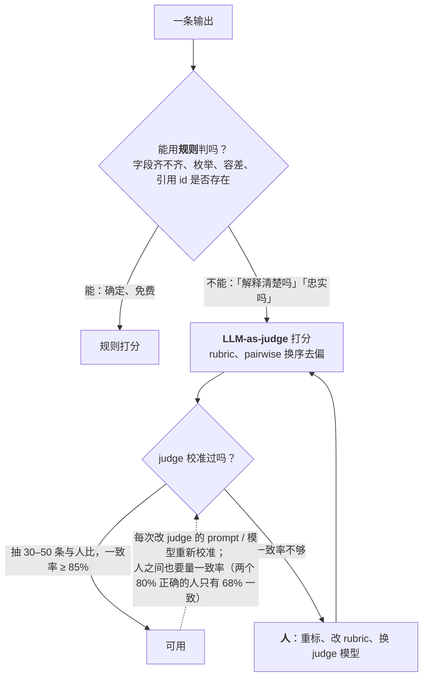

评测集有了，每条的输出怎么判对错？三层：**规则**（确定、免费、优先）、**LLM-as-judge**（需要判断的地方）、**人**（校准、抽检、裁决）。这一篇的重点是第二层——因为它是 2025–2026 年的默认手段，也是最容易被误信的一层。

judge 是一个**测量仪器**，仪器要先被测量。2026 年两项大规模研究给出了数字：21 个 judge、三个基准、约 54 万次判定的系统评估发现——用精确匹配一致率报告 judge 质量相对 Cohen's kappa 普遍虚高 33–41 个百分点（没有校正机遇一致）；同一批 judge 的排名在不同基准间移动多达 14 位；两个生产部署的 judge 同时有 >0.95 的重测信度与 >0.10 的位置偏差——**一致但有偏**。另一项对九种去偏策略的对比发现：**风格偏差**（偏爱 markdown 外观，0.10–0.76）是最大的一类，远超位置偏差（≤ 0.04）；冗长偏差因模型而异（Llama 与 Gemini 偏长 +0.24 到 +0.44，Claude Sonnet 4 偏短 −0.12，GPT-4o 中性）；一个中档模型加对的去偏策略（Gemini 2.5 Flash，κ = 0.549，约 0.001 美元 / 次）胜过前沿 judge 且便宜约 15 倍。这一篇把这些数字变成一套校准协议：在用 judge 做门禁之前，量它的 kappa、四类偏差、敏感度与特异度。

本篇要回答的核心问题是：

> **哪些能用规则评、哪些要 judge、哪些要人？[^q0] judge 的四类偏差各多大，为什么"一致"不等于"正确"？[^q1] 校准一个 judge 的最小协议是什么，怎么决定它能不能做门禁？[^q2]**

## 一、总览

### 1. 三层评分

| 层 | 评什么 | 特点 | 成本 |
|---|---|---|---|
| 规则 | 格式、schema、精确 / 集合匹配、数值容差、正则、测试通过、引用存在性、长度、禁用词 | 确定、可复现、零偏差 | 零 |
| LLM-as-judge | 相关性、忠实度、有用性、风格与语气、按 rubric 打分、pairwise 比较、轨迹合理性 | 可扩展、便宜、**有偏差要校准** | 每次 0.001–0.02 美元 |
| 人 | 校准集标注、抽检、争议裁决、新失效模式发现、rubric 制定 | 最终标准；慢、贵、也不完全一致 | 每条几分钟到几十分钟 |

原则：**能用规则的不用 judge，能用 judge 的不用人**——但 judge 用之前要用人校准，人之间也要量一致率。

### 2. 本文的章节安排

第二章规则；第三章 judge 的四类偏差与报告陷阱；第四章校准协议；第五章 judge 的设计（rubric、pairwise vs pointwise、去偏、选型）；第六章人的位置；第七章实践建议。

## 二、规则

### 1. 能用规则的比想象多

结构化输出（L2 第三篇）让大量判定变成规则：字段齐不齐、枚举对不对、数值在容差内、日期格式、引用的条目 id 是否存在于检索结果里、拒答出口是否被正确使用（该拒的用了、不该拒的没用）、代码是否编译 / 测试是否通过、agent 是否越权（沙箱事件计数）、步数与成本是否在预算内。把期望设计成可规则判定的形态，是评测集（第一篇）与输出 schema（L2 第三篇）联合设计的结果。

### 2. 规则的边界

规则判不了"这段解释清楚吗"、"这个摘要忠实吗"、"这条回复的语气合适吗"、"这个轨迹走了弯路吗"。这些交给 judge——但先问一遍能不能拆出规则部分（摘要里的每个数字是否出现在原文里是规则；摘要是否抓住重点是 judge）。

## 三、judge 的偏差

### 1. 四类

| 偏差 | 表现 | 2026 年的数字 | 测法 |
|---|---|---|---|
| **位置** | pairwise 时偏爱先出现（或后出现）的候选 | 两个生产部署的 judge >0.10；另一项研究 ≤ 0.04——因 judge 与设置而异 | 交换顺序重评，看翻转率 |
| **风格** | 偏爱 markdown、列表、标题等结构化外观，而非纯文本 | **0.10–0.76，最大的一类**，且研究最少 | 内容相同、格式不同的对照 |
| **冗长** | 偏爱更长（或更短）的回答 | 异质：Llama / Gemini +0.24 到 +0.44（偏长），Claude Sonnet 4 −0.12（偏短），GPT-4o −0.04（中性）；截断对照下所有模型都能正确选完整的（0.88–1.00），所以不只是长度效应 | 长度匹配的改写对照 |
| **自我偏好** | 偏爱同家族模型的输出 | 存在且因家族而异 | 遮蔽来源 + 跨家族 judge 对照 |

另有两类不是"偏好"而是仪器特性：**校准偏移**（judge 的通过率整体高于或低于真实通过率——用敏感度 / 特异度反推）与 **rubric 漂移**（长 rubric 在批量评估中被逐渐忽略——交换测试看不见，要固定 rubric 并抽检）。

### 2. 报告的陷阱

- **精确匹配一致率虚高**：judge 与人一致 85% 听起来很好，但如果 80% 的用例是"好"，随机猜也有高一致率。Cohen's kappa 校正机遇一致；研究里 kappa 相对精确匹配普遍低 33–41 个百分点。**报 kappa，不报一致率**。
- **一致不是正确**：重测信度 >0.95（同一输入两次判定一致）与位置偏差 >0.10 并存——judge 稳定地错。稳定性是必要条件不是充分条件。
- **排名不迁移**：judge 在一个基准上的排名到另一个基准移动多达 14 位——一个"好 judge"是相对任务的；你的任务要自己校准。
- **pairwise 更敏感也更脆**：嵌入一个干扰特征让 pairwise 偏好翻转约 35%，pointwise 只有 9%（Tripathi 等 2025）。

## 四、校准协议

### 1. 最小协议

在用一个 judge 做任何门禁之前：

| 步 | 做什么 | 通过线 |
|---|---|---|
| 1 校准集 | 人工标注几十到几百条（第一篇的标注组织），覆盖各类型与好坏分布 | 双标注者 kappa ≥ 0.6（否则先修指南） |
| 2 一致性 | judge 评校准集，与人比 **Cohen's kappa**，报区间 | ≥ 0.61（substantial）；< 0.4 不能用 |
| 3 位置 | pairwise 时每对交换顺序再评，只保留双向一致的判定 | 翻转率的区间上界低于你要区分的最小差距 |
| 4 长度 | 对决定性的对做长度匹配的改写再评 | 胜率变化的 McNemar 区间含零 |
| 5 风格 | 内容相同、格式化 vs 纯文本对照 | 偏好差在噪声内，否则 rubric 里明确"忽略格式" |
| 6 来源 | 遮蔽模型身份；加一个跨家族 judge 或 jury 评同一批 | 同家族与跨家族判定无显著不一致 |
| 7 校准偏移 | 从校准集算 judge 的敏感度与特异度，反推真实通过率 | 报校正后的通过率与区间（含校准集与测试集的方差） |
| 8 rubric 固定 | rubric 版本化；批量评估中抽样人核 | 抽检一致率不随批次下降 |

任何一步没过：该轴上的结论"建在假设上"；决定性的对送 jury（多个 judge 投票）或人。

### 2. 校准偏移的算术

judge 对"好"的敏感度 $$s$$（真好被判好的比例）、特异度 $$t$$（真坏被判坏的比例），观察到的通过率 $$p_{obs}$$，真实通过率

$$
p = \frac{p_{obs} - (1 - t)}{s - (1 - t)}
$$

例：$$s = 0.9$$、$$t = 0.8$$、$$p_{obs} = 0.85$$，则 $$p = (0.85 - 0.2) / (0.9 - 0.2) \approx 0.93$$——judge 偏严；反过来 $$t$$ 低（把坏判成好）时 $$p$$ 比 $$p_{obs}$$ 低。门禁比较两个版本时偏移相同可以抵消，但报告绝对通过率时必须校正。

### 3. 多久重校

judge 的模型升级、rubric 改动、任务分布变化（新类型的用例）——任一发生就重校。每季度用新采的用例补校准集。

## 五、judge 的设计

### 1. rubric

judge 的 prompt 是一份 rubric：判什么、每个分数级的定义、明确要忽略的（格式、长度、礼貌用语）、给出理由再给分（推理前置——L2 第三篇）、输出结构化（分数 + 理由 + 引用的证据）。rubric 短而具体优于长而全（长的会漂移）。rubric 是 prompt，按 L2 第六篇版本化。

### 2. pointwise 还是 pairwise

| | pointwise（单个打分） | pairwise（两两比较） |
|---|---|---|
| 敏感度 | 低（分数粗） | 高（能分出细微差别） |
| 对干扰的鲁棒性 | 高（9% 翻转） | 低（35%）；位置偏差 |
| 用途 | **门禁**（绝对通过率、校准偏移可算） | **模型 / prompt 对比**（谁更好） |
| 成本 | n 次 | n 次（对基线）到 n² |

门禁用 pointwise + 校准；A/B 与选型用 pairwise + 交换顺序 + 长度匹配。

### 3. 去偏

实证有效的：交换顺序取双向一致、长度匹配、rubric 里明确忽略格式、遮蔽来源、多 judge 投票（jury）、要求先给理由、few-shot 校准例（含好坏边界）。组合策略的收益显著且能过多重比较校正（研究里 Claude +11.5 pp、Flash +7.5 pp）。

### 4. 选 judge

结论与 L1 第五篇同构：**去偏策略比 judge 的大小重要**——Gemini 2.5 Flash + 组合去偏（κ = 0.549，≈ 0.001 美元）胜过 Claude Sonnet 4 同策略（≈ 0.015 美元），便宜 15 倍。选法：两三个候选在你的校准集上跑第四章的协议，选 kappa 高、偏差小、便宜的；避免与被评模型同家族（或至少加跨家族对照）；judge 的模型版本钉住（它也会静默变——第四篇）。

### 5. judge 的成本

100 条 × k = 5 × 每次 0.001–0.015 美元 = 0.5–7.5 美元一次全量评测；在线抽样 judge 按流量比例。judge 成本通常低于被评的生成成本，不是瓶颈；人工校准才是瓶颈——所以校准集要复用、重校要有触发条件而不是常态。

## 六、人的位置

### 1. 三件事

**校准集标注**（judge 的标准）、**抽检**（批量 judge 结果里抽 5–10% 人核，一致率进面板）、**争议裁决**（judge 不确定、jury 分歧、用户投诉的用例）。另加一件：**发现新失效模式**——人看轨迹时会注意到 rubric 没覆盖的问题，那是评测集与 rubric 演进的来源。

### 2. 人也要量

两个标注者的 kappa 低于 0.6 说明任务定义模糊——这时 judge 不稳不是 judge 的错。先修标注指南（第一篇），再谈 judge。

### 3. 成本与组织

专家时间是最贵的资源：把他们用在 rubric 制定、校准集、裁决上；常规抽检可以由训练过的标注者做；用户反馈作为弱标注补充。

## 七、实践建议

1. **先把能规则化的规则化**：审一遍评测集的期望，能改成 schema / 集合 / 脚本判定的都改。
2. **标 100 条校准集**（双标注者，kappa ≥ 0.6），跑第四章的八步协议，得到你的 judge 的 kappa、四类偏差、敏感度 / 特异度；写进评测文档。
3. **门禁用 pointwise + 校准后的通过率**，对比用 pairwise + 交换 + 长度匹配。
4. **试两三个候选 judge**（含一个中档模型 + 组合去偏），按 kappa 与成本选；钉版本。
5. **rubric 短而具体、要求先理由后分数、忽略格式、版本化**。
6. **抽检 5–10% 进面板**；judge 模型升级、rubric 改、任务分布变时重校。

## 八、本文小结

- 三层：规则（确定免费优先）→ judge（需要判断处，先校准）→ 人（校准、抽检、裁决、发现）。
- judge 四类偏差：位置（>0.10 在部分生产 judge）、风格（0.10–0.76，最大且最少研究）、冗长（异质：有偏长有偏短有中性）、自我偏好；另有校准偏移与 rubric 漂移。
- 报告陷阱：精确匹配一致率相对 kappa 虚高 33–41 pp——报 kappa；重测 >0.95 与位置偏差 >0.10 并存——一致不是正确；排名跨基准移动 14 位——在自己的任务上校准；pairwise 对干扰翻转 35% vs pointwise 9%。
- 校准八步：校准集（双标 κ ≥ 0.6）→ kappa ≥ 0.61 → 交换顺序 → 长度匹配 → 格式对照 → 遮蔽来源 + 跨家族 → 敏感度 / 特异度反推 $$p = (p_{obs} - (1-t)) / (s - (1-t))$$ → rubric 固定与抽检。
- 设计：rubric 短具体、先理由后分、忽略格式、版本化；门禁 pointwise、对比 pairwise；去偏组合显著；中档 + 去偏胜前沿且便宜 15 倍；钉 judge 版本。
- 人：三件事加发现新失效；人之间也要量 kappa；专家用在 rubric、校准、裁决。

## 九、自测

1. 一个 judge 与人工的精确匹配一致率 88%，团队据此用它做门禁。为什么这个数字不足以决定？该报什么？

   

答案

   精确匹配未校正机遇一致：若 80% 用例本来就是"好"，随机判也有高一致率；研究里 kappa 相对精确匹配普遍低 33–41 pp，88% 的一致率可能对应 kappa 0.5 以下。该报 Cohen's kappa 及区间（≥ 0.61 才 substantial），并跑位置、长度、风格、来源四项偏差测试与敏感度 / 特异度。详见[第三章](#三judge-的偏差)、[第四章](#四校准协议)。
   

2. 一个 judge 同一输入评十次结果完全一致，但 pairwise 时交换顺序有 15% 的对翻转。它可靠吗？

   

答案

   不可靠——这正是"一致但有偏"：重测信度高说明它稳定，位置翻转 15% 说明它稳定地受顺序影响。稳定是必要不充分。处理：只保留双向一致的判定、或用 pointwise、或换 judge；翻转率的区间上界要低于你要区分的最小差距。详见[第三章](#三judge-的偏差)。
   

3. judge 的敏感度 0.85、特异度 0.7，观察通过率 0.8。真实通过率约多少？这对门禁与对外汇报各意味着什么？

   

答案

   $$p = (0.8 - 0.3) / (0.85 - 0.3) = 0.5 / 0.55 \approx 0.91$$。验算：$$0.91 \times 0.85 + 0.09 \times 0.3 \approx 0.80$$。judge 整体偏严——把 15% 的好判成坏、只把 30% 的坏判成好，净效果是观察通过率低于真实。门禁比较两个版本时偏移相同可抵消；对外汇报绝对通过率必须用校正值并带区间。详见[第四章](#四校准协议)。
   

4. 团队想用 GPT-5.6 评 GPT-5.6 生成的输出与 Claude 生成的输出谁好。有什么风险，怎么做？

   

答案

   自我偏好：judge 偏爱同家族的输出；加上风格偏差（两家默认格式不同）。做法：遮蔽来源、加一个跨家族 judge（或 jury）评同一批看是否显著不一致、rubric 明确忽略格式、pairwise 交换顺序、长度匹配对照；结论以跨家族一致的部分为准。详见[第三章](#三judge-的偏差)、[第五章](#五judge-的设计)。
   

5. 为什么门禁推荐 pointwise 而模型对比推荐 pairwise？

   

答案

   门禁要的是绝对通过率与可算的校准偏移（敏感度 / 特异度反推），pointwise 给单个分数、对干扰鲁棒（翻转 9%）；对比要的是分出细微差别，pairwise 更敏感，但对干扰翻转 35% 且有位置偏差，所以要配交换顺序与长度匹配。详见[第五章](#五judge-的设计)。
   

## 下一篇

[评什么：单步、RAG、agent 与多轮的指标矩阵](/what-to-evaluate-metrics-for-single-step-rag-agent-and-multi-turn.html)

[^q0]: 规则评一切确定可判的：格式、schema、精确 / 集合匹配、数值容差、正则、测试通过、引用 id 存在、拒答出口使用、越权事件、步数与成本——结构化输出让大量判定规则化，且先拆出规则部分（摘要里的数字是否在原文是规则）。judge 评需要判断的：相关性、忠实度、有用性、语气、rubric 打分、pairwise、轨迹合理性——但先校准。人做校准集标注、抽检 5–10%、争议裁决、发现新失效模式与制定 rubric；人之间也要量 kappa（< 0.6 先修指南）。原则：能规则不 judge，能 judge 不人，judge 用前用人校准。详见[第一章](#一总览)、[第二章](#二规则)、[第六章](#六人的位置)。

[^q1]: 四类：位置（pairwise 偏爱某一侧，部分生产 judge >0.10）、风格（偏爱 markdown 等结构化外观，0.10–0.76，最大且最少研究）、冗长（异质——Llama / Gemini 偏长 +0.24 到 +0.44、Claude Sonnet 4 偏短 −0.12、GPT-4o 中性，截断对照下都能选完整的所以不只是长度）、自我偏好（偏爱同家族）；另有校准偏移与 rubric 漂移。"一致不等于正确"：重测信度 >0.95 与位置偏差 >0.10 在两个生产 judge 里并存——judge 可以稳定地错，稳定是必要不充分。其他陷阱：精确匹配一致率相对 kappa 虚高 33–41 pp（未校正机遇）；排名跨基准移动 14 位（好 judge 是相对任务的）；pairwise 对干扰特征翻转 35% vs pointwise 9%。详见[第三章](#三judge-的偏差)。

[^q2]: 八步：（1）人工校准集几十到几百条，双标注者 kappa ≥ 0.6；（2）judge 与人比 Cohen's kappa 报区间，≥ 0.61 可用、< 0.4 不能用；（3）pairwise 交换顺序只保留双向一致，翻转率上界低于最小差距；（4）长度匹配改写对照，McNemar 区间含零；（5）格式化 vs 纯文本对照，否则 rubric 明确忽略格式；（6）遮蔽来源 + 跨家族 judge 或 jury 无显著不一致；（7）用敏感度 s 与特异度 t 反推真实通过率 $$p = (p_{obs} - (1-t))/(s - (1-t))$$ 并报区间；（8）rubric 版本化、批量抽检一致率不下降。任一步不过则该轴结论建在假设上，决定性的对送 jury 或人。门禁用 pointwise + 校正通过率；judge 模型升级、rubric 改、任务分布变时重校；选 judge 看 kappa 与成本——中档 + 组合去偏（Gemini 2.5 Flash κ 0.549、0.001 美元）胜前沿且便宜 15 倍；钉版本。详见[第四章](#四校准协议)、[第五章](#五judge-的设计)。
