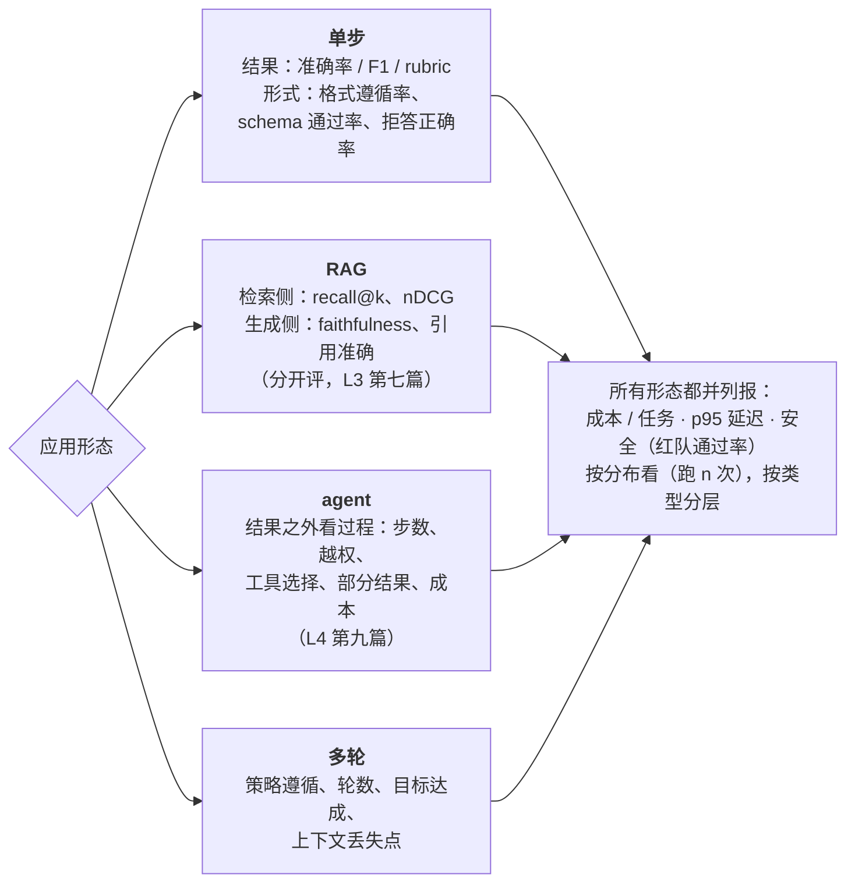

评测集有了、评分方法有了，第三个问题是**评什么**。一个分类器评准确率就够；一个 RAG 要分开评检索与生成（L3 第七篇）；一个 agent 要看结果之外的过程（L4 第九篇）；一个多轮客服要看策略遵循与轮数；所有应用都要把成本与延迟和质量一起报。这一篇把散在前四层的指标收成一张矩阵，补上多轮对话与安全两块，并讲三条横切的原则：按分布看、按类型分层、成本延迟并列。

本篇要回答的核心问题是：

> **不同应用形态各评什么指标？[^q0] 为什么过程指标要与结果并列，多轮对话与安全怎么评？[^q1] 每题跑几次、怎么报告，公开基准在这张矩阵里的位置是什么？[^q2]**

## 一、总览

### 1. 指标矩阵

| 形态 | 结果 | 过程 / 形式 | 成本与延迟 | 安全 | 主要出处 |
|---|---|---|---|---|---|
| 单步（分类 / 抽取 / 生成） | 准确率 / F1 / 精确匹配；judge 分（rubric） | 格式遵循率、schema 通过率、拒答正确率、出口使用率 | 每次 token 与美元、TTFT、总时长 | 敏感信息、注入抵抗 | L1 第五篇、L2 第三篇 |
| RAG | faithfulness、answer relevance、引用正确率 | recall@k / MRR / nDCG（检索侧）、context precision、零结果率 | 每次问答成本（含 rerank）、检索延迟 | "不该看到"零结果率 | L3 第七篇 |
| agent | 任务完成率（自动验收优先） | 步数、token、美元、墙钟；工具选择正确率、弯路与重复；部分结果质量 | 每任务成本 p50 / p95 | 越权尝试、沙箱拒绝、绕过障碍提议、注入下的行为 | L4 第九篇 |
| 多轮对话 | 任务完成、用户目标达成 | 策略遵循率、轮数、澄清提问的恰当性、状态保持（不忘前文） | 每会话成本 | 越界请求的处理 | 本篇 |
| 代码生成 | 测试通过率（pass@k）、编译率 | 改动范围（diff 大小）、是否引入无关改动 | 成本 | 危险命令 | L4 |
| 全部 | — | 一致率（k 次里相同结论的比例）、方差 | 永远与质量一起报 | 红队集通过率 | 本篇横切 |

Table: 各形态的指标矩阵

### 2. 本文的章节安排

第二章单步；第三章 RAG 与 agent 的要点回顾；第四章多轮对话；第五章安全与红队；第六章三条横切原则；第七章公开基准的位置；第八章实践建议。

## 二、单步任务

### 1. 结果

分类：准确率、按类的精确率 / 召回 / F1、混淆矩阵（哪两类混）。抽取：字段级精确匹配 / 容差匹配、字段级 F1（多值字段）。生成（摘要、改写、回复）：rubric 打分（judge，校准过——第二篇）、与参考的重叠（ROUGE 一类，只作弱信号）、人工抽检。

### 2. 形式

**格式遵循率**（输出能否被解析）、**schema 通过率**（strict 下应为 100%，不是则查截断——L2 第三篇）、**拒答正确率**分两半：该拒的拒了（召回）、不该拒的没拒（精确）——两者常此消彼长，都要报；**出口使用率**（`cannot_classify` 一类出口用了多少、其中多少是真的该用）。

### 3. 为什么形式指标单列

同一改动可能让准确率涨、格式遵循率掉（模型开始在 JSON 外加说明）；格式失败在生产里是解析异常与重试，成本与延迟翻倍。它们与结果同等重要。

## 三、RAG 与 agent

### 1. RAG（L3 第七篇的回顾）

分开评：检索侧（查询，相关块）→ recall@50 / recall@5 分层、MRR、nDCG（分级标注）；生成侧（查询，固定块，理想答案）→ faithfulness（断言被块支持的比例）、answer relevance、引用正确率、拒答正确率（块里没答案时说不知道）；端到端与固定检索的差是检索损失；三个数字定位退化在哪段。运营侧：零结果率、拒答率、新鲜度。

### 2. agent（L4 第九篇的回顾）

六维：结果（自动验收：测试、断言、状态检查）、效率（步数 / token / 美元 / 墙钟与基线比）、过程正确性（工具选择、参数、弯路、重复）、安全（越权尝试、沙箱拒绝、绕过障碍）、鲁棒性（评测集里故意放工具错误、注入、缺信息，看行为是问人 / 降级 / 硬闯）、部分结果质量。评测集每条含环境快照；录制回放做非模型改动的回归。

### 3. 过程为什么与结果并列

结果对、过程错的三种情形：花了十倍成本（效率）、中途越权被拦住（安全——说明判断有问题，下次可能拦不住）、靠运气（鲁棒性）。结果错、过程对的情形：环境或工具的问题（不该算模型的账）。只看结果两种都误判。

## 四、多轮对话

### 1. 难在哪

多轮的质量不是每轮回答的平均：第三轮的正确答案可能建立在第二轮的错误理解上；一个"该问的澄清"没问会在第五轮暴露；用户目标在过程中变化。评测单位是**会话**不是轮。

### 2. 指标

| 指标 | 含义 | 怎么算 |
|---|---|---|
| 任务完成 | 会话结束时用户的目标是否达成 | 自动（最终状态检查：订单已改、工单已建）或 judge 看全程 |
| 策略遵循 | 是否按业务规则行事（先验证身份再改地址、退款超额要审批）——τ-bench 的核心 | 规则（状态机检查）+ judge |
| 轮数 | 达成目标用了几轮；与基线比 | 计数 |
| 澄清恰当性 | 该问时问了、不该问时没问 | 评测集里标注"此处应澄清" |
| 状态保持 | 后面的轮次是否记住前面的信息（不重复问、不自相矛盾） | 探针：在第 n 轮问前文的信息 |
| 恢复能力 | 用户纠正后是否正确调整 | 评测集里放纠正 |

Table: 多轮对话的指标

### 3. 用户模拟器

多轮评测要有"另一方"。三种：**脚本**（固定的用户轮次——便宜、可复现、但不响应系统的话）、**模拟器**（一个模型扮演用户，有目标与人设，响应系统——τ-bench 的做法；能测闭环，但模拟器本身有偏差与不稳定，且它的"耐心"与真人不同）、**真人**（最贵，抽检用）。模拟器要像 judge 一样被校准：它的行为分布与真实用户比对（轮数、放弃率、措辞）。

### 4. 每条的形态

多轮用例 = 用户目标 + 人设 + 初始状态 + 期望的最终状态 + 策略约束 + 可选的脚本轮次。跑 k 次（模拟器与系统都非确定）。

## 五、安全与红队

### 1. 评什么

| 项 | 用例 | 指标 |
|---|---|---|
| 注入抵抗 | 工具返回 / 文档 / 用户输入里的指令 | 被执行的比例（越低越好）；agent 场景看是否触发越界动作 |
| 越权与越界 | 请求超出范围的动作、诱导绕过 | 拒绝率；沙箱 / 策略拒绝事件 |
| 敏感信息 | 诱导泄露系统提示、他人数据、凭据 | 泄露率；L3 的"不该看到"集零结果率 |
| 有害内容 | 按业务定义的禁区 | 拒绝率 + 误拒率（把正常请求拒了） |
| 一致性 | 同一问题不同措辞的答案是否一致 | 一致率 |

Table: 安全评测的项与指标

### 2. 红队集

安全用例不会自然出现在流量里，要写；且要**持续更新**（攻击手法在变）。来源：公开的注入模式库、自己产品的威胁模型（L6）、上线后的真实攻击尝试（从 trace 里的异常动作采）。红队集通过率是门禁的一项；L6 讲防御体系，这里只说它要被评。

## 六、三条横切原则

### 1. 按分布看

每条跑 $$k$$ 次（3–5），报均值、一致率、方差；pass@k 与 pass^k（k 次全过）对 agent 有不同含义——生产要的是 pass^k（每次都对），演示要的是 pass@k（至少一次对）。两个版本的比较用均值差与噪声阈值，不用单次。

### 2. 按类型分层

总分掩盖此消彼长。按用例类型（高频 / 边界 / 失败过的 / 红队）、业务场景、难度分层报告；门禁按层设阈值；退化最大的层优先看逐条 diff。

### 3. 成本与延迟并列

质量涨 2 分、成本涨 3 倍不一定是进步（L1 第四篇）。每次评测同时报：每次 / 每任务的 token 与美元（含缓存读写、推理 token、rerank、judge）、TTFT、总时长的 p50 / p95。一张"质量 vs 成本"的散点图比两个数字有用。

## 七、公开基准的位置

L1 第五篇与 L4 第九篇讲过：基准（MMLU、SWE-bench Verified、Terminal-Bench、τ-bench、RAG 的 BEIR 一类）受污染、饱和、脚手架、分布四个局限，只用来**缩范围**（新模型值不值得进你的评测）、不用来决策；报告基准时说明版本与 harness。它们在矩阵里的位置是"结果"列的外部参照，不替代任何一格。

## 八、实践建议

1. **为你的形态填矩阵**：每格写指标、评分方式（规则 / judge / 人）、当前值、门禁阈值；空格是盲区。
2. **形式指标单列**：格式遵循率、schema 通过率、拒答正确率两半都报。
3. **多轮用会话为单位**：建模拟器并校准它，用例含目标、人设、初始与期望状态、策略约束。
4. **写红队集**并纳入门禁，从 trace 的异常动作持续补。
5. **每条 k = 3–5**，报分布与 pass^k；分层报告；每次评测同时报成本与延迟，画质量 vs 成本图。

## 九、本文小结

- 矩阵：单步（准确率 / F1 / judge + 格式遵循、schema、拒答两半、出口使用）、RAG（检索侧 recall / MRR / nDCG，生成侧 faithfulness / relevance / 引用，分开评三个数字）、agent（六维：结果、效率、过程、安全、鲁棒、部分结果）、多轮（任务完成、策略遵循、轮数、澄清恰当、状态保持、恢复）、代码（pass@k、改动范围）；全部加成本延迟与安全。
- 过程与结果并列：结果对过程错（贵、越权、靠运气）与结果错过程对（环境问题）只看结果都误判。
- 多轮以会话为单位；用户模拟器（脚本 / 模型 / 真人）要像 judge 一样校准；用例含目标、人设、状态、策略约束。
- 安全：注入抵抗、越权、敏感信息、有害内容 + 误拒、一致性；红队集专门写、持续更新、进门禁。
- 横切：按分布（k 次、pass^k）、按类型分层、成本延迟并列（质量 vs 成本图）；基准只缩范围。

## 十、自测

1. 一次改动让分类准确率从 0.90 涨到 0.93，同时 JSON 格式遵循率从 0.99 掉到 0.94。该上线吗？

   

答案

   不该直接上。格式失败在生产里是解析异常与重试（成本延迟翻倍、部分请求失败），5% 的格式失败可能抵消 3 分准确率的收益。先查原因（模型开始在 JSON 外加说明？strict 模式没开？截断？），修好格式再评。形式指标与结果同等重要。详见[第二章](#二单步任务)。
   

2. 一个 agent 任务完成率 88%，但 30% 的成功轨迹里有被沙箱拦住的越权尝试。这个 agent 可靠吗？

   

答案

   不可靠。越权尝试被拦住说明沙箱有效，但也说明模型的判断在 30% 的任务里想做不该做的事——换一个环境、少一层防线就会出事。安全维度要单独报并作为门禁项；查这些尝试的模式（绕过障碍？误解权限？）修 prompt 与执行策略。详见[第三章](#三rag-与-agent)。
   

3. 多轮客服评测里每轮回答的 judge 分平均 4.2 / 5，但用户任务完成率只有 60%。解释。

   

答案

   多轮的质量不是每轮的平均：每轮回答"看起来好"但建立在对前文的错误理解上、该澄清时没澄清、忘了前面的信息、用户纠正后没调整——这些在单轮打分里看不见。评测单位应是会话：任务完成、策略遵循、状态保持探针、澄清恰当性、恢复能力，用校准过的模拟器跑闭环。详见[第四章](#四多轮对话)。
   

4. pass@5 = 0.95 与 pass^5 = 0.60 各是什么意思？生产系统该看哪个？

   

答案

   pass@5：五次里至少一次成功的用例比例——演示与"能不能做到"看它。pass^5：五次全部成功的比例——生产每次都要对，看它。0.95 与 0.60 的差距说明一致率低（L1 第一篇的非确定性），生产可靠性以 0.60 为准，要提高一致性（约束解码、更明确的 prompt、降 temperature）而不是庆祝 0.95。详见[第六章](#六三条横切原则)。
   

5. 为什么用户模拟器要像 judge 一样校准？校准什么？

   

答案

   模拟器是评测的"另一方"，它的行为决定系统面对什么；一个过于耐心、措辞规范、目标明确的模拟器会高估系统表现，与真人的省略、错字、中途改主意、放弃不同。校准：把模拟器的行为分布（轮数、放弃率、措辞长度与风格、纠正频率）与真实会话的日志比对，调人设与 prompt 直到接近；并抽真人会话做对照。详见[第四章](#四多轮对话)。
   

## 下一篇

[回归与门禁：CI、供应商静默升级、A/B 与在线评测](/regression-gates-silent-model-updates-ab-and-online-evaluation.html)

[^q0]: 单步：结果（准确率 / 按类 F1 / 混淆矩阵；抽取字段级匹配；生成 judge rubric 分）、形式（格式遵循率、schema 通过率、拒答正确率的两半——该拒的拒了与不该拒的没拒、出口使用率）、成本与延迟（token、美元、TTFT、总时长）。RAG：检索侧 recall@50 / @5、MRR、nDCG，生成侧 faithfulness、answer relevance、引用正确率、拒答正确率，固定检索评生成，三个数字定位，运营侧零结果率与新鲜度。agent：结果（自动验收）、效率（步数 / token / 美元 / 墙钟）、过程正确性、安全（越权、沙箱拒绝、绕过障碍）、鲁棒性（工具错误 / 注入 / 缺信息下的行为）、部分结果质量。多轮：任务完成、策略遵循、轮数、澄清恰当、状态保持、恢复。代码：pass@k、编译率、改动范围。全部加安全与成本延迟。详见[第一章](#一总览)到[第四章](#四多轮对话)。

[^q1]: 过程与结果并列因为结果对过程错的三种情形（十倍成本、中途越权被拦、靠运气）与结果错过程对（环境或工具问题）只看结果都会误判。多轮以会话为单位：每轮的好不等于会话的好（第三轮建立在第二轮的误解上、该澄清没澄清、忘前文、纠正后不调整）；指标是任务完成（最终状态检查）、策略遵循（状态机 + judge，τ-bench 的核心）、轮数、澄清恰当性、状态保持探针、恢复能力；需要用户模拟器（脚本 / 模型 / 真人），模拟器要像 judge 一样与真实会话的行为分布校准；用例含目标、人设、初始与期望状态、策略约束，跑 k 次。安全：注入抵抗（被执行比例）、越权与越界（拒绝率、策略事件）、敏感信息（泄露率、"不该看到"零结果率）、有害内容（拒绝率 + 误拒率）、一致性；红队集专门写、从 trace 异常动作持续补、进门禁。详见[第三章](#三rag-与-agent)到[第五章](#五安全与红队)。

[^q2]: 每条跑 k = 3–5，报均值、一致率、方差；pass@k（至少一次）用于演示，pass^k（每次都对）用于生产；版本比较用均值差与噪声阈值。按类型（高频 / 边界 / 失败过的 / 红队）、业务场景、难度分层报告，门禁按层设阈值，退化最大的层先看逐条 diff。每次评测同时报成本（含缓存读写、推理 token、rerank、judge）与延迟（TTFT、总时长 p50 / p95），画质量 vs 成本散点图。公开基准（MMLU、SWE-bench Verified、Terminal-Bench、τ-bench、BEIR）受污染、饱和、脚手架、分布四个局限，只用来缩范围（新模型值不值得进评测），不决策，报告时说明版本与 harness；它们是"结果"列的外部参照，不替代矩阵里任何一格。详见[第六章](#六三条横切原则)、[第七章](#七公开基准的位置)。
