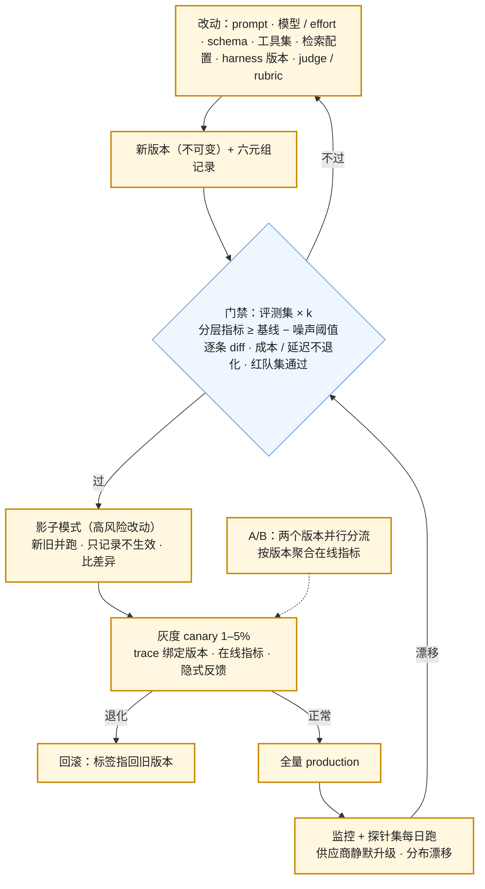

评测集、评分、指标三样齐了，这一篇讲怎么把它们接进**发布流程**：每次改动（prompt、模型、effort、schema、工具集、检索配置、harness 版本）过一道门禁；供应商在你不动的时候换了模型怎么发现；线上怎么做 A/B 与在线评测；离线分数与在线指标不一致时信谁。

L2 第六篇画了 prompt 的生命周期图（编辑 → 版本 → 门禁 → 灰度 → 生产 → 监控 → 模型升级重跑），这一篇给它完整的实现：门禁的判据、逐条 diff、噪声阈值、探针集、影子模式、A/B 的分流与归因、隐式反馈的种类、离线—在线相关性的校验。

本篇要回答的核心问题是：

> **门禁怎么设——判据、阈值、逐条 diff、哪些改动触发？[^q0] 供应商静默升级怎么发现？[^q1] A/B 与在线评测怎么做，离线与在线不一致时怎么办？[^q2]**

## 一、总览

### 1. 从改动到生产

### 2. 本文的章节安排

第二章门禁；第三章供应商静默升级的检测；第四章影子模式与灰度；第五章 A/B 与在线评测；第六章离线与在线的关系；第七章实践建议。

## 二、门禁

### 1. 什么触发

任何会改变模型行为的东西：prompt 文本、模板结构、few-shot、模型 id 或快照、effort、temperature、schema、工具定义与描述、检索配置（分块、embedding、rerank、k）、上下文管理参数（压缩阈值、卸载阈值）、harness 版本、**judge 或 rubric 本身**（改了尺子要重量基线）。原则：**改动 = 发布**，都过门禁。

### 2. 判据

| 判据 | 内容 |
|---|---|
| 分层质量 | 每层的主指标 ≥ 当前生产版本 − 噪声阈值；噪声阈值从 k 次重复的方差算（或基线自身重跑两次的差） |
| 逐条 diff | 列出由对变错的用例（含类型与理由）——比总分更有信息；由错变对的也列（确认不是巧合） |
| 形式 | 格式遵循率、schema 通过率、拒答两半不退化 |
| 成本与延迟 | 每次 / 每任务成本、TTFT、总时长 p50 / p95 不超阈值（或有意为之并记录） |
| 安全 | 红队集通过率不降 |
| hold-out | 门禁以 hold-out 为准，开发集只参考（第一篇） |
| judge 校准 | 用作门禁指标的 judge 已过第二篇的协议；judge 版本钉住 |

### 3. 噪声阈值

两个版本各跑 k 次的均值差要大于噪声才算变化。粗略：基线自身重跑两次的差就是噪声的量级；或从 k 次的标准差算均值的标准误 $$\sigma / \sqrt{k}$$，阈值取两个标准误。评测集小、k 小时阈值大——这是"几十条起、k = 3–5"的代价，也是评测集要长的理由。

### 4. CI 的形态

promptfoo、Braintrust、Langfuse 的评测运行、或自写脚本：配置列出评测集版本、prompt 版本、模型、judge、阈值；命令输出分层指标、逐条 diff、成本；阈值不过 CI 失败。运行时间：100 条 × 5 次 × 几秒 = 几分钟到十几分钟（可并行）；成本几美元。agent 评测慢（每条几分钟）——用录制回放处理非模型改动（第六篇），只在改 prompt / 模型时全量重跑。

### 5. 记录

每次门禁的结果是一条记录：六元组（评测集 × prompt × 模型快照 × 工具集 × 检索配置 × judge / rubric）+ 分层指标 + 成本 + 逐条 diff 的链接。它是第六篇"版本 diff"的数据源。

## 三、供应商静默升级

### 1. 问题

L1 第一篇与第五篇：同一模型名下的行为会变——供应商更新了快照、改了默认参数、换了 tokenizer、路由到不同的后端（DeepSeek 把 V4-Pro 路由到 V4.1 Flash 的例子）。你没改任何东西，评测分数变了、成本变了、格式遵循率变了。

### 2. 检测

- **钉快照**：用带日期的模型 id（`-2026-06-12` 一类）而不是浮动别名；浮动别名的变更不会通知你。
- **探针集每日跑**：几十条对措辞与格式敏感的用例（不是全量评测集）每天定时跑，记分数、格式遵循率、平均输出长度、token 数、TTFT；任一漂出区间告警。它是"模型指纹"。
- **订阅变更通知**：供应商的 changelog、弃用邮件、状态页；L1 第五篇的弃用周期表。
- **生产指标的突变**：格式失败率、平均输出长度、成本 / 请求突然变化，且时间线上没有你的部署——第六篇的版本 diff 对齐会显示"没有对应的变更"。

### 3. 应对

探针告警后：全量评测确认影响范围；若退化，切到钉住的旧快照（如果还在）或 fallback（L1 第六篇）；把这次变更作为一次"外部发布"记录；通知供应商。这是为什么评测集要**定期重跑**而不只在改动时跑（第一篇）。

## 四、影子模式与灰度

### 1. 影子模式

高风险改动（换模型、换 harness 版本、改权限策略）在灰度之前多一步：新版本与旧版本**并行处理同一批真实请求**，新版本的输出只记录不返回给用户；比较两者的差异（judge 或规则）、成本、延迟。真实分布下的对比，零用户风险。代价是双倍的推理成本（只在影子期间）。物理世界的影子模式（第七篇）是同一思想。

### 2. 灰度

标签发布（L2 第六篇）：`prod-canary` 指向新版本、路由 1–5% 流量、trace 绑定版本；看在线指标与隐式反馈（第五章）一到几天；正常则移 `production`，退化则移回。灰度期的两个陷阱：**缓存冷启动**（新前缀第一轮全写，TTFT 与成本高是预期——L2 第五篇）与**样本量**（1% 流量的差异要几天才显著）。

### 3. 回滚

标签指回旧版本，秒级；但要确认旧版本依赖的东西还在（模型快照未下线、工具集兼容、会话状态可读——加密的压缩 item 换模型后不可用，L4 第六篇）。

## 五、A/B 与在线评测

### 1. A/B

两个版本各打标签、应用按用户或会话随机分流（同一用户固定一组，避免体验跳变）、trace 绑定版本、按版本聚合在线指标；显著性检验（样本量、时长）；一次只变一个因素，否则归因不了。A/B 检验的是**真实分布下的真实用户行为**——离线评测检验的是样本上的质量；两者都要。

### 2. 在线信号

| 类 | 信号 | 含义 |
|---|---|---|
| 隐式 | 采纳（用了建议、合并了 PR、发送了草稿） | 最强的正信号 |
| 隐式 | 修改后使用（改了多少） | 部分正确；diff 大小是质量的连续信号 |
| 隐式 | 重试 / 重新生成、追问、放弃、转人工 | 负信号，强度递增 |
| 隐式 | 引用点击、展开详情、停留 | 弱信号，与产品形态相关 |
| 显式 | 点赞 / 点踩、评分、文字反馈 | 稀疏（1–5% 的用户给）、有选择偏差（不满的更爱给） |
| 系统 | 格式失败、重试次数、拒答率、卫士触发、成本 | 不依赖用户 |

每个信号带 trace id 落库（第六篇的反馈绑定）。

### 3. 在线 judge

抽样把 judge 跑在真实流量上（按比例，成本可控），指标进面板；它覆盖离线集没有的分布，但 judge 在真实分布上的校准要另做（校准集要含真实流量的样本）。用户反馈与 judge 分的一致性是 judge 在线可信度的检验。

## 六、离线与在线

### 1. 不一致的四种原因

离线分数涨、在线指标不涨（或反过来）：

| 原因 | 表现 | 办法 |
|---|---|---|
| 评测集分布过时 | 离线好的类型在线占比小 | 从近期流量重采、按在线分布加权 |
| 指标选错 | 离线的 judge 分与用户的采纳不相关 | 校验相关性；换成与用户行为相关的指标 |
| judge 在线失准 | 离线校准集与真实分布不同 | 用真实样本重校 |
| 在线噪声 | 样本量小、季节性、其他改动同期 | 更长的 A/B、隔离变量 |

### 2. 相关性校验

定期（季度）算：离线指标的变化与在线指标的变化在历次发布上的相关性；某个离线指标与在线指标长期不相关，就不该用它做门禁。理想状态是离线评测能预测在线结果——那时门禁才真正有意义。

### 3. 信谁

短期信在线（它是真的），长期修离线（让它能预测在线）。在线指标有滞后与噪声，离线可重复、便宜、快——两者是不同阶段的工具，不是替代。

## 七、实践建议

1. **列触发清单**：所有会改变模型行为的东西都进门禁，包括 judge 与 rubric 的改动。
2. **门禁输出四样**：分层指标与阈值、逐条 diff、成本延迟、红队通过率；hold-out 为准。
3. **钉快照 + 探针集每日跑**：几十条敏感用例，记分数、格式率、输出长度、TTFT，漂移告警。
4. **高风险改动先影子再灰度**；灰度期忽略头几分钟的缓存冷启动；回滚前确认旧版本依赖可用。
5. **A/B 一次一个因素**，按用户固定分组；隐式信号全部带 trace id 落库。
6. **季度校验离线—在线相关性**，不相关的离线指标从门禁里撤。

## 八、本文小结

- 改动 = 发布：prompt、模型 / effort、schema、工具集、检索配置、上下文参数、harness、judge / rubric 都触发门禁。
- 门禁判据：分层质量 ≥ 基线 − 噪声阈值（从 k 次方差或基线重跑差算）、逐条 diff、形式不退化、成本延迟不超、红队通过、hold-out 为准、judge 已校准；结果记六元组。
- 静默升级：钉快照、探针集每日跑（模型指纹：分数、格式率、长度、token、TTFT）、订阅通知、生产突变对齐时间线；退化切旧快照或 fallback，记为外部发布。
- 影子模式（并跑只记录，零用户风险，双倍成本）→ 灰度（1–5%，trace 绑版本，忽略缓存冷启动，注意样本量）→ 回滚（移标签，确认依赖）。
- A/B 一次一因素、按用户固定分组；在线信号隐式（采纳、修改、重试、追问、放弃、转人工、点击）、显式（稀疏有偏）、系统（格式、重试、拒答、卫士、成本），全带 trace id；在线 judge 抽样并另校准。
- 离线与在线不一致的四原因（分布过时、指标错、judge 失准、噪声）；季度校验相关性；短期信在线、长期修离线。

## 九、自测

1. 团队改了 judge 的 rubric 让它更严，同一批输出的分数从 4.1 掉到 3.6，于是回滚了上周的 prompt 改动。哪里错了？

   

答案

   改 rubric 是改尺子，尺子变了基线要重量——3.6 是新尺子下的分数，与旧尺子的 4.1 不可比，回滚 prompt 没有依据。正确做法：rubric 改动本身走门禁（用新 rubric 重评基线版本与新版本，比两者的差），判据是相对差而不是绝对分。详见[第二章](#二门禁)。
   

2. 没有任何部署，格式遵循率从 99% 掉到 91%，平均输出长度涨 30%。最可能是什么？怎么确认与应对？

   

答案

   供应商静默升级（浮动别名指向了新快照，或 tokenizer / 默认参数变了）。确认：探针集今日与昨日的分数与输出长度对比、供应商 changelog、版本 diff 时间线上无本地变更。应对：切到钉住的旧快照或 fallback，全量评测确认影响，记为外部发布，以后用带日期的模型 id。详见[第三章](#三供应商静默升级)。
   

3. 换模型是高风险改动。影子模式与灰度各解决什么、各付什么代价？为什么顺序是先影子后灰度？

   

答案

   影子：真实分布下新旧并跑、只记录不生效——零用户风险地看差异、成本、延迟；代价是影子期间双倍推理成本。灰度：1–5% 真实用户用新版本——看真实行为（采纳、重试）与隐式反馈；代价是这部分用户承担风险。先影子把明显的问题（格式、成本、大面积差异）拦在用户之前，再用灰度看行为——行为只有真用了才看得到。详见[第四章](#四影子模式与灰度)。
   

4. A/B 里 B 组的采纳率高 4%，但 B 组同时换了 prompt 与模型。能下结论吗？

   

答案

   能说"B 组合更好"，不能归因到 prompt 或模型——一次变了两个因素。若要知道各自贡献，要做 A / A+prompt / A+model / B 的分组，或先固定一个再变另一个。另检查：按用户固定分组了吗、样本量与时长够显著吗、同期有没有其他改动。详见[第五章](#五ab-与在线评测)。
   

5. 过去六次发布里，离线 judge 分每次都涨，在线采纳率三涨三跌。说明什么？该怎么办？

   

答案

   离线指标与在线结果不相关——评测集分布过时、judge 分与用户采纳不相关、或 judge 在真实分布上失准。办法：从近期流量重采评测集并按在线分布加权；把与采纳相关的指标（如引用正确率、任务完成）纳入门禁，撤掉不相关的；用真实流量样本重校 judge；在这之前门禁的结论不能作为上线依据，短期以在线为准。详见[第六章](#六离线与在线)。
   

## 下一篇

[trace：span、OpenTelemetry GenAI 语义约定与工具选择](/tracing-spans-opentelemetry-genai-conventions-and-tooling.html)

[^q0]: 触发：任何改变模型行为的东西——prompt 文本与结构、few-shot、模型 id / 快照、effort / temperature、schema、工具定义与描述、检索配置（分块、embedding、rerank、k）、上下文管理参数、harness 版本、judge 与 rubric 本身（改尺子要重量基线）；改动 = 发布。判据：分层质量 ≥ 生产版本 − 噪声阈值（阈值从 k 次方差算标准误取两倍，或基线自身重跑两次的差）；逐条 diff 列出由对变错与由错变对的用例；格式遵循率、schema 通过率、拒答两半不退化；成本与延迟 p50 / p95 不超阈值；红队集通过率不降；以 hold-out 为准；judge 已过校准且版本钉住。CI 用 promptfoo / Braintrust / Langfuse 或自写脚本，几分钟几美元，agent 评测用录制回放处理非模型改动；每次结果记六元组 + 分层指标 + 成本 + diff 链接。详见[第二章](#二门禁)。

[^q1]: 同一模型名下供应商可能更新快照、改默认参数、换 tokenizer、路由到别的后端，你没改任何东西分数、成本、格式率就变了。检测：用带日期的快照 id 而不是浮动别名；探针集（几十条对措辞与格式敏感的用例）每日定时跑作为模型指纹，记分数、格式遵循率、平均输出长度、token 数、TTFT，漂出区间告警；订阅 changelog、弃用通知、状态页；生产指标突变（格式失败率、输出长度、成本 / 请求）在版本 diff 时间线上找不到对应的本地变更。应对：全量评测确认范围，退化则切回钉住的旧快照或 fallback，记为一次外部发布，通知供应商。这是评测集要定期重跑而不只在改动时跑的理由。详见[第三章](#三供应商静默升级)。

[^q2]: A/B：两版本各打标签，按用户或会话随机且固定分组，trace 绑定版本，按版本聚合在线指标，做显著性检验，一次只变一个因素。在线信号：隐式——采纳（最强正）、修改后使用（diff 大小）、重试 / 追问 / 放弃 / 转人工（负，递增）、引用点击（弱）；显式——点赞点踩评分（稀疏 1–5%、有选择偏差）；系统——格式失败、重试、拒答率、卫士、成本；全带 trace id 落库。在线 judge 按比例抽样跑真实流量，要用真实样本另校准，与用户反馈的一致性是它的检验。离线与在线不一致的四原因：评测集分布过时（重采、按在线分布加权）、指标选错（校验相关性、换与用户行为相关的）、judge 在线失准（重校）、在线噪声（更长 A/B、隔离变量）；季度算历次发布上离线变化与在线变化的相关性，不相关的离线指标撤出门禁；短期信在线、长期修离线让它能预测在线。高风险改动先影子模式（并跑只记录、双倍成本、零用户风险）再灰度（1–5%、忽略缓存冷启动、注意样本量）；回滚移标签前确认旧版本依赖可用。详见[第四章](#四影子模式与灰度)到[第六章](#六离线与在线)。
