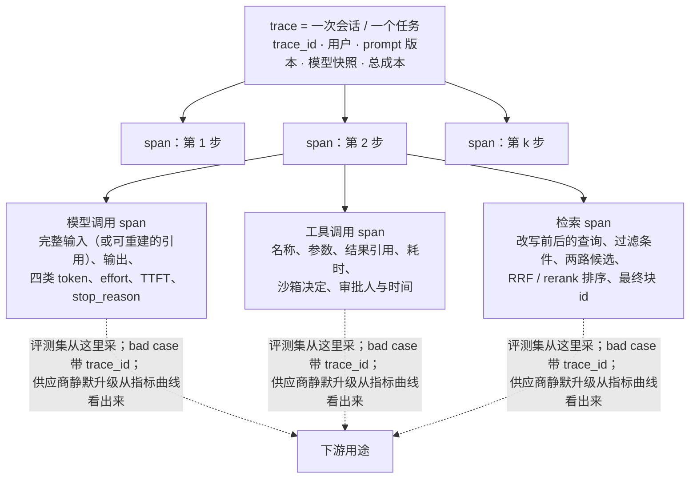

前四篇讲评测，后两篇讲可观测与可追溯。trace 是它们的数据源：评测集从 trace 里采、bad case 带 trace id、门禁的逐条 diff 要能打开那一条的完整轨迹、供应商静默升级要从 trace 的指标里看出来。这一篇讲 trace **记什么、怎么组织、按什么约定、用什么工具、敏感数据与成本怎么处理**。

一个现状要先说清：OpenTelemetry 的 GenAI 语义约定让各家可观测工具共享一种 trace 形状——但到 2026 年中它**全部仍是 Development 状态**（没有一个 `gen_ai.*` 的 span、事件、指标、属性标为 Stable），2026 年 6 月刚从核心仓库迁入独立的 `semantic-conventions-genai`，属性名在版本间会变（`gen_ai.system` → `gen_ai.provider.name`），主流框架同时发出几代属性。"用标准"的正确姿势是：按约定打点、钉住版本、把改名当破坏性变更、在后端归一。

本篇要回答的核心问题是：

> **trace 记什么、怎么组织成三级树，每种 span 的属性是什么？[^q0] OpenTelemetry GenAI 语义约定的现状与正确用法是什么？[^q1] 工具怎么选、要不要自建，敏感数据、采样与成本怎么处理？[^q2]**

## 一、总览

### 1. 三级树




```text
会话 span（session）
  属性：用户 / 租户 · 模型版本 · prompt 版本 · 工具集版本
        检索配置 · 权限档 · 开始 / 结束 · 总成本
  └─ 任务 / 轮次 span（turn）
       属性：用户输入 · 最终输出 · 状态 · 成本 · 时长 · 反馈
       ├─ 模型调用 span（gen_ai chat）
       │    完整输入（或引用）· 输出 · usage 五项 · effort
       │    stop_reason · TTFT · 总时长 · 错误
       ├─ 工具调用 span（execute_tool）
       │    名称 · 参数 · 结果（或卸载引用）· 耗时
       │    沙箱 · 审批 · 错误 · 幂等 id
       ├─ 检索 span（retrieval）
       │    查询 · 过滤 · 候选与分数 · rerank 前后 · 块 id
       ├─ 事件：压缩 · 卸载 · 卫士 · 审批 · 决策点
       └─ 链接：子会话 id（子 agent）
```

### 2. 本文的章节安排

第二章每种 span 记什么；第三章 OpenTelemetry GenAI 约定的内容与现状；第四章工具与自建；第五章敏感数据、采样、保留与成本；第六章实践建议。

## 二、每种 span 记什么

### 1. 模型调用

最重要的 span。记**完整的输入**（系统提示、工具定义、历史、当前输入——或一个能重建它的引用：prompt 版本 + 历史事件 id，避免每条 trace 重复存几十 KB）、**完整输出**（文本、工具调用、思考块——L1 第三篇的推理状态要原样保留才能重放）、`usage`（输入 / 输出 / 缓存读 / 缓存写 / 推理 token——L1 第四篇的五项成本）、模型 id 与快照、effort、temperature、`stop_reason`、TTFT 与总时长、错误类型与重试次数、请求 id（供应商侧的，报障用）。没有完整输入输出的 trace 无法做录制回放与 bad case 复现（第六篇）。

### 2. 工具调用

名称、参数、结果（大结果卸载后存引用与摘要——L2 第四篇）、耗时、沙箱类型与拒绝、审批请求与决定（谁、何时）、幂等 id、错误。工具 span 是 L4 第五篇安全事件的来源（越权尝试、沙箱拒绝计数）。

### 3. 检索

查询（改写前后）、过滤条件（含权限）、两路候选与分数、RRF 后排序、rerank 后排序、最终进上下文的块 id、零结果标记——L3 第七篇的三个数字要从这里算。

### 4. 事件

压缩（触发原因、压缩前后 token、摘要或 blob 引用）、卸载（什么被卸载到哪）、卫士触发（哪个、动作）、审批（请求、`justification`、决定）、决策点（选了哪个工具与为什么、终止原因、权限判定、预算余量——第六篇）。事件挂在 turn span 上，带时间戳。

### 5. 会话与任务

会话级记**版本六元组**（评测的六元组在生产里的对应：prompt、模型快照、工具集、检索配置、harness 版本、权限档）——没有它们，第六篇的版本 diff 与第四篇的 A/B 归因都做不了。任务级记最终状态与用户反馈（第六篇的反馈绑定落在这里）。

### 6. 子 agent

子会话是独立的树，父会话的事件里记子会话 id，子会话记父 id——trace 成为森林，L4 第七篇的树状追溯靠这两个引用。

## 三、OpenTelemetry GenAI 语义约定

### 1. 是什么

OpenTelemetry 为 GenAI 定义的一组 span、事件、指标与属性的命名约定（`gen_ai.*`），让 Langfuse、Phoenix、Datadog、Honeycomb 等后端理解同一种 trace。核心内容：

| 元素 | 约定 |
|---|---|
| span 名 | `{gen_ai.operation.name} {gen_ai.request.model}`，如 `chat gpt-5.6` |
| 操作 | `chat`、`generate_content`、`text_completion`、`embeddings`、`execute_tool`、`invoke_agent`、`create_agent`、检索、记忆 |
| 提供方 | `gen_ai.provider.name`（`openai`、`anthropic`、`gcp.vertex_ai`…）——它是"提供方专属属性风味"的判别器 |
| 请求 | `gen_ai.request.model`、`temperature`、`max_tokens`、`top_p`… |
| 响应 | `gen_ai.response.model`、`id`、`finish_reasons` |
| 用量 | `gen_ai.usage.input_tokens`、`output_tokens`，2026 年加入缓存 token 与推理 token 字段 |
| agent | `gen_ai.agent.id` / `name` / `description` / `version`（2026-02 加） |
| 工具 | `gen_ai.tool.name`、`call.id`、参数与结果（可选，敏感） |
| 内容 | 输入输出消息作为事件或属性，有 JSON schema；默认可关（敏感） |
| 指标 | 操作时长、token 用量、TTFT、流式延迟（2026-04 加） |

Table: OpenTelemetry GenAI 语义约定的元素

### 2. 2026 年的现状

| 事实 | 含义 |
|---|---|
| 约定迁入独立仓库 `open-telemetry/semantic-conventions-genai`；核心仓库 v1.42.0（2026-06）弃用并移走全部 GenAI 内容，v1.43.0 不再含 | 权威来源变了；旧文档页是指向新家的指针 |
| **所有 GenAI 专属的 span / 事件 / 指标 / 属性仍是 Development，没有一个 Stable**（共享的核心属性如 `error.type`、`server.address` 是 Stable） | 名字会变；不要把它当成已定型的接口 |
| 属性改名：`gen_ai.system` → `gen_ai.provider.name`；`invoke_agent` 拆成 client / internal 两种 span（v1.41.0）；`execute_tool` 命名收紧 | 框架混发几代属性；后端要归一 |
| `OTEL_SEMCONV_STABILITY_OPT_IN` 环境变量 | 让你选 span 说哪个版本的约定 |
| span 从单次模型调用扩展到整个 agent 循环：`invoke_agent`、`execute_tool`、`plan`、检索、记忆家族 | OTel 在标准化 agent trace，不只是模型调用 |
| Arize 的 OpenInference（OTel 对齐的另一套约定）把 span kind 分类与之对齐；Langfuse v3 围绕 OTel 重建 | "方言之争"基本结束，线格式共享 |

Table: GenAI 约定 2026 年的现状

### 3. 正确用法

- **按约定打点**：用 `gen_ai.*` 命名而不是自创——换后端、接第三方工具时零成本。
- **钉版本**：`OTEL_SEMCONV_STABILITY_OPT_IN` 明确；框架升级时检查属性名变化。
- **改名当破坏性变更**：面板、告警、评测集的采样查询都依赖属性名；一次静默改名让面板全空。
- **后端归一**：框架发几代属性时在 Collector 或后端做映射（`gen_ai.system` → `gen_ai.provider.name`）。
- **业务属性用自己的命名空间**（`app.*`）：prompt 版本、工具集版本、权限档、评测集 id 这些约定里没有的东西，别塞进 `gen_ai.*`。

## 四、工具与自建

### 1. 候选

| 工具 | 特点 | 适合 |
|---|---|---|
| Langfuse | 开源可自托管；v3 围绕 OTel 重建；trace + prompt 管理（L2 第六篇）+ 评测运行 + 数据集 | 想要 trace、prompt、评测在一处；自托管需求 |
| LangSmith | LangChain 栈原生；trace、评测、数据集、playground | LangChain / LangGraph 用户 |
| Arize Phoenix | 开源；OpenInference 约定；评测与 embedding 可视化 | 严谨的评测与可视化；自托管 |
| Braintrust | trace 到评测的闭环（从 trace 一键建用例、跑评测、比版本） | 评测驱动的团队 |
| Helicone | 网关式接入（改 base URL 即可） | 最低接入成本、以成本监控为主 |
| Datadog / Honeycomb / New Relic 的 LLM 模块 | 与既有 APM 一体 | 已有这些 APM、想统一面板 |

Table: 可观测工具候选

选法：与**评测的集成**（trace → 用例 → 评测 → diff 的闭环是这一层的核心工作流）、**自托管**（敏感数据不出域）、**成本**（按 trace 量计费的在大流量下贵）、**栈**（框架原生的省接入）。多数团队从 Langfuse / Phoenix 一类开源起步。

### 2. 自建的最小集

OTel SDK 打点（按 `gen_ai.*`）→ Collector → 存储（ClickHouse / 对象存储 + 索引）→ 查询与面板（Grafana）。加：完整输入输出的存储（对象存储 + 引用）、评测集采样的查询、bad case 队列（第六篇）。自建的理由通常是数据合规与规模成本；代价是评测闭环要自己拼。

### 3. 与会话日志的关系

L4 第三篇的事件溯源会话日志已经含了 trace 的大部分内容——它是运行时的状态；trace 是它的**可观测投影**。两者可以一份数据两种视图（从日志导出 span），不要维护两套。

## 五、敏感数据、采样、保留与成本

### 1. 敏感数据

trace 里有用户输入、模型输出、工具返回——含个人信息、业务数据、可能的凭据。措施：**分级**（元数据 vs 内容）、**脱敏**（PII 识别与替换，在采集侧做）、**访问控制**（内容只对有权限的角色可见）、**保留期**（内容短、元数据长）、**不记凭据**（工具参数里的 token 在打点前抹掉）、**用户删除请求**能定位并删除。OTel 约定里内容默认可关，就是为此。

### 2. 采样

全量存元数据（usage、时长、状态、版本——面板与告警需要），**内容按比例采样**（1–10%），**bad case 全量**（负反馈、错误、卫士触发、越权、拒答的 trace 内容必存——它们才是你要看的）。尾采样（先看结果再决定存不存内容）比头采样合理，但要在 Collector 里缓冲。

### 3. 成本

一条模型调用 span 含完整输入几十 KB；一个 50 步 agent 会话几 MB；每天十万会话就是几百 GB / 天。内容走对象存储 + 引用、元数据进列式库、按保留期分层——比"全部进 trace 后端"便宜一个量级。工具按 trace 量计费时先算账。

## 六、实践建议

1. **按三级树打点**，模型 span 记完整输入输出（或可重建的引用）、五项 usage、effort、stop_reason、TTFT；工具 span 记沙箱与审批；会话记版本六元组。
2. **用 `gen_ai.*` 命名 + `app.*` 业务属性**，钉 `OTEL_SEMCONV_STABILITY_OPT_IN`，框架升级时 diff 属性名，后端做归一映射。
3. **选工具看评测闭环与自托管**；从开源起步；trace 与会话日志一份数据两种视图。
4. **内容脱敏、分级、短保留；元数据全量长保留；bad case 内容全量**。
5. **算 trace 的账**：内容进对象存储、元数据进列式库。

## 七、本文小结

- 三级树：会话（版本六元组、权限档、总成本）→ 任务（输入输出、状态、反馈）→ span（模型调用：完整输入输出、五项 usage、effort、stop_reason、TTFT；工具：参数结果沙箱审批幂等 id；检索：查询候选排序块 id）+ 事件（压缩、卸载、卫士、审批、决策点）+ 子会话链接。
- OTel GenAI 约定：`{operation} {model}` 命名、`gen_ai.provider.name`、请求 / 响应 / 用量 / agent / 工具属性、内容事件、指标；2026 年迁入独立仓库、全部 Development 无 Stable、属性改名（`system` → `provider.name`）、`invoke_agent` 拆分、span 扩展到 agent 循环、OpenInference 对齐、Langfuse v3 重建；用法是按约定打点、钉版本、改名当破坏性变更、后端归一、业务属性用 `app.*`。
- 工具：Langfuse、LangSmith、Phoenix、Braintrust、Helicone、APM 模块，按评测闭环 / 自托管 / 成本 / 栈选；自建最小集；trace 是会话日志的可观测投影。
- 敏感数据分级脱敏访问控制短保留不记凭据；元数据全量、内容按比例、bad case 全量；内容进对象存储。

## 八、自测

1. 一条模型调用 span 只记了输入输出的前 500 字符与总 token 数。第六篇的哪些事做不了？

   <details markdown="1"><summary>答案</summary>
   录制回放（要完整输出含思考块）、bad case 复现（要完整输入）、缓存与成本分析（要缓存读写与推理 token 分项）、非确定性定位（要完整请求体）。记完整内容或可重建的引用（prompt 版本 + 历史事件 id）。详见[第二章](#二每种-span-记什么)。
   </details>

2. 团队把 prompt 版本存在 `gen_ai.prompt.version` 属性里。有什么问题？

   <details markdown="1"><summary>答案</summary>
   `gen_ai.*` 是 OTel 约定的命名空间且仍在 Development，自造的 `gen_ai.*` 属性会与将来的约定冲突、被后端误解或在归一映射时被改写。业务属性用自己的命名空间（`app.prompt.version`）。详见[第三章](#三opentelemetry-genai-语义约定)。
   </details>

3. 升级了一个 agent 框架后，面板上"按提供方的成本"图全空了。最可能原因？怎么防？

   <details markdown="1"><summary>答案</summary>
   框架开始发新版约定的属性（如 `gen_ai.system` → `gen_ai.provider.name`），面板查询还用旧名。防：钉 `OTEL_SEMCONV_STABILITY_OPT_IN`，升级时 diff 属性名，把改名当破坏性变更走发布流程，在 Collector 做旧名到新名的归一映射让面板对两代都有效。详见[第三章](#三opentelemetry-genai-语义约定)。
   </details>

4. 每天 20 万会话、平均每会话 2 MB trace 内容。全存要多少？怎么降到可承受？

   <details markdown="1"><summary>答案</summary>
   约 400 GB / 天、一年 146 TB——不可承受。降：元数据（几 KB / 会话）全量长保留进列式库；内容按 5% 采样加 bad case（负反馈、错误、卫士、越权）全量，进对象存储只存引用；内容保留 30 天、元数据一年；大工具返回本来就卸载只存引用。量级降到每天几十 GB 且多数在便宜的对象存储。详见[第五章](#五敏感数据采样保留与成本)。
   </details>

5. 为什么说 trace 是会话日志的"可观测投影"？维护两套会怎样？

   <details markdown="1"><summary>答案</summary>
   L4 第三篇的事件溯源日志已含每步的输入输出、工具、审批、压缩——它是运行时的状态与事实来源；trace 需要的就是这些内容按 OTel 形状组织，可以从日志导出 span。两套会不一致（日志里有的 trace 里没有、时间戳与 id 对不上）、双倍存储、bad case 在两处找。一份数据两种视图。详见[第四章](#四工具与自建)。
   </details>

## 下一篇

[可追溯：录制回放、决策点日志、失败分类与反馈绑定](/traceability-record-replay-decision-logs-failure-taxonomy-and-feedback.html)

[^q0]: 三级树：会话 span 记用户 / 租户、版本六元组（prompt、模型快照、工具集、检索配置、harness、权限档）、时间、总成本；任务 / 轮次 span 记用户输入、最终输出、状态（完成 / 部分 / 失败 / 拒答）、成本、时长、用户反馈；模型调用 span 记完整输入（或 prompt 版本 + 历史事件 id 的可重建引用）、完整输出含思考块、usage 五项（输入 / 输出 / 缓存读 / 缓存写 / 推理）、模型 id 与快照、effort、temperature、stop_reason、TTFT 与总时长、错误与重试、供应商请求 id；工具 span 记名称、参数、结果或卸载引用、耗时、沙箱与拒绝、审批请求与决定、幂等 id、错误；检索 span 记改写前后查询、过滤含权限、两路候选与分数、RRF 与 rerank 后排序、进上下文的块 id、零结果；事件挂在 turn 上——压缩、卸载、卫士、审批、决策点；子会话 id 双向链接成森林。详见[第一章](#一总览)、[第二章](#二每种-span-记什么)。

[^q1]: 内容：span 名 `{operation} {model}`、操作（chat / embeddings / execute_tool / invoke_agent / create_agent / 检索 / 记忆）、`gen_ai.provider.name` 作风味判别、请求响应用量属性（2026 年加缓存与推理 token）、agent 属性（id / name / version）、工具属性、内容事件（默认可关）、时长 / 用量 / TTFT / 流式指标。现状（2026-09）：约定迁入独立仓库 `semantic-conventions-genai`（核心 v1.42.0 于 2026-06 移走全部 GenAI 内容）；所有 GenAI 专属元素仍 Development、无一 Stable；属性改名 `gen_ai.system` → `gen_ai.provider.name`，`invoke_agent` 拆 client / internal，`execute_tool` 命名收紧；`OTEL_SEMCONV_STABILITY_OPT_IN` 选版本；span 扩展到整个 agent 循环；OpenInference 对齐、Langfuse v3 围绕 OTel 重建。用法：按约定打点、钉版本、改名当破坏性变更、框架混发几代时在后端归一、业务属性放 `app.*` 不塞 `gen_ai.*`。详见[第三章](#三opentelemetry-genai-语义约定)。

[^q2]: 工具：Langfuse（开源自托管、OTel、trace + prompt 管理 + 评测）、LangSmith（LangChain 栈）、Arize Phoenix（开源、OpenInference）、Braintrust（trace 到评测闭环）、Helicone（网关式）、APM 的 LLM 模块；按评测闭环、自托管、成本（按 trace 量计费）、栈选，多从开源起步。自建最小集：OTel SDK → Collector → ClickHouse / 对象存储 → Grafana，加完整内容存储、采样查询、bad case 队列；理由是合规与规模成本。trace 是会话日志的可观测投影，一份数据两种视图。敏感数据：元数据与内容分级、采集侧脱敏 PII、内容访问控制、内容短保留元数据长保留、工具参数里的凭据打点前抹掉、支持用户删除。采样：元数据全量、内容 1–10%、bad case（负反馈、错误、卫士、越权、拒答）内容全量，尾采样优于头采样。成本：每会话几 MB 内容、十万会话几百 GB / 天——内容进对象存储存引用、元数据进列式库、按保留期分层。详见[第四章](#四工具与自建)、[第五章](#五敏感数据采样保留与成本)。
