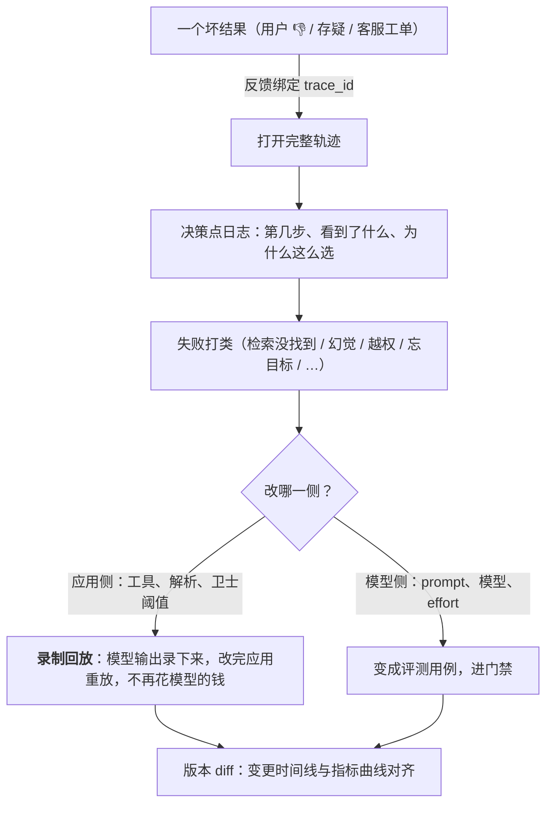

可观测让你看到发生了什么，可追溯让你**从一个坏结果追到产生它的那一步、并把它变成可修的 bug 与可回归的用例**。模型不可复现（L1 第一篇），所以传统的"复现 → 断点 → 修"在这里换成五项实践：**录制回放**（把模型输出录下来，改非模型部分时重放）、**决策点日志**（让轨迹能画成状态图而不是日志流）、**失败分类学**（每次失败打类，分布进面板，每类有药）、**版本 diff**（变更时间线与指标曲线对齐）、**反馈绑定**（用户的一句"不好"带着 trace id 进队列，处理结果回到评测集）。

本篇要回答的核心问题是：

> **录制回放怎么做，什么改动能不重跑模型？[^q0] 决策点日志记什么，失败分类学怎么建与用？[^q1] 版本 diff 与反馈绑定怎么把线上问题变成评测用例？[^q2]**

## 一、总览

### 1. 从坏结果到修复




```text
用户点踩 / 系统告警 / 抽检发现
  → 反馈绑定：带 trace id 进 bad case 队列（owner · SLA）
  → 打开 trace：三级树 + 决策点日志 → 定位到那一步
  → 失败分类：打类（幻觉 / 检索没找到 / 上下文腐化 / 越权 / …）
  → 版本 diff：这类失败何时开始？对齐哪次变更？
  → 修：prompt / 检索 / 工具 / 策略 / 模型
  → 回归：用例进评测集；非模型改动用录制回放验证
  → 门禁（第四篇）→ 发布
```

### 2. 本文的章节安排

第二章录制回放；第三章决策点日志；第四章失败分类学；第五章版本 diff；第六章反馈绑定与 bad case 队列；第七章事后分析；第八章实践建议。

## 二、录制回放

### 1. 原理

一次运行 = 模型的决定序列 + 应用对每个决定的处理。模型的决定不可复现，但可以**录下来**；应用的处理是确定性代码，可以**重放**。改了应用侧（工具实现、结果解析、卫士阈值、权限策略、检索配置、上下文组装的非 prompt 部分、序列化）时，用录好的模型输出跑一遍应用侧——不调模型、零成本、完全可复现、秒级。只有改了会影响模型输入的东西（prompt、模型、effort、schema、工具描述）才需要重跑模型。

### 2. 录什么

每次模型调用的**完整输出**（含工具调用、思考块、`stop_reason`），按会话与步骤索引；同时录当时的输入哈希——重放时如果应用侧生成的输入与录制时不同（说明改动影响了模型输入），回放系统要**报警而不是静默用旧输出**。这是录制回放最重要的守卫。

### 3. 用途

| 用途 | 做法 |
|---|---|
| 非模型改动的回归 | 评测集的每条用重放跑，比对结果与卫士 / 权限行为 |
| bad case 复现 | 用生产 trace 里录的输出在本地重放，看应用侧每一步 |
| 单元测试 | 一条录制就是一个 fixture：给定这个模型输出，解析 / 权限 / 卫士该怎么做 |
| 演示与教学 | 无 key 重放（DeepSeek Harness 的 keyless recorded-session replay 是产品级实例） |
| 迁移验证 | 换 harness 版本后重放旧会话，看行为差异 |

Table: 录制重放的用途

### 4. 边界

重放到某一步后应用侧的改动让**模型输入**变了（比如工具返回格式变了→ 下一步模型看到的不同），从那一步起录制失效——回放要在输入哈希不匹配处停下并标记"需要重跑"。所以录制回放能覆盖的是"不改变模型输入"的改动；改变了就要重跑模型，但可以只重跑从分叉点起的步骤。

## 三、决策点日志

### 1. 问题

trace 记了每一步发生了什么，但不记**为什么**：为什么选了这个工具、为什么在第 12 步停、为什么这个调用被拒、为什么触发了压缩。看日志流要读几十个 span 才能拼出原因。

### 2. 做法

在循环的每个分支打一条结构化事件：

| 决策点 | 记什么 |
|---|---|
| 工具选择 | 候选工具、选中的、模型给的理由（若有）、是否经 tool search |
| 终止 | 原因：模型完成 / 步数 / 预算 / 卫士 / 用户中断 / 错误 |
| 权限判定 | 调用、命中的规则（哪条 `execpolicy` / deny / ask）、决定、是否问人、人的决定 |
| 沙箱 | 选的沙箱类型、是否拒绝、是否升级 |
| 预算 | 每步后的剩余 token / 美元 / 步数 |
| 上下文操作 | 压缩 / 卸载 / 清理的触发原因与前后大小 |
| 检索 | 走了哪路、过滤条件、为什么零结果 |
| 分流 | 级联 / 路由选了哪个模型或路径、依据 |
| 子 agent | 派发原因、子会话 id、返回摘要的大小 |

Table: 决策日志的记录点

### 3. 用途

把一条轨迹画成**状态图**（步骤为节点、决策为边）而不是日志流；聚合看"终止原因分布"、"权限拒绝最多的规则"、"零结果的过滤条件"——这些是第四篇面板与第七篇失败分类的直接输入。决策点事件也是审计的核心（谁批了什么、依据什么规则）。

## 四、失败分类学

### 1. 建

L4 第九篇给了 agent 的十类；推广到全部应用形态的一张表：

| 类 | 表现 | 主要药（层） |
|---|---|---|
| 幻觉 / 编造 | 断言无依据、引用不存在、声称完成 | 检索与引用约束（L3）、结构化证据字段（L2）、结果校验（L4） |
| 检索没找到 | recall 失败 | 解析、分块、embedding、混合、rerank（L3） |
| 找到没说对 | faithfulness 低 | prompt、引用约束、模型（L2） |
| 指令 / 格式不遵循 | 越界、格式坏、拒答错 | prompt 结构、约束解码、出口（L2） |
| 上下文腐化 | 忘目标、重复、过期状态 | 卸载 / 压缩 / 复述（L2、L4） |
| 工具问题 | 参数错、半成功、超时 | 描述、幂等、超时（L1、L4） |
| 越权 / 注入 | 越界动作、被诱导 | 四层（L4 第五篇）、L6 |
| 循环 / 预算 | 死循环、耗尽 | 卫士（L4） |
| 供应商 | 静默升级、限流、错误 | 钉版本、fallback（L1、第四篇） |
| 运行时 | 中断未恢复、状态不一致 | 事件溯源、幂等（L4 第三篇） |
| 产品 / 期望 | 模型做对了但用户想要的不是这个 | 场景与呈现（L7） |

Table: 全部应用形态的失败分类

最后一类常被忽略：技术上正确、产品上失败——它要进分类，否则会被当成模型问题去调 prompt。

### 2. 用

每个 bad case 打一个主类（可加次类）；分布进面板（第四篇）；某类骤升告警；每类对应的药与 owner 明确；新出现的、分类不了的失败是分类学演进的信号（人工抽检的价值——第二篇）。三个月后看分布变化：修好的类应下降，新类应被命名。

### 3. 自动打类

judge 可以按分类学给 bad case 预打类（"这条更像检索没找到还是找到没说对？"——有 trace 里的检索结果就能判），人核后确认。它让 bad case 队列的分流自动化，但 judge 的分类准确率要像第二篇一样校准。

## 五、版本 diff

### 1. 对齐时间线

把所有变更（第四篇的触发清单：prompt、模型、工具集、检索配置、harness、judge——加上供应商的外部变更）记成带时间戳的事件，与指标曲线（质量、格式率、成本、延迟、缓存命中率、失败分类分布）画在同一时间轴上。L2 第五篇的"命中率骤降接部署时间线"是它的一个特例；第四篇的"没有本地变更却变了 → 供应商"是另一个。

### 2. 逐条 diff 的存档

门禁的逐条 diff（哪些用例由对变错）按版本对存档，与生产的失败分类分布对照：门禁里没看到的退化类型，说明评测集缺那一类——补。

### 3. 配置即代码

要能 diff，变更必须是**可 diff 的工件**：prompt 在版本库或注册表（L2 第六篇）、检索配置在 YAML、执行策略在 Starlark 文件、工具描述在代码——不在某人的控制台点击里。"配置即代码"在这一层的价值是可追溯。

## 六、反馈绑定与 bad case 队列

### 1. 绑定

每条用户反馈（点踩、修改后提交、重试、放弃、转人工、投诉、评分、文字）在产生时**带上 trace id**（会话 id + 任务 id）落库。没有 trace id 的反馈是一句无法处理的抱怨；有了它，一键打开完整轨迹。系统信号（错误、卫士触发、越权、拒答）同样进队列。

### 2. 队列

bad case 队列有：**owner**（谁看）、**SLA**（多久内分类与决定）、**分类**（第四章）、**状态**（新 / 已分类 / 已修 / 已进评测集 / 不修）、**去重**（同一失效模式的多条合并，计数作为优先级）。每周从队列里挑 5–10 条进评测集（第一篇）——这是评测集"随 bad case 长"的机制，也是第四篇"离线预测在线"的保证。

### 3. 闭环

修好的失效模式：用例进评测集（回归）、失败分类分布里该类应下降、原始反馈标记"已修"——如果产品形态允许，告诉用户。闭环让反馈有回报，用户才会继续给。

## 七、事后分析

### 1. 模板

一次事故（大面积退化、越权事件、成本暴涨）的事后分析写五段：**发生了什么**（时间线，从版本 diff 与 trace 来）、**为什么**（失败分类 + 决策点日志定位到那一步 + 哪一层缺了什么——L4 第九篇的清单）、**为什么没拦住**（门禁缺哪类用例？探针没覆盖？面板没告警？）、**修了什么**（代码、策略、评测集、面板各加了什么）、**还要什么**（跨团队的、基础设施侧的）。

### 2. 从事故到评测集

每次事故至少产出：几条评测用例（复现它）、一条失败分类（如果是新类）、一条探针（如果是外部变更）、一项面板告警。事故是最贵的评测用例来源，不要浪费。

## 八、实践建议

1. **接录制回放**：录每次模型调用的完整输出 + 输入哈希；改非模型部分用重放回归，输入哈希不匹配处报警。
2. **打决策点日志**：工具选择、终止原因、权限判定、沙箱、预算、上下文操作、分流、子 agent——结构化事件挂在 turn 上。
3. **建失败分类**：用第四章的表给最近 50 条 bad case 打类，分布进面板，每类定药与 owner。
4. **版本 diff**：所有变更进时间线（含供应商外部变更），与指标曲线同轴；配置即代码。
5. **反馈带 trace id**；bad case 队列有 owner、SLA、去重、状态；每周补评测集；修好后闭环。
6. **每次事故写五段事后分析**，产出用例、分类、探针、告警。

## 九、本文小结

- 不可复现 → 录下来：录制回放让非模型改动（工具、解析、卫士、权限、检索配置、序列化）零成本可复现地回归；录完整输出 + 输入哈希，不匹配处报警不静默；改变模型输入的改动只重跑分叉点之后。
- 决策点日志记"为什么"：工具选择、终止、权限判定、沙箱、预算、上下文操作、检索路径、分流、子 agent——轨迹成状态图、聚合成面板、审计有依据。
- 失败分类学十一类（含"技术对产品错"），每 bad case 打类，分布进面板，每类有药与 owner，分类不了的是新类信号；judge 可预打类但要校准。
- 版本 diff：所有变更（含供应商外部）与指标同轴；逐条 diff 存档对照生产分布补评测集；配置即代码是前提。
- 反馈绑定：每条反馈与系统信号带 trace id 进 bad case 队列（owner、SLA、去重、状态），每周补评测集，修好后闭环。
- 事后分析五段，每次事故产出用例、分类、探针、告警。

## 十、自测

1. 改了工具返回的 JSON 格式（加了一个字段），团队用录制回放跑评测集全部通过就上线了，线上模型开始在下一步选错工具。哪里错了？

   <details markdown="1"><summary>答案</summary>
   工具返回格式变了 → 下一步模型看到的输入变了 → 录制的后续模型输出不再对应；回放应在输入哈希不匹配处报警并要求从分叉点重跑模型，而不是静默用旧输出"通过"。录制回放只覆盖不改变模型输入的改动。详见[第二章](#二录制回放)。
   </details>

2. 面板显示"终止原因 = 预算耗尽"的比例一周内从 3% 升到 18%。用决策点日志与版本 diff 怎么排查？

   <details markdown="1"><summary>答案</summary>
   决策点日志：看这些会话的预算余量曲线（哪一步开始消耗加快）、上下文操作事件（压缩是否变少 / 卸载阈值是否变）、工具选择（是否多了重复调用或新工具）；版本 diff：这周的变更时间线——改了卸载阈值？工具返回变大？模型换了输出更长？供应商静默升级让输出长度涨？对齐到第一个升高的时间点找对应变更。详见[第三章](#三决策点日志)、[第五章](#五版本-diff)。
   </details>

3. 为什么"技术上正确、用户不想要"要单列为一类失败？不单列会怎样？

   <details markdown="1"><summary>答案</summary>
   它的药在产品层（场景选择、呈现、期望管理——L7），不在模型或 prompt；不单列会被当成模型问题去调 prompt，改坏了本来正确的行为，且真正的产品问题得不到处理。分类学的价值就是让每类失败找到对的层。详见[第四章](#四失败分类学)。
   </details>

4. 用户反馈系统收到"这个回答不对"，没有其他信息。能处理吗？要改什么？

   <details markdown="1"><summary>答案</summary>
   不能——不知道哪次会话、哪个输入、模型看到了什么。改：反馈产生时自动带上会话 id 与任务 id（trace id）落库，进 bad case 队列后一键打开完整轨迹与决策点日志；系统信号（错误、卫士、拒答）同样带 id 进队列。详见[第六章](#六反馈绑定与-bad-case-队列)。
   </details>

5. 一次事故的事后分析只写了"模型幻觉了，已加一句 prompt 提醒"。按第七章的模板还缺什么？

   <details markdown="1"><summary>答案</summary>
   缺：时间线（何时开始、对齐哪次变更或供应商变更）；为什么没拦住（门禁缺这类用例？探针没覆盖？面板没告警？）；修了什么之外的产出——复现它的评测用例进评测集、若是新类加进分类、若是外部变更加探针、加面板告警；以及是否是更深层的缺（检索没给依据、缺引用约束、缺结果校验）而不只是一句提醒。详见[第七章](#七事后分析)。
   </details>

## 下一篇

[运行时可靠性与物理世界的仿真](/runtime-reliability-and-simulation-for-the-physical-world.html)

[^q0]: 原理：一次运行 = 不可复现的模型决定序列 + 确定性的应用处理；录下每次模型调用的完整输出（工具调用、思考块、stop_reason）与当时的输入哈希，改动应用侧时用录制的输出重放应用处理——不调模型、零成本、可复现、秒级。能不重跑的改动：工具实现、结果解析、卫士阈值、权限策略、检索配置、上下文组装的非 prompt 部分、序列化——凡不改变模型输入的；改了 prompt、模型、effort、schema、工具描述、或改动间接让下一步模型输入变了（如工具返回格式）就要重跑，回放在输入哈希不匹配处报警并从分叉点重跑，绝不静默用旧输出。用途：非模型改动的回归、bad case 本地复现、fixture 式单元测试、无 key 演示（DeepSeek Harness 的 recorded-session replay）、harness 迁移验证。详见[第二章](#二录制回放)。

[^q1]: 决策点日志在循环每个分支打结构化事件记"为什么"：工具选择（候选、选中、理由、是否经 tool search）、终止原因（完成 / 步数 / 预算 / 卫士 / 中断 / 错误）、权限判定（命中的规则、决定、是否问人、人的决定）、沙箱（类型、拒绝、升级）、每步预算余量、上下文操作（压缩 / 卸载 / 清理的原因与前后大小）、检索路径与零结果原因、分流依据、子 agent 派发——让轨迹成状态图、聚合成面板、审计有依据。失败分类学：十一类——幻觉 / 编造、检索没找到、找到没说对、指令与格式不遵循、上下文腐化、工具问题、越权 / 注入、循环 / 预算、供应商、运行时、技术对产品错——每类对应药与层；每个 bad case 打主类，分布进面板，某类骤升告警，每类有 owner，分类不了的是新类信号；judge 可预打类但要校准；三个月看分布变化。详见[第三章](#三决策点日志)、[第四章](#四失败分类学)。

[^q2]: 版本 diff：所有变更（prompt、模型、工具集、检索配置、harness、judge、以及供应商外部变更）记为带时间戳的事件，与质量 / 格式率 / 成本 / 延迟 / 命中率 / 失败分布曲线同轴——骤变对齐变更，无本地变更则指向供应商；门禁的逐条 diff 按版本对存档，与生产失败分布对照，门禁没看到的退化类型说明评测集缺该类要补；前提是配置即代码（prompt 在版本库 / 注册表、检索配置 YAML、执行策略 Starlark、工具描述在代码）。反馈绑定：每条用户反馈（点踩、修改、重试、放弃、转人工、投诉、评分）与系统信号（错误、卫士、越权、拒答）产生时带 trace id（会话 + 任务）落库进 bad case 队列；队列有 owner、SLA、分类、状态（新 / 已分类 / 已修 / 已进评测集 / 不修）、去重计数作优先级；每周挑 5–10 条进评测集——评测集随 bad case 长、离线能预测在线的机制；修好后用例做回归、分布里该类下降、反馈标已修并告知用户。事后分析五段（发生了什么、为什么、为什么没拦住、修了什么、还要什么），每次事故产出用例、分类、探针、告警。详见[第五章](#五版本-diff)到[第七章](#七事后分析)。
