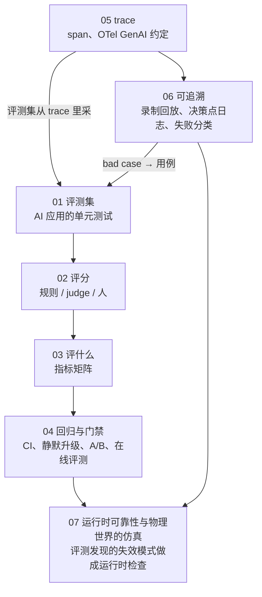
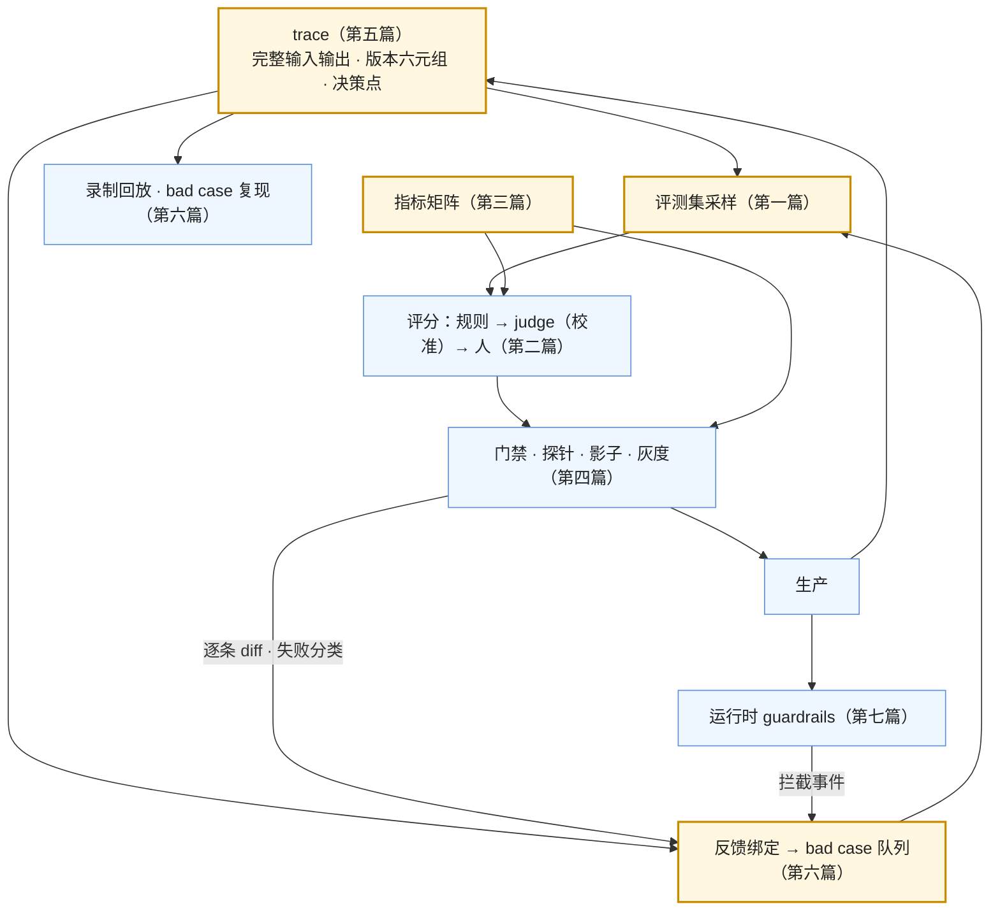

七篇正文回答了一个问题：**怎么知道改了之后更好了，出了事怎么追到那一步**。第一篇建评测集，第二篇讲评分与 judge 的校准，第三篇给指标矩阵，第四篇讲门禁、静默升级与在线评测，第五篇讲 trace 与 OpenTelemetry 的约定，第六篇讲可追溯的五项实践，第七篇讲运行时 guardrails 与物理世界的仿真。七篇合起来是[《AI 应用工程师学习地图》](/ai-application-engineer-learning-roadmap.html)第五层：**评测是测试，可观测是日志，可追溯是调试**——其他六层的每一次改进都靠这一层变成工程而不是猜测。

本文不讲新内容：总表、逐篇回顾、贯穿的线、误区、三段式自测。

> **读完这七篇，你应该能回答哪些问题？[^q0] 哪些数字与结论必须能脱口而出？[^q1] 怎么判断自己是"读过"还是"掌握"了？[^q2]**

先把整个系列放在一张图上——箭头是**推导或前置上的依赖**（箭头尾端的结论被箭头头端当作前提），不是阅读顺序：

## 一、总览：系列回答的问题与主线

系列的一句话主张是：**没有评测集的改动是猜测；judge 是仪器要先被测量；不可复现就录下来**。

| 篇 | 回答的问题 | 一句话结论 | 必记的数字 / 结论 |
|---|---|---|---|
| [第一篇：评测集](/eval-sets-the-unit-tests-of-ai-applications.html) | 用例从哪来、多大、怎么维护？ | 从真实流量按类型采（高频 / 边界 / 失败过的）+ 红队；四字段、期望可检验、含状态；几十条起 k 次；hold-out、六元组绑定、随 bad case 长 | 89% 可观测 vs 52% 评测；k = 3–5；hold-out 20–30%；合成只做冷启动 |
| [第二篇：评分](/scoring-rules-llm-as-a-judge-and-humans.html) | 规则 / judge / 人各评什么？judge 能信多少？ | 能规则不 judge、能 judge 不人；judge 四类偏差（风格最大）；报 kappa 不报一致率；一致 ≠ 正确；八步校准 | kappa 虚高 33–41 pp；排名移 14 位；重测 >0.95 与位置 >0.10 并存；风格 0.10–0.76；中档 + 去偏胜前沿便宜 15×；κ ≥ 0.61 |
| [第三篇：评什么](/what-to-evaluate-metrics-for-single-step-rag-agent-and-multi-turn.html) | 各形态评哪些指标？ | 矩阵：单步 / RAG / agent / 多轮 / 代码 × 结果 / 过程 / 成本 / 安全；过程与结果并列；多轮以会话为单位、模拟器要校准 | pass@k vs pass^k；分层报告；质量 vs 成本图 |
| [第四篇：门禁与在线](/regression-gates-silent-model-updates-ab-and-online-evaluation.html) | 改动怎么过门禁、静默升级怎么发现、在线怎么评？ | 改动 = 发布；分层 ≥ 基线 − 噪声、逐条 diff；钉快照 + 探针集每日；影子 → 灰度 → 回滚；A/B 一因素；隐式反馈带 trace id；季度校验离线—在线相关性 | 探针集是模型指纹；灰度忽略缓存冷启动；短期信在线长期修离线 |
| [第五篇：trace](/tracing-spans-opentelemetry-genai-conventions-and-tooling.html) | 记什么、按什么约定、用什么工具？ | 三级树 + 事件 + 子会话链接；`gen_ai.*` 全部 Development、迁独立仓库、属性改名、钉 opt-in、业务属性 `app.*`；工具按评测闭环 / 自托管选；元数据全量内容采样 bad case 全量 | v1.42.0（2026-06）移走；`system` → `provider.name`；trace 是会话日志的投影 |
| [第六篇：可追溯](/traceability-record-replay-decision-logs-failure-taxonomy-and-feedback.html) | 怎么从坏结果追到那一步并变成用例？ | 录制回放（输入哈希守卫）、决策点日志、失败分类十一类、版本 diff 同轴、反馈带 trace id 进队列、事后分析五段 | 非模型改动零成本回归；"技术对产品错"单列 |
| [第七篇：运行时与物理](/runtime-reliability-and-simulation-for-the-physical-world.html) | 运行时拦什么？物理世界怎么验证？ | guardrails 同步只放高风险；高风险断言必须有依据；fallback 四级；仿真六层、闭环才测决策、sim-to-real、放大长尾、影子、SIL / HIL；同构表 | 决策系统必须闭环；覆盖率用新场景比例度量 |

Table: 七篇的核心问题、结论与必记

### 1. 本文的章节安排

| 章 | 内容 |
|---|---|
| 二 | 逐篇回顾 |
| 三 | 贯穿七篇的三条线 |
| 四 | 常见误区表 |
| 五 | 通关自测：A 判断与计算 10 题、B 跨篇综合 5 题、C 面试题 7 题、D 掌握判据 |
| 六 | 下一步 |

Table: 本文的章节安排

## 二、逐篇回顾

### 1. 第一篇：评测集

**结论**：与单元测试三点不同（期望是分布、用例从流量采、依赖会变）。来源按类型覆盖采样；每条四字段（input 含状态、expected 可检验、meta、score_how）；几十条起 k = 3–5，分层报告；hold-out、六元组版本绑定、每周从 bad case 补、季度审过期、定期重跑；合成数据只做冷启动与覆盖检查（问法不像真人、期望可能错、自我偏好）；标注指南版本化、双标 kappa ≥ 0.6、分歧是信息。

**常见误解**：按流量比例采；期望写成"要好"；等评测集完善再用；合成集做决策。

### 2. 第二篇：评分

**结论**：三层——规则优先、judge 需校准、人做校准 / 抽检 / 裁决 / 发现。四类偏差与数字；报告陷阱（kappa 虚高、一致不是正确、排名不迁移、pairwise 更脆）；八步校准协议与校准偏移公式 $$p = (p_{obs} - (1-t)) / (s - (1-t))$$；rubric 短具体先理由后分忽略格式版本化；门禁 pointwise 对比 pairwise；去偏组合显著；中档 + 去偏胜前沿；钉 judge 版本；人之间也要量。

**常见误解**：一致率 88% 就能做门禁；judge 稳定就可靠；越大的 judge 越好。

### 3. 第三篇：评什么

**结论**：矩阵；形式指标单列（格式、schema、拒答两半、出口使用）；RAG 三个数字、agent 六维回顾；多轮以会话为单位（任务完成、策略遵循、轮数、澄清、状态保持、恢复），模拟器三种且要校准；安全五项与红队集；横切——分布（pass@k / pass^k）、分层、成本延迟并列；基准只缩范围。

**常见误解**：准确率涨就上线；轮平均分代表会话质量；pass@5 代表生产可靠性。

### 4. 第四篇：门禁与在线

**结论**：触发清单含 judge / rubric；判据七项；噪声阈值从方差算；CI 形态与记录；静默升级用钉快照 + 探针集 + 通知 + 生产突变对齐；影子（零风险双成本）→ 灰度（1–5%、缓存冷启动、样本量）→ 回滚（确认依赖）；A/B 一因素固定分组；在线信号三类带 trace id；在线 judge 另校准；不一致四原因；季度相关性；短期信在线长期修离线。

**常见误解**：改 rubric 后直接比旧分；无部署就不会变；A/B 同时变两个因素。

### 5. 第五篇：trace

**结论**：三级树与每种 span 的字段；OTel GenAI 约定的内容与 2026 现状（独立仓库、全 Development、改名、`invoke_agent` 拆分、扩展到 agent 循环、OpenInference 对齐、Langfuse v3）；用法五条；工具六家按四判据选；自建最小集；trace 是会话日志的投影；敏感数据六措施；采样三档；成本分层。

**常见误解**：只记前 500 字；自造 `gen_ai.*` 属性；全量存内容。

### 6. 第六篇：可追溯

**结论**：录制回放（录完整输出 + 输入哈希，不匹配报警，非模型改动零成本回归，分叉点重跑）；决策点日志九项；失败分类十一类含"技术对产品错"，judge 可预打类；版本 diff 同轴与配置即代码；反馈带 trace id 进队列（owner、SLA、去重、状态）每周补评测集闭环；事后分析五段产出用例 / 分类 / 探针 / 告警。

**常见误解**：回放静默用旧输出；反馈没有 trace id；事后分析只写"加了一句 prompt"。

### 7. 第七篇：运行时与物理

**结论**：两条防线闭环；guardrails 输入 / 输出侧表，同步只放高风险；置信度不可靠用出口 / logprobs / 自一致性；幻觉检测六手段原则是有依据；fallback 四级；物理世界不能在生产试；仿真六层组合；闭环才测决策；sim-to-real 手段；长尾放大与覆盖率度量；影子、SIL / HIL；同构表八行。

**常见误解**：让模型自评置信度；日志回放能测决策；仿真通过率等于真实。

## 三、贯穿全系列的几条线

### 1. 评测是测试

没有评测集的改动是猜测。第一篇建它、第三篇定评什么、第四篇把它接进发布、第六篇让它随 bad case 长、第七篇的事故回灌它。评测集是这一层的中心资产，与代码同等对待（版本、hold-out、六元组绑定）。

### 2. 仪器先被测量

judge 的 kappa、四类偏差、校准偏移（第二篇）；用户模拟器的行为分布（第三篇）；离线指标对在线结果的预测力（第四篇）；仿真对真实的 sim-to-real 差距（第七篇）——每一个"用来测量的东西"自身都要先被测量，否则结论建在假设上。

### 3. 不可复现就录下来

模型不可复现 → 每步的完整输入输出进 trace（第五篇）→ 录制回放做回归、决策点日志做定位、反馈带 trace id（第六篇）→ 物理世界的日志回放与影子模式是同一思想（第七篇）。

### 4. 概念表

| 概念 | 出处 | 一句话 |
|---|---|---|
| 四字段 | 1 | input（含状态）、expected（可检验）、meta、score_how |
| 六元组 | 1、5 | 评测集 × prompt × 模型快照 × 工具集 × 检索配置 × judge / rubric |
| hold-out | 1 | 20–30% 不参与迭代，防过拟合 |
| 四类偏差 | 2 | 位置、风格（最大）、冗长（异质）、自我偏好 |
| kappa 虚高 | 2 | 精确匹配相对 Cohen's kappa 高 33–41 pp |
| 一致但有偏 | 2 | 重测 >0.95 与位置偏差 >0.10 并存 |
| 校准偏移 | 2 | $$p = (p_{obs} - (1-t)) / (s - (1-t))$$ |
| pointwise / pairwise | 2 | 门禁用前者，对比用后者 + 交换 + 长度匹配 |
| pass@k / pass^k | 3 | 至少一次 / 每次都对；生产看后者 |
| 用户模拟器 | 3 | 多轮评测的另一方，要校准 |
| 噪声阈值 | 4 | 从 k 次方差算；改动要超过它 |
| 探针集 | 4 | 几十条每日跑的模型指纹 |
| 影子模式 | 4、7 | 并跑只记录，零风险双成本 |
| 离线—在线相关性 | 4 | 门禁有意义的前提 |
| 三级树 | 5 | 会话 → 任务 → span + 事件 + 子会话链接 |
| `gen_ai.*` Development | 5 | 全部未 Stable，钉 opt-in，改名当破坏性 |
| 输入哈希守卫 | 6 | 回放在不匹配处报警不静默 |
| 决策点日志 | 6 | 记"为什么"，轨迹成状态图 |
| 失败分类十一类 | 6 | 含"技术对产品错" |
| 反馈绑定 | 6 | 每条反馈带 trace id 进队列 |
| 闭环 vs 开环 | 7 | 决策系统必须闭环 |
| sim-to-real | 7 | 仿真通过 ≠ 真实；域随机化与校准 |
| 覆盖率 | 7 | 场景维度 + 新场景比例 |

Table: 贯穿七篇的概念表

## 四、常见误区

| 误区 | 为什么错 | 出处 |
|---|---|---|
| "有 trace 就够了" | 看得见不等于能判断；89% vs 52% 的差距是事故来源 | 总纲、1 |
| "按流量比例采评测集" | 难例几乎没有，退化看不见 | 1 |
| "等评测集完善再用" | 几十条就能分方向；拖延是最常见的失败 | 1 |
| "合成集 recall 0.95 很好" | 问法贴合原文，高估 | 1 |
| "judge 一致率 88% 可做门禁" | 未校正机遇；报 kappa | 2 |
| "judge 稳定就可靠" | 一致但有偏 | 2 |
| "用最大的模型当 judge" | 去偏策略比大小重要；中档 + 去偏胜前沿便宜 15× | 2 |
| "准确率涨就上线" | 形式指标、成本、安全并列 | 3 |
| "每轮平均分代表会话质量" | 多轮以会话为单位 | 3 |
| "pass@5 = 生产可靠性" | 生产看 pass^k | 3 |
| "改 rubric 后直接比旧分" | 尺子变了要重量基线 | 4 |
| "没部署就不会变" | 供应商静默升级；探针集 | 4 |
| "A/B 一次变两个" | 归因不了 | 4 |
| "离线涨了在线一定涨" | 季度校验相关性 | 4 |
| "只记前 500 字省空间" | 回放与复现都做不了；内容进对象存储 | 5 |
| "自造 `gen_ai.prompt.version`" | 命名空间冲突；用 `app.*` | 5 |
| "回放全过就上线" | 输入变了要报警重跑 | 6 |
| "幻觉 = 模型问题" | 十一类里多数的药在检索、prompt、产品层 | 6 |
| "让模型输出置信度" | 不可靠；要依据 | 7 |
| "日志回放能测决策" | 开环；决策要闭环 | 7 |
| "仿真通过率就是真实表现" | sim-to-real | 7 |

Table: 常见误区与正确说法

## 五、通关自测

### A. 判断与计算（10 题）

1. 判断：LangChain 2026 年报告里接了评测的团队比接了可观测的多。

   

答案

   错。89% 可观测、52% 评测。
   

2. 计算：judge 敏感度 0.9、特异度 0.75，观察通过率 0.7。真实通过率？

   

答案

   $$p = (0.7 - 0.25) / (0.9 - 0.25) = 0.45 / 0.65 \approx 0.69$$。验算：$$0.69 \times 0.9 + 0.31 \times 0.25 \approx 0.70$$。几乎无偏移。
   

3. 判断：研究显示 LLM judge 最大的一类偏差是位置偏差。

   

答案

   错。风格偏差（偏爱 markdown 外观，0.10–0.76）最大，位置 ≤ 0.04（部分生产 judge >0.10）。
   

4. 计算：评测集 100 条 × k = 5，基线两次重跑的均值差 1.5 分。新版本均值比基线高 1.2 分。能说变好吗？

   

答案

   不能。1.2 分低于噪声量级 1.5 分，在噪声内；要更大的评测集、更大的 k、或看逐条 diff 与分层是否有一致方向。
   

5. 判断：OpenTelemetry 的 `gen_ai.usage.input_tokens` 属性在 2026 年 9 月是 Stable。

   

答案

   错。所有 `gen_ai.*` 元素仍是 Development；Stable 的只有共享的核心属性（`error.type` 等）。
   

6. 判断：改了工具返回的字段名，用录制回放跑通就可以上线。

   

答案

   错。字段名变了下一步模型的输入变了，回放应在输入哈希不匹配处报警并从分叉点重跑模型。
   

7. 计算：每天 5 万会话、每会话 1.5 MB 内容、元数据 5 KB。全存内容一年多少？只存元数据全量 + 内容 5% 呢？

   

答案

   全存：75 GB / 天 ≈ 27 TB / 年。元数据 250 MB / 天 ≈ 91 GB / 年 + 内容 5% 3.75 GB / 天 ≈ 1.4 TB / 年（加 bad case 全量）；约 1.5 TB，降一个量级以上。
   

8. 判断：pass^5 一定不大于 pass@5。

   

答案

   对。五次全对的用例集合是至少一次对的子集。
   

9. 判断：日志回放是闭环评测。

   

答案

   错。回放的输入固定，系统的动作不改变后续输入——开环。闭环需要仿真器或带状态的环境。
   

10. 判断：用户模拟器不需要校准，因为它只是评测工具。

    

答案

    错。模拟器的行为分布（轮数、放弃率、措辞、纠正频率）决定系统面对什么，过于理想的模拟器高估表现；要与真实会话日志比对校准。
    

### B. 跨篇综合（5 题）

1. 一个 RAG 客服系统：评测集 300 条合成问题 recall@5 = 0.94，judge（GPT-5.6，未校准）faithfulness 4.5 / 5，上线后点踩率 12%。用第一、二、四、六篇诊断并给出重建计划。

   

答案

   诊断：（1）评测集是合成的——问法贴合文档、高估 recall，不代表真实分布；（2）judge 未校准——不知道 kappa 与偏差，4.5 可能是风格偏差与校准偏移；（3）离线与在线不相关——正是第四篇的四原因里的前两条。重建：从日志采 100 条真实查询（含点踩的），人标相关块与理想答案，分层；标 100 条校准集量 judge 的 kappa、四类偏差、敏感度 / 特异度，κ < 0.61 换 judge 或加去偏；接反馈绑定让点踩带 trace id 进队列、每周补评测集；建门禁与探针集；季度校验离线—在线相关性。
   

2. 团队要把模型从 Sonnet 4.6 换到 Sonnet 5。用第四篇设计完整的发布路径，说明每一步看什么、忽略什么。

   

答案

   （1）新版本 + 六元组记录；（2）门禁：评测集 × k 分层指标（注意 tokenizer 变了 token 数涨 30%——成本阈值要重设并记录有意为之）、逐条 diff、格式与拒答两半、红队集；judge 是否与新模型同家族——加跨家族对照；（3）影子模式：新旧并跑真实流量一两天，比差异分布、成本、延迟；（4）灰度 1–5%、trace 绑版本，忽略头几分钟缓存冷启动，看采纳 / 重试 / 追问，等到样本量显著；（5）全量；探针集加入新模型指纹；（6）回滚预案：旧快照仍可用、会话状态可读（加密压缩 item 不能跨模型）。
   

3. 面板显示失败分类里"上下文腐化"一类两周内从 5% 升到 20%，没有本地部署。用第四、六篇排查到根因并说明每一步用什么数据。

   

答案

   版本 diff：两周内无本地变更 → 指向供应商；探针集：看输出长度、token 数、格式率是否同期漂移——若平均输出长度涨了，会话更快填满上下文、压缩更频繁、目标更易丢；决策点日志：上下文操作事件里压缩触发次数与时机变化、预算余量曲线；trace：抽几条腐化的会话看压缩前后目标是否存活（L2 探针问题）。根因可能是供应商静默升级让输出变长；应对：钉快照或调压缩策略与复述，记为外部发布，探针集加输出长度告警。
   

4. 一个后台 agent 直接执行数据库变更。设计运行时防线与评测的组合，说明哪些同步、哪些异步、哪些在评测里。

   

答案

   评测（上线前）：轨迹六维含安全（越权尝试）、鲁棒性（注入用例）、红队集；闭环环境快照；录制回放做非模型回归。运行时同步（高风险路径）：L4 四层——执行策略把 DDL / DELETE 设 `prompt` 或 `forbidden`、沙箱、Guardian；输出侧业务校验（影响行数上限）；变更先生成提案由人审（L4 第八篇的中间物）。运行时异步：judge 抽样评轨迹合理性、卫士触发进队列。所有拦截事件带 trace id 进 bad case 队列，回灌评测集；面板看越权尝试与拒绝率。
   

5. 用同构表把一个数字 agent 团队的评测体系映射到自动驾驶的验证体系，并指出数字团队最缺、物理团队最缺的各一项。

   

答案

   映射：容器快照评测环境 ↔ 场景仿真；录制回放 ↔ 日志回放；红队集与变换扩增 ↔ 长尾场景放大；离线—在线相关性 ↔ sim-to-real；评测集类型覆盖 ↔ 场景库覆盖率；影子 ↔ 影子；六级人机分工 ↔ SAE；事后分析回灌 ↔ 事故场景回灌。数字团队最缺**覆盖率度量**（主动定义维度、追踪新类比例）；物理团队可借**bad case 队列与失败分类的运营**（owner、SLA、去重、闭环）。
   

### C. 面试题（7 题）

1. 怎么从零建一个 AI 应用的评测体系？两周内能做到什么？

   

答案

   **答案要点**：(1) 第一周：从日志采 50 条（按类型覆盖 + 失败过的 + 边界），每条写可检验期望（能规则化的规则化），k = 3 跑基线，分层报告，留 20% hold-out；(2) 第二周：标 100 条校准集量 judge 的 kappa 与偏差，决定门禁指标；把评测接进 CI，改动 = 发布；探针集每日跑；反馈带 trace id 进队列；(3) 之后：每周从 bad case 补，季度审过期与离线—在线相关性；(4) 不要等完善——几十条就能分方向。
   **追问方向**：agent 评测怎么做环境（容器快照）；judge 选什么（中档 + 去偏）。
   **好答案与一般答案的区别**：一般答案说"收集测试用例、用 GPT 打分"；好答案给出采样原则、可检验期望、k 次、hold-out、judge 校准、门禁、反馈闭环的顺序与时间表。

   

2. LLM-as-judge 能信吗？你怎么决定一个 judge 能不能做门禁？

   

答案

   **答案要点**：(1) 能用但要先测量——它是仪器；(2) 四类偏差与 2026 年的数字（风格最大、冗长异质、一致但有偏、kappa 虚高 33–41 pp、排名跨基准移 14 位）；(3) 八步协议：校准集双标 κ ≥ 0.6 → judge 与人 κ ≥ 0.61 → 交换顺序 → 长度匹配 → 格式对照 → 遮蔽来源 + 跨家族 → 敏感度 / 特异度反推 → rubric 固定抽检；(4) 门禁用 pointwise + 校正通过率，对比用 pairwise + 交换；(5) 选 judge 看 kappa 与成本，中档 + 去偏胜前沿便宜 15×；钉版本、重校触发条件。
   **追问方向**：pairwise 为什么更脆（干扰翻转 35% vs 9%）；judge 在线怎么校准。
   **好答案与一般答案的区别**：一般答案说"有偏差要人工抽检"；好答案给出偏差的种类与量级、报 kappa 不报一致率、完整的校准协议与门禁用法。

   

3. 供应商在你不知道的情况下换了模型，你怎么发现、怎么应对？

   

答案

   **答案要点**：(1) 现象：无部署而格式率、输出长度、成本、分数变了；(2) 检测：钉带日期的快照而非浮动别名；探针集（几十条敏感用例）每日跑作模型指纹（分数、格式率、长度、token、TTFT）漂移告警；订阅 changelog 与弃用通知；版本 diff 时间线上"无本地变更"的突变；(3) 应对：全量评测确认范围、切旧快照或 fallback、记为外部发布、通知供应商；(4) 这是评测集要定期重跑而不只在改动时跑的理由。
   **追问方向**：DeepSeek 路由到 V4.1 Flash 的例子；fallback 的方向性。
   **好答案与一般答案的区别**：一般答案说"看监控"；好答案给出探针集这个具体机制、钉快照、版本 diff 对齐、以及应对流程。

   

4. 设计 AI 应用的 trace：记什么、按什么约定、敏感数据与成本怎么办？

   

答案

   **答案要点**：(1) 三级树：会话（版本六元组、权限档、成本）→ 任务（输入输出状态反馈）→ span（模型调用完整输入输出 + 五项 usage + effort + stop_reason + TTFT；工具参数结果沙箱审批；检索查询候选排序）+ 事件（压缩卸载卫士审批决策点）+ 子会话链接；(2) OTel GenAI 约定：按 `gen_ai.*` 打点，但 2026 年全 Development、迁独立仓库、属性改名（`system` → `provider.name`）——钉 `OTEL_SEMCONV_STABILITY_OPT_IN`、改名当破坏性、后端归一、业务属性 `app.*`；(3) 敏感：分级脱敏访问控制短保留不记凭据；(4) 成本：元数据全量、内容采样 + bad case 全量、内容进对象存储；(5) trace 是会话日志的投影，一份数据两视图。
   **追问方向**：工具怎么选（评测闭环、自托管）；只记前 500 字为什么不行（回放与复现）。
   **好答案与一般答案的区别**：一般答案说"用 Langfuse 记 prompt 和输出"；好答案给出三级结构、约定现状与用法、敏感与成本的具体措施。

   

5. 什么是录制回放？它能替代什么、不能替代什么？

   

答案

   **答案要点**：(1) 模型输出不可复现但可录下，应用处理确定性可重放；录完整输出 + 输入哈希；(2) 能替代：非模型改动（工具、解析、卫士、权限、检索配置、序列化）的回归——零成本、可复现、秒级；bad case 本地复现；fixture 单元测试；无 key 演示；(3) 不能替代：改变模型输入的改动（prompt、模型、effort、schema、工具描述、间接改变下一步输入的）——要重跑，回放在输入哈希不匹配处报警并从分叉点重跑；(4) 与物理世界日志回放同构，都是开环；决策评测要闭环。
   **追问方向**：怎么设计输入哈希（规范化后的请求体）；DeepSeek Harness 的 recorded-session replay。
   **好答案与一般答案的区别**：一般答案说"缓存模型输出"；好答案说清边界（输入哈希守卫、分叉点重跑）与开环的性质。

   

6. 一个 agent 上线三个月，用户满意度下降但离线评测分数没变。排查思路？

   

答案

   **答案要点**：(1) 离线—在线不相关的四原因：评测集分布过时（用户在问新类型——看零结果率、失败分类里新类比例、bad case 队列内容）、指标选错（judge 分与采纳不相关——校验历次发布的相关性）、judge 在线失准（用真实样本重校）、噪声与其他变更；(2) 供应商静默升级（探针集、版本 diff 无本地变更）；(3) 运营侧：索引新鲜度、权限同步、软删除堆积；(4) 方法：带 trace 的负反馈进队列分类，重采评测集，跑三个数字定位段（检索 / 生成 / 端到端），失败分类分布变化；(5) 修离线让它能预测在线，短期信在线。
   **追问方向**：怎么区分用户变了与系统变了（旧查询重跑）；A/B 怎么设。
   **好答案与一般答案的区别**：一般答案说"重新评测"；好答案列四原因加供应商与运营两类，并给用 trace 与失败分类定位的方法。

   

7. 自动驾驶的验证体系对 AI 应用工程师有什么可借的？反过来呢？

   

答案

   **答案要点**：(1) 同构表：仿真 ↔ 容器评测环境、回放 ↔ 录制回放、长尾放大 ↔ 红队与扩增、sim-to-real ↔ 离线在线相关性、覆盖率 ↔ 评测集覆盖、影子 ↔ 影子、SAE ↔ 六级、事故回灌 ↔ 事后分析；(2) 可借：覆盖率度量（场景维度、新场景比例——数字团队多靠被动积累）、闭环评测的纪律（决策系统不能只开环）、影子模式作为上线前必经步、"验证决定自主"的严格性；(3) 反向：bad case 队列与失败分类的运营（owner、SLA、去重、闭环）、judge 校准的方法论、录制回放的输入哈希守卫；(4) 代价差几个量级但结构相同。
   **追问方向**：世界模型生成仿真的验证问题；数字 agent 什么时候也不能灰度（不可逆动作）。
   **好答案与一般答案的区别**：一般答案说"自动驾驶更严格"；好答案逐项对应并指出各方最缺的那一项。

   

### D. 掌握判据

| 层次 | 判据 |
|---|---|
| 读过 | 能说出评测集四字段、judge 四类偏差、指标矩阵的行列、门禁判据、三级 trace、五项可追溯实践、仿真六层 |
| 掌握 | 能两周内建第一版评测集与门禁；能校准一个 judge 并算校正通过率；能为一个形态填矩阵；能建探针集与影子灰度流程；能按 OTel 约定打三级 trace 并处理敏感数据；能接录制回放与反馈队列；能列运行时 guardrails 并判断同步 / 异步；能画物理系统的仿真层次与覆盖度量 |
| 能教人 | 能解释为什么一致不等于正确、为什么报 kappa、为什么中档 + 去偏胜前沿；能解释离线—在线不相关的四原因与修法；能解释 `gen_ai.*` Development 的含义与钉版本的做法；能解释录制回放的边界（输入哈希、分叉点）；能推导 sim-to-real 与离线在线相关性的同构；能用同构表指出两个领域各最缺什么 |

Table: 掌握程度的判据

通关标准：A 组 8 题以上正确（计算题误差 5% 以内），B 组 4 题以上能写出完整推理链，C 组每题能说出至少三个要点并回答一个追问。

## 六、下一步

本系列是[《AI 应用工程师学习地图》](/ai-application-engineer-learning-roadmap.html)的第五层。

- **L6 生产化与运营**：本系列第四篇的门禁与灰度、第七篇的 guardrails 与 fallback 在 L6 里进入完整的生产体系——网关、成本工程、延迟工程、安全的分层防御（注入、供应链、EchoLeak 一类事件）、治理与合规（审计、EU AI Act）、发布与数据飞轮。
- **L7 产品与体验**：本系列的失败分类里"技术对产品错"一类、拒答与不确定性的呈现、用户反馈的采集设计在 L7 展开。
- **前置**：[L1](/model-as-a-component.html)（非确定性、选型、成本）、[L2](/prompt-and-context-engineering.html)（prompt 版本与门禁的雏形）、[L3](/retrieval-and-knowledge-access.html)（分开评）、[L4](/tools-agents-and-harness.html)（轨迹评测、会话日志、四层）。三张地图的分工见[《AI 全栈学习地图》](/ai-fullstack-learning-roadmap.html)。

## 七、延伸阅读

本系列有意不展开的内容，以及它们在哪个系列里：

- **不讲模型能力的基准测试方法论**：MMLU 一类的学术基准设计属于算法地图；本系列只讲应用自己的评测集与公开基准的使用边界。
- **不讲可观测的通用基础设施**：OTel Collector、存储后端、采样器的运维属于平台工程；本系列只讲 GenAI 专属的 span 与约定。
- **不讲安全防御的全体系**：prompt injection 的分层防御属于 L6；本系列只讲它的评测（红队集）与运行时拦截的位置。
- **不讲仿真器的实现**：渲染、物理引擎、传感器模型属于机器人 / 自动驾驶的专业领域；本系列只讲仿真在验证体系里的层次与它与数字 agent 评测的同构。

[^q0]: 面对一个要改动或上线的应用：评测集有吗、从哪来、多大、四字段齐吗、hold-out 与六元组绑了吗（1）；judge 的 kappa 多少、四类偏差量过吗、校正通过率多少、能做门禁吗、pointwise 还是 pairwise（2）；这个形态该评矩阵里哪些格、跑了几次、pass^k 多少、成本与质量一起报了吗（3）；这次改动过门禁了吗、噪声阈值多少、逐条 diff 看了吗、探针集在跑吗、影子与灰度怎么走、A/B 一因素吗、离线与在线相关吗（4）；trace 三级树全吗、按 `gen_ai.*` 钉版本了吗、敏感数据怎么处理、成本怎么分层（5）；出了事能录制回放复现吗、决策点日志有吗、失败分了类吗、反馈带 trace id 吗、事后分析五段写了吗（6）；运行时同步拦什么、高风险断言有依据吗、fallback 几级；物理世界的仿真层次、闭环、sim-to-real、覆盖率、影子（7）。详见[第一章](#一总览系列回答的问题与主线)。

[^q1]: 数字：89% 可观测 vs 52% 评测、质量 32% 最大障碍；k = 3–5；hold-out 20–30%；双标 κ ≥ 0.6、judge κ ≥ 0.61；kappa 虚高 33–41 pp；排名移 14 位；重测 >0.95 与位置 >0.10 并存；风格 0.10–0.76 最大、位置 ≤ 0.04、冗长异质（+0.24 到 +0.44 / −0.12 / −0.04）；中档 + 去偏 κ 0.549、0.001 美元、便宜 15×；pairwise 干扰翻转 35% vs 9%；校准偏移公式；灰度 1–5%；OTel 核心 v1.42.0（2026-06）移走 GenAI、全 Development、`system` → `provider.name`；内容采样 1–10% + bad case 全量。结论：评测是测试、仪器先被测量、不可复现就录下来；改动 = 发布；报 kappa 不报一致率；一致不是正确；生产看 pass^k；探针集是模型指纹；短期信在线长期修离线；输入哈希守卫；"技术对产品错"单列；决策必须闭环；覆盖率用新场景比例。详见[第一章](#一总览系列回答的问题与主线)、[第三章](#三贯穿全系列的几条线)。

[^q2]: 用第五章 D 节：读过——能说出几组名词与数字；掌握——能两周建评测集与门禁、校准 judge 并算校正通过率、填矩阵、建探针与影子灰度、按约定打三级 trace 并处理敏感与成本、接录制回放与反馈队列、列 guardrails 并分同步异步、画仿真层次与覆盖度量；能教人——能解释一致不等于正确与报 kappa 的理由、中档 + 去偏为什么胜前沿、离线在线不相关的四原因、`gen_ai.*` Development 的含义与钉版本、录制回放的边界、sim-to-real 与离线在线相关性的同构、两个领域各最缺什么。通关：A 组 8 题以上（误差 5% 内）、B 组 4 题以上完整推理链、C 组每题三个要点加一个追问。详见[第五章](#五通关自测)。
