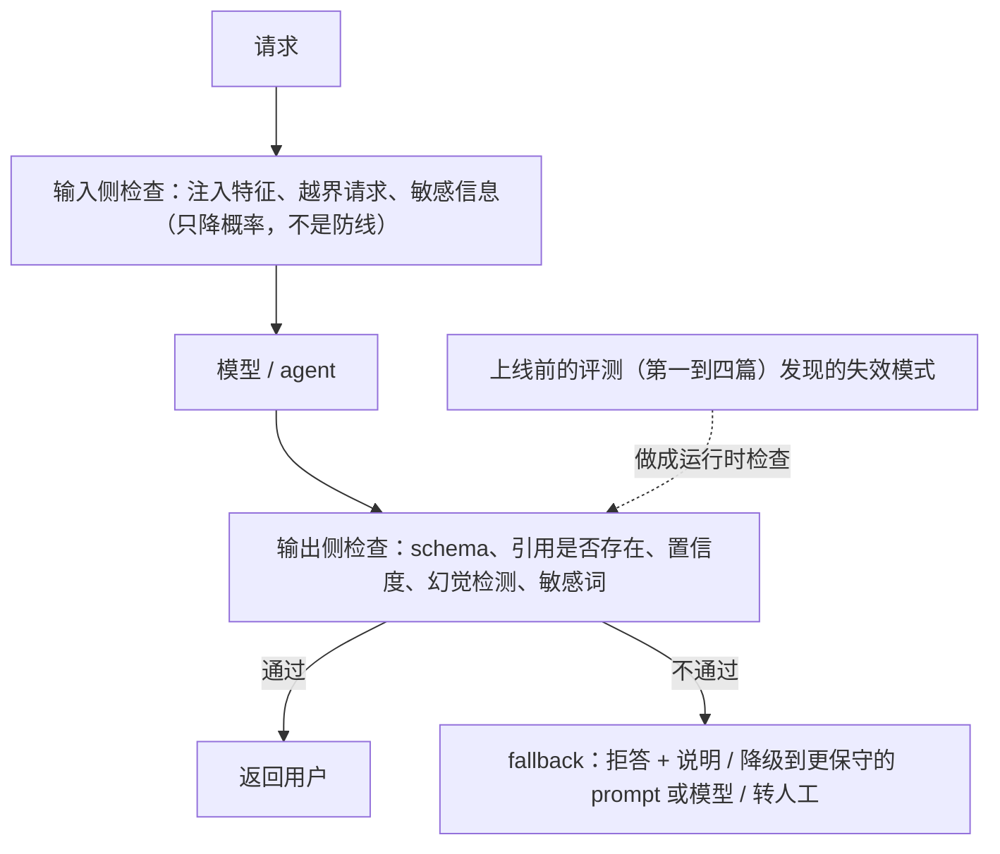

前六篇讲的是**上线前**（评测）与**上线后看**（可观测、可追溯）。这一篇讲两件补充的事。第一件是**运行时**：上线后在请求路径上拦住坏输出——guardrails、置信度与拒答、幻觉检测、fallback——它们是评测发现的失效模式在生产里的最后一道网。第二件是**物理世界**：自动驾驶、机器人、工业控制的失败可能致命且不可逆，"评测"不能在真实世界里做，于是验证被做成了一门独立的工程——仿真。地图把它作为应用栈的对照案例；这一篇讲仿真的层次、开环与闭环、sim-to-real、覆盖率与长尾、影子模式，以及它与数字 agent 的沙箱环境、录制回放、红队集的同构关系。

本篇要回答的核心问题是：

> **运行时 guardrails 在哪一步拦什么，幻觉检测的实际手段与成本是什么？[^q0] 物理世界的仿真有哪些层次，开环与闭环、sim-to-real、覆盖率各是什么问题？[^q1] 影子模式与 HIL / SIL 是什么，数字 agent 的评测与物理世界的验证有什么同构？[^q2]**

## 一、总览

### 1. 两条防线




| | 上线前 | 运行时 |
|---|---|---|
| 目的 | 证明改动更好（分布上） | 拦住这一次的坏输出（单次） |
| 手段 | 评测集、judge、门禁 | guardrails、置信度、拒答、在线 judge 拦截、fallback |
| 代价 | 评测成本、发布延迟 | 每请求的延迟与成本、误拦 |
| 关系 | 评测发现失效模式 → 运行时加对应的拦截 → 拦截事件进 bad case 队列 → 评测集补 | 闭环 |

### 2. 物理与数字

| | 数字 agent | 物理世界（自动驾驶 / 机器人） |
|---|---|---|
| 失败的代价 | 可回滚（多数） | 不可逆、可能致命 |
| 能在生产里试吗 | 灰度、影子可以 | 不行——验证在真实世界之外 |
| "测试环境" | 容器快照、录制回放、评测集 | **仿真**（一门工程）、日志回放、影子模式、封闭场地 |
| 长尾 | bad case 队列积累 | 仿真放大稀有场景 |
| 自主级别的判据 | 能自动验证到什么程度（L4 第八篇） | 同一判据的最严格版本：SAE 每升一级验证体系跳一个量级 |

### 3. 本文的章节安排

第二章运行时 guardrails；第三章置信度、拒答与幻觉检测；第四章 fallback；第五章物理世界为什么不能在生产里试；第六章仿真的层次；第七章开环 / 闭环、sim-to-real、覆盖率；第八章影子模式、HIL / SIL 与同构；第九章实践建议。

## 二、运行时 guardrails

### 1. 位置

```text
用户输入 → [输入侧检查] → 上下文组装 → 模型 → [输出侧检查] → 工具 / 呈现
                 ↓ 拦                              ↓ 拦 / 改写 / 重试 / 降级
```

### 2. 输入侧

| 检查 | 手段 | 动作 |
|---|---|---|
| 注入 | 规则（已知模式）+ 分类器 + 对工具返回的隔离标记 | 标记 / 拒绝 / 降低该段内容的权重 |
| 敏感信息 | PII 识别 | 脱敏后继续，或拒绝 |
| 越界请求 | 分类器（这不是本产品处理的事） | 拒答出口 |
| 长度与格式 | 规则 | 截断 / 拒绝 |
| 速率与配额 | L1 第六篇 | 限流 |

输入侧对注入的检测只是**降低概率**——真正的防线是 L4 第五篇的四层与 L6 的分层防御；这里的检查是第一层。

### 3. 输出侧

| 检查 | 手段 | 动作 |
|---|---|---|
| 格式与 schema | 规则（L2 第三篇的解析层） | 带错误重试一次 → 降级 |
| 业务校验 | 规则（金额范围、日期合法、id 存在） | 同上 |
| 引用存在性 | 规则（引用的块 id 在检索结果里） | 去掉无依据的断言或重试 |
| 敏感信息 | PII / 凭据识别 | 脱敏 / 拦 |
| 有害内容 | 分类器 | 拦 + 记录 |
| 忠实度（抽样） | 在线 judge（第四篇） | 低分标记；高风险场景同步拦 |
| 动作 | L4 第五篇的四层 | 权限 / 审批 / 沙箱 |

### 4. 代价

每项检查加延迟（规则微秒到毫秒、分类器几十毫秒、judge 几百毫秒到秒）与误拦率——把正常请求拒了是另一种失败（第三篇的误拒率）。同步拦截只放在高风险路径（对外发送、不可逆动作、合规敏感），其他走异步标记进队列。

## 三、置信度、拒答与幻觉检测

### 1. 模型没有可靠的置信度

模型说"我确定"不代表确定（L1 第一篇）。可用的信号：结构化输出里的显式拒答出口（L2 第三篇）——模型自己说"信息不足"比自己打的置信分可靠；logprobs（部分 API 提供）对短答案有一定校准；**自一致性**——同一问题采样 k 次看一致率，一致率低说明不确定（成本 k 倍，只用于高风险）。

### 2. 拒答的设计

该拒的拒、不该拒的不拒（第三篇的两半）。运行时：拒答出口被触发时给用户的呈现（L7）——说明缺什么、下一步能做什么，而不是一句"无法回答"；拒答率进面板（骤升 = 检索 / 权限 / 模型出问题——L3 第七篇）。

### 3. 幻觉检测的实际手段

| 手段 | 做法 | 成本 | 适用 |
|---|---|---|---|
| 引用对照 | 答案的每个断言必须能定位到检索结果的某块（规则 + 轻量 judge） | 低到中 | RAG |
| 自一致性 | k 次采样，断言在多数样本里出现才保留 | k 倍 | 高风险单步 |
| 事实核对工具 | 让模型（或另一个 agent）用检索 / 计算器验证关键断言 | 中到高 | 数字、日期、实体 |
| 结构化证据 | schema 里要求每个结论带 `evidence` 字段引用原文 | 低 | 抽取、分类 |
| 结果校验 | agent 声称完成 → 读回状态核对（L4 第九篇） | 低 | agent |
| judge 抽样 | faithfulness judge 跑在流量抽样上 | 中 | 全部（异步） |

没有一种能"检测所有幻觉"；能做的是让高风险断言必须有依据、没有依据的不呈现为事实（L7 的呈现）。

## 四、fallback

L1 第六篇讲了方向性：推理状态不可跨供应商、加密的压缩 item 不可跨供应商、工具 schema 的方言差异。运行时 fallback 的层次：**重试**（同模型，瞬时错误）→ **降档**（同家族更小的模型，容量或超时）→ **跨供应商**（大故障；会话状态要可读才能带过去）→ **降级到非模型路径**（规则回答、转人工、"稍后再试"）。每一级的触发条件、超时预算（L1 第六篇的四层超时）、以及 fallback 后的质量标记（这次回答来自降档模型——进 trace，评测时分开看）。

## 五、物理世界为什么不能在生产里试

一次自动驾驶的失败可能致命、不可逆、且发生在你控制不了的环境里；一次机器人的失败可能损坏设备与伤人；一次工业控制的失败可能停产。数字 agent 的"灰度 1% 流量看看"在这里不成立——1% 的车祸不是可接受的实验代价。于是验证被推到真实世界之外：**仿真**、日志回放、影子模式、封闭场地，最后才是有安全员的真实道路。这条路径与 L4 第八篇的六级人机分工同构：SAE L2 → L3 → L4 每升一级，对应的不是模型换了一代，是验证体系跳了一个量级。

## 六、仿真的层次

| 层 | 做什么 | 优点 | 局限 | 代表 |
|---|---|---|---|---|
| **场景仿真** | 可编程的场景（车、人、天气、路况）与物理引擎，系统在其中闭环运行 | 可复现、可参数化、能放大稀有场景（"雨夜横穿的行人"生成一万种变体） | 渲染与行为模型与真实有差距 | CARLA 一类开源仿真器；各厂自建 |
| **日志回放** | 真实采集的传感器数据重放给感知与规划模块 | 真实数据、覆盖真实分布 | **开环**：系统的动作不改变后续输入（你刹车了，回放里的车还是照原来的轨迹开） | 各厂的回放平台 |
| **传感器仿真** | 渲染相机 / 激光雷达 / 雷达的物理级信号 | 测感知模块 | 渲染真实度、传感器噪声模型 | 游戏引擎 + 物理渲染；神经渲染 |
| **数字孪生** | 特定场地（工厂、港口、园区）的高保真复制 | 对固定场景极准 | 只覆盖该场地 | 工业机器人、物流 |
| **世界模型生成** | 用生成模型合成场景与传感器数据（文本 / 布局 → 视频） | 长尾场景的多样性、成本低 | 生成的物理一致性、与真实分布的差距要验证 | NVIDIA Cosmos 一类世界基础模型；各厂的生成式仿真 |
| **封闭场地** | 真车真机器人在受控场地 | 真实物理 | 贵、慢、场景有限 | 测试场 |

一个成熟的验证体系是这些层的组合：场景仿真跑百万级场景、日志回放跑真实分布、传感器仿真验感知、封闭场地验物理、真实道路验整体——与数字世界的"单元测试 → 集成 → 影子 → 灰度"是同一形状。

## 七、开环、闭环、sim-to-real、覆盖率

### 1. 开环 vs 闭环

**开环**：输入固定（回放），看系统的输出对不对（感知识别对了吗、规划给的轨迹合理吗）——便宜、真实数据、但测不了决策的后果。**闭环**：系统的动作改变环境，环境再给新输入（仿真器）——能测"刹车之后会怎样"、多步决策的累积效应、与其他参与者的交互。数字 agent 的对应：录制回放是开环（模型输出固定，看应用侧），带环境快照的 agent 评测是闭环（agent 的动作改变仓库状态，下一步看到新状态）。**决策系统必须有闭环评测**——两个世界都是。

### 2. sim-to-real 差距

仿真里 99.99% 通过不等于真实世界 99.99%：渲染差异、物理简化、行为模型（仿真里的行人不像真人）、传感器噪声。手段：**域随机化**（在仿真里随机化光照、纹理、噪声让系统对差异鲁棒）、**用真实数据校准仿真**（回放与仿真的输出差异作为仿真真实度的度量）、**神经渲染与世界模型**缩小视觉差距、**封闭场地与真实道路**作为最终校准。数字 agent 的对应是第四篇的"离线—在线相关性"：评测集分数能否预测线上表现——同一个问题。

### 3. 覆盖率与长尾

几百万公里的真实里程覆盖不了每百万公里一次的事件；而这些稀有事件正是致命的。仿真的核心价值是**放大长尾**：从真实日志里挖出稀有场景 → 参数化 → 生成成千上万变体 → 闭环跑。覆盖率的度量：场景库的维度覆盖（天气 × 路况 × 参与者 × 行为）、真实日志里出现的场景类型有多少在仿真库里有对应、新采集的日志里"仿真库没见过"的比例（它下降说明覆盖在收敛）。数字 agent 的对应：评测集的类型覆盖、bad case 队列里"分类不了的新类"的比例（第六篇）。

## 八、影子模式、HIL / SIL 与同构

### 1. 影子模式

新版本的软件在车上跑，**读全部传感器、做全部决策，但不控制车**；它的决策与当前版本（或人类驾驶员）的决策对比，差异大的场景被记录、上传、进入仿真库。真实分布、真实硬件、零风险。Tesla 一类公开描述过这种做法。数字世界的影子模式（第四篇：新旧版本并跑只记录）是同一思想——只是数字世界还能灰度，物理世界影子几乎是上路前的最后一步。

### 2. HIL / SIL

**SIL**（软件在环）：软件在仿真环境里跑，全部虚拟；**HIL**（硬件在环）：真实的控制器硬件接仿真的传感器与执行器信号——测时序、硬件与软件的交互、实时性。数字 agent 的对应：SIL 是容器里的评测，HIL 是接真实的外部 API 与工具（但在沙箱账户里）。

### 3. 同构表

| 物理世界 | 数字 agent | 共同的原则 |
|---|---|---|
| 场景仿真 | 容器快照的 agent 评测环境 | 可复现、可参数化的闭环环境 |
| 日志回放 | 录制回放 | 开环，测非决策部分 |
| 长尾场景放大 | 红队集、bad case 变换扩增 | 稀有失败要主动制造 |
| sim-to-real | 离线—在线相关性 | 测试环境要能预测生产 |
| 覆盖率 | 评测集类型覆盖、新类比例 | 不知道没覆盖什么最危险 |
| 影子模式 | 影子模式 | 真实分布零风险 |
| SAE 分级 | 六级人机分工 | 验证决定自主 |
| 事故调查与场景回灌 | 事后分析 → 评测集 | 事故是最贵的用例 |

物理世界的代价高几个量级，所以它把这些做成了工程学科；数字 agent 正在低代价地重走这条路——两边可以互相借方法。

## 九、实践建议

1. **列运行时 guardrails 表**：输入侧与输出侧各查什么、用规则还是分类器还是 judge、同步拦还是异步标、误拦率多少；同步只放高风险路径。
2. **高风险断言必须有依据**：引用对照 + 结构化证据字段；没有依据的不呈现为事实。
3. **fallback 四级**（重试 → 降档 → 跨供应商 → 非模型路径），每级触发条件与超时，fallback 标记进 trace。
4. **agent 评测必须有闭环环境**（快照 + 动作改变状态），录制回放只用于开环回归。
5. **做物理世界的团队**：画出仿真层次与各层覆盖，量 sim-to-real 差距（回放 vs 仿真输出），维护场景库覆盖率与"新场景比例"，上路前影子。
6. **借对方的方法**：数字 agent 团队学场景库与覆盖率度量；物理团队学 bad case 队列与失败分类的运营。

## 十、本文小结

- 两条防线：上线前证明分布上更好，运行时拦这一次的坏输出；拦截事件回到 bad case 队列闭环。
- guardrails：输入侧（注入、PII、越界、长度、限流——只是第一层）、输出侧（格式、业务校验、引用存在、敏感、有害、抽样忠实度、动作四层）；每项有延迟与误拦代价，同步只放高风险路径。
- 置信度不可靠：用显式拒答出口、logprobs（短答案）、自一致性（k 倍成本）；幻觉检测六手段（引用对照、自一致性、事实核对、结构化证据、结果校验、judge 抽样），原则是高风险断言必须有依据。
- fallback 四级与方向性；标记进 trace。
- 物理世界不能在生产里试 → 验证在真实世界之外：场景仿真、日志回放（开环）、传感器仿真、数字孪生、世界模型生成、封闭场地；闭环才能测决策；sim-to-real 用域随机化与真实数据校准；仿真的核心价值是放大长尾，覆盖率用场景维度与"新场景比例"度量；影子模式零风险测真实分布；SIL / HIL。
- 同构：仿真 ↔ 容器评测环境、回放 ↔ 录制回放、长尾放大 ↔ 红队集、sim-to-real ↔ 离线在线相关性、覆盖率 ↔ 评测集覆盖、影子 ↔ 影子、SAE ↔ 六级、事故回灌 ↔ 事后分析。

## 十一、自测

1. 一个对外发送邮件的 agent，团队想在发送前用 judge 同步检查忠实度，每次多 1.5 秒。合理吗？其他路径也要吗？

   <details markdown="1"><summary>答案</summary>
   合理——对外发送是不可逆的高风险路径，1.5 秒换一次拦截值得；同时应有引用对照与人审阅草稿（L4 第八篇的中间物）。其他低风险路径（内部草稿、只读查询）不要同步 judge，改异步抽样标记进队列——同步拦截的延迟与误拦要只花在高风险处。详见[第二章](#二运行时-guardrails)。
   </details>

2. 为什么"让模型输出一个 0–1 的置信度"不是可靠的幻觉信号？有什么更可靠的替代？

   <details markdown="1"><summary>答案</summary>
   模型对自己的确定程度没有校准，"我 95% 确定"与实际正确率不对应（L1 第一篇）。替代：显式拒答出口（模型说"信息不足"比打分可靠）、logprobs 对短答案的校准、自一致性（k 次采样看一致率）、引用对照（断言能否定位到检索结果）、结构化证据字段——原则是要依据不要自评分。详见[第三章](#三置信度拒答与幻觉检测)。
   </details>

3. 日志回放里新版本的规划模块给出了与旧版本不同的刹车决策，回放显示"通过"。为什么这个结论不可靠？该用什么？

   <details markdown="1"><summary>答案</summary>
   回放是开环：系统刹车了但回放里的其他车辆仍按原轨迹运动，看不到刹车之后的后果（后车追尾？前方情况变化？）。决策的后果只有闭环仿真能测——系统的动作改变环境、环境给新输入。日志回放只适合测感知等非决策部分。同理数字 agent 的决策要在带环境快照的闭环里评，录制回放只做开环回归。详见[第七章](#七开环闭环sim-to-real覆盖率)。
   </details>

4. 仿真里 100 万个场景通过率 99.99%，真实道路测试的表现明显更差。列出三个可能原因与对应手段。

   <details markdown="1"><summary>答案</summary>
   sim-to-real 差距：（1）渲染 / 传感器噪声与真实不同——域随机化、神经渲染、用回放数据校准仿真；（2）仿真里其他参与者的行为模型不像真人——从真实日志学行为模型；（3）场景库覆盖不了真实长尾——用真实日志挖新场景回灌仿真库，监控"新场景比例"。度量差距本身：同一输入下回放与仿真的输出差异。详见[第七章](#七开环闭环sim-to-real覆盖率)。
   </details>

5. 用同构表说明：数字 agent 团队的"bad case 队列 → 变换扩增 → 评测集"对应物理世界的什么？反过来物理世界的哪一项是数字团队最该借的？

   <details markdown="1"><summary>答案</summary>
   对应"事故 / 影子模式差异场景 → 参数化生成变体 → 场景库"——从真实失败挖场景、放大长尾、回灌测试环境。数字团队最该借的是**覆盖率度量**：场景库按维度的覆盖与"新采集里仿真库没见过的比例"——数字 agent 的评测集少有系统的覆盖度量，多靠 bad case 被动积累；主动定义类型维度并追踪"分类不了的新类比例"是可以直接搬的方法。详见[第八章](#八影子模式hil--sil-与同构)。
   </details>

## 下一篇

[系列总结与通关自测](/evals-and-observability-series-recap-and-self-test.html)

[^q0]: 输入侧：注入（规则 + 分类器 + 工具返回隔离标记，只降概率，真防线在 L4 四层与 L6）、PII 脱敏、越界请求分类走拒答出口、长度格式、限流。输出侧：格式与 schema（带错误重试一次再降级）、业务校验、引用存在性（去掉无依据断言）、敏感与有害内容、抽样忠实度 judge、动作走 L4 四层。每项加延迟（规则毫秒、分类器几十毫秒、judge 几百毫秒到秒）与误拦率，同步拦截只放高风险路径（对外发送、不可逆、合规），其余异步标记进队列。置信度：模型自评分不可靠，用显式拒答出口、logprobs（短答案）、自一致性（k 倍成本）。幻觉检测六手段——引用对照（RAG，低到中）、自一致性（高风险单步，k 倍）、事实核对工具（数字日期实体，中到高）、结构化 `evidence` 字段（低）、结果校验（agent，低）、judge 抽样（异步）；原则是高风险断言必须有依据、无依据不呈现为事实。fallback 四级：重试 → 降档 → 跨供应商（状态要可读）→ 非模型路径，标记进 trace。详见[第二章](#二运行时-guardrails)到[第四章](#四fallback)。

[^q1]: 层次：场景仿真（可编程可复现可放大稀有场景，CARLA 一类；渲染与行为模型有差距）、日志回放（真实数据真实分布；开环）、传感器仿真（物理级相机 / 激光雷达 / 雷达信号，测感知）、数字孪生（特定场地高保真）、世界模型生成（生成模型合成场景与传感器数据，NVIDIA Cosmos 一类；物理一致性要验证）、封闭场地（真实物理，贵慢有限）；成熟体系是组合。开环（输入固定看输出对不对，便宜真实但测不了后果）vs 闭环（动作改变环境再给新输入，能测决策后果与多步累积）——决策系统必须闭环，数字 agent 同理（录制回放开环、快照环境闭环）。sim-to-real：仿真通过率不等于真实——用域随机化、真实数据校准仿真（回放 vs 仿真输出差异作为真实度度量）、神经渲染与世界模型、封闭场地与真实道路最终校准；对应数字世界的离线—在线相关性。覆盖率与长尾：真实里程覆盖不了百万公里一次的致命事件，仿真的核心价值是从日志挖稀有场景 → 参数化 → 生成成千变体 → 闭环跑；度量用场景维度覆盖与"新采集里仿真库没见过的比例"。详见[第五章](#五物理世界为什么不能在生产里试)到[第七章](#七开环闭环sim-to-real覆盖率)。

[^q2]: 影子模式：新版本在车上读全部传感器做全部决策但不控制，与当前版本或人的决策对比，差异大的场景记录上传进仿真库——真实分布、真实硬件、零风险，是上路前的最后一步；数字世界的影子（新旧并跑只记录）同一思想。SIL 软件在环全虚拟；HIL 真实控制器硬件接仿真信号测时序与实时性；数字对应是容器评测与接真实外部 API 的沙箱账户。同构：场景仿真 ↔ 容器快照评测环境（可复现闭环）、日志回放 ↔ 录制回放（开环）、长尾放大 ↔ 红队集与变换扩增（主动制造稀有失败）、sim-to-real ↔ 离线—在线相关性（测试环境要能预测生产）、覆盖率 ↔ 评测集类型覆盖与新类比例、影子 ↔ 影子、SAE 分级 ↔ 六级人机分工（验证决定自主）、事故调查回灌 ↔ 事后分析进评测集。物理世界代价高几个量级所以把这些做成了工程学科，数字 agent 低代价重走同一条路，两边互借方法——数字团队最该借覆盖率度量，物理团队可借 bad case 队列与失败分类运营。详见[第八章](#八影子模式hil--sil-与同构)。
