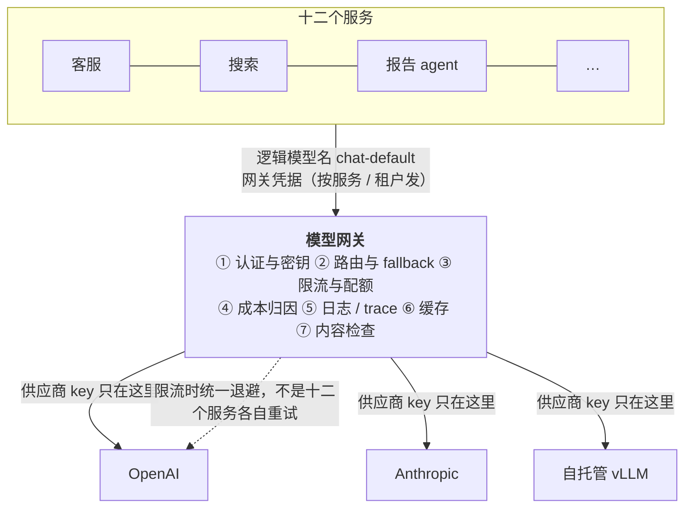

事故先说：一个团队有十二个服务各自调模型，每个服务的环境变量里有一份供应商 API key；某个 key 被写进了日志、日志被同步到第三方；月底账单是一个总数，没人知道哪个功能花了多少；供应商限流时十二个服务各自重试，把限流打得更狠；想加一个 fallback 供应商，要改十二处。这些问题的共同解是一层**模型网关**：所有模型调用经过它，供应商 key 只在它那里，路由、限流、归因、日志在一处。

这一篇讲网关的七项职责、市面上的选项各是什么定位、什么时候自建、以及网关**不该**做什么。

本篇要回答的核心问题是：

> **网关做哪七件事，各解决什么事故？[^q0] LiteLLM、OpenRouter、Cloudflare AI Gateway 一类各是什么定位、怎么选？[^q1] 什么时候自建，网关的边界在哪？[^q2]**

## 一、总览

### 1. 七项职责

| 职责 | 解决的事故 | 关联的层 |
|---|---|---|
| 认证与密钥 | key 散落、泄露、轮换要改多处 | 第四篇密钥管理 |
| 路由与 fallback | 供应商锁死、故障无退路 | L1 第六篇的方向性 |
| 限流与配额 | 一个功能打爆整体配额；账单失控 | L1 第六篇令牌桶、第二篇预算 |
| 缓存 | 重复请求重复花钱 | L2 第五篇（供应商侧缓存是另一件事） |
| 成本归因 | 不知道钱花在哪 | 第二篇 |
| 日志与脱敏 | trace 散落、PII 进日志 | L5 第五篇 |
| 供应商抽象 | 换模型改每处调用 | L1 第二篇（抽象有边界） |

Table: 网关的七项职责

### 2. 本文的章节安排

第二章逐项讲七项职责；第三章选项与定位；第四章自建；第五章网关的边界；第六章实践建议。

## 二、七项职责

### 1. 认证与密钥

应用拿**网关的凭据**（按服务 / 租户 / 功能发放，可随时吊销），供应商的 key **只在网关**。收益：轮换在一处；泄露一个应用凭据只影响它自己的配额；供应商 key 不会出现在应用日志与工作区（PocketOS 的第一环——L4 第五篇）。网关的凭据本身要能表达范围（哪些模型、多大配额、哪些功能）。

### 2. 路由与 fallback

应用请求一个**逻辑模型名**（`chat-default`、`reasoning-high`、`cheap-classifier`），网关映射到具体供应商与快照——换模型改一处配置。fallback 链按 L1 第六篇的方向性：同模型重试 → 同家族降档 → 跨供应商（**推理状态、加密压缩 item、工具方言不能跟着切**——网关要知道哪些请求不可跨供应商，或让应用声明）→ 非模型路径（应用侧）。故障检测：错误率、超时、429 的滑动窗口；熔断与半开（L1 第六篇）。

### 3. 限流与配额

三个维度：**RPM / TPM**（供应商给的总配额，网关按租户 / 功能分配，防止一个功能打爆整体——L1 第六篇的令牌桶集中到这里）、**美元预算**（按租户 / 功能的日 / 月上限，接近告警、超过降级——第二篇）、**并发**（agent 的长会话占连接）。发前数 token（L1 第六篇）在网关做一次即可。

### 4. 缓存

两种要分清。**精确缓存**（同样的请求体返回同样的响应）：对幂等的、非确定性可接受的查询有效（分类、抽取同一文档），对对话与 agent 无效（每步不同）；TTL 要短、按租户隔离。**语义缓存**（相似的问题返回缓存的答案）：风险大——"相似"不等于"同答案"（"退货要多久"与"退款要多久"），只在 FAQ 类且能容忍的场景用，并让用户能刷新。**供应商侧的 prompt caching**（L2 第五篇）是第三件事：网关不做，但要**不破坏**它——网关不能改请求体的顺序、不能注入动态内容到前缀、要透传 `prompt_cache_key` 与断点标记。

### 5. 成本归因

每次调用带**标签**：租户、功能、prompt 版本、模型、会话、环境；响应里的 usage（输入 / 输出 / 缓存读写 / 推理）按标签进账本；按 L1 第四篇的价目算美元（价目表在网关维护一份）。这是第二篇全部工作的基础——没有归因就没有优化。

### 6. 日志与脱敏

网关是 trace 的天然出口（L5 第五篇）：每次调用一个 span，含完整请求响应（或引用）、usage、延迟分段、路由决定、fallback 事件。**脱敏在这里做**：PII 识别与替换、凭据抹除——应用不必各自实现。采样与保留期按 L5 第五篇。

### 7. 供应商抽象

统一的请求 / 响应形状让应用不关心供应商——但**抽象有边界**（L1 第二篇）：推理状态的搬运方式（thinking block / reasoning item / thought signature）、工具调用的方言、结构化输出的实现、缓存断点、流式事件的形状各家不同。网关能统一"普通对话 + 工具调用"的公分母，不能抹平推理与缓存的差异——这些要么由网关按供应商专属逻辑处理，要么由应用声明"这个请求绑定供应商"。过度抽象的网关会让你用不上供应商的新能力。

## 三、选项与定位

| 选项 | 形态 | 定位 | 适合 |
|---|---|---|---|
| **LiteLLM** | 开源；代理服务或 Python SDK；百余供应商 | 自托管的全功能网关：路由、fallback、预算、密钥、日志、OpenAI 兼容接口 | 想自托管、多供应商、要预算与归因 |
| **OpenRouter** | 托管；多模型市场 | 一个 key 用几百个模型、按用量计费、有 fallback 与路由 | 快速多模型实验、不想管供应商账户 |
| **Cloudflare AI Gateway** | 边缘托管；接自己的供应商 key | 缓存、限流、日志、分析、fallback，在边缘 | 已用 Cloudflare、要边缘缓存与限流 |
| **Portkey / Helicone 一类** | 托管（部分可自托管） | 网关 + 可观测（Helicone 改 base URL 即接入） | 以可观测与成本监控为主 |
| **各云的网关**（Bedrock、Vertex、Azure AI Foundry 的路由） | 云托管 | 云内多模型 + 云的 IAM 与合规 | 已深度用某云、合规要求流量在云内 |
| **自建** | 反向代理 + 七项 | 完全可控 | 合规（流量不出域）、特殊路由、规模成本 |

Table: 网关选项与定位

判据：**自托管**（数据不出域的要求）、**延迟**（多一跳几十毫秒；边缘网关就近）、**供应商覆盖**（含本地模型与自托管推理）、**归因粒度**（能否按你的标签维度出账）、**与 trace 的集成**（OTel 输出）、**对供应商专属特性的透传**（推理状态、缓存断点、Batch）、**成本**（托管网关按请求或用量收费）。

## 四、自建

### 1. 理由

流量不出域的合规要求；路由逻辑特殊（按租户的合同选供应商、按内容分类路由）；规模大到托管网关的费用可观；已有成熟的 API 网关基础设施（Envoy / Kong）可以扩展。

### 2. 最小集

一个反向代理 + 七项的最小版本：凭据映射表（应用凭据 → 允许的模型与配额）、逻辑模型名 → 供应商路由表（带 fallback 链与熔断）、令牌桶（按凭据）、美元账本（usage × 价目表，按标签）、OTel span 输出（含脱敏）、供应商 key 的密钥库（Vault 一类）。精确缓存与语义缓存可选。两三周的工作量；难的不是写，是运维（它是所有 AI 功能的单点——高可用、扩容、供应商 key 的安全）。

### 3. 混合

常见的做法：自建一层薄网关做凭据、归因、脱敏、trace（合规相关），后面接 LiteLLM 一类做路由与供应商适配（适配器多且更新快，自己维护不划算）。

## 五、网关的边界

### 1. 不该做

- **业务逻辑**：prompt 组装、检索、上下文管理属于应用层（L2、L3、L4）；网关不知道你的任务。
- **改请求体**：不能重排消息、不能注入动态内容到前缀（毁缓存——L2 第五篇）、不能改工具定义。
- **替应用决定 fallback 的语义**：跨供应商切换后推理状态丢失、工具方言不同——应用要知道并处理（L1 第六篇）；网关能做的是执行应用声明的策略。
- **语义缓存作为默认**：只在明确声明可缓存的请求上做。
- **单点无高可用**：网关挂了所有 AI 功能都挂；它要像任何核心基础设施一样有冗余。

### 2. 与 harness 的关系

L4 讲的 agent 运行时（会话、工具、权限）在网关之上：运行时组装请求、经网关调模型；网关不参与工具执行与权限判定（那是 L4 第五篇的四层，在运行时里）。托管的 Agents API（L4 第三篇）把运行时放在供应商侧——此时网关只是它前面的一跳（或不存在）。

## 六、实践建议

1. **收口**：所有模型调用改走网关（逻辑模型名），供应商 key 从所有应用的环境变量里移除。
2. **凭据分发**：每个服务 / 功能一个网关凭据，带模型白名单与配额。
3. **归因标签**：每次调用带租户 / 功能 / prompt 版本 / 环境，usage 进账本——第二篇的起点。
4. **fallback 链声明**：每个逻辑模型名配 fallback 链，标注哪些请求不可跨供应商。
5. **脱敏与 trace 在网关**：OTel 输出，PII 与凭据抹除。
6. **不改请求体、不默认语义缓存、透传缓存标记**。
7. **高可用**：网关按核心基础设施对待。

## 七、本文小结

- 网关是所有模型调用经过的一层，七项职责：认证与密钥（key 只在网关）、路由与 fallback（逻辑模型名、方向性、熔断）、限流与配额（RPM / TPM / 美元 / 并发按租户功能分）、缓存（精确可用、语义慎用、不破坏供应商侧缓存）、成本归因（标签 + usage + 价目表）、日志与脱敏（trace 出口）、供应商抽象（公分母，推理与缓存的差异是边界）。
- 选项：LiteLLM（自托管全功能）、OpenRouter（托管多模型市场）、Cloudflare AI Gateway（边缘）、Portkey / Helicone（可观测为主）、云网关、自建；按自托管、延迟、覆盖、归因粒度、trace 集成、专属特性透传、成本选。
- 自建的理由是合规、特殊路由、规模；最小集是反向代理 + 七项；常见混合是薄自建层 + LiteLLM。
- 边界：不做业务逻辑、不改请求体、不替应用决定 fallback 语义、不默认语义缓存、必须高可用；运行时与权限在网关之上。

## 八、自测

1. 一个团队用网关做了语义缓存，把"退货要多久"与"退款要多久"命中同一答案。问题与修法？

   

答案

   语义相似不等于同答案——两个问题的政策不同，缓存返回了错误答案。修：语义缓存只在明确声明可缓存的 FAQ 类请求上做、阈值极高、按租户隔离、用户可刷新；默认关闭；精确缓存对幂等查询更安全。详见[第二章](#二七项职责)。
   

2. 网关为了统一日志格式，在每个请求的 system 开头注入了 `[request_id: …]`。会发生什么？

   

答案

   前缀每次不同，供应商侧的 prompt caching 全部失效（L2 第五篇），输入成本涨十倍、TTFT 变长。网关不能改请求体前缀；request_id 放请求头或响应侧的 span 属性。详见[第五章](#五网关的边界)。
   

3. 网关配置了跨供应商 fallback，一个多轮推理任务在第 8 轮被切到另一家后质量骤降。原因？网关该怎么改？

   

答案

   推理状态（thinking block / reasoning item / 加密压缩 item）不能跨供应商搬运，切换后模型丢了推理上下文（L1 第三篇、第六篇）。网关应让应用声明"此会话绑定供应商"或"跨供应商仅在会话首轮"，会话中途只做同家族降档或重试，跨供应商只对无状态请求。详见[第二章](#二七项职责)、[第五章](#五网关的边界)。
   

4. 合规要求"请求内容不出本公司网络"，但团队想用托管网关的路由能力。怎么设计？

   

答案

   请求内容必然要到供应商（除非自托管模型），"不出网络"指不经过第三方网关。做法：自建薄网关（凭据、归因、脱敏、trace）在自己网络内，路由与适配用自托管的 LiteLLM 一类（开源、部署在自己网络），直连供应商端点或自托管推理。托管网关（OpenRouter、Cloudflare）不满足。详见[第三章](#三选项与定位)、[第四章](#四自建)。
   

5. 为什么归因标签要在网关而不是各应用自己记？

   

答案

   网关是唯一经过所有调用的点，能统一强制标签的存在与格式、统一用一份价目表算美元、统一进账本；各应用自记会漏、格式不一、价目表版本不同、无法跨应用聚合。归因是第二篇成本工程的基础，必须完整。详见[第二章](#二七项职责)。
   

## 下一篇

[成本工程：从账单到每任务成本](/cost-engineering-from-the-bill-to-cost-per-task.html)

[^q0]: 认证与密钥——应用拿网关凭据（按服务 / 租户 / 功能发放、可吊销、带范围），供应商 key 只在网关，解决 key 散落泄露与轮换要改多处；路由与 fallback——逻辑模型名映射到供应商与快照，fallback 链按方向性（重试 → 同家族降档 → 跨供应商仅对无状态请求 → 非模型路径），熔断与半开，解决供应商锁死与故障无退路；限流与配额——RPM / TPM / 美元 / 并发按租户与功能分配，解决一个功能打爆整体与账单失控；缓存——精确缓存对幂等查询、语义缓存慎用、不破坏供应商侧 prompt caching（不改前缀、透传标记）；成本归因——每次调用带租户 / 功能 / prompt 版本 / 模型 / 会话标签，usage 按价目表进账本，解决不知道钱花在哪；日志与脱敏——统一 trace 出口，PII 与凭据在此抹除；供应商抽象——统一公分母（对话 + 工具调用），推理状态、工具方言、缓存断点是边界。详见[第二章](#二七项职责)。

[^q1]: LiteLLM：开源、自托管、代理或 SDK、百余供应商、路由 / fallback / 预算 / 密钥 / 日志、OpenAI 兼容——想自托管与多供应商。OpenRouter：托管多模型市场，一个 key 几百模型按用量计费——快速实验、不管供应商账户。Cloudflare AI Gateway：边缘托管接自己的 key，缓存限流日志分析 fallback——已用 Cloudflare、要边缘。Portkey / Helicone：网关 + 可观测为主（Helicone 改 base URL 即接入）。云网关（Bedrock / Vertex / Foundry）：云内多模型 + IAM 与合规。自建：完全可控。判据：自托管与数据不出域、延迟（多一跳，边缘就近）、供应商覆盖（含本地与自托管推理）、归因粒度、OTel 集成、对推理状态 / 缓存断点 / Batch 等专属特性的透传、托管费用。详见[第三章](#三选项与定位)。

[^q2]: 自建的理由：合规要求流量不经第三方、路由逻辑特殊（按租户合同、按内容分类）、规模大到托管费用可观、已有 Envoy / Kong 可扩展。最小集：反向代理 + 凭据映射表 + 逻辑模型名路由表（fallback 与熔断）+ 令牌桶 + 美元账本 + OTel span 输出含脱敏 + 密钥库；两三周写、难在运维（单点高可用、扩容、key 安全）；常见混合是薄自建层做合规相关（凭据、归因、脱敏、trace）+ 自托管 LiteLLM 做路由与适配。边界：不做业务逻辑（prompt 组装、检索、上下文管理在应用层）、不改请求体（不重排、不注入前缀、不改工具定义——毁缓存）、不替应用决定 fallback 语义（跨供应商丢推理状态，应用声明）、不默认语义缓存、必须高可用；运行时与四层权限在网关之上，托管 Agents API 时网关只是前面一跳。详见[第四章](#四自建)、[第五章](#五网关的边界)。
