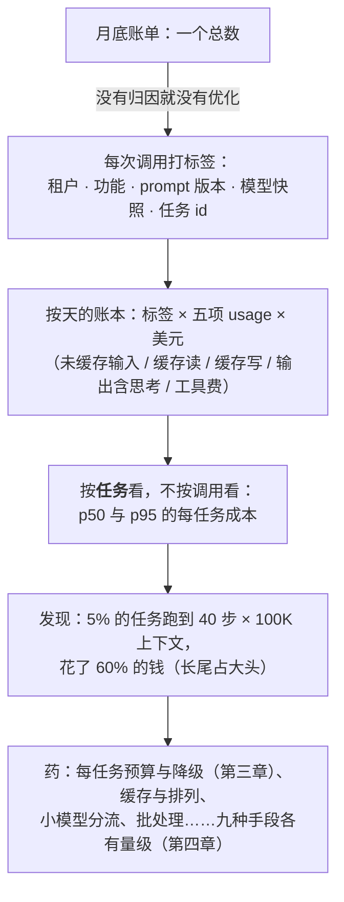

事故先说：月底账单比上月多三倍。没人知道是哪个功能——十二个服务共用一个 key（第一篇的事故）；追了两天发现一个新上线的 agent 功能在 5% 的任务里跑到 40 步、每步带着 100K 的上下文，那 5% 的任务花了账单的 60%。这就是 AI 应用成本的结构：**长尾任务占大头、成本随改动跳变、没有归因就没有优化**。

L1 第四篇给了成本公式与价目；这一篇讲它在生产里的运营：归因、预算与降级、九种省钱手段与各自的量级、按任务看分布、单位经济学、FinOps 的节奏。

本篇要回答的核心问题是：

> **成本怎么归因到租户 / 功能 / 版本，预算与降级怎么设？[^q0] 九种省钱手段各省多少、有什么代价？[^q1] 每任务成本怎么看分布，单位经济学怎么算，FinOps 的节奏是什么？[^q2]**

## 一、总览

### 1. 成本的结构

$$
\text{成本} = \sum_{\text{调用}} \big( \text{未缓存输入} \times p_{in} + \text{缓存读} \times 0.1\, p_{in} + \text{缓存写} \times 1.25\, p_{in} + (\text{输出} + \text{推理}) \times p_{out} \big) + \text{工具费} + \text{judge 与检索}
$$

L1 第四篇的公式加上生产里的三项：**工具费**（服务端工具按次计——web search、code interpreter、file search）、**judge**（L5 第二篇：在线抽样与门禁）、**检索**（embedding、向量库、rerank——L3 第七篇的五项）。三个事实决定运营方式：

- **长尾占大头**：agent 的 p95 任务是 p50 的 5–10 倍成本；5% 的任务花一半的钱。
- **随改动跳变**：换 effort、改 prompt、加工具、换模型，成本变化以倍计——每次改动是一次成本发布（第六篇）。
- **输入侧为主**：agent 的输入输出比约 100 : 1（L2 第一篇），缓存与瘦身作用在输入侧。

### 2. 本文的章节安排

第二章归因；第三章预算与降级；第四章九种手段与量级；第五章按任务看；第六章单位经济学；第七章 FinOps 节奏；第八章实践建议。

## 二、归因

### 1. 标签

每次调用（经网关——第一篇）带：**租户**、**功能**（哪个产品能力）、**prompt 版本**、**模型与快照**、**会话 / 任务 id**、**环境**（生产 / 灰度 / 评测）、**路径**（主路径 / fallback / 级联的第几级）。usage 五项 × 价目表 → 美元，按标签维度聚合。

### 2. 账本

一张按天的表：标签维度 × usage 五项 × 美元；加工具费、judge、检索的成本按同一维度记（检索的成本按会话分摊）。价目表在网关维护，**带日期**（价格会变——L1 第四篇的 2026-09 价目是某个时刻的）。

### 3. 三个视图

- **按功能**：哪个能力烧钱——决定优化优先级。
- **按租户**：多租户 SaaS 的成本分摊与定价依据；异常租户（一个租户占一半）要限流。
- **按版本**：prompt / 模型版本变更前后的每任务成本——第六篇发布的成本门禁。

### 4. 评测与灰度的成本

评测（L5：评测集 × k × judge）与灰度 / 影子（双倍推理）的成本单列——它们是"质量的成本"，与生产成本分开看，否则优化会砍掉评测。

## 三、预算与降级

### 1. 预算

按租户 / 功能设**日与月的美元上限**，从账本实时算消耗；阈值：80% 告警、95% 通知负责人、100% 触发降级。预算按历史用量与增长设，季度调。**评测的预算**也要有——否则它是第一个被砍的。

### 2. 降级梯子

超预算不是硬停（用户体验），是按梯子降：

| 级 | 动作 | 代价 |
|---|---|---|
| 1 | 切到便宜模型 / 降 effort | 质量降（评测集上量过） |
| 2 | 关闭非核心的增强（多查询检索、judge 抽样、二次校验） | 质量小降 |
| 3 | 限流（每租户 / 每用户的 RPM 降） | 排队 |
| 4 | agent 的步数与 token 预算收紧 | 更多部分结果 |
| 5 | 关闭非核心功能（kill switch，第六篇） | 功能不可用，有提示 |
| 6 | 全部走非模型路径 / 排队稍后 | 最后一级 |

每一级的触发条件、恢复条件（消耗回落到 90% 以下）、用户提示写进 runbook（第六篇）。这是 L1 第六篇熔断的成本版。

### 3. 异常检测

不等到月底：每小时的消耗与同时段基线比，突增（3 倍以上）告警并自动归因到功能 / 租户 / 版本——"哪个东西刚变了"（第六篇的版本 diff）。

## 四、九种手段与量级

| 手段 | 做法 | 典型量级 | 代价 | 出处 |
|---|---|---|---|---|
| **级联** | 便宜模型先试，按置信度 / 校验决定是否升级到贵模型 | 50–80%（多数请求走便宜路径） | 两次调用的延迟；分流器要评测 | L1 第五篇 |
| **路由** | 按任务类型固定选模型（分类用小模型、写作用大模型） | 30–60% | 路由规则维护 | L1 第五篇 |
| **prompt caching** | 静态前缀、断点、只追加（缓存读 0.1×） | 输入侧 50–90% | 排列纪律；第一轮写入 1.25× | L2 第五篇 |
| **Batch** | 非实时任务走 Batch 层级（半价，24 小时内） | 50% | 延迟从秒到小时 | L1 第四篇 |
| **Flex / 峰谷** | 可等待的请求走低优先级层级 | 20–50% | 延迟不定 | L1 第四篇 |
| **prompt 瘦身** | 删无效技巧、冗余示例、重复规则 | 输入 10–40% | 要评测遵循率不掉 | L2 第二篇 |
| **输出瘦身** | 结构化输出、限长、不要"解释一下你的想法" | 输出 20–60% | 用户可能要解释（L7 呈现） | L2 第三篇 |
| **上下文预算** | 卸载、清理、压缩、复述 | agent 输入 30–70% | 压缩有损；实现 | L2 第四篇、L4 第四篇 |
| **effort 按步选** | 简单步 low、关键步 high | 推理 token 30–70% | 每步分类 | L1 第三篇 |
| **步数与预算卫士** | agent 的上限与部分结果 | 砍掉长尾 | 更多部分结果 | L4 第一篇 |
| **PTC** | 多步数据处理变一轮 | 该类任务 50–90% | 沙箱、编码能力 | L4 第二篇 |

量级是经验范围，取决于你的分布——**每一项都要在评测集上量质量不掉、在账本上量省了多少**，两个数字一起报。手段可叠加：级联 + 缓存 + 瘦身 + effort 选档常让每任务成本降到原来的 1/5 到 1/10。

### 1. 顺序

先归因（知道钱在哪）→ 先做不影响质量的（缓存排列、瘦身、Batch 迁移、卫士）→ 再做要评测的（级联、路由、effort、压缩）→ 最后考虑微调小模型（第七篇飞轮：几千条数据后把行为编译进小模型——L3 第一篇的顺序）。

## 五、按任务看

### 1. 分布

每任务成本的 p50 / p95 / p99 与最大值，按功能。agent 的 p95 常是 p50 的 5–10 倍；看**长尾任务的画像**（多少步、多大上下文、哪些工具、是否重复调用）——多数长尾是可修的（卫士没触发、卸载没做、模型在换词重试——L4 第一篇、L3 第五篇）。

### 2. 成本门禁

每次发布（第六篇）比较新旧版本的每任务成本分布：p50 与 p95 都不超阈值（或有意为之并记录）。L5 第四篇的门禁判据里"成本不退化"的具体形态。

### 3. 成本进面板

与质量、延迟、安全并列（总纲的四指标）：每任务成本 p50 / p95、每功能日消耗、预算消耗比、缓存命中率（L2 第五篇）、级联的分流比例、降级触发次数。

## 六、单位经济学

### 1. 每任务价值

一个功能的每任务成本要与**每任务价值**比：节省的人工时间 × 时薪、带来的转化 / 留存的增量、用户愿付的价格。例：一个客服助手每任务 \$0.08，替代人工平均 4 分钟（\$2）→ 25 倍；一个代码 agent 每任务 \$3，替代 40 分钟（\$50）→ 17 倍；一个"AI 摘要"每次 \$0.02，用户很少看 → 价值不明——第一个该扩、第三个该问要不要存在（L7 的场景选择）。

### 2. 毛利与趋势

SaaS 里 AI 功能的成本是 COGS：毛利 = 收入 − 模型成本 − 检索 / 工具 / judge 成本；定价（按席位、按用量、按任务）要覆盖 p95 而不是 p50 的用户；模型每年降价（L1 第四篇的趋势）让同一功能的毛利随时间改善，但使用量增长与更贵的能力（agent、推理）会吃掉它——两条线都画。

### 3. 决策

按单位经济学做三类决策：**该不该做**（价值 / 成本 < 3 的功能重新设计或砍）、**用什么模型**（价值高的用贵模型、价值低的用便宜的或级联）、**怎么定价**（覆盖 p95 用户的成本；按用量的功能要有配额）。

## 七、FinOps 节奏

| 周期 | 做什么 |
|---|---|
| 每小时 | 消耗异常检测与自动归因 |
| 每天 | 账本更新；预算消耗比；长尾任务画像 |
| 每周 | 按功能 / 租户 / 版本的成本报表；缓存命中率与级联分流比；本周发布的成本影响 |
| 每月 | 预算对账；单位经济学更新（每任务成本 vs 价值）；手段的收益复盘 |
| 每季 | 模型与供应商重议（价格、弃用、新模型进评测——L1 第五篇）；预算重设；定价复核 |

## 八、实践建议

1. **归因先行**：网关标签齐全、账本按天、三个视图；评测与灰度成本单列。
2. **预算与降级梯子**：按租户 / 功能设日月预算，80 / 95 / 100% 三档动作，梯子写进 runbook。
3. **先做免费的**：缓存排列、prompt 瘦身、Batch 迁移、卫士——量省了多少。
4. **再做要评测的**：级联、路由、effort 选档、压缩——质量与成本两个数字一起报。
5. **长尾画像**：每周看 p95 任务的步数与上下文，修可修的。
6. **算单位经济学**：每功能的每任务成本 vs 价值，做三类决策。
7. **按节奏运营**：小时 / 天 / 周 / 月 / 季各有动作。

## 九、本文小结

- 成本结构：五项 + 工具费 + judge + 检索；长尾占大头（p95 是 p50 的 5–10 倍）、随改动跳变、输入侧为主。
- 归因：租户 / 功能 / prompt 版本 / 模型 / 会话 / 环境 / 路径标签，usage × 带日期的价目表进账本，按功能 / 租户 / 版本三视图，评测与灰度成本单列。
- 预算：日月美元上限，80 / 95 / 100% 三档；降级梯子六级（降模型 → 关增强 → 限流 → 收紧 agent 预算 → kill switch → 非模型路径）；每小时异常检测自动归因。
- 九种手段与量级：级联 50–80%、路由 30–60%、缓存输入 50–90%、Batch 50%、Flex 20–50%、prompt 瘦身 10–40%、输出瘦身 20–60%、上下文预算 30–70%、effort 选档 30–70%、卫士砍长尾、PTC 50–90%；每项量质量与成本；先免费的再要评测的最后微调。
- 按任务看 p50 / p95 / p99，长尾画像多可修；成本门禁；成本进四指标面板。
- 单位经济学：每任务成本 vs 价值，毛利与趋势两条线，三类决策（做不做、用什么模型、怎么定价覆盖 p95 用户）。
- FinOps 节奏：小时异常、天账本、周报表、月对账与单位经济、季重议。

## 十、自测

1. 账单涨三倍，账本显示 agent 功能 5% 的任务花了 60% 的钱。按本文，接下来三步是什么？

   

答案

   （1）长尾画像：这 5% 的任务多少步、上下文多大、哪些工具、有没有重复调用——多数是卫士没触发、没卸载、换词重试；（2）修可修的：步数与 token 卫士、卸载阈值、重复调用提醒（L4 第一、四篇），并在评测集上确认质量；（3）预算与降级梯子：给该功能设日预算，超过时收紧 agent 预算或限流；成本门禁防再犯。详见[第三章](#三预算与降级)、[第五章](#五按任务看)。
   

2. 一个团队为省钱把评测集的 k 从 5 降到 1、砍掉在线 judge 抽样。评价。

   

答案

   砍的是"质量的成本"——评测与监控是防事故的，一次质量事故的代价远超 judge 费用；k = 1 让门禁失去区分力（L5 第一篇）。评测与灰度成本应单列并有自己的预算，不与生产成本混在一起优化。先做不影响质量的手段（缓存排列、瘦身、Batch）。详见[第二章](#二归因)、[第四章](#四九种手段与量级)。
   

3. 级联把 70% 的请求分到便宜模型，每任务成本降了 60%，但评测集分数掉了 4 分。怎么判断值不值、怎么修？

   

答案

   看分层：掉分集中在哪类用例——是便宜模型处理不了的类被错误分流（分流器的判据太宽）。修分流器（置信度阈值、按类型强制走贵模型、加校验后升级），目标是便宜路径的质量与贵模型持平、只在真正需要时升级；再用单位经济学判断：4 分对应多少价值损失 vs 60% 成本节省。两个数字一起报是原则。详见[第四章](#四九种手段与量级)、[第六章](#六单位经济学)。
   

4. 一个"AI 会议摘要"功能每次 \$0.05，月消耗 \$8,000，用户打开率 3%。用单位经济学分析。

   

答案

   每月 16 万次生成、只有约 4,800 次被看——97% 的成本花在没人看的输出上。选项：按需生成（用户点开再生成，成本降 97%）、Batch 层级（半价）、更小的模型、或重新设计场景（L7）；先问"用户为什么不看"再决定要不要存在。价值 / 成本明显低于 3 的功能要重新设计。详见[第六章](#六单位经济学)。
   

5. 按用量定价的 AI 功能，定价按 p50 用户的成本加 40% 毛利。会出什么问题？

   

答案

   重度用户（p95）的成本是 p50 的 5–10 倍，按 p50 定价在他们身上亏钱，且重度用户往往是留下来的用户；定价要覆盖 p95 的成本，或按用量分档 / 设配额并对超额计费。同时用长尾画像修可修的成本、设预算与降级梯子。详见[第五章](#五按任务看)、[第六章](#六单位经济学)。
   

## 下一篇

[延迟工程：从 TTFT 到 agent 的多步](/latency-engineering-from-ttft-to-multi-step-agents.html)

[^q0]: 归因：每次调用经网关带租户、功能、prompt 版本、模型与快照、会话 / 任务 id、环境、路径（主 / fallback / 级联第几级）标签；usage 五项 × 带日期的价目表算美元进按天的账本，工具费、judge、检索按同一维度记；三个视图——按功能（优化优先级）、按租户（分摊与定价、异常租户限流）、按版本（发布的成本门禁）；评测与灰度的成本单列为"质量的成本"。预算：按租户 / 功能设日月美元上限，80% 告警、95% 通知、100% 降级；评测也要有预算。降级梯子六级：切便宜模型 / 降 effort → 关非核心增强（多查询、judge 抽样、二次校验）→ 限流 → 收紧 agent 步数与 token → kill switch 关非核心功能 → 全走非模型路径或排队；每级有触发、恢复（回落到 90%）、用户提示，写进 runbook。每小时消耗与基线比，突增 3 倍告警并自动归因到功能 / 租户 / 版本。详见[第二章](#二归因)、[第三章](#三预算与降级)。

[^q1]: 级联（便宜先试按置信度升级）50–80%，代价两次调用延迟与分流器要评测；路由（按任务类型固定选模型）30–60%；prompt caching（静态前缀、断点、只追加，读 0.1×）输入侧 50–90%，代价排列纪律与首轮 1.25×；Batch 层级 50%，延迟到小时；Flex / 峰谷 20–50%，延迟不定；prompt 瘦身 10–40%，要评测遵循率；输出瘦身（结构化、限长）20–60%，用户可能要解释；上下文预算（卸载清理压缩复述）agent 输入 30–70%，压缩有损；effort 按步选档推理 token 30–70%；步数与预算卫士砍长尾换更多部分结果；PTC 多步数据处理 50–90%，要沙箱与编码能力。量级是经验范围，每项都要在评测集量质量、在账本量节省，两个数字一起报；叠加常到 1/5–1/10。顺序：归因 → 免费的（缓存排列、瘦身、Batch、卫士）→ 要评测的（级联、路由、effort、压缩）→ 最后微调小模型。详见[第四章](#四九种手段与量级)。

[^q2]: 按任务看 p50 / p95 / p99 与最大值（agent 的 p95 是 p50 的 5–10 倍），长尾画像（步数、上下文、工具、重复）多数可修；每次发布比较新旧版本的每任务成本分布作为成本门禁；成本与质量、延迟、安全并列进面板（p50 / p95、每功能日消耗、预算比、缓存命中率、级联分流比、降级次数）。单位经济学：每任务成本 vs 每任务价值（节省人工 × 时薪、转化留存增量、愿付价格），例：客服 \$0.08 vs \$2（25×）、代码 \$3 vs \$50（17×）、没人看的摘要价值不明；毛利 = 收入 − 模型 − 检索 / 工具 / judge，定价覆盖 p95 用户而非 p50，模型降价改善毛利但用量增长与贵能力吃掉它，画两条线；三类决策——价值 / 成本 < 3 重新设计或砍、价值高用贵模型低用便宜或级联、定价覆盖 p95 与配额。FinOps 节奏：每小时异常检测自动归因、每天账本与预算比与长尾画像、每周按功能 / 租户 / 版本报表与命中率与分流比与发布影响、每月对账与单位经济与手段复盘、每季模型与供应商重议与预算重设与定价复核。详见[第五章](#五按任务看)到[第七章](#七finops-节奏)。
