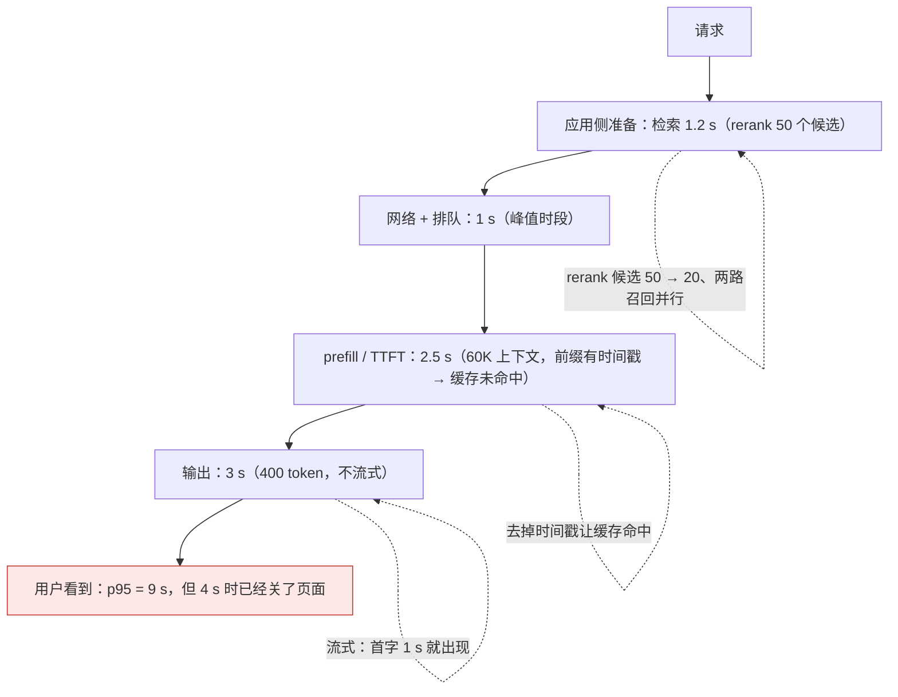

事故先说：一个 RAG 问答的 p95 延迟 9 秒，用户在 4 秒时就关了页面。团队换了更快的模型，p95 降到 7 秒——没解决。分解后发现：检索 1.2 秒（rerank 对 50 个候选逐个打分）、prefill 2.5 秒（每次带 60K 的上下文且缓存不命中——前缀里有时间戳）、排队 1 秒（峰值时段）、输出 3 秒（400 token 的回答且不流式）。四段各有各的药，换模型只碰了一段。

这一篇讲延迟的分解、每一段的手段、感知延迟、p95 预算的分配，以及 agent 多步任务的延迟怎么压。

本篇要回答的核心问题是：

> **延迟怎么分解到每一段，每段的手段是什么？[^q0] 感知延迟与绝对延迟怎么分开优化，p95 预算怎么分？[^q1] agent 的多步延迟怎么压，延迟与成本、质量怎么一起看？[^q2]**

## 一、总览

### 1. 分解




```text
用户发出 ──→ 网关 ──→ 应用侧准备 ──→ 模型：TTFT ──→ 模型：输出 ──→ 后处理 ──→ 用户看到
             ~50 ms    检索 · 上下文    网络 + 排队 + prefill   token 数 × 每 token    解析 · 校验
                       组装 · 工具       （L1 第四篇三段）        时间（流式可见）      渲染
```

| 段 | 决定因素 | 典型量级 | 手段 |
|---|---|---|---|
| 网关 | 多一跳、区域 | 10–100 ms | 边缘 / 就近部署、连接复用 |
| 应用侧准备 | 检索（embedding + 召回 + rerank）、上下文组装、工具预查 | 100 ms–2 s | 并行、预取、rerank 候选数、缓存检索结果 |
| 网络到供应商 | 区域、连接 | 20–200 ms | 区域路由、HTTP/2 复用 |
| 排队 | 供应商侧负载、优先级层级 | 0–几秒（峰值） | 避峰、优先级层级、fallback 区域 |
| prefill | 输入 token 数；缓存命中跳过大部分 | 每 10K token 几百毫秒（未命中） | prompt caching、瘦身、卸载 |
| 输出 | token 数 × 每 token 时间（模型越大越慢） | 20–80 ms / token | 限长、结构化、更小模型、流式 |
| 后处理 | 解析、校验、渲染 | 10–200 ms | 增量解析、边到边渲染 |

### 2. 本文的章节安排

第二章逐段的手段；第三章感知延迟与流式；第四章 p95 预算的分配与四层超时；第五章 agent 的多步延迟；第六章三者一起看；第七章实践建议。

## 二、逐段的手段

### 1. 应用侧准备

**并行**：检索、用户画像加载、工具预查互不依赖的并行发；两路召回并行（L3 第四篇）。**rerank 的候选数**：从 50 降到 20 常省几百毫秒且精度几乎不变。**检索缓存**：同一会话内重复的检索结果缓存。**预取**：多轮对话里在用户打字时就按当前上下文预检索（命中率不高时是浪费——量）。**上下文组装**不该慢——慢通常是同步读多个存储，改并行或预加载。

### 2. 网络与排队

**区域路由**：供应商在多区域有端点时选就近的；网关部署在靠近用户或靠近供应商的位置（第一篇）。**避峰**：非实时任务走 Batch / Flex（L1 第四篇、第二篇）让实时请求少排队；峰值时段的 fallback 到另一区域或供应商（L1 第六篇的方向性）。**优先级层级**：部分供应商有优先处理层级（加价换低排队）——对延迟敏感路径值得。

### 3. prefill

**缓存命中是最大杠杆**：命中时 prefill 跳过前缀，TTFT 从秒级到几百毫秒（L2 第五篇）；事故里的时间戳在前缀让命中率为零。**瘦身**：L2 第二篇的 prompt 瘦身、L2 第四篇的卸载与清理——agent 的每步都带几十 K 时 prefill 是主因。**新版本预热**：上线前用一批请求把新前缀写进缓存（第一轮全写 1.25× 的成本换用户不遇到冷启动）。

### 4. 输出

**限长**：`max_tokens` 与 prompt 里的长度约束；结构化输出比自由文本短（L2 第三篇）；不要让模型"先解释思路"（推理模型的思考已经在内部——L2 第二篇）。**更小的模型**：每 token 时间与模型大小相关，级联让简单请求走快模型（第二篇）。**流式**：不减少总时长，但让用户在第一个 token 就看到东西——第三章。

### 5. 后处理

流式下的**增量解析**（部分 JSON 解析器——L2 第三篇）让结构化输出也能边到边渲染；校验在流结束时做；渲染不要等全部。

## 三、感知延迟与流式

### 1. 感知 ≠ 绝对

用户感受的是"多久有反应"与"多久能开始用"，不是"多久全部结束"。一个 6 秒的流式回答（0.8 秒开始出字）比一个 4 秒的非流式回答感觉更快。所以指标要分两个：**TTFT**（或 UI 上的首次有意义反馈）与**总时长**；前者决定"卡不卡"，后者决定"等多久"。

### 2. 流式的三层

- **token 流**：模型输出逐 token 推到前端（L1 第二篇的流式事件）。
- **步骤流**：agent 的每一步（调了什么工具、拿到什么）推到前端（L4 第三篇的事件流）——用户看到"正在搜索…找到 3 个文件…正在修改…"比等 30 秒看结果好得多。
- **进度与预估**：长任务给进度（完成 3 / 7 步）与预估——L7 讲呈现。

### 3. 流式的成本

服务端要维持连接、前端要处理增量、结构化输出要增量解析、错误可能在流中间发生（L1 第六篇的六个坑）；但对任何面向用户的对话与 agent，流式是默认——不流式的场景只有后台批处理与非交互的 API。

### 4. 骨架与占位

首字前的 0.5–1 秒也要有反馈：骨架屏、"正在思考"的状态、已知信息先渲染（用户的问题回显、检索到的来源先列出来——来源在回答之前就有）。这些是 L7 的内容，但它们是延迟工程的一部分：**把等待变成可见的进展**。

## 四、p95 预算与四层超时

### 1. 分预算

先定用户能接受的总时长（对话 3 秒内开始出字、10 秒内结束；后台任务分钟级），再把 p95 预算分到每段：

| 段 | p95 预算（对话式 RAG 例） |
|---|---|
| 网关 | 50 ms |
| 检索（两路并行 + rerank 20） | 400 ms |
| 网络 + 排队 | 300 ms |
| prefill（缓存命中） | 300 ms |
| **TTFT 合计** | **~1 s** |
| 输出（流式，300 token × 30 ms） | 9 s（用户在 1 s 已开始读） |
| 后处理 | 50 ms |

每段有预算就有告警：某段的 p95 超预算是那一段出了问题（rerank 候选数被改大、缓存命中率掉、供应商排队）。

### 2. 四层超时

L1 第六篇：连接、首字、字间、总时长各设超时，超时后的动作（重试、fallback、降级、部分结果）。超时值从预算来：首字超时 = TTFT 预算的 2–3 倍，字间超时防流卡死，总时长超时 = 用户容忍的上限。

### 3. 延迟的分布

与成本同理（第二篇）：看 p50 / p95 / p99，长尾（缓存未命中、排队、fallback 路径）单独画像；发布的门禁里"延迟不退化"看 p95（L5 第四篇）。

## 五、agent 的多步延迟

### 1. 步数是主因

一个 20 步的 agent 任务：每步 TTFT 1 秒 + 输出 2 秒 + 工具 1 秒 = 80 秒。压延迟的杠杆按大小：

| 杠杆 | 做法 | 效果 | 出处 |
|---|---|---|---|
| **减步数** | PTC 把多步数据处理变一轮；更好的工具描述减少试错；工作流替代不必要的循环 | 最大 | L4 第二篇、第一篇 |
| **并行** | 一步内多个独立工具调用并行；独立子任务交给并行子 agent | 墙钟大降，token 不降 | L4 第四、七篇 |
| **级联** | 简单任务走短路径（一次调用），复杂的才进循环 | 多数任务变快 | L3 第五篇、L1 第五篇 |
| **每步更快** | 缓存命中（agent 的前缀稳定——L2 第五篇）、卸载让每步 prefill 小、effort 按步选 | 每步降 30–70% | L2、L1 第三篇 |
| **后台异步** | 长任务不让用户等，交付可审阅的中间物 | 感知延迟归零 | L4 第八篇 |
| **步骤流** | 每步推事件 | 感知 | 本篇第三章 |

### 2. 工具的延迟

工具是 agent 每步的一部分：慢的工具（编译、大查询、外部 API）要有超时与异步形态（提交后轮询——MCP Tasks 扩展，L4 第二篇）；agent 在等慢工具时可以并行做别的（模型决定，或运行时调度）。

### 3. 压缩的延迟

压缩是一次额外的模型调用（L2 第四篇），在长任务中间出现一次几秒的停顿；在思考链边界做、用小模型做摘要、预留时间——或用会话记忆式的便宜压缩（L4 第四篇）。

## 六、三者一起看

### 1. 取舍

| 手段 | 延迟 | 成本 | 质量 |
|---|---|---|---|
| 更小的模型 | ↓ | ↓ | ↓ |
| 缓存命中 | ↓ | ↓ | — |
| 瘦身 / 卸载 | ↓ | ↓ | 看评测 |
| 流式 | 感知 ↓ | — | — |
| 并行 | ↓ | — | — |
| 优先级层级 | ↓ | ↑ | — |
| effort 降档 | ↓ | ↓ | ↓（关键步不能降） |
| Batch | ↑↑ | ↓ | — |
| 级联 | 多数 ↓ | ↓ | 分流器决定 |

缓存、瘦身、并行、流式是"免费的"（三者不冲突）；模型与 effort 的选择是三者的取舍——在评测集上量质量、在账本上量成本、在 trace 上量延迟，三个数字一起报（L5 第三篇的原则）。

### 2. 面板

TTFT p50 / p95、总时长 p50 / p95、按段的 p95、缓存命中率、排队时间（供应商侧）、fallback 比例、agent 的步数分布——与成本、质量、安全并列（总纲的四指标）。

## 七、实践建议

1. **给主要路径画分解图**：从 trace 里取每段的 p50 / p95，找最大的一段。
2. **先做免费的**：缓存排列（去掉前缀里的动态内容）、rerank 候选数、并行检索、流式、限长。
3. **分 p95 预算到每段**，每段告警；四层超时从预算来。
4. **新版本预热缓存**，避免用户遇到冷启动。
5. **agent 先减步数**（PTC、工具描述、工作流化），再并行，再后台异步；步骤流推前端。
6. **三个数字一起报**：每次改动看延迟、成本、质量的变化。

## 八、本文小结

- 分解七段：网关、应用侧准备（检索、组装）、网络、排队、prefill、输出、后处理；每段有自己的手段，换模型只碰输出段。
- 手段：并行与预取、rerank 候选数、区域路由、避峰与优先级层级、缓存命中（最大杠杆，前缀纪律）、瘦身与卸载、新版本预热、限长与结构化、更小模型、增量解析。
- 感知 ≠ 绝对：TTFT 与总时长分开；流式三层（token、步骤、进度）是面向用户的默认；首字前用骨架与已知信息把等待变成进展。
- p95 预算分到每段并告警；四层超时从预算来；看分布与长尾。
- agent：减步数（PTC、描述、工作流）> 并行 > 级联 > 每步更快（缓存、卸载、effort）> 后台异步；工具要超时与异步形态；压缩在边界用小模型。
- 延迟、成本、质量一起看：缓存、瘦身、并行、流式免费；模型与 effort 是取舍；三个数字一起报。

## 九、自测

1. 事故里的 RAG 问答 p95 9 秒，按分解各段的药是什么？预期能到多少？

   <details markdown="1"><summary>答案</summary>
   检索 1.2 s → rerank 候选 50 降到 20、两路并行：约 0.4 s；prefill 2.5 s → 去掉前缀时间戳让缓存命中、卸载不必要的历史：约 0.3 s；排队 1 s → 避峰或优先级层级 / 区域 fallback：约 0.3 s；输出 3 s → 流式（用户 1 s 开始读）+ 限长 300 token。TTFT 从约 5 s 到约 1 s，总时长仍 5–6 s 但感知从"卡 5 秒"变为"1 秒出字"。详见[第二章](#二逐段的手段)、[第三章](#三感知延迟与流式)。
   </details>

2. 为什么说缓存命中是 prefill 段最大的杠杆？命中率从 0 到 80% 对 TTFT 意味着什么？

   <details markdown="1"><summary>答案</summary>
   命中时供应商跳过前缀的 prefill 计算，60K 上下文的几秒 prefill 变成几百毫秒（只算未缓存的尾部）；80% 的请求 TTFT 降一个量级，p95 大幅下降（剩下 20% 未命中是长尾）。前提是 L2 第五篇的排列纪律与新版本预热。详见[第二章](#二逐段的手段)。
   </details>

3. 一个 25 步的 coding agent 任务要 2 分钟。按第五章的杠杆顺序给出三个最有效的动作。

   <details markdown="1"><summary>答案</summary>
   （1）减步数：看轨迹里的试错（工具描述不清导致的重试、重复搜索），改描述；多步数据处理用 PTC 合并；（2）并行：独立的文件读取与测试运行并行，独立子任务交给并行子 agent；（3）每步更快：前缀稳定让缓存命中、卸载大工具返回让每步 prefill 小、非关键步 effort 降档。加步骤流让用户看到进展，或改为后台异步交付 PR。详见[第五章](#五agent-的多步延迟)。
   </details>

4. 团队把 `max_tokens` 从 1,000 砍到 200 让输出段变快，用户投诉回答被截断。哪里错了？

   <details markdown="1"><summary>答案</summary>
   限长要配合 prompt 里的长度约束（让模型在 200 内说完）与结构化输出（短而完整），而不是硬截断；结构化输出下截断还会让 JSON 坏掉（L2 第三篇）。正确：prompt 约束长度 + 结构化 + `max_tokens` 留余量 + 流式让长回答也早开始出字；`stop_reason` 为长度时要处理。详见[第二章](#二逐段的手段)。
   </details>

5. 优先级层级加价 30% 换排队时间从 1 秒到 0.1 秒。什么路径值得、什么不值得？

   <details markdown="1"><summary>答案</summary>
   值得：面向用户的同步对话首轮、TTFT 预算紧的路径、峰值时段——延迟直接影响留存。不值得：后台任务、agent 的中间步（用户不在等每一步）、Batch 类——它们应反向走低优先级层级省钱。按路径分层选层级，三个数字一起看。详见[第二章](#二逐段的手段)、[第六章](#六三者一起看)。
   </details>

## 下一篇

[安全：注入、供应链与数据泄漏](/security-prompt-injection-supply-chain-and-data-exfiltration.html)

[^q0]: 七段：网关（10–100 ms，边缘 / 就近、连接复用）；应用侧准备（检索 embedding + 召回 + rerank、上下文组装、工具预查，100 ms–2 s：并行、预取、rerank 候选 50 → 20、检索缓存、组装并行加载）；网络（区域路由、HTTP/2 复用）；排队（峰值，避峰走 Batch / Flex、优先级层级、区域 / 供应商 fallback）；prefill（每 10K token 未命中几百毫秒：缓存命中是最大杠杆——前缀纪律、去掉时间戳，瘦身与卸载，新版本预热）；输出（20–80 ms / token：限长配 prompt 约束、结构化、更小模型或级联、流式）；后处理（增量解析、边到边渲染）。换模型只碰输出段。详见[第一章](#一总览)、[第二章](#二逐段的手段)。

[^q1]: 感知是"多久有反应、多久能开始用"，绝对是总时长；指标分 TTFT（卡不卡）与总时长（等多久），6 秒流式 0.8 秒出字比 4 秒非流式感觉快。流式三层：token 流、步骤流（agent 每步推事件）、进度与预估；面向用户的对话与 agent 默认流式，代价是连接、增量解析、流中错误处理；首字前用骨架、状态、已知信息（问题回显、来源先列）把等待变成进展。p95 预算：先定用户容忍的总时长，分到每段（对话式 RAG 例：网关 50 ms、检索 400、网络排队 300、prefill 命中 300 → TTFT 约 1 s；输出流式 300 token 约 9 s 但 1 s 开始读），每段超预算告警定位；四层超时（连接、首字、字间、总）从预算来，首字超时 = TTFT 预算 2–3 倍；看 p50 / p95 / p99 与长尾画像，门禁看 p95。详见[第三章](#三感知延迟与流式)、[第四章](#四p95-预算与四层超时)。

[^q2]: 步数是主因（20 步 × 4 s = 80 s）。杠杆按大小：减步数（PTC 多步变一轮、更好的工具描述减试错、工作流替代不必要循环）> 并行（一步内独立工具并行、独立子任务并行子 agent——墙钟降 token 不降）> 级联（简单任务短路径）> 每步更快（前缀稳定缓存命中、卸载让 prefill 小、effort 按步选）> 后台异步（交付中间物，感知归零）+ 步骤流；慢工具要超时与异步形态（MCP Tasks），压缩在思考链边界用小模型。三者一起看：缓存、瘦身、并行、流式对延迟与成本都好且不伤质量（免费）；更小模型与 effort 降档三者都降；优先级层级延迟降成本升；Batch 延迟升成本降；级联看分流器——每次改动在 trace 量延迟、账本量成本、评测集量质量，三个数字一起报；面板含 TTFT / 总时长 p50 / p95、按段 p95、命中率、排队、fallback 比、步数分布。详见[第五章](#五agent-的多步延迟)、[第六章](#六三者一起看)。
