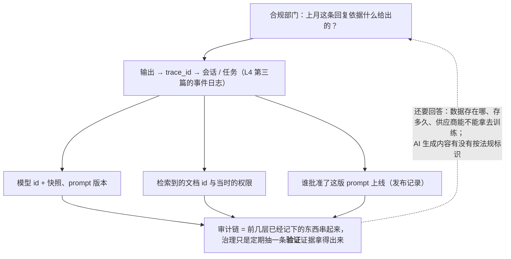

事故先说：合规部门问"上个月这个客户投诉的那条回复，模型是依据什么给出的？用了哪版 prompt？检索到了哪些文档？谁批准了那个 prompt 上线？"——团队拿不出来。另一个：企业客户发现他们的对话数据在供应商侧存了 30 天且条款允许用于改进，而合同里承诺"数据不出境不训练"。第三个：产品里的 AI 生成内容没有标识，2026 年 8 月起这在欧盟是义务，2025 年 9 月起在中国是义务。

这一篇讲治理与合规在工程上要建什么：**审计链**（能回答"谁让模型做了什么、依据什么"）、**数据保留与供应商数据使用**、**EU AI Act 的时间表与应用方义务**（GPAI 2026 年 8 月起可罚；透明与标识同期；高风险被 Digital Omnibus 推迟到 2027 年 12 月与 2028 年 8 月——但推迟的只是高风险）、**中国的内容标识办法**、**供应商变更的治理**、**责任矩阵**。它不是法律意见——具体义务以法律顾问的解读为准；它讲的是工程上哪些东西必须存在，法条才有东西可对照。

本篇要回答的核心问题是：

> **审计链要能回答什么，靠哪些已有机制？[^q0] 数据保留与供应商数据使用怎么定？[^q1] EU AI Act 现在对应用方要求什么、什么被推迟了，内容标识怎么做，责任矩阵长什么样？[^q2]**

## 一、总览

### 1. 治理要回答的问题

| 问题 | 谁问 | 靠什么回答 |
|---|---|---|
| 这条输出是谁在何时让哪个模型（版本）在什么上下文下生成的？ | 合规、客户、法务 | 审计链（会话日志 + trace） |
| 依据是什么（检索到的文档、工具返回、审批）？ | 同上 | 决策点日志、引用 |
| 谁批准了这个 prompt / 工具 / 模型上线？ | 审计 | 版本记录 + 责任矩阵 |
| 用户数据在哪里、存多久、谁能看、供应商拿去做什么？ | 客户、监管 | 保留策略 + 供应商条款 + 数据流图 |
| 用户知道在与 AI 交互吗？生成内容标了吗？ | 监管 | 透明与标识实现 |
| 这个用途属于高风险吗？做了什么评估？ | 监管 | 用途分类 + 评估文档 |
| 供应商换了模型我们知道吗？评估了吗？ | 审计 | 探针 + 变更记录 |

Table: 治理要回答的问题

### 2. 本文的章节安排

第二章审计链；第三章数据保留与供应商；第四章 EU AI Act；第五章中国的内容标识；第六章供应商变更的治理；第七章责任矩阵与流程；第八章实践建议。

## 二、审计链

### 1. 它已经在了——如果前几层做了

L4 第三篇的事件溯源会话日志（"模型可见 ⟺ 已记录"）与 L5 第五、六篇的 trace 与决策点日志，合起来就是审计链：每条输出能追到会话 → 任务 → 模型调用（版本、完整输入、输出）→ 检索到的文档 id → 工具调用与结果 → 审批（谁、何时、依据什么规则）→ prompt / 工具集 / 检索配置的版本。治理层要加的是三件事：**保留期**（审计要求可能比运营需求长——几年）、**不可篡改**（追加写、哈希链或 WORM 存储）、**访问控制与导出**（合规能查、能按用户导出、能证明完整性）。

### 2. 能回答的问题清单

写下来并**验证**（随机抽一条上月的输出，按清单逐项拿出证据）：

- 用户 / 服务身份、时间、会话与任务 id
- 模型 id 与快照、prompt 版本（含全文）、effort、工具集版本、检索配置版本、harness 版本
- 完整输入（含检索到的块及其来源文档与版本）、完整输出
- 工具调用、参数、结果、执行环境（沙箱）
- 审批：请求、`justification`、决定者、时间
- 卫士与 fallback 事件（这次回答是否来自降档模型）
- 用户反馈与后续处理

### 3. 与隐私的张力

审计要保留内容，隐私要最小化与删除——用**分级**解：元数据与决策点长期保留，内容按敏感度分级、脱敏后保留或短期保留，用户删除请求删内容保留脱敏的元数据（证明"处理过"而不保留"处理了什么"）；法律要求保留的例外单独管理。L5 第五篇的分级在这里被合规要求校准。

## 三、数据保留与供应商

### 1. 供应商侧

| 问题 | 要查清的 |
|---|---|
| 存多久 | OpenAI Responses 默认存 30 天（`store: true`）、ZDR 选项让不存；各家的默认与选项不同——L1 第二篇 |
| 用于训练吗 | 消费级产品与 API 的条款不同；企业条款通常默认不训练；**核对合同不是网页** |
| 存在哪 | 数据驻留区域；子处理者列表 |
| 谁能看 | 供应商的访问控制与滥用监控（有些会人工审查被标记的内容） |
| 服务端状态 | 用 `previous_response_id`、服务端压缩（L2 第四篇的加密 item）、file search 的文件、Agents API 的会话——都是存在供应商侧的数据 |
| PTC 与 ZDR | 中间结果不落存储（L4 第二篇）——ZDR 组织可用的原因 |

Table: 供应商侧要查清的数据留存问题

写成一张**数据流图**：哪些数据到了哪个供应商、存多久、什么条款；客户合同里的承诺要与它一致。

### 2. 自己侧

L5 第五篇的分级与保留期，按合规校准：会话内容、trace 内容、评测集里的真实用例（含用户数据——要脱敏或授权）、bad case 队列、飞轮的训练数据（第七篇）；每类有保留期、访问控制、删除流程；备份与副本同样处理。

### 3. 用户权利

查看（我的对话）、导出、删除、退出（不用于改进）——第七篇飞轮要能按用户 / 租户关闭；删除要覆盖主存储、trace、评测集、备份（在保留期内标记）。

## 四、EU AI Act

### 1. 时间表（2026 年 9 月的状态）

| 日期 | 生效的义务 | 状态 |
|---|---|---|
| 2024-08-01 | 法规生效 | — |
| 2025-02-02 | 禁止性实践（Article 5）；AI 素养义务 | 已适用 |
| 2025-08-02 | GPAI（通用模型）提供者义务适用 | 已适用 |
| **2026-08-02** | **GPAI 义务可罚**（AI Office 可处 1,500 万欧元或全球营业额 3%）；**Article 50 透明义务**（告知与 AI 交互、深度伪造标注、AI 生成内容机器可读标记）；法规"一般适用日" | **已生效** |
| 2026-12-02 | 2026-08-02 前已上市的生成系统完成 Article 50 标记的过渡期截止；新增的非自愿私密影像与 CSAM 禁令（Digital Omnibus 写入 Article 5） | 临近 |
| **2027-12-02** | **高风险 Annex III**（招聘与劳动管理、信贷、教育、生物识别、关键基础设施、执法等用途）的全部义务 | **由 2026-08-02 推迟**（Regulation (EU) 2026/1744，2026-07-24 公布、07-27 生效） |
| **2028-08-02** | **高风险 Annex I**（嵌入受 EU 产品安全法规监管的产品：医疗器械、机械、玩具等） | **由 2027-08-02 推迟** |
| 2030-08-02 | 公共机构在用的遗留高风险系统 | — |

Table: AI Act 的时间表

两点解读：**推迟的只是高风险那一部分**，透明、标识、GPAI、禁止性实践都按原日期在跑——"看到延期就停下项目"是 2026 年最常见的误读；**新日期是固定的**（不再与协调标准的完成挂钩），可以据此排计划。

### 2. 应用方（deployer）的义务

多数应用团队是 deployer 不是 provider（模型提供者）。deployer 的义务（概要，以法律解读为准）：

- **透明**（Article 50，已生效）：让用户知道在与 AI 交互（除非显而易见）；AI 生成或操纵的图像 / 音频 / 视频（深度伪造）要标注；AI 生成的文本用于公共利益信息时要标注；机器可读标记的技术实现由 provider 负责但 deployer 要保留。
- **高风险用途**（2027-12 起）：按提供者的说明使用、人工监督（有能力理解、监控、干预、停止——L4 第八篇的六级在这里有法律含义）、记录保存（日志——第二章的审计链）、对受影响的人告知、基本权利影响评估（部分 deployer）、数据输入的相关性与代表性。
- **AI 素养**：使用 AI 系统的员工有足够的理解。
- **禁止性实践**：不做 Article 5 列的事（操纵、社会评分、某些生物识别、新增的私密影像 / CSAM）。

工程上对应：审计链（记录保存）、人工监督的形态（六级、审批、kill switch——第六篇）、用途分类（这个功能是否落入 Annex III——招聘筛选、信贷评估的 AI 功能要按高风险准备）、透明与标识的实现（第五章）。

### 3. 用途分类

对每个 AI 功能问：它是否用于 Annex III 的用途（招聘 / 员工管理、信贷 / 保险定价、教育评估、生物识别、关键基础设施、执法、移民、司法）？是则它是高风险，2027-12 前要完成风险管理、数据治理、技术文档、日志、人工监督、准确性与鲁棒性、注册——现在开始准备不算早。多数客服、代码、内容生成功能不在列，但要有这个分类的记录。

## 五、中国的内容标识

《人工智能生成合成内容标识办法》（网信办等四部门，2025 年 9 月 1 日起施行）与配套的强制性国家标准：

- **显式标识**：在文本、图像、音频、视频、虚拟场景的生成内容上以用户能感知的方式标注（文字提示、角标、语音提示等），位置与形式有要求。
- **隐式标识**：在文件元数据里嵌入生成合成的标记（服务提供者、内容编号等）。
- **义务主体**：生成合成服务的提供者（加标识）、内容传播平台（核验与提示）、用户（不得恶意删除篡改）。
- **与 EU Article 50 的关系**：同一件事的两个法域版本——机器可读标记 + 可感知的告知；工程上一套实现（生成时写元数据 + 呈现时显式提示）覆盖两边，差别在具体格式与位置要求。

## 六、供应商变更的治理

L1 第五篇的弃用周期与 L5 第四篇的探针集，在治理里的位置：**每次供应商变更是一次需要记录与评估的事件**——模型更新（探针检测到的行为变化）、弃用通知、价格变化、条款变化（数据使用、保留）、API 变更。流程：订阅通知 → 登记 → 影响评估（评测、成本、合规）→ 决定（跟进 / 钉旧版 / 迁移）→ 记录。审计能问"你们知道 X 月供应商换了模型吗，评估了吗"——要能拿出记录。

## 七、责任矩阵与流程

### 1. 矩阵

| 事项 | 提出 | 批准 | 执行 | 知会 |
|---|---|---|---|---|
| prompt 变更 | 应用工程师 | 功能 owner（门禁通过为前提） | 工程师 | 产品 |
| 新工具 / MCP server | 工程师 | 安全 + 功能 owner | 工程师 | 平台 |
| 新模型 / 供应商 | 平台 | 技术负责人 + 合规（条款） | 平台 | 全部 |
| 权限策略变更 | 工程师 | 安全 | 平台 | — |
| 高风险用途上线 | 产品 | 法务 + 技术负责人 | 团队 | 合规 |
| 数据保留策略 | 合规 | 法务 | 平台 | 全部 |
| 事故响应（注入 / 越权 / 泄漏） | 值班 | 安全负责人 | 值班 + 安全 | 法务、客户（按要求） |

Table: 变更审批矩阵

### 2. 流程

变更提出 → 分类（是否涉及安全 / 合规 / 高风险）→ 门禁（L5 第四篇）→ 相应批准 → 发布（第六篇）→ 记录（版本、批准人、评测结果）。多数变更（普通 prompt 改动）走轻流程；涉及新权限、新数据流、高风险用途的走重流程。流程写下来是审计的依据，也是让"谁批的"有答案。

## 八、实践建议

1. **验证审计链**：写第二章的问题清单，随机抽上月三条输出逐项拿证据；拿不出的补机制。
2. **画数据流图**：哪些数据到哪个供应商、存多久、什么条款；与客户合同对照；核对合同不是网页。
3. **分级保留**：元数据长、内容按敏感度、删除流程覆盖备份与评测集；用户可查看 / 导出 / 删除 / 退出。
4. **AI Act 对照**：每个功能做用途分类（是否 Annex III）；Article 50 的透明与标识现在做；高风险的按 2027-12 排计划。
5. **内容标识一套实现**：生成时写元数据 + 呈现时显式提示，覆盖 EU 与中国要求，格式按各自规范。
6. **供应商变更登记**：通知订阅 → 登记 → 评估 → 决定 → 记录。
7. **写责任矩阵与轻 / 重流程**。

## 九、本文小结

- 治理要回答七类问题；审计链由会话日志 + trace + 决策点日志构成，治理层加保留期、不可篡改、访问与导出；与隐私的张力用分级解。
- 数据保留：供应商侧查清存多久（Responses 30 天 / ZDR）、是否训练（核对合同）、驻留、服务端状态（`previous_response_id`、压缩 item、file search、Agents API 会话）、PTC 的 ZDR 兼容；自己侧按分级与保留期；用户可查看 / 导出 / 删除 / 退出。
- EU AI Act：禁止性 2025-02、GPAI 2025-08 适用 2026-08 可罚（1,500 万欧元 / 3%）、Article 50 透明与标识 2026-08（过渡到 2026-12）、新禁令 2026-12、高风险 Annex III 2027-12 / Annex I 2028-08（Digital Omnibus 推迟，日期固定）；推迟的只是高风险；deployer 义务——透明、按说明使用、人工监督、记录保存、告知、影响评估、AI 素养；每个功能做用途分类。
- 中国标识办法 2025-09：显式 + 隐式标识，提供者 / 平台 / 用户义务；与 Article 50 一套实现覆盖。
- 供应商变更是需登记评估的事件；责任矩阵与轻 / 重流程是"谁批的"的答案。

## 十、自测

1. 合规问"这条回复依据什么"，团队有 trace 但只存了输入输出的前 500 字与模型名。能回答吗？缺什么？

   

答案

   不能。缺：完整输入（含检索到的块及其来源文档版本）、prompt 版本全文、模型快照、工具调用与结果、审批记录、决策点日志（为什么选这个工具 / 为什么这样回答）。审计链要求完整内容或可重建的引用，且保留期按审计要求（可能几年）、不可篡改。详见[第二章](#二审计链)。
   

2. 合同承诺"客户数据不用于训练、不出境"，团队用 OpenAI Responses 默认配置且开了 file search。有哪些风险点？

   

答案

   Responses 默认 `store: true` 存 30 天（服务端状态）；file search 的文件存在供应商侧；数据驻留区域要核对；是否训练要看**企业条款而不是网页默认**。做法：画数据流图、启用 ZDR（若可用）或 `store: false`、核对驻留区域与子处理者、file search 改自建检索（L3）或确认条款、把这些写进与客户的承诺一致性检查。详见[第三章](#三数据保留与供应商)。
   

3. 2026 年 8 月 Digital Omnibus 推迟了高风险义务，团队据此暂停了全部 AI Act 工作。哪里错了？

   

答案

   推迟的只是高风险（Annex III → 2027-12，Annex I → 2028-08）；GPAI 义务 2026-08-02 起可罚、Article 50 透明与标识 2026-08-02 生效（过渡到 2026-12-02）、新增禁令 2026-12-02、禁止性实践早已适用——这些都在跑。且高风险日期是固定的，用途分类与准备现在就该做。详见[第四章](#四eu-ai-act)。
   

4. 一个产品同时面向欧盟与中国用户，生成图片与文本。内容标识怎么一套实现？

   

答案

   生成时写机器可读的元数据标记（生成合成、提供者、编号——覆盖 EU Article 50 的机器可读要求与中国的隐式标识）；呈现时加用户可感知的显式标识（图片角标 / 文字提示，中国办法有位置与形式要求；EU 对深度伪造与公共利益文本要求标注）；告知用户在与 AI 交互（Article 50）。一套管线两套格式参数，按法域配置。详见[第四章](#四eu-ai-act)、[第五章](#五中国的内容标识)。
   

5. 一个 AI 招聘简历筛选功能，团队认为"只是辅助 HR"不算高风险。评价并给出准备清单。

   

答案

   招聘与劳动管理在 Annex III，"辅助"不改变用途分类（以法律解读为准，但大概率高风险）。2027-12 前要：风险管理体系、数据治理（训练 / 评测数据的代表性与偏差）、技术文档、日志（审计链）、人工监督的形态（HR 能理解、干预、否决——L4 六级的 2–3 级）、准确性与鲁棒性评测（L5）、对候选人的告知、基本权利影响评估、注册。现在做用途分类记录并排计划。详见[第四章](#四eu-ai-act)、[第七章](#七责任矩阵与流程)。
   

## 下一篇

[发布工程：开关、钉版本、runbook 与 SLO](/release-engineering-for-ai-features-switches-pinning-runbooks-and-slos.html)

[^q0]: 审计链要回答：谁（用户 / 服务）在何时让哪个模型（id 与快照）在什么上下文（prompt 版本全文、检索到的块与来源文档版本、工具集与检索配置与 harness 版本、effort）下生成了什么（完整输出）、依据什么（工具调用与结果、审批的请求 / justification / 决定者 / 时间、决策点日志）、是否经 fallback 或卫士、用户反馈与处理。它由 L4 第三篇的事件溯源会话日志（"模型可见 ⟺ 已记录"）与 L5 第五、六篇的 trace 与决策点日志构成；治理层加保留期（可能几年）、不可篡改（追加写、哈希链 / WORM）、访问控制与按用户导出、完整性证明；与隐私的张力用分级解——元数据与决策点长期、内容按敏感度脱敏或短期、删除请求删内容留脱敏元数据。验证方法：写问题清单，随机抽上月输出逐项拿证据。详见[第二章](#二审计链)。

[^q1]: 供应商侧查清并画成数据流图：存多久（OpenAI Responses 默认 `store: true` 30 天、ZDR 选项；各家不同）、是否用于训练（企业条款通常不训练——核对合同不是网页）、驻留区域与子处理者、谁能看（滥用监控可能人工审查）、服务端状态（`previous_response_id`、服务端压缩的加密 item、file search 文件、Agents API 会话都是存在供应商侧的数据）、PTC 让中间结果不落存储所以 ZDR 兼容；客户合同承诺要与数据流图一致。自己侧按 L5 第五篇的分级与保留期并按合规校准：会话内容、trace、评测集里的真实用例（脱敏或授权）、bad case、飞轮训练数据，各有保留期、访问控制、删除流程且覆盖备份与副本。用户权利：查看、导出、删除（覆盖主存储、trace、评测集、备份标记）、退出改进（飞轮按用户 / 租户可关）。详见[第三章](#三数据保留与供应商)。

[^q2]: EU AI Act 时间表（2026-09 状态）：禁止性实践 2025-02-02；GPAI 提供者义务 2025-08-02 适用、2026-08-02 起可罚（1,500 万欧元或 3%）；Article 50 透明与标识 2026-08-02 生效、已上市生成系统过渡到 2026-12-02；新增非自愿私密影像与 CSAM 禁令 2026-12-02；高风险 Annex III 推迟到 2027-12-02、Annex I 到 2028-08-02（Regulation (EU) 2026/1744，2026-07-27 生效，日期固定）——推迟的只是高风险。deployer 义务：透明告知与深度伪造 / 公共利益文本标注、按说明使用、人工监督（能理解监控干预停止）、记录保存、告知受影响者、基本权利影响评估（部分）、AI 素养、不做禁止性实践；每个功能做用途分类（是否 Annex III：招聘、信贷、教育、生物识别、关键基础设施、执法等）。中国《人工智能生成合成内容标识办法》2025-09-01：显式标识（可感知）+ 隐式标识（元数据），提供者 / 平台 / 用户义务；与 Article 50 一套实现（生成时写元数据 + 呈现时显式提示）两套格式。供应商变更是需订阅 → 登记 → 评估 → 决定 → 记录的事件。责任矩阵：prompt 变更（功能 owner 批）、新工具 / MCP（安全 + owner）、新模型 / 供应商（技术负责人 + 合规）、权限策略（安全）、高风险用途（法务 + 技术负责人）、保留策略（法务）、事故响应（安全负责人）；轻 / 重流程按是否涉及安全 / 合规 / 高风险。详见[第四章](#四eu-ai-act)到[第七章](#七责任矩阵与流程)。
