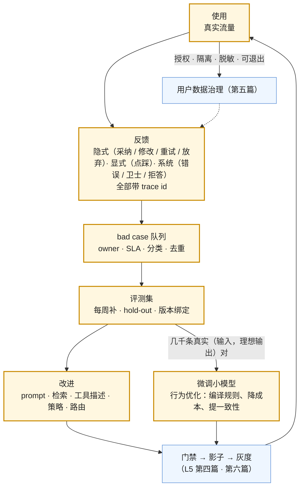

事故先说两个方向的。第一个：一个 AI 功能上线一年，用户量涨了十倍，质量没变——反馈进了一个没人看的表，评测集还是上线时的 50 条，prompt 半年没改，因为"没有证据说该改什么"。飞轮没转。第二个：一次 OTA 把新版本的驾驶软件推给了全部车辆，其中一个场景的回归在仿真里没覆盖到，一夜之间几千辆车同时出现同一种异常——没有分批、没有分区域、没有回滚。

这一篇讲两件事。**数据飞轮**：使用 → 反馈 → bad case → 评测集 → 改进 → 门禁 → 发布 → 使用，数据够了再微调；它常卡在哪、用户数据怎样合规地进飞轮。**物理世界的上线**：影子 → 内部车队 → 有限用户 → 分阶段放量 → 全量，OTA 的分批与回滚、车队级 A/B、接管率、安全案例——与数字世界发布体系的同构与差异。

本篇要回答的核心问题是：

> **飞轮的环是什么、常卡在哪，微调在飞轮里的位置是什么？[^q0] 用户数据怎样合规地进飞轮？[^q1] 物理世界的上线路径与 OTA 怎么做，与数字世界的发布有什么同构与差异？[^q2]**

## 一、总览

### 1. 飞轮



### 2. 物理世界的上线

```text
仿真 + 安全案例（L5 第七篇）
  → 影子模式
  → 内部车队
  → 有限用户 / 区域
  → 分批 OTA 放量（每批看指标再推下一批 · 可回滚 · 车队级 A/B）
  → 全量
```

### 3. 本文的章节安排

第二章飞轮的每个环与卡点；第三章微调在飞轮里的位置；第四章用户数据的合规进入；第五章物理世界的上线路径；第六章 OTA 与车队级运营；第七章同构与差异；第八章实践建议。

## 二、飞轮的环与卡点

| 环 | 做什么 | 常卡在哪 | 出处 |
|---|---|---|---|
| 反馈 | 隐式（采纳、修改后提交、重试、放弃、追问、转人工、引用点击）、显式（点踩、评分）、系统（错误、卫士、拒答、越权） | **没有 trace id**——反馈是一句无法处理的抱怨；产品里没有反馈入口或入口太远 | L5 第四、六篇；L7 |
| bad case 队列 | owner、SLA、分类（十一类）、去重计数、状态 | **没有 owner**——进了表没人看；不分类——不知道该改哪层 | L5 第六篇 |
| 评测集 | 每周从队列补 5–10 条、hold-out、六元组绑定 | **评测集不长**——还是上线时的 50 条；合成集替代真实 | L5 第一篇 |
| 改进 | 按失败类改对应的层：prompt（L2）、检索（L3）、工具描述与策略（L4）、路由与级联（L1、本系列第二篇） | 改错层（幻觉去调 prompt 而根因是检索）；改动不过门禁直接上 | L5 第六篇的分类学 |
| 门禁与发布 | L5 第四篇、本系列第六篇 | 跳过——"小改动不用评" | 第六篇 |
| 使用 | 新版本产生新反馈 | 在线指标没接——不知道改了有没有用 | L5 第四篇 |

转起来的判据：**每周有新用例进评测集、每月有过门禁的发布、失败分类分布随时间变化**（修好的类下降、新类被命名）。三个都没有，飞轮没转。

## 三、微调在飞轮里的位置

### 1. 末端，不是起点

L3 第一篇的顺序：prompt → few-shot → 检索 / 工具 → 微调。飞轮转几个月后积累了几千条**真实的**（输入，理想输出）对——用户采纳的、修改后提交的、人工审核过的——此时微调一个小模型把调到极限的 prompt 与规则"编译"进权重：省 token（几千 token 的系统提示与示例不用每次带）、提一致性（格式与风格的遵循率）、降延迟（小模型快）。它做的是**行为**优化，不是灌知识（L3 第一篇的四个理由）。

### 2. 数据要筛

飞轮里的数据不都能训：bad case 是失败的例子（学进去就学了错）；用户修改后提交的是好例子（修改前是坏、修改后是好——一对偏好数据）；采纳的输出要抽检（采纳不等于正确）；敏感数据要脱敏或排除（第四章）。筛选与标注的成本常被低估——几千条高质量对是几周的工作。

### 3. 微调后的运营

微调模型是新的依赖：钉版本、进评测（与原模型 + prompt 对比）、门禁、灰度、fallback 到原路径（微调模型对分布外输入可能更差）；数据更新后要重训（月度或季度）——它自己也在飞轮里。

## 四、用户数据的合规进入

### 1. 四道门

| 门 | 内容 | 出处 |
|---|---|---|
| 授权 | 服务条款 / 合同是否允许用于改进；企业客户常要求"不用于改进"——**按租户可关**；显式的退出机制 | 第五篇 |
| 隔离 | 租户数据不混训（A 的数据训出的模型不服务 B）；评测集里的真实用例按来源隔离 | 第五篇 |
| 脱敏 | PII 与业务敏感信息在进入队列 / 评测集 / 训练数据前脱敏或合成替换 | L5 第五篇 |
| 保留与删除 | 用户删除请求覆盖评测集与训练数据（或标记不可再用）；保留期 | 第五篇 |

### 2. 按租户的飞轮开关

多租户 SaaS 的常态：部分租户允许改进、部分不允许。实现：反馈与 trace 带租户标签；进队列、评测集、训练数据前按租户的授权过滤；租户能查看自己的数据是否被用于改进；合同变更时能回溯删除。

### 3. 合成替代

授权不足时，用脱敏后的模式（不是原文）生成合成用例（L5 第一篇的变换扩增）——保留失效模式的形态、不保留用户内容。

## 五、物理世界的上线路径

### 1. 为什么不同

L5 第七篇讲了物理世界不能在生产里试——验证在仿真里做。上线同样不能"灰度 1% 看看"：一辆车的失败可能致命、不可回滚、发生在你控制不了的环境里。所以上线是**分阶段、每阶段有准入标准、每阶段可停**的路径：

| 阶段 | 做什么 | 准入 | 看什么 |
|---|---|---|---|
| 仿真 + 安全案例 | 场景库、闭环、覆盖率（L5 第七篇）；结构化论证"为什么这个版本足够安全"并附证据 | 覆盖率与通过率门槛；安全案例评审通过 | 长尾场景通过率、sim-to-real 差距 |
| 影子模式 | 新版本在车上跑但不控制，与现版本 / 人的决策对比 | 仿真通过 | 决策差异率、差异场景的分类、新场景比例 |
| 内部车队 | 员工 / 测试车辆，有安全员 | 影子差异可解释 | 接管率、事件率、安全员报告 |
| 有限用户 / 区域 | 小比例真实用户，限定地理区域与条件（天气、时段、道路类型） | 内部车队指标达标 | 同上 + 用户体验指标 |
| 分批 OTA 放量 | 按批次（几百 → 几千 → 几万辆）、按区域 / 车型推送，每批观察期后推下一批 | 上一批指标达标 | 每批的接管率 / 事件率与上一版本比 |
| 全量 | 全部车队 | 全部批次达标 | 持续监控 |

### 2. 安全案例

物理世界特有的工件：一份结构化的论证——目标（这个版本在这些运行条件下足够安全）→ 论据（仿真覆盖了哪些场景、通过率、封闭场地结果、影子数据、已知限制）→ 证据（数据与报告）。它是发布的"门禁结果"的严格版本，也是监管与事故调查要看的东西。数字 agent 的高风险用途（第五篇的 Annex III）正在往这个方向走——技术文档与风险管理体系就是它的雏形。

## 六、OTA 与车队级运营

### 1. 分批推送

按批次、区域、车型、条件（先推给不常用该功能的车？先推给条件好的区域）；每批有观察期（天到周）；批次间的指标对比（接管率、事件率、性能）；任何批次超阈值**停止推送**——这是物理世界的灰度，只是节奏从小时到周。

### 2. 回滚

车上保留旧版本（A/B 分区），回滚是切回旧分区；但回滚有约束：不能在行驶中切、要考虑与其他模块的兼容、回滚本身也要验证（旧版本与新的地图 / 配置兼容吗）。有些回归回滚比前向修复更危险（第六篇的同一判断）。

### 3. 车队级 A/B

同一区域两个版本分组对比接管率与事件率——真实分布下的比较，与数字世界的 A/B 同构；样本量与时长要求高（事件稀有），一次只变一个因素。

### 4. 监控

**接管 / 干预率**（人接管的频率与场景）、**安全事件**（碰撞、急刹、违规）、**性能**（舒适性、效率）、**新场景比例**（L5 第七篇的覆盖率：真实里遇到的、仿真库没有的）——远程收集、脱敏、进入仿真库与安全案例的更新。这是物理世界的飞轮：真实场景 → 仿真库 → 下一版本。

### 5. 远程禁用

功能级的 kill switch：远程关闭某个功能（如某种场景下的自动变道）而不回滚整个版本——与第六篇的能力级开关同构。

## 七、同构与差异

| 数字世界（本系列第六篇、L5） | 物理世界 | 差异 |
|---|---|---|
| 门禁（评测集 × k） | 仿真 + 安全案例 | 后者是结构化论证与监管工件，通过门槛更严 |
| 影子模式 | 影子模式 | 同构 |
| 灰度 1–5%，小时到天 | 分批 OTA，周到月 | 节奏慢两个量级；每批要停得住 |
| 回滚移标签，秒级 | 切分区，有行驶与兼容约束 | 回滚本身要验证 |
| kill switch | 远程禁用功能 | 同构 |
| A/B 按用户分组 | 车队级 A/B | 事件稀有，样本量与时长大 |
| 在线指标（采纳、重试） | 接管率、事件率、新场景比例 | 指标的代价不同 |
| bad case 队列 → 评测集 | 真实场景 → 仿真库 | 同构（飞轮） |
| runbook | 事故响应 + 监管报告 | 多一层监管 |
| 责任矩阵 | 安全案例评审 + 部署许可（部分地区） | 多一层审批 |

结构相同，代价差几个量级——所以物理世界把每一步做成了工程学科；数字 agent 在不可逆动作（L4 第八篇的六级判据）上正在向它靠近：一个能删生产数据的 agent 的发布，应该更像 OTA 而不像改一句文案。

## 八、实践建议

1. **检查飞轮三判据**：每周新用例、每月过门禁的发布、失败分布在变——哪个没有就修那个环（多半是反馈没 trace id 或队列没 owner）。
2. **微调放末端**：几千条筛过的真实对之后再做，做行为优化；微调模型钉版本、进评测、有 fallback、定期重训。
3. **四道门**：授权（按租户可关）、隔离、脱敏、删除覆盖；租户可查是否被用于改进。
4. **做物理系统的团队**：画分阶段路径与每阶段准入；安全案例作为发布工件；OTA 分批与停止条件；回滚验证；接管率与新场景比例进飞轮。
5. **数字团队借物理世界的两样**：分阶段准入的纪律（高风险 agent 功能）与安全案例式的发布论证（高风险用途的技术文档）。

## 九、本文小结

- 飞轮：使用 → 反馈（带 trace id）→ bad case 队列（owner、分类）→ 评测集（每周补）→ 改对应的层 → 门禁与发布 → 使用；转起来的三判据；常卡在反馈无 trace id、队列无 owner、评测集不长、改错层、跳门禁、在线指标没接。
- 微调在末端做行为优化（省 token、提一致性、降延迟），数据要筛（bad case 不能直接训、修改前后是偏好对、采纳要抽检、敏感要脱敏），微调模型是新依赖（钉版本、评测、fallback、重训）。
- 用户数据四道门：授权（按租户可关、可退出）、隔离、脱敏、删除覆盖；授权不足用脱敏模式生成合成用例。
- 物理世界上线：仿真 + 安全案例 → 影子 → 内部车队 → 有限用户 / 区域 → 分批 OTA → 全量，每阶段有准入与停止；安全案例是结构化论证与监管工件；OTA 分批观察、回滚有行驶与兼容约束、车队级 A/B 样本大、监控接管率 / 事件率 / 新场景比例、远程禁用功能。
- 同构表十行：结构相同代价差量级；高风险 agent 的发布应更像 OTA。

## 十、自测

1. 一个 AI 功能上线一年质量没变，反馈表里有 3,000 条记录没人处理。飞轮卡在哪几个环？先修哪个？

   <details markdown="1"><summary>答案</summary>
   卡在：队列没有 owner 与 SLA（3,000 条没人看）；很可能反馈没有 trace id（有也无法定位）；评测集没长；没有发布。先修队列的 owner 与分类——让 3,000 条按十一类分布（judge 预打类 + 人核），挑出最大的几类各 10 条进评测集，改对应的层，过门禁发布；同时给反馈加 trace id。三判据（周新用例、月发布、分布变化）作为验收。详见[第二章](#二飞轮的环与卡点)。
   </details>

2. 团队想用一年的 bad case 直接微调模型"让它不再犯这些错"。为什么不行？该用什么数据？

   <details markdown="1"><summary>答案</summary>
   bad case 是失败的例子，直接训会学进错误；微调也不是修具体错误的工具（L3 第一篇——它优化行为分布）。该用：用户修改后提交的（修改前坏、修改后好——偏好对）、采纳且抽检正确的输出、人工审核过的理想输出；先把 bad case 用于改 prompt / 检索 / 策略并过门禁，几千条筛过的好例子之后再微调做行为编译。详见[第三章](#三微调在飞轮里的位置)。
   </details>

3. 企业客户合同要求"我们的数据不用于改进产品"。飞轮要怎么改？

   <details markdown="1"><summary>答案</summary>
   按租户的飞轮开关：反馈与 trace 带租户标签，该租户的数据在进入 bad case 队列、评测集、训练数据前被过滤（或只以脱敏后的失效模式形态、不含内容进入——若合同允许）；租户可查看自己的数据是否被用于改进；已进入的数据回溯删除或标记不可再用。其他租户的飞轮不受影响。详见[第四章](#四用户数据的合规进入)。
   </details>

4. 一次 OTA 推给全部车辆后出现回归。按第五、六章，正确的路径本应是什么，哪些机制会在哪一步拦住它？

   <details markdown="1"><summary>答案</summary>
   仿真 + 安全案例（若场景库覆盖了该场景会在这里拦）→ 影子模式（新旧决策差异率会暴露该场景）→ 内部车队（安全员接管率）→ 有限区域 → 分批 OTA（第一批几百辆的事件率超阈值即停止推送，影响范围几百而不是几千）→ 全量。事后：该场景进仿真库（飞轮）、安全案例更新、回滚验证（切旧分区的约束）。详见[第五章](#五物理世界的上线路径)、[第六章](#六ota-与车队级运营)。
   </details>

5. 为什么说"一个能删生产数据的 agent 的发布应该更像 OTA"？具体借哪几样？

   <details markdown="1"><summary>答案</summary>
   不可逆动作让失败的代价接近物理世界（L4 第八篇的六级判据：验证决定自主）。借：分阶段准入（影子 → 内部 → 有限租户 → 分批 → 全量，每阶段有指标门槛与停止条件，而不是 1% 灰度直接全量）、安全案例式的发布论证（为什么这个版本在这些条件下足够安全：评测覆盖、红队通过、权限与沙箱配置、回滚方案——高风险用途的技术文档）、能力级远程禁用、回滚本身要验证。详见[第七章](#七同构与差异)。
   </details>

## 下一篇

[系列总结与通关自测](/production-and-operations-series-recap-and-self-test.html)

[^q0]: 环：使用 → 反馈（隐式采纳 / 修改 / 重试 / 放弃 / 追问 / 转人工 / 点击，显式点踩评分，系统错误 / 卫士 / 拒答 / 越权，全部带 trace id）→ bad case 队列（owner、SLA、十一类分类、去重、状态）→ 评测集（每周补 5–10 条、hold-out、六元组绑定）→ 按失败类改对应的层（prompt / 检索 / 工具描述与策略 / 路由）→ 门禁与影子与灰度 → 使用。卡点：反馈无 trace id、产品无反馈入口、队列无 owner 不分类、评测集不长或合成替代、改错层、跳门禁、在线指标没接。转起来的三判据：每周新用例进评测集、每月过门禁的发布、失败分类分布随时间变化。微调在末端：飞轮转几个月积累几千条真实（输入，理想输出）对后微调小模型做行为编译（省 token、提一致性、降延迟），不是灌知识；数据要筛（bad case 不能直接训、修改前后是偏好对、采纳要抽检、敏感要脱敏）；微调模型是新依赖——钉版本、与原路径对比评测、门禁灰度、fallback、月度或季度重训。详见[第二章](#二飞轮的环与卡点)、[第三章](#三微调在飞轮里的位置)。

[^q1]: 四道门：授权（服务条款 / 合同是否允许用于改进，企业客户常要求不用于改进——按租户可关，显式退出机制）、隔离（租户数据不混训，评测集用例按来源隔离）、脱敏（PII 与业务敏感信息进队列 / 评测集 / 训练数据前脱敏或合成替换）、保留与删除（用户删除请求覆盖评测集与训练数据或标记不可再用，保留期）。按租户的飞轮开关：反馈与 trace 带租户标签，进队列 / 评测集 / 训练前按授权过滤，租户可查是否被用于改进，合同变更可回溯删除。授权不足时用脱敏后的失效模式形态（不含原文）生成合成用例，保留形态不保留内容。详见[第四章](#四用户数据的合规进入)。

[^q2]: 路径：仿真 + 安全案例（场景库、闭环、覆盖率；结构化论证"为什么足够安全"附证据，是监管工件）→ 影子模式（车上跑不控制，决策差异率与差异场景分类）→ 内部车队（有安全员，接管率与事件率）→ 有限用户 / 区域（限地理与条件）→ 分批 OTA 放量（几百 → 几千 → 几万，按区域 / 车型，每批观察期后推下一批，超阈值停止）→ 全量；每阶段有准入与停止。OTA：车上保留旧版本分区回滚，但不能行驶中切、要验证兼容、有时前向修复更安全；车队级 A/B 同区域两版本比接管率与事件率，事件稀有样本大时长长一次一因素；监控接管 / 干预率、安全事件、性能、新场景比例进仿真库（物理世界的飞轮）；远程禁用单个功能。同构：门禁 ↔ 仿真与安全案例、影子 ↔ 影子、灰度 ↔ 分批 OTA、回滚 ↔ 切分区、kill switch ↔ 远程禁用、A/B ↔ 车队 A/B、在线指标 ↔ 接管率、bad case 队列 ↔ 场景库、runbook ↔ 事故响应 + 监管报告、责任矩阵 ↔ 安全案例评审 + 部署许可；差异是节奏慢两个量级、回滚有物理约束、多一层监管与审批、事件稀有；高风险 agent 的发布应更像 OTA——分阶段准入、安全案例式论证、能力级禁用、回滚验证。详见[第五章](#五物理世界的上线路径)到[第七章](#七同构与差异)。
