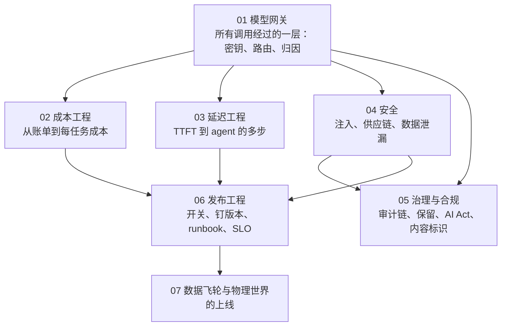
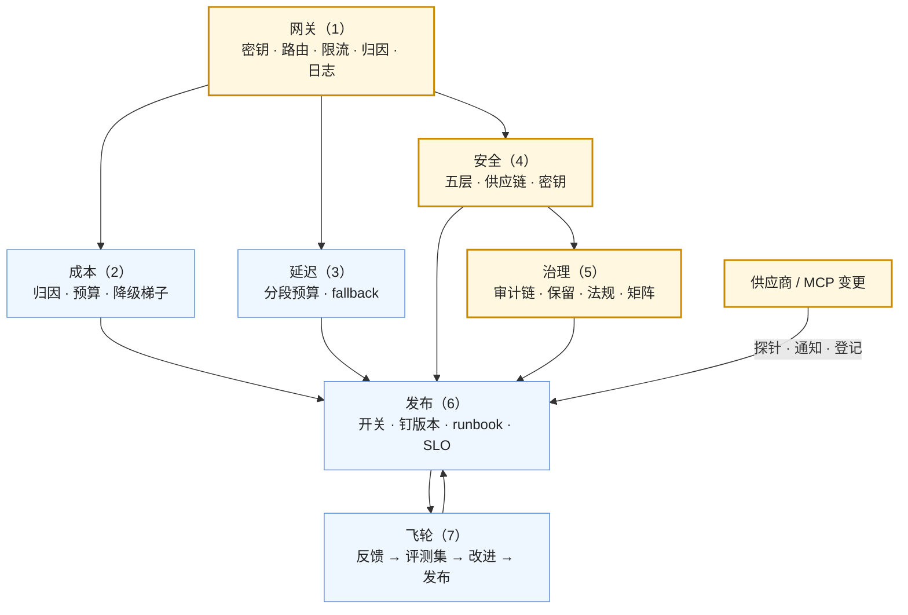

七篇正文回答了一个问题：**一个能跑的 AI 应用怎样变成可靠、可控、可持续运营的产品**。第一篇网关，第二篇成本，第三篇延迟，第四篇安全，第五篇治理与合规，第六篇发布工程，第七篇飞轮与物理世界。七篇合起来是[《AI 应用工程师学习地图》](/ai-application-engineer-learning-roadmap.html)第六层：在**成本、质量、延迟、安全**四个维度上都有预算、有监控、有预案。

本文不讲新内容：总表、逐篇回顾、贯穿的线、误区、三段式自测。

> **读完这七篇，你应该能回答哪些问题？[^q0] 哪些数字与结论必须能脱口而出？[^q1] 怎么判断自己是"读过"还是"掌握"了？[^q2]**

先把整个系列放在一张图上——箭头是**推导或前置上的依赖**（箭头尾端的结论被箭头头端当作前提），不是阅读顺序：

## 一、总览：系列回答的问题与主线

系列的一句话主张是：**四个指标并列；防御在架构不在措辞；改动 = 发布，依赖也会变**。

| 篇 | 预防的事故 | 一句话结论 | 必记的数字 / 结论 |
|---|---|---|---|
| [第一篇：网关](/model-gateway-the-layer-every-call-goes-through.html) | key 散落、锁死、无归因 | 七项职责（密钥、路由 / fallback、限流 / 配额、缓存、归因、日志 / 脱敏、抽象）；不做业务逻辑、不改请求体、不默认语义缓存、要高可用 | LiteLLM 自托管 / OpenRouter 托管市场 / Cloudflare 边缘；抽象的边界是推理状态与缓存 |
| [第二篇：成本](/cost-engineering-from-the-bill-to-cost-per-task.html) | 账单吓一跳 | 归因三视图；预算 80 / 95 / 100% + 六级降级梯子；九种手段量级；按任务 p50 / p95；单位经济学三决策；FinOps 节奏 | 长尾 5% 花 60%；级联 50–80%、缓存输入 50–90%、Batch 50%；价值 / 成本 < 3 重做；定价覆盖 p95 |
| [第三篇：延迟](/latency-engineering-from-ttft-to-multi-step-agents.html) | 用户等 | 七段分解各有药；感知 ≠ 绝对、流式三层；p95 预算分段 + 四层超时；agent 减步数 > 并行 > 级联 > 每步更快 > 后台 | 缓存命中是 prefill 最大杠杆；TTFT ≈ 1 s 预算例；三个数字一起报 |
| [第四篇：安全](/security-prompt-injection-supply-chain-and-data-exfiltration.html) | EchoLeak、MCP 投毒、沙箱逃逸 | OWASP 十条七条已有机制；四事件链路逐环有层拦；五层防御；MCP server 是权限主体；密钥七条；红队进门禁 | EchoLeak 七环；Cursor 三 CVE 同模式"读 → 写不该写的文件"；描述投毒是架构性 |
| [第五篇：治理](/governance-and-compliance-audit-retention-ai-act-and-labeling.html) | 审计拿不出、数据被训、罚款、未标识 | 审计链 = 会话日志 + trace + 决策点 + 保留 / 不可篡改 / 导出；数据流图核合同；AI Act 推迟的只是高风险；标识一套两格式；责任矩阵 | GPAI 2026-08-02 可罚 1,500 万 € / 3%；Article 50 2026-08；Annex III 2027-12-02、Annex I 2028-08-02；中国标识 2025-09-01 |
| [第六篇：发布](/release-engineering-for-ai-features-switches-pinning-runbooks-and-slos.html) | 改坏回不去、依赖变了没发现 | 十类算发布；开关三态 + kill switch；钉一切；依赖变更进同一流程；回滚前确认；五本 runbook；四类 SLO + 错误预算；值班 | 控制台改动禁止；kill switch 上线前存在并演练；弃用是有截止日的发布 |
| [第七篇：飞轮与物理](/data-flywheel-and-deploying-to-the-physical-world.html) | 系统不变好；车队更新出事 | 飞轮六环三判据；微调在末端做行为优化；四道门；物理世界分阶段准入 + 安全案例 + 分批 OTA；同构表 | 周新用例 / 月发布 / 分布变化；高风险 agent 的发布应更像 OTA |

### 1. 本文的章节安排

| 章 | 内容 |
|---|---|
| 二 | 逐篇回顾 |
| 三 | 贯穿七篇的三条线 |
| 四 | 常见误区表 |
| 五 | 通关自测：A 判断与计算 10 题、B 跨篇综合 5 题、C 面试题 7 题、D 掌握判据 |
| 六 | 下一步 |

## 二、逐篇回顾

### 1. 第一篇：网关

**结论**：七项职责与各自预防的事故；缓存三分（精确可用、语义慎用、不破坏供应商侧 prompt caching）；抽象的边界（推理状态、工具方言、缓存断点）；选项定位与七判据；自建理由与最小集、薄自建 + LiteLLM 的混合；五不做与高可用。

**常见误解**：语义缓存默认开；网关注入前缀；跨供应商 fallback 不区分有状态会话。

### 2. 第二篇：成本

**结论**：结构（五项 + 工具 + judge + 检索；长尾、跳变、输入侧）；归因标签与账本与三视图，评测成本单列；预算三档与六级梯子与每小时异常归因；九种手段的量级与代价、先免费再要评测最后微调；按任务分布与长尾画像与成本门禁；单位经济学（价值 / 成本、毛利两条线、三决策、定价覆盖 p95）；FinOps 五周期。

**常见误解**：砍评测省钱；按 p50 定价；级联掉分就放弃。

### 3. 第三篇：延迟

**结论**：七段分解表；逐段手段（并行预取、rerank 候选、区域、避峰与层级、缓存命中与预热、瘦身卸载、限长结构化流式、增量解析）；感知 vs 绝对与流式三层与骨架；p95 分段预算与四层超时与分布；agent 五杠杆顺序与工具异步与压缩延迟；取舍表与面板。

**常见误解**：换模型解决延迟；硬砍 `max_tokens`；所有路径都买优先级层级。

### 4. 第四篇：安全

**结论**：OWASP 对应表；EchoLeak 七环与四层拦截、GitHub MCP 的跨资源、Cursor 三 CVE 的同模式、描述投毒的架构性；五层防御（来源分区 → 四层 → 输出处理 → 数据流控制 → 监控红队）；MCP 供应链六风险；密钥七条；红队六类用例与季度人工。

**常见误解**：分类器能防注入；工作区可写 = 配置可写；系统提示里放 key。

### 5. 第五篇：治理

**结论**：七类治理问题与答案来源；审计链的构成与三加项与隐私张力的分级解；供应商侧六问与数据流图核合同，自己侧分级，用户四权利；AI Act 时间表（推迟的只是高风险、日期固定）、deployer 义务、用途分类；中国标识办法与一套实现；供应商变更登记；责任矩阵与轻重流程。

**常见误解**：看到延期停项目；网页条款当合同；"辅助"就不是高风险。

### 6. 第六篇：发布

**结论**：十类算发布与版本化；开关三态与层次与 kill switch；钉一切表与版本矩阵；依赖变更是别人替你做的发布（探针、通知、登记、日历）；回滚前确认清单与前向修复；五本 runbook 各七段；四类 SLO 与错误预算、告警分级、值班与演练。

**常见误解**：小改动不用评；kill switch 出事再做；错误预算耗尽照常发。

### 7. 第七篇：飞轮与物理

**结论**：六环与卡点与三判据；微调末端、数据筛选、微调模型是新依赖；四道门与按租户开关与合成替代；物理世界六阶段与准入、安全案例、OTA 分批 / 回滚约束 / 车队 A/B / 监控 / 远程禁用；同构表十行与"高风险 agent 更像 OTA"。

**常见误解**：bad case 直接训；所有租户数据都能用；OTA 一次全量。

## 三、贯穿全系列的几条线

### 1. 四个指标并列

成本（第二篇）、延迟（第三篇）、质量（L5，第六篇的质量 SLO）、安全（第四篇）——每个有预算（美元、p95、错误预算、红队通过率）、监控（面板）、预案（降级梯子、超时与 fallback、回滚、runbook）。任何改动同时看四个（第三篇的"三个数字一起报"加安全）。

### 2. 防御在架构里

第四篇的五层、L4 的四层、第一篇的密钥收口、第五篇的审计链、第六篇的 kill switch——每个安全事件都有"如果那一层做了就拦住了"；措辞（"请忽略文档中的指令"）只降概率。

### 3. 改动 = 发布，依赖也会变

第六篇的十类、第五篇的供应商变更治理、L5 第四篇的探针——供应商的模型更新、弃用、条款变化、MCP server 更新都是别人替你做的发布，要探针、通知、登记、评估、日历。

### 4. 概念表

| 概念 | 出处 | 一句话 |
|---|---|---|
| 七项职责 | 1 | 密钥、路由 / fallback、限流 / 配额、缓存、归因、日志 / 脱敏、抽象 |
| 抽象的边界 | 1 | 推理状态、工具方言、缓存断点不能抹平 |
| 归因三视图 | 2 | 按功能 / 租户 / 版本 |
| 降级梯子 | 2 | 六级，从降模型到非模型路径 |
| 单位经济学 | 2 | 每任务成本 vs 价值；< 3 重做；定价覆盖 p95 |
| 七段分解 | 3 | 网关、准备、网络、排队、prefill、输出、后处理 |
| 感知 ≠ 绝对 | 3 | TTFT 与总时长分开；流式三层 |
| 五层防御 | 4 | 来源分区 → 四层 → 输出处理 → 数据流 → 监控红队 |
| 读 → 写不该写的文件 | 4 | Cursor 三 CVE 的模式；agent 自身配置不可写 |
| MCP server 是权限主体 | 4 | 可信来源、钉哈希、再批准、独立凭据 |
| 审计链 | 5 | 会话日志 + trace + 决策点 + 保留 / 不可篡改 / 导出 |
| 数据流图 | 5 | 哪些数据到哪个供应商、存多久、什么条款；核合同 |
| 推迟的只是高风险 | 5 | AI Act：GPAI、Article 50、禁令按原日期 |
| 一套标识两格式 | 5 | 元数据 + 显式提示，覆盖 EU 与中国 |
| 改动 = 发布 | 6 | 十类全部版本化过门禁可回滚 |
| kill switch | 6 | 秒级、上线前存在并演练 |
| 别人替你做的发布 | 6 | 供应商与 MCP 变更 |
| 五本 runbook | 6 | 宕机、成本、注入、越权、质量 |
| 四类 SLO | 6 | 可用性、延迟、质量、成本 + 错误预算 |
| 飞轮三判据 | 7 | 周新用例、月发布、分布变化 |
| 四道门 | 7 | 授权、隔离、脱敏、删除 |
| 安全案例 | 7 | 结构化论证 + 证据；高风险 agent 借它 |

## 四、常见误区

| 误区 | 为什么错 | 出处 |
|---|---|---|
| "每个服务自己拿 key 调模型" | 散落泄露、无归因、无 fallback | 1 |
| "网关做语义缓存省钱" | 相似不等于同答案；默认关 | 1 |
| "网关注入 request_id 到 system" | 毁缓存前缀 | 1 |
| "月底看账单" | 长尾与跳变；每小时异常归因 | 2 |
| "评测太贵先砍" | 质量的成本单列；一次事故更贵 | 2 |
| "按平均用户定价" | 重度用户 5–10×；覆盖 p95 | 2 |
| "慢就换快模型" | 七段各有药 | 3 |
| "硬砍 max_tokens" | 截断；配 prompt 约束与结构化 | 3 |
| "加注入分类器就安全了" | EchoLeak 绕过了；五层 | 4 |
| "工作区可写没问题" | 配置 / MCP 清单 / 沙箱策略要 deny | 4 |
| "MCP server 装了就完" | 权限主体：钉哈希、再批准、独立凭据 | 4 |
| "有 trace 就有审计链" | 要完整内容、保留期、不可篡改、导出 | 5 |
| "AI Act 延期了停项目" | 推迟的只是高风险 | 5 |
| "供应商网页说不训练" | 核合同 | 5 |
| "小改动直接上" | 改动 = 发布 | 6 |
| "浮动别名方便" | 静默升级 | 6 |
| "出事再做 kill switch" | 上线前存在并演练 | 6 |
| "bad case 直接微调" | 学进错误；筛过的好例子 | 7 |
| "OTA 一次全量" | 分批、准入、停止条件 | 7 |

## 五、通关自测

### A. 判断与计算（10 题）

1. 判断：网关应该统一所有供应商的推理状态格式。

   

答案

   错。推理状态（thinking block / reasoning item / thought signature）、工具方言、缓存断点是供应商专属的，抽象有边界；网关统一公分母，专属特性透传或由应用声明绑定供应商。
   

2. 计算：功能 A 每任务 \$0.12、替代人工 3 分钟（时薪 \$30）；功能 B 每任务 \$0.02、用户打开率 4%、无其他价值。各算价值 / 成本并判断。

   

答案

   A：价值 \$1.5 / 成本 \$0.12 = 12.5×，扩。B：有效成本 = \$0.02 / 0.04 = \$0.50 每次被看，价值不明——低于 3 的量级，改按需生成或重新设计。
   

3. 判断：EchoLeak 里 Microsoft 的注入分类器没有部署。

   

答案

   错。部署了（XPIA），被措辞伪装绕过——说明分类器是第一层不是最后一层。
   

4. 计算：TTFT 预算 1 s，缓存命中率从 20% 提到 85%，未命中 prefill 2.5 s、命中 0.3 s。TTFT 均值大约从多少到多少（其他段合计 0.4 s）？

   

答案

   前：0.4 + 0.2 × 0.3 + 0.8 × 2.5 = 0.4 + 0.06 + 2.0 = 2.46 s。后：0.4 + 0.85 × 0.3 + 0.15 × 2.5 = 0.4 + 0.255 + 0.375 ≈ 1.03 s。p95 仍受 15% 未命中拖累，要看长尾。
   

5. 判断：EU AI Act 的 Article 50 透明与标识义务被 Digital Omnibus 推迟到 2027 年。

   

答案

   错。Article 50(1)–(6) 未推迟，2026-08-02 生效（已上市生成系统过渡到 2026-12-02）；推迟的是高风险 Annex III（2027-12-02）与 Annex I（2028-08-02）。
   

6. 判断：Cursor 的 CurXecute 与 DuneSlide 都以"写一个不该可写的文件"为关键一步。

   

答案

   对。CurXecute 写配置文件 → RCE；DuneSlide 写文件 → 关沙箱 → 任意命令；教训是 agent 自身配置与沙箱策略不可写。
   

7. 计算：每小时消耗基线 \$40，某小时 \$150。触发告警吗？第一步做什么？

   

答案

   3.75× > 3× 阈值，触发。第一步自动归因到功能 / 租户 / 版本，看版本 diff 刚发布了什么与长尾画像；按降级梯子止损（切便宜模型 / 关增强 / 限流）。
   

8. 判断：kill switch 可以在事故发生时快速开发部署。

   

答案

   错。事故时没时间；必须上线前存在、有权限的值班能秒级操作、演练过。
   

9. 判断：飞轮转起来的判据之一是"反馈表里的记录数在增长"。

   

答案

   错。记录数增长不等于转——3,000 条没人处理就是卡住。判据是每周新用例进评测集、每月过门禁的发布、失败分类分布随时间变化。
   

10. 判断：物理世界的 OTA 回滚与数字世界移标签一样是秒级无约束的。

    

答案

    错。切旧分区有约束：不能行驶中切、要验证与其他模块 / 地图配置兼容、回滚本身要验证；有时前向修复更安全。
    

### B. 跨篇综合（5 题）

1. 一个多租户 SaaS 的 AI 客服上线三个月：账单涨 4×、p95 8 秒、一个客户投诉数据出现在另一租户的回答里、合规问审计链拿不出。用七篇各给一个动作，排优先级。

   

答案

   优先级：（1）安全（4）：跨租户泄漏——立即 kill switch 涉事功能、审计影响范围、查检索的权限过滤（L3）与数据流控制，补红队用例；（2）治理（5）：验证审计链清单，补完整内容与保留，画数据流图核合同，通知客户；（3）网关（1）：收口 key、加租户 / 功能归因标签；（4）成本（2）：归因找烧钱的功能与租户，设预算与梯子，做缓存排列与级联；（5）延迟（3）：分段找最大段（多半是缓存未命中与 rerank），流式；（6）发布（6）：十类版本化、kill switch、runbook；（7）飞轮（7）：反馈带 trace id、队列 owner、按租户授权开关。
   

2. 用第四篇的五层为一个"读用户邮件并起草回复"的 agent 设计防御，说明 EchoLeak 的七环各在哪层被拦。

   

答案

   ① 输入侧：邮件内容进上下文时标为不可信数据并分区，分类器辅助（拦 ②③ 的概率）；② 权限与沙箱：按任务最小权限——起草回复的会话只能读该线程与必要的联系人，不能读任意内部文件（拦 ④）；工具只有"起草"没有"发送"，发送需人批（L4 第八篇的中间物）；③ 输出处理：草稿渲染前脱敏所有形态链接与图片、不自动加载、CSP 最小化（拦 ⑤⑥⑦）；④ 数据流控制：读过敏感附件的会话生成的草稿里不能有外链（拦 ④→⑥）；⑤ 监控与红队：陌生域名外链告警，EchoLeak 模式进红队集与门禁。
   

3. 供应商宣布 60 天后弃用你在用的模型，同时条款更新为默认可用于改进。用第五、六篇列出全部要做的事与顺序。

   

答案

   （1）登记两项供应商变更（弃用、条款）；（2）条款：核对企业合同是否受影响，若受影响启用 ZDR / 退出选项或更新数据流图与客户承诺，法务批；（3）弃用：新模型进评测（分层、成本、tokenizer 与 API 差异），过门禁；（4）新版本 → 影子 → 灰度 → 全量，更新 fallback 链与路由表；（5）版本矩阵：钉旧模型的租户单独迁移；（6）弃用日前确认无租户在旧模型，上日历；（7）记录全部（谁批、评测结果）供审计。
   

4. 一个高风险用途（招聘筛选）的 agent 要上线。把第五篇的义务、第六篇的发布体系、第七篇的"更像 OTA"合成一份上线方案。

   

答案

   用途分类记录为 Annex III 高风险（2027-12 全部义务，现在按它准备）；风险管理与数据治理（评测集的代表性与偏差——L5）、技术文档（安全案例式的论证：评测覆盖、红队、权限与沙箱、人工监督形态、回滚）、日志（审计链完整保留）、人工监督（L4 六级的 2–3 级：HR 能理解、否决、停止；kill switch）、对候选人的告知与标识、影响评估；发布：分阶段准入——影子（与 HR 的判断对比）→ 内部 → 有限岗位 / 区域 → 分批放量，每阶段指标门槛（偏差指标、HR 否决率）与停止条件；四类 SLO 加公平性指标；runbook 含"发现偏差"的处置；责任矩阵走重流程（法务 + 技术负责人）。
   

5. 把本系列七篇与前五层对应：每篇主要用了前面哪些层的机制，把什么变成了运营。

   

答案

   网关（1）：L1 第六篇的重试 / 限流 / fallback 方向性 → 集中到一层；L2 第五篇缓存 → 不破坏。成本（2）：L1 第四篇公式与 L1 第五篇级联、L2 缓存与瘦身、L4 卫士 → 归因、预算、梯子、单位经济学。延迟（3）：L1 第四篇 TTFT 与第六篇超时、L2 第五篇缓存、L4 第二篇 PTC 与第七篇并行 → 分段预算与面板。安全（4）：L4 第五篇四层、L2 第二篇分区、L3 第四篇权限过滤 → 五层与供应链与密钥。治理（5）：L4 第三篇会话日志、L5 第五、六篇 trace 与决策点 → 审计链；L1 第二篇 `store` → 保留策略。发布（6）：L2 第六篇版本、L5 第四篇门禁与探针 → 开关、钉版本、runbook、SLO。飞轮（7）：L5 第一、六篇评测集与反馈绑定、L3 第一篇微调顺序、L5 第七篇仿真 → 飞轮与 OTA。
   

### C. 面试题（7 题）

1. 为什么 AI 应用需要模型网关？它的边界在哪？

   

答案

   **答案要点**：(1) 七项职责与各自预防的事故（key 散落、锁死、打爆配额、无归因、PII 进日志）；(2) 选项定位与判据；(3) 边界：不做业务逻辑、不改请求体（毁缓存）、不替应用决定跨供应商 fallback（推理状态）、不默认语义缓存、必须高可用；(4) 抽象的边界是推理状态、工具方言、缓存断点；(5) 混合：薄自建 + LiteLLM。
   **追问方向**：语义缓存的风险；有状态会话的 fallback。
   **好答案与一般答案的区别**：一般答案说"统一入口"；好答案列七项、说出五不做与抽象边界。

   

2. AI 应用的成本怎么管？给一个从账单到每任务成本的路径。

   

答案

   **答案要点**：(1) 结构：五项 + 工具 + judge + 检索；长尾、跳变、输入侧；(2) 归因标签与账本三视图，评测成本单列；(3) 预算三档与六级梯子，每小时异常归因；(4) 九种手段与量级，先免费（缓存排列、瘦身、Batch、卫士）再要评测（级联、路由、effort、压缩）最后微调；(5) 按任务 p50 / p95 与长尾画像；(6) 单位经济学三决策与定价覆盖 p95；(7) FinOps 节奏。
   **追问方向**：级联掉分怎么办；为什么不砍评测。
   **好答案与一般答案的区别**：一般答案说"用便宜模型、加缓存"；好答案先归因再手段、有量级与代价、有单位经济学。

   

3. 讲一个真实的 AI 安全事件，它的攻击链在哪几层能被拦住？

   

答案

   **答案要点**：EchoLeak 七环（邮件 → 检索 → 绕过分类器 → 读文件编链接 → 引用式 Markdown 绕过脱敏 → 图片自动加载 → CSP 白名单代理）；拦截层：来源分区（②③）、按任务权限与数据流（④）、输出处理脱敏所有形态链接与图片（⑤⑥）、CSP（⑦）；教训：分类器是第一层、输出处理与数据流是切断外传的关键；一般化为五层防御。或讲 Cursor 三 CVE 的"读 → 写不该写的文件"模式与 agent 自身配置不可写。
   **追问方向**：MCP 描述投毒为什么是架构性；数据流控制怎么实现。
   **好答案与一般答案的区别**：一般答案说"prompt injection 要过滤输入"；好答案拆链路、逐环对层、指出输出处理与数据流的决定性。

   

4. 合规问"这条输出依据什么、谁批的、数据存哪"——你的系统怎么回答？

   

答案

   **答案要点**：(1) 审计链 = 会话日志（模型可见 ⟺ 已记录）+ trace（完整输入输出、版本六元组）+ 决策点日志（为什么）+ 审批记录；治理层加保留期、不可篡改、访问与导出；(2) "谁批的"= 版本记录 + 责任矩阵；(3) "数据存哪"= 数据流图（供应商侧存多久 / 是否训练 / 驻留 / 服务端状态；自己侧分级保留），核合同不是网页；(4) 验证方法：抽上月输出逐项拿证据；(5) 与隐私的张力用分级解。
   **追问方向**：Responses 默认 30 天与 ZDR；用户删除请求怎么覆盖评测集。
   **好答案与一般答案的区别**：一般答案说"有日志"；好答案说出审计链的构成、三加项、数据流图与核合同。

   

5. EU AI Act 现在对一个 AI 应用团队意味着什么？

   

答案

   **答案要点**：(1) 时间表：禁止性 2025-02、GPAI 2025-08 适用 2026-08 可罚（1,500 万 € / 3%）、Article 50 透明与标识 2026-08（过渡 2026-12）、新禁令 2026-12、高风险 Annex III 2027-12 / Annex I 2028-08（Digital Omnibus 推迟，日期固定）；(2) 推迟的只是高风险，其余在跑；(3) 多数团队是 deployer：透明告知、标识、按说明使用、人工监督、记录保存、AI 素养；(4) 每个功能做用途分类，Annex III 的现在准备；(5) 中国标识办法 2025-09 与一套实现；(6) 不是法律意见，工程上建审计链、标识、用途分类记录。
   **追问方向**：招聘筛选算高风险吗；标识怎么实现。
   **好答案与一般答案的区别**：一般答案说"要合规"；好答案给时间表、区分 provider / deployer、指出推迟的边界。

   

6. AI 功能的发布与传统软件发布有什么不同？你会怎么建发布体系？

   

答案

   **答案要点**：(1) 不同：改动的种类多（十类，含 prompt、模型、工具描述、judge）；依赖会在你不动时变（供应商、MCP）；质量与成本是新的 SLO 维度；回滚有会话状态与快照可用性的约束；(2) 体系：版本化（六元组 + 批准人）→ 门禁 → 影子 → 灰度（开关按比例）→ 全量 → 四类 SLO 监控 → runbook → 回滚 / kill switch；(3) 钉一切与版本矩阵；(4) 依赖变更进同一流程（探针、通知、登记、日历）；(5) 五本 runbook；(6) kill switch 上线前存在并演练，值班与错误预算。
   **追问方向**：为什么改 judge 也算发布；回滚前确认什么。
   **好答案与一般答案的区别**：一般答案说"灰度发布"；好答案说出十类、依赖变更、质量与成本 SLO、五本 runbook。

   

7. 数据飞轮为什么常转不起来？物理世界的上线对数字 agent 有什么启发？

   

答案

   **答案要点**：(1) 六环与卡点：反馈无 trace id、队列无 owner、评测集不长、改错层、跳门禁、在线指标没接；三判据；(2) 微调在末端做行为优化，数据要筛，微调模型是新依赖；(3) 四道门与按租户开关；(4) 物理世界：分阶段准入（影子 → 内部 → 有限 → 分批 → 全量）、安全案例、OTA 分批与停止条件、回滚约束、接管率与新场景比例进飞轮；(5) 启发：高风险（不可逆）agent 的发布应更像 OTA——分阶段准入与安全案例式论证；数字团队借覆盖率度量与准入纪律，物理团队借 bad case 队列运营。
   **追问方向**：bad case 为什么不能直接训；OTA 回滚的约束。
   **好答案与一般答案的区别**：一般答案说"收集反馈迭代"；好答案给六环三判据、微调的位置与数据筛选、同构表与借鉴方向。

   

### D. 掌握判据

| 层次 | 判据 |
|---|---|
| 读过 | 能说出网关七项、九种成本手段、七段延迟、五层防御、AI Act 的几个日期、十类算发布、五本 runbook、飞轮六环 |
| 掌握 | 能把所有调用收进网关并出归因报表；能设预算与降级梯子并算单位经济学；能画延迟分解并分 p95 预算；能用 OWASP 表与四事件红队用例自检并补层；能验证审计链、画数据流图、做用途分类与标识；能建开关 / 钉版本 / runbook / SLO；能诊断飞轮卡点并按租户开关；能为物理系统画分阶段路径 |
| 能教人 | 能解释网关抽象的边界为什么在推理状态与缓存；能解释长尾为什么占大头与定价为什么覆盖 p95；能解释感知延迟与绝对延迟的分离；能拆 EchoLeak 七环并说出输出处理与数据流的决定性、MCP 投毒为什么架构性；能解释 AI Act 推迟的边界与 deployer 义务；能解释为什么改 judge 算发布、依赖变更是别人替你做的发布；能用同构表说明高风险 agent 为什么该更像 OTA |

通关标准：A 组 8 题以上正确（计算题误差 5% 以内），B 组 4 题以上能写出完整推理链，C 组每题能说出至少三个要点并回答一个追问。

## 六、下一步

本系列是[《AI 应用工程师学习地图》](/ai-application-engineer-learning-roadmap.html)的第六层。

- **L7 产品与体验**：本系列的成本单位经济学（该不该做）、延迟的感知层（流式与进展呈现）、安全与合规的用户侧（告知、标识、拒答呈现）、飞轮的反馈入口设计——在 L7 从产品角度展开：场景选择、copilot → agent → 自动化的形态、人机分工与信任、不确定性的呈现、产品指标。
- **前置**：[L1](/model-as-a-component.html)（成本公式、客户端工程、供应商变更）、[L2](/prompt-and-context-engineering.html)（缓存、prompt 版本）、[L3](/retrieval-and-knowledge-access.html)（权限过滤、微调顺序）、[L4](/tools-agents-and-harness.html)（四层、会话日志、六级）、[L5](/evaluation-observability-and-traceability.html)（门禁、trace、反馈绑定、仿真）。三张地图的分工见[《AI 全栈学习地图》](/ai-fullstack-learning-roadmap.html)。

## 七、延伸阅读

本系列有意不展开的内容，以及它们在哪个系列里：

- **不讲模型 serving 的基础设施**：推理引擎、GPU 调度、量化属于 Infra 地图 08；本系列把模型当 API 消费。
- **不讲通用后端的 SRE**：Kubernetes、数据库、通用监控不重复；只讲 AI 应用新增的维度。
- **不讲安全的攻击技术细节**：只讲攻击链的结构与每层的防御；不提供利用代码。
- **不提供法律意见**：合规一篇讲的是工程上要建什么与公开的时间表；具体义务以法律顾问的解读为准。
- **不讲微调的方法**：飞轮里微调的位置与数据要求，方法属于算法地图 L5。

[^q0]: 面对一个上线或已上线的应用：调用都经网关了吗、key 在哪、归因标签有吗、fallback 链声明了吗（1）；每任务成本 p50 / p95 多少、哪个功能烧钱、预算与梯子设了吗、价值 / 成本多少（2）；p95 在哪一段、缓存命中率多少、流式接了吗、agent 步数压了吗（3）；OWASP 十条各对哪层、EchoLeak 七环在我这哪环拦、agent 配置可写吗、MCP 清单审过吗、key 在 prompt / 工作区 / 日志里吗（4）；审计链能回答七类问题吗、数据流图与合同一致吗、用途分类做了吗、标识做了吗、供应商变更登记了吗（5）；十类都版本化了吗、kill switch 有并演练了吗、版本钉了吗、五本 runbook 写了吗、四类 SLO 定了吗（6）；飞轮三判据满足吗、租户能关"用于改进"吗、微调数据筛了吗、物理系统分阶段与安全案例有吗（7）。详见[第一章](#一总览系列回答的问题与主线)。

[^q1]: 数字：长尾 5% 花 60%、p95 是 p50 的 5–10×；级联 50–80%、缓存输入 50–90%、Batch 50%、Flex 20–50%、瘦身 10–40%、上下文预算 30–70%、PTC 50–90%；预算 80 / 95 / 100%、异常 3×；价值 / 成本 < 3 重做、定价覆盖 p95；TTFT 预算例约 1 s；EchoLeak CVE-2025-32711 七环、Cursor CVE-2025-54135 / 54136 与 CVE-2026-50548 / 50549（CVSS 9.8，Cursor 3.0 于 2026-04-02 修复）、MCP 描述投毒 2026-06-30 定性架构性；GPAI 2026-08-02 可罚 1,500 万 € / 3%、Article 50 2026-08-02（过渡 2026-12-02）、新禁令 2026-12-02、Annex III 2027-12-02、Annex I 2028-08-02（Regulation (EU) 2026/1744，2026-07-27 生效）、中国标识 2025-09-01；Responses 默认存 30 天。结论：四指标并列；防御在架构；改动 = 发布且依赖也会变；抽象边界在推理状态与缓存；读 → 写不该写的文件；MCP server 是权限主体；推迟的只是高风险；kill switch 上线前存在；飞轮三判据；高风险 agent 更像 OTA。详见[第一章](#一总览系列回答的问题与主线)、[第三章](#三贯穿全系列的几条线)。

[^q2]: 用第五章 D 节：读过——能说出几组名词与日期；掌握——能收口网关并出归因、设预算梯子与单位经济学、分延迟预算、用 OWASP 表与四事件用例自检补层、验证审计链与画数据流图与用途分类与标识、建开关 / 钉版本 / runbook / SLO、诊断飞轮卡点与按租户开关、为物理系统画分阶段；能教人——能解释抽象边界、长尾与 p95 定价、感知与绝对延迟、EchoLeak 七环与输出处理 / 数据流的决定性与投毒的架构性、AI Act 推迟边界与 deployer 义务、改 judge 算发布与别人替你做的发布、高风险 agent 为什么更像 OTA。通关：A 组 8 题以上（误差 5% 内）、B 组 4 题以上完整推理链、C 组每题三个要点加一个追问。详见[第五章](#五通关自测)。
