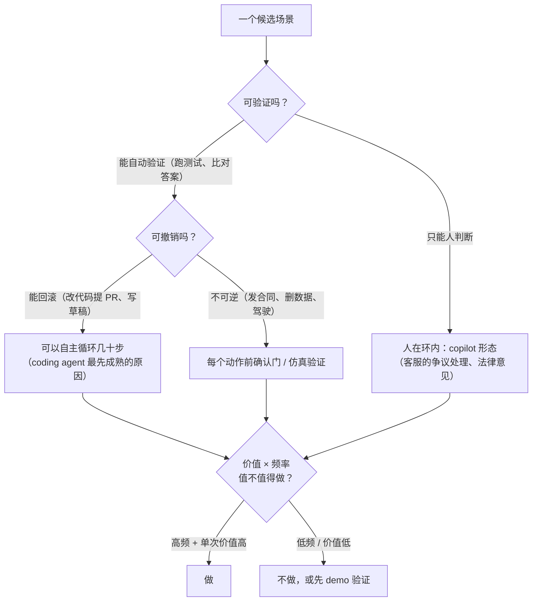

先讲三个回撤。**Klarna** 2024 年初宣布 AI 客服第一个月处理 230 万次对话、解决三分之二的工单、处理时间从 11 分钟降到 2 分钟、相当于 700 名员工、预计年增利 4,000 万美元，客服团队从 5,000 人减到 3,500 人；2025 年 CEO 承认裁得太狠、失去了有价值的人的经验，AI 在复杂、模糊、情绪化的问题上处理不了，"要对客户说清楚：你想要的话永远有人"；到 2026 年变成混合模式——AI 第一响应、人处理例外与挽留。**IBM** 用 AskHR 替代大部分 HR 职能后不得不再招人——它做得了常规问答与请假审批，做不了需要判断的。**Duolingo** 2025 年 4 月宣布 AI-first、逐步停用 AI 能做的合同工，一周后 CEO 改口"AI 不是替代员工，我们照常招人"。Gartner 2026 年预测：被 AI 裁掉的岗位三成会在 2029 年前补回，成本更高。

这三个故事不是"AI 不行"，是同一个错误：**用边界内的数字外推到边界外**。"700 人"来自简单查询；客服里 20–30% 的任务是例外（争议、欺诈、政策例外、情绪化客户），外推之后成本从例外处漏回来。这一篇讲怎么找边界、怎么判断一个场景该不该做、demo 与产品之间隔着什么。

本篇要回答的核心问题是：

> **判断场景的四个维度是什么，锯齿状边界是什么？[^q0] 回撤的案例共同错在哪，成功的案例为什么成立？[^q1] demo 与产品之间的鸿沟有哪五个来源，怎么做决策？[^q2]**

## 一、总览

### 1. 四个维度

| 维度 | 问什么 | 好的信号 | 坏的信号 |
|---|---|---|---|
| 价值 | 每任务节省多少时间 / 带来多少收益（L6 第二篇的单位经济学） | 高频 × 每次几分钟，或低频 × 每次几小时 | 用户本来就不做这件事（"AI 摘要"没人看） |
| 可验证性 | 用户或系统能不能快速判断输出对不对 | 代码（编译、测试）、格式化任务、有明确答案的查询 | 需要专家才能判（法律意见、医疗建议）、用户不懂目标语言的翻译 |
| 错误容忍度 | 错一次的代价 | 可撤销、可编辑、低风险（草稿、建议） | 不可逆、对外、高风险（退款、发送、删除、诊断） |
| 频率 | 用户多久做一次 | 每天多次（补全、分类、回复） | 每季度一次（学习成本抵消收益） |

Table: 选场景的四个维度

四个维度同时好的场景很少；决策是看**可验证性与错误容忍度**决定人在哪（第二篇），**价值与频率**决定值不值（第五篇）。

### 2. 本文的章节安排

第二章锯齿状边界；第三章回撤案例的共同错误；第四章成功案例为什么成立；第五章 demo–产品鸿沟的五个来源；第六章决策方法；第七章实践建议。

## 二、锯齿状边界

### 1. 实验

哈佛商学院与 BCG 对 758 名顾问的现场实验：在 AI 擅长的任务上（边界内），用 AI 的顾问快 25%、质量高 40%；在略微超出边界的任务上，用 AI 的顾问**出错率高 19 个百分点**——比不用 AI 的更差。研究者把这叫"锯齿状边界"（jagged frontier）：AI 的能力不是一条平滑的线，同一个工作流里相邻的两个任务可能一个在边界内、一个在边界外，且从外面看不出来。

### 2. 含义

- **边界按任务划，不按领域划**。"客服"不是一个任务，是几十个：查订单状态（边界内）、解释政策（边界内）、处理争议（边界外）、安抚愤怒客户（边界外）、识别欺诈（边界外）。Klarna 的数字来自前两类，裁员按全部算。
- **边界外用 AI 比不用更差**。不是"AI 帮不上"，是 AI 的自信输出让人放弃了自己的判断（第三篇的自动化偏见）——这是 +19 个百分点的来源。
- **边界会动**。模型升级把一些任务拉进边界（L1 第五篇的评测集要定期重跑），也可能把一些推出去（供应商变更）。
- **边界要量**。判断一个任务在不在边界内的方法是 L5 的评测集：几十条真实用例、跑 k 次、看分布与分层——不是看 demo。

### 3. 找边界的方法

把场景拆到任务粒度 → 每个任务采几十条真实用例 → 跑当前最好的模型 + 合理的 prompt / 检索 → 按 L5 第三篇的指标评 → 边界内（质量达标且稳定）、边界上（多数对、有可识别的失败模式——人机分工的位置）、边界外（不稳定或错得难以发现）。这是 L1 第五篇"用自己的评测集选型"在产品层的用法：选的不是模型，是任务。

## 三、回撤案例的共同错误

### 1. 外推

| 案例 | 边界内的数字 | 外推到 | 漏回来的成本 |
|---|---|---|---|
| Klarna | 简单查询上"700 人的工作"、11 → 2 分钟 | 全部客服，裁 1,500 人 | 20–30% 的例外任务处理不了：客户重复来电、争议升级、满意度下降、再招人（远程合同工） |
| IBM AskHR | 常规问答、文档、请假审批 | 大部分 HR 职能，裁约 8,000 | 需要判断的 HR 工作没人做，再招人 |
| Duolingo | 翻译与内容生成的一部分 | "AI-first、停用 AI 能做的合同工" | 用户与员工的信任反弹，一周后改口 |

Table: 外推失败的案例

三个案例的数字在各自的边界内可能都是真的。错误是**把"AI 在这类任务上等于 N 个人"读成"AI 等于 N 个人"**。

### 2. 为什么容易犯

demo 与早期数据天然来自边界内（先做容易的）；管理层拿到的是一个总数（"700"）而不是按任务的分布；裁员的决定不可逆而边界的判断可逆——两者的时间尺度不匹配。Gartner 说的"AI 洗白"（把本来要做的裁员归因于 AI）加剧了它。

### 3. 正确的形态

Klarna 最终到的地方——**AI 第一响应、人处理例外与挽留、客户永远能找到人**——就是按边界分工：边界内的任务 AI 做，边界上的人机协作，边界外的人做。它本可以是起点而不是终点。L4 第八篇的六级人机分工是这个形态的工程版本。

## 四、成功案例为什么成立

### 1. GitHub Copilot

从 2021 年的补全到 2026 年的 coding agent，是最持久的 AI 产品成功。四个维度全部好：**可验证**（代码能编译、有测试、能跑——L4 第八篇"验证决定自主"）、**错误可撤销**（git，改错了 revert；建议不接受就没了）、**高频**（每分钟都在写代码）、**价值可累积**（每次省几秒 × 一天几百次）。人在编辑器里就在边界上：接受、修改、拒绝——第三篇的"接受率三成、多数被再编辑"是这个形态的正常状态。

### 2. 其他成立的形态

- **草稿类**（邮件、回复、文案的初稿）：可编辑、可验证（用户懂内容）、错误容忍高（改就行）——但价值取决于用户本来花多久写。
- **分类与抽取**（工单分类、表单抽取）：可验证（抽样核对）、高频、错误可在下游被发现——L2 第三篇的结构化输出。
- **检索增强问答**（内部知识库）：可验证（有引用）、错误容忍中（引用让用户能核对）——L3。
- **代码审查与测试生成**：可验证（测试跑不跑）、可撤销。

共同点：**输出能被快速核对或撤销**。这是四个维度里最重要的两个。

### 3. 不成立或要小心的

- 用户无法核对的判断（不懂的语言的翻译、专业领域的意见给非专业用户）——除非有专家在环。
- 不可逆的对外动作（发送、付款、删除）无人在环——L4 第八篇第六级的前提不满足。
- 低频高学习成本的功能——用户学不会。
- 情绪化、高风险的人际交互（愤怒的客户、医疗、法律）——边界外且代价高。

## 五、demo–产品鸿沟的五个来源

| 来源 | demo | 产品 | 对应的层 |
|---|---|---|---|
| **分布** | 精选的输入、干净的数据 | 真实流量的长尾：错字、省略、多语言、边缘情形 | L5 第一篇（评测集从流量采） |
| **长尾** | 80% 的情形几小时就能做到 | 剩下 20% 是产品的全部工作，且决定用户的信任 | L5 第六篇（bad case 队列） |
| **集成** | 一个对话框 | 进用户的工作流、权限、数据源、身份、审计 | L3 权限、L4 运行时、L6 治理 |
| **信任** | 演示者知道该问什么 | 用户不知道 AI 不擅长什么，会问边界外的问题 | 第三篇 |
| **成本** | 不算钱 | 每任务成本 vs 价值，长尾任务占大头 | L6 第二篇 |

Table: demo 到产品鸿沟的五个来源

"80% 的 demo 是 20% 的产品"：demo 到产品的距离不是"再打磨一下"，是前六层的全部。一个能在两天内做出来的 demo，变成产品要几个月——这不是效率问题，是鸿沟的结构。

## 六、决策方法

### 1. 拆到任务

场景 → 任务列表（一个客服场景拆出二十个任务）；每个任务按四维度打分；用评测集量边界（第二章第 3 节）。

### 2. 三分

- **边界内**（质量达标且稳定、可验证或可撤销）：做，形态按第二篇；
- **边界上**（多数对、失败模式可识别）：做人机协作——AI 做、人在识别出的失败模式处核对（第三篇）；
- **边界外**（不稳定、错得难发现、代价高）：不做，或只做辅助（给人提供材料而不是给结论）。

### 3. 找正在被外推的数字

对已有的 AI 功能问：我们引用的那个成功数字来自哪些任务？我们把它用到了哪些任务上？中间的差是多少？——Klarna 的问题在这里能提前发现。

### 4. 决策的可逆性

边界的判断会随模型移动，所以**产品决策要可逆**：先做边界内的、保留人的能力（Klarna 失去的是"有价值的人的经验"，回不来）、随评测集的变化扩边界。不可逆的组织决定（裁员）不要建在可变的边界判断上。

## 七、实践建议

1. **拆任务、打四维度分**：把你的场景拆到任务粒度，每个任务四维度打分，标出可验证与可撤销的。
2. **量边界**：每个任务几十条真实用例 + 评测（L5），分边界内 / 上 / 外。
3. **审外推**：列出你引用的成功数字与它来自的任务，对照它被用到的范围。
4. **先做边界内 + 可核对可撤销的**，边界上的做人机协作，边界外的只做辅助。
5. **决策可逆**：保留人的能力，随评测集扩边界；不把不可逆的组织决定建在边界判断上。
6. **算鸿沟**：对每个 demo 列五个来源各要多久，再定计划。

## 八、本文小结

- 四个维度：价值、可验证性、错误容忍度、频率；可验证与可撤销决定人在哪，价值与频率决定值不值。
- 锯齿状边界（哈佛 / BCG，758 名顾问）：边界内 +25% 速度 / +40% 质量，边界外错误率 +19 pp——用 AI 比不用更差；边界按任务划、会动、要用评测集量。
- 回撤的共同错误是外推：Klarna 把简单查询上的"700 人"用到全部客服（20–30% 例外漏回成本，裁 1,500 再招），IBM AskHR、Duolingo 同理；正确形态是 AI 第一响应、人处理例外、客户永远能找到人——它本可以是起点。
- 成立的案例（Copilot、草稿、分类抽取、RAG 问答、代码审查）共同点是输出能被快速核对或撤销；不成立的是用户无法核对的判断、无人在环的不可逆动作、低频高学习成本、高风险人际交互。
- 鸿沟五来源：分布、长尾、集成、信任、成本——demo 到产品是前六层的全部。
- 决策：拆任务 → 四维度 → 量边界 → 三分 → 审外推 → 可逆。

## 九、自测

1. 一个团队的 AI 客服 demo 在 50 个精选问题上正确率 96%，据此计划把一线客服减半。用本文指出至少三个问题。

   

答案

   （1）分布：50 个精选问题不是真实流量，长尾（错字、多轮、例外）没覆盖；（2）外推：96% 来自哪些任务？争议、欺诈、情绪化客户在不在里面？客服的 20–30% 是例外；（3）不可逆决定建在可变判断上：减半不可逆，边界判断应先用真实用例的评测集量、按任务三分、保留人的能力、随评测扩边界；（4）鸿沟：demo 到产品还有集成、信任、成本三个来源。详见[第三章](#三回撤案例的共同错误)、[第五章](#五demo产品鸿沟的五个来源)、[第六章](#六决策方法)。
   

2. 哈佛 / BCG 实验里"边界外用 AI 的人出错率反而高 19 个百分点"——为什么不是"AI 帮不上"而是"更差"？这对产品设计意味着什么？

   

答案

   AI 在边界外仍给出自信、流畅的输出，人放弃了自己的判断（自动化偏见），把错误当真——比自己做更差。意味着边界外的任务不能"顺手也让 AI 试试"：要么不做，要么只给人提供材料不给结论、并明确标注不确定（第三、四篇）；找边界不是可选项，是防止产品把用户变笨的前提。详见[第二章](#二锯齿状边界)。
   

3. 为什么 GitHub Copilot 能从补全走到 agent 而客服 AI 走了回撤？用四个维度比较。

   

答案

   Copilot：可验证（编译、测试）、可撤销（git、不接受即无）、高频、价值累积——四维度全好，人在编辑器里就在边界上。客服：查询类可验证可撤销，但争议、欺诈、情绪化任务不可验证（要人判断）、错误代价高（客户流失、合规）、且被外推到全部；正确形态是按任务分工而不是整体替代。差别不在领域而在任务的可验证性与错误容忍度。详见[第一章](#一总览)、[第四章](#四成功案例为什么成立)。
   

4. 一个"AI 法律意见"功能面向普通消费者。按四维度与第四章，评价并给出替代形态。

   

答案

   可验证性差（消费者判不了对错——L1 第一篇的虚构判例事件）、错误容忍度低（法律后果）、边界外用 AI 更差（用户会信）。不该做成"给结论"的形态。替代：给材料不给结论（找到相关条款与判例并附原文引用让用户或律师核对）、明确标注非法律意见与不确定、或专家在环（律师审阅后发出——AI 做草稿）。详见[第四章](#四成功案例为什么成立)、[第六章](#六决策方法)。
   

5. 一个两天做出来的 RAG demo，团队估计两周能上线。按五个来源各列一项会花时间的事。

   

答案

   分布：从真实查询建评测集并发现词汇不匹配与多轮问题（L3 第五篇的改写）；长尾：解析失败的文档、权限边界、拒答处理（L3 第三、四篇）；集成：接入用户身份与文档权限、进现有工作流、审计（L3 权限、L6 治理）；信任：引用可点开、拒答呈现、onboarding（第三、四篇）；成本：每任务成本归因与 rerank / 缓存优化（L6 第二篇）。两周不够，几个月是常态。详见[第五章](#五demo产品鸿沟的五个来源)。
   

## 下一篇

[形态：copilot、agent 与自动化——后台 agent 为什么成了主流](/product-forms-copilot-agent-automation-and-the-rise-of-background-agents.html)

[^q0]: 四维度：价值（每任务节省的时间或收益，高频 × 几分钟或低频 × 几小时；用户本来不做的事价值为零）、可验证性（用户或系统能否快速判断对错：代码、格式化、有明确答案的查询 vs 需专家判断的意见、不懂目标语言的翻译）、错误容忍度（错一次的代价：可撤销可编辑的草稿 vs 不可逆对外的退款、发送、删除、诊断）、频率（每天多次 vs 每季一次，学习成本抵消收益）；可验证与可撤销决定人在哪，价值与频率决定值不值。锯齿状边界来自哈佛 / BCG 对 758 名顾问的实验：边界内用 AI 快 25%、质量高 40%，略出边界出错率高 19 pp——比不用更差，因为自信输出让人放弃判断；边界按任务不按领域划（客服是几十个任务）、相邻任务可能一内一外、会随模型移动、要用评测集量（几十条真实用例、k 次、分层）而不是看 demo。详见[第一章](#一总览)、[第二章](#二锯齿状边界)。

[^q1]: 共同错误是把边界内的数字外推到全部：Klarna 的"700 人 / 11 → 2 分钟"来自简单查询，裁 1,500 人后 20–30% 的例外任务（争议、欺诈、政策例外、情绪化客户）处理不了，客户重复来电、满意度下降、再招远程合同工，CEO 承认失去了人的经验、"客户想要的话永远有人"，2026 年成混合模式；IBM AskHR 做常规问答与审批但做不了需判断的 HR 工作，裁约 8,000 后再招；Duolingo "AI-first 停用合同工"一周后改口。易犯的原因：早期数据天然来自边界内、管理层拿到总数而非按任务分布、裁员不可逆而边界判断可逆、"AI 洗白"。成功案例（Copilot 从补全到 agent 十年、草稿类、分类抽取、RAG 问答、代码审查）的共同点是输出能被快速核对或撤销，加高频与价值累积，人在工作流里就在边界上；不成立的是用户无法核对的判断、无人在环的不可逆动作、低频高学习成本、高风险人际交互。详见[第三章](#三回撤案例的共同错误)、[第四章](#四成功案例为什么成立)。

[^q2]: 五来源：分布（demo 用精选输入，产品面对长尾——评测集从流量采）、长尾（80% 几小时能做，剩下 20% 是产品的全部工作且决定信任——bad case 队列）、集成（对话框 vs 进工作流、权限、数据源、身份、审计——L3 / L4 / L6）、信任（演示者知道该问什么，用户会问边界外的——第三篇）、成本（demo 不算钱，产品要每任务成本 vs 价值、长尾占大头——L6 第二篇）；"80% 的 demo 是 20% 的产品"，距离是前六层的全部。决策：场景拆到任务粒度 → 四维度打分 → 用评测集量边界 → 三分（边界内做、边界上人机协作——AI 做人在可识别的失败模式处核对、边界外不做或只给材料不给结论）→ 审外推（引用的成功数字来自哪些任务、用到了哪些任务）→ 决策可逆（保留人的能力、随评测集扩边界、不把不可逆的组织决定建在可变的边界判断上）。详见[第五章](#五demo产品鸿沟的五个来源)、[第六章](#六决策方法)。
