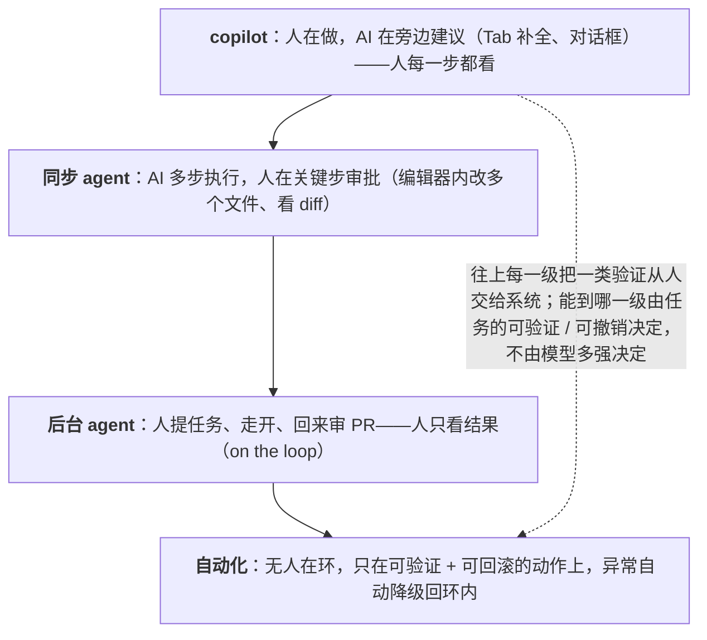

同一个能力可以做成不同的形态：一个代码模型可以是 Tab 补全（人写、AI 提示下一行）、对话框（人问、AI 答、人复制粘贴）、编辑器内的 agent（AI 改多个文件、人看 diff 接受）、后台 agent（人提任务、走开、回来审 PR）。2021 年只有第一种，2026 年四种并存，且 coding 领域的重心已经移到最后一种。形态决定了**人在哪一步看结果**——这是第一篇"组件会出错"前提下最重要的产品决策。

这一篇讲 copilot → agent → 自动化的梯子与它和 L4 第八篇六级人机分工的对应，2024–2026 年形态演进的四步与后台 agent 成为主流的四个原因，按任务选形态的决策表，以及同一产品里多形态并存。

本篇要回答的核心问题是：

> **copilot、agent、自动化三种形态各是什么，与六级人机分工怎么对应？[^q0] 形态怎么演进的，后台 agent 为什么成了主流？[^q1] 按任务怎么选形态，多形态怎么并存？[^q2]**

## 一、总览

### 1. 梯子

| 形态 | 谁主导 | 人在哪 | 人看什么 | 错误的代价 | L4 六级 |
|---|---|---|---|---|---|
| **copilot** | 人主导、AI 建议 | 每一步 | 每条建议（接受 / 修改 / 拒绝） | 一条建议 | 1–2 级 |
| **agent（同步）** | AI 执行多步、人监督 | 关键步（审批）+ 结果 | diff、步骤流、审批请求 | 一次任务 | 3–4 级 |
| **agent（后台）** | AI 独立跑完、人审阅交付物 | 结果 | PR / 草稿 / 提案 | 一次任务（可拒绝） | 5 级 |
| **自动化** | AI 执行并生效、人看面板 | 环外，有退路 | 指标、抽检、告警 | 一批任务 | 6 级 |

Table: 产品形态的梯子

往上每一级把一类验证从人交给系统（L4 第八篇的判据）；能到哪一级取决于任务的可验证性与可撤销性（第一篇的两个维度），不取决于模型多强。

### 2. 本文的章节安排

第二章三种形态各自的设计要点；第三章 2021–2026 的演进；第四章后台 agent 为什么成了主流；第五章决策表；第六章多形态并存；第七章实践建议。

## 二、三种形态

### 1. copilot

人在做事，AI 在旁边给建议：补全、内联改写、对话里的答案让人复制、草稿让人编辑。设计要点：**建议要便宜地拒绝**（不接受就消失，不打断）、**建议的粒度匹配任务**（一行 / 一段 / 一个函数——太大难核对、太小没价值）、**不抢焦点**（用户在写代码，AI 不该弹窗）、**接受后可撤销**。它的边界：每条建议都要人看，所以省的是"想与打字"的时间，不是"看"的时间；任务多步时人要自己串起来。第三篇的采纳率三成、多数被再编辑，是 copilot 的正常状态。

### 2. agent（同步）

AI 接一个任务、执行多步（读、改、跑、修）、人在关键步审批、结束看结果。设计要点：**步骤流可见**（用户看到它在做什么——第四篇）、**审批有理由与影响范围**（L4 第五篇）、**结果以 diff 呈现**（人能部分接受）、**能中断与纠正**（L4 第三篇的中断在步骤边界）、**任务边界清楚**（agent 知道做到哪算完）。它的边界：人要在场等（同步），所以任务要在几分钟内；步数多了审批疲劳（L4 第五篇的策略化授权）。

### 3. agent（后台）

人提任务、走开、AI 独立跑完、交付一个可审阅的中间物（PR、草稿、报告、提案）、人回来审阅、接受 / 修改 / 拒绝。设计要点：**交付物是天然的审阅落点**（PR 有 diff、评论、CI；草稿有编辑器；提案有审批流）、**任务描述要够（agent 不能中途问太多人——问了人不在）**、**进度与完成通知**、**多任务并行的面板**（用户同时开几个）、**失败要清楚交付**（部分结果 + 阻塞原因——L4 第九篇）、**成本可见**（一个任务花了多少）。它的边界：任务要能独立完成或能在缺信息时合理假设并说明；交付物要能被审阅（一个 5,000 行的 PR 没人审）。

### 4. 自动化

AI 执行并直接生效，人看面板、抽检、处理告警。设计要点：**只在可自动验证 + 可回滚的任务上**（L4 第八篇第六级的前提）、**面板与告警**（L4 第九篇、L6 第六篇的 SLO）、**自动降级回环内**的退路、**审计链**（L6 第五篇）。它的边界：不可逆、不能自动验证的任务永远不到这一级——"直接发给客户的报告"不是自动化的候选（L4 第八篇自测 3）。

## 三、演进：2021–2026

| 阶段 | 形态 | 代表 | 让它成立的东西 |
|---|---|---|---|
| 2021–2023 | 补全（copilot） | GitHub Copilot | 代码模型能续写；建议可便宜拒绝 |
| 2023–2024 | 对话（copilot） | ChatGPT 形态进各种产品 | 指令遵循的模型；对话框是最低成本的集成 |
| 2024–2025 | 编辑器内 agent（同步） | Cursor Composer、Claude Code、Codex CLI、Windsurf | 工具调用协议成熟（L1 第二篇）、模型能跑几十步、diff 审阅 |
| 2025–2026 | **后台 agent** | Codex cloud、Claude Code on the web、Cursor 后台 agent、Devin、Agents API 的"跑几天的 agent" | 运行时（L4 第三篇：持久化、挂起、沙箱）、上下文管理（L2 第四篇）、PR 作为交付物、成本可接受 |

Table: 产品形态的演进：2021–2026

每一步的推动力是**模型能力 + 一个 harness 机制**：补全需要续写；对话需要指令遵循；同步 agent 需要工具调用与 diff；后台 agent 需要运行时与上下文管理。形态的演进是 L1–L4 的能力在产品侧的投影。

## 四、后台 agent 为什么成了主流

### 1. 异步交付把等待变成并行

同步 agent 的用户在看着它跑——30 步 2 分钟，用户 2 分钟什么都不能做；后台 agent 的用户提了任务就去做别的，回来审——L6 第三篇的"感知延迟归零"。用户可以同时开五个任务，吞吐是同步的五倍。

### 2. PR 是天然的审阅落点

L4 第八篇讲的"可审阅的中间物"：PR 有 diff、有评论、有 CI 状态、有合并按钮——软件行业花了十五年把它做成了人审阅代码变更的最佳界面，后台 agent 直接用。草稿（邮件、文档）、提案（业务动作）是其他领域的对应物。没有这个落点的任务（"直接改生产配置"）做不成后台 agent。

### 3. 模型与 harness 到了能独立跑的水平

2025–2026 年的模型能在 SWE-bench Verified 上七成以上、能跑几十步不迷失（L2 第四篇的压缩与复述）、运行时能持久化与恢复（L4 第三篇）、沙箱能隔离（L4 第五篇）——独立跑完一个任务从"偶尔"变成"多数"。

### 4. 成本随价值可接受

一个后台 coding 任务几美元，替代的是几十分钟到几小时的工程师时间（L6 第二篇的单位经济学 17 倍例）。同步 agent 也一样贵，但后台让用户愿意把更大的任务交出去——价值更高。

### 5. 不只是 coding

任何有天然审阅落点的任务都在往后台走：写报告（草稿）、做研究（带引用的综述）、处理工单（回复草稿 + 建议的动作）、业务操作（本体的提案——L4 第八篇、L3 第六篇）。Klarna 的混合模式（AI 第一响应、人处理例外）是客服版本的"AI 交付草稿、人审阅例外"。

## 五、决策表

| 任务特征 | 形态 | 理由 |
|---|---|---|
| 粒度小、高频、用户正在做 | copilot（补全、内联） | 每条建议便宜地看一眼，不打断流 |
| 需要来回澄清、探索性 | copilot（对话） | 人要参与思考 |
| 多步、有明确验收、几分钟内、人在场 | agent 同步 | 人看步骤与 diff，关键步审批 |
| 多步、有明确验收、有审阅落点、可等 | **agent 后台** | 异步、并行、PR / 草稿审阅 |
| 可自动验证 + 可回滚 + 错误代价低 + 高量 | 自动化 | 人看面板 |
| 边界外（第一篇） | copilot 给材料不给结论，或不做 | 不能让 AI 主导 |
| 不可逆对外动作 | 到后台 agent 为止（交付提案，人批准才生效） | 六级的前提 |

Table: 按任务特征选形态的决策表

一个判据串起来：**任务能被什么验证、错了能不能撤、有没有审阅落点、用户能不能等**。

## 六、多形态并存

### 1. 同一产品四种形态

Cursor：Tab 补全（copilot）、对话（copilot）、Composer / Agent（同步 agent）、后台 agent——用户按任务切换。Claude Code：终端同步 agent、web 后台 agent、subagent 与 agent teams（L4 第四篇）。客服：AI 直接答简单的（自动化，边界内）、AI 草拟人发（copilot / 后台）、复杂的直接转人（不做）。

### 2. 切换点

产品设计的核心决策是**在哪里从一种形态切到另一种**：补全到对话（用户开始问问题）、对话到 agent（用户说"帮我改"）、同步到后台（任务超过几分钟或用户说"去做吧"）、agent 到自动化（评测集与在线指标证明某类任务稳定——L4 第八篇的升级信号）。切换要让用户可控、可见（"这个任务我在后台跑，完成通知你"）。

### 3. 渐进的自主性

新用户先 copilot、建立信任后开 agent、稳定后开自动化——个人层面的六级爬梯（第三篇）。产品要支持这条路径：默认保守、按用户与任务类型逐步放开、每一级有退回的路。

## 七、实践建议

1. **对每个任务选形态**：用第五章的判据（验证、撤销、落点、可等），标出人看结果的位置。
2. **找该变成后台 agent 的任务**：多步、有验收、有 PR / 草稿 / 提案落点、用户不需要在场——它们可能还在同步或对话形态里。
3. **给后台 agent 配齐**：交付物形态、进度与通知、多任务面板、部分结果格式、成本可见。
4. **定切换点**：从一种形态到另一种的触发（用户动作或任务特征），让用户可控可见。
5. **默认保守、渐进放开**：新用户与新任务类型从 copilot 起，按评测与在线指标升级。
6. **不可逆动作止于提案**：后台 agent 交付提案，人批准才生效。

## 八、本文小结

- 梯子：copilot（人主导、每步看、1–2 级）→ 同步 agent（AI 多步、关键步审批 + 看 diff、3–4 级）→ 后台 agent（独立跑完、交付 PR / 草稿 / 提案、5 级）→ 自动化（生效、看面板、有退路、6 级）；能到哪级取决于可验证与可撤销。
- 演进四步（补全 → 对话 → 编辑器内 agent → 后台 agent），每步是模型能力 + 一个 harness 机制。
- 后台 agent 成主流的四个原因：异步把等待变并行、PR 是天然审阅落点、模型与 harness 到了能独立跑的水平、成本随价值可接受；不只 coding——有审阅落点的任务都在往后台走。
- 决策表按验证、撤销、落点、可等；边界外只给材料；不可逆止于提案。
- 多形态并存（Cursor 四种、客服三种），切换点是核心决策，渐进放开。

## 九、自测

1. 一个"AI 写周报"功能做成了对话框：用户描述、AI 生成、用户复制到文档。按本文该是什么形态？为什么？

   

答案

   后台 agent 或至少草稿式 copilot：周报有天然的审阅落点（文档草稿）、任务多步（拉数据、汇总、成文）、用户不需要在场、可等。做法：定时或一键触发，agent 拉本周的 PR / 工单 / 会议记录，生成草稿直接进文档编辑器，通知用户审阅编辑——对话框加复制粘贴是 2023 年的形态，多了来回与集成的摩擦。详见[第四章](#四后台-agent-为什么成了主流)、[第五章](#五决策表)。
   

2. 为什么"PR 是天然的审阅落点"对后台 agent 这么重要？没有类似落点的任务怎么办？

   

答案

   后台 agent 的人在环上（5 级）需要一个地方审阅——PR 有 diff、评论、CI、合并按钮，人能部分接受、能拒绝、能讨论，且不接受就不生效（可撤销）。没有落点的任务（直接改生产配置、直接发邮件）要么造一个（配置变更做成提案 / 审批流，邮件做成草稿箱），要么停在同步 agent（人在场审批）——不能跳到无人审阅的生效。详见[第四章](#四后台-agent-为什么成了主流)、[第二章](#二三种形态)。
   

3. 一个团队想把工单自动回复做成"自动化"（AI 直接回复客户）。用六级的前提判断哪些工单可以、哪些不可以。

   

答案

   可以：查询类（订单状态、政策条款）——答案可自动验证（从系统查）、错误可撤销（追加更正）、代价低、高量、且评测集证明稳定；仍要拒答出口与升级到人。不可以：争议、退款、投诉、情绪化——不可自动验证、错误代价高（Klarna 的例外任务）——做成 AI 草拟人发（copilot / 后台）或直接转人。按任务三分而不是整体自动化。详见[第二章](#二三种形态)、[第五章](#五决策表)。
   

4. 同步 agent 与后台 agent 的成本相近，为什么后台 agent 让用户愿意交出更大的任务？

   

答案

   同步下用户要在场等，任务越大等得越久，用户倾向于只交小任务；后台下等待变并行（用户去做别的、同时开多个），大任务的时间成本对用户归零，只剩审阅成本——PR 式审阅几分钟。价值随任务大小涨（几小时的工程师时间），成本几美元，单位经济学更好。详见[第四章](#四后台-agent-为什么成了主流)。
   

5. 设计"从同步 agent 切到后台 agent"的切换点。什么信号触发？用户怎么知道？

   

答案

   触发：任务预估超过几分钟（步数 / 涉及文件数）、用户显式说"去做吧 / 完成通知我"、用户切走窗口、任务有明确验收且不需要中途问人。用户可见：明确提示"这个任务我在后台跑，预计 N 分钟，完成后通知你并给出 PR"，面板里能看进度与中断，交付物到位后通知；缺信息时 agent 合理假设并在交付物里说明而不是中途等人。详见[第六章](#六多形态并存)。
   

## 下一篇

[人机分工与信任校准](/human-ai-division-of-labor-and-trust-calibration.html)

[^q0]: copilot：人主导、AI 建议（补全、内联改写、对话答案、草稿），人每一步看每条建议接受 / 修改 / 拒绝，错误代价是一条建议，对应六级的 1–2 级；设计要点是建议便宜地拒绝、粒度匹配、不抢焦点、可撤销；省的是想与打字不是看。同步 agent：AI 执行多步、人在关键步审批并看结果（步骤流、diff、审批请求），错误代价一次任务，3–4 级；要点是步骤可见、审批有理由与影响、diff 呈现、可中断、任务边界清楚；人要在场所以几分钟内。后台 agent：人提任务走开，AI 独立跑完交付可审阅的中间物（PR / 草稿 / 提案），人回来审阅接受 / 修改 / 拒绝，5 级；要点是交付物是审阅落点、任务描述够、进度与通知、多任务面板、部分结果、成本可见。自动化：执行并生效，人看面板抽检告警，有自动降级退路，6 级；只在可自动验证 + 可回滚 + 错误代价低的任务上。能到哪级取决于可验证与可撤销，不取决于模型多强。详见[第一章](#一总览)、[第二章](#二三种形态)。

[^q1]: 演进：2021–2023 补全（Copilot；续写能力、便宜拒绝）→ 2023–2024 对话（ChatGPT 形态；指令遵循、最低成本集成）→ 2024–2025 编辑器内同步 agent（Cursor Composer、Claude Code、Codex CLI；工具调用协议、几十步、diff 审阅）→ 2025–2026 后台 agent（Codex cloud、Claude Code on the web、Cursor 后台 agent、Devin、Agents API；运行时持久化与挂起与沙箱、上下文管理、PR 交付、成本可接受）——每步是模型能力 + 一个 harness 机制。后台成主流的四原因：异步交付把等待变并行（用户同时开多个，感知延迟归零）；PR / 草稿 / 提案是天然的审阅落点（十五年打磨的人审代码变更的界面，人在环上有地方站，不接受不生效）；模型与 harness 到了能独立跑几十步的水平（SWE-bench 七成、压缩与复述、持久化、沙箱）；成本几美元对几十分钟到几小时的价值可接受且后台让用户愿交更大任务。不只 coding——报告、研究、工单、业务提案都在往后台走，Klarna 的混合模式是客服版本。详见[第三章](#三演进20212026)、[第四章](#四后台-agent-为什么成了主流)。

[^q2]: 决策判据四个：任务能被什么验证、错了能不能撤、有没有审阅落点、用户能不能等。粒度小高频用户正在做 → copilot 补全 / 内联；需来回澄清探索性 → copilot 对话；多步有验收几分钟内人在场 → 同步 agent；多步有验收有落点可等 → 后台 agent；可自动验证 + 可回滚 + 代价低 + 高量 → 自动化；边界外 → 只给材料不给结论或不做；不可逆对外动作 → 止于后台 agent 交付提案，人批准才生效。并存：Cursor 的 Tab / 对话 / Composer / 后台四种，Claude Code 的终端 / web / subagent，客服的直接答 / 草拟人发 / 转人；切换点是核心设计——补全到对话（用户开始问）、对话到 agent（"帮我改"）、同步到后台（超几分钟或"去做吧"或用户切走）、agent 到自动化（评测与在线指标证明稳定），切换要用户可控可见（"后台跑，完成通知，给 PR"）；渐进自主性——新用户与新任务类型从 copilot 起，按用户与类型逐步放开，每级有退回。详见[第五章](#五决策表)、[第六章](#六多形态并存)。
