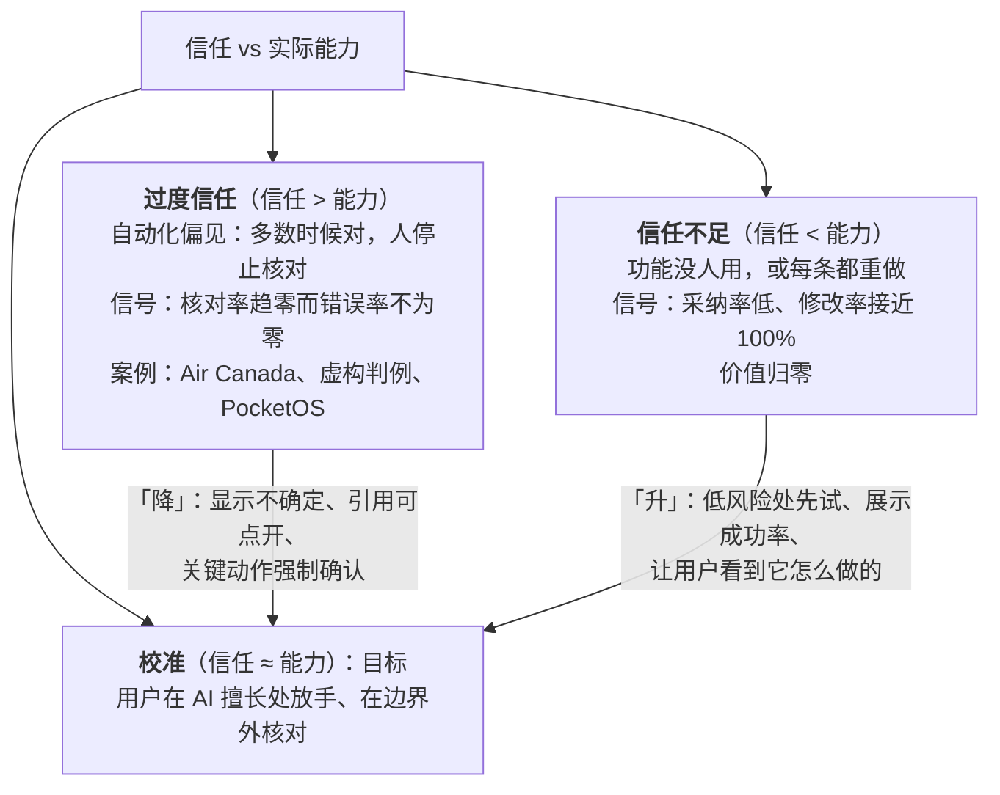

两种失败。**过度信任**：Air Canada 的乘客信了聊天机器人编造的退票政策（法院判赔）；律师把模型虚构的判例提交给法庭；PocketOS 的开发者没看 agent 要执行什么就让它跑（L1 第一篇）——人不再核对，把错误当真，这叫自动化偏见，也是第一篇"边界外用 AI 更差 19 个百分点"的机制。**信任不足**：功能做出来没人用，或用户每条都重做——价值归零。两种都是**信任与实际能力不一致**。产品的目标不是让用户尽量信任，是让信任**校准**到与能力一致：AI 擅长的地方放手，不擅长的地方核对。

这一篇讲两种失败怎么发生、采纳与修改的公开数据说明什么（Copilot 的建议接受率长期约三成、被接受的多数被再编辑——"人在编辑"是常态不是失败）、校准信任的八种手段、让不信任的用户开始用的方法、以及模型升级后信任要重新校准。

本篇要回答的核心问题是：

> **过度信任与信任不足各怎么发生，为什么目标是校准而不是最大化？[^q0] 采纳率与修改率的数据说明什么？[^q1] 校准信任的手段有哪些，怎么让不信任的用户开始用？[^q2]**

## 一、总览

### 1. 校准




```text
              用户的信任
                 ↑
   过度信任      │      校准
（把错误当真）   │  （放手 + 核对
   Air Canada    │    各在对的地方）
   虚构判例      │
   PocketOS      │
─────────────────┼─────────────────→ AI 的实际能力
                 │
   信任不足      │
（没人用 / 全重做）│
```

对角线是目标。产品设计的工作是把用户从对角线上下两侧推回对角线——手段不同（过度信任要"降"、信任不足要"升"），但都靠**让用户看到真实的能力**。

### 2. 本文的章节安排

第二章过度信任；第三章信任不足；第四章采纳与修改的数据；第五章校准的八种手段；第六章让不信任的用户开始用；第七章信任的动态；第八章实践建议。

## 二、过度信任

### 1. 机制

自动化偏见：当一个系统多数时候对，人会停止核对——每次核对都"浪费"了，直到那次错的。模型的输出流畅、自信、格式专业，比人的输出更像"对的"，加剧了它。哈佛 / BCG 实验里边界外 +19 个百分点错误率的来源就是这个：顾问信了自信但错的输出。

### 2. 信号

**核对率趋零而错误率不为零**：用户点开引用的比例、修改建议的比例、拒绝的比例都在下降，但评测集与在线 judge 显示错误还在——用户不看了。这是产品最危险的状态，且从采纳率上看像成功（100% 接受）。

### 3. 代价最高的场景

不可逆动作（发送、付款、删除、部署——PocketOS）、对外承诺（Air Canada 的政策）、专业判断被非专业用户接受（法律、医疗、财务）。这些场景要**结构性地要求核对**（确认门、diff 审阅、二次确认——L4 第五、八篇）而不是依赖用户自觉。

## 三、信任不足

### 1. 机制

第一次体验在边界外（用户问了 AI 不擅长的、得到错误答案）→ "这东西不行" → 不再用；或功能藏得深、要学 prompt 才能用；或输出不可核对，用户不敢用。

### 2. 信号

采纳率低且不涨；用户用了一次不再用（留存曲线陡——第五篇）；用户把 AI 的输出全部重做（修改率接近 100%，与"再编辑"不同——那是重写）；访谈里说"不信它"。

### 3. 代价

功能的价值归零，且团队会误判"AI 不行"去换模型——问题在第一次体验与可核对性，不在模型。

## 四、采纳与修改的数据

### 1. Copilot 的三成

GitHub Copilot 公开过的建议接受率量级长期在三成左右（不同研究与时期从两成到三成多），被接受的建议多数会被开发者再编辑。这两个数字常被误读为"AI 不行"。正确的读法：**人在编辑是常态**——copilot 形态里 AI 的建议是起点，人接受、改、拒绝是设计好的循环；三成接受 × 每次省几秒 × 每天几百次 = 真实的价值；接受后再编辑说明人在核对。

### 2. 危险的数字

**接受率接近 100%** 而错误率不为零——过度信任；**修改率接近 100% 且是重写**——信任不足或质量不足；**核对率（点开引用、展开步骤）趋零**——过度信任的早期信号。健康的形态是接受率中等、修改率中等且是编辑不是重写、核对率与任务风险相关（高风险任务核对率高）。

### 3. 按任务看

与第一篇同理：一个总的接受率掩盖分布——边界内任务接受率高且少改、边界外任务接受率高且错误多（危险）或接受率低（正常）。按任务类型看接受率 × 错误率 × 核对率，找出"接受高、错误高、核对低"的象限——那是过度信任的位置。

## 五、校准的八种手段

| 手段 | 做什么 | 校准的方向 | 对应的层 |
|---|---|---|---|
| **显示依据** | 引用可点开定位原文；"因为你之前说过…"；工具返回的摘要可展开 | 降过度（能核对）、升不足（有来源） | L3 引用正确率、L4 第八篇记忆来源、第四篇 |
| **显示不确定** | 不确定时给候选并说差别、说"我不确定"、拒答说缺什么 | 降过度 | L2 第三篇出口、第四篇 |
| **可撤销** | undo、git、草稿、提案先于生效 | 升不足（试错代价低）、降过度的代价 | L4 第八篇中间物 |
| **可核对的呈现** | diff 而不是整段替换；结构化而不是一段话；变更预览 | 降过度（看得见变了什么） | 第四篇 |
| **结构性核对** | 不可逆动作的确认门、二次确认、审批带理由与影响 | 降过度（不依赖自觉） | L4 第五篇 |
| **期望管理** | onboarding 说清擅长与不擅长；首次任务选边界内的；发布说明说变了什么 | 升不足（第一次体验好）、降过度（知道边界） | 第一篇 |
| **渐进自主** | 新用户先 copilot、建立信任后开 agent、稳定后自动化；按任务类型放开 | 双向 | L4 第八篇六级、第二篇 |
| **把信号推给用户** | agent 遇障碍要绕过、不确定、要做不可逆动作时明确说"这一步需要你" | 降过度（在该核对的地方叫人） | L4 第八篇问人 |

Table: 信任校准的八种手段

八种手段的共同点：**让用户看到真实的能力与真实的不确定**。隐藏不确定（永远自信的输出）是过度信任的直接原因；隐藏能力（藏得深、不可核对）是信任不足的直接原因。

## 六、让不信任的用户开始用

### 1. 第一次体验在边界内

onboarding 的引导任务选可验证、高频、AI 稳定的（第一篇的四维度）；不要让用户第一次就问开放问题。

### 2. 低风险切入

先给建议不给结论、先草稿不发送、先只读不写——用户能试错。

### 3. 展示而不是宣传

同事的成功案例、具体的时间节省（第五篇的实测）、能看到别人怎么用。

### 4. 可核对

引用、diff、来源——用户能验证第一次的输出是对的，信任才开始建立。

### 5. 不要过度承诺

"AI 会替你做一切"制造的期望在第一次失败时崩塌（Duolingo 的反弹是组织层面的同一现象）。承诺边界内的。

## 七、信任的动态

### 1. 模型升级

能力变了（多数变强、有些任务变弱——L1 第五篇的评测集要重跑），用户的信任要重新校准：发布说明要说清变了什么、哪些任务现在更好、哪些要注意（L6 第六篇）；升级后一段时间核对率会自然升（用户在试）——不要把它当退化。

### 2. 用户的学习

用户会学到边界（哪些问题它答得好），也会形成习惯（不看了）；核对率随时间下降是自然的，产品要在高风险处**结构性**保持核对（第五章的手段 5），不依赖习惯。

### 3. 事故后

一次明显的错误让信任骤降，且不对称（建立慢、崩塌快）；事故后的沟通（发生了什么、修了什么——L6 第六篇的事后分析对用户的版本）与后续一段时间的额外透明是修复的方法。

## 八、实践建议

1. **量三个数**：接受率、修改率（区分编辑与重写）、核对率——按任务类型看，找"接受高、错误高、核对低"的象限。
2. **不可逆与对外动作结构性核对**：确认门、diff、二次确认——不依赖用户自觉。
3. **写 onboarding 的"擅长 / 不擅长"**，首次任务选边界内的。
4. **把问人做成产品事件**："这一步需要你"有明确的 UI 与理由，不是日志里的一行。
5. **渐进放开**：新用户 copilot 起，按任务类型与评测升级；每级有退回。
6. **发布说明说清能力变化**；事故后额外透明。

## 九、本文小结

- 两种失败：过度信任（自动化偏见——多数时候对让人停止核对；Air Canada、虚构判例、PocketOS；信号是核对率趋零而错误率不为零）与信任不足（第一次体验在边界外、藏得深、不可核对；信号是采纳低、留存陡、全部重写）；目标是校准到与能力一致，不是最大化。
- 数据：Copilot 接受率约三成、多数被再编辑——人在编辑是常态；危险的是接受率趋 100% 而有错、修改是重写、核对率趋零；按任务类型看接受 × 错误 × 核对。
- 八种手段：显示依据、显示不确定、可撤销、可核对的呈现、结构性核对、期望管理、渐进自主、把信号推给用户——共同点是让用户看到真实的能力与不确定。
- 让不信任的用户开始用：第一次在边界内、低风险切入、展示不宣传、可核对、不过度承诺。
- 动态：模型升级要重新校准（发布说明）；用户习惯让核对率自然下降，高风险处结构性保持；事故后信任崩塌快、修复靠透明。

## 十、自测

1. 一个功能的建议接受率从 60% 涨到 97%，团队庆祝。评测集显示错误率仍有 6%。这是什么状态？怎么确认与处理？

   <details markdown="1"><summary>答案</summary>
   过度信任的信号：接受率趋 100% 而错误率不为零，说明 6% 的错误被用户直接接受了。确认：核对率（点开引用、展开）是否趋零、修改率是否趋零、按任务类型看哪类错误高。处理：高风险任务加结构性核对（确认门、diff）、显示不确定与依据、onboarding 重申边界；不要把 97% 当成功。详见[第二章](#二过度信任)、[第四章](#四采纳与修改的数据)。
   </details>

2. Copilot 的建议接受率约三成、多数被再编辑，为什么不是失败？什么样的数字才是失败？

   <details markdown="1"><summary>答案</summary>
   copilot 形态里建议是起点，人接受、改、拒绝是设计好的循环；三成接受 × 每次省几秒 × 每天几百次是真实价值，再编辑说明人在核对（校准的信任）。失败的数字：接受率趋 100% 而有错（过度信任）、修改率趋 100% 且是重写（信任不足或质量不足）、核对率趋零、留存陡降。详见[第四章](#四采纳与修改的数据)。
   </details>

3. 一个内部知识库问答上线两周，周活从 40% 掉到 8%。访谈说"问了几次都不对就不用了"。诊断与修法？

   <details markdown="1"><summary>答案</summary>
   信任不足：第一次体验在边界外（用户问了开放问题或知识库没覆盖的），且可能没有引用让用户判断对错。修：onboarding 引导任务选边界内的（"查报销标准"这类有明确答案的）、拒答时说缺什么与下一步（而不是错答）、引用可点开、展示同事的成功用法、检查 L3 的召回与覆盖（可能真的没找到——那是 L3 的问题不是信任问题，用 L3 第七篇的三个数字分）。详见[第三章](#三信任不足)、[第六章](#六让不信任的用户开始用)。
   </details>

4. 为什么高风险动作的核对要"结构性"而不能依赖用户自觉？举两个结构性手段。

   <details markdown="1"><summary>答案</summary>
   自动化偏见让核对率随时间自然下降——系统多数时候对，用户会停止看；高风险处一次不看就是事故（PocketOS）。结构性手段：不可逆动作的确认门（带理由与影响范围，L4 第五篇）、变更以 diff 呈现且需显式接受、提案先于生效（L4 第八篇）、二次确认（大额）。详见[第二章](#二过度信任)、[第五章](#五校准的八种手段)。
   </details>

5. 模型升级后核对率从 20% 升到 45%。这是好事还是坏事？

   <details markdown="1"><summary>答案</summary>
   多半是自然的重新校准：能力变了用户在试、在看——不是退化。要看的是错误率是否同时变化（评测集重跑）与核对率是否在几周内回落；发布说明应说清变了什么帮用户更快校准。若核对率升伴随修改率与拒绝率大涨且评测显示某类任务变差，那是能力退化（L1 第五篇），要回滚或调整。详见[第七章](#七信任的动态)。
   </details>

## 下一篇

[不确定性的呈现与非对话形态](/presenting-uncertainty-and-beyond-the-chat-box.html)

[^q0]: 过度信任的机制是自动化偏见：系统多数时候对，人停止核对，直到那次错的；模型输出流畅自信加剧它；Air Canada 乘客信了编造的政策、律师提交虚构判例、PocketOS 开发者没看就让 agent 跑；哈佛 / BCG 边界外 +19 pp 错误的来源。信号是核对率（点开引用、修改、拒绝）趋零而错误率不为零——从接受率看像成功，最危险。代价最高在不可逆动作、对外承诺、非专业用户接受专业判断。信任不足的机制是第一次体验在边界外、功能藏得深、输出不可核对；信号是采纳低不涨、留存陡、修改是重写、访谈说不信；代价是价值归零且团队误判为模型问题。目标是校准而不是最大化——信任与实际能力一致，AI 擅长处放手、不擅长处核对——因为两侧都是失败，且校准的手段都是让用户看到真实的能力与不确定。详见[第一章](#一总览)到[第三章](#三信任不足)。

[^q1]: Copilot 的建议接受率长期约三成、被接受的多数被再编辑——不是失败：copilot 形态里建议是起点，接受 / 改 / 拒绝是设计的循环，三成 × 每次几秒 × 每天几百次是真实价值，再编辑说明人在核对（校准）。危险的数字：接受率趋 100% 而错误率不为零（过度信任）、修改率趋 100% 且是重写而非编辑（信任不足或质量不足）、核对率趋零（过度信任的早期信号）。健康形态：接受率中等、修改是编辑、核对率与任务风险相关。要按任务类型看接受率 × 错误率 × 核对率，找"接受高、错误高、核对低"的象限——那是过度信任的位置；总的接受率掩盖边界内外的分布。详见[第四章](#四采纳与修改的数据)。

[^q2]: 八种手段：显示依据（引用可点开、记忆来源、工具返回可展开）、显示不确定（候选与差别、"我不确定"、拒答说缺什么）、可撤销（undo、git、草稿、提案先于生效）、可核对的呈现（diff 不整段替换、结构化、变更预览）、结构性核对（不可逆动作确认门、二次确认、审批带理由与影响——不依赖自觉）、期望管理（onboarding 说擅长与不擅长、首次任务选边界内、发布说明说变化）、渐进自主（新用户 copilot 起、按任务类型与评测升级、每级可退回）、把信号推给用户（agent 遇障碍要绕过 / 不确定 / 不可逆时明确说"这一步需要你"）；共同点是让用户看到真实的能力与不确定。让不信任的用户开始用：第一次体验在边界内（引导任务可验证高频稳定）、低风险切入（建议不结论、草稿不发送、只读不写）、展示而不宣传（同事案例、实测节省）、可核对（引用、diff）、不过度承诺。动态：模型升级要重新校准（发布说明；升级后核对率自然升不是退化）、用户习惯让核对率下降所以高风险处结构性保持、事故后崩塌快修复靠透明。详见[第五章](#五校准的八种手段)到[第七章](#七信任的动态)。
