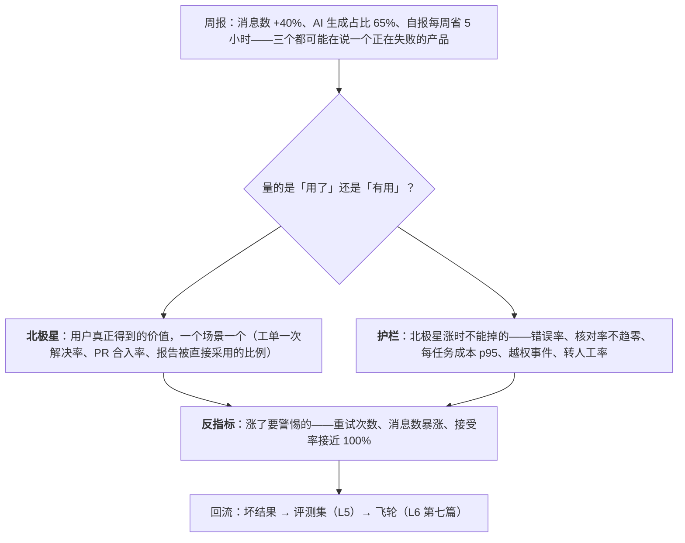

一个 AI 功能的周报：消息数涨 40%、AI 生成占比 65%、用户自报"每周省 5 小时"。三个数字都可能在说一个正在失败的产品：消息数涨可能是用户在反复重试；生成占比不是目标；自报的节省常高于实测一倍以上。这一篇讲量什么才是"有用"：指标矩阵、北极星与护栏、反指标、自报 vs 实测、定性研究、以及指标怎么回流到评测集与飞轮——让第五层的评测与第六层的飞轮有产品侧的输入。

本篇要回答的核心问题是：

> **AI 产品的指标矩阵是什么，北极星怎么选？[^q0] 哪些是虚荣指标，自报与实测差多少？[^q1] 指标怎么回流到评测集与飞轮，AI 产品的 A/B 有什么特殊？[^q2]**

## 一、总览

### 1. 指标矩阵

| 类 | 指标 | 量的是 | 陷阱 |
|---|---|---|---|
| 采纳 | 功能使用率、周活、渗透率（有多少目标用户在用） | 有没有人用 | 用了不等于有用 |
| 接受与修改 | 建议接受率、接受后的编辑量（编辑 vs 重写）、拒绝率 | 输出的可用程度 | 接受率趋 100% 是过度信任（第三篇） |
| 任务完成 | 用户目标达成率（会话为单位——L5 第三篇）、一次解决率 | 真的做成了吗 | 要定义"完成"（最终状态检查 / judge / 用户确认） |
| 时间节省 | **实测**（控制组、任务计时、代理指标如提交频率）与**自报**（问卷） | 价值 | 自报常高于实测；两个都报 |
| 升级与放弃 | 转人工率、放弃率、重试率、追问率 | 负信号 | 转人工不全是失败（边界外的该转） |
| 留存 | 用过之后还用吗（次周 / 次月）、按任务类型的留存 | 持续价值 | AI 功能的留存曲线常比想象陡；首次体验决定 |
| 满意度 | CSAT、点赞 / 点踩比、NPS | 主观 | 显式反馈稀疏且有选择偏差（不满的更爱给） |
| 成本 vs 价值 | 每任务成本 p50 / p95、价值 / 成本比（L6 第二篇） | 值不值 | 长尾任务的成本 |
| 信任 | 核对率（点开引用、展开步骤）、按风险的核对率 | 校准状态 | 核对率趋零而错误率不为零 = 过度信任 |
| 质量 | 评测集分数、在线 judge、错误率（L5） | 对不对 | 与产品指标并列不能替代 |

Table: AI 产品指标矩阵

### 2. 本文的章节安排

第二章北极星与护栏；第三章反指标；第四章自报 vs 实测；第五章定性研究；第六章回流；第七章 A/B 的特殊性；第八章实践建议。

## 二、北极星与护栏

### 1. 按场景选一个

北极星是**用户真正得到的价值**的最直接度量，一个场景一个：

| 场景 | 北极星 | 为什么 |
|---|---|---|
| 客服 | 一次解决率（用户不再回来问同一件事）× 满意度 | 解决了才是价值；处理时间短但反复来是失败（Klarna） |
| coding | 合并的 PR 数 × CI 通过率（或接受并保留的代码量） | 合并且没被 revert 的代码是价值 |
| 写作 / 草稿 | 发出的草稿数（用户实际发送 / 发布的） | 生成不算，用了才算 |
| 知识库问答 | 任务完成率（用户找到并采用了答案）| 有引用且用户核对后采用 |
| 数据分析 | 被用于决策的报告数 / 被引用的分析 | 看了并用了 |
| 后台 agent | 接受的交付物比例 × 每个节省的时间 | 交付物被接受才是价值 |

Table: 各场景的北极星指标

### 2. 护栏

北极星涨的同时不能掉的：质量（错误率、评测分）、信任（核对率不趋零、接受率不趋 100%）、成本（每任务 p95）、安全（越权、注入事件）、升级率（转人工不暴涨）、留存。北极星与护栏一起看——L6 的四指标（成本、质量、延迟、安全）是护栏的工程版本。

## 三、反指标

不该作为目标、且涨了可能是坏事的：

| 指标 | 为什么是反指标 |
|---|---|
| 消息数 / 交互次数 | 可能是用户在反复重试、澄清、纠正——摩擦不是价值 |
| token 用量 / "AI 用量" | 成本不是价值 |
| AI 生成内容占比 | 不是目标；且可能是用户不改了（过度信任）或被强制用 |
| 会话时长 | 好的 AI 功能让用户更快离开 |
| 功能曝光 / 点击 | 打开不等于用，用不等于有用 |
| 自报的满意度单独看 | 选择偏差；与行为指标对照 |

Table: 反指标及其原因

它们可以作为诊断指标（消息数骤升 → 查重试率），不能作为目标——一旦作为目标，团队会优化出更多摩擦。

## 四、自报 vs 实测

### 1. 差距

用户自报的时间节省常高于实测——一倍以上不罕见：人低估自己核对与修改的时间、高估 AI 生成的部分、且对喜欢的工具有好感偏差。也有反向的：用户觉得没省时间但实测提交频率涨了。

### 2. 实测的方法

- **控制组实验**：一组用、一组不用，量任务完成时间与质量（最可靠、最贵）；
- **任务计时**：埋点量从开始到完成的时间，对比用 / 不用 AI 的任务；
- **代理指标**：coding 的提交频率、PR 周期；客服的处理时间与一次解决率；写作的发出时间；
- **修改量**：接受后编辑了多少（编辑量大 → 节省少）。

### 3. 两个都报

自报量的是**感知价值**（影响留存与口碑），实测量的是**真实价值**（影响单位经济学）。两者差距本身是信息：感知高实测低 → 好感但不持久；感知低实测高 → 用户没意识到，要展示（第三篇的"展示而不是宣传"）。

## 五、定性研究

指标告诉你多少，不告诉你为什么。三种定性：

- **看用户怎么用**（录屏、跟随观察）：他们怎么写 prompt、在哪里卡住、什么时候切到别的工具；
- **看用户怎么绕过**：绕过是最有信息的行为——用户把 AI 的输出复制到别处改、用 AI 做了一步然后手动做剩下的、只用某个子功能——他们在告诉你边界在哪（第一篇）与形态错在哪（第二篇）；
- **什么时候关掉**：卸载、关闭建议、不再点——访谈这些用户比访谈活跃用户更有信息。

定性的发现回到第一篇（场景边界）、第二篇（形态）、第四篇（呈现）。

## 六、回流

### 1. 指标事件带 trace id

每个指标事件（接受、修改、拒绝、重试、放弃、转人工、点踩、核对）带会话与任务 id（L5 第六篇的反馈绑定）——没有 id 的指标只能看趋势，不能定位。

### 2. 三条回流

| 信号 | 去哪 | 出处 |
|---|---|---|
| 负信号（点踩、重试、放弃、转人工、重写） | bad case 队列 → 评测集 | L5 第六篇、L6 第七篇 |
| 正信号（接受、修改后提交——修改前后是一对） | 评测集的正例、飞轮的微调数据（筛过） | L6 第七篇 |
| 绕过与边界外的使用 | 场景边界的重新评估、形态的调整 | 第一、二篇 |

Table: 三条反馈回流

### 3. 闭环给用户

修好的问题告诉用户（发布说明、"你上次反馈的已修复"）——反馈有回报，用户才继续给（L6 第七篇）。

## 七、A/B 的特殊性

L5 第四篇讲了 A/B 的机制；AI 产品里的四个特殊点：

- **按用户固定分组**：体验不能在两个版本间跳变（用户会察觉并困惑）；
- **等够长**：有学习效应（用户要几天适应新行为）与信任的重新校准（第三篇）——首周的数据不代表稳态；
- **看留存不只看首次采纳**：新版本首次采纳高可能是新鲜感；
- **一次一个因素**（prompt 或模型或形态），否则归因不了；
- **成本与质量并列**：B 组采纳高但每任务成本高 3 倍——单位经济学判断（L6 第二篇）。

## 八、实践建议

1. **选北极星与护栏**：一个场景一个北极星（价值的直接度量），护栏含质量、信任、成本、安全、升级、留存。
2. **砍虚荣指标**：消息数、生成占比、用量、时长从目标里去掉，留作诊断。
3. **做一次实测**：控制组或任务计时或代理指标，与自报对照，两个都报。
4. **量三个信任指标**：接受率、编辑 vs 重写、核对率——按任务类型看象限（第三篇）。
5. **访谈绕过与关掉的用户**。
6. **每个指标事件带 trace id**，三条回流接通，修好的告诉用户。
7. **A/B 固定分组、等够长、看留存、一因素、成本并列**。

## 九、本文小结

- 矩阵十类：采纳、接受与修改、任务完成、时间节省（实测 + 自报）、升级与放弃、留存、满意度、成本 vs 价值、信任（核对率）、质量；各有陷阱。
- 北极星一个场景一个（客服一次解决率、coding 合并 PR × 通过率、写作发出的草稿、问答任务完成、后台 agent 接受的交付物），护栏是不能掉的（质量、信任、成本、安全、升级、留存）。
- 反指标：消息数、用量、生成占比、时长、曝光、单独的自报满意度——诊断可用、目标不可。
- 自报常高于实测一倍以上；实测用控制组 / 计时 / 代理 / 修改量；两个都报，差距是信息。
- 定性看怎么用、怎么绕过（最有信息）、什么时候关。
- 回流：事件带 trace id；负信号进 bad case → 评测集，正信号进评测正例与飞轮，绕过进边界与形态的重评；修好告诉用户。
- A/B 特殊：固定分组、等够长、看留存、一因素、成本并列。

## 十、自测

1. 周报显示消息数 +40%、生成占比 65%、自报省 5 小时 / 周。用本文重新解读，并说该补哪三个数字。

   

答案

   三个都是反指标或不可靠：消息数涨可能是重试与纠正增多（查重试率、追问率）；生成占比不是目标且可能是过度信任；自报常高于实测一倍以上。补：任务完成率或北极星（该场景的价值度量）、实测的时间节省（控制组 / 计时 / 代理）、信任象限（接受率 × 编辑 vs 重写 × 核对率）。详见[第三章](#三反指标)、[第四章](#四自报-vs-实测)。
   

2. 为客服 AI 选北极星。为什么"平均处理时间"不是好的北极星？

   

答案

   北极星：一次解决率 × 满意度——用户的问题真被解决且不再为同一事回来。平均处理时间是 Klarna 的数字（11 → 2 分钟），它可以在问题没解决的情况下下降（AI 快速给了错答案，客户回来再问——重复来电），优化它会优化出更多未解决的快速回复。处理时间可作为护栏或效率指标，不作北极星。详见[第二章](#二北极星与护栏)。
   

3. 一个功能自报节省 6 小时 / 周，实测（控制组）1.5 小时 / 周。这个差距说明什么？该怎么办？

   

答案

   感知价值高、真实价值低：用户喜欢它（好感偏差、低估核对与修改时间），但单位经济学要按 1.5 小时算。办法：两个都报；查实测低的原因——接受后编辑量大（质量）？任务边界外的使用多？呈现让核对慢？——回到第一、四篇；用感知价值维持留存、用实测驱动改进；不要拿 6 小时做 ROI。详见[第四章](#四自报-vs-实测)。
   

4. 定性研究发现用户经常把 AI 生成的表格复制到 Excel 再改。这说明什么？回到哪几篇？

   

答案

   绕过：用户要的是可编辑的结构化输出而不是文本表格——形态错了（第四篇的生成式 UI：输出结构化数据渲染成可编辑表格，或直接在用户的表格工具里内联——环境感知）；也可能任务的一部分在边界外（用户改的是 AI 做不对的那部分——第一篇）。绕过行为直接指向形态与边界。详见[第五章](#五定性研究)。
   

5. A/B 测试新 prompt 版本，首周 B 组采纳率 +12%，团队想全量。按第七章还要看什么？

   

答案

   （1）等够长——首周有新鲜感与学习效应，看两到四周的稳态；（2）看留存不只首次采纳；（3）护栏——质量（评测与在线 judge）、信任（核对率、接受率是否趋 100%）、每任务成本、升级率；（4）确认只变了 prompt 一个因素、按用户固定分组；（5）成本与采纳并列做单位经济学判断。详见[第七章](#七ab-的特殊性)。
   

## 下一篇

[系列总结与通关自测](/product-and-experience-series-recap-and-self-test.html)

[^q0]: 矩阵十类：采纳（使用率、周活、渗透——用了不等于有用）、接受与修改（接受率、编辑 vs 重写、拒绝——趋 100% 是过度信任）、任务完成（会话为单位的目标达成、一次解决率——要定义完成）、时间节省（实测 + 自报——自报高于实测）、升级与放弃（转人工、放弃、重试、追问——转人工不全是失败）、留存（次周 / 次月、按任务类型——曲线常陡、首次体验决定）、满意度（CSAT、点赞点踩、NPS——稀疏且有选择偏差）、成本 vs 价值（每任务 p50 / p95、价值 / 成本）、信任（核对率按风险——趋零而有错是过度信任）、质量（评测分、在线 judge、错误率——并列不替代）。北极星一个场景一个、量用户真正得到的价值：客服一次解决率 × 满意度（处理时间可在未解决时下降——Klarna）、coding 合并 PR × CI 通过（或接受并保留的代码）、写作发出的草稿、问答任务完成、分析被用于决策的报告、后台 agent 接受的交付物 × 节省；护栏是不能掉的——质量、信任、成本、安全、升级率、留存（L6 四指标是工程版本）。详见[第一章](#一总览)、[第二章](#二北极星与护栏)。

[^q1]: 反指标（诊断可用、目标不可）：消息数 / 交互次数（可能是重试与纠正的摩擦）、token 用量 / AI 用量（成本不是价值）、AI 生成占比（不是目标、可能是过度信任或被强制）、会话时长（好功能让用户更快离开）、曝光 / 点击、单独的自报满意度（选择偏差）——作为目标会优化出更多摩擦。自报 vs 实测：自报常高于实测一倍以上（低估核对与修改时间、高估生成部分、好感偏差），也有反向；实测方法——控制组实验（最可靠最贵）、任务计时埋点、代理指标（提交频率、PR 周期、处理时间与一次解决率、发出时间）、接受后的修改量；两个都报——自报量感知价值（留存与口碑）、实测量真实价值（单位经济学），差距是信息（感知高实测低 → 好感不持久；感知低实测高 → 要展示）。定性：看怎么用、看怎么绕过（最有信息——指向边界与形态）、什么时候关掉（访谈这些人）。详见[第三章](#三反指标)到[第五章](#五定性研究)。

[^q2]: 回流：每个指标事件（接受、修改、拒绝、重试、放弃、转人工、点踩、核对）带会话与任务 id，否则只能看趋势不能定位；三条——负信号进 bad case 队列再进评测集（L5 第六篇、L6 第七篇），正信号（接受、修改前后的对）进评测正例与筛过的飞轮微调数据（L6 第七篇），绕过与边界外使用进场景边界与形态的重评（第一、二篇）；修好的告诉用户（反馈有回报才继续给）。A/B 的特殊：按用户固定分组（体验不跳变）、等够长（学习效应与信任重新校准，首周不代表稳态）、看留存不只首次采纳（新鲜感）、一次一个因素（prompt / 模型 / 形态）、成本与质量并列做单位经济学判断（采纳 +12% 但成本 3× 要算账）；护栏同时看。详见[第六章](#六回流)、[第七章](#七ab-的特殊性)。
