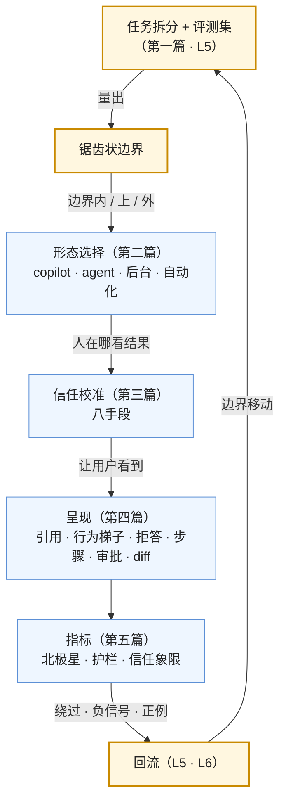

五篇正文回答了一个问题：**在"组件会出错"的前提下怎么做产品决策**。第一篇选场景（锯齿状边界、demo–产品鸿沟），第二篇选形态（copilot → agent → 自动化、后台 agent 的兴起），第三篇校准信任（过度与不足、八种手段），第四篇呈现不确定与非对话形态，第五篇量真实价值并回流。五篇合起来是[《AI 应用工程师学习地图》](/ai-application-engineer-learning-roadmap.html)第七层，也是应用地图的最后一层：从模型组件到可信的产品。

本文不讲新内容：总表、逐篇回顾、贯穿的线、误区、三段式自测，最后是整张应用地图的收束。

> **读完这五篇，你应该能回答哪些问题？[^q0] 哪些数字与结论必须能脱口而出？[^q1] 怎么判断自己是"读过"还是"掌握"了？[^q2]**

## 一、总览：系列回答的问题与主线

系列的一句话主张是：**把 AI 放在边界内、把人放在边界上、把信任校准到与能力一致、诚实呈现不确定、量"有用"而不是"用了"**。

| 篇 | 回答的问题 | 一句话结论 | 必记的数字 / 结论 |
|---|---|---|---|
| [第一篇：场景](/choosing-ai-scenarios-the-jagged-frontier-and-the-demo-to-product-gap.html) | 该做哪些、不该做哪些？ | 四维度（价值、可验证、容错、频率）；锯齿状边界按任务划、要用评测集量；回撤的共同错误是外推；鸿沟五来源；决策拆任务 → 三分 → 审外推 → 可逆 | 哈佛 / BCG 758 人：边界内 +25% / +40%，边界外 +19 pp 错误；Klarna 700 人 → 裁 1,500 → 混合；"80% 的 demo 是 20% 的产品" |
| [第二篇：形态](/product-forms-copilot-agent-automation-and-the-rise-of-background-agents.html) | 做成什么、人在哪看结果？ | copilot → 同步 agent → 后台 agent → 自动化对应六级；演进四步各靠一个 harness 机制；后台成主流的四原因；决策按验证 / 撤销 / 落点 / 可等；多形态并存与切换点 | PR 是天然审阅落点；不可逆止于提案；渐进放开 |
| [第三篇：信任](/human-ai-division-of-labor-and-trust-calibration.html) | 用户太信还是不信？ | 过度（自动化偏见）与不足两种失败，目标是校准；接受率三成 + 再编辑是常态；八种手段；让不信任的开始用；动态重校 | 危险信号：接受趋 100% 而有错、核对率趋零；按任务看接受 × 错误 × 核对象限 |
| [第四篇：呈现](/presenting-uncertainty-and-beyond-the-chat-box.html) | 怎么让用户看到能力与不确定？ | 三原则（诚实、可核对、可行动）；引用到段落、置信度用行为不用数字、拒答三部分；步骤分层、审批三要素、diff 部分接受；对话框五局限；七种非对话形态与选法 | "为什么是对话框"；无依据不呈现为事实 |
| [第五篇：指标](/ai-product-metrics-and-feeding-back-into-the-system.html) | 怎么知道有用？ | 矩阵十类；北极星一场景一个 + 护栏；反指标；自报高于实测一倍以上、两个都报；定性看绕过；回流三条；A/B 五特殊 | 处理时间不是客服北极星；消息数是反指标 |

Table: 六篇的核心问题、结论与必记

### 1. 本文的章节安排

| 章 | 内容 |
|---|---|
| 二 | 逐篇回顾 |
| 三 | 贯穿五篇的两条线 |
| 四 | 常见误区表 |
| 五 | 通关自测：A 判断与计算 10 题、B 跨篇综合 5 题、C 面试题 7 题、D 掌握判据 |
| 六 | 应用地图的收束与下一步 |

Table: 本文的章节安排

## 二、逐篇回顾

### 1. 第一篇：场景

**结论**：四维度里可验证与可撤销决定人在哪、价值与频率决定值不值；锯齿状边界——按任务不按领域、边界外用 AI 更差、会动、要量；回撤三案例（Klarna、IBM、Duolingo）共同错误是把边界内的数字外推到全部，正确形态（AI 第一响应、人处理例外、永远能找到人）本可以是起点；成功案例的共同点是输出能快速核对或撤销；鸿沟五来源（分布、长尾、集成、信任、成本）；决策拆任务 → 四维度 → 量边界 → 三分 → 审外推 → 可逆。

**常见误解**：demo 正确率代表产品；按领域判断 AI 能不能做；不可逆的组织决定建在可变的边界判断上。

### 2. 第二篇：形态

**结论**：四形态与六级的对应、各自设计要点与边界；演进四步（补全 → 对话 → 编辑器内 agent → 后台 agent），每步是模型能力 + harness 机制；后台成主流：异步并行、PR 落点、能独立跑、成本随价值；不只 coding；决策表四判据；Cursor 四形态并存，切换点是核心设计，渐进放开，不可逆止于提案。

**常见误解**：对话框是默认；同步 agent 与后台 agent 只是 UI 差别；自动化是形态的终点而不是前提的结果。

### 3. 第三篇：信任

**结论**：过度信任（自动化偏见、信号是核对率趋零而有错、代价最高在不可逆与专业判断）与不足（第一次在边界外、藏得深、不可核对）；目标校准；Copilot 三成 + 再编辑是常态、危险数字三个、按任务看象限；八手段（依据、不确定、可撤销、可核对呈现、结构性核对、期望管理、渐进自主、推信号）；让不信任的开始用五法；动态（升级重校、习惯让核对下降所以高风险结构性保持、事故后透明）。

**常见误解**：接受率越高越好；信任要最大化；核对靠用户自觉。

### 4. 第四篇：呈现

**结论**：三原则与机制对应表；引用到段落且正确率是产品指标、无依据不呈现为事实；置信度行为梯子不用数字；拒答三部分是正常路径；首字前骨架、步骤分层（Trajectory）、进度预估、审批三要素 + 批一类 + 超时即拒、diff 部分接受；对话框五局限；七种非对话形态；选形态七问；先问"为什么是对话框"。

**常见误解**：显示置信度百分比；拒答是错误页；展开全部步骤是透明。

### 5. 第五篇：指标

**结论**：矩阵十类与陷阱；北极星按场景一个（一次解决率、合并 PR × 通过、发出的草稿、任务完成、接受的交付物）加护栏；反指标六项；自报 vs 实测的差距与方法、两个都报；定性三种（怎么用、怎么绕过、何时关）；回流三条带 trace id、修好告诉用户；A/B 五特殊。

**常见误解**：消息数涨是好事；自报节省做 ROI；首周 A/B 全量。

## 三、贯穿全系列的几条线

### 1. 边界

第一篇找边界（按任务、用评测集量），第二篇按边界选形态（边界内可自动化、边界上人机协作、边界外只给材料），第三篇在边界处校准信任（边界内放手、边界外核对），第四篇在边界外诚实呈现不确定，第五篇用绕过行为重新定位边界——边界随模型移动，所以第五篇的回流让第一篇的判断可更新。

### 2. 诚实

第三篇的八手段都是"让用户看到真实的能力与不确定"，第四篇的三原则第一条是诚实，第五篇的反指标是对团队自己的诚实（不用虚荣指标骗自己），第一篇的"审外推"是对决策者的诚实。校准信任的唯一方法是让人看到真实。

### 3. 概念表

| 概念 | 出处 | 一句话 |
|---|---|---|
| 四维度 | 1 | 价值、可验证、容错、频率 |
| 锯齿状边界 | 1 | 按任务划、边界外更差、会动、要量 |
| 外推 | 1 | 回撤的共同错误 |
| 鸿沟五来源 | 1 | 分布、长尾、集成、信任、成本 |
| 形态梯子 | 2 | copilot → 同步 agent → 后台 agent → 自动化 ↔ 六级 |
| 审阅落点 | 2 | PR / 草稿 / 提案；没有就造一个或停在同步 |
| 切换点 | 2 | 形态之间的触发，用户可控可见 |
| 自动化偏见 | 3 | 多数时候对让人停止核对 |
| 校准 | 3 | 信任与能力一致，不是最大化 |
| 信任象限 | 3、5 | 接受 × 错误 × 核对，找"高高低" |
| 结构性核对 | 3 | 高风险处不依赖自觉 |
| 行为梯子 | 4 | 直接给 / 候选 / 澄清 / 拒答 |
| 拒答三部分 | 4 | 缺什么、下一步、已知部分 |
| 审批三要素 | 4 | 理由、影响、批一类 |
| 为什么是对话框 | 4 | 先问的纪律 |
| 北极星 + 护栏 | 5 | 一场景一个价值度量 + 不能掉的 |
| 反指标 | 5 | 消息数、用量、生成占比、时长 |
| 自报 vs 实测 | 5 | 差一倍以上，两个都报 |
| 绕过 | 5 | 最有信息的行为 |

Table: 贯穿六篇的概念表

## 四、常见误区

| 误区 | 为什么错 | 出处 |
|---|---|---|
| "demo 96% 就能替代人" | 分布、长尾、外推；边界按任务 | 1 |
| "AI 在客服上做了 700 人的工作" | 来自简单查询，20–30% 例外漏回成本 | 1 |
| "边界外顺手也让 AI 试试" | 比不用更差 19 pp | 1 |
| "先裁员再看" | 不可逆决定建在可变判断上 | 1 |
| "做成对话框最快" | 五局限；先问为什么 | 2、4 |
| "后台 agent 只是把同步的放后台" | 需要落点、独立完成、进度通知、部分结果 | 2 |
| "直接发给客户 = 自动化成功" | 不可逆 + 不可验证不到六级 | 2 |
| "接受率 97% 太棒了" | 有错时是过度信任 | 3 |
| "三成接受率说明 AI 不行" | 人在编辑是常态 | 3 |
| "用户会自己核对" | 自动化偏见；高风险结构性核对 | 3 |
| "显示置信度 87%" | 不可解读且不可靠；用行为 | 4 |
| "无法回答" | 拒答要三部分 | 4 |
| "展开全部步骤最透明" | 噪声；分层 | 4 |
| "允许 / 拒绝两个按钮" | 训练点允许；三要素 | 4 |
| "消息数涨 40%" | 反指标；查重试 | 5 |
| "用户说省 5 小时" | 自报高于实测一倍以上 | 5 |
| "首周 A/B 涨了全量" | 学习效应、留存、护栏 | 5 |

Table: 常见误区与正确说法

## 五、通关自测

### A. 判断与计算（10 题）

1. 判断：哈佛 / BCG 实验里边界外用 AI 的顾问与不用的表现相同。

   

答案

   错。边界外用 AI 的出错率高 19 个百分点——比不用更差。
   

2. 计算：客服 20 个任务里 14 个边界内（占量 75%）、4 个边界上（20%）、2 个边界外（5%）。若按"AI 处理 75% 的量 = 减 75% 人"裁员，漏回的成本从哪来？

   

答案

   边界上的 20% 需要人机协作（人核对例外）、边界外的 5% 需要人全做，且这 25% 的任务往往是最耗时、最影响满意度的（争议、情绪化）；减 75% 人意味着剩下的人要处理全部例外，处理不过来 → 重复来电、升级、满意度下降 → 再招人。正确是按任务分工而不是按量裁。
   

3. 判断：PR 之所以是后台 agent 的好落点，是因为它有 diff、评论、CI 与合并按钮。

   

答案

   对。它是软件行业十五年打磨的人审代码变更的界面，不接受不生效（可撤销），人能部分接受与讨论。
   

4. 判断：核对率随时间下降一定是产品退化。

   

答案

   错。用户学到边界后核对率自然下降；危险的是核对率趋零而错误率不为零（过度信任）；高风险处要结构性核对不依赖习惯。
   

5. 计算：接受率 95%、错误率 5%、核对率 3%。每 100 条建议里有多少错误被直接接受且未核对？

   

答案

   约 5 条错误 × 95% 接受 ≈ 4.75 条被接受，其中 97% 未核对 ≈ 4.6 条——几乎全部错误都被静默接受。这是过度信任的象限。
   

6. 判断：置信度用"87%"显示比用"我不确定"更精确、更好。

   

答案

   错。用户无法解读数字，模型自评不可靠，数字制造虚假精确感；用行为梯子（直接给 / 候选 / 澄清 / 拒答）与语言。
   

7. 判断："无法回答您的问题"是合格的拒答。

   

答案

   错。拒答要说缺什么、下一步能做什么、已知的部分。
   

8. 计算：自报节省 6 小时 / 周、实测 1.5 小时 / 周、每用户每周成本 \$4、时薪 \$50。按自报与实测的价值 / 成本各多少？

   

答案

   自报：6 × 50 / 4 = 75×；实测：1.5 × 50 / 4 ≈ 19×。ROI 按实测算（仍很好），自报用于理解感知价值。
   

9. 判断：客服 AI 的北极星应该是平均处理时间。

   

答案

   错。处理时间可在问题未解决时下降（Klarna）；北极星是一次解决率 × 满意度，处理时间作护栏或效率指标。
   

10. 判断：AI 功能的 A/B 可以按请求随机分组。

    

答案

    错。要按用户固定分组——体验在两个版本间跳变会让用户察觉与困惑，且学习效应与信任校准需要稳定的体验。
    

### B. 跨篇综合（5 题）

1. 一家公司要做"AI 处理采购申请"：读申请 → 查预算与政策 → 判断 → 审批或驳回 → 通知。用五篇各给一个决策，合成方案。

   

答案

   场景（1）：拆任务——读与抽取（边界内、可验证）、查政策（边界内、有引用）、判断（边界上：多数规则明确、例外需人）、审批生效（不可逆对外）；不外推。形态（2）：抽取与查询自动化，判断做成后台 agent 交付"建议 + 依据"的提案，审批由人批准才生效（不可逆止于提案），例外转人。信任（3）：审批人看到依据（政策条款引用、预算数据）与不确定标记，高额与例外结构性二次确认，onboarding 说清 AI 不判断的情形。呈现（4）：提案以结构化卡片（生成式 UI：申请要点、匹配的政策、预算余额、建议与理由、不确定处），审批带影响范围与"批一类"（小额常规）。指标（5）：北极星"正确审批的比例 × 周期缩短"，护栏含错批率、核对率、转人比、每单成本；回流负信号进评测集、绕过（审批人另查系统）说明呈现缺信息。
   

2. 一个 coding agent 产品从同步形态改为后台形态后，采纳率翻倍但合并率下降、revert 上升。用第二、三、五篇诊断。

   

答案

   形态（2）：后台让用户交出更大的任务（好），但交付物变大、审阅变难（5,000 行 PR 没人细看）——任务粒度与交付物大小要控。信任（3）：审阅落点存在但审阅质量下降——过度信任（核对率随 PR 大小下降），合并了不该合的 → revert。指标（5）：采纳率是采纳指标不是北极星，北极星应是"合并且未 revert 的 PR × 通过率"，它在下降；补核对率（评论数 / 审阅时长 per PR）、编辑 vs 重写、按任务大小分层。修：限任务粒度、PR 拆小、审阅时突出高风险变更、CI 门禁更严、成本与合并率并列。
   

3. 把 Klarna 的全过程（2024 宣布 → 2025 承认 → 2026 混合）映射到本系列五篇，说明每一步本可以怎么做。

   

答案

   2024：数字来自边界内任务，外推到全部——本可以拆任务、量边界、只对边界内的任务减负荷、保留人的能力（1）；形态本可以是"AI 第一响应 + 人处理例外"从一开始（2）。2025：客户要能找到人、复杂与情绪化处理不了——信任不足与边界外用 AI 更差的表现；本可以有升级到人的明确路径与拒答呈现（3、4）。指标：处理时间 11 → 2 分钟是护栏不是北极星，一次解决率与满意度才是——若从一开始量它们，问题早暴露（5）。2026 的混合模式是正确形态，代价是失去的经验与再招的成本。
   

4. 设计一个"AI 分析师"的呈现与形态：用户上传数据，AI 分析并给结论。用第二、四篇。

   

答案

   形态（2）：多步、可等、有落点（报告）→ 后台 agent 交付报告草稿；简单查询走对话；数据边界外（数据质量差、问题不明确）先澄清。呈现（4）：结论用生成式 UI（图表 + 表格 + 结论卡片）而非一段文字；每个结论带依据（数据来源、计算过程可展开——PTC 的程序可见）；不确定用行为梯子（"若排除异常值则…"给候选）；分析步骤分层可展开；结论标注"推断"与"数据直接支持"；导出为可编辑的表格与图（用户会绕过去 Excel——预防它）。
   

5. 把本系列五篇与前六层对应：每篇把前面哪些机制翻译成了产品决策。

   

答案

   场景（1）：L1 失效模式与选型评测集 → 四维度与量边界；L6 第二篇单位经济学 → 价值维度。形态（2）：L4 第八篇六级 → 形态梯子；L4 第三篇运行时与 L2 第四篇上下文管理 → 后台 agent 成立的条件；L4 第八篇中间物 → 审阅落点。信任（3）：L3 引用正确率与 L4 第八篇记忆来源 → 显示依据；L4 第五篇确认门与审批 → 结构性核对；L4 第八篇问人 → 推信号。呈现（4）：L2 第三篇出口 → 拒答与行为梯子；L4 第五篇 `justification` → 审批三要素；L4 第三篇事件流与 L5 决策点 → 步骤分层；L2 第三篇结构化输出与 L4 第二篇 MCP Apps → 生成式 UI；L6 第三篇感知延迟 → 流式与骨架。指标（5）：L5 第三篇会话单位与第四篇在线信号 → 矩阵；L5 第六篇反馈绑定与 L6 第七篇飞轮 → 回流；L6 第二篇 → 成本 vs 价值。
   

### C. 面试题（7 题）

1. 怎么判断一个场景该不该做 AI 产品？

   

答案

   **答案要点**：(1) 拆到任务粒度；(2) 四维度：价值、可验证、容错、频率——可验证与可撤销决定人在哪，价值与频率决定值不值；(3) 锯齿状边界（758 人实验：边界内 +25% / +40%，边界外 +19 pp 错误）按任务不按领域、用评测集量；(4) 三分：边界内做、边界上人机协作、边界外只给材料；(5) 审外推——Klarna 的 700 人来自简单查询；(6) 决策可逆；(7) 鸿沟五来源估计划。
   **追问方向**：怎么量边界（L5 评测集）；成功案例的共同点（可核对可撤销）。
   **好答案与一般答案的区别**：一般答案说"看有没有价值"；好答案给四维度、边界的实验数字、外推的错误与三分决策。

   

2. copilot、agent、自动化怎么选？为什么 2026 年后台 agent 成了主流？

   

答案

   **答案要点**：(1) 梯子与六级对应，能到哪级取决于可验证与可撤销；(2) 判据四个：验证、撤销、落点、可等；(3) 演进四步各靠一个 harness 机制；(4) 后台成主流四原因：异步并行、PR 落点、能独立跑（运行时、上下文管理、SWE-bench 七成）、成本随价值；(5) 不只 coding——有落点的任务都在往后台走；(6) 多形态并存与切换点；不可逆止于提案。
   **追问方向**：没有落点怎么办（造一个或停在同步）；渐进放开的信号。
   **好答案与一般答案的区别**：一般答案说"复杂任务用 agent"；好答案给判据、六级对应、后台的四原因与落点概念。

   

3. 什么是信任校准？怎么发现用户过度信任或信任不足？

   

答案

   **答案要点**：(1) 目标是信任与能力一致，不是最大化——两侧都是失败；(2) 过度信任：自动化偏见，信号是接受率趋 100% 而有错、核对率趋零；Air Canada、虚构判例、PocketOS；(3) 信任不足：第一次在边界外、藏得深、不可核对，信号是采纳低、留存陡、全部重写；(4) Copilot 三成 + 再编辑是常态；(5) 按任务看接受 × 错误 × 核对象限；(6) 八手段；高风险结构性核对；(7) 动态：升级重校、事故后透明。
   **追问方向**：怎么让不信任的开始用；核对率下降何时是问题。
   **好答案与一般答案的区别**：一般答案说"要让用户信任"；好答案说校准、两侧信号、象限与结构性核对。

   

4. 怎么呈现 AI 的不确定性？为什么不显示置信度数字？

   

答案

   **答案要点**：(1) 三原则：诚实、可核对、可行动；(2) 引用到段落、正确率是产品指标、无依据不呈现为事实；(3) 置信度用行为梯子（直接给 / 候选 / 澄清 / 拒答）与语言——数字不可解读且模型自评不可靠（L5 第七篇）；(4) 拒答三部分；(5) 步骤分层、审批三要素、diff 部分接受；(6) 呈现是前六层机制的翻译（出口、justification、决策点、结构化输出）。
   **追问方向**：步骤全展开为什么是噪声；审批只有两个按钮会怎样。
   **好答案与一般答案的区别**：一般答案说"标注 AI 生成、给置信度"；好答案给行为梯子、拒答三部分、与工程机制的对应。

   

5. 为什么对话框不该是默认形态？有哪些替代？

   

答案

   **答案要点**：(1) 对话框是最便宜的集成不是最好的；五局限——用户要会问、打断工作流、输出压成文本、来回成本、不适合长任务；(2) 七种非对话形态：内联、按钮化、环境感知、生成式 UI（MCP Apps）、语音实时、后台交付、环境自动；(3) 选形态七问：用户在哪、任务多长、输出形状、要不要来回、参数已知否、手眼空否、要不要人看；(4) 多数产品是组合（Cursor 四形态）；(5) 纪律：先问"为什么是对话框"。
   **追问方向**：生成式 UI 的工程基础（结构化输出）；对话框适合什么。
   **好答案与一般答案的区别**：一般答案说"对话很自然"；好答案列局限、七形态、判据。

   

6. AI 产品该量什么？哪些指标会骗人？

   

答案

   **答案要点**：(1) 矩阵十类；(2) 北极星一场景一个（一次解决率、合并 PR × 通过、发出的草稿、接受的交付物）加护栏（质量、信任、成本、安全、升级、留存）；(3) 反指标：消息数、用量、生成占比、时长、曝光、单独自报——诊断可用目标不可；(4) 自报高于实测一倍以上，实测用控制组 / 计时 / 代理 / 修改量，两个都报；(5) 信任象限；(6) 定性看绕过；(7) 回流三条带 trace id；A/B 五特殊。
   **追问方向**：处理时间为什么不是客服北极星；首周 A/B 为什么不能全量。
   **好答案与一般答案的区别**：一般答案说"看采纳率和满意度"；好答案给北极星 + 护栏、反指标、自报 vs 实测、回流。

   

7. 从 Klarna 与 GitHub Copilot 两个案例里，你总结 AI 产品成功与失败的结构是什么？

   

答案

   **答案要点**：(1) Copilot 四维度全好：可验证（编译测试）、可撤销（git）、高频、价值累积；人在编辑器里就在边界上；接受率三成 + 再编辑是设计好的循环；十年从补全到 agent 每步靠一个 harness 机制；(2) Klarna：数字真但外推到边界外任务，形态是整体替代而非按任务分工，北极星错（处理时间），不可逆决定建在可变判断上；2026 的混合模式是正确形态本可作起点；(3) 结构：边界（按任务量）+ 形态（人在边界上）+ 校准（可核对可撤销）+ 指标（价值不是用量）+ 可逆；(4) 哈佛 / BCG 的锯齿状边界是两个故事的共同解释。
   **追问方向**：Gartner 三成岗位补回的含义；其他领域的"PR 落点"是什么。
   **好答案与一般答案的区别**：一般答案说"一个成功一个失败"；好答案用同一组维度解释两者，并给出可迁移的结构。

   

### D. 掌握判据

| 层次 | 判据 |
|---|---|
| 读过 | 能说出四维度、锯齿状边界、形态梯子、两种信任失败、行为梯子、北极星与反指标 |
| 掌握 | 能把一个场景拆任务打分量边界并三分；能为每个任务选形态并定切换点；能量信任象限并选校准手段；能审一个产品的引用 / 置信度 / 拒答 / 审批 / diff 呈现并找该非对话化的功能；能选北极星与护栏、砍虚荣指标、做一次实测、接回流 |
| 能教人 | 能用锯齿状边界解释 Klarna 与 Copilot；能推导后台 agent 成主流的四原因与"落点"概念；能解释为什么信任要校准而非最大化、为什么高风险要结构性核对；能解释为什么置信度不给数字、为什么对话框不是默认；能解释自报与实测差距的来源与两个都报的理由；能把五篇映射回前六层的机制 |

Table: 掌握程度的判据

通关标准：A 组 8 题以上正确（计算题误差 5% 以内），B 组 4 题以上能写出完整推理链，C 组每题能说出至少三个要点并回答一个追问。

## 六、应用地图的收束与下一步

本系列是[《AI 应用工程师学习地图》](/ai-application-engineer-learning-roadmap.html)的第七层，也是最后一层。七个系列合起来：

| 层 | 系列 | 一句话 |
|---|---|---|
| L1 | [模型作为组件](/model-as-a-component.html) | 一个会出错、不确定、按 token 计价的组件：失效模式、契约、成本、选型、客户端工程 |
| L2 | [Prompt 与上下文工程](/prompt-and-context-engineering.html) | 模型这一步该看到什么：七层、模式 vs 措辞、结构化输出、预算与压缩、缓存、prompt 当代码管 |
| L3 | [检索与知识接入](/retrieval-and-knowledge-access.html) | 私域知识怎么进模型：进上下文还是权重、三类检索、解析分块、索引混合 rerank、agentic、结构化、评测 |
| L4 | [工具、Agent 与 harness](/tools-agents-and-harness.html) | 模型怎么从回答变成做事：循环、MCP、运行时、上下文与子 agent、权限与沙箱、四个 harness 对照、多 agent、记忆与人、可靠性 |
| L5 | [评测、可观测与可追溯](/evaluation-observability-and-traceability.html) | 怎么知道改了之后更好了：评测集、judge 校准、指标矩阵、门禁、trace、可追溯、运行时与仿真 |
| L6 | [生产化与运营](/production-and-operations-for-ai-applications.html) | 让它可靠可控可持续地跑：网关、成本、延迟、安全、治理、发布、飞轮与物理世界 |
| L7 | 本系列 | 把不确定的能力做成可信的产品：场景、形态、信任、呈现、指标 |

Table: 应用地图七层的一句话

七层的一条主线：**模型是一个会出错的组件（L1），所以要控制它看到什么（L2）、给它可靠的知识（L3）、给它做事的边界（L4）、证明改动更好（L5）、在生产里管住成本质量延迟安全（L6）、最后在"它会出错"的前提下做产品（L7）**。每一层都是对同一个前提的一次工程回应。

下一步：

- 算法地图（[《AI 算法工程师学习地图》](/ai-algorithm-engineer-learning-roadmap.html)）讲这个组件本身怎么来的——预训练、后训练、RL、agent 能力的训练；
- Infra 地图（[《AI Infra 学习地图》](/ai-infra-learning-roadmap.html)）讲它怎么被 serving——推理引擎、GPU、分布式；
- 三张地图的分工与全栈路径见[《AI 全栈学习地图》](/ai-fullstack-learning-roadmap.html)。

应用地图的七个系列到此完成。

## 七、延伸阅读

本系列有意不展开的内容，以及它们在哪个系列里：

- **不讲通用产品方法论**：用户研究、PMF、定价策略不重复；只讲"组件会出错"带来的差异。
- **不讲视觉与交互设计的细节**：控件、动效、文案风格属于设计学科；只讲呈现的原则与它们与工程机制的对应。
- **不讲商业模式**：AI 产品的定价与市场属于商业；只讲每任务成本 vs 价值作为产品指标。
- **不讲组织与变革管理**：Klarna 一类回撤的组织教训（裁员与再雇）只作为边界判断的案例。

[^q0]: 面对一个要做或已做的 AI 功能：这个任务在边界内吗、四维度各怎样、我在外推哪个数字、demo 到产品的五个来源各要多久（1）；该做成 copilot / 同步 agent / 后台 agent / 自动化、人在哪一步看结果、有审阅落点吗、切换点在哪（2）；用户太信还是不信、接受 × 错误 × 核对的象限在哪、用了哪几种校准手段、高风险处结构性核对了吗（3）；引用能点开到段落吗、置信度用行为还是数字、拒答说了缺什么吗、步骤分层了吗、审批有三要素吗、变更是 diff 吗、为什么是对话框（4）；北极星是什么、护栏有哪些、哪些是反指标、自报与实测差多少、绕过行为看了吗、指标事件带 trace id 回流了吗、A/B 固定分组等够长了吗（5）。详见[第一章](#一总览系列回答的问题与主线)。

[^q1]: 数字：哈佛 / BCG 758 名顾问——边界内 +25% 速度 / +40% 质量、边界外 +19 pp 错误；Klarna 230 万对话 / 三分之二工单 / 11 → 2 分钟 / 700 人 / \$40M → 裁 5,000 到 3,500 → 2025 承认 → 2026 混合；Gartner 三成岗位 2029 前补回；Copilot 接受率约三成、多数被再编辑；自报高于实测一倍以上；"80% 的 demo 是 20% 的产品"。结论：边界按任务划、会动、要量；外推是回撤的共同错误；输出能快速核对或撤销是成功案例的共同点；形态梯子 ↔ 六级，能到哪级取决于可验证与可撤销；后台 agent 成主流的四原因与 PR 落点；不可逆止于提案；信任要校准不是最大化，危险信号是接受趋 100% 而有错与核对趋零；高风险结构性核对；置信度用行为不用数字；拒答三部分；审批三要素；先问为什么是对话框；北极星一场景一个 + 护栏；消息数是反指标；处理时间不是客服北极星；两个都报；绕过最有信息。详见[第一章](#一总览系列回答的问题与主线)、[第三章](#三贯穿全系列的几条线)。

[^q2]: 用第五章 D 节：读过——能说出几组名词；掌握——能拆任务量边界三分、选形态定切换点、量信任象限选手段、审呈现找该非对话化的功能、选北极星与护栏砍虚荣做实测接回流；能教人——能用锯齿状边界解释 Klarna 与 Copilot、推导后台 agent 的四原因与落点、解释校准与结构性核对、解释不给数字与不默认对话框、解释自报与实测的差距、把五篇映射回前六层。通关：A 组 8 题以上（误差 5% 内）、B 组 4 题以上完整推理链、C 组每题三个要点加一个追问。详见[第五章](#五通关自测)。
