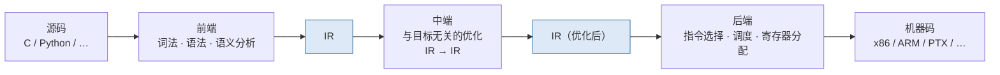
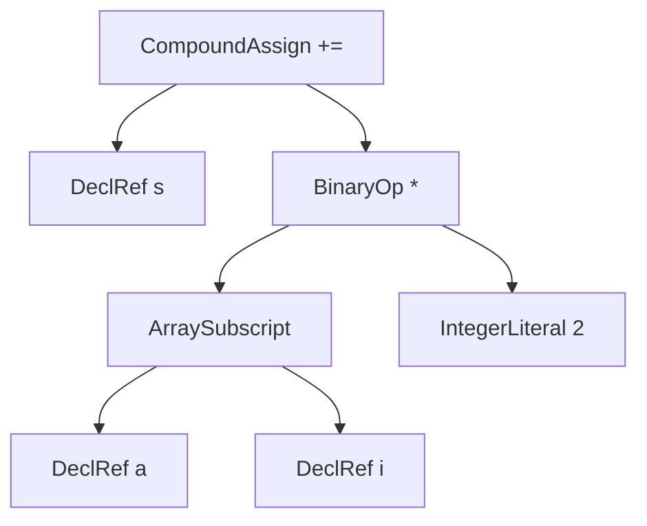
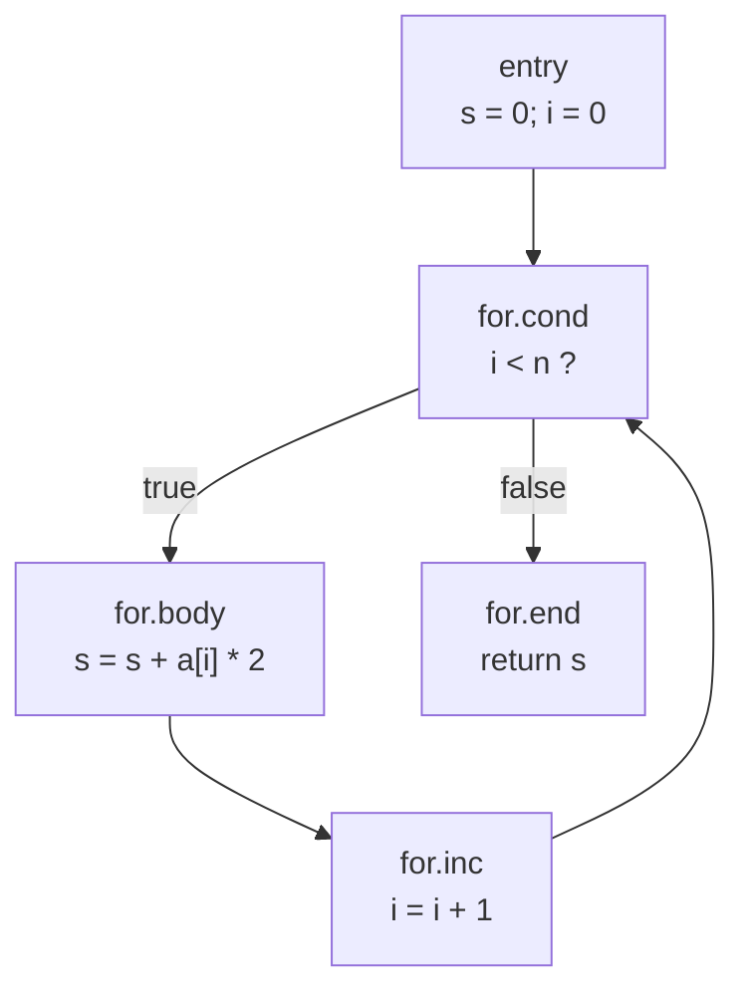
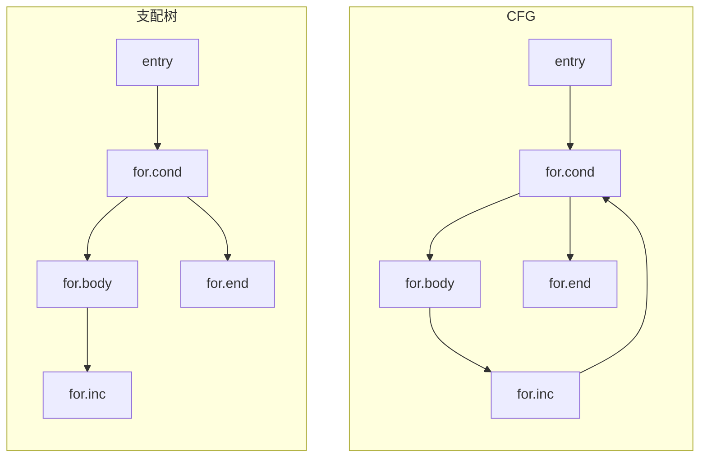
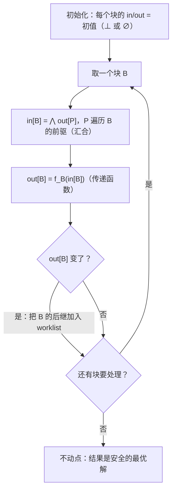
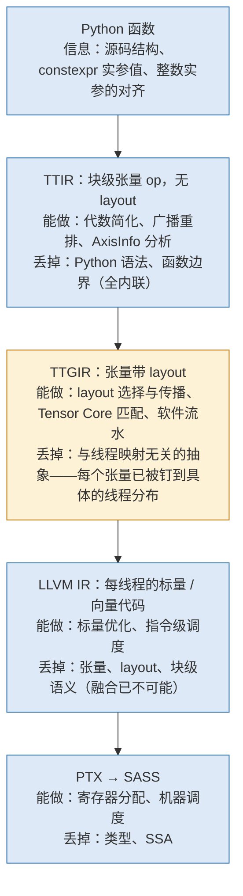
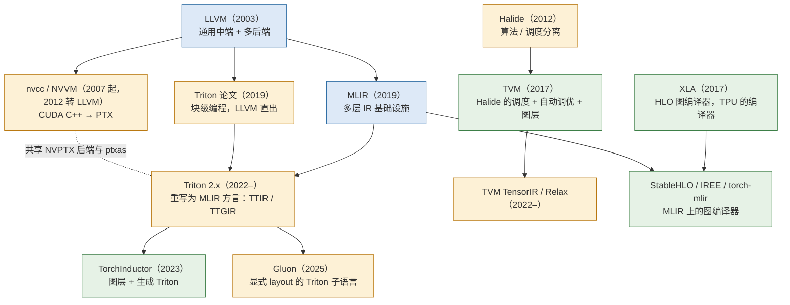

一个 Triton kernel 从 `@triton.jit` 下面的 Python 函数变成 GPU 上跑的 cubin，中间经过六层表示、几十个 pass。要读懂那几十个 pass 各自在做什么，先要有一套词汇：什么是 IR，什么是 SSA，什么是数据流分析，什么是 pass，什么是 lowering。这些词不是 Triton 发明的，它们来自 1970 年代以来的编译器研究，LLVM 把它们做成了工业标准，MLIR 又把它们泛化到任意抽象层级。这一篇把这套词汇讲清楚，每个概念都在一段真实的 LLVM IR 上看一遍。

这一篇不涉及 GPU，也不涉及 MLIR。它回答的是一个前置问题：

> **`a * b + c` 这一行代码在 LLVM 里是三条 SSA 指令；同样这一行在 Triton 里是三个块级 op，操作 `tensor<128x64xf32>`。两者的"优化"分别指什么？[^q0] 为什么后者的优化空间不能在前者上做出来？[^q1]**

回答它需要先知道一个编译器由哪几部分组成、IR 是什么、优化在 IR 上怎么进行，最后才能看清"张量层的 IR"多出了什么。

## 一、总览

本文按**一个编译器 = IR + pass + lowering** 这条轴组织：先把编译器切成三段（第二章），然后逐个讲 IR 的形态（第三章）、IR 上最重要的性质 SSA（第四章）、在 IR 上做推理的通用方法数据流分析（第五章）、用这些推理结果改写 IR 的经典优化（第六章）、组织这些改写的 pass 基础设施（第七章）、把 IR 一层层向下翻译的 lowering（第八章），最后回到 ML：标量 IR 上做不了什么，张量 IR 补了什么（第九章）。

贯穿全文的例子是一个六行的 C 函数：

```c
int sum(int *a, int n) {
  int s = 0;
  for (int i = 0; i < n; i++)
    s += a[i] * 2;
  return s;
}
```

选它是因为它足够小，每一层 IR 都能整段贴出来；又足够完整，有循环、有内存访问、有归约变量——GEMM 的 K 循环在结构上就是它。

| 章 | 主题 | 内容 |
|---|---|---|
| 二 | 编译器的三段 | 前端 / 中端 / 后端；M + N 与 M × N；javac、HotSpot、nvcc 各在哪一段 |
| 三 | IR 的形态 | AST、三地址码、基本块与 CFG；`clang -emit-llvm` 看一段 `-O0` 的 IR；IR 的三个设计维度 |
| 四 | SSA | 定义、φ 函数、支配树与支配边界、`mem2reg`、SSA 的退出；Sea of Nodes |
| 五 | 数据流分析 | 格、传递函数、汇合、不动点；活跃变量与常量传播两个实例；稀疏分析 |
| 六 | 经典优化 | 常量折叠、CSE、DCE、LICM、内联、强度削减，各在 `opt` 上跑一遍；canonicalization |
| 七 | pass 与 pass manager | 粒度、analysis 与 transform、失效；pipeline 是一个列表 |
| 八 | lowering | 每层丢掉什么信息；一步到位与渐进式下降；nvcc 的两级后端 |
| 九 | ML 为什么要自己的编译器 | 张量层特有的优化；三类 ML 编译器；家谱 |
| 十 | 本文小结 | |
| 十一 | 自测 | 5 道题 |

工具用 LLVM 23.1.1 的 `clang`、`opt`、`llc`，全部命令与输出都能在没有 GPU 的机器上重现。

## 二、编译器的三段

### 1. 前端、中端、后端

一个编译器把源语言翻译成目标语言。从 1960 年代开始，这个翻译就被切成三段，切分点是一种**中间表示**（Intermediate Representation，IR）：



三段的分工：

1. **前端**只关心源语言：把字符流变成 token，把 token 变成语法树，做类型检查和名字解析，然后生成 IR。前端产出的 IR 通常是"直译"，不做优化。
2. **中端**只关心 IR：读入 IR，做一系列**与目标机器无关**的变换，输出语义相同但更好的 IR。"更好"的标准可以是更快、更小、更省内存。这是编译器工作量最大的部分——LLVM 的 `lib/Transforms/` 目录有一百多个 pass。
3. **后端**只关心目标机器：把 IR 的指令映射到机器指令（指令选择），决定指令顺序（调度），把无限多的虚拟寄存器分配到有限的物理寄存器（寄存器分配），最后发射二进制。

切成三段的经济学是 **M + N 而不是 M × N**：M 种源语言、N 种目标机器，如果每对语言 - 机器单独写编译器要写 M × N 个；有了共享的 IR 和中端，只要写 M 个前端和 N 个后端。LLVM 就是这样一个"共享的中端加后端"：clang（C / C++）、rustc、swiftc、Julia 都是它的前端，x86、ARM、RISC-V、NVPTX、AMDGPU 都是它的后端。Triton 是它的又一个前端——只是前端的输入不是文本文件，而是一个 Python 函数对象。

### 2. Java 参照：javac 与 HotSpot 各是哪一段

Java 工程师每天用的工具链恰好把三段拆到了两个进程里：

| 组件 | 是哪一段 | 输入 → 输出 | 备注 |
|---|---|---|---|
| `javac` | 只有前端 | `.java` → `.class`（字节码） | 字节码就是 IR；`javac` 几乎不优化，连常量折叠之外的事都不做 |
| HotSpot 解释器 | 不是编译器 | 逐条执行字节码 | 收集 profile，决定哪些方法值得编译 |
| HotSpot C1 | 中端 + 后端（快、优化少） | 字节码 → HIR → LIR → 机器码 | 分层编译的第 1–3 层 |
| HotSpot C2 | 中端 + 后端（慢、优化多） | 字节码 → Sea of Nodes IR → 机器码 | 第 4 层；逃逸分析、内联、循环优化都在这里 |
| Graal | 中端 + 后端，Java 写的 | 字节码 → Graal IR → 机器码 | 可替换 C2；也是 GraalVM native-image 的 AOT 编译器 |

两点对照到 ML 编译器时特别有用：

- **IR 是可以序列化、跨进程的**：`.class` 文件就是被写到磁盘上的 IR。Triton 的编译缓存（第十一篇）保存的 `.ttir` / `.ttgir` / `.llir` 文件是同一回事——IR 的文本形式。
- **JIT 与 AOT 的区别在"何时"而不在"怎么"**：C2 和 native-image 用的是同一套优化，只是一个在运行时（有 profile、有实参类型）、一个在构建时。`torch.compile` 和 Triton 都是 JIT——在第一次调用时才知道 shape、dtype 和 `constexpr` 的值，编译器拿这些值做特化，这是它们比 AOT 的 nvcc 多出的一块信息（第五篇）。

### 3. nvcc：两级后端

CUDA 的编译器 nvcc 在同一张图里是这样的：


它有**两级后端**：LLVM 的 NVPTX 后端把 IR 编成 PTX，PTX 是一种虚拟指令集（有无限多寄存器、与具体 GPU 代际无关）；`ptxas` 再把 PTX 编成某一代 GPU 的真实机器码 SASS，寄存器分配、指令调度这些"真正的后端工作"发生在 `ptxas` 里。这个结构决定了后面几篇的一个事实：**Triton 生成的 LLVM IR 和 PTX 里都没有寄存器数量的概念，spill 是 `ptxas` 决定的**（第二篇、第十一篇）。Triton 复用的是这张图的后半段——从 NVVM IR 往右，与 nvcc 完全相同；它替换的是前半段：前端不是 C++ 的 EDG 而是 Python 的 `ast`，中端在进入 LLVM 之前多了两层张量级的 IR（TTIR、TTGIR）。

## 三、IR 的形态

### 1. 从 AST 到线性 IR

前端第一步产出的是**抽象语法树**（Abstract Syntax Tree，AST）。`s += a[i] * 2` 这一行的 AST：



AST 忠实保留源码的结构：有 `+=` 这种复合赋值、有下标运算、有变量名。它适合做类型检查和报错（错误信息要指回源码的行列），不适合做优化——"`a[i]` 被读了几次""`s` 在循环外还活着吗"这类问题在树上不好回答，因为树只表达语法嵌套，不表达执行顺序和数据流动。

优化用的 IR 是**线性**的：一串指令，每条做一件事，操作数是命名的临时值。最经典的形式叫**三地址码**（three-address code）：每条指令最多一个运算、两个源操作数、一个目标操作数。`s += a[i] * 2` 展开成三地址码是：

```text
t1 = a + i * 4      ; 地址
t2 = load t1        ; 取值
t3 = t2 * 2
s  = s + t3
```

嵌套的表达式被拆平，每个中间结果有了名字。这就是 LLVM IR 的基本形态，也是 TTIR 的基本形态（只是操作数是张量）。

### 2. 基本块与控制流图

线性指令流里有跳转。把指令流按跳转切开，得到**基本块**（basic block）：一段"单入口、单出口、中间没有跳转也没有跳转目标"的直线代码——要么全部执行，要么全部不执行。基本块之间用跳转边连起来，就是**控制流图**（Control Flow Graph，CFG）。

`sum` 函数的 CFG：



五个基本块，一条回边（`for.inc → for.cond`）。循环在 CFG 里就是"有回边的强连通子图"——这个定义后面会用到：**CFG 上的 IR 已经丢掉了"这是一个 for 循环"这一信息**，循环要靠分析（找回边、找支配关系）重新发现。MLIR 的 `scf.for` 之所以存在，就是为了不丢这个信息（第三篇）。

### 3. 用 clang 看一段 `-O0` 的 LLVM IR

把 `sum.c` 用 clang 编成 LLVM IR，不开优化：

```bash
clang -S -emit-llvm -O0 -Xclang -disable-O0-optnone -fno-discard-value-names -o sum.O0.ll sum.c
```

`-fno-discard-value-names` 让 IR 保留源码里的变量名，便于对照；`-disable-O0-optnone` 去掉 `-O0` 默认给函数打的 `optnone` 属性，否则下一章的 `opt` 会跳过这个函数什么都不做。输出的函数体：

```llvm
define i32 @sum(ptr noundef %a, i32 noundef %n) #0 {
entry:
  %a.addr = alloca ptr, align 8                     ; ①
  %n.addr = alloca i32, align 4
  %s = alloca i32, align 4
  %i = alloca i32, align 4
  store ptr %a, ptr %a.addr, align 8
  store i32 %n, ptr %n.addr, align 4
  store i32 0, ptr %s, align 4
  store i32 0, ptr %i, align 4
  br label %for.cond                                ; ②

for.cond:                                         ; preds = %for.inc, %entry
  %0 = load i32, ptr %i, align 4                    ; ③
  %1 = load i32, ptr %n.addr, align 4
  %cmp = icmp slt i32 %0, %1
  br i1 %cmp, label %for.body, label %for.end

for.body:                                         ; preds = %for.cond
  %2 = load ptr, ptr %a.addr, align 8
  %3 = load i32, ptr %i, align 4
  %idxprom = sext i32 %3 to i64
  %arrayidx = getelementptr inbounds i32, ptr %2, i64 %idxprom   ; ④
  %4 = load i32, ptr %arrayidx, align 4
  %mul = mul nsw i32 %4, 2                          ; ⑤
  %5 = load i32, ptr %s, align 4
  %add = add nsw i32 %5, %mul
  store i32 %add, ptr %s, align 4                   ; ⑥
  br label %for.inc

for.inc:                                          ; preds = %for.body
  %6 = load i32, ptr %i, align 4
  %inc = add nsw i32 %6, 1
  store i32 %inc, ptr %i, align 4
  br label %for.cond, !llvm.loop !6

for.end:                                          ; preds = %for.cond
  %7 = load i32, ptr %s, align 4
  ret i32 %7
}
```

逐段看：

1. ① 四个 `alloca`：前端给每个局部变量（包括两个参数）在栈上开一个槽。`s`、`i` 在 IR 里不是值，而是**内存地址**；对它们的每次读写都是显式的 `load` / `store`。这是 `-O0` 的 IR 最显眼的特点，也是下一章 SSA 要消掉的东西。
2. ② `br label %for.cond`：无条件跳转。每个基本块以一条终结指令（`br` / `ret` / `switch` …）结束，这是"单出口"的形式化。
3. ③ `for.cond` 后面的注释 `preds = %for.inc, %entry` 是 CFG 的边：这个块有两个前驱。LLVM IR 的文本形式直接把 CFG 打印出来了。
4. ④ `getelementptr inbounds i32, ptr %2, i64 %idxprom`：地址计算 `a + i * sizeof(int)`。LLVM 不用整数乘法表达地址，而用一条专门的指令，让优化器知道"这是在做指针算术、元素类型是 `i32`"。Triton 的 `tt.addptr` 是同一个设计（第五篇）。
5. ⑤ `mul nsw i32 %4, 2`：`nsw`（no signed wrap）是前端从 C 语义得到的"有符号溢出是未定义行为"，传给优化器当作可以利用的假设。IR 上的这种标记（LLVM 叫 flag 和 attribute，MLIR 叫 attribute）是前端把源语言知识传给中端的通道——Triton 前端标在函数参数上的 `tt.divisibility = 16` 就是这种通道（第六篇）。
6. ⑥ 每次循环，`s` 被 `load` 一次、`store` 一次。语义上正确，但如果就这样生成机器码，`s` 就真的每次迭代都要经过内存。

### 4. IR 的三个设计维度

同样是"线性指令 + 基本块"，不同 IR 在三个维度上做不同选择：

| 维度 | 一端 | 另一端 | 例子 |
|---|---|---|---|
| 抽象层级 | 接近源语言：张量、循环、函数调用 | 接近机器：寄存器、地址、跳转 | TTIR（张量）→ LLVM IR（标量 / 向量）→ PTX（虚拟寄存器）→ SASS |
| 控制流表示 | 结构化：循环、分支是带"体"的节点 | 非结构化：基本块 + 跳转 | MLIR 的 `scf.for` / `scf.if` vs LLVM 的 `br`；Triton 到 `make_llir` 才做 `scf → cf` 的转换（第十篇） |
| 数据结构 | 线性序列（指令有顺序） | 图（指令是节点，只有依赖边，没有顺序） | LLVM IR、MLIR 是线性的；HotSpot C2 的 Sea of Nodes、TVM Relax 的 dataflow block 是图 |

抽象层级决定了**能做什么优化**：在张量层能做算子融合，因为"这两个 op 都是逐元素的"是一眼可见的；到了标量层，同一个信息埋在两个循环嵌套里，要用多面体分析才能找回来。控制流表示决定了**循环优化的成本**：结构化 IR 上"循环体"就是一个 Region，非结构化 IR 上要先用支配关系找出自然循环。数据结构决定了**调度自由度**：图 IR 上指令没有顺序，调度是后端的事；线性 IR 上顺序是语义的一部分，重排要证明合法。

LLVM IR 在这三个维度上各选了一端：低层、非结构化、线性。这在 2003 年是正确的——它的目标是做 C / C++ 的通用后端。MLIR（第三篇）的出发点正是让每个维度都可以选：抽象层级由方言决定，控制流可以结构化也可以不结构化，同一个基础设施承载所有层。

## 四、SSA

### 1. 定义

**静态单赋值形式**（Static Single Assignment，SSA）：程序中的每个变量**在文本上只被赋值一次**。上面 `-O0` 的 IR 里，`%0`、`%1`、`%cmp`、`%mul` 这些以 `%` 开头的临时值已经满足这个条件——每个名字只出现在一条指令的左边。不满足的是 `s` 和 `i`，它们藏在内存里，被 `store` 了多次。

把 `s` 变成 SSA 的做法是**重命名**：第一次赋值叫 `s0`，第二次叫 `s1`……

```text
s0 = 0
loop:
  s? = ...        ; 这里的 s 是 s0（第一次进循环）还是 s1（从回边回来）？
  s1 = s? + t3
```

问题出在汇合点：`for.cond` 有两个前驱，从 `entry` 来时 `s` 是 `s0`，从 `for.inc` 来时是 `s1`。SSA 用一个特殊指令解决它：**φ 函数**（phi）。`s2 = φ(s0 from entry, s1 from for.inc)` 的意思是"如果控制流从 `entry` 来，`s2` 取 `s0`；从 `for.inc` 来，取 `s1`"。φ 不是真的运算，它是"根据来路选值"的记号，最终会在寄存器分配前被消掉（§5）。

### 2. `mem2reg`：让 LLVM 把 `alloca` 提升为 SSA 值

LLVM 里把 `-O0` 那种"变量在内存里"的 IR 变成 SSA 的 pass 叫 `mem2reg`（memory to register）。单独跑它：

```bash
opt -S -passes=mem2reg sum.O0.ll -o sum.mem2reg.ll
```

```llvm
define i32 @sum(ptr noundef %a, i32 noundef %n) #0 {
entry:
  br label %for.cond

for.cond:                                         ; preds = %for.inc, %entry
  %s.0 = phi i32 [ 0, %entry ], [ %add, %for.inc ]
  %i.0 = phi i32 [ 0, %entry ], [ %inc, %for.inc ]
  %cmp = icmp slt i32 %i.0, %n
  br i1 %cmp, label %for.body, label %for.end

for.body:                                         ; preds = %for.cond
  %idxprom = sext i32 %i.0 to i64
  %arrayidx = getelementptr inbounds i32, ptr %a, i64 %idxprom
  %0 = load i32, ptr %arrayidx, align 4
  %mul = mul nsw i32 %0, 2
  %add = add nsw i32 %s.0, %mul
  br label %for.inc

for.inc:                                          ; preds = %for.body
  %inc = add nsw i32 %i.0, 1
  br label %for.cond, !llvm.loop !5

for.end:                                          ; preds = %for.cond
  ret i32 %s.0
}
```

`alloca` 全部消失，`s` 和 `i` 变成了循环头的两个 φ：`%s.0 = phi i32 [ 0, %entry ], [ %add, %for.inc ]` 读作"`s.0` 在从 `entry` 进入时是 0，从 `for.inc` 进入时是上一轮算出的 `%add`"。整个函数里再没有一条 `load` / `store` 作用在局部变量上，只剩下对数组 `a` 的那一条真正的内存读。

前端为什么不直接生成 SSA，而要先 `alloca` 再靠 `mem2reg`？因为**生成正确的 φ 需要知道 CFG 的支配关系**（§3），而前端逐条翻译语法树时 CFG 还没建完。"先用内存、再提升"把两件事解耦：前端只管翻译，SSA 构造交给一个通用 pass。这个模式在 MLIR 里同样存在——很多前端先生成 `memref.alloca` + `memref.load/store`，再靠 `mem2reg` 类的 pass 提升。Triton 的前端是例外：它在生成 IR 时就直接产出 SSA，靶子是结构化控制流——每个 Python 变量名在 `CodeGenerator` 里对应"当前的 SSA 值"，遇到 `for` 时先把循环体**空跑一遍**看哪些名字的值变了，变了的就是循环携带值，作为 `scf.for` 的 iter_args 传进去（第五篇 `_find_carries`）。结构化控制流让它不需要算支配边界：汇合点只有 `scf.for` / `scf.if` 的出口这几个固定位置。

### 3. 为什么 SSA 让一切变简单

SSA 之前，回答"这条指令用的 `s` 是哪条指令定义的"需要一次**可达定义分析**（reaching definitions）——沿 CFG 传播"哪些赋值可能到达这里"的集合。SSA 之后，答案是 O(1) 的：**每个值只有一个定义**，`%add` 的定义就是那一条 `add` 指令，用 `%add` 的地方直接指向它。这条从使用者到定义者的边叫 **use-def 链**，LLVM 把它存在 `Value` 对象里，`Value::users()` 和 `Use::get()` 是两个方向的遍历。

几个经典优化在 SSA 上的形态：

| 优化 | 非 SSA 上要做的 | SSA 上要做的 |
|---|---|---|
| 常量传播 | 可达定义分析，判断到达这个使用的所有定义是否都是同一个常量 | 看定义是不是常量指令；是就替换 |
| 公共子表达式消除 | 判断两处表达式的操作数"在这两点上值相同"，需要可用表达式分析 | 操作数是同一个 SSA 值就是相同的，比较名字即可 |
| 死代码消除 | 活跃变量分析 | 看 `users()` 是否为空 |
| 复制传播 `b = a` | 判断 `a` 在 `b` 的每个使用点上没被改写 | `a` 不可能被改写；直接把 `b` 的所有使用替换成 `a`（`replaceAllUsesWith`） |

"值不可能被改写"是 SSA 的全部力量所在：一个 SSA 值就是一个**数学意义上的值**，不是一个可变的存储位置。这让编译器可以把值当成表达式的节点来推理，而不用时刻担心"中间有没有人改了它"。

### 4. 怎么构造 SSA：支配、支配树、支配边界

φ 该放在哪里？直觉是"放在每个有多个前驱的块的开头"，但那样会放太多——`for.body` 只有一个前驱，不需要；而 `for.cond` 需要 `s` 和 `i` 的 φ，却不需要 `n` 的（`n` 从未被重新赋值）。精确的答案要用**支配**（dominance）：

- 块 A **支配** 块 B（A dom B），当且仅当从入口到 B 的每一条路径都经过 A。每个块支配自己。
- A **严格支配** B：A dom B 且 A ≠ B。
- A 是 B 的**直接支配者**（immediate dominator，idom）：A 严格支配 B，且不严格支配任何其他严格支配 B 的块——即"离 B 最近的那个支配者"。
- 以 idom 为父节点，所有块构成一棵**支配树**。

`sum` 的 CFG 与它的支配树：



支配树里 `for.cond` 是 `for.body`、`for.end` 的父节点（任何到它们的路径都经过 `for.cond`），`for.inc` 的父节点是 `for.body`。注意支配树没有回边：支配是"必经"关系，回边不改变必经性。

**支配边界**（dominance frontier）：块 A 的支配边界 DF(A) 是所有满足"A 支配 B 的某个前驱，但不严格支配 B"的块 B。直觉上，DF(A) 是"A 的影响力刚好结束的地方"：控制流从 A 支配的区域流出、与别的路径汇合的第一个块。

对 `sum` 算一下：`entry` 支配所有块，所以它的支配边界为空；`for.inc` 支配它自己，它的后继 `for.cond` 不被 `for.inc` 严格支配（从 `entry` 可以不经过 `for.inc` 到达 `for.cond`），所以 **DF(for.inc) = {for.cond}**；同理 DF(for.body) = {for.cond}。

φ 的放置规则（Cytron 等人 1991 年的算法）：**对变量 v，在 v 的每个定义所在块的支配边界（及其迭代闭包）放 φ**。`s` 在 `entry` 和 `for.body` 各有一个定义，DF(entry) ∪ DF(for.body) = {for.cond}，所以 `s` 的 φ 恰好放一个，在 `for.cond`。`n` 只在入口定义，DF(entry) 为空，不放 φ。这就是 `mem2reg` 输出里 φ 的位置和数量的来源。

支配树的用处远不止放 φ。"A 支配 B"意味着"在 A 里成立的事实，到 B 仍然成立"（中间没有别的路径进来）——这让沿支配树遍历做分析成为可能：LLVM 的 `GVN`、`EarlyCSE` 都是沿支配树走的；MLIR 的 `DominanceInfo` 是 pattern rewrite 里判断"能不能把这个值挪到那里用"的依据（第四篇）；Triton 的 `RemoveLayoutConversions` 在把 `convert_layout` 沿 def-use 链推动时，也要用支配关系保证被推到的位置能看到所需的值（第八篇）。

### 5. SSA 的退出：φ 消除

机器指令里没有 φ。寄存器分配之前（或之中），φ 要被消掉：`s2 = φ(s0 from entry, s1 from for.inc)` 变成"在 `entry` 的末尾放一条 `s2 = s0`，在 `for.inc` 的末尾放一条 `s2 = s1`"——每个前驱在跳转前把自己那份值复制到共同的目标。如果寄存器分配把 `s0`、`s1`、`s2` 分到同一个物理寄存器，这些复制就是空操作，被删掉；否则留下 `mov` 指令。φ 消除的细节（丢失复制问题、交换问题）是后端的经典课题，本系列不展开；要记住的是：**SSA 是中端的形态，不是机器的形态**，从 SSA 到机器码有一步显式的退出。

### 6. Sea of Nodes：SSA 的图形态

HotSpot C2 和 Graal 用的 IR 叫 **Sea of Nodes**（Cliff Click，1995）。它把 SSA 推到极致：不但值是节点、use-def 是边，**控制流也是节点和边**——没有基本块，`if` 是一个节点，两个分支是它的两条控制输出边，φ 变成一个"根据控制输入选值"的 Region 节点。指令之间只有依赖边、没有顺序，所以"把一条指令移出循环"不需要显式移动——它本来就没有位置，只要它不依赖循环内的值，调度时自然会被放到循环外。

代价是**调度**变成了一个必须做的步骤（要给节点分配基本块和顺序才能生成代码），而且 IR 难以打印和阅读——这是 Sea of Nodes 没有成为主流的原因之一。LLVM 和 MLIR 都选了线性 IR：指令有顺序，可读、可打印、可 diff（lit 测试正是建立在文本形式上的，第十三篇）。MLIR 保留了一点图的味道：Op 之间没有隐式的顺序依赖时，pass 可以自由移动它们，判断依据是 `MemoryEffects` 接口（第三篇）。

### 7. MLIR 的选择：Block 参数代替 φ

预告第三篇的一个细节：MLIR 没有 φ 指令。它用**基本块参数**（block arguments）表达同一件事——一个块可以像函数一样声明参数，跳转到它的每个前驱在跳转指令里传实参：

```text
  cf.br ^loop(%c0, %c0 : i32, i32)       // 跳到 ^loop，传 s=0, i=0
^loop(%s: i32, %i: i32):                  // 块参数
  ...
  cf.br ^loop(%s_next, %i_next : i32, i32)
```

这与 φ 等价（φ 的每个 `[value, pred]` 对应一个前驱的一个实参），但把"谁传了什么"放在跳转指令上而不是目标块的开头，避免了 φ 的两个别扭之处：φ 必须放在块的最前面、多个 φ 之间的语义是"并行赋值"而不是顺序执行。更重要的是，结构化控制流的 `scf.for` 用同一套机制表达**循环携带值**（iter_args）：循环体的 Region 有一个 Block，它的参数就是本轮的 `s` 和 `i`；`scf.yield` 传出的值就是下一轮的参数。Triton 的 `for` 循环里的累加器（`acc = tl.dot(a, b, acc)`）在 TTIR 里正是 `scf.for` 的 iter_arg（第五篇）。

## 五、数据流分析

### 1. 问题的形式

优化的前提是**知道一些事实**：这个值是不是常量、这个变量在这里之后还会不会被读、这个指针的低四位是不是零。这些事实不能靠看一条指令得到，要沿着 CFG 把信息传播开。**数据流分析**（dataflow analysis）是做这件事的通用框架，四个要素：

1. **格**（lattice）：事实的取值空间，带一个偏序（"更精确 / 更保守"）。最简单的是集合（子集关系），也可以是"⊥（未知）< 常量 c < ⊤（不是常量）"这种三层结构。
2. **传递函数**（transfer function）：一条指令（或一个基本块）怎样把入口处的事实变成出口处的事实。
3. **汇合运算**（meet / join）：多条路径在一个块汇合时怎样合并事实。取交集（"所有路径都成立"）叫 must 分析，取并集（"某条路径可能成立"）叫 may 分析。
4. **方向**：前向（沿控制流传播，如常量传播）或后向（逆控制流传播，如活跃变量）。

算法是**不动点迭代**：给每个块的入口 / 出口事实一个初值，反复应用传递函数和汇合运算，直到没有任何变化。只要格是有限高度的、传递函数是单调的（输入更精确不会让输出更不精确），迭代一定终止，且结果是最优的安全解。



### 2. 实例：活跃变量

**活跃**（live）：变量 v 在程序点 p 活跃，如果从 p 出发存在一条路径，在 v 被重新赋值之前读了 v。它是后向、may（并集）分析：

- `use[B]`：块 B 里在被赋值之前就读到的变量；`def[B]`：块 B 里被赋值的变量；
- `out[B] = ⋃ in[S]`，S 遍历后继；
- `in[B] = use[B] ∪ (out[B] − def[B])`。

对 `sum` 的 `-O0` 版本（把 `a`、`n`、`s`、`i` 看成变量）迭代到不动点：

| 块 | use | def | out | in |
|---|---|---|---|---|
| `entry` | a, n | s, i | a, n, s, i | a, n |
| `for.cond` | i, n | — | a, n, s, i（并了两个后继） | a, n, s, i |
| `for.body` | a, i, s | s | a, n, s, i | a, n, s, i |
| `for.inc` | i | i | a, n, s, i | a, n, s, i |
| `for.end` | s | — | ∅ | s |

结论：`for.end` 的入口只有 `s` 活跃——`a`、`n`、`i` 在循环结束后没人再读。用途：寄存器分配要知道哪些值同时活跃（同时活跃的值不能共用寄存器）；死代码消除要知道一个赋值之后变量是否还活跃（不活跃的赋值可以删）。Triton 的 `AllocateSharedMemory`（第十篇）对 shared memory 缓冲区做的是同一件事：算每个缓冲区的活跃区间，区间不重叠的可以共用同一段偏移。

### 3. 实例：常量传播与它的格

常量传播是前向、must 分析，格是三层的：

```text
        ⊤（不是常量 / 可能是多个值）
   /   |   |   \
 …  -1   0   1  …      （具体常量）
   \   |   |   /
        ⊥（尚未知道 / 不可达）
```

汇合：两条路径都说是 5，合并得 5；一条说 5、一条说 7，合并得 ⊤；任何值与 ⊥ 合并得那个值（⊥ 是"还没有信息"，不是"有冲突"）。传递函数：`c = a + b` 在 a、b 都是常量时得到常量，否则 ⊤。

在 SSA 上这个分析可以做成**稀疏**的（sparse）：不用沿 CFG 逐块传播，只沿 use-def 边传播——一个值的格元素改变时，只需重新计算它的直接使用者。LLVM 的 `SCCP`（Sparse Conditional Constant Propagation）就是这样，它还顺带把"条件恒为真"的分支另一边标成不可达。MLIR 把这个模式做成了框架：`SparseForwardDataFlowAnalysis` 让你只定义格和传递函数，传播由框架做（第四篇）。**Triton 的 `AxisInfo` 就是这个框架上的一个分析**：格元素是每一维的（divisibility, contiguity, constancy）三元组，join 取最保守值，传递函数是每种 op 的规则（第六篇）。

### 4. 精度、代价与"保守正确"

分析结果永远是**保守正确**的：它说"是常量"就一定是常量，它说"⊤"只表示"证明不了是常量"。精度可以用更多信息换：

| 维度 | 便宜的一端 | 贵的一端 |
|---|---|---|
| 流敏感 | 忽略语句顺序 | 考虑顺序（上面两个例子都是流敏感的） |
| 路径敏感 | 汇合时合并所有路径 | 区分不同路径的条件（如"在 `if (n > 0)` 里 n 是正的"） |
| 过程间 | 函数边界处假设最坏（参数是 ⊤） | 跨函数传播（或者先内联，这是 Triton 的选择：`make_ttir` 第一步就是 inliner） |
| 上下文敏感 | 同一个函数的所有调用点共享结果 | 每个调用点单独分析 |

编译器是在编译时间和结果质量之间选点。JIT 编译器（C2、Triton）有额外的手段：**特化**。C2 拿 profile 里"这个虚调用 99% 是 `ArrayList`"做推测性内联；Triton 拿实参"这个整数是 16 的倍数"直接标成 IR 上的事实，分析从一个更精确的起点出发（第五、六篇）。

## 六、经典优化，每个在 `opt` 上跑一遍

有了 SSA 和分析结果，优化就是**改写 IR**。这一章把最常见的几个各跑一遍。LLVM 的 `opt` 工具接受 `-passes=` 指定任意 pass 序列，是观察单个优化效果的最好方式。

### 1. 常量折叠与指令组合

```bash
cat > fold.ll <<'EOF'
define i32 @f(i32 %x) {
  %a = add i32 3, 4
  %b = mul i32 %x, 8
  %c = add i32 %b, %a
  %d = sub i32 %c, 7
  ret i32 %d
}
EOF
opt -S -passes=instcombine fold.ll
```

```llvm
define i32 @f(i32 %x) {
  %b = shl i32 %x, 3
  ret i32 %b
}
```

五条指令剩一条：`3 + 4` 被折成 7，`x * 8` 变成 `x << 3`（强度削减：乘 2 的幂变移位），`(x*8 + 7) - 7` 抵消成 `x << 3`。`instcombine` 是 LLVM 里模式匹配式优化的集大成者：几千条"看到这个形状就改成那个形状"的规则。MLIR 的 canonicalization pattern、Triton 的 `Combine` pass 是同一类东西（第四、五篇）。

### 2. 公共子表达式消除与 GVN

```bash
cat > cse.ll <<'EOF'
define i32 @g(i32 %x, i32 %y) {
  %a = mul i32 %x, %y
  %b = add i32 %a, 1
  %c = mul i32 %x, %y
  %d = add i32 %c, 1
  %e = add i32 %b, %d
  ret i32 %e
}
EOF
opt -S -passes=early-cse cse.ll
```

```llvm
define i32 @g(i32 %x, i32 %y) {
  %a = mul i32 %x, %y
  %b = add i32 %a, 1
  %e = add i32 %b, %b
  ret i32 %e
}
```

`%c` 与 `%a` 是同一个运算作用在同一对 SSA 值上，`%c` 的所有使用被替换成 `%a`，然后 `%d` 也和 `%b` 相同，`%e = add %b, %d` 变成 `add %b, %b`。`early-cse` 沿支配树走一遍、用哈希表记住见过的表达式；`gvn`（全局值编号）更强，能处理跨分支的等价。Triton 的流水线里 `add_cse` 出现了四次，`LoopAwareCSE` 是它的循环感知版本——每次大变换之后都要再消一遍重复（`make_ttgir` 的顺序见第七、八篇）。

### 3. 死代码消除

```bash
cat > dce.ll <<'EOF'
define i32 @h(i32 %x) {
  %unused = mul i32 %x, %x
  %r = add i32 %x, 1
  ret i32 %r
}
EOF
opt -S -passes=dce dce.ll
```

```llvm
define i32 @h(i32 %x) {
  %r = add i32 %x, 1
  ret i32 %r
}
```

`%unused` 没有使用者且没有副作用，删掉。"没有副作用"由指令类型决定：`mul` 没有，`store` 和 `call` 有（除非标了 `readnone` 等属性）。MLIR 把这件事做成了接口：Op 声明自己的 `MemoryEffects`，`Pure` trait 表示既无副作用又不读内存；通用的 DCE 只看接口不看具体 Op（第三篇）。`symbol-dce` 是它的模块级版本：删掉没人引用的函数——Triton 内联所有子函数之后跑它，把已经被内联的原函数删掉。

### 4. 循环不变量外提

```bash
cat > licm.ll <<'EOF'
define void @k(ptr %p, i32 %n, i32 %x, i32 %y) {
entry:
  br label %loop
loop:
  %i = phi i32 [ 0, %entry ], [ %i.next, %loop ]
  %inv = mul i32 %x, %y
  %addr = getelementptr i32, ptr %p, i32 %i
  store i32 %inv, ptr %addr
  %i.next = add i32 %i, 1
  %cond = icmp slt i32 %i.next, %n
  br i1 %cond, label %loop, label %exit
exit:
  ret void
}
EOF
opt -S -passes='loop-mssa(licm)' licm.ll
```

```llvm
define void @k(ptr %p, i32 %n, i32 %x, i32 %y) {
entry:
  %inv = mul i32 %x, %y
  br label %loop

loop:                                             ; preds = %loop, %entry
  %i = phi i32 [ 0, %entry ], [ %i.next, %loop ]
  %addr = getelementptr i32, ptr %p, i32 %i
  store i32 %inv, ptr %addr, align 4
  %i.next = add i32 %i, 1
  %cond = icmp slt i32 %i.next, %n
  br i1 %cond, label %loop, label %exit

exit:                                             ; preds = %loop
  ret void
}
```

`%inv = mul %x, %y` 从 `loop` 搬到了 `entry`：它的两个操作数都在循环外定义，它本身没有副作用，所以可以移到循环前面只算一次。LICM（Loop Invariant Code Motion）需要先知道"哪里是循环"（用支配树找回边和自然循环），再判断"哪些值不依赖循环"（操作数都在循环外定义或本身不变）。MLIR 上因为 `scf.for` 保留了循环结构，第一步免了；Triton 有自己的 `TritonLICM`（`lib/Dialect/Triton/Transforms/LoopInvariantCodeMotion.cpp`），比 MLIR 通用版多处理了一件事——把不变的 `tt.load` 提出循环时要证明地址不变且循环至少执行一次。

### 5. 内联

```bash
cat > inline.ll <<'EOF'
define internal i32 @sq(i32 %x) {
  %r = mul i32 %x, %x
  ret i32 %r
}
define i32 @m(i32 %a) {
  %s = call i32 @sq(i32 %a)
  %t = add i32 %s, 1
  ret i32 %t
}
EOF
opt -S -passes='inline,instcombine' inline.ll
```

```llvm
define i32 @m(i32 %a) {
  %r.i = mul i32 %a, %a
  %t = add i32 %r.i, 1
  ret i32 %t
}
```

调用被替换成函数体的副本（`%r.i` 的 `.i` 后缀是内联器给复制进来的值加的），`@sq` 因为是 `internal` 且不再被引用而被删掉。内联本身不省多少时间，它的价值是**打开优化的边界**：内联之后 `%x` 就是 `%a`，其他所有分析都能穿过原来的函数调用。C2 的性能大半来自内联（这也是为什么方法大小超过 `FreqInlineSize` 会显著影响性能）。Triton 走极端：`make_ttir` 的第一个 pass 是 inliner，**把所有 `@triton.jit` 子函数内联进 kernel**，之后的所有分析和优化都不需要考虑函数调用——AxisInfo 不需要过程间传播、layout 不需要跨函数一致（第五篇）。

### 6. 一张表

| 优化 | 做什么 | 依赖的分析 | LLVM pass | HotSpot C2 对应 | Triton 对应 |
|---|---|---|---|---|---|
| 常量折叠 | 编译期算出常量运算 | 无（看操作数） | `instcombine`、`sccp` | 同名 | MLIR `canonicalize` 的 `fold` |
| 公共子表达式消除 | 合并相同运算 | 支配树、值编号 | `early-cse`、`gvn` | GVN | `cse`、`LoopAwareCSE` |
| 死代码消除 | 删无用指令 / 函数 | use-def、副作用 | `dce`、`adce`、`symbol-dce` | 同名 | MLIR `canonicalize` 内置、`symbol-dce` |
| 循环不变量外提 | 把不变计算移出循环 | 循环识别、支配、别名 | `licm` | 同名 | `TritonLICM` |
| 内联 | 把被调函数体复制到调用点 | 调用图、代价模型 | `inline` | 内联（C2 的核心） | `inliner`（无条件全内联） |
| 强度削减 | 乘法 → 移位、乘 → 累加 | 归纳变量 | `instcombine`、`indvars` | 同名 | 前端 `constexpr` 折叠、MLIR `arith` canonicalization |
| 复制传播 | 消掉 `b = a` | SSA | `instcombine`（隐含） | 同名 | `replaceAllUsesWith` 到处都是 |

### 7. canonicalization：让模式匹配有唱和

上面 `x * 8` 变成 `x << 3` 不只是快一点——它是**规范化**（canonicalization）：把语义等价的多种写法统一成一种，让后面的 pass 只需匹配一种形状。没有它，每个 pass 都要同时认得 `mul x, 8`、`shl x, 3`、`mul 8, x`。LLVM 的 `instcombine` 兼任规范化器；MLIR 把它独立成 `canonicalize` pass，每个 Op 可以声明自己的规范化 pattern，而且**流水线里几乎每隔几个 pass 就跑一次**——Triton 的 `make_ttgir` 里 `add_canonicalizer` 出现了七次。规范化与优化的区别在目标：优化求"更好"，规范化求"唯一"，哪怕规范形式偶尔略慢，也换来所有后续 pass 的简单。

## 七、pass 与 pass manager

### 1. pass 的粒度与两种类型

上面每个 `-passes=` 后面的名字都是一个 **pass**：一个作用在 IR 某个单元上的函数。LLVM 的 pass 按作用单元分级：

| 粒度 | 作用对象 | 例子 |
|---|---|---|
| Module pass | 整个模块（所有函数、全局变量） | `inline`、`globaldce` |
| CGSCC pass | 调用图的一个强连通分量 | 内联器的调度单元 |
| Function pass | 一个函数 | `instcombine`、`early-cse`、`mem2reg` |
| Loop pass | 一个循环 | `licm`、`loop-unroll`、`indvars` |

MLIR 把这个分级泛化成"作用在任意一种 Op 上"：`OperationPass<ModuleOp>`、`OperationPass<func::FuncOp>`，或者作用在任何带 Region 的 Op 上——因为在 MLIR 里模块、函数、循环都只是 Op（第四篇）。

pass 又分两类：**analysis** 只计算信息不改 IR（支配树、活跃变量、AxisInfo），**transformation** 改 IR。两者的关系是依赖与失效：一个 transform pass 可以请求一个 analysis 的结果（如果算过就直接用缓存），改完 IR 之后要声明自己**保留**了哪些 analysis（LLVM 的 `PreservedAnalyses`）——没保留的会被丢弃，下次有人要就重算。这是 pass 基础设施最容易出 bug 的地方：一个 pass 改了 CFG 却声称保留了支配树，下一个 pass 拿着过时的支配树做出错误的移动。MLIR 的做法更保守：默认所有 analysis 在 pass 之后全部失效，除非显式 `markAnalysesPreserved`。

### 2. pipeline 是一个列表

`-O2` 不是一个 pass，是一个**有序列表**——`opt -O2 -print-pipeline-passes` 能打印出来，长度上百。顺序是精心设计的：内联要在大多数优化之前（打开边界），`instcombine` 要在几乎每个大 pass 之后（清理它们留下的碎屑），向量化要在循环优化之后、寄存器相关的优化之前。改动顺序会改变结果，这个问题叫 **phase ordering**，没有通用最优解，只有经验。

Triton 的编译器也是一个列表。`third_party/nvidia/backend/compiler.py` 的 `make_ttir` 全文只有这几行：

```python
def make_ttir(mod, metadata, opt, capability):
    pm = ir.pass_manager(mod.context)
    pm.enable_debug()
    passes.common.add_inliner(pm)
    if capability // 10 < 9:
        passes.ttir.add_rewrite_tensor_descriptor_to_pointer(pm)
    passes.common.add_canonicalizer(pm)
    passes.ttir.add_combine(pm)
    passes.ttir.add_reorder_broadcast(pm)
    passes.common.add_cse(pm)
    passes.common.add_symbol_dce(pm)
    passes.ttir.add_loop_unroll(pm)
    pm.run(mod, "make_ttir")
    return mod
```

读法与 `-O2` 完全一样：先内联（打开边界），Hopper 之前的架构把张量描述符改写成普通指针（那些架构没有 TMA），规范化，Triton 特有的模式组合（`dot + add → dot(acc)` 等），广播重排，消重，删掉被内联的函数，展开被标注的循环。`make_ttgir` 是同样形状的三十多行，`make_llir` 又是二十多行——**读懂一个 MLIR 编译器，第一件事就是找到这个列表**。第五到第十篇按这个列表的顺序走。

### 3. 观察 pipeline：print-after-all

pass manager 提供的最重要的调试手段是**在每个 pass 之后打印 IR**：LLVM 的 `-print-after-all`，MLIR 的 `--mlir-print-ir-after-all`，Triton 的 `MLIR_ENABLE_DUMP=1`。有了它，"哪个 pass 把这个 load 从 128 bit 变成了 32 bit"变成一个二分查找：找到 IR 第一次变坏的位置。第十三篇讲这套方法的完整流程。

## 八、lowering 与渐进式下降

### 1. 每一层丢掉什么

**lowering**（下降）是把高层的构造用低层的构造表达出来：`for` 循环变成条件跳转，数组下标变成指针算术，张量运算变成循环嵌套，块级操作变成每线程的操作。每一次下降都**丢掉信息**——低层表示里没有位置放它：

| 层 | 表示 `sum` 的循环的方式 | 能直接做的优化 | 丢掉的信息 |
|---|---|---|---|
| AST | `ForStmt` 节点，有 init / cond / inc / body 四个孩子 | 语法层的：`+=` 展开、常量表达式求值 | — |
| 结构化 IR（MLIR `scf.for`） | 一个带 Region 的 Op，iter_args 显式列出 | 循环变换（交换、分块、展开、流水化）：循环结构是一等公民 | 语法糖 |
| CFG 上的 SSA（LLVM IR） | 五个基本块 + 一条回边 + 两个 φ | 标量优化全部；循环优化要先"发现"循环 | **循环结构**（要重新识别）、**归约变量的语义**（`s` 只是一个 φ） |
| 机器码（SASS） | 寄存器、跳转、条件码 | 指令调度、peephole | **类型**、**SSA**、**基本块边界**（只剩地址） |

丢掉之后就再也做不了依赖该信息的优化。这决定了编译器设计的一条基本原则：**每个优化做在信息还在的最高一层**。循环分块要在结构化 IR 上做；寄存器分配要在机器层做（只有那里知道有几个寄存器）；算子融合要在张量层做（只有那里知道"这两个 op 都是逐元素的、shape 相同"）。

### 2. 一步到位与渐进式下降

理论上前端可以直接生成机器码。实际没有编译器这么做，因为一步到位意味着**所有优化都要在同一层做**，而没有一层同时拥有所有需要的信息。所以是**渐进式下降**（progressive lowering）：多层 IR，每层做适合它的优化，然后下降一层。

LLVM 的历史局限是它**只有一层**中端 IR：所有前端都要把自己的高层语义压平到 LLVM IR 才能用它的优化，压平的时候高层信息就丢了——clang 丢掉了 C++ 的对象模型（所以 C++ 特有的优化只能在 clang 前端里做），Swift 为此在 LLVM IR 之上加了一层 SIL，Rust 加了 MIR，Julia 加了自己的 SSA IR。每个项目重新发明一遍 IR 基础设施——打印、解析、验证、pass manager、pattern rewrite——这正是 MLIR 要解决的问题（第三篇）。

Triton 的分层是这条原则的直接应用：



TTIR 和 TTGIR 之间的那条线是 Triton 最重要的设计决定：**layout 什么时候进入 IR**。太早，AxisInfo 这类与 layout 无关的分析要在每种 layout 上重做；太晚，layout 相关的优化没有位置做。Triton 的选择是 `ConvertTritonToTritonGPU` 这一步（第七篇）——它之前的一切都不知道线程存在，它之后的一切都以 layout 为中心。

### 3. 抽象层次与"对的那一层"

举三个具体的决定，看它们各自属于哪一层：

| 决定 | 需要的信息 | 对的那一层 | 在 Triton 里的位置 |
|---|---|---|---|
| `a * b + c` 两个 op 是否融合成一个 kernel | 两个 op 的 shape、是否逐元素、中间结果有没有别的使用者 | 张量层（图） | Inductor（在进入 Triton 之前已经融合；一个 Triton kernel 就是一个融合组） |
| 每个线程持有 `[128, 64]` 张量的哪 8 个元素 | 张量 shape、访存的连续性、后续 op 需要的布局 | 带 layout 的张量层 | TTGIR 的 Coalesce / RemoveLayoutConversions |
| 这个线程的 8 个元素用几个寄存器、要不要 spill | 全 kernel 的活跃值数量、目标架构的寄存器文件大小 | 机器层 | `ptxas` |

Triton 的用户能影响第二个（写 Gluon 或加 `tl.multiple_of` 提示），几乎不能影响第三个（只能间接地调 `num_warps` 减少每线程持有的元素）——因为第三个决定发生在 Triton 之外。知道每个决定在哪一层，就知道遇到问题时该去哪一层找。

## 九、ML 为什么需要自己的编译器

### 1. 标量 IR 上做不出来的事

回到开头的问题。`a * b + c` 三个张量、shape `[128, 64]`，在 LLVM IR 上是什么？是两个循环嵌套（或者一个融合后的循环嵌套），循环体里是标量的 `fmul`、`fadd`、`load`、`store`，外面是归纳变量的 φ 和比较跳转。LLVM 的优化器面对它能做的是：把标量运算组合（`fmul + fadd → fma`）、向量化循环最内层（SLP 或 loop vectorizer，把 4 或 8 个标量打包成一条 SIMD 指令）、展开循环、外提不变量。

它做不到的：

1. **算子融合**：如果 `t = a * b` 和 `out = t + c` 是两个分开的循环嵌套，把它们合成一个（省掉 `t` 的一次写和一次读）需要证明两个循环的迭代空间相同、`t` 在别处没有使用者、合并后的访存顺序合法。这在标量 CFG 上是**多面体分析**（polyhedral analysis）的课题——LLVM 有 Polly 做这件事，但它对循环的形式要求很严，稍有指针别名或非仿射下标就放弃。而在张量层，同样的信息是一眼可见的：两个 op 的输入输出 shape 相同、都是 `Pure` 的逐元素 op、`t` 只有一个使用者。Inductor 的融合决策就是在 FX / Inductor IR 的张量层做的（《PyTorch 深度实践》第七篇）。
2. **layout**：`a` 在内存里是行优先还是列优先、在 GPU 上每个线程持有哪些元素、要不要先转置到 shared memory——这些在标量 IR 上根本**不是一个概念**：标量 IR 只看到地址算术，不知道这些地址来自一个二维张量。Triton 把 layout 做成类型的一部分，就是为了让编译器能对它推理。
3. **匹配矩阵指令**：`mma.sync` 一条指令算一个 16×8×16 的矩阵乘。要从三层标量循环里识别出"这是一个矩阵乘、可以用 `mma` 替换"，是模式匹配的噩梦（LLVM 有 `llvm.matrix.*` intrinsic，但那是让前端把矩阵语义传下来，不是让优化器从循环里发现）。在张量层，`tt.dot` 就是一个 op，`AccelerateMatmul` 直接为它选指令（第八篇）。
4. **内存规划**：张量的生命周期、原地更新、缓冲区复用，在图层是一个区间调度问题；到了标量层，每个张量已经是一个 `alloca` 或一个指针参数，编译器不再知道它们之间的关系。
5. **自动微分与分布式切分**：这两个是"程序变换"而不是"优化"——从前向图生成反向图，或把一个张量运算切到多卡——它们只在张量层有定义。

一句话：**标量 IR 丢掉了张量语义，而 ML 负载的所有大收益都来自张量语义。**

### 2. GPU 让问题多了一维

CPU 编译器不需要决定线程映射——线程是操作系统的事，编译器只管一个线程的指令流。GPU 编译器不同：一个 kernel 是几万个线程的行为，**哪个线程算哪个元素**是编译目标的一部分。nvcc 把这个决定完全留给程序员（`threadIdx.x` 是程序员写的），编译器只优化单线程的代码；Triton 把它接过来（程序员写块级代码，编译器决定线程映射），于是需要一个能表达和推理线程映射的 IR——这就是 TTGIR 的 layout。这一维是 ML 编译器区别于传统编译器最大的地方，也是本系列第七到第十篇的全部内容。

### 3. 三类 ML 编译器

ML 编译器不是一种东西，按作用的层和输入分三类：

| 类别 | 输入 | 输出 | 主要工作 | 例子 |
|---|---|---|---|---|
| 图编译器 | 整个模型的算子图 | 融合后的子图 + 每个子图的 kernel 调用 | 算子融合、layout 变换、内存规划、常量折叠、分布式切分 | XLA（HLO）、TVM Relax、Inductor 的调度层、TensorRT |
| kernel 编译器 | 一个 kernel 的块级 / 循环级描述 | 一个 GPU kernel 的机器码 | 线程映射、访存合并、shared memory 分块、软件流水、匹配矩阵指令 | Triton、TVM TensorIR、Halide、Inductor 的 codegen、CUTLASS / CuTe（模板元编程形式） |
| 通用后端 | 标量 / 向量 IR | 机器码 | 指令选择、调度、寄存器分配 | LLVM（NVPTX / AMDGPU 后端）、`ptxas`、`nvcc` 的后半段 |

三类是叠着用的：Inductor（图）生成 Triton（kernel）生成 LLVM IR（后端）。本系列的主体是第二类，用第三类做地基（第二篇），第十二篇用 TVM 同时对照第一、二类。

### 4. 家谱



蓝色是基础设施，黄色是 kernel 编译器，绿色是图编译器。两条主脉：**LLVM → MLIR** 提供基础设施；**Halide → TVM** 提供"调度"这一思想。Triton 从 LLVM 直出起步，2022 年重写到 MLIR 上，之后所有新特性（Linear Layout、warp specialization、Blackwell 支持、Gluon）都是 MLIR 方言和 pass 的形式。这也是本系列把 MLIR 放在 Triton 之前讲两篇的原因。

### 5. 同一个 matmul，谁做决定

预告第十二篇的对照表，这里先放三列：

| 决定 | CUDA C++（nvcc） | Triton | TVM（MetaSchedule） |
|---|---|---|---|
| tile 大小（`BLOCK_M/N/K`） | 程序员 | 程序员（或 `autotune` 枚举） | 搜索算法 |
| 线程 ↔ 元素映射 | 程序员 | 编译器（Coalesce、AccelerateMatmul） | 搜索算法（schedule 里的 `bind`） |
| shared memory 分块与 swizzle | 程序员 | 编译器 | 搜索算法（`cache_read` + 变换）+ 编译器 |
| 软件流水的 stage 数 | 程序员 | 程序员给 `num_stages`，编译器实现 | 搜索算法 |
| 用哪条矩阵指令 | 程序员（`mma.sync` / `wgmma` 内联 PTX 或 CUTLASS） | 编译器 | schedule 里的 `tensorize` |
| 寄存器分配 | `ptxas` | `ptxas` | `ptxas` / LLVM |

三者把"决定权"放在了不同的位置：nvcc 全给程序员，Triton 把中间几层交给编译器的固定策略，TVM 交给搜索。没有哪个是对的——每种放法把"可能做错"的风险放在了不同地方，第十二篇算这个账。

## 十、本文小结

1. 编译器切成前端、中端、后端三段，切分点是 IR；共享中端和后端把 M × N 的工作量变成 M + N。`javac` 只是前端，HotSpot C2 是运行时的中端加后端；nvcc 有两级后端（LLVM 的 NVPTX 出 PTX、`ptxas` 出 SASS），Triton 复用了 nvcc 的后半段。
2. 优化用的 IR 是线性的三地址码，按跳转切成基本块，基本块组成 CFG。IR 的三个设计维度——抽象层级、控制流是否结构化、线性还是图——决定了它能做什么优化；LLVM IR 选了低层、非结构化、线性。
3. SSA 让每个值只有一个定义，use-def 链变成 O(1)，常量传播 / CSE / DCE / 复制传播都退化成查找。φ 放在定义点的支配边界上；`mem2reg` 把 `-O0` 的 `alloca` 提升成 SSA；MLIR 用块参数代替 φ，`scf.for` 的 iter_args 是同一机制。
4. 数据流分析 = 格 + 传递函数 + 汇合 + 不动点迭代；SSA 上可以做成沿 use-def 边的稀疏分析。活跃变量（后向、并集）和常量传播（前向、三层格）是两个原型；Triton 的 AxisInfo 是 MLIR 稀疏前向框架上的一个实例。
5. 经典优化各自依赖特定的分析；canonicalization 不求更好只求唯一，为后面所有模式匹配减负；内联打开优化边界，Triton 把所有子函数无条件内联。
6. pass 有粒度（模块 / 函数 / 循环 / 任意 Op）和两种类型（analysis / transform），analysis 的失效是 pass 基础设施的核心问题；一条 pipeline 就是一个有序列表，`compiler.py` 里的 `make_ttir` / `make_ttgir` / `make_llir` 就是 Triton 编译器的定义。
7. 每次 lowering 丢掉信息，所以每个优化要做在信息还在的最高一层；渐进式下降就是为每类优化准备一层 IR。Triton 的 TTIR / TTGIR 分界线是"layout 何时进入类型"。
8. 标量 IR 丢掉了张量语义——融合、layout、匹配矩阵指令、内存规划、自动微分都做不了；GPU 又多出"线程映射"这一维。ML 编译器分图编译器、kernel 编译器、通用后端三类，Triton 是第二类，建在 MLIR（基础设施）和 LLVM（后端）上。

## 十一、自测

1. 下面的 CFG：`A → B`，`A → C`，`B → D`，`C → D`，`D → E`。写出每个块的直接支配者，以及 DF(B)、DF(C)、DF(D)。

   <details markdown="1"><summary>答案</summary>
   idom(B) = A，idom(C) = A，idom(D) = A（到 D 的路径可以经 B 也可以经 C，所以 B、C 都不支配 D；A 是离 D 最近的必经块），idom(E) = D。DF(B) = {D}（B 支配它自己这个 D 的前驱，但不严格支配 D）；DF(C) = {D}；DF(D) = ∅（D 的后继 E 被 D 严格支配）。若变量 v 在 B 和 C 各赋值一次，它的 φ 放在 D，且只放一个。
   </details>

2. 一个循环体里有 `x = p[0] * 2`，`p` 是指针参数，循环里有一条 `q[i] = ...` 的 store。LICM 能不能把 `x` 的计算移出循环？需要什么额外信息？

   <details markdown="1"><summary>答案</summary>
   `* 2` 本身可以外提，但 `p[0]` 的 load 能不能外提取决于 `q[i]` 的 store 会不会写到 `p[0]`——这是**别名分析**的问题。没有信息时编译器必须假设可能别名，只能外提乘法、不能外提 load。C 里加 `restrict`、LLVM 里 `noalias` 属性、Triton 里所有 `tl.load` 默认假设不与 store 别名（这是 Triton 语义的一部分，程序员对自己的 kernel 负责），都是在提供这个信息。这就是 `TritonLICM` 能把不变的 `tt.load` 提出循环的原因。
   </details>

3. 常量传播的格是 ⊥ < 常量 < ⊤。一个 φ 有三个入边，分别带来 ⊥、5、5。φ 的结果是什么？如果第三条边带来 7 呢？为什么 ⊥ 与 5 汇合得到 5 而不是 ⊤？

   <details markdown="1"><summary>答案</summary>
   第一种：5（⊥ 是"这条边尚无信息 / 不可达"，不影响结果；5 与 5 一致）。第二种：⊤（5 与 7 冲突）。⊥ 是格的最小元，表示"还没有任何证据"，任何值与它汇合都取那个值——这样迭代才能从一个乐观的起点单调上升到不动点；如果把 ⊥ 当成 ⊤ 处理，所有循环里的值第一轮就会被标成 ⊤，永远发现不了循环里的常量。
   </details>

4. `make_ttir` 里 `add_inliner` 在第一位、`add_symbol_dce` 在倒数第二位。把两者顺序对调会发生什么？把 `add_cse` 挪到 `add_combine` 之前会有什么损失？

   <details markdown="1"><summary>答案</summary>
   对调：`symbol-dce` 先跑时所有子函数都还被 `tt.call` 引用着，什么都删不掉；内联之后原函数变成死符号却没人删，它们会一路留到 LLVM IR（增大编译产物，且后面的 pass 会白白处理它们）。`cse` 挪前：`combine` 会产生新的重复表达式（例如把两个 `dot + add` 改写成 `dot(acc)` 时可能生成相同的操作数广播），挪前的 `cse` 看不到它们；顺序"变换 → 清理"是 pipeline 设计的常规——清理类 pass 应放在制造碎屑的 pass 之后。
   </details>

5. 把 `out = relu(a @ b + c)` 交给 LLVM（假设前端已把它写成标量循环）和交给 Triton（写成 `tl.dot` 后接 `tl.maximum`），各说一个前者做不到、后者能做到的优化，以及一个两者都做不到、要在更高一层（图编译器）才能做的优化。

   <details markdown="1"><summary>答案</summary>
   前者做不到、后者能做：把 `a @ b` 匹配到 `mma.sync` / `wgmma`（标量循环里识别矩阵乘几乎不可能，`tt.dot` 一个 op 直接选指令）；或者把 `+ c` 和 `relu` 融合进 GEMM 的 epilogue（在 TTGIR 上它们是同一个 kernel 里累加器 layout 上的逐元素 op）。两者都做不到：如果 `out` 接下来要喂给另一个 matmul，决定"这两个 matmul 要不要合成一个 kernel、`out` 要不要落回 HBM"——这需要看到两个 kernel 之外的图，是 Inductor / XLA 这类图编译器的融合决策；一个 Triton kernel 只知道自己。
   </details>

## 下一篇

第一篇建立了词汇：IR、SSA、数据流分析、pass、lowering。这些词最成熟的实现是 LLVM，它也是 Triton、TVM、XLA 最后都要落到的那一层。下一篇讲 LLVM 本身：IR 的完整结构、pass manager、后端的三件事（指令选择、调度、寄存器分配），以及 GPU 特有的部分——NVPTX 后端怎样表示地址空间和 `nvvm` intrinsic，PTX 为什么是"虚拟"的，`ptxas` 作为第二个编译器决定了什么。

[^q0]: LLVM 上的优化指**标量层**的改写：`fmul + fadd → fma` 的指令组合、把最内层循环的若干次标量运算打包成 SIMD 的向量化、循环展开、不变量外提、寄存器级的复制传播——全部以"一个线程的一条指令流"为对象，依赖 SSA 的 use-def 链和 CFG 上的数据流分析。Triton 上的优化指**张量层**的改写：为 `tensor<128x64xf32>` 选每线程持有哪些元素的 layout（Coalesce）、消除 layout 转换（RemoveLayoutConversions）、把 `tt.dot` 匹配到 Tensor Core 指令（AccelerateMatmul）、把 K 循环的 load 提前若干迭代（Pipeline）、把三个逐元素 op 放进同一个 kernel 而不落回显存——以"一个块级张量运算"为对象，依赖的是 shape、layout 和 AxisInfo 这类张量级的信息。详见[第八章](#八lowering-与渐进式下降)与[第九章](#九ml-为什么需要自己的编译器)。

[^q1]: 因为 lowering 到标量 IR 时张量语义已经丢掉：LLVM IR 只看到循环、地址算术和标量运算，"这是一个 `[128, 64]` 的张量"、"这两个 op 都是逐元素的"、"这三层循环是一个矩阵乘"都不再是 IR 里的概念，要靠多面体分析或复杂的模式匹配从循环里重新发现，而且稍有指针别名或非仿射下标就失败。GPU 上还多一维：**线程映射**（哪个线程算哪个元素）在标量 IR 里是程序员写死的 `threadIdx` 算术，编译器无从改变；Triton 把它做成类型的一部分（layout）才能对它优化。每个优化要做在信息还在的最高一层——这就是 ML 编译器要在 LLVM 之上再加张量层 IR 的原因。详见[第八章](#八lowering-与渐进式下降)与[第九章](#九ml-为什么需要自己的编译器)。
