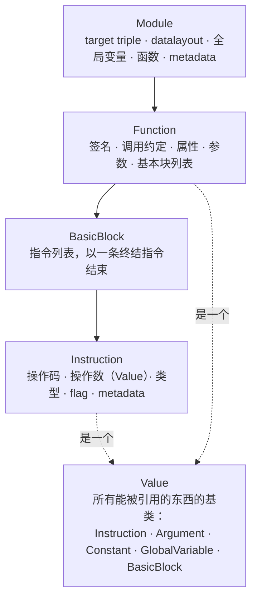
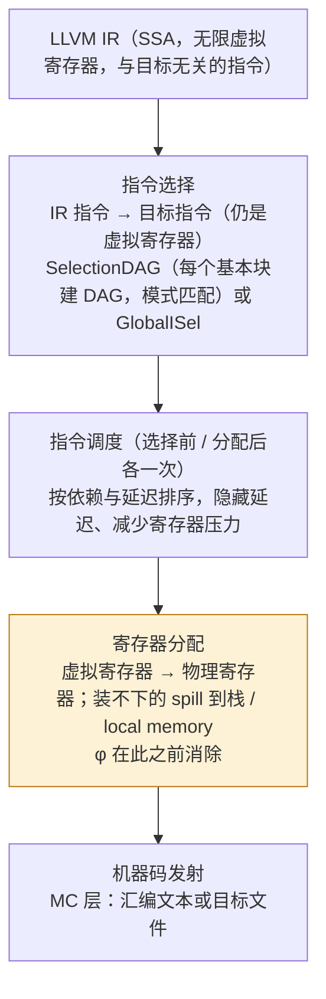
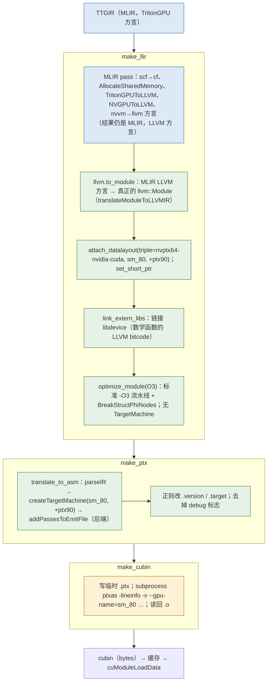

上一篇的词汇——IR、SSA、pass、lowering——最成熟的工业实现是 LLVM。它也是几乎所有 ML 编译器最后都要落到的一层：Triton 的 `make_llir` 产出 LLVM IR，XLA 的 GPU 后端产出 LLVM IR，TVM 的 CPU 与 CUDA 路径产出 LLVM IR，Inductor 的 CPU 路径产出 C++ 再交给 clang（也就是 LLVM）。读 Triton 的 `.llir` dump 时，哪些东西是 Triton 决定的、哪些是 LLVM 决定的、哪些要到 `ptxas` 才决定，不理解 LLVM 这一层就分不清。

这一篇讲 LLVM 本身的三层——IR、中端、后端——然后专讲 GPU 特有的部分：NVPTX 后端怎样表示地址空间和 GPU 内建函数，PTX 为什么是"虚拟"的，`ptxas` 作为第二个编译器决定了什么。所有例子用 Homebrew 的 LLVM 23.1.1（`clang`、`opt`、`llc`）在没有 GPU 的机器上跑出来。

总纲对这一篇提出的核心问题是：

> **Triton 生成的 LLVM IR 里没有任何一处提到寄存器数量，最终 kernel 却可能因为寄存器不够而 spill 到 local memory。这个决定是谁做的[^q0]、在哪一步[^q1]、能不能从 Triton 侧影响它[^q2]？**

## 一、总览

本文顺着**一段代码穿过 LLVM 的顺序**组织：IR 的结构（第二章）→ 中端的 pass 流水线（第三章）→ 后端的三件事（第四章）→ 然后拐进 GPU：NVPTX 后端（第五章）→ PTX 这个虚拟 ISA（第六章）→ `ptxas` 这个第二编译器（第七章）→ AMDGPU 后端作对照（第八章）→ 最后回到 Triton，看它在 `make_llir` / `make_ptx` / `make_cubin` 三步里分别调用了 LLVM 的哪些部分（第九章）。

| 章 | 主题 | 内容 |
|---|---|---|
| 二 | LLVM IR 的结构 | Module / Function / BasicBlock / Instruction；类型；`getelementptr`；attribute 与 metadata；地址空间；intrinsic；内联汇编 |
| 三 | 中端 | 新 pass manager 的嵌套结构；`-O2` 流水线长什么样；`-print-after-all`；Triton 怎样调用它 |
| 四 | 后端 | 指令选择、指令调度、寄存器分配、机器码发射；用 arm64 的输出看每一步做了什么 |
| 五 | NVPTX 后端 | triple 与 datalayout；地址空间 0–5；`ptx_kernel`；`llvm.nvvm.*`；一个向量加法从 IR 到 PTX；对齐决定向量宽度；shared memory |
| 六 | PTX | 虚拟 ISA：无限寄存器、`.version` / `.target`、前向兼容；Triton 为什么用正则改 PTX 头 |
| 七 | ptxas | 真正的寄存器分配与调度；spill 到 local memory；`-v` 的输出；`.maxnreg`；`n_regs` / `n_spills` 从哪来；Triton 侧的杠杆 |
| 八 | AMDGPU 对照 | LLVM 自己做完一切：`NumVgprs` / `Occupancy` 直接打印；`s_waitcnt` 由编译器插入 |
| 九 | LLVM 在 Triton 里 | `make_llir`：MLIR → LLVM IR、datalayout、libdevice、O3；`make_ptx`：`translate_to_asm`；`make_cubin`：`ptxas` 命令行；Triton 的 LLVM fork |
| 十 | 本文小结 | |
| 十一 | 自测 | 5 道题 |

## 二、LLVM IR 的结构

### 1. 四层容器



一个 `.ll` 文件就是一个 Module。Triton 一个 kernel 编译出一个 Module，里面一个 `define ptx_kernel void @matmul_kernel(...)` 加上若干 `declare` 的 intrinsic 和被内联剩下的辅助函数。

Instruction、Argument、Constant、Function 都是 `Value` 的子类——**任何能出现在操作数位置的东西都是 Value**，这是 use-def 链能统一表示的原因（第一篇 §四.3）。每个 Value 有一个类型；每条 Instruction 记住自己的操作数（`Use` 列表）和使用者（`users()`）。

### 2. 类型

| 类别 | 例子 | 说明 |
|---|---|---|
| 整数 | `i1`、`i8`、`i32`、`i64`、`i128` | 任意位宽，无符号 / 有符号由指令决定（`sdiv` / `udiv`、`icmp slt` / `ult`），不由类型决定 |
| 浮点 | `half`、`bfloat`、`float`、`double` | `bfloat` 有原生类型，FP8 没有——FP8 在 IR 里是 `i8`，Triton 的 FP8 运算是位运算与内联 PTX（第十篇） |
| 指针 | `ptr`、`ptr addrspace(1)` | LLVM 15 之后指针**不带指向类型**（opaque pointer），只带地址空间；GPU 后端用地址空间区分 global / shared / local |
| 向量 | `<4 x float>`、`<2 x i32>` | 固定长度 SIMD 向量；NVPTX 把 `<4 x float>` 的对齐 load 编成 `ld.global.v4` |
| 聚合 | `{ float, float, i32 }`、`[256 x float]` | Triton 把一个线程持有的张量元素表示成 `!llvm.struct<(f32, f32, …)>`——一个 `[128, 32]` 的 bf16 张量在 4 个 warp 上每线程 32 个元素，就是一个 32 元的 struct（第十篇） |
| 函数 / 标签 / metadata | `void (ptr, i32)`、`label`、`metadata` | |

### 3. 最重要的几条指令

拿第一篇的 `sum` 函数（`mem2reg` 之后）当参照：

```llvm
for.body:
  %idxprom = sext i32 %i.0 to i64
  %arrayidx = getelementptr inbounds i32, ptr %a, i64 %idxprom     ; ①
  %0 = load i32, ptr %arrayidx, align 4                            ; ②
  %mul = mul nsw i32 %0, 2                                         ; ③
  %add = add nsw i32 %s.0, %mul
  br label %for.inc
```

1. ① `getelementptr`（GEP）：**类型化的地址计算**。`getelementptr inbounds i32, ptr %a, i64 %idxprom` 是 `%a + %idxprom * sizeof(i32)`，但 IR 里不出现 `* 4`——元素类型 `i32` 是指令的一部分，缩放由后端做。`inbounds` 是前端的承诺"结果不会越出对象边界"，优化器据此可以做更激进的别名和范围推理。Triton 的 `tt.addptr` 下降到 LLVM 时就变成 GEP（第十篇）。
2. ② `load i32, ptr %arrayidx, align 4`：`align` 是**对齐承诺**，后端据此决定能不能用向量 / 宽 load（§五.4 会看到 `align 16` 与 `align 4` 生成完全不同的 PTX）。Triton 从 AxisInfo 算出对齐后写在这里。
3. ③ `mul nsw`：`nsw` 是 flag（no signed wrap），`nuw`、`exact`、`fast`（浮点）同类。它们是**从源语言语义继承的假设**，让优化器能做在没有假设时非法的变换（例如 `nsw` 允许把 `x * 2 / 2` 化成 `x`）。

### 4. attribute 与 metadata

| 机制 | 挂在哪 | 例子 | 语义 |
|---|---|---|---|
| 函数 / 参数 attribute | 函数、参数、返回值 | `noundef`、`readonly`、`noalias`、`align 16`、`dereferenceable(64)`、`nounwind` | **语义承诺**，优化器可以依赖；违反是未定义行为 |
| 指令 flag | 指令 | `nsw`、`nuw`、`inbounds`、`fast`、`volatile` | 同上 |
| metadata | 指令、函数、模块 | `!tbaa`（类型别名）、`!llvm.loop`（循环展开 / 向量化提示）、`!range`、`!dbg`（调试位置）、`!nvvm.annotations` | **可丢弃的提示**：任何 pass 可以删掉它而不影响正确性 |

区分两者对读 Triton 的 LLVM IR 有用：函数参数上的 `align 16` 是 Triton 从 `tt.divisibility` 翻译来的承诺；`!dbg` 是 Python 源码行号，`-lineinfo` 会把它带到 SASS 供 Nsight Compute 使用；NVPTX 特有的 `"nvvm.maxntid"` 这类**函数属性**（LLVM 23 已从 `!nvvm.annotations` metadata 迁到函数 attribute）告诉后端一个 block 最多多少线程。

### 5. 地址空间、intrinsic、内联汇编

三样 GPU 后端离不开的东西，通用 IR 里都有位置：

- **地址空间**：`ptr addrspace(N)`。语义由目标定义；NVPTX 用 1 表示 global、3 表示 shared、5 表示 local（§五.2）。`addrspacecast` 在它们之间转换。
- **intrinsic**：以 `llvm.` 开头的"内建函数"，`declare` 之后像普通函数一样 `call`，后端把它们变成特定指令。通用的如 `llvm.fma.f32`、`llvm.assume`、`llvm.memcpy`；目标特有的如 `llvm.nvvm.read.ptx.sreg.tid.x`（读 `%tid.x`）、`llvm.nvvm.barrier0`（`bar.sync 0`）、`llvm.nvvm.shfl.sync.bfly.i32`、`llvm.nvvm.mma.*`。
- **内联汇编**：`call i32 asm sideeffect "mov.u32 $0, %laneid;", "=r"()`——一段字符串直接传给汇编器，约束串 `"=r,r,r"` 说明操作数怎样绑到寄存器。后端不理解它的内容，只负责寄存器绑定与文本拼接。**Triton 的 `mma.sync`、`wgmma`、`cp.async`、`ldmatrix` 几乎全部是内联 PTX**（第十篇的 `PTXAsmFormat`），因为 LLVM 的 intrinsic 覆盖不全、更新不及时。

## 三、中端：pass manager 与 `-O2` 流水线

### 1. 新 pass manager 的嵌套结构

`opt -passes=` 接受的字符串是一棵树。`-O2` 展开后：

```bash
opt -passes='default<O2>' -print-pipeline-passes /dev/null -disable-output
```

输出一行 119 项（逗号分隔），开头是：

```text
memprof-remove-attributes,annotation2metadata,forceattrs,inferattrs,coro-early,
function<eager-inv>(ee-instrument<>,lower-expect,simplifycfg<...>,sroa<modify-cfg>,early-cse<>),
openmp-opt,ipsccp,called-value-propagation,globalopt,
function<eager-inv>(mem2reg,instcombine<max-iterations=1;no-verify-fixpoint>,simplifycfg<...>),
...
cgscc(devirt<4>(inline,function-attrs<skip-non-recursive-function-attrs>,
  function<eager-inv;no-rerun>(sroa<modify-cfg>,early-cse<memssa>,speculative-execution<only-if-divergent-target>,
    jump-threading,correlated-propagation,simplifycfg<...>,instcombine<...>,aggressive-instcombine,
    libcalls-shrinkwrap,tailcallelim,simplifycfg<...>,reassociate,constraint-elimination,
    loop-mssa(loop-instsimplify,loop-simplifycfg,licm<no-allowspeculation>,loop-rotate<...>,licm<allowspeculation>,simple-loop-unswitch<...>),
    simplifycfg<...>,instcombine<...>,loop(loop-idiom,indvars,simple-loop-unswitch<...>,loop-deletion,loop-unroll-full),
    sroa<modify-cfg>,vector-combine,mldst-motion<no-split-footer-bb>,gvn<>,sccp,bdce,instcombine<...>,
    jump-threading,correlated-propagation,adce,memcpyopt,dse,move-auto-init,loop-mssa(licm<allowspeculation>),
    coro-elide,simplifycfg<...>,instcombine<...>),function-attrs,function(require<should-not-run-function-passes>),coro-split,coro-annotation-elide)),
...
function<eager-inv>(...loop-vectorize<no-interleave-forced-only;no-vectorize-forced-only;>,
  infer-alignment,loop-load-elim,instcombine<...>,simplifycfg<...>,slp-vectorizer,vector-combine,instcombine<...>,
  loop-unroll<O2>,transform-warning,sroa<preserve-cfg>,infer-alignment,instcombine<...>,loop-mssa(licm<allowspeculation>),alignment-from-assumptions,loop-sink,instsimplify,div-rem-pairs,tailcallelim,simplifycfg<...>),
globaldce,constmerge,cg-profile,rel-lookup-table-converter,function(annotation-remarks),verify
```

读法：

- 最外层是 module pass 序列；`function<eager-inv>(...)` 是"对每个函数跑括号里的序列"的适配器；`cgscc(...)` 是"沿调用图的强连通分量自底向上"，内联器 `inline` 在里面——**先处理被调用者再处理调用者**，这样内联进来的代码已经是优化过的；`loop-mssa(...)` 和 `loop(...)` 是"对每个循环"，前者带 MemorySSA。
- 结构就是第一篇 §六.7 说的"变换 → 清理"：几乎每个大 pass 后面跟着 `instcombine` 和 `simplifycfg`。
- 注意顺序：`inline` 在最前面的 cgscc 里；循环优化（`licm`、`indvars`、`loop-unroll-full`）在函数内的中段；向量化（`loop-vectorize`、`slp-vectorizer`）在最后一个 function 序列里——**向量化之前所有标量优化要做完**，向量化之后只剩清理。
- `<...>` 里是每个 pass 的参数；`eager-inv` 表示 pass 之后立即失效 analysis（第一篇 §七.1）。

### 2. `-print-after-all`

```bash
opt -O2 -print-after-all sum.O0.ll -disable-output 2>&1 | rg -c 'IR Dump After'    # 126
```

126 次 dump：每个实际运行的 pass 实例一次（同一个 pass 名可能出现多次，作用在不同函数 / 循环上）。前十二个：

```text
; *** IR Dump After MemProfRemoveInfo on [module] ***
; *** IR Dump After Annotation2MetadataPass on [module] ***
; *** IR Dump After ForceFunctionAttrsPass on [module] ***
; *** IR Dump After InferFunctionAttrsPass on [module] ***
; *** IR Dump After CoroEarlyPass on [module] ***
; *** IR Dump After EntryExitInstrumenterPass on sum ***
; *** IR Dump After LowerExpectIntrinsicPass on sum ***
; *** IR Dump After SimplifyCFGPass on sum ***
; *** IR Dump After SROAPass on sum ***
; *** IR Dump After EarlyCSEPass on sum ***
; *** IR Dump After OpenMPOptPass on [module] ***
; *** IR Dump After IPSCCPPass on sum ***
```

`SROAPass`（Scalar Replacement of Aggregates）是 `-O2` 里实际做 `mem2reg` 工作的那个——它比 `mem2reg` 更强，还能拆开 struct 和数组的 `alloca`。Triton 在 LLVM 层的对应开关是环境变量 `LLVM_IR_ENABLE_DUMP=1`（`python/src/llvm.cc` 的 `optimize_module` 里 `setLLVMOption<bool>("print-after-all", true)`），第十三篇用。

### 3. Triton 怎样调用中端

`make_llir` 的最后一步 `llvm.optimize_module(llvm_mod, llvm.OPTIMIZE_O3, disable_slp_vectorizer=...)` 对应 `python/src/llvm.cc` 里的一段 C++，要点：

```cpp
PipelineTuningOptions tuningOptions;
tuningOptions.LoopUnrolling = true;
tuningOptions.LoopInterleaving = true;
tuningOptions.LoopVectorization = true;
tuningOptions.SLPVectorization = !disable_slp_vectorizer;      // ①
std::unique_ptr<TargetMachine> targetMachine = nullptr;
if (!arch.empty() && pluginFile.empty())
  targetMachine = createTargetMachine(mod, arch, enable_fp_fusion, features);   // ② NVIDIA 路径 arch 为空 → 无 TargetMachine
PassBuilder pb(targetMachine.get(), tuningOptions, std::nullopt, instrCbPtr);
...
pb.registerVectorizerStartEPCallback([&](FunctionPassManager &fpm, OptimizationLevel level) {
  fpm.addPass(BreakStructPhiNodesPass());                     // ③ Triton 自己的 pass
  fpm.addPass(InstCombinePass());
});
mpm.addPass(pb.buildPerModuleDefaultPipeline(opt));           // ④ 标准 -O3
mpm.run(*mod, mam);
```

1. ① SLP 向量化器在 sm_80 上被关掉（`make_llir`：`disable_slp_vectorizer = capability == 80`），源码注释说是绕开 `ptxas` 对某种向量化 PTX 的拒绝——一个"后面那个编译器有 bug，前面这个编译器让路"的实例。
2. ② **NVIDIA 路径跑 `-O3` 时没有 TargetMachine**：中端不知道目标是 NVPTX，所有依赖目标信息的成本模型（向量宽度、指令代价）用默认值。源码注释承认 SLP 向量化器因此可能生成过宽的向量。
3. ③ `BreakStructPhiNodesPass` 是 Triton 加进标准流水线的一个扩展点回调：Triton 生成的每线程张量是大 struct，循环携带值就是 struct 类型的 φ，标准 LLVM 优化对它很弱，这个 pass 把 struct φ 拆成标量 φ。
4. ④ 其余就是 `-O3` 的默认流水线——与 clang 编 C++ 用的同一个。

## 四、后端：三件事

后端把 IR 变成机器码，核心是三步，中间夹着几次"清理"：



用 arm64 看每一步的痕迹。`clang -O2 -S sum.c`（关掉向量化和展开）的核心循环：

```text
LBB0_2:
	ldr	w10, [x0], #4          ; ①
	add	w8, w8, w10, lsl #1    ; ②
	subs	x9, x9, #1             ; ③
	b.ne	LBB0_2
```

1. ① `ldr w10, [x0], #4`：**指令选择**把 GEP + load + 指针递增合成了一条带后递增寻址的 load——SelectionDAG 的模式匹配认出了"load 之后指针加 4"这个形状。
2. ② `add w8, w8, w10, lsl #1`：`mul nsw i32 %0, 2` 先被中端变成 `shl 1`，再被指令选择折进 `add` 的移位操作数——arm64 的加法指令自带一个移位器，一条指令做了两件事。
3. ③ `subs x9, x9, #1; b.ne`：循环变量 `i` 从 0 数到 n 变成了从 n **倒数到 0**——这是中端 `indvars` / `loop-strength-reduce` 与后端配合的结果：倒数的比较可以用减法的标志位直接跳转，省一条 `cmp`。
4. 全部值都在物理寄存器 `w8`、`w10`、`x0`、`x9` 里，没有栈操作——**寄存器分配**成功把所有活跃值装进了 31 个通用寄存器。

三步里对 GPU 最重要的是**寄存器分配**：GPU 的一个 SM 有固定大小的寄存器文件（A100 每 SM 65536 个 32 bit 寄存器），每个线程用得越多，同时驻留的线程就越少（occupancy）；用超过硬件上限或编译器设的上限就要 **spill**——把值写到栈上（GPU 上叫 local memory，物理上在 global memory 里，走 L1 / L2 缓存）。在 CPU 上 spill 是几个时钟的事，在 GPU 上是几百个时钟的全局访存。

**NVPTX 后端不做寄存器分配**——这是它与所有其他 LLVM 后端最大的区别，也是本篇核心问题的答案的一半。§五、六、七展开。

## 五、NVPTX 后端

### 1. triple、datalayout 与一个手写的 kernel

```llvm
target triple = "nvptx64-nvidia-cuda"
target datalayout = "e-p3:32:32-p4:32:32-p5:32:32-p6:32:32-p7:32:32-i64:64-i128:128-v16:16-v32:32-n16:32:64"

declare i32 @llvm.nvvm.read.ptx.sreg.tid.x()          ; ① threadIdx.x
declare i32 @llvm.nvvm.read.ptx.sreg.ctaid.x()        ;   blockIdx.x
declare i32 @llvm.nvvm.read.ptx.sreg.ntid.x()         ;   blockDim.x

define ptx_kernel void @vadd(ptr addrspace(1) %a, ptr addrspace(1) %b, ptr addrspace(1) %c, i32 %n) {   ; ②
entry:
  %tid = call i32 @llvm.nvvm.read.ptx.sreg.tid.x()
  %bid = call i32 @llvm.nvvm.read.ptx.sreg.ctaid.x()
  %bdim = call i32 @llvm.nvvm.read.ptx.sreg.ntid.x()
  %i0 = mul i32 %bid, %bdim
  %i = add i32 %i0, %tid
  %cmp = icmp slt i32 %i, %n
  br i1 %cmp, label %body, label %exit
body:
  %idx = sext i32 %i to i64
  %pa = getelementptr inbounds float, ptr addrspace(1) %a, i64 %idx
  %pb = getelementptr inbounds float, ptr addrspace(1) %b, i64 %idx
  %pc = getelementptr inbounds float, ptr addrspace(1) %c, i64 %idx
  %va = load float, ptr addrspace(1) %pa, align 4
  %vb = load float, ptr addrspace(1) %pb, align 4
  %s = fadd float %va, %vb
  store float %s, ptr addrspace(1) %pc, align 4
  br label %exit
exit:
  ret void
}
```

这是 `c[i] = a[i] + b[i]` 的 CUDA kernel 在 LLVM IR 层的样子，也是 Triton 的 `add_kernel` 下降到 LLVM 之后去掉向量化与 mask 的骨架。

1. ① GPU 的线程坐标是**特殊寄存器**（`%tid.x`、`%ctaid.x`），IR 里用 intrinsic 读。Triton 的 `tt.get_program_id` 下降为 `ctaid` 的读取，layout 展开时每个线程的 lane 号来自 `tid`（第十篇）。
2. ② `ptx_kernel` 调用约定标记这是一个 kernel 入口（`.entry`）而不是设备函数（`.func`）。`ptr addrspace(1)` 是 global memory 指针。datalayout 里 `p3:32:32`、`p4`、`p5` 说 shared / const / local 指针是 32 位（Triton 的 `nvidia.set_short_ptr()` 就是打开这个），`p` 默认（generic 和 global）是 64 位。

### 2. 地址空间

| 编号 | 名字 | PTX 状态空间 | 对应 CUDA | Triton 里 |
|---|---|---|---|---|
| 0 | generic | 无前缀 `ld` / `st` | 普通指针 | 几乎不用；generic 访存要在运行时判别空间，慢 |
| 1 | global | `ld.global` / `st.global` | `__global__` 参数指向的内存 | `!tt.ptr<T>` 默认下降到这里 |
| 3 | shared | `ld.shared` / `st.shared`、`cp.async…shared` | `__shared__` | `#shared` layout 的缓冲区、`convert_layout` 的 scratch、reduce 的跨 warp 交换 |
| 4 | const | `ld.const` | `__constant__` | kernel 参数（`ld.param`）在此类空间 |
| 5 | local | `ld.local` / `st.local` | 局部数组、spill | **spill 去的地方**；Triton IR 不主动生成 |
| 7 | shared::cluster | `ld.shared::cluster`、`mapa` | 线程块集群的分布式共享内存 | Hopper 多 CTA 路径（第九篇） |

### 3. 编成 PTX

```bash
llc -O2 -march=nvptx64 -mcpu=sm_80 -mattr=+ptx80 vadd.ll -o vadd.ptx
```

```text
//
// Generated by LLVM NVPTX Back-End
//

.version 8.0
.target sm_80
.address_size 64

.visible .entry vadd(
	.param .u64 .ptr .global .align 1 vadd_param_0,
	.param .u64 .ptr .global .align 1 vadd_param_1,
	.param .u64 .ptr .global .align 1 vadd_param_2,
	.param .u32 vadd_param_3
)
{
	.reg .pred 	%p<2>;                    // ①
	.reg .b32 	%r<9>;
	.reg .b64 	%rd<8>;

// %bb.0:                               // %entry
	mov.u32 	%r1, %tid.x;               // ②
	mov.u32 	%r2, %ctaid.x;
	ld.param.b32 	%r3, [vadd_param_3];
	mov.u32 	%r4, %ntid.x;
	mad.lo.s32 	%r5, %r2, %r4, %r1;        // ③
	setp.ge.s32 	%p1, %r5, %r3;
	@%p1 bra 	$L__BB0_2;                 // ④
// %bb.1:                               // %body
	ld.param.b64 	%rd4, [vadd_param_0];
	ld.param.b64 	%rd5, [vadd_param_1];
	ld.param.b64 	%rd6, [vadd_param_2];
	mul.wide.s32 	%rd7, %r5, 4;              // ⑤
	add.s64 	%rd1, %rd4, %rd7;
	add.s64 	%rd2, %rd5, %rd7;
	add.s64 	%rd3, %rd6, %rd7;
	ld.global.b32 	%r6, [%rd1];             // ⑥
	ld.global.b32 	%r7, [%rd2];
	add.rn.f32 	%r8, %r6, %r7;
	st.global.b32 	[%rd3], %r8;
$L__BB0_2:                              // %exit
	ret;
}
```

1. ① `.reg .b32 %r<9>` 声明了 9 个 32 位**虚拟寄存器**、8 个 64 位、2 个谓词。这不是分配结果，是"这段代码用到了这么多个名字"——每个 SSA 值一个。PTX 允许声明任意多。
2. ② 特殊寄存器读取直接变成 `mov`。
3. ③ `mad.lo.s32`：`bid * bdim + tid` 三条 IR 指令被指令选择合成一条乘加。
4. ④ 分支用**谓词**：`setp` 设置谓词寄存器，`@%p1 bra` 条件跳转。PTX 没有标志位。
5. ⑤ `mul.wide.s32 %rd7, %r5, 4`：GEP 的缩放 `× 4` 在这里出现，并且和 `sext` 合成一条 32→64 位的宽乘。
6. ⑥ `ld.global.b32`：地址空间 1 的 load 变成 `.global` 限定的指令；`align 4` 只允许 32 位标量访存。

### 4. 对齐决定向量宽度

把同一个 kernel 改成每线程处理 `<4 x float>`，两个版本只差 `align`：

```llvm
%va = load <4 x float>, ptr addrspace(1) %pa, align 16     ; 版本 A
%va = load <4 x float>, ptr addrspace(1) %pa, align 4      ; 版本 B
```

版本 A 的访存：


```text
	ld.global.v4.b32 	{%r2, %r3, %r4, %r5}, [%rd5];
	ld.global.v4.b32 	{%r6, %r7, %r8, %r9}, [%rd6];
	...
	st.global.v4.b32 	[%rd11], {%r15, %r16, %r17, %r18};
```


版本 B：

```text
	ld.global.b32 	%r2, [%rd5+12];
	ld.global.b32 	%r3, [%rd5+8];
	ld.global.b32 	%r4, [%rd5+4];
	ld.global.b32 	%r5, [%rd5];
	ld.global.b32 	%r6, [%rd6+12];
	...
	st.global.b32 	[%rd11+12], %r18;
	st.global.b32 	[%rd11+8], %r17;
	st.global.b32 	[%rd11+4], %r16;
	st.global.b32 	[%rd11], %r15;
```

**同样的 `<4 x float>` 向量类型，`align 16` 是一条 128 bit 指令，`align 4` 是四条 32 bit 指令**。NVPTX 后端只按 IR 上的对齐承诺决定能不能发向量访存——因为 `ld.global.v4` 要求地址 16 字节对齐，不对齐是非法地址错误。这条 `align` 从哪来？在 Triton 里，来自第六篇 AxisInfo 算出的 divisibility：`LoadStoreOpToLLVM` 把 `getVectorSize` 的结果同时写进向量类型和对齐（第十篇）。`tl.multiple_of` 提示错误时生成的就是版本 A 的指令配上不对齐的地址——运行时报 `misaligned address`。

### 5. shared memory 与 barrier

版本 A 还写了 shared memory：

```llvm
@smem = internal addrspace(3) global [256 x float] undef, align 16
...
  store <4 x float> %s, ptr addrspace(3) %ps, align 16
  call void @llvm.nvvm.barrier0()
  %vr = load <4 x float>, ptr addrspace(3) %pr, align 16
```

PTX：


```text
	// demoted variable
	.shared .align 16 .b8 smem[1024];
	...
	st.shared.v4.b32 	[%rd8], {%r13, %r12, %r11, %r10};
	bar.sync 	0;
	...
	ld.shared.v4.b32 	{%r15, %r16, %r17, %r18}, [%rd10];
```


地址空间 3 的全局变量变成 `.shared` 声明（"demoted"：它只被一个 kernel 用，后端把它从模块级降成 kernel 内部的声明），`llvm.nvvm.barrier0` 变成 `bar.sync 0`。Triton 的做法略有不同：它不为每个缓冲区声明一个变量，而是声明**一个** `global_smem` 数组（大小由 `AllocateSharedMemory` 算出，第十篇），所有缓冲区是它上面的偏移。

### 6. 内联汇编穿过后端

```llvm
%lid = call i32 asm sideeffect "mov.u32 $0, %laneid;", "=r"()
%x = call i32 asm "shfl.sync.bfly.b32 $0, $1, $2, 0x1f, 0xffffffff;", "=r,r,r"(i32 %lid, i32 16)
```

```text
	// begin inline asm
	mov.u32 %r2, %laneid;
	// end inline asm
	mov.b32 	%r3, 16;
	// begin inline asm
	shfl.sync.bfly.b32 %r1, %r2, %r3, 0x1f, 0xffffffff;
	// end inline asm
```

`$0`、`$1` 被替换成后端分配的虚拟寄存器名，其余文本原样输出。Triton 的 `mma.sync.aligned.m16n8k16.row.col.f32.bf16.bf16.f32`、`cp.async.cg.shared.global`、`ldmatrix.sync.aligned.m8n8.x4.shared.b16`、`wgmma.mma_async` 全部走这条路——`PTXAsmFormat.cpp` 是一个专门拼这些字符串和约束的小库。代价是 **LLVM 对这些指令的语义一无所知**：不能调度它们（`sideeffect` 更是禁止重排）、不知道它们的延迟、不能做任何优化。这是 Triton 把指令调度放在 TTGIR 层（`ReorderInstructions`、Pipeline）自己做的原因之一。

## 六、PTX：虚拟 ISA

PTX（Parallel Thread Execution）不是任何一代 GPU 的机器码。它是 NVIDIA 定义的**虚拟指令集**，特征：

| 特征 | 含义 | 后果 |
|---|---|---|
| 无限虚拟寄存器 | `.reg .b32 %r<9>` 可以声明任意多 | 寄存器分配不在 PTX 层做 |
| 类型化寄存器 | `.b32` / `.f32` / `.pred` / `.b64` | 与 SSA 值一一对应，几乎就是 LLVM IR 的另一种文本 |
| `.version` / `.target` | PTX ISA 版本、目标架构 | `ptxas` 按 `.target` 生成对应 SASS；`.version` 决定哪些指令合法 |
| 前向兼容 | 老 PTX 可以在新 GPU 上 JIT | cubin 只对一代架构有效，PTX 可以嵌入 fatbin 让驱动在运行时编译 |
| 与源码接近 | 基本块、标签、谓词分支都保留 | 可读，是调试 Triton 编译器时最常看的一层 |

`-mattr=+ptx80` 决定 `.version 8.0`，`-mcpu=sm_80` 决定 `.target sm_80`。两者共同限制后端能用哪些指令：`wgmma` 需要 `+ptx80` 与 `sm_90a`，`tcgen05` 需要 `+ptx86` 与 `sm_100a`。Triton 的 `get_features` 把 `ptx_version` 上限设为 LLVM 认识的最高值（3.8.0 是 `+ptx90`），`sm_arch_from_capability` 给 sm_90 及以后加 `a` 后缀（`sm_90a`：架构特有指令）。

`make_ptx` 生成 PTX 之后用两个正则把 `.version` 和 `.target` 改成运行时决定的值——因为 LLVM 版本认识的 PTX 版本可能比装的 `ptxas` 支持的低，而 `.target` 要与实际卡一致；这是"两个编译器版本不同步"的又一处胶水。

## 七、`ptxas`：第二个编译器

### 1. 它做什么

`ptxas` 把 PTX 编成某一代架构的 SASS（Streaming ASSembler，真实机器码）。它是一个完整的后端——**LLVM 后端没做的那些事在这里做**：

| 工作 | LLVM NVPTX | ptxas |
|---|---|---|
| 指令选择 | 做（IR → PTX 指令） | 再做一次（PTX → SASS，一条 PTX 可能拆成多条 SASS） |
| 指令调度 | 粗略（PTX 层） | **真正的**：按 SASS 的延迟表与发射端口排序，插入 `DEPBAR` / scoreboard 等待 |
| 寄存器分配 | **不做**（虚拟寄存器直出） | **做**：分配到 255 个物理寄存器以内，超出则 spill 到 local memory |
| 谓词与分支 | 保留 PTX 谓词 | 转成 SASS 的谓词与分支、插入 reconvergence 指令 |
| 常量传播、死代码 | 做过了 | 再做一遍（`-O3` 默认） |

`ptxas -v`（Triton 的 `make_cubin` 传了 `-v`）在 stderr 打印每个 kernel 的资源用量，格式是：

```text
ptxas info    : Compiling entry function 'matmul_kernel' for 'sm_80'
ptxas info    : Function properties for matmul_kernel
    N bytes stack frame, M bytes spill stores, K bytes spill loads
ptxas info    : Used R registers, S bytes smem, C bytes cmem[0]
```

`spill stores` / `spill loads` 非零就是有 spill；`Used R registers` 是每线程的寄存器数。Triton 默认不把这段日志打出来（`TRITON_DUMP_PTXAS_LOG=1` 才打，见 `knobs.nvidia.dump_ptxas_log`）。

### 2. Triton 怎样调用它

`make_cubin`（`third_party/nvidia/backend/compiler.py`）拼的命令行：

```text
ptxas -lineinfo [--fmad=false] -v [--opt-level 0] --regAllocOptLevel=2 [ptx_options…] --gpu-name=sm_80 <tmp>.ptx -o <tmp>.ptx.o
```

- `-lineinfo`：把 `.loc` 行号信息带进 cubin（Nsight Compute 用）；`TRITON_DISABLE_LINE_INFO=1` 时改成 `-lineinfo -suppress-debug-info`；
- `--fmad=false`：`enable_fp_fusion=False` 时禁止 `ptxas` 把分开的乘加合成 FMA（默认允许，这是 Triton 与 PyTorch eager 结果有微小差异的来源之一）；
- `--opt-level 0`：`knobs.nvidia.disable_ptxas_opt` 时用，让 SASS 与 PTX 一一对应便于调试；
- `--regAllocOptLevel=2`：源码注释"绕开 ptxas 13.x 的一个 bug"；
- `--gpu-name=sm_80` / `sm_90a` / `sm_100a`；
- Blackwell 用另一个版本的 `ptxas`（`cmake/nvidia-toolchain-version.json`：`ptxas 12.9.86`，`ptxas-blackwell 13.3.33`；`get_ptxas(arch)` 按架构选），源码注释说 13.x 在 Hopper 上有 bug。

`ptxas` 是一个闭源二进制，随 Triton 的 wheel 一起发布（`third_party/nvidia/backend/bin/ptxas`，从 NVIDIA 的 redist 下载），不依赖系统装的 CUDA。这也是 Triton 不需要 `nvcc` 的原因。

### 3. `n_regs` 与 `n_spills` 从哪来

`CompiledKernel.n_regs` / `n_spills` 不是从 `ptxas -v` 的日志解析的（`compiler.py` 里有一行 TODO 说应该这样做）。它们在 kernel **加载**时用驱动 API 查出来（`driver.c` 的 `loadBinary`）：

```c
cuFuncGetAttribute(&n_regs, CU_FUNC_ATTRIBUTE_NUM_REGS, fun);
cuFuncGetAttribute(&n_spills, CU_FUNC_ATTRIBUTE_LOCAL_SIZE_BYTES, fun);
n_spills /= 4;    // 字节 → 32 位字
```

所以 `n_spills` 精确地说是 **local memory 用量**（以 4 字节计），spill 是它的主要来源。`autotune` 的 `prune_configs_by` 可以按它们淘汰配置。

### 4. 寄存器与 occupancy

A100 每 SM 65536 个 32 位寄存器，每线程最多 255 个。一个 `num_warps=4` 的 Triton kernel 有 128 线程；若 `ptxas` 给每线程分了 128 个寄存器，一个 block 用 16384 个，一个 SM 最多驻留 4 个 block；若分了 255 个，只能驻留 2 个。驻留少意味着访存延迟没有足够的 warp 来掩盖——这是 GPU Kernel 系列第一篇讲的 occupancy 账，决定它的数字在 `ptxas` 手里。

### 5. Triton 侧的杠杆

Triton 不能直接指定"用多少寄存器"，但有几个间接手段：

| 杠杆 | 机制 | 影响 |
|---|---|---|
| `num_warps` | 每线程持有的元素数 = 张量元素数 / (32 × num_warps)；翻倍 num_warps 就把每线程的活跃值减半 | 最直接；代价是 warp 间同步与 shared memory 用量 |
| `maxnreg` 编译选项 | 生成 PTX 的 `.maxnreg N` 指令，`ptxas` 必须遵守，超出就 spill | 用于强行保住 occupancy |
| `num_stages` | 流水线多一个 stage 就多一组在飞的 load 目标寄存器（或 shared memory 缓冲） | 减 stage 可以减寄存器 |
| layout 选择 | `RemoveLayoutConversions` 决定哪些值以哪种 layout 活跃，`#mma` 累加器 `[128, 128]` f32 在 4 warp 上是每线程 128 个寄存器 | 第八篇 |
| `tl.dot` 累加器精度 | f32 累加器是 f16 的两倍寄存器 | 算法侧决定 |
| `knobs.nvidia.disable_ptxas_opt` | `--opt-level 0` | 只用于调试，性能极差 |

## 八、AMDGPU 对照

同一个 vadd 换成 AMD 的 intrinsic（`llvm.amdgcn.workitem.id.x`、`llvm.amdgcn.workgroup.id.x`）和调用约定 `amdgpu_kernel`：

```bash
llc -O2 -march=amdgcn -mcpu=gfx942 vadd_amd.ll -o -
```

```text
vadd:                                   ; @vadd
; %bb.0:                                ; %entry
	s_load_dword s0, s[4:5], 0x18            ; ① 标量寄存器：kernel 参数
	v_and_b32_e32 v0, 0x3ff, v0
	v_lshl_add_u32 v0, s8, 8, v0
	s_waitcnt lgkmcnt(0)                     ; ② 编译器插入的等待
	v_cmp_gt_i32_e32 vcc, s0, v0
	s_and_saveexec_b64 s[0:1], vcc           ; ③ exec mask 分支
	s_cbranch_execz .LBB0_2
; %bb.1:                                ; %body
	s_load_dwordx4 s[0:3], s[4:5], 0x0
	s_load_dwordx2 s[6:7], s[4:5], 0x10
	v_ashrrev_i32_e32 v1, 31, v0
	v_lshlrev_b64 v[0:1], 2, v[0:1]
	s_waitcnt lgkmcnt(0)
	v_lshl_add_u64 v[2:3], s[0:1], 0, v[0:1]
	v_lshl_add_u64 v[4:5], s[2:3], 0, v[0:1]
	global_load_dword v6, v[2:3], off
	global_load_dword v7, v[4:5], off
	v_lshl_add_u64 v[0:1], s[6:7], 0, v[0:1]
	s_waitcnt vmcnt(0)                       ; ② 等 load 完成
	v_add_f32_e32 v2, v6, v7
	global_store_dword v[0:1], v2, off
.LBB0_2:                                ; %exit
	s_endpgm
; TotalNumSgprs: 15                       ; ④
; NumVgprs: 8
; ScratchSize: 0
; Occupancy: 8
```

四处差别都指向同一个事实——**AMDGPU 后端是完整的后端，LLVM 自己做到机器码**：

1. ① `s0`、`v0` 是**物理**寄存器（标量 SGPR、向量 VGPR），寄存器分配已经完成；
2. ② `s_waitcnt`：GCN 的访存是显式异步的，等待指令由**编译器**插入（NVIDIA 上这是 `ptxas` 和硬件 scoreboard 的事）；
3. ③ 分支用 exec mask（`s_and_saveexec`）显式表达 SIMT 的分歧；
4. ④ 编译器直接打印出 `NumVgprs: 8`、`ScratchSize: 0`（无 spill）、`Occupancy: 8`——在 NVIDIA 路径上要等 `ptxas` 才知道的数字，这里 `llc` 一步给出。

Triton 的 AMD 后端（`third_party/amd`）因此比 NVIDIA 后端少一个阶段：`make_llir` → `make_amdgcn`（LLVM 直出 ISA 汇编）→ `make_hsaco`（用 LLVM 的 `lld` 链接成可加载的对象），没有 `ptxas` 这一级黑盒，寄存器压力在 LLVM 的 `-print-after-all` 里就能看到。第十一篇对照两个后端的完整流水线。

## 九、LLVM 在 Triton 里的位置

把 `third_party/nvidia/backend/compiler.py` 的三个阶段与本篇的内容对上：



几个值得记住的细节：

- **`.llir` dump 是优化之后的 LLVM IR**：`metadata`、`asm["llir"]` 里看到的是 `optimize_module(O3)` 跑完的结果，不是 `TritonGPUToLLVM` 刚吐出来的样子。要看优化前的，用 `MLIR_ENABLE_DUMP=1` 看 MLIR LLVM 方言那一步（第十三篇）。
- **libdevice**：`tl.exp`、`tl.sin` 这些数学函数不是 PTX 指令，是 NVIDIA 以 LLVM bitcode 形式提供的库函数（`libdevice.10.bc`，随 Triton 打包）；`link_extern_libs` 把它链进来，之后 `-O3` 会把这些函数内联。
- **两个版本的 LLVM 概念**：Triton 用的 LLVM 是 `triton-lang/llvm-project` fork 上的一个特定 commit（`cmake/llvm-info.json` 的 `llvm_hash`，本文写作时是 `5f07f818`，比 Homebrew 的 23.1.1 略新——它是 LLVM main 分支上的一个点），Triton 每隔几周跟一次上游。原因是 Triton 需要 MLIR 与 NVPTX 后端的最新特性（新架构的指令、新的 PTX 版本），等发布版跟不上。`cmake/llvm-info.json` 里每个平台一个 sha256，构建时下载预编译包。
- **`triton-llvm-opt`**：`bin/triton-llvm-opt.cpp` 是 Triton 自带的一个 `opt`，注册了 `BreakStructPhiNodesPass` 等 Triton 自己的 LLVM pass，用来单独测试它们。

## 十、本文小结

1. LLVM IR 的容器是 Module → Function → BasicBlock → Instruction，一切可引用的东西都是 `Value`。类型无符号性；指针只带地址空间；`getelementptr` 是类型化的地址计算。attribute / flag 是语义承诺，metadata 是可丢弃的提示。
2. `-O2` 是一棵 119 项的 pass 树：module 序列里嵌 `cgscc`（内联沿调用图自底向上）、`function`、`loop` 适配器；向量化在最后。Triton 用 `buildPerModuleDefaultPipeline(O3)` 跑标准流水线，加一个拆 struct φ 的自定义 pass，且 NVIDIA 路径**没有 TargetMachine**。
3. 后端三件事：指令选择（模式匹配合成指令）、调度、寄存器分配（spill）。arm64 的输出能看到全部三步的痕迹；NVPTX 后端只做前两步的 PTX 层版本，**不做寄存器分配**。
4. NVPTX：地址空间 1 / 3 / 5 是 global / shared / local；线程坐标是 intrinsic；`ptx_kernel` 是入口；**`align 16` 与 `align 4` 决定同一个 `<4 x float>` 是一条 `v4` 还是四条 `b32`**；shared memory 是 addrspace(3) 全局变量；`mma` / `cp.async` / `ldmatrix` 走内联汇编，LLVM 对其语义无知。
5. PTX 是虚拟 ISA：无限类型化寄存器、`.version` / `.target`、前向兼容。`ptxas` 是第二个编译器，做真正的调度与寄存器分配，spill 到 local memory；`-v` 报告寄存器与 spill；Triton 以 `-lineinfo -v --regAllocOptLevel=2 --gpu-name=sm_XX` 调用打包的 `ptxas`，Blackwell 用另一版本；`n_regs` / `n_spills` 在加载时由 `cuFuncGetAttribute` 查得。
6. Triton 影响寄存器分配的杠杆是间接的：`num_warps`、`maxnreg`、`num_stages`、layout。
7. AMDGPU 后端是完整后端：LLVM 直接分配 VGPR、插 `s_waitcnt`、打印 `Occupancy`，没有第二个编译器。
8. Triton 的 `make_llir` 是"MLIR LLVM 方言 → `llvm::Module` → datalayout → libdevice → O3"，`make_ptx` 是 `translate_to_asm` 加两个正则，`make_cubin` 是一次 `ptxas` 子进程调用。Triton 用的 LLVM 是自己 fork 上 pin 的一个 main 分支 commit。

## 十一、自测

1. 下面两行 LLVM IR 在 NVPTX 上分别生成什么访存指令？`%p` 是 `ptr addrspace(1)`，目标 sm_80。

   ```llvm
   %v = load <2 x i32>, ptr addrspace(1) %p, align 8
   %w = load <2 x i32>, ptr addrspace(1) %p, align 4
   ```

   <details markdown="1"><summary>答案</summary>
   第一行：一条 `ld.global.v2.b32 {%r1, %r2}, [%rd]`（64 bit 向量访存需要 8 字节对齐，满足）。第二行：两条 `ld.global.b32`，第二条地址 `[%rd+4]`——对齐只有 4 字节，后端拆成标量。向量类型本身不保证向量指令，`align` 才是决定因素。
   </details>

2. Triton 的 `make_llir` 调 `-O3` 时不传 TargetMachine。这会让哪类优化拿不到正确信息？为什么 Triton 在这种情况下还敢开 SLP 向量化器？

   <details markdown="1"><summary>答案</summary>
   所有依赖 `TargetTransformInfo` 的成本模型：向量化器（不知道目标向量宽度、指令代价）、内联器的阈值、循环展开的代价估计、`instcombine` 里少数目标相关的变换。源码注释说 SLP 向量化器在空 TargetMachine 下会生成过宽的向量，但它顺带做的调度对性能有帮助，关掉会退步，所以保留；在 sm_80 上因为 `ptxas` 拒绝某种它生成的 PTX 而单独关掉。这是一个"实测比理论更重要"的工程决定。
   </details>

3. 一个 Triton kernel 编出来 `n_spills = 48`。列出三个不改算法、能减少 spill 的 Triton 侧改动，并说明各自通过什么机制起作用。

   <details markdown="1"><summary>答案</summary>
   (1) 增大 `num_warps`（如 4 → 8）：每线程持有的张量元素减半，活跃寄存器减半——最直接。(2) 减小 `num_stages`（如 4 → 3）：软件流水每多一个 stage 就多一组等待中的 load 目标（寄存器或 shared memory）与相应的地址寄存器。(3) 减小 tile（`BLOCK_M` / `BLOCK_N`）：累加器 `[BLOCK_M, BLOCK_N]` f32 是最大的寄存器消耗者，在 4 warp 上 `[128, 128]` 是每线程 128 个寄存器。另外：设 `maxnreg` 不减少 spill，反而可能增加（它限制寄存器数以保 occupancy）；改 layout 提示（如避免一次 `convert_layout` 让两份 layout 同时活跃）是第八篇的手段。
   </details>

4. 为什么 Triton 的 `mma.sync` 用内联汇编而不是 LLVM 的 `llvm.nvvm.mma.*` intrinsic？这个选择让 LLVM 失去了什么能力，Triton 在哪一层把它补回来？

   <details markdown="1"><summary>答案</summary>
   intrinsic 覆盖不全（新指令、新 dtype 组合、`wgmma` 的各种形状和描述符形式往往先出现在 PTX 里，LLVM 的 intrinsic 定义滞后）且 Triton 需要精确控制指令文本与操作数绑定；内联汇编让 Triton 不依赖 LLVM 版本就能用新指令。失去的是 LLVM 对这些指令的语义理解：不能调度（`sideeffect` 禁止重排）、不知道延迟、不能与相邻指令合并或消除。Triton 在 TTGIR 层补回调度：`ReorderInstructions`、Pipeline 的 stage 分配、`Prefetch` 都是在 LLVM 看不见 `mma` 语义的前提下，由 Triton 自己在更高一层安排指令顺序（第九篇）。
   </details>

5. 同一份 PTX 文本，用 `--gpu-name=sm_80` 和 `--gpu-name=sm_90a` 各编一次，寄存器用量可能不同吗？为什么 Triton 的编译缓存 key 里要包含 `ptxas` 的版本（`backend.hash()` 返回 `f'{ptxas_version}-{arch}'`）？

   <details markdown="1"><summary>答案</summary>
   可能不同：SASS 指令集、延迟表、寄存器分配器的策略随架构变化，`ptxas` 对不同 `--gpu-name` 会做不同的调度与分配（且 PTX `.target` 也要匹配，否则报错）。缓存 key 含 `ptxas` 版本是因为**同一份 PTX 在不同版本的 `ptxas` 下生成不同的 cubin**——升级 CUDA 工具链后旧 cubin 不一定最优甚至可能触发不同的 bug，key 里带版本保证换了 `ptxas` 就重新编译；`arch` 在 key 里则是因为 cubin 只对一代架构有效。
   </details>

## 下一篇

LLVM 有一层 IR、一套 pass 基础设施，服务于所有前端。MLIR 把这套基础设施泛化：IR 的"内容"由方言定义，IR 的"形状"（Operation、Region、Block、Value、Type、Attribute）由框架定义，pass、pattern、打印、解析、验证全部通用。Triton 的 TTIR 和 TTGIR 就是两个 MLIR 方言，Triton 编译器的每一行 C++ 都在操作 MLIR 的数据结构。下一篇讲这些数据结构：Operation 为什么是唯一的单位，Region 怎样让循环和函数都成为 Op，ODS 怎样用 TableGen 声明一个 Op 并生成它的 C++ 类，Trait 与 Interface 怎样让 pass 不依赖具体 Op——最后对照读 `TritonOps.td` 里 `tt.load` 的定义。

[^q0]: `ptxas` 做的。LLVM 的 NVPTX 后端是所有 LLVM 后端里唯一不做寄存器分配的：它输出的 PTX 用无限多的类型化虚拟寄存器（`.reg .b32 %r<N>`，每个 SSA 值一个名字），把 PTX → SASS 的指令选择、真正的指令调度和寄存器分配全部留给 NVIDIA 的闭源工具 `ptxas`。物理寄存器不够时 `ptxas` 把值 spill 到 local memory（地址空间 5，物理上在 global memory，走 L1 / L2），`ptxas -v` 的 `spill stores / spill loads` 报告这一点。对照 AMDGPU 后端：LLVM 自己分配 VGPR、直接打印 `NumVgprs` 与 `Occupancy`，没有第二个编译器。详见[第四章](#四后端三件事)与[第七章](#七ptxas第二个编译器)。

[^q1]: 在 Triton 流水线的最后一个阶段 `make_cubin`：`make_llir` 产出 LLVM IR（`-O3` 优化过，仍是 SSA），`make_ptx` 用 LLVM 的 `translate_to_asm` 产出 PTX（仍是虚拟寄存器），`make_cubin` 把 PTX 写进临时文件、以 `ptxas -lineinfo -v --regAllocOptLevel=2 --gpu-name=sm_XX` 起子进程，读回 cubin。所以 `.llir` 与 `.ptx` 两层 dump 里都看不到寄存器数量；`n_regs` / `n_spills` 甚至不是从 `ptxas` 的日志解析的，而是 kernel 加载时 `driver.c` 用 `cuFuncGetAttribute(CU_FUNC_ATTRIBUTE_NUM_REGS / LOCAL_SIZE_BYTES)` 查出来的。详见[第七章 §2、§3](#七ptxas第二个编译器)与[第九章](#九llvm-在-triton-里的位置)。

[^q2]: 不能直接指定，能间接影响。直接手段只有一个：编译选项 `maxnreg` 生成 PTX 的 `.maxnreg N` 指令，`ptxas` 必须遵守（超出就 spill）——它是用来保 occupancy 的，不是减 spill 的。减少寄存器压力的手段都在 `ptxas` 之前的层：`num_warps` 翻倍让每线程持有的张量元素减半；`num_stages` 减一让在飞的 load 目标少一组；tile 变小让累加器（`[BLOCK_M, BLOCK_N]` f32 在 4 warp 上是每线程 `BLOCK_M × BLOCK_N / 128` 个寄存器）变小；layout 的选择（第八篇 `RemoveLayoutConversions`）决定有多少个值以多少种 layout 同时活跃。`ptxas` 拿到的 PTX 已经固定了活跃值的数量，它只决定怎么把它们塞进 255 个寄存器。详见[第七章 §4、§5](#七ptxas第二个编译器)。
