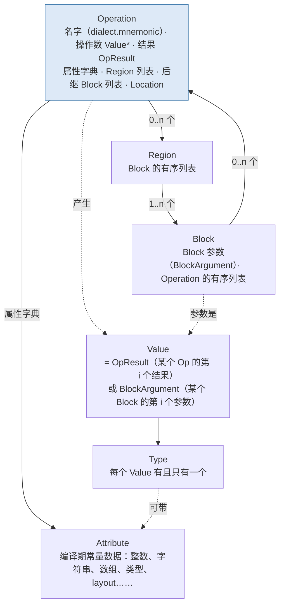

Triton 编译器的 C++ 部分——`lib/` 目录下五万多行——没有一行在操作"Triton 自己的 IR 数据结构"。它操作的全部是 MLIR 的：`Operation`、`Value`、`Block`、`Region`、`Type`、`Attribute`、`OpBuilder`、`PatternRewriter`。TTIR 和 TTGIR 只是两个**方言**（dialect）：一组用 TableGen 声明的 op、type 和 attribute，MLIR 把它们生成 C++ 类，然后用统一的基础设施去解析、打印、验证、变换。不认识这套数据结构，读 `Coalesce.cpp` 就像读一份没有类型定义的代码。

这一篇讲 MLIR 的**静态结构**：IR 由什么组成、方言是什么、ODS 怎样用一段声明生成几百行 C++、Trait 与 Interface 怎样让 pass 不依赖具体的 op。下一篇讲**变换**：pass、pattern rewrite、dialect conversion。两篇的例子用 Homebrew LLVM 23.1.1 的 `mlir-opt` 和 `mlir-tblgen` 跑，对照读的 Triton 源码是 v3.8.0 的 `TritonOps.td` 与 `TritonGPUAttrDefs.td`。

总纲对这一篇提出的核心问题是：

> **`scf.for` 是一个 Op，它的循环体是一个 Region，循环携带的值（iter_args）是 Block 的参数。在这种表示下，"循环不变量外提"这个优化需要哪些信息、从哪些接口拿？[^q0] 为什么 MLIR 不像 LLVM 那样用 φ 函数？[^q1]**

## 一、总览

本文按**从数据结构到声明再到实例**组织：先说 MLIR 为什么存在（第二章），然后自下而上讲它的核心数据结构（第三章）、方言这个组织单位（第四章）、用 ODS 声明一个 op 并看它生成什么（第五章）、Trait 与 Interface 这个"pass 与 op 之间的契约"（第六章）、Region 与结构化控制流（第七章）、Type 与 Attribute 怎样承载 layout（第八章），最后拿 Triton 的 `tt.load`、`tt.dot`、`tt.reduce`、`#ttg.blocked` 的定义逐行对照（第九章）。

贯穿的例子仍是第一篇的 `sum` 函数，这次写成 MLIR：

```mlir
func.func @sum(%a: memref<?xi32>, %n: index) -> i32 {
  %c0 = arith.constant 0 : index
  %c1 = arith.constant 1 : index
  %zero = arith.constant 0 : i32
  %two = arith.constant 2 : i32
  %s = scf.for %i = %c0 to %n step %c1 iter_args(%acc = %zero) -> (i32) {
    %v = memref.load %a[%i] : memref<?xi32>
    %m = arith.muli %v, %two : i32
    %acc2 = arith.addi %acc, %m : i32
    scf.yield %acc2 : i32
  }
  return %s : i32
}
```

| 章 | 主题 | 内容 |
|---|---|---|
| 二 | MLIR 为什么存在 | LLVM 单层 IR 的代价；"基础设施"与"内容"分离 |
| 三 | 核心数据结构 | Operation / Value / Block / Region / Type / Attribute；通用形式；"一切都是 Op" |
| 四 | Dialect | 命名空间 + op / type / attribute；标准方言各自的分工；Triton 加了哪几个 |
| 五 | ODS | 一个 `.td` 定义生成什么：类、访问器、builder、verifier、parser / printer；`hasFolder` 等开关 |
| 六 | Trait 与 Interface | `Pure`、`MemoryEffects`、`LoopLikeOpInterface`……LICM 从哪些接口拿信息 |
| 七 | Region 与结构化控制流 | SSACFG region；block 参数代替 φ；`IsolatedFromAbove`；`scf → cf` |
| 八 | Type 与 Attribute | 唯一化与不可变；`tensor<…, #layout>`：encoding 槽位；改 layout = 换类型 |
| 九 | 对照读 Triton | `TT_LoadOp`、`TT_DotOp`、`TT_ReduceOp`、`BlockedEncodingAttr`、`TritonGPU_Dialect` |
| 十 | 本文小结 | |
| 十一 | 自测 | 5 道题 |

## 二、MLIR 为什么存在

第一篇 §八.2 已经点到：LLVM 只有一层中端 IR，每个需要更高抽象的前端都自己造一层——Swift 的 SIL、Rust 的 MIR、Julia 的 SSA IR、TensorFlow 的 GraphDef 与 XLA 的 HLO、TVM 的 Relay 与 TIR、Glow 的两层 IR。每一层都重新实现同样的东西：文本打印与解析、验证器、pass manager、模式重写、位置信息、多线程。Chris Lattner 在 2019 年提出 MLIR（Multi-Level Intermediate Representation）时的观察是：**这些项目的"IR 基础设施"是相同的，不同的只是"IR 的内容"**。

MLIR 把两者分开：

| 基础设施（MLIR 提供，所有方言共用） | 内容（每个方言自己定义） |
|---|---|
| `Operation` / `Value` / `Block` / `Region` 的数据结构与内存管理 | 有哪些 op、每个 op 的操作数 / 结果 / 属性 / region |
| 文本格式的打印与解析（通用形式免费；自定义格式按声明生成） | 每个 op 的自定义汇编格式 |
| 验证框架（`verify()` 递归调用每个 op 的 verifier） | 每个 op 的合法性条件 |
| Pass manager、pattern rewrite driver、dialect conversion、数据流分析框架 | 具体的 pass 与 pattern |
| 位置信息、诊断、多线程 pass 执行 | — |
| Trait / Interface 机制 | 每个 op 声明自己有哪些 trait、实现哪些 interface |

结果是 Triton 的编译器可以只写"内容"：`TritonOps.td` 几百行声明了 TTIR 的全部 op，`TritonGPUAttrDefs.td` 声明了全部 layout，剩下的 C++ 都是 pass 和 pattern。打印、解析、验证、`--mlir-print-ir-after-all`、lit 测试用的文本往返，一行没写就有了。

## 三、核心数据结构

### 1. 包含关系



**Operation 是唯一的单位**。LLVM 有 Module、Function、BasicBlock、Instruction 四种不同的容器类；MLIR 只有 Operation 一种——模块是一个 Op（`builtin.module`），函数是一个 Op（`func.func`），循环是一个 Op（`scf.for`），加法也是一个 Op。它们的差别只在于有几个 Region、Region 里有什么。这让所有基础设施只需处理一种东西：pass manager 可以跑在任意一种 Op 上，遍历（`walk`）可以从任意一个 Op 开始递归。

### 2. 通用形式：数据结构的直接打印

同一段 IR 有两种文本。上面那段是**自定义汇编格式**（每个 op 自己声明的可读写法）。加 `--mlir-print-op-generic` 得到**通用形式**——它就是数据结构的逐字段打印：

```bash
mlir-opt --mlir-print-op-generic sum.mlir
```

```mlir
"builtin.module"() ({
  "func.func"() <{function_type = (memref<?xi32>, index) -> i32, sym_name = "sum"}> ({
  ^bb0(%arg0: memref<?xi32>, %arg1: index):
    %0 = "arith.constant"() <{value = 0 : index}> : () -> index
    %1 = "arith.constant"() <{value = 1 : index}> : () -> index
    %2 = "arith.constant"() <{value = 0 : i32}> : () -> i32
    %3 = "arith.constant"() <{value = 2 : i32}> : () -> i32
    %4 = "scf.for"(%0, %arg1, %1, %2) ({
    ^bb0(%arg2: index, %arg3: i32):
      %5 = "memref.load"(%arg0, %arg2) : (memref<?xi32>, index) -> i32
      %6 = "arith.muli"(%5, %3) <{overflowFlags = #arith.overflow<none>}> : (i32, i32) -> i32
      %7 = "arith.addi"(%arg3, %6) <{overflowFlags = #arith.overflow<none>}> : (i32, i32) -> i32
      "scf.yield"(%7) : (i32) -> ()
    }) : (index, index, index, i32) -> i32
    "func.return"(%4) : (i32) -> ()
  }) : () -> ()
}) : () -> ()
```

每一行的语法是固定的：`结果 = "方言.名字"(操作数) <{固有属性}> {可丢弃属性} ({region}) : 函数类型`。逐处看：

1. `"builtin.module"()` 是最外层的 Op，零操作数、零结果、一个 Region；`"func.func"()` 同样零操作数零结果，函数名和类型是它的**属性**（`sym_name`、`function_type`），函数体是它的 Region。**函数不是一种特殊的容器，是一个带属性和 Region 的普通 Op**。
2. `^bb0(%arg0: memref<?xi32>, %arg1: index):` 是 Region 里第一个 Block 的标签和**参数**。函数的参数不是 Op 的操作数，是函数体 Region 入口 Block 的参数——外面看不到它们，里面靠它们拿到输入。
3. `"scf.for"(%0, %arg1, %1, %2)`：四个操作数是下界、上界、步长、**iter_args 的初值**；一个结果 `%4` 是循环结束时携带值的终值；一个 Region，其 Block 的参数 `%arg2`（归纳变量）、`%arg3`（本轮的 `acc`）。**循环携带的值在 Region 内是 Block 参数，在 Region 外是 Op 的操作数（初值）与结果（终值）**——这是 MLIR 表达循环的方式，第七章展开。
4. `<{overflowFlags = #arith.overflow<none>}>`：尖括号里是**固有属性**（inherent attribute，Op 语义的一部分，ODS 里声明的），`#arith.overflow<none>` 是一个 `arith` 方言定义的属性值。花括号 `{…}` 里的是**可丢弃属性**（discardable attribute）——任何人可以往任何 op 上挂，op 自己不认识，pass 可以随手删；Triton 的 `tt.divisibility` 提示就是这一类（第六篇）。
5. `: (i32, i32) -> i32` 每个 op 后面的函数类型列出操作数类型与结果类型——通用形式不推断任何类型，全部写出来。
6. `"scf.yield"(%7)` 是 Block 的**终结 op**（terminator）：每个 Block 最后一个 op 必须是 terminator，它决定控制流去哪——`scf.yield` 把值交回父 op，`cf.br` 跳到别的 Block，`func.return` 返回。
7. 位置信息（`loc(...)`）默认不打印，加 `--mlir-print-debuginfo` 才出现；每个 Op 都有一个。

通用形式是读 MLIR 源码时最好的心智模型：`Operation` 类里就是这几个字段——`name`、`operands`、`results`、`attrs`（现在拆成 properties 与 discardable attrs）、`regions`、`successors`、`loc`。任何一个方言的任何一个 op 都能用这种形式打印和解析，**不需要该方言的任何代码**（`-allow-unregistered-dialect`）——lit 测试里偶尔见到的 `"unknown.op"()` 就是这样来的。

### 3. Value 的两种来源

`Value` 只有两种：某个 Op 的结果（`OpResult`），或某个 Block 的参数（`BlockArgument`）。没有第三种——没有"变量"，没有"内存位置"（memref 是一个值，它指向的内存不是 IR 里的 Value）。这就是 SSA：每个 Value 恰好被定义一次（作为结果或参数），`getDefiningOp()` 对 OpResult 返回它的 Op、对 BlockArgument 返回空。use-def 链存在 Value 里：`value.getUses()`、`value.getUsers()`、`value.replaceAllUsesWith(other)`——Triton 前端的 `iv_placeholder.replace_all_uses_with(iv)`（第五篇）就是最后这个方法的 Python 绑定。

### 4. Location

每个 Op 带一个 `Location`：`FileLineColLoc`（文件行列）、`NameLoc`（一个名字加内层位置——Triton 用它记 Python 变量名）、`CallSiteLoc`（内联时记调用链）、`FusedLoc`（多个位置合并）、`UnknownLoc`。位置是 IR 的一等成员而不是 metadata，pass 改写 op 时要把旧位置传给新 op（`rewriter.create<...>(op.getLoc(), ...)`），错误诊断（`op->emitError()`）自动带上它。

## 四、Dialect

### 1. 定义

Dialect 是一个命名空间加三组东西：Op、Type、Attribute。`arith.addi` 属于 `arith` 方言，`!tt.ptr<bf16>` 是 `tt` 方言的类型，`#ttg.blocked<…>` 是 `ttg` 方言的属性。前缀就是方言名。一个 `MLIRContext` 里注册了哪些方言，决定它能解析和验证哪些 op——Triton 的 `ir.load_dialects(context)` 与 `backend.load_dialects(context)`（第五篇 `compile()` 里）就是在做注册。

一个方言还可以声明：

- `dependentDialects`：它的 op 会生成哪些其他方言的 op（`TritonGPU_Dialect` 依赖 `tt` 与 `gpu`）；pass 声明 `getDependentDialects` 同理，pass manager 据此提前加载；
- 方言级的接口：`DialectInlinerInterface`（这个方言的 op 能不能被内联——Triton 实现了"全部可以"）、`OpAsmDialectInterface`（自定义属性别名的打印，`#blocked = …` 提到文件头就是它做的）；
- `hasOperationAttrVerify`：验证挂在任意 op 上的、本方言前缀的可丢弃属性（`ttg` 方言用它检查 `ttg.num-warps` 这类模块属性）。

### 2. 标准方言的分工

MLIR 自带几十个方言，Triton 用到的：

| 方言 | 内容 | 在 Triton 流水线里 |
|---|---|---|
| `builtin` | `module`、`unrealized_conversion_cast`、内建类型（`i32`、`f32`、`tensor`、`memref`、`vector`、`index`、函数类型）、内建属性 | 无处不在；`tensor<128x32xbf16, #blocked>` 是 builtin 的 `RankedTensorType` 带一个方言属性 |
| `func` | `func.func`、`func.call`、`func.return` | Triton 用自己的 `tt.func` / `tt.call` / `tt.return`（为了挂 Triton 特有的参数属性与调用约定），但结构相同 |
| `arith` | 整数 / 浮点算术、比较、`select`、类型转换、常量 | TTIR / TTGIR 里所有数值运算；`arith` 的 op 允许作用在 tensor 上，Triton 直接用 |
| `math` | `exp`、`log`、`sqrt`、`sin`…… | `tl.exp` 等 |
| `scf` | 结构化控制流：`for`、`if`、`while`、`yield`、`index_switch` | 前端生成；一直保留到 `make_llir` 的 `scf-to-cf` |
| `cf` | 非结构化控制流：`br`、`cond_br`、`switch` | 有 `return` 的 `if`；`scf-to-cf` 之后全部是它 |
| `ub` | `poison` | 前端的归纳变量占位 |
| `gpu` | GPU 抽象：`thread_id`、`block_id`、`barrier`、`shuffle`、`launch` | Triton 用它的少量 op 与类型（如 `gpu.barrier`），`ttg` 方言依赖它 |
| `nvvm` | NVIDIA 特有：`nvvm.read.ptx.sreg.tid.x`、`nvvm.barrier0`、`nvvm.shfl.sync`、`nvvm.mma.sync`、`nvvm.cp.async.*`、`nvvm.wgmma.*` | `TritonGPUToLLVM` 的目标之一；`nvvm → llvm` 是 `make_llir` 的一步 |
| `llvm` | LLVM IR 的 MLIR 镜像：`llvm.func`、`llvm.getelementptr`、`llvm.load`、`llvm.inline_asm`、`!llvm.struct<…>`、`!llvm.ptr<3>` | `TritonGPUToLLVM` 的主要目标；`translateModuleToLLVMIR` 把它变成真正的 LLVM IR（第二篇 §九） |
| `linalg`、`tensor`、`memref`、`vector`、`affine` | 张量 / 缓冲区 / 向量层的通用方言 | Triton **不用**——它有自己的张量语义（块级 + layout），这是 Triton 与 IREE / torch-mlir 路线的分叉点；本文例子用 `memref` 只是为了演示 |

Triton 自己的方言（`include/triton/Dialect/`）：

| 方言 | 前缀 | 内容 | 出现在 |
|---|---|---|---|
| Triton | `tt` | 块级张量 op，无 layout | TTIR、TTGIR（TTGIR 里 `tt.load` 仍是 `tt.load`，只是类型带了 layout） |
| TritonGPU | `ttg` | layout 属性（`#ttg.blocked`…）、`convert_layout`、shared memory（`local_alloc` / `local_load`、`memdesc` 类型）、异步拷贝、`warp_specialize` | TTGIR |
| TritonNvidiaGPU | `ttng` | Hopper / Blackwell 特有：TMA、`warp_group_dot`（wgmma）、`mbarrier`、TMEM、`tcgen05` | TTGIR（NVIDIA 后端） |
| NVGPU | `nvgpu` | `TritonGPUToLLVM` 的中间产物：几条需要特殊 lowering 的 PTX 指令的 op 形式 | `make_llir` 内部 |
| Gluon | `gluon` | 显式 layout 语言的 op（`set_auto_layout` 等） | Gluon 路径 |
| TritonInstrument | `tti` | ConSan / FpSan / GSan 的插桩 op | 开 sanitizer 时 |
| AMD 的三个 | `amdgpu`、`amdg`… | AMD 后端对应物 | `third_party/amd` |

## 五、ODS：一段声明生成什么

### 1. TableGen 与 ODS

ODS（Operation Definition Specification）是 MLIR 用 LLVM 的 **TableGen** 语言声明 op 的方式。TableGen 是一种记录（record）描述语言——定义一些带字段的类，然后实例化记录，由后端程序（`mlir-tblgen`）读取记录生成 C++。LLVM 用它声明指令集和寄存器；MLIR 用它声明 op、type、attribute、interface、pass、pattern（DRR）。

一个最小的方言与 op（`toy/ToyOps.td`，模仿 `tt.addptr`）：

```text
include "mlir/IR/OpBase.td"
include "mlir/Interfaces/SideEffectInterfaces.td"

def Toy_Dialect : Dialect {
  let name = "toy";
  let cppNamespace = "::toy";
}

class Toy_Op<string mnemonic, list<Trait> traits = []> : Op<Toy_Dialect, mnemonic, traits>;

def Toy_AddPtrOp : Toy_Op<"addptr", [Pure, SameOperandsAndResultShape,
                                      TypesMatchWith<"result type matches ptr", "result", "ptr", "$_self">]> {
  let summary = "pointer plus element offset";
  let arguments = (ins AnyType:$ptr, AnyInteger:$offset);          // ① 操作数与属性
  let results = (outs AnyType:$result);                              // ② 结果
  let assemblyFormat = "$ptr `,` $offset attr-dict `:` type($result) `,` type($offset)";   // ③ 文本格式
  let hasFolder = 1;                                                 // ④ 要手写 fold()
}
```

生成：

```bash
mlir-tblgen -gen-op-decls -I /opt/homebrew/opt/llvm/include toy/ToyOps.td > toy/ToyOps.h.inc    # 202 行
mlir-tblgen -gen-op-defs  -I /opt/homebrew/opt/llvm/include toy/ToyOps.td > toy/ToyOps.cpp.inc  # 311 行
```

十几行声明生成五百多行 C++。声明的每个字段对应生成物的一部分：

| ODS 字段 | 生成什么 |
|---|---|
| `Op<Toy_Dialect, "addptr", [...]>` | `class AddPtrOp : public ::mlir::Op<AddPtrOp, Trait1, Trait2, …>`；`getOperationName()` 返回 `"toy.addptr"` |
| ① `arguments = (ins AnyType:$ptr, AnyInteger:$offset)` | 访问器 `getPtr()`、`getOffset()`（返回 `TypedValue<Type>` / `TypedValue<IntegerType>`）；`odsIndex_ptr = 0`；类型约束进入 `verifyInvariants` |
| ② `results = (outs AnyType:$result)` | `getResult()`；`OneResult` trait 自动加上 |
| 属性（本例没有；如 `I32Attr:$axis`） | `getAxis()` / `setAxis()`；属性名列表 `getAttributeNames()`；进入 `Properties` 结构体 |
| ③ `assemblyFormat` | `parse(OpAsmParser&, OperationState&)` 与 `print(OpAsmPrinter&)` 的完整实现 |
| trait 列表 | 作为 `::mlir::Op<…>` 的模板参数——trait 就是 CRTP 混入的基类 |
| `TypesMatchWith<…>` 等约束 | `verifyInvariantsImpl()` 里的检查代码 |
| ④ `hasFolder = 1` | 只生成声明 `OpFoldResult fold(FoldAdaptor)`；**实现要手写**在 `Ops.cpp` 里 |
| `hasVerifier = 1` / `hasCanonicalizer = 1` | 同上：声明 `verify()` / `getCanonicalizationPatterns()`，手写实现 |
| 若干 `build(...)` 重载 | `OpBuilder::create<AddPtrOp>(loc, resultType, ptr, offset)` 用的构造函数 |
| `Adaptor` / `GenericAdaptor<RangeT>` | 一个"只有操作数与属性、没有 Operation"的视图——Dialect Conversion 用它把**已转换的**操作数传给 pattern（第四篇） |

生成的类头（节选）：

```cpp
class AddPtrOp : public ::mlir::Op<AddPtrOp,
    ::mlir::OpTrait::ZeroRegions, ::mlir::OpTrait::OneResult,
    ::mlir::OpTrait::OneTypedResult<::mlir::Type>::Impl, ::mlir::OpTrait::ZeroSuccessors,
    ::mlir::OpTrait::NOperands<2>::Impl, ::mlir::OpTrait::OpInvariants,
    ::mlir::ConditionallySpeculatable::Trait, ::mlir::OpTrait::AlwaysSpeculatableImplTrait,
    ::mlir::MemoryEffectOpInterface::Trait,                    // ← Pure 展开成这三个
    ::mlir::OpTrait::SameOperandsAndResultShape> {
public:
  using Op::Op;
  using Adaptor = AddPtrOpAdaptor;
  using FoldAdaptor = GenericAdaptor<::llvm::ArrayRef<::mlir::Attribute>>;
  static constexpr int odsIndex_ptr = 0;
  static constexpr int odsIndex_offset = 1;
  static constexpr ::llvm::StringLiteral getOperationName() { return ::llvm::StringLiteral("toy.addptr"); }
  ::mlir::TypedValue<::mlir::Type> getPtr() { ... }
  ::mlir::TypedValue<::mlir::IntegerType> getOffset() { ... }
  static void build(::mlir::OpBuilder &odsBuilder, ::mlir::OperationState &odsState,
                    ::mlir::Type result, ::mlir::Value ptr, ::mlir::Value offset);
  ::llvm::LogicalResult verifyInvariants();
  ::mlir::OpFoldResult fold(FoldAdaptor adaptor);
  static ::mlir::ParseResult parse(::mlir::OpAsmParser &parser, ::mlir::OperationState &result);
  void print(::mlir::OpAsmPrinter &_odsPrinter);
};
```

几个要点：

- **`AddPtrOp` 不持有数据**。它是一个 `Operation*` 的薄包装（`Op<…>` 基类只有一个指针成员），`getPtr()` 就是 `getOperation()->getOperand(0)`。`cast<AddPtrOp>(op)`、`dyn_cast<AddPtrOp>(op)` 是零成本的视图转换，判断依据是 `op->getName()`。这就是为什么 Triton 源码里到处是 `if (auto load = dyn_cast<tt::LoadOp>(op))`——把一个泛型 `Operation*` 看成一个具体 op。
- **trait 是模板参数**（CRTP）。`Pure` 在 TableGen 层展开成三个 trait；`OneResult`、`NOperands<2>` 是从 `arguments` / `results` 推出来的。第六章讲 trait 的用途。
- `Properties` 是 MLIR 近年把固有属性从"字符串键的字典"改成"结构体字段"的机制——通用形式里 `<{…}>` 就是 properties。

### 2. 生成的 verifier

`-gen-op-defs` 生成的 `verifyInvariantsImpl` 把 `arguments` 里的类型约束（`AnyInteger`）和 trait 里的约束（`TypesMatchWith`、`SameOperandsAndResultShape`）逐条检查：

```cpp
::llvm::LogicalResult AddPtrOp::verifyInvariantsImpl() {
  {
    unsigned index = 0; (void)index;
    auto valueGroup0 = getODSOperands(0);
    for (auto v : valueGroup0) {
      if (::mlir::failed(__mlir_ods_local_type_constraint_ToyOps1(*this, v.getType(), "operand", index++)))
        return ::mlir::failure();
    }
    auto valueGroup1 = getODSOperands(1);
    for (auto v : valueGroup1) {
      if (::mlir::failed(__mlir_ods_local_type_constraint_ToyOps2(*this, v.getType(), "operand", index++)))
        return ::mlir::failure();
    }
  }
  ...
}
```

`module.verify()`（Triton 前端 `ast_to_ttir` 的最后一步）递归调用每个 op 的 `verifyInvariants` 和手写的 `verify`。Triton 前端生成的 IR 如果类型对不上（例如 `tt.load` 的 mask 与 ptr 的 shape 不同），错误就在这里报出——不是在 Python 层，而是 MLIR 的 verifier。`triton-opt` 每个 pass 之后默认也跑一次 verifier（`-verify-each`），这是 pass 写错时最早的报警。

### 3. 自定义汇编格式

`assemblyFormat = "$ptr `,` $offset attr-dict `:` type($result) `,` type($offset)"` 是一个小型 DSL：`$名字` 打印该操作数 / 属性，反引号里是字面量，`type(...)` 打印类型，`attr-dict` 打印剩余的可丢弃属性，`(`…`^)?` 是可选段，`oilist(...)` 是无序可选段列表。它同时生成 `parse` 和 `print`，保证往返一致。`hasCustomAssemblyFormat = 1` 则是"我自己手写 parse / print"——`scf.for` 那种 `%i = %lb to %ub step %s iter_args(...)` 的复杂语法就是手写的。

## 六、Trait 与 Interface

### 1. 两种契约

pass 面对的是任意方言的任意 op。它不能为每种 op 写特例，需要一套"问 op 问题"的机制：

- **Trait**：编译期的静态性质，写在类型里。`op->hasTrait<OpTrait::IsTerminator>()`。它不带方法或只带静态方法；表示"这个 op 满足某个不变量"。
- **Interface**：运行时可查询的一组方法，op 实现它就能被 `dyn_cast<SomeInterface>(op)` 转成接口视图，然后调用方法。表示"这个 op 能回答某类问题"。

| 名称 | 类型 | 含义 | 谁在用 |
|---|---|---|---|
| `Pure` | trait 组合 | 无内存副作用 + 总是可推测执行（= `NoMemoryEffect` + `AlwaysSpeculatable`） | CSE、DCE、LICM、canonicalize：可以自由删、合并、移动 |
| `NoMemoryEffect` | interface 的一种实现 | 不读不写内存 | 同上 |
| `MemoryEffectsOpInterface` | interface | `getEffects()` 返回读 / 写 / 分配 / 释放哪些**资源**（资源可以是具体的 memref 值，也可以是方言定义的抽象资源，如 Triton 的 `GlobalMemory`） | LICM 判断 load 能不能外提；DCE 判断 store 不能删；调度判断两个 op 能不能交换 |
| `RecursiveMemoryEffects` | trait | 本 op 的副作用等于其 Region 内所有 op 的副作用之和 | `scf.for`、`scf.if`：循环有没有副作用取决于循环体 |
| `ConditionallySpeculatable` | interface | 能不能在原本不会执行的路径上提前执行（除零、越界读不能） | LICM 外提到循环外意味着即使循环零次也会执行 |
| `Commutative` | trait | 操作数可交换 | canonicalize 把常量挪到右边，CSE 认为 `a+b` 与 `b+a` 相同 |
| `SameOperandsAndResultType` / `SameOperandsAndResultShape` / `Elementwise` | trait | 类型 / 形状约束；逐元素 | verifier；Triton 的 `Elementwise` 让 `ReorderBroadcast` 知道哪些 op 可以与 broadcast 交换 |
| `InferTypeOpInterface` | interface | `inferReturnTypes(...)` 从操作数算结果类型 | builder 可以省略结果类型；Dialect Conversion 在换了操作数类型后重算结果类型 |
| `IsTerminator` / `ReturnLike` | trait | Block 末尾的 op；把值交给父 op | 控制流分析 |
| `SingleBlock` / `SingleBlockImplicitTerminator<YieldOp>` | trait | Region 只有一个 Block；末尾隐含 yield | `scf.for`、`tt.reduce` |
| `IsolatedFromAbove` | trait | Region 内不能引用 Region 外的 Value | `func.func`、`builtin.module`：函数体不能用外面的值——所以 pass manager 可以并行处理各函数 |
| `LoopLikeOpInterface` | interface | `getLoopInductionVars()`、`getRegionIterArgs()`、`getYieldedValues()`、`getLoopBody()`、`moveOutOfLoop(op)`、`isDefinedOutsideOfLoop(value)` | LICM、循环流水化、`LoopAwareCSE` |
| `RegionBranchOpInterface` | interface | 控制流怎样进出各 Region：哪个 Region 先执行、哪些操作数传给哪个 Region 的参数、Region 结束后去哪 | 数据流分析框架（AxisInfo 靠它知道 `scf.for` 的 yield 值流回 block 参数，第六篇）、`scf → cf` 转换 |
| `DotOpInterface`（Triton） | interface | `tt.dot` 与 `tt.dot_scaled` 共有的 `verifyDims` 等 | `AccelerateMatmul` 统一处理两种 dot |

### 2. LICM 的例子

回答核心问题的第一问。`mlir-opt --loop-invariant-code-motion` 对：

```mlir
scf.for %i = %c0 to %n step %c1 {
  %inv = arith.muli %x, %y : i32
  %v = memref.load %q[%c0] : memref<?xi32>
  %s = arith.addi %inv, %v : i32
  memref.store %s, %p[%i] : memref<?xi32>
}
```

结果：

```mlir
%0 = arith.muli %arg3, %arg4 : i32          // 外提了
scf.for %arg5 = %c0 to %arg2 step %c1 {
  %1 = memref.load %arg1[%c0] : memref<?xi32>   // 没外提
  %2 = arith.addi %0, %1 : i32
  memref.store %2, %arg0[%arg5] : memref<?xi32>
}
```

`muli` 出去了，`load` 留下了——尽管它的地址 `%q[%c0]` 也是不变的。LICM 用了四个接口：

1. **`LoopLikeOpInterface`**：`scf.for` 实现它，所以 LICM 知道这是一个循环、循环体是哪个 Region、哪些值是归纳变量与 iter_args（这些值定义在循环内，依赖它们的 op 不能外提）。**不需要像 LLVM 那样从 CFG 上找回边和自然循环**——循环是 IR 里的一等对象。
2. **`isDefinedOutsideOfLoop(value)`**：判断 `%x`、`%y` 是循环外的值，`%i`（Block 参数）不是。
3. **`MemoryEffectsOpInterface`**：`arith.muli` 是 `Pure`——无内存效应；`memref.load` 报告"读 `%q`"，循环里的 `memref.store` 报告"写 `%p`"。MLIR 的 LICM（`mlir/Transforms/Utils/LoopInvariantCodeMotionUtils.cpp`）只外提**无副作用**的 op，一个有读效应的 load 即使地址不变也不外提——它不做别名分析，不知道 `%p` 与 `%q` 会不会是同一块内存。这是"保守正确"（第一篇 §五.4）。
4. **`ConditionallySpeculatable`**：`muli` 是 `AlwaysSpeculatable`（提前执行没有危害）；`arith.divsi` 不是（除零），即使操作数不变也不能外提到循环外——循环可能零次迭代，外提就凭空制造了一次除法。

Triton 的 `TritonLICM`（`lib/Dialect/Triton/Transforms/LoopInvariantCodeMotion.cpp`）在通用版之上多做一件事：把地址不变的 `tt.load` 也外提——它知道 Triton 的语义里 load 与 store 默认不别名（程序员负责），并要求证明循环至少执行一次（否则外提的 load 可能读到非法地址）。它用的接口相同，只是放松了第 3 条。

**这就是接口的意义**：LICM 的实现里没有出现 `scf::ForOp` 或 `arith::MulIOp` 的名字。换成 `affine.for`、换成 Triton 未来任何新的逐元素 op，只要实现了相应接口，同一个 pass 自动适用。Triton 给 `tt.load` 声明 `MemoryEffectsOpInterface`（读 `GlobalMemory` 资源）、给 `tt.store` 声明 `MemWrite<GlobalMemory>`，就是为了让 MLIR 的 CSE / DCE / LICM 正确对待它们：`tt.load` 的结果没人用也不能被 DCE 删吗？能——它只有读效应，读没有副作用；`tt.store` 不能删。

## 七、Region 与结构化控制流

### 1. SSACFG Region

一个 Region 是若干 Block 的列表；Block 之间用 terminator 的后继（successor）连成 CFG——这叫 **SSACFG region**（MLIR 还有一种 Graph region，Block 内 op 无顺序，用于数据流图，Triton 不用）。`func.func` 的 Region 可以有多个 Block（`cf.br` 跳转），`scf.for` 的 Region 只有一个（`SingleBlock`）。

支配关系在 Region 内定义：同一 Block 内按顺序，跨 Block 按 CFG；Region 内的 op 可以使用**外层 Region** 定义的值（`scf.for` 循环体用 `%two`），除非该 op 是 `IsolatedFromAbove`（函数体不能用函数外的值）。MLIR 的 `DominanceInfo` 处理这个嵌套：判断"值 A 在位置 B 可用"要沿 Region 树往上走。

### 2. Block 参数代替 φ

`--convert-scf-to-cf` 把 `sum` 的循环变成非结构化形式：

```mlir
func.func @sum(%arg0: memref<?xi32>, %arg1: index) -> i32 {
  %c0 = arith.constant 0 : index
  %c1 = arith.constant 1 : index
  %c0_i32 = arith.constant 0 : i32
  %c2_i32 = arith.constant 2 : i32
  cf.br ^bb1(%c0, %c0_i32 : index, i32)          // ① 跳转时传实参
^bb1(%0: index, %1: i32):  // 2 preds: ^bb0, ^bb2   // ② 块参数 = LLVM 的两个 φ
  %2 = arith.cmpi slt, %0, %arg1 : index
  cf.cond_br %2, ^bb2, ^bb3
^bb2:  // pred: ^bb1
  %3 = memref.load %arg0[%0] : memref<?xi32>
  %4 = arith.muli %3, %c2_i32 : i32
  %5 = arith.addi %1, %4 : i32
  %6 = arith.addi %0, %c1 : index
  cf.br ^bb1(%6, %5 : index, i32)               // ③ 回边也传实参
^bb3:  // pred: ^bb1
  return %1 : i32
}
```

与第一篇 `mem2reg` 之后的 LLVM IR 逐行对应：`^bb1` 是 `for.cond`，它的两个参数 `%0`、`%1` 就是 `%i.0 = phi [0, entry], [%inc, for.inc]` 和 `%s.0 = phi [...]`。差别只在**信息放在哪**：φ 把"从哪个前驱来取哪个值"写在目标块开头的 φ 指令里；Block 参数把它写在每个前驱的跳转指令上（① ③ 的实参列表）。

为什么 MLIR 选后者（核心问题第二问）：

1. **φ 是"假指令"**：它必须排在块的最前面、多个 φ 之间是并行赋值语义（不能按顺序解释）、它的操作数引用的是前驱块而不是普通的值——每个处理指令的 pass 都要为 φ 写特例。Block 参数不是指令，它是 Block 的属性，普通 op 的遍历根本看不见它，只有处理 terminator 的代码需要关心。
2. **与函数参数、Region 参数统一**：`func.func` 的入口 Block 参数是函数参数，`scf.for` 的 Region 参数是归纳变量和 iter_args，`cf.br` 的目标 Block 参数是 φ——**三者是同一个机制** `BlockArgument`。第五篇的前端用同一段代码（`_find_carries` + `set_value`）处理 `for` 的携带值和 `if` 的汇合值，正因如此。
3. **结构化控制流下根本不需要汇合点的显式表示**：`scf.for` 的 iter_args 在 Region 边界上进出，"汇合"由 `RegionBranchOpInterface` 描述（初值与 yield 值都流向 Block 参数），数据流分析框架据此工作（第六篇 AxisInfo 的循环处理）。到了 `scf → cf` 之后才需要 Block 参数在 CFG 上扮演 φ，而那一步是机械的。

### 3. Triton 为什么把 `scf` 保留到最后

`make_llir` 的前几个 pass 里才有 `add_scf_to_cf`。在此之前，所有 TTGIR 级的循环变换——流水化（`Pipeline`）、`LoopAwareCSE`、`TritonLICM`、`FuseNestedLoops`、`OptimizeAccumulatorInit`——都作用在 `scf.for` 上，用 `LoopLikeOpInterface` 拿归纳变量、iter_args、yield 值，用 Region 的边界确定循环体。如果早早下降到 `cf`，每个 pass 都得先从 CFG 重新识别循环（第一篇 §八.1 说的"丢掉的信息要重新发现"）。`scf → cf` 放在 lowering 到 LLVM 方言之前，是因为 LLVM 方言只有 `llvm.br` / `llvm.cond_br`，没有结构化循环。

## 八、Type 与 Attribute：layout 的载体

### 1. 唯一化与不可变

`Type` 与 `Attribute` 都是 **MLIRContext 里唯一化（uniqued）的不可变对象**：`i32` 在整个上下文里只有一个实例，`tensor<128x32xbf16>` 也只有一个；比较两个类型是否相同就是比较指针。创建（`IntegerType::get(ctx, 32)`、`RankedTensorType::get(shape, elemTy, encoding)`）要么找到已有的返回，要么新建并登记。

后果：**类型不能就地修改**。要把一个 `tensor<128x32xbf16, #blocked1>` 的值变成 `#blocked2` 的，不能改类型，只能创建新 op（`ttg.convert_layout`）产生一个新类型的新值，然后 `replaceAllUsesWith`。Triton 的所有 layout 变换 pass（第七、八篇）都是这个形状：算出目标 layout → 建新 op → 替换使用 → 删旧 op。

### 2. `RankedTensorType` 的 encoding 槽位

MLIR 内建的 `tensor` 类型有三个参数：shape、元素类型、和一个**可选的 `Attribute encoding`**——MLIR 没有规定 encoding 是什么，留给方言填。稀疏张量方言填稀疏格式，Triton 填 layout：

```text
tensor<128x32xbf16>                                         // TTIR：encoding 为空
tensor<128x32xbf16, #ttg.blocked<{sizePerThread = [1, 8], threadsPerWarp = [4, 8], warpsPerCTA = [4, 1], order = [1, 0]}>>   // TTGIR
```

这是 Triton 的关键设计决定（第一篇 §八.2）用 MLIR 机制实现的方式：**layout 是类型的一部分**，所以每个 op 的每个操作数和结果都带着它，任何 pass 都能看到、verifier 能检查一致性（`SameOperandsAndResultEncoding` trait：操作数与结果 layout 相同）、`convert_layout` 是唯一能改变它的 op。

### 3. 用 ODS 定义属性

`TritonGPUAttrDefs.td` 里 `#ttg.blocked` 的声明（节选）：

```text
def BlockedEncodingAttr : DistributedEncoding<"BlockedEncoding", "blocked_encoding"> {
  let mnemonic = "blocked";
  let parameters = (
    ins
    ArrayRefParameter<"unsigned">:$sizePerThread,
    ArrayRefParameter<"unsigned">:$threadsPerWarp,
    ArrayRefParameter<"unsigned">:$warpsPerCTA,
    ArrayRefParameter<"unsigned">:$order, // the fastest-changing axis first
    "CGAEncodingAttr":$CGALayout
  );
  let genVerifyDecl = 1;
  ...
}
```

`AttrDef` 与 `OpDef` 同一套机制：`parameters` 生成 `getSizePerThread()` 等访问器和 `get(ctx, …)` 构造函数（带唯一化），`mnemonic` 决定文本里 `#ttg.blocked<…>` 的写法，`genVerifyDecl` 要求手写 `verify()`（检查四个数组长度相同、`order` 是一个置换等）。`DistributedEncoding` 是 Triton 定义的属性基类，带 `LayoutEncodingTrait` 与 `DistributedEncodingTrait` 两个**属性接口**——第七篇会看到，所有 layout 相关的 pass 通过这些接口（`toLinearLayout()` 等）而不是具体类来工作。

属性同样是唯一化的：两个参数完全相同的 `#blocked` 是同一个对象，比较是指针比较。Triton 在文本里给它们起别名（`#blocked = #ttg.blocked<…>` 写在文件头，正文用 `#blocked`）是 `OpAsmDialectInterface` 的功能，只影响打印。

## 九、对照读 Triton

### 1. `TT_LoadOp`

`include/triton/Dialect/Triton/IR/TritonOps.td`：

```text
def TT_LoadOp : TT_Op<"load", [
  SameLoadStoreOperandsAndResultShape,                              // ①
  SameLoadStoreOperandsAndResultEncoding,
  AttrSizedOperandSegments,                                         // ②
  DeclareOpInterfaceMethods<PredicatedOpInterface>,                 // ③
  DeclareOpInterfaceMethods<MemoryEffectsOpInterface>,
  DeclareOpInterfaceMethods<InferTypeOpInterface>,
  TypesMatchWith<"result matches ptr type", "ptr", "result", "getPointeeType($_self)">,   // ④
  TypesMatchWith<"mask type matches ptr type", "ptr", "mask", "getI1SameShape(getPointeeType($_self))",
                 "($_op.getOperands().size() <= 1) || std::equal_to<>()">,
  TypesMatchWith<"other matches ptr type", "ptr", "other", "getPointeeType($_self)",
                 "($_op.getOperands().size() <= 2) || std::equal_to<>()">
]> {
    let summary = "Load from a pointer or tensor of pointers";

    let arguments = (
      ins
      TT_PtrLike:$ptr,                                              // ⑤
      Optional<TT_BoolLike>:$mask,
      Optional<TT_Type>:$other,
      DefaultValuedAttr<TT_CacheModifierAttr, "::mlir::triton::CacheModifier::NONE">:$cache,   // ⑥
      DefaultValuedAttr<TT_EvictionPolicyAttr, "::mlir::triton::EvictionPolicy::NORMAL">:$evict,
      DefaultValuedAttr<BoolAttr, "false">:$isVolatile
    );

    let results = (outs TT_Type:$result);

    let assemblyFormat = [{
      $ptr (`,` $mask^)? (`,` $other^)?
      oilist(
        `cacheModifier` `=` $cache |
        `evictionPolicy` `=` $evict
      )
      attr-dict `:` type($ptr)                                     // ⑦
    }];

    let hasCanonicalizer = 1;                                       // ⑧
}
```

1. ① 两个 Triton 自定义 trait：ptr、mask、other、result 的 shape 相同；layout（encoding）相同——TTGIR 阶段 verifier 靠它保证 load 的四个张量 layout 一致。
2. ② `AttrSizedOperandSegments`：有多个可选操作数时，用一个属性记录每段有几个，否则 `mask` 缺席时无法知道第二个操作数是 mask 还是 other。
3. ③ 三个接口：`PredicatedOpInterface`（这个 op 有一个谓词操作数——mask——流水化 pass 用它处理 prologue / epilogue 的条件执行）、`MemoryEffectsOpInterface`（手写实现：读 `GlobalMemory`；`isVolatile` 时还要报告写效应以防被 CSE）、`InferTypeOpInterface`（结果类型 = ptr 的 pointee 类型，builder 可以不传结果类型）。
4. ④ `TypesMatchWith<描述, 参照, 被检查者, 变换>`：result 的类型必须等于对 ptr 类型应用 `getPointeeType` 的结果；mask 必须是"与 pointee 同 shape 的 i1"；后两条带条件——操作数不足时跳过。
5. ⑤ `TT_PtrLike` 是 `AnyTypeOf<[TT_Ptr, TT_PtrTensor]>`：标量指针或指针张量都行——这就是 `tl.load(x_ptr)` 与 `tl.load(x_ptr + offs)` 是同一个 op 的原因。
6. ⑥ 三个带默认值的固有属性，对应 Python 的 `cache_modifier` / `eviction_policy` / `volatile` 参数；枚举属性由 `TritonAttrDefs.td` 定义。
7. ⑦ 汇编格式：`oilist` 让两个修饰符可以任意顺序、任意省略；结尾只写 ptr 的类型，其余类型由 ④ 推出。所以 TTIR 里是 `%a = tt.load %a_ptrs : tensor<128x32x!tt.ptr<bf16>>`，不用重复写结果类型。
8. ⑧ `hasCanonicalizer`：手写在 `lib/Dialect/Triton/IR/Ops.cpp` 里，包含 mask 恒真时去掉 mask、`other` 无用时去掉等模式。

### 2. `TT_DotOp` 与 `TT_ReduceOp`

```text
def TT_DotOp : TT_Op<"dot", [Pure,
                             DeclareOpInterfaceMethods<InferTypeOpInterface>,
                             DeclareOpInterfaceMethods<DotOpInterface>,
                             TypesMatchWith<"result's type matches accumulator's type", "d", "c", "$_self">]> {
    let arguments = (ins TT_FpIntTensor:$a, TT_FpIntTensor:$b, TT_FpIntTensor:$c,
                         DefaultValuedAttr<TT_InputPrecisionAttr, "::mlir::triton::InputPrecision::IEEE">:$inputPrecision,
                         DefaultValuedAttr<I32Attr, "0">:$maxNumImpreciseAcc);
    let results = (outs TT_FpIntTensor:$d);
    let hasVerifier = 1;
}
```

`Pure`：矩阵乘没有副作用，两个相同操作数的 `dot` 会被 CSE 合并、无人使用的会被删。`inputPrecision` 属性（`tf32` / `tf32x3` / `ieee`…）是 `F32DotTC` pass 的输入。`TypesMatchWith d == c`：结果类型等于累加器类型——**包括 layout**，这是为什么 `AccelerateMatmul` 改累加器 layout 时结果 layout 跟着变（第八篇）。

```text
def TT_ReduceOp: TT_Op<"reduce", [Pure, SameOperandsShape, SameOperandsEncoding, SingleBlock,
                                  DeclareOpInterfaceMethods<InferTypeOpInterface>]> {
    let arguments = (ins Variadic<TT_Tensor>:$srcs, I32Attr:$axis);
    let results = (outs Variadic<TT_Type>:$result);
    let regions = (region SizedRegion<1>:$combineOp);
    let hasVerifier = 1;
    let hasRegionVerifier = 1;
}
```

`Variadic` 操作数与结果（多输入规约，如 argmax 的 value 与 index）、一个 `SizedRegion<1>`（组合函数的 IR）、`SingleBlock`。结果类型由 `InferTypeOpInterface` 推出：去掉 `axis` 那一维，**layout 变成 `#ttg.slice<{dim = axis, parent = 输入 layout}>`**（第七篇）——这就是 `#slice` layout 存在的原因：规约的结果 layout 由输入 layout 通过一个纯函数决定，用一个参数化属性表达比枚举所有情况简单。

### 3. `TritonGPU_Dialect`

```text
def TritonGPU_Dialect : Dialect {
  let name = "ttg";
  let cppNamespace = "::mlir::triton::gpu";
  let hasOperationAttrVerify = 1;
  let dependentDialects = ["triton::TritonDialect", "mlir::gpu::GPUDialect"];
  let extraClassDeclaration = [{
    void registerTypes();
    LinearLayout toLinearLayout(ArrayRef<int64_t> shape, Attribute layout);
    LinearEncodingAttr toLinearEncoding(ArrayRef<int64_t> shape, Attribute layout);
    static int getNumCTAs(ModuleOp mod);
    static int getThreadsPerWarp(ModuleOp mod);
    ...
  }];
}
```

`hasOperationAttrVerify` 验证 `ttg.num-warps`、`ttg.threads-per-warp`、`ttg.num-ctas`、`ttg.target` 这些挂在 `builtin.module` 上的可丢弃属性——TTGIR 文件头的 `module attributes {"ttg.num-warps" = 4 : i32, "ttg.target" = "cuda:80", …}` 就是它们；`getNumCTAs(mod)`、`getThreadsPerWarp(mod)` 是各 pass 读这些属性的入口。`toLinearLayout` 挂在方言上，是第七篇 Linear Layout 的总入口：任何 layout 属性 + shape → 一个线性映射。

## 十、本文小结

1. MLIR 把 IR 的**基础设施**（数据结构、打印解析、验证、pass、pattern、conversion、分析框架）与**内容**（方言定义的 op / type / attribute）分开；Triton 只写内容和 pass。
2. 核心数据结构：Operation 是唯一单位（模块、函数、循环、加法都是 Op），持有操作数、结果、属性、Region、位置；Region 是 Block 列表；Block 有参数和 Op 列表，以 terminator 结束；Value 只有 OpResult 与 BlockArgument 两种；Type 和 Attribute 在 Context 里唯一化、不可变。`--mlir-print-op-generic` 直接打印这个结构。
3. Dialect 是命名空间 + op / type / attribute；Triton 借用 `arith` / `math` / `scf` / `cf` / `ub` / `gpu` / `nvvm` / `llvm`，自定义 `tt` / `ttg` / `ttng` / `nvgpu` / `gluon` / `tti`，不用 `linalg` / `tensor` / `memref`。
4. ODS 用 TableGen 声明 op：`arguments` / `results` / `regions` / trait 列表 / `assemblyFormat` / `hasFolder` 等，生成 C++ 类（薄包装 `Operation*`，trait 是 CRTP 模板参数）、访问器、builder、verifier、parser / printer；`has*` 开关处只生成声明，实现手写。属性用 `AttrDef` 同一套机制。
5. Trait 是静态性质，Interface 是可查询的方法集；pass 通过它们而不是具体 op 工作。LICM 用 `LoopLikeOpInterface`（找循环与 iter_args）、`isDefinedOutsideOfLoop`、`MemoryEffectsOpInterface`（只提无副作用的 op——不做别名分析，所以地址不变的 load 也不提）、`ConditionallySpeculatable`（除法不提）。
6. Block 参数代替 φ：φ 是需要特例的假指令，Block 参数与函数参数、Region 参数是同一机制；结构化控制流下汇合由 `RegionBranchOpInterface` 描述，`scf → cf` 之后 Block 参数才在 CFG 上扮演 φ。Triton 把 `scf` 保留到 `make_llir` 才下降，让所有循环变换都在结构化 IR 上做。
7. `RankedTensorType` 的 encoding 槽位承载 layout；类型不可变，所以改 layout = 建 `convert_layout` 新值 + 替换使用。`#ttg.blocked` 用 `AttrDef` 声明四个数组参数。
8. `TT_LoadOp` 的定义展示了全部机制：自定义 trait 保 shape / layout 一致、`AttrSizedOperandSegments` 处理可选操作数、三个接口（谓词、内存效应、类型推断）、`TypesMatchWith` 约束、`oilist` 汇编格式、手写 canonicalizer。

## 十一、自测

1. 用通用形式写出 `%r = arith.select %c, %a, %b : i32`（`%c: i1`）。它有几个操作数、几个结果、几个 Region、几个固有属性？

   <details markdown="1"><summary>答案</summary>
   `%r = "arith.select"(%c, %a, %b) : (i1, i32, i32) -> i32`。三个操作数、一个结果、零个 Region、零个固有属性（`select` 没有属性；对比 `arith.addi` 有 `overflowFlags`）。`arith.select` 声明了 `Pure` 与 `SameOperandsAndResultType`（对后两个操作数与结果）等 trait。
   </details>

2. 一个新方言的 op `mydialect.sqrt_inplace %buf : memref<?xf32>` 就地开平方。它应该声明什么内存效应？如果错误地声明为 `Pure`，`--cse` 或 `--canonicalize` 会做什么？

   <details markdown="1"><summary>答案</summary>
   应声明 `MemoryEffectsOpInterface`，效应为读并写 `%buf` 指向的资源（`MemRead` + `MemWrite` 于操作数 `$buf`）。若声明 `Pure`：它零结果，`Pure` 且无使用者 → DCE（canonicalize 内置）直接删掉它；若有两次调用且操作数相同 → CSE 合并成一次。两者都改变程序语义。这是 Triton 给 `tt.store` 声明 `MemWrite<GlobalMemory>`、给 `tt.load` 声明读效应的原因。
   </details>

3. 为什么 `scf.for` 的 Region 只能有一个 Block（`SingleBlock`），而 `func.func` 的 Region 可以有多个？如果允许 `scf.for` 循环体内有 `cf.br` 跳到体内另一个 Block，会破坏什么？

   <details markdown="1"><summary>答案</summary>
   `scf.for` 表达的是**结构化**循环：循环体从 Block 开头执行到 `scf.yield`，yield 的值流回 iter_args——`RegionBranchOpInterface`、`LoopLikeOpInterface` 的方法（`getYieldedValues` 等）都建立在"只有一个出口、出口就是 Block 末尾"之上；流水化、`LoopAwareCSE` 也假设循环体是直线代码加嵌套的结构化 op。允许多 Block 就要重新分析体内的 CFG，结构化带来的好处就没了。`func.func` 的 Region 是 SSACFG，本来就是"任意 CFG"的容器，`scf → cf` 之后函数体就是多 Block 的。Triton 前端遇到带 `return` 的 `if` 退回 `cf` 分支而不是 `scf.if`，正是因为 `scf.if` 的 Region 也是单出口的，`return` 会造成第二个出口。
   </details>

4. `tensor<128x32xbf16, #blocked1>` 与 `tensor<128x32xbf16, #blocked2>` 是同一个 `Type` 对象吗？一个 pass 想把某个 `tt.load` 的结果从前者改成后者，最少要建几个新 op、调几次 `replaceAllUsesWith`？

   <details markdown="1"><summary>答案</summary>
   不是——encoding 是类型的参数，不同 encoding 是不同的唯一化对象，指针不同。最少两种做法：(a) 保留 load，在它之后插一个 `ttg.convert_layout`（1 个新 op），把原结果的所有使用替换成 convert 的结果（1 次 RAUW，但要先排除 convert 自己对原值的使用）；(b) 重建 load：新建一个结果类型为 `#blocked2` 的 `tt.load`，其 ptr / mask / other 操作数也必须是 `#blocked2`（`SameLoadStoreOperandsAndResultEncoding`），所以要为它们各插一个 `convert_layout`（最多 3 个）再建 load（共最多 4 个新 op），然后 1 次 RAUW 替换旧 load 的结果、删旧 load。Coalesce（第七篇）做的是 (b)：它要改的正是 load 自己的 layout，而不是在后面加转换。
   </details>

5. Triton 的 `tt.func` 而不用 MLIR 的 `func.func`，代价是要自己实现 `FunctionOpInterface`、`CallableOpInterface`、`SymbolOpInterface`。列出两个非要这么做的理由，并说明 MLIR 的 inliner 为什么仍然能内联 `tt.call`。

   <details markdown="1"><summary>答案</summary>
   理由：(1) 参数属性——`tt.divisibility` 等要挂在函数参数上并参与 `ModuleAxisInfoAnalysis` 的跨函数传播，Triton 需要控制这些属性的验证与打印；(2) kernel 与设备函数的区分（`public` / `private` 可见性、`noinline` 属性、Triton 特有的调用约定与返回类型规则），以及 `ttg` 方言级别的模块属性（`ttg.num-warps`）与函数的配合。MLIR 的 inliner 不认识 `tt.call` 的名字，它通过接口工作：`CallOpInterface`（这是一个调用、目标是哪个符号）、`CallableOpInterface`（被调对象的 Region 在哪）、以及方言实现的 `DialectInlinerInterface`（`TritonDialect` 回答"任何 op 都可以内联进任何 Region"、并处理返回值的接回）。实现了这些接口，通用 inliner 就能用。
   </details>

## 下一篇

这一篇的 IR 是静态的：怎么表示、怎么声明、怎么验证。下一篇讲怎么**改**它——MLIR 提供三种变换机制，Triton 的每个 pass 都属于其中一种：pass 基础设施（`OperationPass`、PassManager 的嵌套、analysis 的缓存与失效）；pattern rewrite（`RewritePattern` + greedy driver，canonicalize 与 `Combine` 都是它，还有声明式的 DRR 与 PDLL）；dialect conversion（`ConversionTarget`、`TypeConverter`、`applyPartialConversion`——把无 layout 的张量全部换成带 layout 的、把 TTGIR 全部换成 LLVM 方言，都要用它，且为什么 greedy rewrite 做不了这件事）。最后用 `mlir-opt` 把一个 `linalg.matmul` 逐步下降到 LLVM 方言，并写一个最小的 C++ pass 挂进 `mlir-opt`。

[^q0]: 四样信息，来自三个接口和一个工具函数。(1) **哪里是循环、循环体是哪个 Region、哪些值是循环自己定义的**（归纳变量、iter_args）：`LoopLikeOpInterface` 的 `getLoopBody()` / `getLoopInductionVars()` / `getRegionIterArgs()`——`scf.for` 实现了它，所以不需要从 CFG 找回边。(2) **一个 op 的操作数是否都定义在循环外**：`LoopLikeOpInterface::isDefinedOutsideOfLoop(value)`（或已被判定不变的循环内值）。(3) **这个 op 有没有内存副作用**：`MemoryEffectsOpInterface`——`arith.muli` 是 `Pure`（无效应），可提；`memref.load` 报告读效应，MLIR 的通用 LICM 不做别名分析，即使地址不变也不提（第六章的例子里 load 留在了循环内）。(4) **提前执行是否安全**：`ConditionallySpeculatable`——`divsi` 可能除零，循环零次时外提会凭空执行，不提。Triton 的 `TritonLICM` 在同样接口上放松了 (3)：地址不变的 `tt.load` 也提，因为 Triton 语义假定 load 与 store 不别名，且它额外证明循环至少执行一次。详见[第六章 §2](#六trait-与-interface)。

[^q1]: 因为 Block 参数把 φ 要表达的"从哪个前驱来取哪个值"放在了**跳转指令的实参列表**上，而不是目标块开头的一条假指令里，这带来三个好处。(1) φ 必须在块首、多个 φ 是并行赋值、操作数引用前驱块——每个遍历指令的 pass 都要为它写特例；Block 参数不是 op，普通遍历看不见它，只有处理 terminator 的代码关心。(2) 函数参数（入口 Block 的参数）、Region 参数（`scf.for` 的归纳变量与 iter_args）、CFG 汇合点（`cf.br` 目标块的参数）是**同一个机制** `BlockArgument`——Triton 前端用同一段代码处理 `for` 的携带值与 `if` 的汇合值。(3) 在结构化控制流里根本不需要显式的汇合点：`scf.for` 的初值是 Op 操作数、每轮的值是 Region 的 Block 参数、终值是 Op 结果，进出关系由 `RegionBranchOpInterface` 描述，数据流分析靠它工作；只有 `scf → cf` 之后才需要 Block 参数在 CFG 上扮演 φ，那一步是机械的（第七章 §2 的 `--convert-scf-to-cf` 输出与第一篇 `mem2reg` 后的 LLVM IR 逐行对应）。详见[第七章](#七region-与结构化控制流)。
