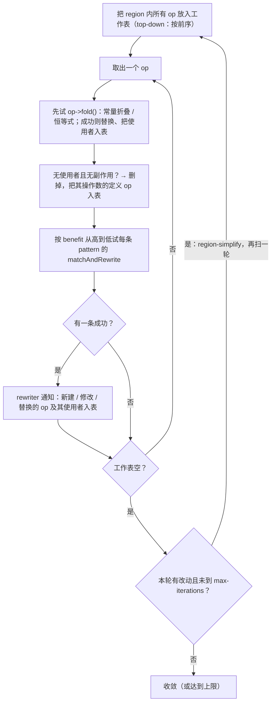
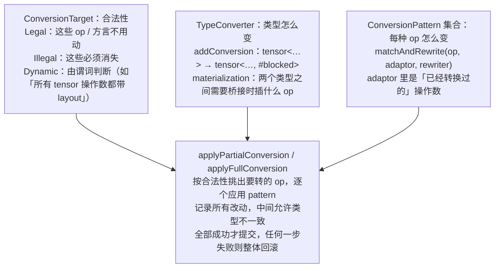
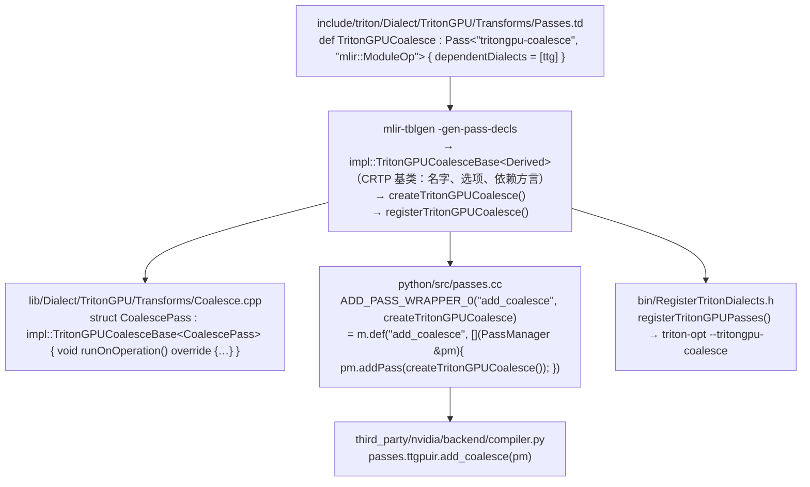

上一篇的 IR 是静态的。这一篇讲怎么改它。MLIR 提供三种变换机制，复杂度递增：**pass** 是变换的作用单位（"对这个 Op 做一次什么"）；**pattern rewrite** 是局部改写（"看到这个形状就换成那个形状"，类型不变）；**dialect conversion** 是全局的类型与方言替换（"把所有 A 方言的 op 换成 B 方言的、所有 X 类型换成 Y 类型"，中间状态可能类型不一致）。Triton 编译器的每一个 pass 都属于其中一种，分辨它属于哪一种，是读它的第一步。

第四种东西不改 IR，但几乎每个变换都依赖它：**数据流分析框架**。第六篇的 AxisInfo 建在它上面，本篇把框架本身讲清楚。

总纲对这一篇提出的核心问题是：

> **`ConvertTritonToTritonGPU` 要把没有 layout 的 `tensor<128x64xf32>` 全部变成带 layout 的 `tensor<128x64xf32, #blocked>`，过程中每一个 Op 的操作数和结果类型都要换。这为什么必须用 Dialect Conversion 而不能用 greedy pattern rewrite？[^q0] TypeConverter 在其中做什么？[^q1]**

## 一、总览

本文按**三种变换机制由简到繁**组织：pass 基础设施（第二章）→ pattern rewrite 与 greedy driver（第三章）→ dialect conversion（第四章）；然后用一个完整的例子把三者串起来——`linalg.matmul` 逐步下降到 LLVM 方言并在笔记本上运行（第五章）；再讲数据流分析框架（第六章）；最后看 Triton 一个 pass 从 TableGen 声明到 `compiler.py` 里那一行 `passes.ttgpuir.add_coalesce(pm)` 的完整注册链（第七章）。

| 章 | 主题 | 内容 |
|---|---|---|
| 二 | Pass | `OperationPass<T>`、嵌套 PassManager、文本 pipeline、analysis 的缓存与失效、instrumentation |
| 三 | Pattern Rewrite | `RewritePattern`、`PatternRewriter` 的纪律、greedy driver 的算法、`fold` 与 canonicalize、DRR / PDLL；写一个 pass 插件挂进 `mlir-opt` |
| 四 | Dialect Conversion | 合法性、`TypeConverter`、materialization、`ConversionPattern` 与 adaptor、partial / full、回滚；`unrealized_conversion_cast`；Triton 的 `ConvertTritonToTritonGPU` 逐段读 |
| 五 | 一条完整的下降 | `linalg.matmul` → `scf` 循环 → `llvm` 方言 → LLVM IR → 运行 |
| 六 | 数据流分析框架 | `DataFlowSolver`、`Lattice`、sparse / dense、`--sccp` 实例 |
| 七 | Triton 的一个 pass 从哪来 | `Passes.td` → `impl::…Base` → `create…` → Python 绑定 → `compiler.py`；`triton-opt` |
| 八 | 本文小结 | |
| 九 | 自测 | 5 道题 |

Table: 本文的章节安排

## 二、Pass 基础设施

### 1. 一个 pass 是什么

```cpp
struct MulToShiftPass : public PassWrapper<MulToShiftPass, OperationPass<>> {
  StringRef getArgument() const final { return "toy-mul-to-shift"; }      // 命令行名字
  StringRef getDescription() const final { return "..."; }
  void getDependentDialects(DialectRegistry &registry) const override {   // 会生成哪些方言的 op
    registry.insert<arith::ArithDialect>();
  }
  void runOnOperation() override {                                         // 主体
    Operation *op = getOperation();     // 作用对象
    ...
  }
};
```

`OperationPass<T>` 是"作用在类型为 T 的 Op 上"的 pass：`OperationPass<ModuleOp>` 对整个模块跑一次，`OperationPass<func::FuncOp>` 对每个函数跑一次，`OperationPass<>`（不指定）可以挂在任何 Op 上。Triton 的 pass 几乎全是 `Pass<"…", "mlir::ModuleOp">`——它们内部自己 `walk` 到 `tt.func`，因为很多分析（`ModuleAxisInfoAnalysis`）是模块级的。

`getDependentDialects` 的意义：pass 生成的 op 所属的方言必须已经加载到 `MLIRContext`。多线程执行时不能在跑 pass 的过程中加载方言（非线程安全），所以 pass 要预先声明。忘了声明的症状是一个难懂的断言 `'X' op created with unregistered dialect`。

### 2. 嵌套的 PassManager 与文本 pipeline

PassManager 按 Op 的嵌套层次组织。文本语法直接反映这个结构：

```bash
mlir-opt --pass-pipeline='builtin.module(func.func(sccp,canonicalize,cse))' sccp.mlir
```

读作：在 `builtin.module` 上跑一个 pipeline，它对模块内每个 `func.func` 跑 `sccp`、`canonicalize`、`cse`。`func.func(...)` 是一个**嵌套**：MLIR 对同一层的多个函数可以**并行**跑函数级 pass（这是 `IsolatedFromAbove` trait 的用处——函数体不引用外面的值，各函数互不干扰）。参数写在名字后的花括号里：`canonicalize{max-iterations=10 top-down=true}`。

Triton 在 Python 里构造的 `pm = ir.pass_manager(ctx); passes.ttgpuir.add_coalesce(pm); …` 是同一个东西的 API 形式；每个 `add_xxx` 就是 `pm.addPass(createXxx())`。`MLIR_ENABLE_DUMP=1` 打出来的 IR 序列，就是这个 pipeline 每一步之后的结果。

### 3. Analysis：缓存与失效

Pass 可以向框架要一个 analysis：`getAnalysis<DominanceInfo>()`。框架按 Op 缓存它——同一个 Op 上的多个 pass 依次请求同一个 analysis 时只算一次。**默认规则是：一个 pass 跑完之后，它作用的 Op 上的所有 analysis 全部失效**（下个 pass 再要就重算），除非这个 pass 显式调用 `markAnalysesPreserved<DominanceInfo>()` 或 `markAllAnalysesPreserved()`（后者用于"我什么都没改"的情况，通常在 `runOnOperation` 判断无事可做时）。这比 LLVM 的 `PreservedAnalyses` 保守——LLVM 要求每个 pass 声明保留了什么，声明错了就是静默的错误；MLIR 默认全丢，代价是重算，安全性高。

Triton 的 `ModuleAxisInfoAnalysis` **不是**通过这个机制缓存的——它在每个需要它的 pass 里重新构造（`ModuleAxisInfoAnalysis axisInfoAnalysis(m);` 出现在 `Coalesce.cpp`、`LoadStoreOpToLLVM` 等处），因为它的输入（IR）在两次使用之间几乎总是变了。

### 4. Instrumentation

框架在每个 pass 前后有钩子，`mlir-opt` 暴露成命令行开关：

| 开关 | 作用 | Triton 对应 |
|---|---|---|
| `--mlir-print-ir-after-all` / `-before-all` | 每个 pass 之后 / 之前打印 IR | `MLIR_ENABLE_DUMP=1` |
| `--mlir-print-ir-after-change` | 只在 IR 变了时打印 | — |
| `--mlir-print-ir-after-failure` | pass 失败时打印 | — |
| `--mlir-print-ir-after=pass-name` | 只打某个 pass 之后 | `MLIR_ENABLE_DUMP=<kernel_name>` 可以限定 kernel |
| `--mlir-timing` | 每个 pass 的耗时 | `MLIR_ENABLE_TIMING=1` |
| `--verify-each` / `--verify-each=false` | 每个 pass 之后跑 verifier（默认开） | 默认开；`triton-opt` 同 |
| `--mlir-disable-threading` | 单线程，便于调试 | — |
| `--mlir-print-op-generic` / `--mlir-print-debuginfo` | 打印形式 | — |

Table: mlir-opt 的 instrumentation 开关与 Triton 对应

```text
$ mlir-opt --pass-pipeline='builtin.module(func.func(sccp,canonicalize,cse))' --mlir-print-ir-after-all sccp.mlir 2>&1 | rg 'IR Dump'
// -----// IR Dump After SCCPPass: sccp //----- //
// -----// IR Dump After CanonicalizerPass: canonicalize{cse-between-iterations=false    max-iterations=10 max-num-rewrites=-1 region-simplify=normal test-convergence=false top-down=true} //----- //
// -----// IR Dump After CSEPass: cse //----- //
```

```text
$ mlir-opt ... --mlir-timing sccp.mlir
  ----Wall Time----  ----Name----
    0.0004 ( 37.0%)  Parser
    0.0002 ( 15.2%)  'func.func' Pipeline
    0.0001 (  7.6%)    SCCPPass
    0.0001 (  6.0%)    CanonicalizerPass
```

## 三、Pattern Rewrite

### 1. 一条 pattern

pattern 是"匹配一个 op 附近的形状，改写成另一个形状"的最小单元。上一篇的 `mul x, 2^k → shl x, k`，完整写出来：

```cpp
struct MulPow2ToShift : public OpRewritePattern<arith::MulIOp> {
  using OpRewritePattern::OpRewritePattern;
  LogicalResult matchAndRewrite(arith::MulIOp op, PatternRewriter &rewriter) const override {
    APInt c;
    if (!matchPattern(op.getRhs(), m_ConstantInt(&c)))          // ① 右操作数必须是整数常量
      return rewriter.notifyMatchFailure(op, "rhs is not a constant");
    if (!c.isPowerOf2())
      return rewriter.notifyMatchFailure(op, "rhs is not a power of two");
    Value k = arith::ConstantOp::create(rewriter, op.getLoc(), op.getType(),
                                        rewriter.getIntegerAttr(op.getType(), c.logBase2()));   // ② 新常量
    rewriter.replaceOpWithNewOp<arith::ShLIOp>(op, op.getLhs(), k);   // ③ 替换：新 op 接管所有使用者，旧 op 被删
    return success();
  }
};
```

1. ① **match 阶段**：只读，判断形状。`matchPattern` + `m_ConstantInt` 是 MLIR 的匹配器小语言（`m_Zero()`、`m_Constant()`、`m_Op<AddIOp>()` 可以嵌套）。失败时返回 `notifyMatchFailure`——在 debug 构建里 `-debug-only=greedy-rewriter` 会打印这些原因，是第十三篇"为什么这条 pattern 没命中"的第一手信息。
2. ② ③ **rewrite 阶段**：改 IR。**所有修改必须通过 `rewriter`**——`rewriter.create`（或 `Op::create(rewriter, …)`）、`rewriter.replaceOp`、`rewriter.eraseOp`、`rewriter.modifyOpInPlace(op, [&]{ … })`、`rewriter.replaceAllUsesWith`。直接调 `op->erase()` 或 `op->setOperand()` 是错误的：driver 靠 rewriter 的通知维护工作表（哪些 op 变了、要重新检查），绕过它 driver 就不知道 IR 变了，轻则错过优化机会，重则悬空指针。这是写 MLIR pattern 的第一纪律，也是 Triton 代码审查里最常见的一类 bug。

`OpRewritePattern<MulIOp>` 限定匹配的 op 类型；`RewritePattern` 基类可以匹配任意 op（Triton 的 `Combine.cpp` 里 `CombineSelectMaskedLoadPattern` 用 `RewritePattern(arith::SelectOp::getOperationName(), benefit, ctx)` 是老写法，等价）。构造函数的 `benefit` 参数（默认 1）决定多条 pattern 同时匹配一个 op 时谁先试。

### 2. Greedy driver

`applyPatternsGreedily(op, patterns)` 是把一组 pattern 应用到不动点的驱动器：



要点：

- **不动点**：一条 pattern 的输出可能是另一条的输入（`mul → shl` 之后，`shl` 又可能与相邻的 `shl` 合并），driver 反复扫直到没有变化。`max-iterations=10` 是保险——两条互相抵消的 pattern（A 把 x 变成 y，B 把 y 变成 x）会无限循环，达到上限时报 `pattern rewrite did not converge`。
- **fold 优先**：每个 op 的 `fold()` 方法（ODS `hasFolder`）在 pattern 之前试。`fold` 与 pattern 的区别：`fold` **不能创建新 op**，只能返回一个已有的 `Value` 或一个 `Attribute`（常量），所以它可以在任何地方安全调用（builder 在创建 op 时也会先试 fold）；pattern 可以做任何改写。`addptr %p, 0 → %p` 是 fold，`addptr(addptr(p, a), b) → addptr(p, a + b)` 要新建一个 `addi`，是 pattern。
- **DCE 内置**：无使用者且无内存效应的 op 顺手删掉（这就是 `Pure` trait 的价值）。
- **局部性**：pattern 只看一个 op 及其操作数 / 使用者的邻域，不做全局分析。需要全局信息的变换（"这个 layout 要不要沿整条 def-use 链传播"）不适合写成 pattern，Triton 的 `RemoveLayoutConversions` 因此是手写的两阶段算法而不是 pattern 集（第八篇）。

### 3. Canonicalization

`canonicalize` pass = greedy driver + 所有已注册 op 的 canonicalization pattern（ODS `hasCanonicalizer` 手写的 `getCanonicalizationPatterns`）+ 所有 `fold` + DCE + region simplification（删空 block、合并只有一个前驱的 block、删无用的 block 参数）。它是 MLIR 流水线里出现最频繁的 pass，Triton 的 `make_ttgir` 里跑七次。

它比 LLVM 的 `instcombine` **弱**。上一篇的例子：

```mlir
%a = arith.addi %c3, %c4 : i32          // 3 + 4
%b = arith.muli %x, %c8 : i32
%b2 = arith.muli %x, %c8 : i32
%c = arith.addi %b, %a : i32
%d = arith.subi %c, %b2 : i32            // (x*8 + 7) - x*8
```

`mlir-opt --canonicalize --cse` 之后：

```mlir
%c8_i32 = arith.constant 8 : i32
%c7_i32 = arith.constant 7 : i32
%0 = arith.muli %arg0, %c8_i32 : i32
%1 = arith.addi %0, %c7_i32 : i32
%2 = arith.subi %1, %0 : i32              // 没有化成 7
```

`3 + 4` 折了、两个 `muli` 被 CSE 合并了，但 `(x*8 + 7) - x*8 = 7` 没有——`arith` 方言没有这条 canonicalization pattern；LLVM 的 `instcombine` 有。这是分工：MLIR 各方言的 canonicalizer 只做**规范化**（常量右移、恒等式、显然的折叠），代数简化留给 LLVM 层——Triton 的 LLVM IR 最后会过一遍 `-O3`（第二篇），那里会把它化掉。读 TTGIR 时看到没被简化的算术不要奇怪。

### 4. 声明式 pattern：DRR 与 PDLL

C++ 写 pattern 冗长。MLIR 有两种声明式写法：

**DRR**（Declarative Rewrite Rules，TableGen）——Triton 的 `Combine.td`：

```text
def CombineAddPtrPattern : Pat<
        (TT_AddPtrOp:$src (TT_AddPtrOp $ptr, $idx0), $idx1),                    // 源模式：树
        (TT_AddPtrOp:$dest $ptr, (Arith_AddIOp $idx0, $idx1, DefOverflow)),      // 目标模式
        [(Constraint<CPred<"isAddPtrOffsetCombinable($0, $1)">> $idx0, $idx1)],  // 附加约束（C++ 谓词）
        [(CopyDiscardableAttrs $src, $dest)]>;                                    // 附加动作
```

`mlir-tblgen -gen-rewriters` 把它生成一个 `RewritePattern` 子类。适合"树到树"的纯结构改写，约束和动作可以嵌 C++。局限：只能匹配 op 树（不能匹配"某值有两个使用者"这类图性质），不能匹配带 Region 的 op。

**PDLL**（PDL Language）——较新的专用语言，同一条 pattern：

```text
#include "mlir/Dialect/Arith/IR/ArithOps.td"

Constraint IsPow2(attr: Attr) [{ return cast<IntegerAttr>(attr).getValue().isPowerOf2(); }];
Rewrite Log2(attr: Attr) -> Attr [{ return IntegerAttr::get(attr.getType(), cast<IntegerAttr>(attr).getValue().logBase2()); }];

Pattern MulPow2ToShift {
  let c: Attr;
  IsPow2(c);
  let root = op<arith.muli>(x: Value, op<arith.constant> {value = c});
  replace root with op<arith.shli>(x, op<arith.constant> {value = Log2(c)});
}
```

`mlir-pdll` 把它编译成 PDL 方言（模式本身也是 MLIR IR！），运行时由 PDL 字节码解释器匹配。PDLL 支持多结果、多根、原生约束，是 MLIR 社区推荐的方向；Triton 目前只用 DRR（一条）和 C++。

### 5. 把 pattern 装进 pass 插件

`mlir-opt` 支持动态加载 pass 插件，不用重新编译 `mlir-opt`。上面的 pattern 加一个 pass 壳（§二.1）和一个导出函数：

```cpp
extern "C" LLVM_ATTRIBUTE_WEAK ::mlir::PassPluginLibraryInfo mlirGetPassPluginInfo() {
  return {MLIR_PLUGIN_API_VERSION, "MulToShift", LLVM_VERSION_STRING,
          []() { PassRegistration<MulToShiftPass>(); }};
}
```

用 Homebrew 的 LLVM 编译成动态库（三秒）：

```bash
LLVM=/opt/homebrew/opt/llvm
$LLVM/bin/clang++ -std=c++17 -shared -fPIC -o libMulToShift.dylib MulToShift.cpp \
    -I$LLVM/include -L$LLVM/lib -lMLIR -Wl,-undefined,dynamic_lookup
```

跑：

```bash
mlir-opt --load-pass-plugin=./libMulToShift.dylib --pass-pipeline='builtin.module(toy-mul-to-shift)' t.mlir
```

```mlir
// 输入                                       // 输出
%c8 = arith.constant 8 : i32                  %c6_i32 = arith.constant 6 : i32
%c6 = arith.constant 6 : i32                  %c3_i32 = arith.constant 3 : i32
%a = arith.muli %x, %c8 : i32                 %0 = arith.shli %arg0, %c3_i32 : i32
%b = arith.muli %y, %c6 : i32                 %1 = arith.muli %arg1, %c6_i32 : i32
```

`x * 8` 变成 `x << 3`，`y * 6` 不动（6 不是 2 的幂，`notifyMatchFailure`），`%c8` 因无人使用被 driver 内置的 DCE 删掉。Triton 自己的 pass 也可以这样单独编译、用 `triton-opt --load-pass-plugin` 加载（`test/Plugins/` 目录有例子），是开发一个新 pass 时避免全量重编的办法。

## 四、Dialect Conversion

### 1. 问题：类型要一起变

Greedy rewrite 有一个隐含前提：**改写前后，被替换的值类型相同**。`replaceOp(op, newValue)` 把 `op` 的所有使用者指向 `newValue`，使用者不需要知道发生了什么——因为类型没变。

现在考虑 `ConvertTritonToTritonGPU`：要把 `%a = tt.load %ptrs : tensor<128x32x!tt.ptr<bf16>>` 变成结果类型为 `tensor<128x32xbf16, #blocked>` 的新 load。如果用 greedy pattern 做：

1. 改写 `tt.load`，结果类型多了 `#blocked`；它的使用者 `tt.dot %a, …` 现在操作数类型是 `tensor<…, #blocked>`，但 `tt.dot` 的结果类型还是无 layout 的——**verifier 立刻失败**（`tt.dot` 要求 `d` 与 `c` 类型一致，而 `c` 还没转）。
2. 反过来先改 `tt.dot`？它的操作数还没转。**没有一个合法的改写顺序**能让每一步之后 IR 都合法——每个 op 的合法性依赖它的邻居都已经转换。
3. 更麻烦的是 `scf.for`：iter_args 的类型、Region block 参数的类型、`yield` 操作数的类型、结果类型，四处必须同时变，而它们分属三个不同的 op。

所以需要一个**允许中间状态类型不一致**的框架，最后一次性收口。这就是 Dialect Conversion。

### 2. 四个组件



逐个看：

**ConversionTarget**：声明哪些 op 是"合法"（转换结束时允许存在）。`addLegalDialect<TritonGPUDialect>()`、`addIllegalOp<scf::ParallelOp>()`、`addDynamicallyLegalDialect<ArithDialect, …>(pred)`——动态合法性用一个谓词判断，Triton 的谓词是"这个 op 的所有 tensor 类型操作数和结果都已经有 encoding"。driver 只对**不合法**的 op 应用 pattern，合法的跳过；结束时若还有不合法的 op，`applyFullConversion` 报错，`applyPartialConversion` 允许（用于分多步转换）。

**TypeConverter**：`addConversion(lambda)` 注册类型映射，按注册的逆序尝试（后注册的优先）。`convertType(oldType)` 返回新类型（或失败）。三种 **materialization** 回调，处理"一个值的旧类型和新类型都有人要"的情形：

| materialization | 何时调用 | Triton 里插什么 |
|---|---|---|
| target | 一个 pattern 需要操作数是新类型，但拿到的值还是旧类型 | `ttg.convert_layout`——把一个 layout 的张量转成另一个 |
| source | 一个旧类型的值被替换了，但还有没转换的使用者需要旧类型 | `unrealized_conversion_cast`（`enableSourceRemat` 时） |
| argument | Block 参数换了类型，Block 内还有人用旧类型 | 同 source |

Table: 三种 materialization 与 Triton 里插的东西

**ConversionPattern**：与 `RewritePattern` 的差别是签名多一个 `adaptor`：

```cpp
template <class Op> struct GenericOpPattern : public OpConversionPattern<Op> {
  LogicalResult matchAndRewrite(Op op, typename Op::Adaptor adaptor,
                                ConversionPatternRewriter &rewriter) const override {
    SmallVector<Type> retTypes;
    if (failed(this->getTypeConverter()->convertTypes(op->getResultTypes(), retTypes)))
      return failure();
    rewriter.replaceOpWithNewOp<Op>(op, retTypes, adaptor.getOperands(), op->getAttrs());   // ①
    return success();
  }
};
```

这是 Triton 对大多数 op（`arith.*`、`math.*`、`tt.load`、`tt.store`、`tt.splat`……）用的通用 pattern。① `adaptor.getOperands()` 给的是**已转换的操作数**（类型已带 layout；如果某个操作数的定义 op 还没转，driver 会插一个 target materialization 让类型对上）；结果类型用 TypeConverter 算；属性照抄。`op.getOperands()` 拿到的仍是旧值——**在 ConversionPattern 里必须用 adaptor 而不是 op 的操作数**，这是第二条纪律。

**Driver**：`applyPartialConversion(root, target, patterns)`。它遍历 root 下的 op，对每个不合法的 op 按 benefit 试 pattern；pattern 里通过 `ConversionPatternRewriter` 做的所有改动被**记录而不是立即执行**（旧 op 不真删、只标记；新旧值的映射记在表里）。全部 op 处理完、合法性检查通过后，一次性提交：删旧 op、把 Block 参数换成新类型、插入需要的 materialization。任何 pattern 失败（返回 `failure()`）或结束时仍有不合法 op（full 模式），整个转换**回滚**到开始前的状态——这就是为什么 `ConversionPatternRewriter` 比普通 rewriter 更严格：不能直接 `erase`，`modifyOpInPlace` 要小心，因为一切都可能被撤销。

### 3. 看见中间状态：`unrealized_conversion_cast`

只跑 `arith → llvm` 一步，不转其他方言：

```bash
mlir-opt --convert-linalg-to-loops --convert-arith-to-llvm mm.mlir
```

```mlir
func.func @mm(%arg0: memref<4x8xf32>, %arg1: memref<8x4xf32>, %arg2: memref<4x4xf32>) {
  %0 = llvm.mlir.constant(0 : index) : i64
  %1 = builtin.unrealized_conversion_cast %0 : i64 to index          // ①
  %2 = llvm.mlir.constant(4 : index) : i64
  %3 = builtin.unrealized_conversion_cast %2 : i64 to index
  ...
  scf.for %arg3 = %1 to %3 step %5 {                                  // ② scf.for 没转，还要 index
    ...
      %11 = llvm.fmul %8, %9 : f32                                    // ③ arith.mulf 转成了 llvm.fmul
      %12 = llvm.fadd %10, %11 : f32
      memref.store %12, %arg2[%arg3, %arg4] : memref<4x4xf32>
```

① `arith.constant 0 : index` 变成了 `llvm.mlir.constant : i64`（`index` 在 LLVM 里是 64 位整数），但它的使用者 ② `scf.for` 不在这次转换的范围内、仍要 `index` 类型——driver 插了一个 `builtin.unrealized_conversion_cast` 把 `i64` "假装"成 `index`。这个 op 没有语义（它"未实现"），只是类型系统上的桥。当后面 `scf.for` 也被转换、它的操作数变成 `i64` 时，会出现 `cast(cast(x : i64 → index) : index → i64)`，`--reconcile-unrealized-casts` 把这种往返对消掉；如果最后还剩下无法消除的 cast，说明有一部分 IR 没转干净，那个 pass 会报错——这是多步 lowering 的一致性检查。

Triton 的 `TritonGPUToLLVM` 也依赖它：第六篇 AxisInfo 的 visitor 表里有一条 `UnrealizedConversionCastOpAxisInfoVisitor`，注释说"TritonGPUToLLVM 在 partial conversion 过程中需要查 AxisInfo，此时图里有 `unrealized_conversion_cast`"——就是这个中间状态。

### 4. Triton 的 `ConvertTritonToTritonGPU`

`lib/Conversion/TritonToTritonGPU/` 三个文件，把上面四个组件对上：

**TypeConverter**（`TritonGPUConversion.cpp`）：

```cpp
TritonGPUTypeConverter::TritonGPUTypeConverter(MLIRContext *context, int numWarps, int threadsPerWarp, int numCTAs, bool enableSourceRemat) {
  addConversion([](Type type) { return type; });                        // ① 兜底：其他类型不变
  addConversion([this](RankedTensorType tensorType) -> RankedTensorType {
    if (tensorType.getEncoding())                                        // ② 已有 layout 的不动
      return tensorType;
    ArrayRef<int64_t> shape = tensorType.getShape();
    triton::gpu::BlockedEncodingAttr encoding =
        getDefaultBlockedEncoding(this->context, shape, this->numWarps, this->threadsPerWarp, this->numCTAs);   // ③ 默认 layout
    return tensorType.cloneWithEncoding(encoding);
  });
  if (enableSourceRemat) {
    addSourceMaterialization([](OpBuilder &builder, RankedTensorType tensorType, ValueRange inputs, Location loc) -> Value {
      return UnrealizedConversionCastOp::create(builder, loc, tensorType, inputs).getResult(0);
    });
  }
  addTargetMaterialization([](OpBuilder &builder, RankedTensorType tensorType, ValueRange inputs, Location loc) {
    auto cast = triton::gpu::ConvertLayoutOp::create(builder, loc, tensorType, inputs);   // ④ 桥接 = convert_layout
    return cast.getResult();
  });
}
```

① ② ③ 是核心问题第二问的答案：TypeConverter 定义"无 layout 的 `tensor<shape x T>` → 带默认 `#blocked` 的同 shape 张量"，其他类型（指针、标量、已带 layout 的张量）原样。默认 layout 由 `getDefaultBlockedEncoding` 按 shape、`num_warps`、`threads_per_warp` 算出（第七篇）。④ 当某个 pattern 需要带 layout 的操作数而拿到的是别的 layout（或来自另一次转换）时，桥接 op 是 `ttg.convert_layout`——在这个转换里 layout 的桥接有真实语义（数据在线程间重排），所以不用 `unrealized_conversion_cast`。

**ConversionTarget**：

```cpp
addLegalDialect<triton::gpu::TritonGPUDialect>();                        // ttg 的 op 天然合法
addIllegalOp<scf::ExecuteRegionOp, scf::ParallelOp, scf::ReduceOp, scf::ReduceReturnOp>();   // 不支持的 scf op
addDynamicallyLegalDialect<arith::ArithDialect, math::MathDialect, triton::TritonDialect,
                           cf::ControlFlowDialect, scf::SCFDialect, ub::UBDialect>(
    [&](Operation *op) { return isDynamicallyLegal(op, typeConverter); });   // 所有 tensor 都带 layout 才合法
addDynamicallyLegalOp<triton::DotOp>([](triton::DotOp dotOp) -> bool {       // dot 的 a、b 必须是 #dot_op layout
  ...isa<DotOperandEncodingAttr>(aEncoding) && isa<DotOperandEncodingAttr>(bEncoding)...
});
addDynamicallyLegalOp<triton::FuncOp>(...所有参数 / 结果的 tensor 类型都带 encoding...);
```

`tt.dot` 的合法性更严——不只是"有 layout"，而是操作数必须是 `#dot_op` layout；对应的 `TritonDotPattern` 为 a、b 各插一个 `convert_layout` 到 `#dot_op<{opIdx=0/1, parent=#blocked}>`。这是 `AccelerateMatmul`（第八篇）的起点。

**Patterns**：`GenericOpPattern<Op>` 覆盖绝大多数；特殊的几个——`ArithConstantPattern`（`dense<0.0>` 常量的属性类型也要带 layout）、`TritonExpandDimsPattern`（结果 layout 是 `#slice` 的逆：父 layout 由结果推出）、`TritonDotPattern`、`TritonReducePattern`（结果 layout = `#slice<{dim, parent}>`）、`TritonBroadcastPattern`、`SCFForPattern` / `SCFIfPattern` / `SCFWhilePattern`（Region 签名转换：`rewriter.convertRegionTypes` 把 Block 参数换类型）、`CFBranchPattern` / `CFCondBranchPattern`。

**Driver**：

```cpp
if (failed(applyPartialConversion(mod, target, std::move(patterns))))
  return signalPassFailure();
```

partial 而不是 full：允许 `builtin.module`、`tt.func` 这些不在动态合法性列表里的 op 留着。

回到核心问题第一问：**为什么不能用 greedy rewrite**——因为每个 op 的合法状态依赖邻居同时转换，greedy 的"每一步后 IR 合法"做不到；Dialect Conversion 允许中间状态类型不一致（用 adaptor 传已转换的操作数、用 materialization 桥接、把所有改动记录到最后提交），并在结束时以合法性检查保证没有漏网的 op。`scf.for` 的 iter_args / Block 参数 / yield / 结果四处同步换类型，只有 `convertRegionTypes` + 延迟提交能做到。

`TritonGPUToLLVM`（第十篇）是同一框架的第二个实例：TypeConverter 把 `tensor<…, #layout>` 变成 `!llvm.struct<(f32, f32, …)>`（每线程持有的元素数由 layout 算出），`!tt.ptr<T>` 变成 `!llvm.ptr<1>`，`!ttg.memdesc` 变成 `!llvm.ptr<3>` 加偏移；合法目标是 `llvm` 与 `nvvm` 方言；几十个 `ConvertOpToLLVMPattern`。

## 五、一条完整的下降

把三种机制串起来：`linalg.matmul`（张量层）→ `scf` 循环 → `llvm` 方言 → LLVM IR → 在笔记本 CPU 上运行。

```mlir
func.func @mm(%A: memref<4x8xf32>, %B: memref<8x4xf32>, %C: memref<4x4xf32>) {
  linalg.matmul ins(%A, %B : memref<4x8xf32>, memref<8x4xf32>) outs(%C : memref<4x4xf32>)
  return
}
```

**第一步**：`--convert-linalg-to-loops`（一个 pattern：`linalg.matmul` 的 indexing map 展开成循环嵌套）：

```mlir
scf.for %arg3 = %c0 to %c4 step %c1 {
  scf.for %arg4 = %c0 to %c4 step %c1 {
    scf.for %arg5 = %c0 to %c8 step %c1 {
      %0 = memref.load %arg0[%arg3, %arg5] : memref<4x8xf32>
      %1 = memref.load %arg1[%arg5, %arg4] : memref<8x4xf32>
      %2 = memref.load %arg2[%arg3, %arg4] : memref<4x4xf32>
      %3 = arith.mulf %0, %1 : f32
      %4 = arith.addf %2, %3 : f32
      memref.store %4, %arg2[%arg3, %arg4] : memref<4x4xf32>
    }
  }
}
```

这一步是第一篇 §八说的"丢信息"最直观的一次：`linalg.matmul` 一个 op 里的"这是矩阵乘"到这里变成了三层循环加标量乘加，再往下没有任何 pass 知道它曾是矩阵乘。Triton 的 `tt.dot` 不走这条路——它保持为一个 op 直到 `DotOpToLLVM` 直接变成 `mma.sync`。

**第二步**：`--convert-scf-to-cf`（Region → Block + 跳转，上一篇 §七.2）。

**第三步**：`--convert-to-llvm --reconcile-unrealized-casts`（Dialect Conversion：`arith` / `cf` / `func` / `memref` 全部 → `llvm`，然后消掉桥接 cast）：

```mlir
llvm.func @mm(%arg0: !llvm.ptr, %arg1: !llvm.ptr, %arg2: i64, %arg3: i64, %arg4: i64, %arg5: i64, %arg6: i64,
              %arg7: !llvm.ptr, %arg8: !llvm.ptr, %arg9: i64, ..., %arg20: i64) {
  %0 = llvm.mlir.poison : !llvm.struct<(ptr, ptr, i64, array<2 x i64>, array<2 x i64>)>     // ①
  %1 = llvm.insertvalue %arg14, %0[0] : !llvm.struct<(ptr, ptr, i64, array<2 x i64>, array<2 x i64>)>
  ...
  llvm.br ^bb1(%24 : i64)
^bb1(%28: i64):  // 2 preds: ^bb0, ^bb8
  %29 = llvm.icmp "slt" %28, %25 : i64
  llvm.cond_br %29, ^bb2, ^bb9
  ...
```

① 一个 `memref<4x8xf32>` 参数变成了 7 个参数（数据指针、对齐指针、偏移、2 个 size、2 个 stride）——这是 memref 的 TypeConverter：`memref` → 一个 `!llvm.struct<(ptr, ptr, i64, array<2 x i64>, array<2 x i64>)>` 描述符，函数边界上再拆成标量。三个 memref 参数变成 21 个 LLVM 参数。对比 Triton：`!tt.ptr<bf16>` 就是一个 `!llvm.ptr<1>`，没有描述符——Triton 的指针语义比 memref 简单得多，这是它的 lowering 比 IREE 那条路轻的原因之一。

**第四步**：`mlir-translate --mlir-to-llvmir` 得到真正的 LLVM IR（236 行），再交给第二篇的 LLVM 后端。

**运行**：加一个 `main` 用 `linalg.fill` 填 A 全 1、B 全 2、C 全 0，调 `mm`，用 runner 工具库打印：

```bash
mlir-opt mm_run.mlir --convert-linalg-to-loops --convert-scf-to-cf --convert-to-llvm --reconcile-unrealized-casts -o mm_llvm.mlir
mlir-runner mm_llvm.mlir -e main -entry-point-result=void \
    -shared-libs=/opt/homebrew/opt/llvm/lib/libmlir_runner_utils.dylib \
    -shared-libs=/opt/homebrew/opt/llvm/lib/libmlir_c_runner_utils.dylib
```

```text
Unranked Memref base@ = 0x9f7001000 rank = 2 offset = 0 sizes = [4, 4] strides = [4, 1] data =
[[16,   16,   16,   16],
 [16,   16,   16,   16],
 [16,   16,   16,   16],
 [16,   16,   16,   16]]
```

4×8 的 1 乘 8×4 的 2，每个元素 8 × 2 = 16。`mlir-runner` 用 LLVM 的 JIT（ORC）把 LLVM 方言 JIT 成本机代码执行——从张量层的 `linalg.matmul` 到运行结果，全部在 MLIR 的基础设施里、没有一行手写的 C。

## 六、数据流分析框架

### 1. 框架

`mlir/Analysis/DataFlowFramework.h` 提供第一篇 §五 那套东西的通用实现：

| 概念 | 类 | 说明 |
|---|---|---|
| 求解器 | `DataFlowSolver` | 持有所有 analysis 与所有 lattice；`initializeAndRun(op)` 跑到不动点 |
| 格元素 | `Lattice<ValueT>` | 包一个用户类型 `ValueT`；`join(other)` 调 `ValueT::join`，返回是否变化 |
| 稀疏前向分析 | `SparseForwardDataFlowAnalysis<Lattice<V>>` | 用户实现 `visitOperation(op, operands, results)`：从操作数的 lattice 算结果的；`setToEntryState`：入口 / 未知值的初值。框架沿 use-def 边传播，处理 `RegionBranchOpInterface`（`scf.for` 的 yield → block 参数）与 `BranchOpInterface`（`cf.br` 的实参 → block 参数） |
| 稀疏后向 | `SparseBackwardDataFlowAnalysis` | 活跃性一类 |
| 稠密分析 | `DenseForwardDataFlowAnalysis` | 每个程序点一个状态（不是每个值），用于内存别名、last-write 这类 |
| 自带的 analysis | `DeadCodeAnalysis`、`SparseConstantPropagation`、`IntegerRangeAnalysis`、`LivenessAnalysis` | `--sccp` 用前两个；`--int-range-optimizations` 用第三个 |

Table: MLIR 数据流框架的概念与类

`propagateIfChanged(lattice, changeResult)`：只有格元素变了才把它的使用者加回工作表——这是"稀疏"的实现。多个 analysis 可以装进同一个 solver 协作：SCCP 依赖 `DeadCodeAnalysis` 知道哪些 block 可达（不可达分支的值不参与 join），这就是它比朴素常量传播强的地方。

### 2. `--sccp` 实例

```mlir
func.func @g(%c: i1) -> i32 {
  %c5 = arith.constant 5 : i32
  %c7 = arith.constant 7 : i32
  %r = scf.if %c -> (i32) {
    %a = arith.addi %c5, %c7 : i32      // 12
    scf.yield %a : i32
  } else {
    %b = arith.constant 12 : i32        // 12
    scf.yield %b : i32
  }
  %s = arith.muli %r, %c7 : i32
  return %s : i32
}
```

`mlir-opt --sccp --canonicalize`：

```mlir
func.func @g(%arg0: i1) -> i32 {
  %c84_i32 = arith.constant 84 : i32
  return %c84_i32 : i32
}
```

两个分支各算出 12，`scf.if` 的结果 lattice = join(12, 12) = 12（第一篇 §五.3 的格：相同常量的 join 是该常量），`%s = 12 × 7 = 84`。若把 else 分支改成 13，join(12, 13) = ⊤，`%s` 不再是常量。

### 3. AxisInfo 怎样接进来

第六篇讲过：`AxisInfoAnalysis : SparseForwardDataFlowAnalysis<Lattice<AxisInfo>>`，实现 `visitOperation`（查 visitor 表）、`setToEntryState`（悲观值 + 函数参数属性）、`visitNonControlFlowArguments`（`scf.for` 归纳变量）。`AxisInfo::join` 取 gcd。`ModuleAxisInfoAnalysis::initialize` 创建 solver、装载分析、`initializeAndRun(funcOp)`，然后把每个值的结果抄进一张 map。框架把循环的不动点、分支的汇合、稀疏传播全部包掉，Triton 只写了传递规则。

## 七、Triton 的一个 pass 从哪里来

以 `Coalesce` 为例，`compiler.py` 里那一行 `passes.ttgpuir.add_coalesce(pm)` 背后的链：



- `Passes.td` 用 TableGen 声明 pass：命令行名 `tritongpu-coalesce`、作用 Op `mlir::ModuleOp`、摘要、依赖方言、选项（如 `TritonGPUPipeline` 的 `num-stages`）。
- `mlir-tblgen -gen-pass-decls` 生成 `impl::TritonGPUCoalesceBase`（一个 CRTP 基类，实现 `getArgument`、`getDependentDialects`、选项解析）和 `createTritonGPUCoalesce()` 工厂函数。
- `Coalesce.cpp` 只写 `runOnOperation`。
- `python/src/passes.cc` 用一行宏把工厂函数绑成 Python 里的 `add_coalesce`；带选项的用 `ADD_PASS_WRAPPER_1/2/…`（`add_pipeline(pm, num_stages, dump_enabled)`）。
- `triton-opt` 通过 `registerTritonGPUPasses()` 拿到同一批 pass，所以 `compiler.py` 里的每一个 `add_xxx` 都能在命令行以 `--tritongpu-xxx` 单独运行——第十三篇的调试方法建立在这个对应关系上。

同一条链也存在于 `lib/Dialect/Triton/Transforms/Passes.td`（TTIR 级 pass，Python 名 `passes.ttir.*`）、`lib/Conversion/TritonToTritonGPU/Passes.td`、`third_party/nvidia/.../Passes.td`（`nvidia.passes.ttnvgpuir.*`）。

## 八、本文小结

1. Pass 是作用在某类 Op 上的变换单元；PassManager 按 Op 嵌套组织，文本语法 `builtin.module(func.func(a,b))` 直接反映嵌套，同层的函数可并行。Analysis 默认在 pass 后全部失效，显式 `markAnalysesPreserved` 才保留。`--mlir-print-ir-after-all`、`--mlir-timing` 是最常用的 instrumentation。
2. Pattern rewrite：`matchAndRewrite` 先只读匹配再改写，**所有改动经 rewriter**；greedy driver 用工作表迭代到不动点，先 `fold`（不能建新 op）再 pattern，内置 DCE。canonicalize 是各 op 的规范化 pattern + fold 的集合，比 `instcombine` 弱（代数简化留给 LLVM）。DRR 与 PDLL 是声明式写法；pass 可以编成插件用 `--load-pass-plugin` 加载。
3. Dialect conversion 解决"类型要一起变"：ConversionTarget 声明合法性，TypeConverter 声明类型映射与 materialization，ConversionPattern 用 adaptor 拿已转换的操作数，driver 记录改动、允许中间状态不一致、最后提交或整体回滚；`unrealized_conversion_cast` 是未完成转换的可见痕迹，`reconcile-unrealized-casts` 消掉往返。
4. Triton 的 `ConvertTritonToTritonGPU`：TypeConverter 给无 encoding 的张量加默认 `#blocked`，target materialization 是 `ttg.convert_layout`，合法性 = 所有张量带 encoding（`tt.dot` 额外要求 `#dot_op`），`GenericOpPattern` 覆盖大多数 op，`SCFForPattern` 等做 Region 签名转换，`applyPartialConversion`。
5. `linalg.matmul` → loops → `cf` → `llvm` → LLVM IR → `mlir-runner` 执行，全程 MLIR 基础设施；memref 下降成 7 元描述符，对比 Triton 指针的轻量。
6. 数据流框架：`DataFlowSolver` + `Lattice<V>` + `SparseForwardDataFlowAnalysis::visitOperation`；`--sccp` 是它的内置实例（配合 `DeadCodeAnalysis`），AxisInfo 是 Triton 的实例。
7. 一个 Triton pass 的链：`Passes.td` → tblgen 生成基类与工厂 → `.cpp` 写 `runOnOperation` → `passes.cc` 一行宏绑到 Python → `compiler.py` 调用；`triton-opt` 注册同一批，命令行名与 Python 名一一对应。

## 九、自测

1. 一条 pattern 在 `matchAndRewrite` 里写了 `op->erase()` 而不是 `rewriter.eraseOp(op)`。在 greedy driver 下会出什么问题？在 Dialect Conversion 下呢？

   <details markdown="1"><summary>答案</summary>
   Greedy driver：工作表里可能还存着指向该 op 的指针（它自己或作为别的 op 的使用者被加入），driver 稍后取出时访问已释放内存——崩溃或未定义行为；即使侥幸没崩，driver 也不知道 IR 变了，不会把受影响的邻居重新入表，错过后续优化。Dialect Conversion 更严重：框架依赖"所有改动可回滚"，直接 `erase` 的 op 无法恢复，任何一条 pattern 失败触发回滚时 IR 已经损坏；并且 conversion 的 rewriter 对旧 op 只是标记删除、延迟到提交，直接 erase 会让映射表里出现悬空的键。两种框架里这都是必须修的 bug。
   </details>

2. `fold` 与 canonicalization pattern 的边界：下面哪些可以写成 `fold`，哪些必须是 pattern？(a) `addi %x, 0 → %x`；(b) `addi %x, %x → shli %x, 1`；(c) `muli %c3, %c4 → %c12`；(d) `select %true, %a, %b → %a`；(e) `addptr(addptr(%p, %a), %b) → addptr(%p, addi(%a, %b))`。

   <details markdown="1"><summary>答案</summary>
   `fold` 只能返回已有的 Value 或一个 Attribute（常量）。(a) 返回已有值 `%x`——fold。(c) 返回常量属性 12——fold（builder 会把它物化成 `arith.constant`）。(d) 返回已有值 `%a`——fold。(b) 要新建 `shli` op——pattern。(e) 要新建 `addi` 和 `addptr`——pattern（Triton 的 `Combine.td` 正是这样写的）。
   </details>

3. `ConvertTritonToTritonGPU` 用 `applyPartialConversion` 而不是 `applyFullConversion`。如果换成 full，最可能在哪里报错？

   <details markdown="1"><summary>答案</summary>
   Full 模式要求结束时 root 下**所有** op 都合法。合法性声明里没有覆盖 `builtin.module`（root 本身）、`tt.func`（它是动态合法的，只要参数 / 结果的 tensor 都带 encoding——这个通常满足）、以及可能存在的 `tt.call` / 未列入的其他方言 op（如 `gpu.barrier`、`llvm.intr.assume` 这类前端偶尔生成的 op）。任何一个不在 legal / dynamically-legal 名单里的 op 都会让 full 模式报 `failed to legalize operation`。partial 让这些 op 原样留下。
   </details>

4. 把 `--convert-arith-to-llvm` 的输出（含 `unrealized_conversion_cast`）直接交给 `mlir-translate --mlir-to-llvmir` 会怎样？正确的收尾是什么？

   <details markdown="1"><summary>答案</summary>
   失败：`unrealized_conversion_cast`、`scf.for`、`memref.load` 都不是 `llvm` 方言的 op，翻译器不认识（它只翻译 `llvm` / `nvvm` / `rocdl` 等有 LLVM IR 对应的方言）。正确收尾是把剩余方言也转掉（`--convert-scf-to-cf --convert-to-llvm`，其中 memref → llvm 会把 `index` 操作数也变成 `i64`），此时每个 cast 都有一个反向 cast 与之配对，`--reconcile-unrealized-casts` 消掉它们；若有 cast 无法配对，该 pass 报错，指出哪一段没转干净。
   </details>

5. 用第六章的框架设计一个"每个整数值是否为 2 的幂的倍数（记 k：值 ≡ 0 mod 2^k）"的分析。写出格元素、`join`、`muli` 与 `addi` 的传递函数。它与 AxisInfo 的 divisibility 是什么关系？

   <details markdown="1"><summary>答案</summary>
   格元素：整数 k ∈ {0, 1, …, 63} ∪ {⊥}（未初始化），k 越大越精确；常量 c 的初值是 c 的最大 2 幂因子的指数（0 的特殊处理：取上限）。`join(k1, k2) = min(k1, k2)`（更保守），⊥ 与任何值 join 得那个值。`addi`：`min(k1, k2)`（两个 2^k 的倍数之和仍是 2^min 的倍数）。`muli`：`k1 + k2`（饱和到上限）。函数参数按属性初始化，否则 0。它就是 AxisInfo 的 **divisibility 在标量上的版本**（AxisInfo 记的是 2^k 本身而不是 k，gcd 对应 min，乘法对应 `multiplyDivisor`），少了 contiguity 与 constancy 两个配角——所以它算不出 `splat + arange` 的连续性，也就无法支持向量化决定。
   </details>

## 下一篇

前四篇讲完了通用机制。从下一篇起进入 Triton 编译器，按流水线顺序七篇：先是前端——`@triton.jit` 的函数怎样从 Python AST 变成 TTIR：`JITFunction` 保存源码而不执行，调用时怎样从实参算出特化 key，`CodeGenerator` 作为 `ast.NodeVisitor` 怎样把每个语法节点变成一次 builder 调用，`constexpr` 何时折叠何时物化，`for` 怎样变成 `scf.for`，以及 `make_ttir` 那八个 pass——它们全部是本篇讲的 pattern rewrite。

[^q0]: 因为 greedy rewrite 的隐含前提是"每一步改写之后 IR 仍然合法、被替换的值类型不变"，而加 layout 是一次**全局的类型替换**：`tt.load` 的结果类型一变，它的使用者 `tt.dot` 的操作数与结果类型就不一致（`TypesMatchWith d == c` 立刻违反）；先改 `tt.dot` 则它的操作数还没转；`scf.for` 的 iter_args、Region 的 Block 参数、`yield` 操作数、结果四处分属三个 op 却必须同时换。不存在一个让每步都合法的改写顺序。Dialect Conversion 允许中间状态类型不一致：pattern 通过 adaptor 拿到已转换的操作数，类型对不上处由 materialization 桥接（Triton 用 `ttg.convert_layout`），所有改动被记录而不立即执行，结束时按 ConversionTarget 的合法性检查一次性提交或整体回滚，`convertRegionTypes` 同步换 Block 参数类型。详见[第四章 §1、§4](#四dialect-conversion)。

[^q1]: TypeConverter 定义**类型怎样变**，并提供**类型对不上时插什么 op**。`TritonGPUTypeConverter` 注册两条 `addConversion`：任意类型原样（兜底）；`RankedTensorType` 若已有 encoding 则原样，否则调 `getDefaultBlockedEncoding(shape, numWarps, threadsPerWarp, numCTAs)` 算一个默认 `#blocked` 并 `cloneWithEncoding`——这就是 TTGIR 里每个张量初始 layout 的来源。它还注册 target materialization：当某个 pattern 需要的操作数类型（`convertType(旧类型)`）与实际拿到的新值类型不同，就创建 `ttg.convert_layout` 作为桥（在这次转换里 layout 之间的桥有真实语义，所以不是 `unrealized_conversion_cast`）；`enableSourceRemat` 时另有 source materialization 用 `unrealized_conversion_cast` 服务尚未转换的旧类型使用者。`GenericOpPattern` 里的 `getTypeConverter()->convertTypes(op->getResultTypes(), retTypes)` 是每个 op 拿新结果类型的地方。详见[第四章 §2、§4](#四dialect-conversion)。
