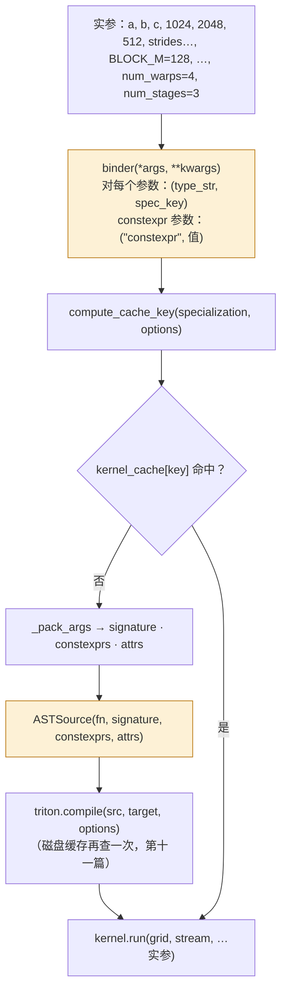
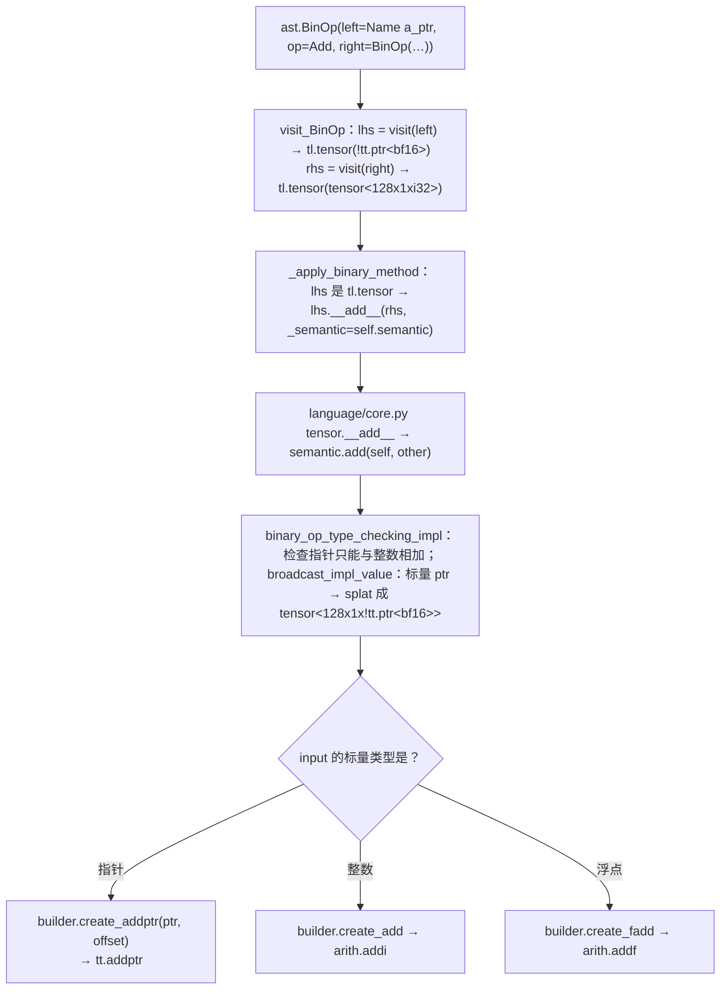
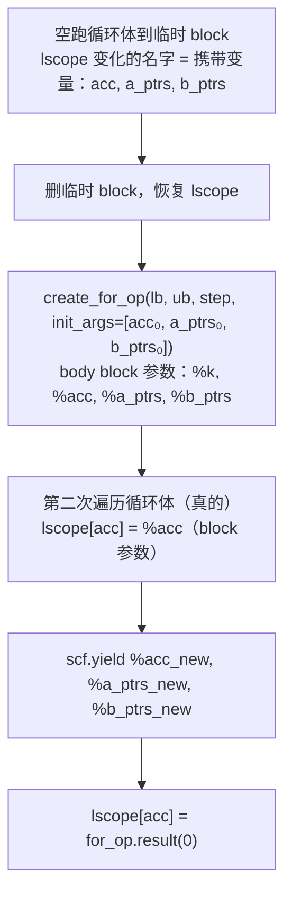

前四篇讲的是通用机制：IR、SSA、pass、LLVM、MLIR 的数据结构与三种变换框架。从这一篇起进入 Triton 编译器本身，按编译流水线的顺序走七篇。第一站是**前端**——Triton 里唯一用 Python 写的一段编译器。

它经常被误解。`@triton.jit` 下面的函数看起来是 Python，`kernel[grid](x, y, N, BLOCK=1024)` 看起来是调用它，但那个函数**从未被 Python 解释器执行过**。它被 `ast.parse` 成语法树，然后一个 `ast.NodeVisitor` 逐节点遍历，每个节点变成一次 MLIR builder 调用；`tl.load`、`tl.dot` 这些"函数"在编译期运行，它们的返回值不是数据，是 IR 里的一个 `Value`。理解这一点，Triton 语言的大部分限制——为什么循环里不能改张量的 shape、为什么 `if` 的条件不能是多元素张量、为什么全局变量必须是 `constexpr`——都是自然的。

总纲对这一篇提出的核心问题是：

> **Triton 的前端在编译期就知道每个 `constexpr` 的值和每个整数参数是否是 16 的倍数，这些信息是怎么从"调用时的实参"传到"编译出的 IR"里的？[^q0] 为什么 `x_ptr + offsets` 在 TTIR 里是 `tt.addptr` 而不是 `arith.addi`？[^q1]**

## 一、总览

本文按**一次 kernel 调用的时间线**组织：定义时 `@triton.jit` 做了什么（第二章）→ 调用时怎样从实参算出特化、查缓存、决定要不要编译（第三章）→ 编译时 `CodeGenerator` 怎样把 AST 翻译成 IR（第四章）→ 翻译出来的 TTIR 长什么样、`tt` 方言有哪些 op（第五章）→ TTIR 级的 pass 做了什么（第六章）。前两段是运行时的 Python，后三段是编译器；分界线是 `ASTSource` 这个对象——它把"这次调用要编译什么"打包成一个纯数据的描述，交给 `triton.compile`。

贯穿本文和后面六篇的例子是同一个 BF16 matmul kernel：

```python
import triton
import triton.language as tl

@triton.jit
def matmul_kernel(a_ptr, b_ptr, c_ptr, M, N, K,
                  stride_am, stride_ak, stride_bk, stride_bn, stride_cm, stride_cn,
                  BLOCK_M: tl.constexpr, BLOCK_N: tl.constexpr, BLOCK_K: tl.constexpr):
    pid_m = tl.program_id(0)                                              # ①
    pid_n = tl.program_id(1)
    offs_m = pid_m * BLOCK_M + tl.arange(0, BLOCK_M)                      # ②
    offs_n = pid_n * BLOCK_N + tl.arange(0, BLOCK_N)
    offs_k = tl.arange(0, BLOCK_K)
    a_ptrs = a_ptr + offs_m[:, None] * stride_am + offs_k[None, :] * stride_ak   # ③
    b_ptrs = b_ptr + offs_k[:, None] * stride_bk + offs_n[None, :] * stride_bn
    acc = tl.zeros((BLOCK_M, BLOCK_N), dtype=tl.float32)                  # ④
    for k in range(0, K, BLOCK_K):                                        # ⑤
        a = tl.load(a_ptrs)
        b = tl.load(b_ptrs)
        acc = tl.dot(a, b, acc)                                           # ⑥
        a_ptrs += BLOCK_K * stride_ak
        b_ptrs += BLOCK_K * stride_bk
    c = acc.to(tl.bfloat16)
    c_ptrs = c_ptr + offs_m[:, None] * stride_cm + offs_n[None, :] * stride_cn
    mask = (offs_m[:, None] < M) & (offs_n[None, :] < N)                  # ⑦
    tl.store(c_ptrs, c, mask=mask)
```

它假设 `K` 是 `BLOCK_K` 的倍数（K 循环里没有 mask），只在写回时处理 M、N 的边界。调用方式：

```python
a = torch.randn(1024, 512, device="cuda", dtype=torch.bfloat16)
b = torch.randn(512, 2048, device="cuda", dtype=torch.bfloat16)
c = torch.empty(1024, 2048, device="cuda", dtype=torch.bfloat16)
grid = (triton.cdiv(1024, 128), triton.cdiv(2048, 128))
matmul_kernel[grid](a, b, c, 1024, 2048, 512,
                    a.stride(0), a.stride(1), b.stride(0), b.stride(1), c.stride(0), c.stride(1),
                    BLOCK_M=128, BLOCK_N=128, BLOCK_K=32, num_warps=4, num_stages=3)
```

| 章 | 主题 | 内容 |
|---|---|---|
| 二 | 定义时 | `JITFunction` 保存源码而不执行；`KernelParam` 与 `constexpr` 标注；源码哈希与依赖追踪 |
| 三 | 调用时 | binder 从实参算特化（dtype、`D`、等于 1 → `constexpr`）；两级缓存；`ASTSource` 的内容 |
| 四 | 翻译 | `CodeGenerator` 作为 `ast.NodeVisitor`；`tl.tensor` 是编译期句柄；表达式、内建函数、`constexpr` 的折叠与物化；`for` / `if` / `while` 到 `scf`；函数调用 |
| 五 | TTIR | `tt` 方言的类型与 op，借用的 `arith` / `math` / `scf` / `cf`；matmul kernel 的完整 TTIR 逐段读 |
| 六 | TTIR 级 pass | `make_ttir` 的八个 pass 各做什么；`Combine` 的 DRR 模式与 C++ 模式 |
| 七 | 本文小结 | |
| 八 | 自测 | 5 道题 |

源码以 Triton v3.8.0 为准：`python/triton/runtime/jit.py`、`python/src/specialize.cc`、`python/triton/compiler/{compiler,code_generator}.py`、`python/triton/language/{core,semantic}.py`、`include/triton/Dialect/Triton/IR/TritonOps.td`、`lib/Dialect/Triton/Transforms/`、`third_party/nvidia/backend/compiler.py`。

## 二、定义时：`@triton.jit` 做了什么

### 1. 保存源码，不执行

`triton.jit` 是一个装饰器，返回 `JITFunction` 对象（`runtime/jit.py`）。它的构造函数（基类 `JITCallable.__init__`）做的事：

1. `inspect.getsourcelines(fn)` 拿到函数的**源码文本**，去掉装饰器行、`textwrap.dedent`，存在 `self._src`。这是为什么 `@triton.jit` 函数必须定义在 `.py` 文件里——交互式 shell 里定义的函数没有源码可取，会报 `@jit functions should be defined in a Python file`；
2. 记下文件名、`def` 所在的行号和列号——后面每条 IR 都会带上源码位置（§四.8）；
3. `inspect.signature(fn)` 拿到参数列表，为每个参数建一个 `KernelParam`：记录它的位置、名字、**是否标注了 `tl.constexpr`**、是否在 `do_not_specialize` / `do_not_specialize_on_alignment` 列表里；
4. 建一个按设备索引的缓存 `device_caches`，每个设备一份（编译产物与设备绑定）。

原始的 Python 函数对象 `fn` 也保存着，但只用来取源码、全局变量和闭包变量。`JITFunction.__call__` 直接抛异常：`Cannot call @triton.jit'd outside of the scope of a kernel`——**它不可调用**。`matmul_kernel[grid]` 走的是 `__getitem__`，返回一个记住了 `grid` 的 lambda，lambda 调 `self.run(...)`。

```mermaid
%% 图：JITFunction 保存什么：源码文本、KernelParam、cache_key、按设备的缓存；kernel[grid] 走 __getitem__ 到 run，直接调用抛异常
flowchart LR
    src["Python 源码文本<br/>（def 开始，无装饰器）"]
    params["KernelParam × 15<br/>名字 · 位置 · is_constexpr · do_not_specialize"]
    hash["cache_key<br/>源码 + 依赖的哈希"]
    caches["device_caches#91;device#93;<br/>kernel_cache · binder · backend"]
    jf["JITFunction"]
    jf --> src
    jf --> params
    jf --> hash
    jf --> caches
    call["matmul_kernel#91;grid#93;(…)"] -- "__getitem__ → run()" --> jf
    direct["matmul_kernel(…)"] -- "__call__ → RuntimeError" --> jf
```



### 2. `constexpr`：类型标注决定参数的身份

`BLOCK_M: tl.constexpr` 这个标注在定义时就被读出来（`KernelParam.is_constexpr`）。它把参数分成两类：

| 参数类别 | 例子 | 在 IR 里是什么 | 改变它会怎样 |
|---|---|---|---|
| 运行时参数 | `a_ptr`、`M`、`stride_am` | `tt.func` 的一个形参，类型 `!tt.ptr<bf16>` / `i32` | 不重新编译（除非特化 key 变了，§三.2） |
| `constexpr` 参数 | `BLOCK_M`、`BLOCK_K` | **不出现在函数签名里**，值直接代入 IR（`tt.make_range {start=0, end=128}`、`arith.constant 128`） | 每个不同的值编译一个新 kernel |

`constexpr` 是 Triton 与 C++ 模板参数的对应物：`BLOCK_M=128` 编出来的 kernel 里，所有 shape 都是字面量 `128`，`tl.arange(0, BLOCK_M)` 的上界是一个属性而不是一个操作数（`TT_MakeRangeOp` 的 `I32Attr:$start, I32Attr:$end`）。这也是为什么张量的 shape 必须是 `constexpr`：MLIR 的 `tensor<128x32xbf16>` 类型要求维度是编译期常量，编译器所有的 layout 推理（第七篇）都建立在 shape 已知之上。

### 3. 源码哈希与依赖

`JITCallable.cache_key` 是一个懒计算的属性：`DependenciesFinder`（一个 `ast.NodeVisitor`）遍历函数的 AST，找出它引用的每个全局名字，如果那是另一个 `@triton.jit` 函数就递归取它的 `cache_key`，如果是 `constexpr` 全局变量就记下它的值，把所有这些连同源码文本一起哈希。结果是：**改了被调用的子函数、改了全局 `constexpr` 的值，主 kernel 的 key 都会变**，触发重新编译。它还把用到的全局变量的值存在 `used_global_vals`，每次 `run` 时检查它们没有被改过——改了就报 `Global variable X has changed since we compiled this kernel`，因为编译产物里已经把旧值烧进去了。

## 三、调用时：特化、缓存与 `ASTSource`

### 1. `run` 的流程

`JITFunction.run` 是每次 `kernel[grid](...)` 走的路：



两个黄色节点是这一章的重点：binder 决定"这次调用属于哪个特化版本"，`ASTSource` 是交给编译器的全部输入。

### 2. binder：从实参算特化

`create_binder` 为每个 `JITFunction` **生成**一个 Python 函数 `dynamic_func`（`create_function_from_signature` 用字符串拼出源码再 `exec`——生成而不是手写，是为了把参数绑定、默认值填充和特化计算压成一次函数调用，这是 kernel launch 开销的主要部分）。它对每个参数调用 `native_specialize_impl`（C++ 实现，`python/src/specialize.cc`），返回一个二元组 `(type_str, spec_key)`：

| 实参 | `type_str` | `spec_key` | 规则来源 |
|---|---|---|---|
| `torch.Tensor`，dtype bf16 | `*bf16` | `"D"` 如果 `data_ptr() % 16 == 0`，否则 `""` | `handle_tensor`：`(data_ptr & 15) == 0` |
| Python `int`，值在 int32 范围 | `i32` | `"D"` 如果 `val % 16 == 0`，否则 `""` | `handle_long_type`：`(val & 15) == 0` |
| Python `int`，超出 int32 | `i64`（无符号超范围则 `u64`） | 同上 | 同上 |
| Python `int`，**值等于 1** | `constexpr` | `1`（作为常量代入） | `handle_long_type`：`specialize_value && val == 1` |
| Python `float` | `fp32` | 不特化（`None`） | 浮点不按值特化 |
| Python `bool` | `u1` | 不特化 | 同上 |
| `constexpr` 参数 | `constexpr` | 参数的值 | `KernelParam.is_constexpr` |
| `do_not_specialize` 列出的参数 | 按类型 | 不特化 | `KernelParam.do_not_specialize` |
| `do_not_specialize_on_alignment` 列出的 | 按类型 | 不看 16 的倍数，但仍看是否等于 1 | `align=False` |

对上面那次调用，binder 产出的 specialization 列表大致是：

| 参数 | 实参 | `(type_str, spec_key)` |
|---|---|---|
| `a_ptr` | 对齐的 bf16 张量 | `("*bf16", "D")` |
| `b_ptr`、`c_ptr` | 同上 | `("*bf16", "D")` |
| `M`、`N`、`K` | 1024、2048、512 | `("i32", "D")` |
| `stride_am` | 512 | `("i32", "D")` |
| `stride_ak` | **1** | `("constexpr", 1)` |
| `stride_bk` | 2048 | `("i32", "D")` |
| `stride_bn` | **1** | `("constexpr", 1)` |
| `stride_cm` | 2048 | `("i32", "D")` |
| `stride_cn` | **1** | `("constexpr", 1)` |
| `BLOCK_M`、`BLOCK_N`、`BLOCK_K` | 128、128、32 | `("constexpr", 128)` … |

三件事值得停一下：

1. **等于 1 的整数被提升为 `constexpr`**。`stride_ak = 1` 意味着 A 是行优先、K 方向连续。如果它只是一个 `i32` 参数，编译器无法知道 `offs_k * stride_ak` 是连续的，第六篇的 AxisInfo 会把 contiguity 算成 1，第七篇的 Coalesce 就选不出向量化的 layout。把 1 烧进 IR 之后，`offs_k * 1` 被折叠成 `offs_k`，连续性一路可见。代价是：传 stride 为 1 和不为 1 的张量会编出两个 kernel。这是 Triton 前端最重要的一个"特化即优化"的决定。
2. **16 的倍数只是一个标记**。`"D"` 不会改变参数类型，它变成函数参数上的属性 `tt.divisibility = 16`（`BaseBackend.parse_attr`），供 AxisInfo 使用。为什么是 16？因为 16 字节是 GPU 一条向量访存指令的宽度（`ld.global.v4.b32`），指针对齐到 16 是向量化的前提。
3. **特化 key 就是内存缓存的 key**。`compute_cache_key` 把 specialization 列表和 options（`num_warps`、`num_stages` 等）拼成字符串，查 `kernel_cache`。所以"同一个函数会被编译多次"的精确说法是：**每一组不同的（dtype、`D` 标记、等于 1 的整数、`constexpr` 值、编译选项）编译一次**。`M` 从 1024 换成 1000（不再是 16 的倍数）会触发一次新编译；换成 2048 不会。

### 3. `ASTSource`：编译器的全部输入

缓存未命中时，`_pack_args` 把 specialization 拆成三份，构造 `ASTSource`（`compiler/compiler.py`）：

| 字段 | 内容（本例） | 用途 |
|---|---|---|
| `fn` | `matmul_kernel` 这个 `JITFunction` | 取源码、解析 AST |
| `signature` | `{"a_ptr": "*bf16", …, "M": "i32", …, "stride_ak": "constexpr", …, "BLOCK_M": "constexpr", …}` | 决定 `tt.func` 的参数类型；`constexpr` 的不进签名 |
| `constants` | `{(7,): 1, (9,): 1, (11,): 1, (12,): 128, (13,): 128, (14,): 32}`（按参数位置索引） | 代入 IR 的编译期常量 |
| `attrs` | `{(0,): [["tt.divisibility", 16]], (1,): …, (3,): …}` | 挂到对应参数上的属性 |

`ASTSource.hash()` 把这四样哈希在一起（`fn.cache_key`、`attrs`、排序后的 `signature`、`constants`），是磁盘缓存 key 的一部分（第十一篇）。注意这里**没有实参的值**——`M = 1024` 这个数不在 `ASTSource` 里，只有"`M` 是 `i32` 且是 16 的倍数"这两个事实在。编译器看到的世界就是这么多。

`triton.compile(src, target, options)` 之后的事在 `compile()` 函数里：先查磁盘缓存，未命中则 `src.make_ir(...)` 调 `ast_to_ttir` 得到 TTIR 模块，然后按后端 `add_stages` 给出的顺序（`ttir → ttgir → llir → ptx → cubin`）依次运行，每一步的产物写进缓存目录。本文只走到 `ttir` 这一格。

## 四、翻译：`CodeGenerator` 怎样把 AST 变成 IR

### 1. 入口：`ast_to_ttir`

```python
def ast_to_ttir(fn, src, context, options, codegen_fns, module_map, module=None):
    arg_types = [None] * len(fn.arg_names)
    for k, v in src.signature.items():
        idx = fn.arg_names.index(k)
        arg_types[idx] = str_to_ty(v, None)                     # ① "*bf16" → pointer_type(bfloat16)
    ...
    for path, value in src.constants.items():
        apply_constexpr_types(arg_types, list(path)[::-1], value)   # ② constexpr 参数的"类型"就是它的值
    prototype = ASTFunction([], arg_types, src.attrs)             # ③ 函数原型：返回值为空、参数类型、属性
    ...
    generator = CodeGenerator(context, prototype, gscope=fn.get_capture_scope(), function_name=fn.repr(proxy),
                              jit_fn=fn, is_kernel=True, ..., options=options, ...)
    generator.visit(fn.parse())                                   # ④ ast.parse(源码) → 遍历
    module = generator.module
    if not module.verify():                                       # ⑤ MLIR 的 verifier
        raise RuntimeError("error encountered during parsing")
    return module
```

1. ① 签名字符串变成 Triton 的类型对象（`tl.pointer_type(tl.bfloat16)`、`tl.int32`）；
2. ② `constexpr` 参数的类型是 `constexpr_type(value)`——一个把值本身当类型的包装，这样在函数体里引用 `BLOCK_M` 得到的就是 Python 整数 128；
3. ③ `ASTFunction` 是函数原型，`serialize` 时把参数类型翻译成 MLIR 类型（`!tt.ptr<bf16>`、`i32`），`constexpr` 参数被跳过，属性挂在对应位置；
4. ④ 一次遍历生成整个函数；
5. ⑤ `verify()` 运行每个 op 的 verifier（第三篇讲过：ODS 里的 `TypesMatchWith`、`hasVerifier` 生成的检查）——前端生成的 IR 在这里被 MLIR 检查一遍。

### 2. `CodeGenerator` 是一个 `ast.NodeVisitor`

`CodeGenerator(ast.NodeVisitor)` 为每种 AST 节点定义一个 `visit_X` 方法：`visit_FunctionDef`、`visit_Assign`、`visit_BinOp`、`visit_For`、`visit_If`、`visit_Call`、`visit_Name`、`visit_Constant`……`visit(node)` 按节点类型分派。每个 `visit_X` 的返回值是这个节点"求值"的结果，但求出来的不是数据，是三种东西之一：

| 返回值类型 | 例子 | 含义 |
|---|---|---|
| `tl.tensor` | `pid_m`、`offs_m`、`acc` | 一个 IR 值的**句柄**：`.handle` 是 MLIR 的 `Value`（通过 pybind 暴露），`.type` 是 Triton 的类型对象（`block_type([128], int32)`） |
| `tl.constexpr` | `BLOCK_M`、`BLOCK_K * stride_ak`（两个 constexpr 相乘） | 编译期已知的 Python 值，**还没有进入 IR** |
| 其他 Python 对象 | `tl.float32`（dtype）、`tl`（模块）、`range`（内建） | 只在编译期有意义 |

`self.builder` 是 MLIR `OpBuilder` 的 Python 绑定（`ir.builder`）：`create_addptr`、`create_load`、`create_for_op` 这些方法各生成一个 op 插到当前插入点，返回结果 `Value`。`self.semantic` 是 `TritonSemantic`（`language/semantic.py`），封装类型检查、广播和"调哪个 builder 方法"的决定。

三个作用域：

- `gscope`：函数的全局变量和闭包变量（`fn.get_capture_scope()`）。**只允许**引用这些全局：模块（`tl`、`triton`）、`@triton.jit` 函数、`constexpr` 值、dtype、内建函数——普通的全局变量会报 `Cannot access global variable X from within @jit'ed function`（`_define_name_lookup` 里那一长串条件）。原因是编译产物会被缓存，一个可变的全局变量烧进 kernel 后没有办法知道它变了；`constexpr` 全局是例外，因为它的值进了 `cache_key`。
- `lscope`：局部变量名 → 当前值。这是 SSA 构造的核心：**每个 Python 变量名对应"当前的" SSA 值**，`x = x + 1` 只是把 `lscope["x"]` 指向新生成的 `arith.addi` 结果，旧值仍在 IR 里，不会被修改。
- `builtin_namespace`：`len`、`range`、`int`、`min`、`max`、`print`（映射到 `tl.device_print`）。

### 3. 表达式：一个 `+` 怎么变成 `tt.addptr`

`a_ptr + offs_m[:, None] * stride_am` 的翻译路径：



`semantic.add` 的分派：

```python
def add(self, input, other, sanitize_overflow):
    input, other = self.binary_op_type_checking_impl(input, other, True, True)
    input_scalar_ty = input.type.scalar
    other_scalar_ty = other.type.scalar
    if input_scalar_ty.is_ptr() and other_scalar_ty.is_ptr():
        raise TypeError("cannot add pointers together")
    if other_scalar_ty.is_ptr() and not input_scalar_ty.is_ptr():    # offset + ptr → 交换成 ptr + offset
        input, other = other, input
        ...
    if input_scalar_ty.is_ptr():
        ...
        return self.tensor(self.builder.create_addptr(input.handle, other_handle), input.type)   # ①
    elif input_scalar_ty.is_floating():
        return self.tensor(self.builder.create_fadd(input.handle, other.handle), input.type)     # ②
    elif input_scalar_ty.is_int():
        if sanitize_overflow:
            self.binary_op_sanitize_overflow_impl(input, other, self.add)
        return self.tensor(self.builder.create_add(input.handle, other.handle), input.type)      # ③
```

这就是核心问题的第二问的答案：**分派发生在编译期，依据是操作数的 Triton 类型**。① 指针加整数是 `tt.addptr`——一个专门的 op，让后面的 AxisInfo（第六篇）知道"这是地址算术、元素类型是 bf16、偏移的单位是元素而不是字节"，让 `Combine` pass 能把 `addptr(addptr(p, a), b)` 合并成 `addptr(p, a + b)`；② ③ 数值加法用 MLIR 标准的 `arith` 方言，Triton 不重复发明。如果 `x_ptr + offsets` 被翻译成 `arith.addi`，指针就退化成了整数，所有依赖"这是一个指针"的分析都做不了。

`binary_op_type_checking_impl` 还做两件事：**隐式类型提升**（`i32 + i64 → i64`，`bf16 + f32 → f32`，规则在 `computation_type_impl`）和**隐式广播**（`broadcast_impl_value`）。Triton 的广播比 NumPy 严格：两个张量的秩必须相同，对应维度要么相等要么其一为 1；标量与张量相加时标量被 `tt.splat` 成同 shape。`offs_m[:, None]` 是 `tt.expand_dims`（`[128] → [128, 1]`），`offs_k[None, :]` 是 `[32] → [1, 32]`，两者相加时各自 `tt.broadcast` 到 `[128, 32]`。

### 4. 内建函数：编译期执行的 Python

`tl.load`、`tl.dot`、`tl.arange`、`tl.program_id` 在 `language/core.py` 里用 `@builtin` 装饰。`visit_Call` 求出被调对象后，`call_Function` 发现它是 builtin，就**在编译期直接调用它**，额外注入 `_semantic=self.semantic`：

```python
if (hasattr(fn, '__self__') and _is_triton_value(fn.__self__)) or language.core.is_builtin(fn) or ...:
    ...
    if '_semantic' in sig.parameters:
        extra_kwargs["_semantic"] = self.semantic
    ret = fn(*args, **extra_kwargs, **kws)
```

`tl.load(a_ptrs)` 于是变成 `core.load(pointer, mask=None, other=None, ..., _semantic)` → `semantic.load(...)`：检查 `ptr` 是指针类型、`other` 必须与 `mask` 同时出现、把 `mask` / `other` 广播到 `ptr` 的 shape、把 `cache_modifier` 字符串（`".cg"`）变成枚举，最后 `builder.create_load(...)` 生成一个 `tt.load`。**内建函数是"生成 IR 的函数"，不是"计算数据的函数"**——这是理解 Triton 的关键：`a = tl.load(a_ptrs)` 之后，`a` 是一个类型为 `tensor<128x32xbf16>` 的 IR 值的句柄，任何"看看 `a` 里是什么"的操作在编译期都没有意义。

`tl.static_assert`、`tl.static_print` 是另一类：它们在 `statically_implemented_functions` 表里，由 `CodeGenerator` 直接实现，操作的是 `constexpr` 值，不生成 IR。

### 5. `constexpr` 的两种命运：折叠或物化

`constexpr` 值在遍历时是普通 Python 对象。它们参与运算时走 `constexpr.__add__` 等方法——**用 Python 直接算**，结果还是 `constexpr`：`BLOCK_K * stride_ak` 在本例是 `32 * 1 = 32`，编译期就算完了。这就是常量折叠，发生在生成 IR 之前，比 MLIR 的 `fold` 更早。

当一个 `constexpr` 与 `tl.tensor` 运算时，`binary_op_type_checking_impl` 里的 `to_tensor` 把它**物化**成 IR 常量：`arith.constant 128 : i32`（标量）或 `arith.constant dense<0.0> : tensor<128x128xf32>`（`tl.zeros`）。`pid_m * BLOCK_M` 就是 `arith.muli %pid_m, %c128`。

两个控制流层面的折叠：

- `if` 的条件是 `constexpr` 时（`visit_If` 的 `else` 分支），**只遍历活的那一支**——另一支的代码根本不生成 IR，这是 `if BLOCK_M >= 128:` 这种编译期分支的实现，对应 C++ 的 `if constexpr`；
- `for i in tl.static_range(n)` 在 Python 层展开：`visit_For` 对 `static_range` 直接 `for i in range(...)` 遍历循环体 n 次，每次把 `i` 设为 `constexpr(i)`。生成的 IR 里没有循环，只有 n 份循环体。

### 6. 控制流：`for` 到 `scf.for`

普通的 `for k in range(0, K, BLOCK_K)` 生成 `scf.for`。`visit_For` 的步骤（`code_generator.py`）：

1. 求出 `lb`、`ub`、`step`，都转成 IR 值（`K` 是函数参数 `%K: i32`，`BLOCK_K` 物化成 `arith.constant 32`），做整数类型提升；
2. 为归纳变量 `k` 创建一个**占位符**（`create_poison`），先把 `lscope["k"]` 指向它——循环体里对 `k` 的引用暂时指向这个占位；
3. **`_find_carries`：空跑一遍循环体**。开一个临时 block，把插入点设到那里，`visit_compound_statement(node.body)` 把循环体翻译一遍，然后比较 `lscope` 里每个名字的值在空跑前后是否相同——变了的就是**循环携带变量**（loop-carried）。本例是 `acc`、`a_ptrs`、`b_ptrs`；`a`、`b` 是循环内新定义的（不在 liveins 里），`offs_m` 没变。然后把临时 block **删掉**、`lscope` 恢复；
4. 用携带变量循环前的值作为 `init_args` 创建 `scf.for`，循环体 block 的参数依次是归纳变量和各携带变量。把 `lscope["acc"]` 等指向对应的 block 参数，**再遍历一遍循环体**，这次是真的；
5. 循环体末尾用 `lscope` 里携带变量的最新值生成 `scf.yield`；
6. 用真正的归纳变量替换占位符（`iv_placeholder.replace_all_uses_with(iv)`）；
7. 循环结束后，`lscope["acc"]` 等指向 `scf.for` 的结果。



这是前端做 SSA 构造的方式（第一篇 §四.7 的预告）：结构化控制流让"汇合点"只有 `scf.for` 的入口和出口，不需要支配边界——空跑一遍找出哪些变量需要成为 iter_args 就够了。代价是**循环体被翻译两次**（编译时间），以及一条限制：`_verify_loop_carried_variable` 要求携带变量在循环前后类型相同——循环里不能改变张量的 shape 或 dtype，因为 block 参数的类型是固定的。

`tl.range(..., num_stages=, loop_unroll_factor=, warp_specialize=, flatten=)` 是带选项的 `range`：选项变成 `scf.for` 上的属性（`tt.num_stages`、`tt.loop_unroll_factor`、`tt.warp_specialize`、`tt.flatten`），供第九篇的流水化 pass 和本篇 §六 的 `LoopUnroll` 读取。

`if` 的处理（`visit_If`）分三路：条件是 `constexpr` → 编译期选择一支；条件是标量 `tl.tensor` 且分支里**没有 `return`** → `scf.if`（两支各一个 Region，两支都赋值的变量成为 `scf.if` 的结果，与 `for` 一样用 liveins 差分找出来）；分支里有 `return` → 退回到 `cf.cond_br` + 基本块（`visit_if_top_level`），因为 `scf.if` 的 Region 里不能有 `return`。`while` → `scf.while`，条件与循环体各一个 Region。多元素张量作条件直接报错：`Boolean value of Tensor with more than one value is ambiguous`——GPU 上一个 block 的所有线程必须走同一条控制流。

### 7. 函数调用：按参数类型实例化

调用另一个 `@triton.jit` 函数时（`call_JitFunction`），被调函数**按实参的类型**编成一个独立的 `tt.func private`：函数名是 `mangle_fn(全名, 参数类型列表)`——同一个子函数用不同类型（或不同 `constexpr` 值）调用会生成多个实例，与 C++ 模板函数的实例化一样。调用点生成 `tt.call`。所有这些函数在 `make_ttir` 的第一个 pass 就被内联（§六），前端不做内联决定。`noinline=True` 的函数例外，会一直保留到 LLVM。

### 8. 位置信息

每条生成的 op 都带 `loc(...)`：`builder.set_loc(file, line, col)` 在遍历每个 AST 节点时更新（`CodeGenerator.visit` 的包装），赋值语句还会给结果值加一层 `NameLoc`（`_maybe_set_loc_to_name`），让 IR 里能看到 `loc("acc"(...))`。三个用途：编译错误能指回 Python 源码行；`TRITON_KERNEL_DUMP` 出来的 IR 里能对照变量名；`-lineinfo` 传到 PTX 之后，Nsight Compute 能把 SASS 指令映射回 Python 行。

## 五、TTIR：`tt` 方言长什么样

### 1. 类型

| MLIR 类型 | 含义 | 来源 |
|---|---|---|
| `i32`、`i64`、`i1`、`f32`、`bf16`、`f16`、`f8E4M3FN`… | 标量 | MLIR builtin |
| `!tt.ptr<bf16>` | 指向 bf16 的指针；地址空间可选（`!tt.ptr<f32, 3>` 是 shared） | `TritonTypes.td` 的 `TT_PtrType` |
| `tensor<128x32xbf16>` | 块级张量，shape 是编译期常量；**没有 layout**（TTIR 阶段） | MLIR builtin `RankedTensorType` |
| `tensor<128x32x!tt.ptr<bf16>>` | 指针张量 | 同上，元素是 `tt.ptr` |
| `!tt.tensordesc<tensor<128x32xbf16>>` | TMA 张量描述符（Hopper+） | `TT_TensorDescType` |

TTIR 把张量表示为 MLIR 内建的 `tensor` 类型，只是元素类型允许 `!tt.ptr`。这让 `arith`、`math` 这些标准方言的 op 可以直接作用在 Triton 的张量上——`arith.addi %a, %b : tensor<128xi32>` 是合法的 MLIR，不需要 Triton 自己定义整数加法。**Triton 只定义 MLIR 没有的东西**。

### 2. Op 一览

`tt` 方言在 v3.8.0 有约四十个 op（`TritonOps.td`），按用途分：

| 类别 | op | 对应的 Python 写法 |
|---|---|---|
| 程序坐标 | `tt.get_program_id`、`tt.get_num_programs` | `tl.program_id(0)`、`tl.num_programs(0)` |
| 构造张量 | `tt.make_range`、`tt.splat`、`arith.constant dense<…>` | `tl.arange(0, N)`、标量广播、`tl.zeros` / `tl.full` |
| 形状 | `tt.expand_dims`、`tt.broadcast`、`tt.reshape`、`tt.trans`、`tt.join` / `tt.split`、`tt.cat`、`tt.unsplat` | `x[:, None]`、隐式广播、`tl.reshape`、`tl.trans`、`tl.join` / `tl.split`、`.item()` |
| 指针 | `tt.addptr`、`tt.int_to_ptr` / `tt.ptr_to_int`、`tt.bitcast` | `ptr + off`、`.to(tl.pointer_type(…))`、`.to(…, bitcast=True)` |
| 访存 | `tt.load`、`tt.store`、`tt.atomic_rmw`、`tt.atomic_cas` | `tl.load`、`tl.store`、`tl.atomic_add` 等、`tl.atomic_cas` |
| 张量描述符 | `tt.make_tensor_descriptor`、`tt.descriptor_load` / `store` / `gather` / `scatter` / `reduce` | `tl.make_tensor_descriptor`、`desc.load(...)` |
| 计算 | `tt.dot`、`tt.dot_scaled`、`tt.reduce`（带 Region）、`tt.scan`（带 Region）、`tt.histogram`、`tt.gather` | `tl.dot`、`tl.dot_scaled`、`tl.sum` / `tl.max` / `tl.reduce`、`tl.cumsum` / `tl.associative_scan`、`tl.histogram`、`tl.gather` |
| 数值 | `tt.fp_to_fp`、`tt.clampf`、`tt.precise_sqrt` / `precise_divf`、`tt.mulhiui`、`tt.extern_elementwise`、`tt.elementwise_inline_asm` | `.to(tl.float8e4nv)`、`tl.clamp`、`tl.sqrt_rn`、`tl.umulhi`、`tl.extra.libdevice.*`、`tl.inline_asm_elementwise` |
| 函数 | `tt.func`、`tt.call`、`tt.return` | `def`、调用子函数、`return` |
| 调试 | `tt.print`、`tt.assert` | `tl.device_print`、`tl.device_assert` |

借用的标准方言：`arith`（所有整数 / 浮点算术、比较、`select`、类型转换 `extf` / `truncf` / `sitofp` …）、`math`（`exp`、`log`、`sqrt` …）、`scf`（`for` / `if` / `while` / `yield`）、`cf`（有 `return` 的 `if` 退化出的分支）、`ub.poison`（归纳变量占位）。

`tt.reduce` 带一个 Region：规约的组合函数是一段 IR（`tl.sum` 的 Region 里是一个 `arith.addf` + `tt.reduce.return`），而不是一个枚举——这让 `tl.reduce(x, axis, combine_fn)` 可以接任意用户函数，也让 `tl.max` 与 `tl.argmax` 这种双输入双输出的规约用同一个 op 表达。

### 3. matmul kernel 的 TTIR

用 `ASTSource` 直接调 `triton.compile` 并停在 TTIR，不需要 GPU（`third_party/nvidia/backend/compiler.py` 的 `make_ttir` 只依赖 MLIR）：

```python
from triton.compiler import ASTSource, compile
from triton.backends.compiler import GPUTarget

sig = {"a_ptr": "*bf16", "b_ptr": "*bf16", "c_ptr": "*bf16", "M": "i32", "N": "i32", "K": "i32",
       "stride_am": "i32", "stride_ak": "constexpr", "stride_bk": "i32", "stride_bn": "constexpr",
       "stride_cm": "i32", "stride_cn": "constexpr",
       "BLOCK_M": "constexpr", "BLOCK_N": "constexpr", "BLOCK_K": "constexpr"}
consts = {"stride_ak": 1, "stride_bn": 1, "stride_cn": 1, "BLOCK_M": 128, "BLOCK_N": 128, "BLOCK_K": 32}
attrs = {(i,): [["tt.divisibility", 16]] for i in (0, 1, 2, 3, 4, 5, 6, 8, 10)}
src = ASTSource(matmul_kernel, sig, consts, attrs)
k = compile(src, target=GPUTarget("cuda", 80, 32), options={"num_warps": 4, "num_stages": 3})
print(k.asm["ttir"])
```

这一步不需要 `ptxas` 之外的任何 NVIDIA 组件——`make_cubin` 那一格才会调 `ptxas`；在没有它的机器上把 `TRITON_PTXAS_PATH` 指向一个只回答 `--version` 的脚本，前四格照常产出。下面是 Triton v3.8.0 产出的完整 TTIR（去掉了每行末尾的 `loc(#locN)`，`#loc` 定义表也略去）：

```mlir
module {
  tt.func public @matmul_kernel(%a_ptr: !tt.ptr<bf16> {tt.divisibility = 16 : i32}, %b_ptr: !tt.ptr<bf16> {tt.divisibility = 16 : i32},
                                %c_ptr: !tt.ptr<bf16> {tt.divisibility = 16 : i32}, %M: i32 {tt.divisibility = 16 : i32},
                                %N: i32 {tt.divisibility = 16 : i32}, %K: i32 {tt.divisibility = 16 : i32},
                                %stride_am: i32 {tt.divisibility = 16 : i32}, %stride_bk: i32 {tt.divisibility = 16 : i32},
                                %stride_cm: i32 {tt.divisibility = 16 : i32}) attributes {noinline = false} {          // ①
    %acc = arith.constant dense<0.000000e+00> : tensor<128x128xf32>                                                  // ②
    %c0_i32 = arith.constant 0 : i32
    %cst = arith.constant dense<32> : tensor<128x32xi32>
    %c32_i32 = arith.constant 32 : i32
    %c128_i32 = arith.constant 128 : i32
    %pid_m = tt.get_program_id x : i32
    %pid_n = tt.get_program_id y : i32
    %offs_m = arith.muli %pid_m, %c128_i32 : i32                                                                     // ③
    %offs_m_0 = tt.make_range {end = 128 : i32, start = 0 : i32} : tensor<128xi32>
    %offs_m_1 = tt.splat %offs_m : i32 -> tensor<128xi32>
    %offs_m_2 = arith.addi %offs_m_1, %offs_m_0 : tensor<128xi32>
    %offs_n = arith.muli %pid_n, %c128_i32 : i32
    %offs_n_3 = tt.splat %offs_n : i32 -> tensor<128xi32>
    %offs_n_4 = arith.addi %offs_n_3, %offs_m_0 : tensor<128xi32>                                                    // ④
    %offs_k = tt.make_range {end = 32 : i32, start = 0 : i32} : tensor<32xi32>
    %a_ptrs = tt.expand_dims %offs_m_2 {axis = 1 : i32} : tensor<128xi32> -> tensor<128x1xi32>                       // ⑤
    %a_ptrs_5 = tt.splat %stride_am : i32 -> tensor<128x1xi32>
    %a_ptrs_6 = arith.muli %a_ptrs, %a_ptrs_5 : tensor<128x1xi32>
    %a_ptrs_7 = tt.splat %a_ptr : !tt.ptr<bf16> -> tensor<128x1x!tt.ptr<bf16>>
    %a_ptrs_8 = tt.addptr %a_ptrs_7, %a_ptrs_6 : tensor<128x1x!tt.ptr<bf16>>, tensor<128x1xi32>                      // ⑥
    %a_ptrs_9 = tt.expand_dims %offs_k {axis = 0 : i32} : tensor<32xi32> -> tensor<1x32xi32>
    %a_ptrs_10 = tt.broadcast %a_ptrs_8 : tensor<128x1x!tt.ptr<bf16>> -> tensor<128x32x!tt.ptr<bf16>>
    %a_ptrs_11 = tt.broadcast %a_ptrs_9 : tensor<1x32xi32> -> tensor<128x32xi32>
    %a_ptrs_12 = tt.addptr %a_ptrs_10, %a_ptrs_11 : tensor<128x32x!tt.ptr<bf16>>, tensor<128x32xi32>                 // ⑦
    %b_ptrs = tt.expand_dims %offs_k {axis = 1 : i32} : tensor<32xi32> -> tensor<32x1xi32>
    %b_ptrs_13 = tt.splat %stride_bk : i32 -> tensor<32x1xi32>
    %b_ptrs_14 = arith.muli %b_ptrs, %b_ptrs_13 : tensor<32x1xi32>
    %b_ptrs_15 = tt.splat %b_ptr : !tt.ptr<bf16> -> tensor<32x1x!tt.ptr<bf16>>
    %b_ptrs_16 = tt.addptr %b_ptrs_15, %b_ptrs_14 : tensor<32x1x!tt.ptr<bf16>>, tensor<32x1xi32>
    %b_ptrs_17 = tt.expand_dims %offs_n_4 {axis = 0 : i32} : tensor<128xi32> -> tensor<1x128xi32>
    %b_ptrs_18 = tt.broadcast %b_ptrs_16 : tensor<32x1x!tt.ptr<bf16>> -> tensor<32x128x!tt.ptr<bf16>>
    %b_ptrs_19 = tt.broadcast %b_ptrs_17 : tensor<1x128xi32> -> tensor<32x128xi32>
    %b_ptrs_20 = tt.addptr %b_ptrs_18, %b_ptrs_19 : tensor<32x128x!tt.ptr<bf16>>, tensor<32x128xi32>
    %acc_21:3 = scf.for %k = %c0_i32 to %K step %c32_i32
        iter_args(%a_ptrs_34 = %a_ptrs_12, %b_ptrs_35 = %b_ptrs_20, %acc_36 = %acc)
        -> (tensor<128x32x!tt.ptr<bf16>>, tensor<32x128x!tt.ptr<bf16>>, tensor<128x128xf32>)  : i32 {               // ⑧
      %a = tt.load %a_ptrs_34 : tensor<128x32x!tt.ptr<bf16>>
      %b = tt.load %b_ptrs_35 : tensor<32x128x!tt.ptr<bf16>>
      %acc_37 = tt.dot %a, %b, %acc_36, inputPrecision = tf32 : tensor<128x32xbf16> * tensor<32x128xbf16> -> tensor<128x128xf32>   // ⑨
      %a_ptrs_38 = tt.addptr %a_ptrs_34, %cst : tensor<128x32x!tt.ptr<bf16>>, tensor<128x32xi32>                     // ⑩
      %b_ptrs_39 = arith.muli %stride_bk, %c32_i32 : i32
      %b_ptrs_40 = tt.splat %b_ptrs_39 : i32 -> tensor<32x128xi32>
      %b_ptrs_41 = tt.addptr %b_ptrs_35, %b_ptrs_40 : tensor<32x128x!tt.ptr<bf16>>, tensor<32x128xi32>
      scf.yield %a_ptrs_38, %b_ptrs_41, %acc_37 : tensor<128x32x!tt.ptr<bf16>>, tensor<32x128x!tt.ptr<bf16>>, tensor<128x128xf32>
    }
    %c = arith.truncf %acc_21#2 : tensor<128x128xf32> to tensor<128x128xbf16>
    %c_ptrs = tt.splat %stride_cm : i32 -> tensor<128x1xi32>
    %c_ptrs_22 = arith.muli %a_ptrs, %c_ptrs : tensor<128x1xi32>                                                     // ⑪
    %c_ptrs_23 = tt.splat %c_ptr : !tt.ptr<bf16> -> tensor<128x1x!tt.ptr<bf16>>
    %c_ptrs_24 = tt.addptr %c_ptrs_23, %c_ptrs_22 : tensor<128x1x!tt.ptr<bf16>>, tensor<128x1xi32>
    %c_ptrs_25 = tt.broadcast %c_ptrs_24 : tensor<128x1x!tt.ptr<bf16>> -> tensor<128x128x!tt.ptr<bf16>>
    %c_ptrs_26 = tt.broadcast %b_ptrs_17 : tensor<1x128xi32> -> tensor<128x128xi32>
    %c_ptrs_27 = tt.addptr %c_ptrs_25, %c_ptrs_26 : tensor<128x128x!tt.ptr<bf16>>, tensor<128x128xi32>
    %mask = tt.splat %M : i32 -> tensor<128x1xi32>
    %mask_28 = arith.cmpi slt, %a_ptrs, %mask : tensor<128x1xi32>                                                    // ⑫
    %mask_29 = tt.splat %N : i32 -> tensor<1x128xi32>
    %mask_30 = arith.cmpi slt, %b_ptrs_17, %mask_29 : tensor<1x128xi32>
    %mask_31 = tt.broadcast %mask_28 : tensor<128x1xi1> -> tensor<128x128xi1>
    %mask_32 = tt.broadcast %mask_30 : tensor<1x128xi1> -> tensor<128x128xi1>
    %mask_33 = arith.andi %mask_31, %mask_32 : tensor<128x128xi1>
    tt.store %c_ptrs_27, %c, %mask_33 : tensor<128x128x!tt.ptr<bf16>>
    tt.return
  }
}
```

逐处对照 Python 源码（SSA 值的名字来自前端挂的 `NameLoc`——打印器用它给值命名，所以能直接看出每个值对应哪个 Python 变量；同名的多个值加 `_N` 后缀）：

1. ① 函数签名：15 个 Python 参数只剩 9 个——`stride_ak`、`stride_bn`、`stride_cn`（等于 1 被提升）和三个 `BLOCK_*` 都是 `constexpr`，不进签名。9 个参数每个都有 `tt.divisibility = 16`（本次调用的实参都对齐）。`noinline = false` 是 Triton 加在 `tt.func` 上的属性。
2. ② `tl.zeros((128, 128), tl.float32)` 是一个 `arith.constant dense<0.0>`——常量被 canonicalize 提到了函数开头（MLIR 的常量物化位置）。`%cst = dense<32>` 是 `BLOCK_K * stride_ak = 32 * 1` 在 Python 层折叠后再物化的结果（用在 ⑩）。
3. ③ `pid_m * BLOCK_M`：`BLOCK_M` 物化成 `%c128_i32`，标量乘；然后 `tt.splat` 到 `tensor<128xi32>` 与 `tt.make_range` 相加——这是 `semantic.add` 里的隐式广播。
4. ④ `offs_n` 用的 `make_range` 是 `%offs_m_0`——`tl.arange(0, BLOCK_M)` 与 `tl.arange(0, BLOCK_N)` 相同（都是 0..128），**CSE 把两个合并成了一个**，名字保留了先出现的那个。
5. ⑤ `offs_m[:, None]` 是 `tt.expand_dims {axis = 1}`，结果 `tensor<128x1xi32>`；它被命名为 `%a_ptrs`，因为它是 `a_ptrs = …` 这一行里生成的第一个值。
6. ⑥ 第一个 `tt.addptr`：`a_ptr`（`tt.splat` 成 `[128, 1]` 的指针张量）加 `offs_m[:, None] * stride_am`。`stride_am` 是运行时参数，所以 `arith.muli` 保留；对比 `stride_ak = 1`：`offs_k[None, :] * 1` **在 IR 里根本不存在**——`constexpr(1)` 与张量相乘时 `semantic.mul` 生成 `muli %x, dense<1>`，canonicalize 把它折成 `%x`。
7. ⑦ 第二个 `tt.addptr`：两边先各自 `tt.broadcast` 到 `[128, 32]`（指针从 `[128, 1]`、偏移从 `[1, 32]`）。注意 `Combine` 的 `CombineAddPtrPattern` **没有**把 ⑥ ⑦ 合成一个——模式要求 `addptr(addptr(p, a), b)` 直接嵌套，而这里两个 `addptr` 之间隔着一个 `tt.broadcast`（⑥ 的结果是 `[128, 1]`，⑦ 作用在 `[128, 32]` 上）。这条模式命中的是 `p + a + b` 三者同 shape 的写法。第六篇的 AxisInfo 对这两个 `addptr` 分别推理，结果与合并后相同。
8. ⑧ `scf.for`：三个 iter_args 正是 `_find_carries` 空跑找出的 `a_ptrs`、`b_ptrs`、`acc`（顺序是它们在 liveins 里的顺序），结果 `%acc_21:3` 是三个值的元组，`%acc_21#2` 取第三个。归纳变量 `%k` 是 `i32`（`0`、`K`、`32` 都是 i32，类型提升后仍是 i32）。
9. ⑨ `tt.dot %a, %b, %acc_36`：累加器直接是 `acc`（用户写的就是 `tl.dot(a, b, acc)` 形式，不需要 `Combine` 折叠）。`inputPrecision = tf32` 是 `CUDAOptions.default_dot_input_precision` 的默认值——对 bf16 输入无效（这个属性只影响 f32 输入），但前端总是写上。
10. ⑩ `a_ptrs += 32`：`tt.addptr` 加常量张量 `%cst`；`b_ptrs += BLOCK_K * stride_bk`：`stride_bk` 是运行时值，所以是 `arith.muli %stride_bk, %c32_i32` 再 `tt.splat`——**这个乘法在循环里每轮重算**：`make_ttir` 没有 LICM，`TritonLICM` 在 `make_ttgir` 里才把它提出去。
11. ⑪ `c_ptrs` 复用了 `%a_ptrs`（`offs_m[:, None]` 那个 `expand_dims`）——又是 CSE：同一个 `offs_m[:, None]` 在 `a_ptrs`、`c_ptrs`、`mask` 三行里各写了一次，IR 里只有一个。
12. ⑫ mask：`offs_m[:, None] < M` 是 `[128, 1]` 上的 `cmpi slt`（`M` 被 `splat` 到 `[128, 1]`），`offs_n[None, :] < N` 是 `[1, 128]` 上的；两者各 `broadcast` 到 `[128, 128]` 再 `andi`。比较发生在广播**之前**（各 128 个元素，而不是 16384 个）——这里是前端按 Python 求值顺序自然得到的：`<` 的两边各是一个 `[128, 1]`（或 `[1, 128]`）张量与一个标量，标量 `splat` 到小 shape 就比较了，`&` 才需要广播到 `[128, 128]`。如果用户写成 `tl.broadcast_to(offs_m[:, None], (128, 128)) < M`，前端会在 16384 个元素上比较，此时才轮到 `ReorderBroadcast` 把比较挪回广播之前。

这份 TTIR 是后面六篇的起点：第六篇给它的每个整数 / 指针值算 AxisInfo，第七篇给每个 `tensor<…>` 加上 layout。

## 六、`make_ttir`：TTIR 级的 pass

前端产出的 TTIR 是"直译"：每个 Python 表达式一个 op，子函数是独立的 `tt.func`，`addptr` 链没有合并。`make_ttir`（`third_party/nvidia/backend/compiler.py`）跑八个 pass 把它规整：

| 序 | pass | 做什么 | 实现方式 | 源码 |
|---|---|---|---|---|
| 1 | `inliner` | 把所有 `tt.call` 内联到调用点（`noinline` 除外） | MLIR 通用 `InlinerPass`，Triton 的 `TritonDialect` 实现 `DialectInlinerInterface` 声明"什么都可以内联" | MLIR `Transforms/Inliner.cpp`；`lib/Dialect/Triton/IR/Dialect.cpp` |
| 2 | `rewrite_tensor_descriptor_to_pointer` | 只在 compute capability < 9.0：把 `tt.descriptor_load` / `store` 改写成普通的指针张量 + `tt.load` / `store`（这些架构没有 TMA） | `RewritePattern` + Dialect Conversion | `lib/Dialect/Triton/Transforms/RewriteTensorDescriptorToPointer.cpp` |
| 3 | `canonicalizer` | 每个 op 的 `fold` 与 canonicalization pattern：`addptr %p, 0` 消掉、`make_range` 常量折叠、`arith` 的全部代数简化、`splat(constant)` → `constant dense` | MLIR `Canonicalizer`（greedy driver） | ODS 里的 `hasFolder` / `hasCanonicalizer`，`lib/Dialect/Triton/IR/Ops.cpp` |
| 4 | `combine` | Triton 特有的模式组合（下文） | greedy rewrite；一条 DRR + 七条 C++ pattern | `lib/Dialect/Triton/Transforms/Combine.{td,cpp}` |
| 5 | `reorder_broadcast` | `f(broadcast(x))` → `broadcast(f(x))`、`f(splat(x))` → `splat(f(x))`：把逐元素运算移到广播**之前**，在小张量上算 | `RewritePattern` | `ReorderBroadcast.cpp` |
| 6 | `cse` | 公共子表达式消除 | MLIR `CSE` | — |
| 7 | `symbol_dce` | 删掉已被内联、不再被引用的 `tt.func private` | MLIR `SymbolDCE` | — |
| 8 | `loop_unroll` | 展开带 `tt.loop_unroll_factor` 属性的 `scf.for` | `mlir::loopUnrollByFactor` | `LoopUnroll.cpp` |

`Combine` 值得多看两眼，它是第四篇两种 pattern 写法的实例。DRR 那一条（`Combine.td`）：

```text
def CombineAddPtrPattern : Pat<
        (TT_AddPtrOp:$src (TT_AddPtrOp $ptr, $idx0), $idx1),
        (TT_AddPtrOp:$dest $ptr, (Arith_AddIOp $idx0, $idx1, DefOverflow)),
        [(Constraint<CPred<"isAddPtrOffsetCombinable($0, $1)">> $idx0, $idx1)],
        [(CopyDiscardableAttrs $src, $dest)]>;
```

读法：匹配"一个 `addptr`，它的指针操作数又是一个 `addptr`"，改写成一个 `addptr`，偏移是两个偏移的 `arith.addi`；约束是两个偏移的类型可组合（`isAddPtrOffsetCombinable` 检查位宽）；改写后把 `tt.divisibility` 等可丢弃属性从旧 op 复制到新 op。它命中的是 `ptr + X + Y` 三者同 shape 的写法：Python 的结合律是 `(ptr + X) + Y`，前端生成两个直接嵌套的 `addptr`，`Combine` 合成一个 `addptr(ptr, X + Y)`。本例的 `a_ptrs` 构造**没有**被它合并（§五.3 的 TTIR 里 ⑥ ⑦ 两个 `addptr` 仍在）：第一个 `addptr` 的结果是 `[128, 1]`，第二个作用在 `[128, 32]` 上，中间隔着一个 `tt.broadcast`，模式的"直接嵌套"不满足。这是读 pattern 时的一个基本功：**模式匹配的是 IR 的精确形状，不是语义等价类**——语义上完全可以合并，但没有一条模式认得"隔着 broadcast 的两个 addptr"。

C++ 那几条（`Combine.cpp` 的 `runOnOperation` 里注册的）：

| pattern | 匹配 | 改写成 | 意义 |
|---|---|---|---|
| `CombineDotAddIPattern` / `CombineDotAddFPattern` | `add(dot(a, b, zeros), c)` | `dot(a, b, c)` | 把加法折进累加器——`tl.dot(a, b) + c` 与 `tl.dot(a, b, c)` 等价，后者让 MMA 指令的累加器直接初始化为 `c` |
| `CombineSelectMaskedLoadPattern` | `select(mask, load(ptr, mask, other), other2)` | `load(ptr, mask, other2)` | `tl.where(mask, tl.load(p, mask), x)` 变成带 `other` 的 load |
| `CombineBroadcastMulReducePattern` | `reduce(mul(broadcast(a), broadcast(b)), axis)` | `dot(a, b)` 或保持 | 把用广播乘加写出的矩阵乘识别成 `dot`（有形状条件） |
| `CombineReshapeReducePatterns` | `reshape` 后接可交换的 `reduce` | 调整顺序 | 减少数据重排 |
| `RankedReduceDescriptorLoads` | `reshape(descriptor_load)` | 把 reshape 折进描述符的 shape | TMA 路径的整理 |

它们的共同点：都是**用户写法的多样性 → 编译器认得的一种形状**。`tl.dot(a, b) + c` 和 `tl.dot(a, b, c)` 对用户是两种写法，对 `AccelerateMatmul`（第八篇）只应该是一种。这是第一篇说的 canonicalization 在 Triton 里的具体形式。

`ReorderBroadcast` 的动机是访存量：`tl.exp(x[:, None])` 如果先广播到 `[128, 128]` 再算 `exp`，是 16384 次 `exp`；先在 `[128, 1]` 上算再广播，是 128 次。前端按 Python 的求值顺序生成的是前者（`x[:, None]` 先 `expand_dims`，与另一个操作数运算时 `broadcast`，然后 `exp`），这个 pass 把它换成后者。

## 七、本文小结

1. `@triton.jit` 不执行函数：`JITFunction` 保存源码文本、参数的 `constexpr` 标注和依赖哈希；`kernel[grid](...)` 走 `__getitem__` → `run`，直接调用报错。
2. 调用时 binder 对每个实参算 `(type_str, spec_key)`：张量按 dtype 和 `data_ptr % 16`，整数按范围（`i32` / `i64`）和 `% 16`，**等于 1 的整数提升为 `constexpr`**，浮点与布尔不特化，`constexpr` 参数按值。这组结果是内存缓存的 key，也就是"编译几个版本"的定义。
3. `ASTSource` = 函数 + 签名（`constexpr` 不进签名）+ 常量表 + 属性表（`tt.divisibility = 16`）。它不含实参的值，编译器只知道"是 `i32`、是 16 的倍数"。
4. `CodeGenerator` 是 `ast.NodeVisitor`，每个节点的"值"是 `tl.tensor`（IR 值的句柄）、`constexpr`（编译期 Python 值）或普通 Python 对象。`lscope` 把变量名映射到当前 SSA 值，赋值只是改映射。
5. 运算符按操作数的 Triton 类型在编译期分派：指针 + 整数 → `tt.addptr`，整数 → `arith.addi`，浮点 → `arith.addf`；`binary_op_type_checking_impl` 做类型提升与严格广播。内建函数在编译期执行、生成 IR。
6. `constexpr` 在 Python 层折叠，与张量运算时物化为 `arith.constant`；`if constexpr` 只生成活分支；`static_range` 在 Python 层展开。
7. `for` → `scf.for`：空跑一遍循环体找出携带变量作 iter_args，再真正翻译一遍；携带变量的类型不能变。`if` → `scf.if`（有 `return` 时退回 `cf`），`while` → `scf.while`。子函数按参数类型实例化为独立 `tt.func`，随后内联。
8. TTIR 用 MLIR 内建 `tensor` 类型（元素可为 `!tt.ptr`），只定义 MLIR 没有的 op（指针、访存、`dot`、带 Region 的 `reduce` / `scan`、程序坐标），算术全部借 `arith` / `math`，控制流借 `scf`。
9. `make_ttir` 八个 pass：内联 → （<sm90）描述符改指针 → canonicalize → `Combine`（`addptr` 链合并、`dot + add` 折叠等）→ 广播重排 → CSE → 删死函数 → 循环展开。全部是 pattern rewrite，全部是把用户写法规范成后续 pass 认得的形状。

## 八、自测

1. 同一个 `matmul_kernel`，依次用以下实参调用，每次 `M, N, K` 都是 16 的倍数，其余参数不变：(a) `stride_ak = 1`；(b) `stride_ak = 2`；(c) `stride_ak = 32`；(d) `stride_ak = 1` 但 `a` 的 `data_ptr` 不是 16 的倍数。一共编译几次？

   <details markdown="1"><summary>答案</summary>
   四次。(a) `stride_ak → ("constexpr", 1)`；(b) `("i32", "")`；(c) `("i32", "D")`；(d) `stride_ak` 与 (a) 相同但 `a_ptr → ("*bf16", "")` 而不是 `"D"`。四组 specialization 两两不同，各编译一次。把 `stride_ak` 放进 `do_not_specialize` 可以让 (b)(c) 合并（都变成 `("i32", None)`），但 (a) 仍然单独——除非同时放进 `do_not_specialize`，此时等于 1 也不再特化，代价是 K 方向的连续性对编译器不可见。
   </details>

2. 下面的 kernel 片段能不能编译？如果不能，报什么样的错、为什么？

   ```python
   acc = tl.zeros((BLOCK,), dtype=tl.float32)
   for i in range(n):
       acc = acc.to(tl.float16)
   ```

   <details markdown="1"><summary>答案</summary>
   不能。`_find_carries` 空跑循环体后发现 `acc` 变了（是携带变量），`_verify_loop_carried_variable` 比较循环前的值（`tensor<BLOCKxf32>`）和循环后的值（`tensor<BLOCKxf16>`），类型不同，报错（Loop-carried variable acc has initial type … but is re-assigned to … in loop）。原因是 `scf.for` 的 iter_arg 是一个 block 参数，类型固定；每轮迭代的 `acc` 必须是同一类型的值。
   </details>

3. `x_ptr + 2 * offs` 和 `2 * offs + x_ptr` 生成的 TTIR 有区别吗？`offs` 是 `tensor<1024xi32>`，`x_ptr` 是 `!tt.ptr<f32>`。

   <details markdown="1"><summary>答案</summary>
   没有区别。前者：`x_ptr.__add__(2*offs)` → `semantic.add(ptr, int)` → `tt.addptr`。后者：`(2*offs).__add__(x_ptr)` → `semantic.add(int, ptr)`，`add` 里检测到 `other` 是指针而 `input` 不是，交换两者，仍生成 `tt.addptr(x_ptr_splat, 2*offs)`。两种写法都先把标量 `x_ptr` `tt.splat` 成 `tensor<1024x!tt.ptr<f32>>`，`2 * offs` 是 `arith.muli %offs, %c2`（`2` 物化为 `arith.constant dense<2> : tensor<1024xi32>`，或先标量常量再 splat，经 canonicalize 后相同）。
   </details>

4. 用户写了 `out = tl.dot(a, b) + bias`，`bias` 是 `[BLOCK_M, BLOCK_N]` 的 f32 张量。经过 `make_ttir` 之后 IR 里有几个 `tt.dot`、几个 `arith.addf`？如果 `bias` 是 `[1, BLOCK_N]` 需要广播呢？

   <details markdown="1"><summary>答案</summary>
   第一种：一个 `tt.dot`、零个 `arith.addf`——`CombineDotAddFPattern` 匹配 `addf(dot(a, b, zeros), bias)`（`tl.dot(a, b)` 的累加器默认是 `arith.constant dense<0.0>`），改写成 `dot(a, b, bias)`。第二种：前端为 `bias` 生成 `tt.broadcast` 到 `[BLOCK_M, BLOCK_N]`，然后 `addf`；`CombineDotAddFPattern` 匹配的是 `addf` 的另一个操作数是任意值，`broadcast(bias)` 也满足，所以同样折叠成 `dot(a, b, broadcast(bias))`，仍是一个 `dot`、零个 `addf`；`broadcast` 保留（`ReorderBroadcast` 不会动它，因为它现在是 `dot` 的操作数而不是逐元素 op 的操作数）。
   </details>

5. 为什么 Triton 要求全局变量必须是 `constexpr` 才能在 kernel 里引用，而模块（`tl`）和其他 `@triton.jit` 函数可以直接引用？三者在 `cache_key` 里各是怎么处理的？

   <details markdown="1"><summary>答案</summary>
   编译产物按 `cache_key` 缓存，任何影响生成代码的输入都必须进 key。`constexpr` 全局变量的值会被烧进 IR，所以 `DependenciesFinder` 把它的值记进 `used_global_vals` 并混入 hash，且每次 `run` 检查值未变；普通全局变量的值同样会影响代码，但它可变、又不在 key 里，允许引用会导致缓存返回按旧值编译的 kernel——所以直接禁止（`TRITON_ALLOW_NON_CONSTEXPR_GLOBALS=1` 可以关掉检查，但不承诺长期支持）。模块引用只是命名空间，不影响代码，不进 key。`@triton.jit` 函数的引用进 key：`DependenciesFinder` 递归取被调函数的 `cache_key`（源码哈希），改了子函数源码主 kernel 的 key 就变。
   </details>

## 下一篇

前端产出的 TTIR 里，函数参数上挂着 `tt.divisibility = 16`，`stride_ak = 1` 已经折叠进了地址运算，`addptr` 链已经合并。这些信息接下来要被一个分析消费：对 IR 里每一个整数和指针张量，沿每一维推出它的元素值有什么规律——最大 2 幂因子是多少、连续递增的段有多长、相等的段有多长。这个分析叫 `AxisInfo`，第七篇的 Coalesce 靠它选 layout，第十篇的 load / store lowering 靠它决定向量宽度。下一篇专讲它：三个属性的精确定义、每种 op 的传递规则、它建在 MLIR 数据流框架上的方式，以及信息是怎样在一次不经意的运算里丢掉的。

[^q0]: 分两条路。**`constexpr` 的值**：binder 对标注了 `tl.constexpr` 的参数直接产出 `("constexpr", 值)`，`_pack_args` 把它放进 `ASTSource.constants`（按参数位置索引），`ast_to_ttir` 用 `constexpr_type(value)` 把它作为参数"类型"交给 `CodeGenerator`——在函数体里引用 `BLOCK_M` 得到的是 Python 整数 128，参与运算时在 Python 层折叠，与张量运算时物化为 `arith.constant`，作为 shape 时直接进入 `tensor<128x…>` 类型。**16 的倍数**：`native_specialize_impl`（`specialize.cc`）对整数实参检查 `(val & 15) == 0`、对张量检查 `(data_ptr & 15) == 0`，命中则 `spec_key = "D"`；`_pack_args` 经 `BaseBackend.parse_attr` 把 `"D"` 变成 `[["tt.divisibility", 16]]` 放进 `ASTSource.attrs`；`ASTFunction.serialize` 在生成 `tt.func` 时把它挂成对应形参的属性 `%M: i32 {tt.divisibility = 16 : i32}`。另有一条：等于 1 的整数被 binder 直接提升为 `("constexpr", 1)`，走第一条路。两条路的结果都进入特化 key，所以不同的对齐 / 常量组合编译成不同的 kernel。详见[第三章](#三调用时特化缓存与-astsource)与[第四章](#四翻译codegenerator-怎样把-ast-变成-ir)。

[^q1]: 因为分派发生在编译期、依据是操作数的 Triton 类型，而 Triton 把"指针加整数"定义为一个专门的 op。`visit_BinOp` 把 `+` 变成 `lhs.__add__(rhs, _semantic)`，落到 `semantic.add`：它先做类型检查与广播（标量指针被 `tt.splat` 成指针张量），然后看 `input` 的标量类型——是指针就 `builder.create_addptr`，是浮点就 `create_fadd`，是整数才 `create_add`（`arith.addi`）。`tt.addptr` 保留了三样 `arith.addi` 会丢掉的信息：操作数是指针（元素类型 bf16，偏移的单位是元素而非字节）、这是地址算术（AxisInfo 对它有专门的传递规则，`Combine` 能把 `addptr(addptr(p, a), b)` 合成 `addptr(p, a + b)`）、结果仍是可以 `tt.load` 的指针类型。翻译成 `arith.addi` 意味着指针退化成整数，这些分析都做不了。详见[第四章 §3](#四翻译codegenerator-怎样把-ast-变成-ir)。
