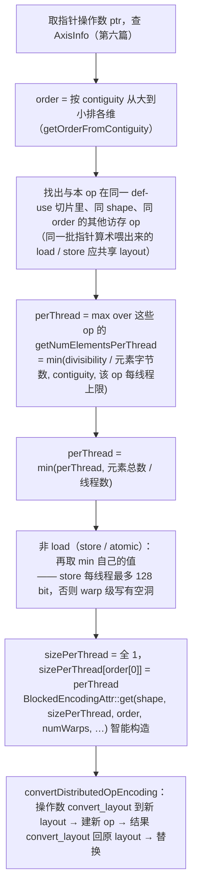

到上一篇为止，matmul kernel 的 IR 里没有"线程"这个概念：`tensor<128x32xbf16>` 就是 4096 个元素，`tt.load` 就是"把这 4096 个元素读进来"。GPU 上执行它的是 4 个 warp、128 个线程，每个线程要负责 32 个元素——**哪个线程负责哪 32 个**，是编译器必须做、而 TTIR 完全没有表达的决定。这一篇讲 Triton 表达和推理这个决定的机制：**layout**。

Triton 编译器区别于 nvcc、也区别于大多数 MLIR 编译器的地方就在这里。nvcc 把线程映射完全交给程序员（`threadIdx.x` 是你写的）；IREE / XLA 这类编译器把它藏在 lowering 的某个 pass 里。Triton 把它做成**类型的一部分**：`tensor<128x32xbf16, #blocked<…>>` 里的 `#blocked<…>` 精确规定了 4096 个元素在 4 个 warp × 32 个 lane × 每线程若干寄存器之间的分布。所有后续 pass 都能看到它、改它、对它推理。Triton 3.x 又把所有种类的 layout 统一成一种数学对象——GF(2) 上的线性映射（Linear Layout），layout 之间的转换、组合、比较都变成矩阵运算。

总纲对这一篇提出的核心问题是：

> **一个 `[64, 64]` 的 BF16 张量、`num_warps=4`，写出它默认 `#blocked` layout 的 Linear Layout 矩阵（哪些输入位映射到哪些输出位）。[^q0] 它到 `#nvidia_mma` 累加器 layout 的转换，为什么不能只用 warp 内 shuffle 完成，而必须经过 shared memory？从矩阵的哪一部分能看出来？[^q1]**

## 一、总览

本文按**从语义到数学再到决定**组织：先说清 layout 是什么、为什么放在类型里（第二章）；然后逐个讲分布式 layout 的语义——`#blocked`、`#slice`、`#nvidia_mma`、`#dot_op`，每个都用 `triton-tensor-layout` 打出真实的线程 ↔ 元素表（第三章）；然后是 Linear Layout：把它们统一成 GF(2) 上的线性映射，看这个统一带来什么运算（第四章）；再讲两个决定 layout 的 pass——`ConvertTritonToTritonGPU` 给每个张量初始 layout（第五章），`Coalesce` 为 load / store 重选 layout（第六章）；最后是 shared memory 的 layout（第七章）。

| 章 | 主题 | 内容 |
|---|---|---|
| 二 | layout 是什么 | 从"元素"到"线程持有的元素"；为什么在类型里；`ttg` 方言的模块属性 |
| 三 | 分布式 layout | `#blocked` 的四个参数与"智能构造"；回绕与复制；`#slice`；`#nvidia_mma` 的 fragment；`#dot_op` |
| 四 | Linear Layout | GF(2) 上的线性映射；基向量；`[64, 64]` 默认 layout 与 `#mma` 的基向量表；乘积、复合、求逆、商；转换代价的判定；与 CuTe 对照 |
| 五 | 初始 layout | `getDefaultBlockedEncoding`；`expand_dims` 与 `#slice` 的逆推；转换后的 IR |
| 六 | Coalesce | 从 AxisInfo 到 `order` 与 `sizePerThread`；同 order 访存的合并；智能构造推出 `threadsPerWarp` / `warpsPerCTA`；插 `convert_layout`；转换后的 IR |
| 七 | shared memory layout | `#swizzled_shared` 的 XOR；`#nvmma_shared`；`memdesc` |
| 八 | 本文小结 | |
| 九 | 自测 | 5 道题 |

源码：`include/triton/Dialect/TritonGPU/IR/TritonGPUAttrDefs.td`、`lib/Dialect/TritonGPU/IR/Dialect.cpp`、`include/triton/Tools/LinearLayout.h`（头部四百行文档，Linear Layout 最好的说明）、`lib/Tools/LinearLayout.cpp`、`lib/Dialect/TritonGPU/IR/LinearLayoutConversions.cpp`、`lib/Conversion/TritonToTritonGPU/`、`lib/Dialect/TritonGPU/Transforms/Coalesce.cpp` 与 `CoalesceUtils.cpp`、`lib/Analysis/Utility.cpp`（转换代价判定）、`bin/triton-tensor-layout.cpp`。

## 二、layout 是什么

### 1. 从"元素"到"线程持有的元素"

一个 `[128, 32]` 的张量在 128 个线程上，每个线程持有 32 个元素。layout 回答的问题是：**线程 t 的第 r 个寄存器里是张量的哪个元素 `T[i, j]`？** 反过来问也行——`T[i, j]` 在哪个线程的哪个寄存器——但一个元素可能被多个线程持有（广播），所以 Triton 选择前一种方向：layout 是从**硬件位置**（寄存器号、lane、warp、block）到**张量下标**的函数。

这个函数决定：

- 一条 `tt.load` 生成什么访存指令：相邻 lane 持有相邻元素 → 一条合并的向量访存；否则 → 分散的标量访存；
- 一个 `tt.reduce` 要不要跨线程通信：规约维度全在一个线程的寄存器里 → 纯寄存器运算；跨 lane → shuffle；跨 warp → shared memory；
- `tt.dot` 能不能直接喂 Tensor Core：`mma.sync` 要求操作数按固定的 fragment 布局在各 lane 的寄存器里，不满足就要先重排；
- 两个不同 layout 的张量做逐元素运算 → 必须先把一个转成另一个（`ttg.convert_layout`），代价从零到一次 shared memory 往返。

### 2. 为什么放在类型里

Triton 把 layout 作为 `RankedTensorType` 的 encoding（上上篇 §八.2），而不是 pass 内部的一张表。三个后果：

1. **每个 op 的每个操作数和结果都带 layout**，任何 pass 打开 IR 就能看到，不需要重算；`--mlir-print-ir-after-all` 出来的每一步 IR 都自带完整的线程映射。
2. **verifier 检查一致性**：`arith.addi %a, %b` 要求两个操作数类型相同，所以 layout 也必须相同；`tt.load` 的 `SameLoadStoreOperandsAndResultEncoding`；`tt.dot` 的结果与累加器同 layout。layout 不一致的 IR 是**非法**的，会在 pass 之后的 verifier 处报错，而不是生成错误的代码。
3. **改 layout 只有一种方式**：`ttg.convert_layout %x : tensor<…, #A> -> tensor<…, #B>`。它是 TTGIR 里唯一允许输入输出 layout 不同的 op（除了 `load` / `store` 与内存打交道、`reduce` / `expand_dims` 按规则变换）。第八篇的 `RemoveLayoutConversions` 整个 pass 就是围绕这一个 op。

### 3. 模块属性

TTGIR 文件头：

```mlir
module attributes {"ttg.num-ctas" = 1 : i32, "ttg.num-warps" = 4 : i32, ttg.target = "cuda:80", "ttg.threads-per-warp" = 32 : i32} {
```

`ConvertTritonToTritonGPU` 写上的四个属性：`num_warps`（用户传的）、`threads-per-warp`（NVIDIA 32、AMD 64）、`num-ctas`（Hopper 集群大小）、目标架构。后面每个 pass 都从这里读——layout 的语义依赖它们（4 个 warp 与 8 个 warp 下同一个 `#blocked` 覆盖的元素数不同）。

## 三、分布式 layout

Triton 的 layout 分两族：**分布式**（distributed，张量在寄存器里，每个线程持一部分）与 **shared**（张量在 shared memory 里，用地址映射描述）。本章讲前者的四种。

### 1. `#blocked`

```text
#ttg.blocked<{sizePerThread = [1, 8], threadsPerWarp = [8, 4], warpsPerCTA = [4, 1], order = [1, 0]}>
```

四个参数描述一个**三层嵌套的 tile**：每个线程持有一个 `sizePerThread` 的小块（连续元素），`threadsPerWarp` 个线程排成一个 warp 的块，`warpsPerCTA` 个 warp 排成整个 CTA 的块；`order` 说明哪一维变化最快（`[1, 0]`：第 1 维最快，行优先）。这个 layout 一趟覆盖 `[1×8×4, 8×4×1] = [32, 32]` 个元素。

用 `triton-tensor-layout` 看一个小例子（`T<线程号>:<寄存器号>`）：

```bash
triton-tensor-layout -l "#ttg.blocked<{sizePerThread=[1,2], threadsPerWarp=[4,8], warpsPerCTA=[2,1], order=[1,0]}>" -t "tensor<8x16xf32>"
```

```text
[[ T0:0,  T0:1,  T1:0,  T1:1,  T2:0,  T2:1,  T3:0,  T3:1,  T4:0,  T4:1,  T5:0,  T5:1,  T6:0,  T6:1,  T7:0,  T7:1]
[  T8:0,  T8:1,  T9:0,  T9:1, T10:0, T10:1, T11:0, T11:1, T12:0, T12:1, T13:0, T13:1, T14:0, T14:1, T15:0, T15:1]
[ T16:0, T16:1, T17:0, T17:1, T18:0, T18:1, T19:0, T19:1, T20:0, T20:1, T21:0, T21:1, T22:0, T22:1, T23:0, T23:1]
[ T24:0, T24:1, T25:0, T25:1, T26:0, T26:1, T27:0, T27:1, T28:0, T28:1, T29:0, T29:1, T30:0, T30:1, T31:0, T31:1]
[ T32:0, T32:1, T33:0, T33:1, T34:0, T34:1, T35:0, T35:1, T36:0, T36:1, T37:0, T37:1, T38:0, T38:1, T39:0, T39:1]
[ T40:0, T40:1, T41:0, T41:1, T42:0, T42:1, T43:0, T43:1, T44:0, T44:1, T45:0, T45:1, T46:0, T46:1, T47:0, T47:1]
[ T48:0, T48:1, T49:0, T49:1, T50:0, T50:1, T51:0, T51:1, T52:0, T52:1, T53:0, T53:1, T54:0, T54:1, T55:0, T55:1]
[ T56:0, T56:1, T57:0, T57:1, T58:0, T58:1, T59:0, T59:1, T60:0, T60:1, T61:0, T61:1, T62:0, T62:1, T63:0, T63:1]]
```

读法：每个线程 2 个连续元素（`T0:0, T0:1`）；一个 warp 的 32 个线程排成 4 行 × 8 个线程 = 4 行 × 16 列；第二个 warp（T32 起）接着排下 4 行。`--use-hw-view` 从硬件角度打印同一个 layout——每个 warp 每个寄存器一行，32 个 lane 各持有的下标：

```text
Warp0:
(0, 0), (0, 2), (0, 4), ..., (0,14), (1, 0), (1, 2), ..., (3,14)     ← 寄存器 0：lane 0..31
(0, 1), (0, 3), (0, 5), ..., (0,15), (1, 1), (1, 3), ..., (3,15)     ← 寄存器 1
```

第二种视图直接对应访存指令：寄存器 0 里 lane 0..7 持有 `(0,0), (0,2), …, (0,14)`——步长 2，**不连续**；但每个 lane 的寄存器 0 和 1 是相邻元素 `(0,0), (0,1)`——所以一条 64 bit 的向量访存（两个 f32）可以覆盖 lane 0 的两个寄存器，8 个 lane 的 8 条 64 bit 访存合并成连续的 64 字节。这就是 `sizePerThread` 的意义：**每线程连续持有的元素数 = 向量访存的宽度**。

### 2. 智能构造：只需给 `sizePerThread` 与 `order`

四个参数里通常只有两个是"选择"，另两个是推出来的。`BlockedEncodingAttr::get(ctx, shape, sizePerThread, order, numWarps, threadsPerWarp, cga)` 这个 builder（`TritonGPUAttrDefs.td` 里的 `AttrBuilder`）从 shape 推 `threadsPerWarp` 与 `warpsPerCTA`：

```cpp
unsigned remainingLanes = numThreadsPerWarp;        // 32
unsigned remainingThreads = numWarps * numThreadsPerWarp;   // 128
unsigned remainingWarps = numWarps;                 // 4
// 从最快变化的维开始
for (unsigned d = 0; d < rank - 1; ++d) {
  unsigned i = order[d];
  unsigned threadsPerCTA = clamp(remainingThreads, 1, max(1, shapePerCTA[i] / sizePerThread[i]));   // 这一维最多需要几个线程
  threadsPerWarp[i] = clamp(threadsPerCTA, 1, remainingLanes);            // 先用 lane
  warpsPerCTA[i] = clamp(threadsPerCTA / threadsPerWarp[i], 1, remainingWarps);   // lane 不够再用 warp
  remainingWarps /= warpsPerCTA[i]; remainingLanes /= threadsPerWarp[i]; remainingThreads /= threadsPerCTA;
  ...
}
// 最慢的维吃掉剩下的全部 lane 和 warp
threadsPerWarp[order[rank - 1]] = numThreadsPerWarp / prevLanes;
warpsPerCTA[order[rank - 1]] = numWarps / prevWarps;
```

对 matmul 的 A tile（`[128, 32]`、`sizePerThread = [1, 8]`、`order = [1, 0]`）：第 1 维需要 32 / 8 = 4 个线程 → `threadsPerWarp[1] = 4`、`warpsPerCTA[1] = 1`；剩下 8 个 lane、4 个 warp 全给第 0 维 → `threadsPerWarp[0] = 8`、`warpsPerCTA[0] = 4`。结果正是 TTGIR 里的 `#blocked<{sizePerThread = [1, 8], threadsPerWarp = [8, 4], warpsPerCTA = [4, 1], order = [1, 0]}>`：一个 warp 一趟覆盖 8 行 × 32 列——**每一行正好 4 个线程 × 8 个元素 = 32 列 = 64 字节连续**，没有浪费。对 B tile（`[32, 128]`）同样的规则给出 `threadsPerWarp = [2, 16]`：一行 128 列要 16 个线程。这个算法的目标很朴素：**让最快的维被尽量少的线程刚好铺满，剩下的线程堆到慢的维上去**。

### 3. 回绕与复制

layout 一趟覆盖的 tile 和张量 shape 未必相等：

- **tile 小于 shape**（常态）：`[32, 32]` 的 tile 铺一个 `[128, 32]` 的张量要铺 4 趟，每趟每线程多 8 个寄存器——所以 A tile 每线程持 32 个元素。铺的顺序按 `order`。
- **tile 大于 shape**：`threadsPerWarp = [4, 8]`、`sizePerThread = [1, 8]` 在第 1 维覆盖 64 列，张量只有 32 列——多出来的线程**回绕**（wrap），持有前面线程同一份元素的**副本**。GPU Kernel 系列第七篇画过这张图。副本不是错误，但它是浪费：这些线程做的访存和运算都是重复的。智能构造正是为了避免它——它按 shape 算需要几个线程，不多给。

Linear Layout 用一个词统一这两种情况：layout 是**非单射**的（多个硬件位置映到同一个下标 = 复制），且通过 `ensureLayoutNotSmallerThan` 补寄存器维来覆盖整个 shape（§四.4）。

### 4. `#slice`

```text
#ttg.slice<{dim = 1, parent = #blocked}>
```

`tt.reduce`（沿 dim 规约）的结果比输入少一维。它的 layout 是什么？Triton 不另选一个，而是**从父 layout 去掉那一维**：`#slice<{dim = 1, parent = P}>` 作用在 `[128]` 上，等价于把 P 作用在 `[128, ?]` 上再把第 1 维压掉——原来一行里的所有线程现在持有**同一个**元素（复制）。`TritonGPUAttrDefs.td` 里的例子：

```text
父 layout（16 个线程排成 4×4）：      dim = 0 压掉行：              dim = 1 压掉列：
[ 0  1  2  3 ]                     [{0,4,8,12} {1,5,9,13}      [{0,1,2,3} {4,5,6,7}
[ 4  5  6  7 ]          →           {2,6,10,14} {3,7,11,15}]     {8,9,10,11} {12,13,14,15}]
[ 8  9 10 11 ]
[12 13 14 15 ]
```

压掉第 0 维后，一列上的 4 个线程 `{0, 4, 8, 12}` 共同持有结果的第 0 个元素。为什么这样设计：**规约的 lowering 需要知道输入的哪些线程要合并到一起**——`#slice` 把这个信息直接编码在结果类型里；反过来 `tt.expand_dims` 的输入 layout 就是结果的 `#slice`（TTGIR 里 `make_range` 的结果类型是 `tensor<128xi32, #ttg.slice<{dim = 1, parent = #blocked}>>`，因为它接着要 `expand_dims {axis = 1}` 变成 `[128, 1]` 的 `#blocked`）。

### 5. `#nvidia_mma`

```text
#ttg.nvidia_mma<{versionMajor = 2, versionMinor = 0, warpsPerCTA = [2, 2], instrShape = [16, 8]}>
```

Tensor Core 指令的**输出**在寄存器里的固定布局。`versionMajor = 2` 是 Ampere 的 `mma.sync`（1 是 Volta，3 是 Hopper 的 `wgmma`，5 是 Blackwell 的 `tcgen05`），`instrShape = [16, 8]` 是一条 `mma.m16n8k16` 的 C 矩阵形状，`warpsPerCTA = [2, 2]` 是 4 个 warp 在 M × N 上的排布。一个 warp 的一条 `m16n8` 指令输出的 `[16, 8]` f32 累加器，在 32 个 lane 上的分布：

```text
[[ T0:0,  T0:1,  T1:0,  T1:1,  T2:0,  T2:1,  T3:0,  T3:1]      ← 行 0：lane 0..3 各持 2 个相邻列
[  T4:0,  T4:1,  T5:0,  T5:1,  T6:0,  T6:1,  T7:0,  T7:1]      ← 行 1：lane 4..7
...
[ T28:0, T28:1, T29:0, T29:1, T30:0, T30:1, T31:0, T31:1]      ← 行 7：lane 28..31
[  T0:2,  T0:3,  T1:2,  T1:3,  T2:2,  T2:3,  T3:2,  T3:3]      ← 行 8：又回到 lane 0..3，寄存器 2、3
...
[ T28:2, T28:3, T29:2, T29:3, T30:2, T30:3, T31:2, T31:3]]     ← 行 15
```

lane t 持有 `(t / 4, (t % 4) × 2 + {0, 1})` 和 `(t / 4 + 8, …)`——这是 PTX ISA 手册里 `mma.m16n8k16` 的 C fragment 图，**硬件规定的**，编译器无法选择。`#nvidia_mma` 就是把硬件规定写成一个 layout 属性，让它能与别的 layout 做同样的运算（转换、比较）。更大的张量按 `warpsPerCTA` 与重复次数铺：`[128, 128]` 在 `warpsPerCTA = [2, 2]` 下每个 warp 负责 `[64, 64]`，是 4 × 8 = 32 条 `m16n8` 的输出，每线程 32 × 4 = 128 个 f32 寄存器——第二篇说的"累加器是最大的寄存器消耗者"的具体数字。

### 6. `#dot_op`

```text
#ttg.dot_op<{opIdx = 0, parent = #mma, kWidth = 2}>
```

`tt.dot` 的**输入**（A 是 `opIdx = 0`，B 是 `opIdx = 1`）所要求的布局。它是 `parent`（累加器的 `#mma` layout）的函数：给定累加器怎么分布在 warp 上，A 的第 i 行块必须在负责第 i 行块的 warp 里、B 同理，且每个 lane 持有的 A / B 片段要与 `mma.sync` 的 A / B fragment 图一致。`kWidth` 是每个线程沿 K 维连续持有的元素数——BF16 是 2（一个 32 位寄存器装两个），FP8 是 4，决定了从 shared memory 用 `ldmatrix` 取操作数时的粒度。`ConvertTritonToTritonGPU` 就给 `tt.dot` 的操作数插 `convert_layout` 到 `#dot_op`（第四篇 §四.4 的合法性条件），此时 parent 还是临时的 `#blocked`；第八篇 `AccelerateMatmul` 把 parent 换成 `#mma`。

## 四、Linear Layout

### 1. 四种 layout，一种数学

上面四种 layout 各有一套参数、一套 C++ 代码算"线程 t 寄存器 r 持有哪个元素"。Triton 2.x 就是这样：每一对 layout 之间的转换、每种 layout 的 lowering 都是特例代码，加一种 layout（Hopper 的 `wgmma`、AMD 的 MFMA）要改几十处。Triton 3.x 引入 **Linear Layout**（LL，Adam Goucher 提出）：所有 layout 都是同一种对象——**GF(2) 上的线性映射**——特例代码变成通用运算。`LinearLayout.h` 的注释写道："In the future, we intend to remove the Triton layouts entirely"：`#blocked` 这些属性将来只是 LL 的可读写法。

### 2. GF(2) 与线性

GF(2) 是只有 `{0, 1}` 两个元素的域，加法是 XOR（⊕），乘法是 AND。一个 M 位输入到 N 位输出的**线性**函数 L 满足 `L(x ⊕ y) = L(x) ⊕ L(y)`。这样的函数由它在 M 个"单位输入"上的值完全决定：`L(1), L(2), L(4), …, L(2^(M-1))`——这些叫**基向量**（bases）。任何输入 x 是若干个 2 的幂的 XOR（就是它的二进制展开），所以 `L(x)` 是对应基向量的 XOR。把 M 个基向量按列排成 N × M 的 0/1 矩阵 B，`L(x) = B · x`（GF(2) 上的矩阵乘）。

为什么 layout 是线性的？看 `#blocked`：lane 号的第 k 位决定的是"沿某一维偏移 `2^j` 个元素"，warp 号的每一位、寄存器号的每一位同理；两个位同时为 1 就是两个偏移相加——对 2 的幂对齐的偏移，相加就是 XOR。所以**硬件位置的每一位独立地贡献张量下标的某一位**，这正是线性。`LinearLayout.h` 里的例子：一个 4 warp × 4 线程、`4 × 4` 张量的 layout，只需指定四个基向量

```text
L(t=1, w=0) = (1, 1)    L(t=2, w=0) = (2, 2)    L(t=0, w=1) = (0, 1)    L(t=0, w=2) = (0, 2)
```

就能推出全表，例如 `L(3, 3) = L(1,0) ⊕ L(2,0) ⊕ L(0,1) ⊕ L(0,2) = (1,1) ⊕ (2,2) ⊕ (0,1) ⊕ (0,2) = (3, 0)`。全表是 `(t, w) → (t, w ⊕ t)`——一个 **swizzle**。传统 layout 系统里 swizzle 是"在 layout 之上再加的一步"，在 LL 里它就是一个普通的线性映射，与行优先、转置、广播没有本质区别。

LL 的数据结构（`LinearLayout` 类）：

```cpp
// bases[inDim][i] = L(0, ..., inDim = 2^i, ..., 0)
llvm::MapVector<StringAttr /*inDim*/, std::vector<std::vector<int32_t>>> bases;
llvm::MapVector<StringAttr /*outDim*/, int32_t /*size*/> outDims;
```

输入维有名字：`register`、`lane`、`warp`、`block`（分布式 layout）或 `offset`、`block`（shared layout）；输出维是 `dim0`、`dim1`、…（张量的各维）。`bases["lane"][3]` 是 "lane 号 = 8、其他全 0" 时的输出下标向量。

### 3. 两张基向量表

**`[64, 64]` 张量的默认 `#blocked`**（核心问题第一问）。`getDefaultBlockedEncoding`（§五.1）给 `sizePerThread = [1, 1]`、`order = [1, 0]`，智能构造得到 `threadsPerWarp = [1, 32]`、`warpsPerCTA = [2, 2]`：一个 warp 铺 1 行 × 32 列，2 个 warp 沿列铺满 64 列，2 个 warp 沿行铺 2 行；一趟 `[2, 64]`，铺满 `[64, 64]` 要 32 趟 → 每线程 32 个寄存器（5 位）。基向量（输出写成 `(行, 列)`）：

| 输入维 | 位 | 基向量 `(dim0, dim1)` | 含义 |
|---|---|---|---|
| `lane` | 1 | (0, 1) | lane 号的 5 位就是列号的低 5 位 |
| | 2 | (0, 2) | |
| | 4 | (0, 4) | |
| | 8 | (0, 8) | |
| | 16 | (0, 16) | |
| `warp` | 1 | (0, 32) | warp 号第 0 位：列 +32（`warpsPerCTA[1] = 2`） |
| | 2 | (1, 0) | warp 号第 1 位：行 +1（`warpsPerCTA[0] = 2`） |
| `register` | 1 | (2, 0) | 寄存器号的 5 位是行号的第 1 到 5 位 |
| | 2 | (4, 0) | |
| | 4 | (8, 0) | |
| | 8 | (16, 0) | |
| | 16 | (32, 0) | |

`triton-tensor-layout` 的输出核对：行 0 是 `T0:0 … T63:0`（lane 与 warp 第 0 位铺 64 列），行 1 是 `T64:0 …`（warp 第 1 位），行 2 是 `T0:1 …`（寄存器第 0 位）。

**同一张量的 `#nvidia_mma<{versionMajor = 2, warpsPerCTA = [2, 2], instrShape = [16, 8]}>`**（累加器 layout）：

| 输入维 | 位 | 基向量 `(dim0, dim1)` | 含义 |
|---|---|---|---|
| `register` | 1 | (0, 1) | 相邻两列在同一 lane 的两个寄存器里（C fragment 的 c0, c1） |
| | 2 | (8, 0) | 行 +8（c2, c3） |
| | 4 | (0, 16) | 第二个 n-tile |
| | 8 | (0, 32) | 第四个 n-tile |
| | 16 | (32, 0) | 第二个 m-tile 组 |
| `lane` | 1 | (0, 2) | lane 的低 2 位选 4 组列 |
| | 2 | (0, 4) | |
| | 4 | (1, 0) | lane 的高 3 位选 8 行 |
| | 8 | (2, 0) | |
| | 16 | (4, 0) | |
| `warp` | 1 | (0, 8) | warp 第 0 位：列 +8 |
| | 2 | (16, 0) | warp 第 1 位：行 +16 |

核对：行 0 是 `T0:0, T0:1, T1:0, T1:1, …, T3:1, T32:0, …`（lane 低 2 位与寄存器位 0 铺 8 列，然后 warp 位 0 铺下一个 8 列）；行 1 是 `T4:0 …`（lane 位 2）；行 8 是 `T0:2`（寄存器位 1）；行 16 是 `T64:0`（warp 位 1）；行 32 是 `T0:16`（寄存器位 4）。

两张表都是 12 个输入位（5 + 2 + 5）到 12 个输出位（6 + 6）的映射，都是**双射**（每个元素恰好在一个位置）。区别只在**哪些输入位管哪些输出位**——这正是 layout 转换代价的全部信息（§四.6）。

### 4. `#blocked` 怎样变成 LL

```cpp
LinearLayout BlockedEncodingAttr::toLinearLayout(ArrayRef<int64_t> shape) const {
  auto order = getOrder();
  LinearLayout ctaLayout =
      identityStandardND(S("register"), getSizePerThread(), order) *
      identityStandardND(S("lane"), getThreadsPerWarp(), order) *
      identityStandardND(S("warp"), getWarpsPerCTA(), order);
  return combineCtaCgaWithShape(ctaLayout, getCGALayout(), shape);
}
```

三行。`identityStandardND(dim, sizes, order)` 构造一个"该输入维按 `order` 行优先地铺 `sizes` 这个小块"的恒等映射；`*` 是 LL 的**乘积**——把两个 LL 拼起来，后者的输出接在前者之后（tile 里再嵌 tile）。`combineCtaCgaWithShape` 做两件事：`ensureLayoutNotSmallerThan`——tile 比 shape 小时给 `register` 维补基向量，一趟一趟铺满（这就是 32 个寄存器的来源）；`ensureLayoutNotLargerThan`——tile 比 shape 大时把超出的基向量置零（回绕：那些位不再改变下标，即复制）。`#nvidia_mma`、`#dot_op`、AMD 的 `#mfma`、shared layout 各有自己的 `toLinearLayout`，产出同一种对象。`TritonGPUDialect::toLinearLayout(shape, layout)` 是统一入口。

LL 也有自己的属性写法 `#ttg.linear`，就是把基向量表直接写出来。lit 测试 `test/TritonGPU/combine.mlir` 里的一个：

```text
#linear = #ttg.linear<{register = [[0, 1], [0, 2], [0, 4], [0, 8], [0, 16]],
                       lane = [[1, 0], [2, 0], [4, 0], [8, 0], [0, 32]],
                       warp = [[16, 0], [32, 0]], block = []}>
```

读法与 §3 的表完全相同：寄存器的 5 位管列 1..16，lane 的低 4 位管行 1..8、第 5 位管列 32，warp 两位管行 16、32。任何用参数写不出来的 layout（例如某个 pass 算出的"最省转换"的中间布局）都可以用它表达；`ttg.convert_layout` 的两端可以是任意 `#ttg.linear`。

### 5. LL 上的运算

| 运算 | 含义 | 用在哪 |
|---|---|---|
| `A * B`（乘积） | 拼接：B 的输出维接在 A 之后，输入维合并 | 从 tile 参数构造 layout |
| `A.compose(B)` | 先 A 再 B：`x ↦ B(A(x))` | 把"硬件位置 → 下标"接上"下标 → shared memory 偏移" |
| `A.invert()` / `pseudoinvert()` | 求逆（只对双射；非单射时取一个代表） | 从下标反查硬件位置 |
| `dst.invertAndCompose(src)` | `x ↦ dst⁻¹(src(x))`：源硬件位置 → 目标硬件位置 | **layout 转换的核心**：每个源寄存器该去目标的哪个 lane / 寄存器 |
| `quotient(dim)` | 若 dim 上是恒等且与其他维无关，去掉它 | 转换时剥掉不需要动的维（block、warp…） |
| `sublayout(inDims, outDims)` | 取子映射 | 只看 lane 位怎么映射 |
| `getFreeVariableMasks()` | 哪些输入位不影响输出（复制） | 判断广播、去重 |
| `reshapeIns` / `reshapeOuts` / `transposeOuts` | 维度的拆合与重排 | 处理 `tt.reshape` / `tt.trans` |
| `divideLeft` / `divideRight` | 乘积的逆运算 | 从复合 layout 分解出 tile |

全部是 GF(2) 上的矩阵运算（`LinearLayout.cpp` 约 1400 行，包括 GF(2) 高斯消元求逆）。

### 6. 转换代价的判定

`ttg.convert_layout %x : #A -> #B` 生成什么代码，由 `lib/Analysis/Utility.cpp` 的三个函数决定，它们只看 LL：

```cpp
LinearLayout minimalCvtLayout(Type srcTy, Type dstTy) {
  LinearLayout srcLayout = toLinearLayout(srcTy);
  LinearLayout dstLayout = toLinearLayout(dstTy);
  ...
  auto comp = dstLayout.invertAndCompose(srcLayout);      // ① 源位置 → 目标位置
  for (auto dim : dims)                                    // ② 从最慢的维（block、warp、lane）起
    if (auto quotient = comp.quotient(dim)) comp = *quotient;   //    能剥掉就剥掉
    else break;
  return comp;
}
bool cvtReordersRegisters(src, dst) { outDims 为空或只剩 register }   // ③ 纯寄存器重排：零成本
bool cvtNeedsWarpShuffle(src, dst)  { outDims 恰为 {register, lane} 且分解后的混合转置 < 2 }   // ④ warp 内 shuffle
bool cvtNeedsSharedMemory(src, dst) { 两者都不是 }                    // ⑤ 走 shared memory
```

① 算出"源 layout 里 (reg, lane, warp) 位置上的元素，在目标 layout 里位于哪个 (reg, lane, warp)"。② 从最慢的维开始试 `quotient`：如果 `warp` 维上这个复合映射是恒等（源的 warp w 的数据全部还在目标的 warp w，且 warp 位不与别的位纠缠），就把 `warp` 剥掉——转换不需要跨 warp。然后试 `lane`。③ ④ ⑤ 看剥完剩什么：只剩 `register` → 每个线程自己重排寄存器；剩 `{register, lane}` → warp 内用 `shfl.sync`；`warp` 剥不掉 → 数据要跨 warp，只有 shared memory 能做。

回答核心问题第二问。看两张表里**行号的低位**由谁决定：`#blocked` 里行 1 是 **warp 位 2**，行 2、4 是**寄存器位** 1、2；`#mma` 里行 1、2、4 是 **lane 位** 4、8、16。所以 `dst⁻¹ ∘ src` 把源的 warp 位 2 映到目标的 lane 位 4——**源 warp 2 的数据要进目标的另一个 lane**，跨了 warp；同时源的寄存器位映到目标的 lane 位（第 2、4 行要从寄存器进 lane）。`quotient(warp)` 在第一步就失败（warp 位不是恒等），`outDims` 含 `warp`，`cvtNeedsSharedMemory` 为真。这个转换是 `[128, 128]` 累加器写回前经历的那一次 shared memory 往返（GPU Kernel 系列第七篇提到的 epilogue 固有开销）——第八篇讨论它为什么消不掉。

反例：`#blocked<{[1, 8], [8, 4], [4, 1]}>` → `#blocked<{[1, 4], [8, 4], [4, 1]}>`（只改每线程元素数，行列分配不变）的复合映射在 `warp` 和 `lane` 上都是恒等，剥完只剩 `register`——零成本，每个线程把 8 个寄存器看成两组 4 个而已。

### 7. 与 CuTe 对照

`LinearLayout.h` 的注释专门比较了 NVIDIA CUTLASS 3 的 CuTe（GPU Kernel 系列第六篇）：两者都是"可编程、可组合的 layout 代数"，都取代了各自前身的手写特例。差别：LL 的维有名字（CuTe 编号）；CuTe 支持嵌套与非 2 的幂 shape（LL 不支持——所以 LL 不能表示 padding，Triton 的 `#padded_shared` 是 LL 之外的补充）；CuTe 的 swizzle 是 layout 之后的独立一步，LL 里 swizzle 就是 layout；**LL 可以被程序搜索**——"找一个读入某寄存器 layout 时无 bank conflict 的 shared layout"是一个可以在 LL 上求解的问题（`chooseShemLayoutForRegToRegConversion`、`GenericSwizzling.cpp`），CuTe 靠人选；LL 在编译器里运行、不在 GPU 关键路径上，不需要 CuTe 那样的 C++ 模板技巧。

## 五、初始 layout：`ConvertTritonToTritonGPU`

### 1. 默认 layout

第四篇 §四.4 讲了这个 pass 的 Dialect Conversion 骨架。TypeConverter 对每个无 encoding 的张量调：

```cpp
BlockedEncodingAttr getDefaultBlockedEncoding(ctx, shape, numWarps, threadsPerWarp, numCTAs) {
  order = reverse(0..rank-1);           // 最后一维最快：行优先
  sizePerThread = 全 1;                 // 每线程 1 个元素
  return BlockedEncodingAttr::get(ctx, shape, sizePerThread, order, numWarps, threadsPerWarp, numCTAs);   // 智能构造
}
```

**每线程 1 个元素、行优先、其余推出来**。对 matmul 的各种 shape：

| shape | 默认 layout | 一趟覆盖 |
|---|---|---|
| `[128, 32]`（A 指针、A 数据） | `#blocked1 = <{[1, 1], [1, 32], [4, 1], [1, 0]}>` | 4 行 × 32 列，铺 32 趟 |
| `[32, 128]`（B） | `#blocked = <{[1, 1], [1, 32], [1, 4], [1, 0]}>` | 1 行 × 128 列 |
| `[128, 128]`（累加器、C、mask） | 同上 `#blocked` | 1 行 × 128 列，铺 128 趟——每线程 128 个寄存器 |
| `[128]`（`make_range`） | `#blocked2 = <{[1], [32], [4], [0]}>` | 128 个元素一趟 |

这是**尚未考虑任何访存信息**的 layout：每个线程一个元素、相邻 lane 相邻元素——对 f32 是 32 个 lane × 4 字节 = 128 字节合并访存，但每个 lane 只发 32 bit 的指令，没有向量化。Coalesce 要改的就是这个。

### 2. `expand_dims` 与 `#slice` 的逆推

转换后的 IR 里出现了默认 layout 之外的东西：

```mlir
%offs_m_1 = tt.make_range {end = 128 : i32, start = 0 : i32} : tensor<128xi32, #ttg.slice<{dim = 1, parent = #blocked}>>
%a_ptrs   = tt.expand_dims %offs_m_2 {axis = 1 : i32} : tensor<128xi32, #ttg.slice<{dim = 1, parent = #blocked}>> -> tensor<128x1xi32, #blocked>
```

`TritonExpandDimsPattern` 的做法：结果 `[128, 1]` 取默认 layout P，然后**要求输入是 `#slice<{dim = axis, parent = P}>`**——这是唯一让 `expand_dims` 不需要任何数据移动的输入 layout（`expand_dims` 只是给每个元素加一个恒为 0 的下标，线程持有关系不变）。输入 `%offs_m_2` 原本是默认的 `#blocked2`，pattern 插一个 `convert_layout` 到 `#slice`。转换后的 IR 因此**到处是 `convert_layout`**——本例有 16 个——它们是 Dialect Conversion 的 target materialization 与各 pattern 的局部决定叠出来的。第八篇的 `RemoveLayoutConversions` 会把大部分消掉，把 `make_range` 直接生成到 `#slice` layout 上（最终 TTGIR 里 `make_range` 的类型就是 `#slice`，没有前面的 `convert_layout`）。

`TritonDotPattern` 给 `tt.dot` 的操作数插到 `#dot_op<{opIdx, parent = #blocked8}>`，其中 `#blocked8 = <{[4, 4], [1, 32], [4, 1], [1, 0]}>` 是一个专为 FMA 路径准备的累加器 layout（每线程 4×4 的块）；第八篇 `AccelerateMatmul` 会把它换成 `#mma`。

## 六、Coalesce：为访存重选 layout

### 1. 算法

`Coalesce.cpp` 只有 125 行，核心在 `CoalesceUtils.cpp` 的 `buildCoalescedEncoding`。对每个操作 `tensor<… x !tt.ptr<T>>` 的 load / store / atomic：



对 A 的 load：`a_ptrs` 的 AxisInfo 是 contiguity `[1, 32]`、divisibility `[2, 16]`（第六篇 §八）。`order = [1, 0]`（第 1 维连续）；`getNumElementsPerThread` 沿 `order[0] = 1`：`min(16 / 2 = 8, 32) = 8`；元素总数 / 线程数 = 4096 / 128 = 32 ≥ 8；load 不受 store 限制 → `perThread = 8`；`sizePerThread = [1, 8]`；智能构造 → `threadsPerWarp = [8, 4]`、`warpsPerCTA = [4, 1]`。这就是 `#blocked6`。对 B：`b_ptrs` contiguity `[1, 128]`、divisibility `[2, 16]` → `perThread = min(8, 128) = 8`，`[32, 128]` 上智能构造 → `#blocked7 = <{[1, 8], [2, 16], [4, 1]}>`。对 C 的 store：`c_ptrs` 同样 `perThread = 8`，`[128, 128]` 上智能构造得到的参数与 `#blocked7` 完全相同——MLIR 的属性唯一化让它们是**同一个**对象，所以 TTGIR 里 store 的 layout 也写 `#blocked7`。

`perThread` 的上限 `128 / bitwidth`（NVIDIA 最宽向量访存）藏在 `getMaxElementsPerThread(op)` 里；bf16 是 8。所以 Coalesce 的目标就是**让每个线程持有一条 128 bit 访存能覆盖的连续元素，且不超过 AxisInfo 能证明的对齐与连续**。

"同一切片里同 order 的访存共享 layout"（`memAccessesSameOrder`）的意义：`tl.load(x_ptrs)` 和 `tl.load(y_ptrs)` 若来自同一组 `offs`，让它们 layout 相同，后面的 `x + y` 就不需要 `convert_layout`。

### 2. 转换后的 IR

`triton-opt after_convert.ttgir --tritongpu-coalesce` 之后循环体：

```mlir
%59 = ttg.convert_layout %arg10 : tensor<128x32x!tt.ptr<bf16>, #blocked1> -> tensor<128x32x!tt.ptr<bf16>, #blocked6>   // ① 指针转到 coalesced layout
%60 = tt.load %59 : tensor<128x32x!tt.ptr<bf16>, #blocked6>                                                             // ② load 在新 layout 上
%61 = ttg.convert_layout %60 : tensor<128x32xbf16, #blocked6> -> tensor<128x32xbf16, #blocked1>                        // ③ 结果转回去
%62 = ttg.convert_layout %arg11 : tensor<32x128x!tt.ptr<bf16>, #blocked> -> tensor<32x128x!tt.ptr<bf16>, #blocked7>
%63 = tt.load %62 : tensor<32x128x!tt.ptr<bf16>, #blocked7>
%64 = ttg.convert_layout %63 : tensor<32x128xbf16, #blocked7> -> tensor<32x128xbf16, #blocked>
%65 = ttg.convert_layout %61 : tensor<128x32xbf16, #blocked1> -> tensor<128x32xbf16, #ttg.dot_op<{opIdx = 0, parent = #blocked8}>>
%66 = ttg.convert_layout %64 : tensor<32x128xbf16, #blocked> -> tensor<32x128xbf16, #ttg.dot_op<{opIdx = 1, parent = #blocked8}>>
%67 = ttg.convert_layout %arg12 : tensor<128x128xf32, #blocked> -> tensor<128x128xf32, #blocked8>
%68 = tt.dot %65, %66, %67 ...
%69 = ttg.convert_layout %68 : tensor<128x128xf32, #blocked8> -> tensor<128x128xf32, #blocked>
```

Coalesce **只改 load / store 自己**（① ② ③ 是它的手法：前后各一个 `convert_layout`），不管别人。于是一个 K 迭代里有 7 个 `convert_layout`：③ 把刚 load 进来的 A 从 coalesced layout 转回默认，%65 又把它转到 `#dot_op`——两次转换，中间那个默认 layout 毫无用处。这是**局部决定的必然结果**：每个 pass 只保证自己的 op 拿到想要的 layout，用 `convert_layout` 与外界隔离。把这些转换消掉、让 layout 沿 def-use 链传播到一致，是下一篇 `RemoveLayoutConversions` 的工作。最终 TTGIR 里循环体只剩两个 `convert_layout`（A、B 从 load 的 `#blocked` 到 `#dot_op`——这两个在 Ampere 上会变成经 shared memory 的 `ldmatrix` 路径，第八篇），累加器直接生在 `#mma` 上。

## 七、shared memory 的 layout

### 1. `#swizzled_shared`

```text
#ttg.swizzled_shared<{vec = 8, perPhase = 2, maxPhase = 4, order = [1, 0]}>
```

张量在 shared memory 里时，layout 描述的是**下标 → 字节偏移**（LL 里输入维叫 `offset`）。行优先直接放会有 bank conflict：`ldmatrix` 读一个 8 × 8 的子块时，8 行的同一列落在同一个 bank。解决是 **XOR swizzle**：第 r 行的元素以 `vec` 个为一组，组号与 `(r / perPhase) % maxPhase` 做 XOR 后再放。`TritonGPUAttrDefs.td` 里的例子（`vec = 1, perPhase = 1, maxPhase = 4`）：

```text
[ 0,  1,  2,  3]   // 行 0：XOR 0
[ 5,  4,  7,  6]   // 行 1：XOR 1
[10, 11,  8,  9]   // 行 2：XOR 2
[15, 14, 13, 12]   // 行 3：XOR 3
```

`perPhase = 2` 让每两行用同一个 XOR 值，`maxPhase` 限制 XOR 值的范围。这三个参数是编译器按 `mma` 操作数的读取模式**算**出来的（`ldmatrix` 每次读 8 行 × 16 字节：`vec = 8` 个 bf16 = 16 字节一组、`perPhase = 2`（128 字节一行时两行占一个 bank 周期）、`maxPhase = 4`）。§四.2 那个 `(t, w) → (t, w ⊕ t)` 的例子说明了它为什么是线性的——XOR 就是 GF(2) 的加法。

### 2. `#nvmma_shared`、`#padded_shared` 与 `memdesc`

- `#ttg.nvmma_shared<{swizzlingByteWidth = 128, transposed = false, elementBitWidth = 16}>`：Hopper 的 `wgmma` 与 TMA 要求的固定 shared memory 布局（128 / 64 / 32 字节 swizzle 模式，硬件定义），Hopper 路径上 `tt.dot` 的操作数直接从这种布局的 shared memory 喂给 `wgmma`（第九篇）。
- `#ttg.padded_shared<[…]>`：用 padding 而不是 XOR 避 conflict（AMD 路径常用）；LL 不能表示 padding，所以它有单独的 `paddedLinearLayout` 处理。
- 类型是 `!ttg.memdesc<128x32xbf16, #shared, #smem>`（`memdesc` = memory descriptor：shape、元素类型、layout、内存空间）。`ttg.local_alloc` 分配、`ttg.local_load` / `local_store` 读写、`ttg.memdesc_index` 取多缓冲的一片、`ttg.async_copy_global_to_local` 直接从 global 拷进来（`cp.async`）。第九篇的流水化把 load 变成这些 op；第十篇的 `AllocateSharedMemory` 给每个 `memdesc` 分偏移。

## 八、本文小结

1. layout 是"硬件位置（寄存器、lane、warp、block）→ 张量下标"的函数，放在 `RankedTensorType` 的 encoding 里：每个 op 都看得见，verifier 保证一致，只有 `ttg.convert_layout` 能改。
2. `#blocked` 的三层 tile 由 `sizePerThread` / `threadsPerWarp` / `warpsPerCTA` / `order` 描述；智能构造从 shape、`sizePerThread`、`order` 推出后两个参数——让最快的维被最少的线程刚好铺满。tile 小于 shape 时寄存器维铺多趟，大于时回绕复制。`#slice` 是父 layout 去掉一维（规约结果 / `expand_dims` 输入）；`#nvidia_mma` 是 Tensor Core 输出的硬件固定 fragment 布局；`#dot_op` 是 `tt.dot` 输入随累加器 layout 决定的布局，`kWidth` 是 K 维每线程连续元素数。
3. Linear Layout 把所有 layout 统一为 GF(2) 上的线性映射：由输入维每一位的基向量（输出下标向量）完全确定，任意输入的像是基向量的 XOR；swizzle、转置、广播、复制都是普通线性映射。`#blocked → LL` 是三个 `identityStandardND` 的乘积再按 shape 补 / 截寄存器维。
4. layout 转换的代价由 `dst.invertAndCompose(src)` 决定：从 `block`、`warp`、`lane` 起逐个 `quotient`，剩 `register` → 寄存器重排；剩 `{register, lane}` → shuffle；`warp` 剥不掉 → shared memory。`[64, 64]` 的默认 `#blocked` 到 `#mma`：源的 warp 位与寄存器位在目标里变成 lane 位，必须过 shared memory。
5. `ConvertTritonToTritonGPU` 给每个张量"每线程 1 元素、行优先"的默认 layout，`expand_dims` 要求输入是结果的 `#slice`，`tt.dot` 操作数插到 `#dot_op`——产出的 IR 到处是 `convert_layout`。
6. Coalesce 按 AxisInfo 的 contiguity 定 `order`、按 alignment 定 `sizePerThread[order[0]]`（≤ 128 bit），同切片同 order 的访存取最大值共享，store 另有 128 bit 上限，智能构造其余参数，前后插 `convert_layout` 只改 load / store 自己。A tile 得到 `[1, 8], [8, 4], [4, 1]`，一个 warp 一趟 8 行 × 64 字节。
7. shared layout 描述下标 → 偏移：`#swizzled_shared` 的 `vec / perPhase / maxPhase` 是编译器为 `ldmatrix` 算出的 XOR 参数，`#nvmma_shared` 是 Hopper 硬件定义的布局；`memdesc` 是 shared memory 张量的类型。

## 九、自测

1. `#ttg.blocked<{sizePerThread = [2, 2], threadsPerWarp = [4, 8], warpsPerCTA = [2, 2], order = [1, 0]}>` 作用在 `tensor<32x32xf32>` 上。一趟覆盖多大的 tile？每线程几个寄存器？元素 `(5, 6)` 在哪个线程的哪个寄存器？

   <details markdown="1"><summary>答案</summary>
   一趟 `[2×4×2, 2×8×2] = [16, 32]`；`32×32 / (16×32) = 2` 趟，每趟每线程 4 个元素，共 8 个寄存器。元素 `(5, 6)`：第 0 趟内（行 < 16）；行 5 = warp 行块 0（每 warp 行块 8 行）、warp 内线程行 2（每线程 2 行）、线程内行 1；列 6 = warp 列块 0（每块 16 列）、线程列 3（每线程 2 列）、线程内列 0。warp = 0（行块 0，列块 0）；lane = 线程行 2 × 8 + 线程列 3 = 19；寄存器 = 线程内 (1, 0) 按 order [1,0] 行优先 = 1 × 2 + 0 = 2。答：T19 的寄存器 2。
   </details>

2. `[64, 64]` 的 `#mma` 累加器（§四.3 第二张表）要 `tt.reduce` 沿 dim 1（每行求和）。结果 layout 是 `#slice<{dim = 1, parent = #mma}>`。规约需要哪几级通信？用基向量表回答。

   <details markdown="1"><summary>答案</summary>
   看列号（dim1）由哪些输入位决定：寄存器位 1、4、8（(0,1)、(0,16)、(0,32)）、lane 位 1、2（(0,2)、(0,4)）、warp 位 1（(0,8)）。所以同一行的 64 个元素分布在：每线程 8 个寄存器（2³）× 4 个 lane（2²）× 2 个 warp。规约三级：先线程内把 8 个寄存器加起来，再 warp 内 4 个 lane 用 2 次 `shfl.sync.bfly`（跨 lane 位 1、2），再跨 2 个 warp 经 shared memory。若换成默认 `#blocked`（列号全在 lane 位 1..16 与 warp 位 1），是线程内 0 次、shuffle 5 次、跨 warp 1 次——第十篇的 `OptimizeThreadLocality` 就是为了把规约维尽量挪进寄存器位。
   </details>

3. Coalesce 对一个 `tl.store(ptrs, x)`，AxisInfo 给 `ptrs` 沿最快维 contiguity 64、divisibility 64 字节，元素 f32，`num_warps = 4`，张量 `[64, 64]`。`sizePerThread` 是多少？如果是 `tl.load` 呢？为什么不同？

   <details markdown="1"><summary>答案</summary>
   alignment = min(64 / 4 = 16, 64) = 16；`getMaxElementsPerThread` 的 128 bit 上限对 f32 是 4；load：`perThread = min(16, 4) = 4`，再 min 4096 / 128 = 32 → 4。store：同样先得 4，再取 min 自己的 `getNumElementsPerThread` = 4 → 4。本例两者相同（都被 128 bit 上限卡住）。差别出现在多个同 order 访存共享时：load 取各 op 的**最大** perThread（某个 load 能向量化 4，另一个只能 1，两者都用 4——不能向量化的那个每线程仍持 4 个元素但发 4 条标量指令，靠 L1 吸收空洞）；store 之后额外 min 回自己的值，因为 store 的空洞是真的写空洞，warp 级写不连续会退化。
   </details>

4. `ttg.convert_layout` 从 `#blocked<{[1, 8], [8, 4], [4, 1], [1, 0]}>`（A 的 load layout）到 `#blocked<{[8, 1], [4, 8], [1, 4], [0, 1]}>`（同一张量的列优先 layout，`[128, 32]`）。用 §四.6 的判定说它走哪条路。

   <details markdown="1"><summary>答案</summary>
   源：lane 低 2 位管列（×8 组），lane 高 3 位管行，warp 2 位管行（×8）；寄存器 3 位管列内的 8 个元素，其余寄存器位管行的高位。目标：寄存器 3 位管行内 8 个元素，lane 低 2 位管行组，lane 高 3 位管列，warp 2 位管列（×8）。复合映射里源的 warp 位（行）落到目标的 lane 高位与寄存器位（目标的 warp 位管列，而源的列由 lane 低位和寄存器管）——warp 位不是恒等，`quotient(warp)` 失败，走 shared memory。直觉：这是一次转置式的重分布，每个 warp 持有的行块要打散到所有 warp，只有 shared memory 能跨 warp。
   </details>

5. 为什么 `#slice<{dim, parent}>` 要作为一种 layout 存在，而不是让 `tt.reduce` 的结果直接取一个新的 `#blocked`？

   <details markdown="1"><summary>答案</summary>
   两个原因。(1) **信息**：规约的 lowering 必须知道输入的哪些线程 / 寄存器持有同一行的元素才能决定"线程内加 → shuffle → shared memory"的分工；`#slice` 把父 layout 完整保留，lowering 直接从父 layout 的基向量读出这些信息；一个独立的 `#blocked` 丢掉了与输入的对应关系。(2) **零成本**：`#slice` 的语义"父 layout 压掉一维"恰好是规约完成后数据自然所在的位置（同一行的线程都持有该行的结果，是复制），不需要任何数据移动；同理 `expand_dims` 的输入取结果的 `#slice` 也是零移动。若结果取别的 layout，规约后还要一次 `convert_layout`。第八篇 `RemoveLayoutConversions` 大量依赖"`slice` 与 `expand_dims` 互为逆"这个性质来推 layout。
   </details>

## 下一篇

Coalesce 之后，一个 K 迭代里有 7 个 `convert_layout`，`tt.dot` 的累加器还在一个为 FMA 准备的 `#blocked` 上。下一篇讲把这些收拾干净的几个 pass：`RemoveLayoutConversions` 怎样沿 def-use 链前向传播 layout、后向重物化以消掉转换，它的代价模型何时接受重算；`AccelerateMatmul` 怎样按架构选 MMA 版本、把累加器换成 `#mma`、给操作数定 `#dot_op` 的 `kWidth`；`OptimizeDotOperands` 怎样把转置折进 `ldmatrix.trans`；`OptimizeThreadLocality` 怎样让规约多在寄存器里完成——以及为什么最后 epilogue 那一个 `convert_layout` 消不掉。

[^q0]: 默认 layout 由 `getDefaultBlockedEncoding` 给出 `sizePerThread = [1, 1]`、`order = [1, 0]`，智能构造在 `[64, 64]`、4 warp 上推出 `threadsPerWarp = [1, 32]`、`warpsPerCTA = [2, 2]`；tile `[2, 64]` 铺满 `[64, 64]` 需要 32 趟，所以寄存器维 5 位。基向量（输出 `(行, 列)`）：`lane` 的 5 位分别是 (0,1) (0,2) (0,4) (0,8) (0,16)——lane 号就是列号的低 5 位；`warp` 位 1 是 (0,32)、位 2 是 (1,0)；`register` 的 5 位是 (2,0) (4,0) (8,0) (16,0) (32,0)——寄存器号是行号的第 1–5 位。共 12 个输入位到 12 个输出位的双射。`triton-tensor-layout` 打出的表核对：行 0 是 T0…T63 的寄存器 0，行 1 是 T64…T127 的寄存器 0，行 2 是 T0…T63 的寄存器 1。详见[第四章 §3](#四linear-layout)。

[^q1]: 因为两个 layout 里**行号的低位由不同种类的输入位决定**。`#blocked` 里行 1 是 warp 位 2、行 2 / 4 是寄存器位 1 / 2；`#mma<{warpsPerCTA = [2, 2], instrShape = [16, 8]}>` 里行 1 / 2 / 4 是 lane 位 4 / 8 / 16（C fragment：lane 的高 3 位选 8 行）。`minimalCvtLayout` 算 `dst.invertAndCompose(src)`——源的 (寄存器, lane, warp) 到目标的 (寄存器, lane, warp)——然后从最慢的维起做 `quotient`：源 warp 位 2 映到目标的 lane 位 4，即源 warp 2 里的数据要进目标另一个 warp 的 lane，warp 维不是恒等，`quotient(warp)` 第一步就失败；剩下的映射输出维含 `warp`，`cvtReordersRegisters` 与 `cvtNeedsWarpShuffle` 都为假，`cvtNeedsSharedMemory` 为真。直觉上：`#blocked` 里同一行的 64 个元素分在 2 个 warp 各 32 个 lane 里，`#mma` 里同一行的 64 个元素分在 2 个 warp × 4 个 lane × 8 个寄存器里——lane 到寄存器、warp 到 lane 的搬运跨了 warp 边界，`shfl.sync` 只能在 warp 内搬。详见[第四章 §6](#四linear-layout)。
