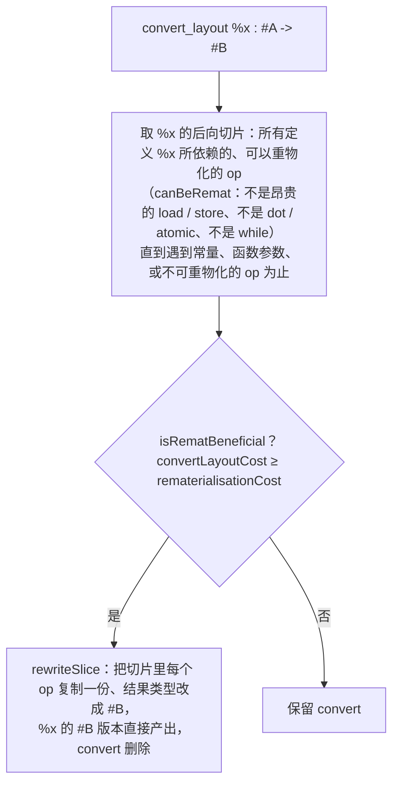

上一篇结束时，matmul kernel 的 TTGIR 里有 **23 个** `ttg.convert_layout`。它们来自两个各自为政的决定：`ConvertTritonToTritonGPU` 给每个张量一个默认 layout、给 `expand_dims` 与 `tt.dot` 的操作数各插一次转换；Coalesce 给每个 load / store 一个访存友好的 layout、在前后各插一次转换。每个 pass 只保证自己的 op 拿到想要的 layout，用 `convert_layout` 与外界隔离。而每个 `convert_layout` 都可能是一次 shared memory 往返加两个 barrier。

这一篇讲把它们收拾干净的几个 pass。`RemoveLayoutConversions` 把 23 个消到 3 个；`AccelerateMatmul` 把 `tt.dot` 的累加器换成 Tensor Core 的 `#mma` layout、操作数换成 `#dot_op`，顺手又加回 4 个；`RemoveLayoutConversions` 再跑一次，回到 3 个；流水化之后（下一篇）剩 1 个——在 epilogue，`#mma → #blocked`，写回之前。这一个消不掉，本篇要说清为什么。

总纲对这一篇提出的核心问题是：

> **Coalesce 之后，一个 matmul kernel 的 TTGIR 里有二十多个 `convert_layout`；`RemoveLayoutConversions` 跑完还剩几个，最终只有一个在 epilogue。为什么那一个消不掉——它的两端各被什么"锚"住了？[^q0] 如果 kernel 的输出也是 `tl.dot` 的输入（例如 attention 的 P·V），它就能消掉，为什么？[^q1]**

## 一、总览

本文按 `make_ttgir` 里这几个 pass 的**实际顺序**组织，用 `convert_layout` 的数量作为贯穿的刻度：

```mermaid
%% 图：make_ttgir 里 layout 相关 pass 的实际顺序，以 convert_layout 数量为刻度：16 → 23 → 3 → 7 → 3 → 1
flowchart LR
    c0["ConvertTritonToTritonGPU<br/>16 个 convert"]
    c1["Coalesce<br/>23 个"]
    c2["RemoveLayoutConversions ①<br/>3 个"]
    c3["OptimizeThreadLocality<br/>（本例无变化）"]
    c4["AccelerateMatmul<br/>7 个"]
    c5["RemoveLayoutConversions ②<br/>3 个"]
    c6["OptimizeDotOperands<br/>（本例无变化）"]
    c7["… Pipeline（第九篇）…<br/>1 个"]
    c0 --> c1 --> c2 --> c3 --> c4 --> c5 --> c6 --> c7

    classDef hot fill:#fdf1d6,stroke:#b9770e
    class c2,c4,c5 hot
```



数字来自对上一篇的 `after_coalesce.ttgir` 逐个 pass 跑 `triton-opt` 得到的 IR（`rg -c convert_layout`），每一步的 IR 都可以自己复现。

| 章 | 主题 | 内容 |
|---|---|---|
| 二 | RemoveLayoutConversions | 锚点；前向传播；冲突消解；后向重物化与代价模型；三种 hoist；清理；两次运行各做了什么 |
| 三 | AccelerateMatmul | MMA 版本选择；`warpsPerCTA` 与 `instrShape`；`kWidth`；Ampere 与 Hopper 两条改写路径；`F32DotTC` |
| 四 | OptimizeDotOperands 与 OptimizeThreadLocality | 转置折进 shared memory 布局；规约维挪进寄存器 |
| 五 | 剩下的那一个 | epilogue 转换的两个锚；`truncf` 为什么被提到转换前；attention 的 P·V 为什么不需要它——两个实验 |
| 六 | 本文小结 | |
| 七 | 自测 | 5 道题 |

源码：`lib/Dialect/TritonGPU/Transforms/{RemoveLayoutConversions,AccelerateMatmul,OptimizeDotOperands,OptimizeThreadLocality,F32DotTC}.cpp`、`lib/Dialect/TritonGPU/IR/Dialect.cpp`（`getMmaV2WarpsPerCTA`）、`lib/Analysis/Utility.cpp`；lit 测试 `test/TritonGPU/{combine,accelerate-matmul,dot-operands,optimize-locality}.mlir`。

## 二、RemoveLayoutConversions

### 1. 问题的形状

Coalesce 之后的循环体（上一篇 §六.2）：

```text
load(#blocked1) 的指针 ← convert ← #blocked1 的指针         ← 为 load 服务
load 结果 #blocked6 → convert → #blocked1 → convert → #dot_op<parent=#blocked8>   ← 中间的 #blocked1 毫无用处
累加器 #blocked → convert → #blocked8 → dot → #blocked8 → convert → #blocked      ← 每轮两次
```

这不是"消掉相邻的一对逆转换"就能解决的：`load` 的结果是 `#blocked6`，`dot` 要 `#dot_op`，两者之间的 `#blocked1` 是默认 layout 留下的痕迹，没有任何 op 真的需要它。要做的是**沿 def-use 链重新决定每个值的 layout**——让 `load` 出来的值直接以 `dot` 需要的 layout 存在，或者让中间所有逐元素运算都跟着某一端的 layout 走。这是一个全局问题，不适合写成局部 pattern（第四篇 §三.2），所以这个 pass 是 1600 行手写的两阶段算法。

### 2. 锚点

`RemoveLayoutConversions.cpp` 开头的注释给出算法骨架：

1. 找到所有**锚点**（anchor）：layout 不希望被改变的 op；
2. 从每个锚点出发，把它的 layout **前向传播**到所有使用者；一个 op 可能从多个锚点收到多个 layout；
3. **消解冲突**：每个值只留一个 layout，需要处插 `convert_layout`；
4. 按支配顺序**重写** IR。

什么是锚点（`isLayoutAnchor`）：

| op | 是否锚点 | 原因 |
|---|---|---|
| `tt.load` / `tt.store` | 是，**如果访存量大**（`isExpensiveLoadOrStore`：张量元素数 ≥ 线程数） | Coalesce 刚为它选好了访存最优的 layout，不能改；小张量（每线程不到一个元素）的 load 反正走缓存，layout 无所谓，不当锚点 |
| `tt.dot`（`DotOpInterface`） | 是 | 它的操作数 / 结果 layout 由硬件指令决定 |
| `tt.atomic_rmw` / `atomic_cas` | 是 | 同 load / store |
| descriptor load / store（TMA） | 是 | shared memory 布局由 TMA 决定 |
| `ttng.tmem_load` | 是 | Blackwell TMEM 布局固定 |
| `tt.gather`（有高效布局时）、`tt.reshape`（允许重排时） | 是 | 特殊 |
| 函数参数 | 是 | 方便写测试 |
| **其他一切**（`arith.*`、`splat`、`broadcast`、`expand_dims`、`reduce`、`convert_layout` 本身……） | 否 | layout 可以随便改，跟着锚点走 |

锚点的直觉：**layout 只在与硬件打交道的地方有意义**——访存指令需要合并、Tensor Core 指令需要 fragment 布局。中间的算术运算在任何 layout 下都是每线程对自己持有的元素做同样的事，layout 对它们是透明的。所以算法让"透明"的 op 服从"硬件"的 op。

### 3. 前向传播

从每个锚点的结果值出发，沿 use-def 边向下走：对每个使用者 op，用 `inferDstEncoding(op, srcEncoding)` 算出"如果操作数是这个 layout，结果应该是什么 layout"——逐元素 op 原样传，`expand_dims` 把 `#slice` 变回父 layout，`reduce` 把父 layout 变成 `#slice`，`trans` 置换维度，`convert_layout` 则**把目标改成源**（这就是"消掉"的时刻：一个 `convert_layout` 如果沿传播拿到了与它源相同的 layout，它就退化成恒等，随后被清理）。传播到 `scf.for` 时，iter_args 与 yield 值一起处理；传播直到不动点。

结果是每个值上有一个 layout **集合**（`LayoutInfo::encodings`）：从不同锚点传来的可能不同。本例的 `load` 结果 `%60`（`#blocked6`）传给 `%61`（原来的 convert 到 `#blocked1`）再传给 `%65`（convert 到 `#dot_op`）再传给 `tt.dot`——`dot` 是锚点，它的操作数 layout 不由传播决定，所以传播在这里停下，`%65` 保留为 `#blocked6 → #dot_op` 的转换；而 `%61` 那个 `#blocked6 → #blocked1` 的转换被传播"吸收"成恒等。

### 4. 消解冲突

一个值收到多个 layout 时（`resolveConflicts`），当前的规则很朴素（源码注释自称 "Hacky resolve"）：

```cpp
Attribute encoding = *info.encodings.begin();
bool isLoadOrStore = op && isa<LoadOp, StoreOp, AtomicRMWOp, AtomicCASOp>(op);
for (Attribute e : info.encodings) {
  if ((isLoadOrStore && isa<BlockedEncodingAttr>(e)) ||        // 访存 op：偏好 #blocked
      (!isLoadOrStore && isa<MmaEncodingTrait>(e))) {           // 其他 op：偏好 #mma
    encoding = e; break;
  }
}
```

**访存 op 保住 `#blocked`，其他 op 偏向 `#mma`**。选定之后，其他 layout 的来源处插 `convert_layout`。这条规则决定了 epilogue 那个转换的归属（§五）。

### 5. 重写

按 Region 的支配顺序遍历，对每个有新 layout 的值重建 op：`arith.*` 等逐元素 op 就地改结果类型；`scf.for` / `if` / `while` 重建带新 iter_args 类型的版本；`reduce` / `expand_dims` 等按规则改。这一步是纯机械的。之后 `cleanupConvertOps` 跑 `ConvertLayoutOp` 的 canonicalization pattern——消掉 `convert(convert(x))` 链和源目标相同的转换。

对本例，第一阶段做完：**23 → 3**。剩下的 3 个：两个 `dot` 操作数（`#blocked6 → #dot_op`、`#blocked7 → #dot_op`），一个 store 前（`#blocked → #blocked2`，累加器 layout 到 store 的 coalesced layout）。

### 6. 后向重物化

前向传播消不掉的转换，第二阶段从另一头试：对每个剩下的 `convert_layout`，**能不能把它的源那一整段计算用目标 layout 重新算一遍**（rematerialize），使转换不再需要？



代价模型（`isRematBeneficial`）：

| 项 | 计入 | 权重 |
|---|---|---|
| `convertLayoutCost` | 转换本身：按 `getConvertCost` 估（走 shared memory 时与张量字节数成正比，寄存器重排接近 0） | — |
| 切片里的 `arith.constant` | 0 | 常量随便复制 |
| 切片里的算术 op，**结果只在切片内使用** | 0 | 重物化后原 op 被删，不重复 |
| 切片里的算术 op，结果在切片外还有用 | 字节数 × (新 layout 下每线程元素数增加的倍数)；超越函数 × 8 | 会被算两遍 |
| 切片里的 `tt.load` / `local_load`（非昂贵） | 8 × 字节数 | 乐观假设命中 L1 |
| 切片里的 `reduce` | warp 内 + 8 × warp 间的数据量；非结合的 reduce 直接拒绝 | 规约要重做 |

典型的重物化：`make_range → splat → addi → expand_dims → broadcast → addptr` 这样的地址运算链，全是廉价的整数 op、结果只喂给一个 load，把它们在 load 想要的 layout 下重算一遍，比把算好的指针张量经 shared memory 转一次便宜得多。lit 测试 `combine.mlir` 的 `@remat`：两个 `make_range` 相乘再转 layout，重物化后 `make_range` 直接生在目标 layout 上，转换消失。

`backwardRematerialization` 在一个 `do … while (changed)` 里反复跑到没有转换能消为止。然后是三种 **hoist**：

| hoist | 做什么 | 目的 |
|---|---|---|
| `hoistConvertOnTopOfExtOrBroadcast` | 把 `convert(extf(x))` 变成 `extf(convert(x))`、`convert(broadcast(x))` 变成 `broadcast(convert(x))` | 在**小**的张量上转换：`f16 → f32` 之前转换少搬一半字节，broadcast 之前转换少搬几倍 |
| `hoistConvertIntoConditionals` | 把 `scf.if` 之后的转换挪进分支 | 只在真的执行的分支里转换 |
| `hoistConvertDotOperand` | 把到 `#dot_op` 的转换尽量向上推过逐元素 op | 让 load 出来的值尽早进入 `dot` 需要的 layout，中间的运算（如 dtype 转换、缩放）在 `#dot_op` 下做 |

本例的 epilogue：`truncf(acc)` 从 f32 到 bf16，然后 `convert` 到 store 的 layout——最终 TTGIR 里是 `%c = arith.truncf %acc : #mma`、`%0 = ttg.convert_layout %c : #mma -> #blocked1`：**先截断再转换**，shared memory 往返搬的是 bf16 而不是 f32，字节数减半。这是第一种 hoist 的功劳。

最后 `runDeadIterArgElimination` 删掉重写后不再使用的 iter_args，再跑一遍 `ConvertLayoutOp` 与 `scf.for` / `scf.if` 的 canonicalization 清理。

### 7. 第二次运行

`AccelerateMatmul` 之后 `RemoveLayoutConversions` 再跑一次（`make_ttgir` 里两次 `add_remove_layout_conversions` 紧挨着 `add_accelerate_matmul` 前后）。`AccelerateMatmul` 把 3 个变成了 7 个：

```mlir
%53 = ttg.convert_layout %51 : #blocked1 -> #ttg.dot_op<{opIdx = 0, parent = #blocked}>          // 原有
%54 = ttg.convert_layout %52 : #blocked2 -> #ttg.dot_op<{opIdx = 1, parent = #blocked}>          // 原有
%55 = ttg.convert_layout %arg10 : tensor<128x128xf32, #blocked> -> tensor<128x128xf32, #mma>     // 新：累加器进 #mma
%56 = ttg.convert_layout %53 : #dot_op<{parent = #blocked}> -> #dot_op<{opIdx = 0, parent = #mma, kWidth = 2}>   // 新：操作数换 parent
%57 = ttg.convert_layout %54 : ... -> #dot_op<{opIdx = 1, parent = #mma, kWidth = 2}>            // 新
%58 = tt.dot %56, %57, %55 : ... -> tensor<128x128xf32, #mma>
%59 = ttg.convert_layout %58 : tensor<128x128xf32, #mma> -> tensor<128x128xf32, #blocked>       // 新：结果转回
```

`AccelerateMatmul` 用的正是"局部改写 + 前后隔离"的手法：新 `dot` 的三个操作数各插一个转换进来、结果插一个转换出去，与外界的 `#blocked` 世界隔离。第二次 `RemoveLayoutConversions` 的前向传播从新的锚点（`dot`，现在是 `#mma`）出发：累加器的 iter_arg 被传播成 `#mma`，`%55` 与 `%59` 变成恒等消掉；`%53 → %56` 的转换链 `#blocked1 → #dot_op<blocked> → #dot_op<mma>` 折成一个。回到 **3 个**：两个 `dot` 操作数、一个 epilogue。

## 三、AccelerateMatmul

### 1. 选版本

`getMMAVersionSafe(computeCapability, dotOp)` 按架构给一个**偏好列表**，取第一个 `supportMMA`（dtype、shape 合法）的：

| compute capability | 偏好列表 | 含义 |
|---|---|---|
| < 75 | {1} | Volta `mma.884` |
| 75 – 89（Turing、Ampere、Ada） | {2} | `mma.sync.m16n8k16` |
| 90（Hopper） | {3, 2} | 先试 `wgmma`，不行退回 `mma.sync` |
| 100 – 119（Blackwell 数据中心） | {5, 2}（INT8 某些情况只有 {2}） | 先试 `tcgen05.mma`，不行退回 v2 |
| 120 – 129（Blackwell 消费级） | {2} | 没有 `tcgen05` |

不合法时发一条 MLIR remark：`MMA version 3 acceleration not applied due to unsupported shapes or data types`——用 `triton-opt` 跑 `--tritongpu-accelerate-matmul` 时能看到，是"为什么我的 kernel 没走 wgmma"的第一手诊断。`supportMMA` 检查的是：M、N、K 是 `instrShape` 的倍数、dtype 在硬件支持的组合里（v3 不支持某些 FP8 组合、不支持 K 太小等）。

`BlockedToMMA::matchAndRewrite` 开头还有两条门槛：compute capability < 80 直接退回 FMA 路径（v1 已弃用）；F64 只在 80 / 90 / 100–119 上用 Tensor Core。

### 2. `warpsPerCTA`：4 个 warp 怎么分 M 和 N

v2 的 `getMmaV2WarpsPerCTA(shape, numWarps)`：

```cpp
SmallVector<int64_t> reps = {ceil(shape[0], 16), ceil(shape[1], 8)};   // M、N 方向各要几条 m16n8 指令
SmallVector<unsigned> warps = {1, 1};
while (product(warps) < numWarps) {
  if (reps[0] >= reps[1]) { warps[0] *= 2; if (reps[0] != 1) reps[0] /= 2; }   // 谁的重复次数多就在谁上多分一个 warp
  else                    { warps[1] *= 2; reps[1] /= 2; }
}
```

对 `[128, 128]`：`reps = [8, 16]` → N 多，`warps = [1, 2]`、`reps = [8, 8]` → 平手偏向 M，`warps = [2, 2]`。所以 `#mma<{warpsPerCTA = [2, 2]}>`：每个 warp 负责 `[64, 64]`，M 方向 4 条 × N 方向 8 条 = 32 条 `m16n8k16`。源码注释说明偏向 M 的理由：A 操作数的 fragment 比 B 大（`m16k16` 比 `k16n8` 多一倍寄存器），M 上多分 warp 让每个 warp 持有的 A 更少。

`warpsPerTileV2` 之前先看有没有**链式 dot**（同一 Region 里另一个 `dot` 消费本 `dot` 的结果——attention 的 `P = softmax(Q Kᵀ)` 喂 `P V`）：有的话让两个 `dot` 的 `warpsPerCTA` 一致，或者全部 warp 放在 M 上（`{numWarps, 1}`）。这是 §五.3 那个实验的伏笔。

Hopper 的 `warpsPerTileV3` 另有规则：`wgmma` 以 warp group（4 个 warp）为单位，`instrShape = [16 × 4, N, 16]`，N 可以到 256。

### 3. `kWidth` 与操作数

`createMMAEncodingForDot` 建好 `#mma` 后，`convertDotOperandForMMA` 给 A、B 各建 `#dot_op<{opIdx, parent = #mma, kWidth}>`：

```cpp
int minBitwidth = std::min(computeOrigBitWidth(a), computeOrigBitWidth(b));
a = convertDotOperandForMMA(a, 0, minBitwidth, newRetType, rewriter);   // kWidth 由 bitwidth 推出
```

`kWidth = 32 / bitwidth`：bf16 / f16 → 2，FP8 → 4，TF32 → 1。含义是**每个线程沿 K 维连续持有几个元素**——`mma.sync.m16n8k16` 的 A fragment 每个 32 位寄存器装两个 bf16，就是 `kWidth = 2`。`computeOrigBitWidth` 追溯操作数的**原始**位宽（穿过 `convert_layout` 和 `ext` 类型转换）：如果 A 是从 FP8 load 再 `to(bf16)` 得到的，用 4 而不是 2——让 load 出来的 FP8 数据以每线程 4 个连续的形式进入 `#dot_op`，类型转换在 `#dot_op` 布局下做，省一次重排。

### 4. 两条改写路径

```cpp
if (mmaResult.versionMajor == 3) {                                          // Hopper
  a = aFromLoad ? getSharedMemoryMMAOperand(a, ...)                          // 从 load 来的 A：放进 shared memory（#nvmma_shared）
                : convertDotOperandForMMA(a, 0, bitwidth, ...);              // 算出来的 A：留在寄存器的 #dot_op
  b = getSharedMemoryMMAOperand(b, ...);                                     // B 总是 shared memory
  newDot = ttng::WarpGroupDotOp::create(..., a, b, newAcc, ...);             // 换成 wgmma 的 op
} else {                                                                     // Ampere
  a = convertDotOperandForMMA(a, 0, minBitwidth, ...);                       // 两个操作数都是寄存器 #dot_op
  b = convertDotOperandForMMA(b, 1, minBitwidth, ...);
  newDot = DotOp::create(..., a, b, newAcc, ...);
}
rewriter.replaceOpWithNewOp<ConvertLayoutOp>(dotOp, dotOp.getType(), newDot->getResult(0));   // 结果转回原 layout
```

Ampere 与 Hopper 的根本差别在这里：`mma.sync` 的操作数在**寄存器**里（所以是 `#dot_op` 分布式 layout），`wgmma` 的操作数在 **shared memory** 里（B 必须，A 可选），所以 v3 路径把操作数变成 `ttg.local_alloc` 出来的 `memdesc`，`tt.dot` 变成 `ttng.warp_group_dot`。第九篇讲 `wgmma` 的异步语义。Blackwell 的 `BlockedToMMAv5` 又不同：累加器进 Tensor Memory（`ttng.tmem_alloc`），`tt.dot` 变成 `ttng.tc_gen5_mma`。

### 5. `F32DotTC`

`make_ttgir` 里紧跟 Coalesce 的 `add_f32_dot_tc`：f32 输入的 `tt.dot` 按 `inputPrecision` 处理——`tf32` 直接用 Tensor Core 的 TF32 模式（丢 13 位尾数），`tf32x3` 用三次 TF32 乘加模拟 f32 精度（把每个 f32 拆成 TF32 的高位加低位余量），`ieee` 不用 Tensor Core。本例是 bf16 输入，属性无效。

## 四、OptimizeDotOperands 与 OptimizeThreadLocality

### 1. OptimizeDotOperands

四条 pattern，都关于"操作数怎样进 shared memory"：

| pattern | 匹配 | 改写 | 效果 |
|---|---|---|---|
| `SwizzleShmemConvert` | `dot(convert(trans(x)) → #dot_op)` | 把内层 convert 的目标改成一个按转置后的形状算 swizzle 的 shared layout | 转置折进 shared memory 的读写模式，不单独做 |
| `FuseTransMMAV3Plus` | Hopper：`local_alloc(trans(x))` | 变成 `memdesc_trans(local_alloc(x))` | `wgmma` 支持转置的操作数描述符，转置零成本 |
| `ReshapeMemDesc` | `local_alloc(reshape(x))` | 变成 `memdesc_reshape(local_alloc(x))` | 同上 |
| `RewriteMmaOperandViewsToMemDescForDotOp` | 操作数上的视图类 op 链 | 全部改写到 `memdesc` 上 | 视图不搬数据 |

对本例（无转置、Ampere）没有变化。它在 GPU Kernel 系列第七篇提到的"把转置折进 `ldmatrix.trans`"是 Ampere 上的对应效果，由第十篇的 `local_load` lowering 按 shared layout 的 order 决定是否发 `.trans`。

### 2. OptimizeThreadLocality

针对 **`tt.reduce`** 的 layout 选择。条件（`runOnOperation` 里的一长串检查）：规约在最内维；输入是 `#blocked`；输入直接来自 `tt.load`；规约结果只被一个 `scf.for` 的 yield 使用、累加器初值是常量——即 `for k: acc += tl.sum(tl.load(...), axis=1)` 这种 softmax / layernorm 里的行归约循环。

改写：把输入 reshape 成 3D、给一个 3D 的 `#blocked`，使规约维的元素**全部在同一个线程的寄存器里**（`sizePerThread` 在规约维等于该维长度 / 线程数），循环内的规约变成纯线程内累加，把跨 lane / 跨 warp 的规约推到循环**之后**只做一次。这是上一篇自测第 2 题的答案在编译器里的实现：规约的三级通信里，前两级的代价与规约维在 layout 里落在哪种输入位上直接相关。

## 五、剩下的那一个

### 1. 两个锚

最终 TTGIR 的 epilogue：

```mlir
%c = arith.truncf %acc_55#0 : tensor<128x128xf32, #mma> to tensor<128x128xbf16, #mma>
...
%0 = ttg.convert_layout %c : tensor<128x128xbf16, #mma> -> tensor<128x128xbf16, #blocked1>
tt.store %c_ptrs_62, %0, %mask_68 : tensor<128x128x!tt.ptr<bf16>, #blocked1>
```

`#mma` 一端：`tt.dot` 是锚点，它的结果 layout 是硬件规定的 C fragment 布局，任何 pass 都不能改；`#blocked1` 一端：`tt.store` 的张量有 16384 个元素、远大于 128 个线程，`isExpensiveLoadOrStore` 为真，也是锚点，layout 是 Coalesce 按 AxisInfo 选的 `[1, 8]`——每线程 8 个连续 bf16、一条 128 bit store。

两个锚之间只有 `truncf` 一个逐元素 op。前向传播：从 `dot` 传下来 `#mma`，从 `store` 传上来 `#blocked1`（store 的操作数），`%c` 收到两个 layout；冲突消解——`%c` 的定义 op 是 `truncf`，不是访存 op，规则偏向 `#mma`；于是 `truncf` 留在 `#mma`，`store` 的操作数处插 `#mma → #blocked1` 的转换。后向重物化：转换的源是 `truncf(acc)`，`acc` 来自 `dot`——`canBeRemat` 对 `DotOpInterface` 返回 false，切片在这里断掉，无法重物化。三种 hoist 只有第一种适用（`truncf` 已经在转换之前）。**所以它留下了**：两端都是硬件决定的 layout，而这两个硬件决定——Tensor Core 的输出 fragment 与合并访存的线程排布——就是不一样的。

它的代价：`[128, 128]` bf16 = 32 KB 经 shared memory 往返（`ttg.shared = 32768` 正是它——`metadata["shared"]` 里的 32768 字节全部是这一次转换的 scratch，流水线的两个缓冲区 `2 × 128 × 32 × 2 + 2 × 32 × 128 × 2 = 32 KB` 与它复用同一段地址，第十篇的 `AllocateSharedMemory` 会讲复用），两个 barrier。相对整个 kernel（K = 512 时循环 16 次、每次 2 × 8 KB 的 load 加 32 条 `mma`）它是几个百分点的开销，是 GPU Kernel 系列第七篇说的"那 10%"里可以指名的一块。

### 2. 能不能不转？

Gluon（第九篇）里可以：用户直接用 `#mma` layout 做 store——每个 lane 持有的 2 个相邻 bf16 = 32 bit，`st.global.b32`，warp 内 4 个 lane 覆盖一行的 8 列、8 组 lane 覆盖 8 行——每条 store 指令 32 个 lane 写 8 行 × 16 字节，不是合并访存，但省掉了 shared memory 往返。孰优孰劣取决于 epilogue 占比，编译器的固定策略选了合并访存。`hoistConvertOnTopOfExtOrBroadcast` 让它至少搬 bf16 而不是 f32。

### 3. 两个实验：attention 的 P·V

核心问题第二问。attention 里 `P = softmax(Q Kᵀ)` 出自第一个 `dot`（`#mma`），要作为 A 操作数进第二个 `dot`（`#dot_op<{opIdx = 0, parent = #mma, kWidth = 2}>`）。这个 `#mma → #dot_op` 的转换走哪条路？用第七篇 §四.6 的判定直接问编译器——写一个只含这个转换的 TTGIR，lower 到 LLVM 方言，数 shared memory 指令与 barrier：

```mlir
#mma = #ttg.nvidia_mma<{versionMajor = 2, versionMinor = 0, warpsPerCTA = [4, 1], instrShape = [16, 8]}>
#dot0 = #ttg.dot_op<{opIdx = 0, parent = #mma, kWidth = 2}>
#blocked = #ttg.blocked<{sizePerThread = [1, 8], threadsPerWarp = [4, 8], warpsPerCTA = [4, 1], order = [1, 0]}>
tt.func @mma_to_dotop(%p: tensor<128x64xf16, #mma>, %ptrs: tensor<128x64x!tt.ptr<f16>, #dot0>) {
  %0 = ttg.convert_layout %p : tensor<128x64xf16, #mma> -> tensor<128x64xf16, #dot0>
  tt.store %ptrs, %0 : tensor<128x64x!tt.ptr<f16>, #dot0>
  tt.return
}
tt.func @mma_to_blocked(%p: tensor<128x64xf16, #mma>, %ptrs: tensor<128x64x!tt.ptr<f16>, #blocked>) {
  %0 = ttg.convert_layout %p : tensor<128x64xf16, #mma> -> tensor<128x64xf16, #blocked>
  tt.store %ptrs, %0 : tensor<128x64x!tt.ptr<f16>, #blocked>
  tt.return
}
```

```bash
triton-opt mma2dot.mlir --allocate-shared-memory --convert-triton-gpu-to-llvm=compute-capability=80 | rg -o 'st\.shared[^ ]*|nvvm\.barrier|shfl\.sync\.[a-z]+|st\.global\.b16' | sort | uniq -c
```

| 转换（`warpsPerCTA = [4, 1]`） | `st.shared` | `nvvm.barrier` | `shfl` | 结论 |
|---|---|---|---|---|
| `#mma → #dot_op<{opIdx = 0, parent = #mma, kWidth = 2}>` | 0 | 0 | 0 | **纯寄存器重排** |
| `#mma → #blocked<{[1, 8], [4, 8], [4, 1]}>` | 8 条 `st.shared::cta.v4.b32` | 3 | 0 | 走 shared memory |

第一行就是 FlashAttention 在 Triton 里"P 不落 shared memory"的机制：`mma.m16n8k16` 的 C fragment（lane t 持有 `(t/4, 2(t%4) + {0,1})` 与行 +8）和 A fragment（lane t 持有 `(t/4, 2(t%4) + {0,1})`、行 +8、列 +8）在 lane 位上**完全相同**——都是 lane 高 3 位管行、低 2 位管列对；差别只在寄存器位（C 的两个 n-tile 恰好是 A 的一个 k16 里的两半）。`minimalCvtLayout` 把 `warp` 与 `lane` 都 `quotient` 掉，只剩 `register`，`cvtReordersRegisters` 为真。这不是 Triton 的特例代码，是 Linear Layout 算出来的。

但有一个条件——`warpsPerCTA = [4, 1]`：4 个 warp 全在 M 上。换成 matmul 用的 `[2, 2]` 再跑一次：

| 转换（`warpsPerCTA = [2, 2]`） | `st.shared` | `nvvm.barrier` | 结论 |
|---|---|---|---|
| `#mma → #dot_op<{opIdx = 0, parent = #mma, kWidth = 2}>` | 8 | 15 | 走 shared memory（多轮） |

因为 `#dot_op` 的 A 操作数要求**每个 warp 持有自己 M 块的全部 K**，而 `[2, 2]` 的 `#mma` 把 N（= 下一个 dot 的 K）分在两个 warp 上——数据要跨 warp。这正是 `warpsPerTileV2` 里"链式 dot 全部 warp 放 M 上"那条规则的原因：**为了让 P 的转换是寄存器级的，第一个 dot 的 warp 排布要服从第二个 dot 的需要**。attention kernel 在 Triton 里比 matmul 多一个 `dot`，却少一次 shared memory 往返，靠的是这条规则加 Linear Layout 的判定。

## 六、本文小结

1. `RemoveLayoutConversions` 是两阶段算法：从锚点（昂贵的 load / store、`dot`、atomic、TMA、TMEM）前向传播 layout，冲突时访存 op 保 `#blocked`、其他偏 `#mma`，按支配顺序重写；对剩下的转换做后向重物化——把源的计算切片在目标 layout 下重算，代价模型比较转换字节数与重算成本（只在切片内使用的 op 免费，load 与 reduce 昂贵）；再做三种 hoist（转换提到 `ext` / `broadcast` 之前、进条件分支、向 `#dot_op` 上推）；最后清理死 iter_args 与恒等转换。
2. 本例：23 → 3（第一次）；`AccelerateMatmul` 的"前后隔离"加到 7；第二次回到 3——两个 `dot` 操作数、一个 epilogue。
3. `AccelerateMatmul` 按架构偏好列表选 MMA 版本（Ampere 2、Hopper 3 退 2、Blackwell 5 退 2、消费级 Blackwell 2），不合法时发 remark；`warpsPerCTA` 按 M / N 方向指令重复次数平衡、偏向 M，链式 dot 全放 M；`kWidth = 32 / 原始位宽`；Ampere 路径操作数进寄存器 `#dot_op`，Hopper 路径 B（与来自 load 的 A）进 shared memory 的 `#nvmma_shared` 并换成 `warp_group_dot`。
4. `OptimizeDotOperands` 把转置 / reshape 折进 shared memory 的布局或 `memdesc` 视图；`OptimizeThreadLocality` 为"循环内的行归约"选 3D layout 让规约维落在寄存器里。
5. epilogue 的 `#mma → #blocked` 消不掉：两端分别被 `dot`（硬件 fragment）和 `store`（合并访存）锚住，`dot` 不可重物化，冲突消解让 `truncf` 留在 `#mma`；hoist 让它搬 bf16 而非 f32。`ttg.shared = 32768` 就是它的 scratch。
6. attention 的 `P` 从 `#mma` 到 `#dot_op<{parent = #mma, kWidth = 2}>` 在 `warpsPerCTA = [4, 1]` 下是纯寄存器重排（C 与 A fragment 的 lane 位相同），`[2, 2]` 下要过 shared memory——所以 `warpsPerTileV2` 对链式 dot 把 warp 全放在 M 上。

## 七、自测

1. 一个 kernel 里 `x = tl.load(ptrs)`（大张量）后接 `y = x * 2.0`、`tl.store(out_ptrs, y)`，两个指针张量的 AxisInfo 相同。Coalesce 之后有几个 `convert_layout`？`RemoveLayoutConversions` 之后呢？

   <details markdown="1"><summary>答案</summary>
   Coalesce 给 load 和 store 各选 layout；两者 AxisInfo 相同、shape 相同，智能构造给出**同一个** `#blocked`（属性唯一化）。Coalesce 为 load 插 2 个（指针进、结果出）、为 store 插 2 个（指针、数据），共 4 个，再加 `ConvertTritonToTritonGPU` 留下的若干。`RemoveLayoutConversions`：load 与 store 都是锚点且 layout 相同，`x * 2.0` 从两端收到同一个 layout，无冲突，所有转换退化成恒等——0 个。指针算术链若原来在默认 layout 上，被后向重物化到 load 的 layout。
   </details>

2. 把 §五.3 的实验改成 B 操作数：`#mma<{[4, 1]}> → #dot_op<{opIdx = 1, parent = #mma, kWidth = 2}>`（`[64, 128]` 的张量作为 P·V 里的 V）。预测走哪条路，并说明理由。

   <details markdown="1"><summary>答案</summary>
   走 shared memory。B fragment（`k16n8`）里 lane 的高 3 位管 **K**（行）、低 2 位管 N 列对；`#mma` 的 C fragment 里 lane 高 3 位管 M（行）、低 2 位管 N 列对——行的含义不同：作为 B 时张量的行是 K 维，而 C fragment 每个 lane 持有的是一行内相邻的 2 列（沿 N）而 B fragment 要求每个 lane 持有沿 K 连续的 2 个元素（`kWidth = 2` 沿 K）。寄存器位与 lane 位的分配不一致，`quotient(lane)` 失败，需要 shared memory。这也是为什么 attention 里 V 总是从 load 来、直接以 `#dot_op<{opIdx = 1}>` 进 `dot`（或 Hopper 上进 shared memory），只有 P 享受寄存器级转换。
   </details>

3. `RemoveLayoutConversions` 的冲突消解规则是"访存 op 保 `#blocked`、其他偏 `#mma`"。构造一个这条规则给出次优结果的例子。

   <details markdown="1"><summary>答案</summary>
   `acc = tl.dot(a, b)` 之后 `y = acc + bias`（`bias` 由 `tl.load` 加载、`[1, N]` 广播）再 `tl.store(out, y)`：`bias` 的 load 是小张量（`N < 128` 时不是锚点）或大张量（是锚点，`#blocked`）。若是锚点，`y` 收到 `#mma`（来自 dot）与 `#blocked`（来自 bias 的 load 经 broadcast）两个 layout，规则偏 `#mma`，于是 `bias` 那条链要 `convert` 到 `#mma`——把一个 `[1, N]` 的小张量转到 `#mma` 再 broadcast，比在 `#blocked` 下 broadcast 后转换更便宜（hoist 会处理 broadcast），通常没问题；但若 `y` 还要接一个非逐元素的 op（如 `tl.sum(y, axis=0)`）且其结果喂 store，`#mma` 下的规约跨 lane 位与 warp 位多（上一篇自测 2），在 `#blocked` 下更便宜——规则不看规约代价，这里选 `#mma` 就是次优。源码注释也承认这是 "Hacky resolve"。
   </details>

4. `[64, 256]` 的 `tt.dot` 结果、`num_warps = 8`，v2。`getMmaV2WarpsPerCTA` 给出什么？如果改成 `[256, 64]`？

   <details markdown="1"><summary>答案</summary>
   `[64, 256]`：`reps = [4, 32]`。迭代：N 多 → `[1, 2]`，reps `[4, 16]`；N 多 → `[1, 4]`，`[4, 8]`；N 多 → `[1, 8]`，`[4, 4]`；`product = 8` 停。`warpsPerCTA = [1, 8]`，每 warp `[64, 32]`。`[256, 64]`：`reps = [16, 8]`。M 多 → `[2, 1]`，`[8, 8]`；平手偏 M → `[4, 1]`，`[4, 8]`；N 多 → `[4, 2]`，`[4, 4]`；停。`warpsPerCTA = [4, 2]`，每 warp `[64, 32]`。两种情况每 warp 的 tile 相同（`[64, 32]`），但第一种 A（`[64, K]`）在 8 个 warp 里各持一份完整副本（M 上不切）——A 的寄存器占用是第二种的 4 倍，这是"偏向 M"规则想避免的，但 N 太大时避免不了。
   </details>

5. 为什么 `AccelerateMatmul` 不直接把 `tt.dot` 的操作数改成 `#dot_op<{parent = #mma}>` 并要求上游的 load 直接生成这个 layout，而是插 `convert_layout` 再指望 `RemoveLayoutConversions` 处理？

   <details markdown="1"><summary>答案</summary>
   职责分离：`AccelerateMatmul` 是一个 pattern（局部改写），只看得见 `dot` 自己；load 与 dot 之间可能隔着 dtype 转换、缩放、mask、甚至另一个 `dot`，改上游需要全局的 def-use 分析——那正是 `RemoveLayoutConversions` 的工作。而且 load 的 `#blocked` 是 Coalesce 为合并访存选的锚点 layout，**不能**改成 `#dot_op`（`#dot_op` 的 fragment 布局不是合并访存友好的）——两者之间的转换在 Ampere 上本来就必须存在（经 shared memory 的 `ldmatrix`），流水化之后由 `local_load` 承担。"局部改写 + 前后隔离 + 全局清理"是 Triton 所有 layout pass 的统一写法，让每个 pass 保持简单、正确性靠 verifier 与 `RemoveLayoutConversions` 的不变量保证。
   </details>

## 下一篇

到此为止，IR 的 layout 已经定下：load 用 `#blocked`、`dot` 用 `#mma` 与 `#dot_op`、epilogue 一次转换。但循环还是朴素的"load → dot → load → dot"：每次迭代等 load 完成再算。下一篇讲循环变换：软件流水怎样被分解成 `AssignLatencies`（给 load 标提前几个迭代）、`ScheduleLoops`（给每个 op 分 stage）、`Pipeline`（按调度展开：`num_stages` 个 shared memory 缓冲、`async_copy`、`async_wait`、prologue / epilogue）三步；为什么最终 TTGIR 里 `num_stages = 3` 对应两个缓冲、K = 32 被拆成两个 16 的子切片；Hopper 的 TMA 与 `wgmma` 怎样把"异步"推到硬件；warp specialization 怎样把 load 与 MMA 交给不同的 warp；Blackwell 的 `tcgen05` 与 TMEM；以及 Gluon——把这一切交回给程序员的显式 layout 语言。

[^q0]: 一端是 `tt.dot`：`isLayoutAnchor` 对 `DotOpInterface` 返回真，它的结果 layout 是 `#mma`——Tensor Core 指令 `mma.m16n8k16` 的 C fragment 在各 lane 寄存器里的硬件规定布局，任何 pass 不能改；`canBeRemat` 对 `dot` 返回假，后向重物化的切片到它就断，无法把 `truncf(acc)` 在 `#blocked1` 下重算。另一端是 `tt.store`：张量 16384 个元素 ≥ 128 线程，`isExpensiveLoadOrStore` 为真，是锚点，layout 是 Coalesce 按 AxisInfo 选的 `#blocked1 = <{[1, 8], [2, 16], [4, 1]}>`——每线程 8 个连续 bf16 一条 128 bit store。两个锚之间只有 `truncf`，前向传播让它收到两个 layout，冲突消解规则对非访存 op 偏向 `#mma`，于是转换落在 store 的操作数处；`hoistConvertOnTopOfExtOrBroadcast` 把它排在 `truncf` 之后（搬 bf16 而非 f32）。第七篇 §四.6 的判定：`#mma` 的行低位在 lane 位、`#blocked1` 的行在 lane 高位与 warp 位，`quotient(warp)` 失败，只能走 shared memory——`ttg.shared = 32768` 就是它的 scratch。详见[第二章 §2、§4](#二removelayoutconversions)与[第五章 §1](#五剩下的那一个)。

[^q1]: 因为 `mma.m16n8k16` 的 C fragment 与 A fragment 在 **lane 位上完全相同**：两者都是 lane 高 3 位选 8 行、低 2 位选相邻列对，差别只在寄存器位（C 的两个 n-tile 对应 A 一个 k16 的两半）。所以 `#mma → #dot_op<{opIdx = 0, parent = #mma, kWidth = 2}>` 的 `minimalCvtLayout` 能把 `warp` 与 `lane` 都 `quotient` 掉、只剩 `register`，`cvtReordersRegisters` 为真——每个线程自己重排寄存器，零 shared memory、零 barrier。第五章 §3 的实验证实：`warpsPerCTA = [4, 1]` 下该转换 lower 出的代码里 `st.shared` 与 `nvvm.barrier` 都是 0，而同一张量到 `#blocked` 是 8 条 `st.shared.v4` 加 3 个 barrier。条件是 4 个 warp 全在 M 上：`#dot_op` 的 A 要求每个 warp 持有自己 M 块的**全部 K**，若第一个 dot 用 `[2, 2]` 把 N（第二个 dot 的 K）分到两个 warp，同一实验变成 8 条 `st.shared` 加 15 个 barrier。`warpsPerTileV2` 检测到链式 dot 时把所有 warp 放在 M 上（`{numWarps, 1}`），正是为了保住这条寄存器级路径——这就是 FlashAttention 在 Triton 里 P 不落 shared memory 的机制。详见[第五章 §3](#五剩下的那一个)。
