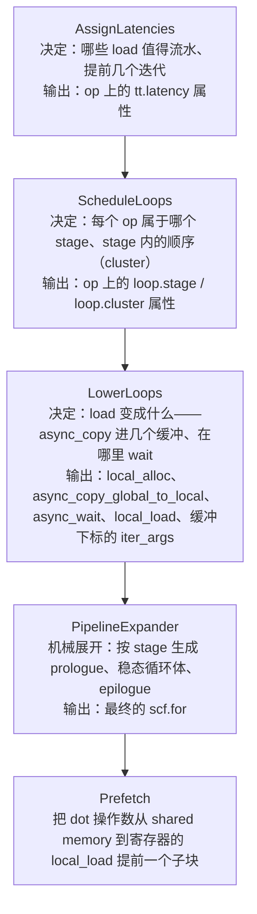
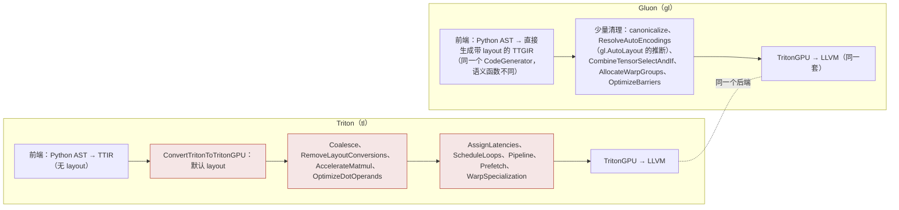

到上一篇为止，matmul kernel 的 layout 已经定好，但循环还是朴素的：每次迭代先等 A、B 从 global memory 到达，再喂 Tensor Core，再发下一次 load。GPU 的访存延迟几百个时钟，Tensor Core 一条 `mma` 十几个时钟——朴素循环里 Tensor Core 绝大部分时间在等。GPU Kernel 系列第三、七篇从用户视角讲过解法：**软件流水**——第 i 次迭代算的时候，第 i+1、i+2 次的数据已经在路上。那两篇给的是 `num_stages` 这个旋钮和"编译器会做"的承诺。这一篇打开编译器，看它怎么做：把一个 `scf.for` 变成带 prologue、多缓冲、异步拷贝、显式等待的循环，要经过哪几个决定，每个决定在哪个 pass 里。

然后是硬件把"异步"接过去的部分。Ampere 的 `cp.async` 让 load 异步；Hopper 加了 TMA（一条指令搬一个 tile）、`wgmma`（异步的、操作数在 shared memory 里的 Tensor Core 指令）、mbarrier（硬件计数的同步对象）；Blackwell 再加 `tcgen05`（单线程发起的 MMA）和 Tensor Memory（累加器不再占寄存器）。每一代都把更多的"编排"交给硬件，编译器要生成的 IR 形状也随之改变。**warp specialization** 是这条路的自然终点：不同的 warp 做不同的事——有的只发 load，有的只发 MMA——生产者 / 消费者用 mbarrier 握手。

最后是 Gluon。当编译器的自动决定不够好时，Triton 3.4 起给了一条出路：一个 layout、shared memory、mbarrier、TMA、`wgmma` / `tcgen05` 全部**显式**的子语言，运行在同一个编译器上，只是跳过了本篇和前两篇讲的所有自动 pass。

总纲对这一篇提出的核心问题是：

> **`num_stages=3` 的 matmul 循环，流水化之后 prologue 里有几次 load、循环体里 `async_wait` 等的是哪一批、shared memory 里有几个缓冲？[^q0] Hopper 上换成 TMA + `wgmma` 之后这些数字怎么变，多出来的 mbarrier 是谁在等谁？[^q1] warp specialization 把哪些 op 分给了哪些 warp？[^q2]**

## 一、总览

本文按**异步程度递增**组织：先讲通用的软件流水算法（第二章），然后看它在 Ampere 上产出的 IR（第三章）；再看 Hopper 的三样新硬件怎样改变 IR（第四章），Blackwell 的两样（第五章）；然后是 warp specialization（第六章）；最后 Gluon（第七章）。

| 章 | 主题 | 内容 |
|---|---|---|
| 二 | 软件流水的分解 | `AssignLatencies` → `ScheduleLoops` → `LowerLoops` → `PipelineExpander`；每步的输入输出；`Prefetch` |
| 三 | Ampere 上的产物 | `num_stages = 3` 的真实 TTGIR：2 个缓冲、prologue 2 次 load、`async_wait {num = 2}`、K 拆两半 |
| 四 | Hopper | TMA 与 tensor descriptor；`#nvmma_shared`；`wgmma` 的异步语义与 `warp_group_dot_wait`；mbarrier 的 phase；3 个缓冲 |
| 五 | Blackwell | `tcgen05.mma` 单线程发起；Tensor Memory 与 `#tmem`；`tmem_load` 的 `#linear` layout |
| 六 | warp specialization | `ttg.warp_specialize` 的结构；自动划分：谁发 load、谁发 MMA、谁做 epilogue；寄存器重分配 |
| 七 | Gluon | 为什么需要；语言长什么样；它跳过了哪些 pass、保留了哪些 |
| 八 | 本文小结 | |
| 九 | 自测 | 5 道题 |

源码：`lib/Dialect/TritonGPU/Transforms/Pipeliner/`（`AssignLatencies`、`ScheduleLoops`、`LowerLoops`、`PipelineExpander`、`SoftwarePipeliner`、`PipeliningUtility`）、`include/triton/Dialect/TritonGPU/Transforms/Schedule.h`、`Prefetch.cpp`、`WarpSpecialization/`、`include/triton/Dialect/TritonNvidiaGPU/IR/TritonNvidiaGPUOps.td`、`python/triton/experimental/gluon/`、`python/tutorials/gluon/`。本篇的 IR 来自同一个 matmul kernel 编到 `sm_80`、`sm_90`、`sm_100`，以及一个用 tensor descriptor 改写的版本。

## 二、软件流水的分解

### 1. 问题

```python
for k in range(0, K, BLOCK_K):
    a = tl.load(a_ptrs)          # 几百个时钟
    b = tl.load(b_ptrs)
    acc = tl.dot(a, b, acc)      # 十几个时钟 × 32 条
    a_ptrs += ...; b_ptrs += ...
```

目标：让第 i 次迭代的 `dot` 与第 i+1、i+2 次的 `load` 重叠。经典软件流水（modulo scheduling）的做法是把循环体切成 S 个 **stage**，第 i 次迭代的 stage s 与第 i+1 次的 stage s−1 同时执行；循环之前先执行前 S−1 次迭代的早期 stage（**prologue**），循环之后补完最后几次迭代的晚期 stage（**epilogue**）。对 GPU 还要加一件事：早发出去的 load 要有地方放——**多缓冲**（multi-buffering）的 shared memory。

Triton 把这件事拆成四个 pass（`make_ttgir` 里 `add_assign_latencies → add_schedule_loops → add_pipeline`，最后一个内部再分 `LowerLoops` 与 `PipelineExpander`），每一步只做一个决定：



拆开的好处是每一步都可以单独测试、单独替换：用户可以用 `tl.range(..., num_stages=…)` 或直接给 op 挂 `tt.latency` 属性覆盖第一步；`ScheduleLoops` 对 warp specialization 与普通流水共用；`PipelineExpander` 是从 MLIR 上游的 `scf` 流水器改来的通用展开器，不懂 GPU。

### 2. AssignLatencies：提前几个迭代

`AssignLoadLatencies::run`：

```cpp
loadOpToIndLevel = loadOpsToIndirectionLevel(forOp, ...);   // ① 找出值得流水的 load，以及它们的"间接层级"
int maxIndirectionLevel = max(所有 load 的层级);
unsigned loadLatency = (numStages - 1) / (maxIndirectionLevel + 1);   // ②
for (auto [loadOp, dist] : loadOpToIndLevel)
  opLatency[loadOp] = loadLatency;
```

① 从 `dot` 出发沿操作数反向 DFS（只走 A、B，不走累加器），遇到 `tt.load` 就记下来，层级 +1 再继续——`a = tl.load(tl.load(idx_ptrs))`（间接寻址）里外层 load 层级 0、内层层级 1。`isPipeliningBeneficial` 过滤：`canBeConvertedToAsyncLoad`——每线程访存宽度 ≥ 32 bit（`cp.async` 只支持 4 / 8 / 16 字节）；`canHaveSharedEncoding`——它的使用者都是 `dot` 操作数且 layout 兼容（要能放进 shared memory 再以 `#dot_op` 读出）。

② **latency = 提前几个迭代发出**。`num_stages = 3`、无间接寻址：`(3 − 1) / 1 = 2`——每个 load 提前两个迭代。有一层间接寻址时 `(3 − 1) / 2 = 1`：两层 load 各提前一个迭代，总共还是两个迭代的深度。这是 `num_stages` 的精确含义：**流水线的总深度是 `num_stages − 1` 个迭代**，在各层 load 之间平分。

用户可以绕过它：`tl.range(..., num_stages=N)` 在 `scf.for` 上挂 `tt.num_stages` 属性；更细的是给单个 load 挂 `tt.latency`（`hasLatenciesAssigned` 检测到就跳过自动分配）。

### 3. ScheduleLoops：stage 与 cluster

`scheduleKeyOps` 从 latency 算 stage：

```cpp
// 对每个 op 算"到 yield 的最长路径"，路径长度 = 沿途 op 的 latency 之和
computeDistance(op) = latency(op) + max over users(computeDistance(user))
maxDistance = max over 有 latency 的 op;
stage(op) = maxDistance - distance(op);           // 离 yield 越远的越早
```

`load`（latency 2）→ `dot`（0）→ `yield`：`distance(load) = 2`、`distance(dot) = 0`，`maxDistance = 2`，所以 `stage(load) = 0`、`stage(dot) = 2`。地址递增 `a_ptrs += …` 是 load 的操作数、有距离为 1 的循环依赖，`scheduleDistanceOneDependencies` 把它放在 load 的 stage 且排在前面；其余没被覆盖的 op（如 `truncf`）`scheduleRemainingToLastStage`。

**Cluster** 是 stage 内的顺序：同一 stage 的 op 按"哪个先执行"分组。`scheduleKeyOps` 把高 stage 的 op 放在前面的 cluster——**同一次循环体里先算 `dot`（stage 2，属于第 i 次迭代）再发 load（stage 0，属于第 i+2 次）**，让 load 尽早发出、`dot` 尽早等到数据。`scf.if`（如 mask 相关的条件）被推到最后一个 "epilogue cluster"。

结果写回 IR 作为属性（`loop.stage = 0`、`loop.cluster = 1`），`triton-opt --tritongpu-schedule-loops` 之后可以直接看到；`CoarseSchedule` 类（`Schedule.h`）是这张表的内存形式，提供 `insert / erase / splitClusterBefore / isOpBefore` 等操作。

### 4. LowerLoops：load 变成什么

对每个有 stage 的 `tt.load`：

```cpp
int stageDiff = useStage - defStage;                 // ① 使用者在几个 stage 之后 = 需要几个缓冲
bool canUseAsyncCp = canBeConvertedToAsyncLoad(loadOp) && copyVecBytes >= 4;
if (canUseAsyncCp || isTMALoad(op)) {
  if (loadRequiresAdditionalBuffer(op)) stageDiff += 1;   // ② wgmma：多一个缓冲
  asyncLoad.stageDiff = stageDiff; asyncLoad.sharedEncoding = ...;
} else if (stageDiff > 1) {
  op.emitRemark() << "Pipelining load that cannot use vectorized copy. This will likely lead to pipelining in registers and severe performance degradation.";   // ③
}
```

1. ① **缓冲数 = stage 差**：load 在 stage 0、`dot` 在 stage 2，中间隔两个迭代，任意时刻有两批数据在飞，要两个缓冲。`createAlloc` 建 `!ttg.memdesc<2x128x32xbf16, #shared, #smem, mutable>`——多出来的第一维就是缓冲下标；`memdesc_index %a[%idx]` 取一片。下标 `insertIdx` / `extractIdx` 作为 iter_args 每轮 `+1 mod numBuffers`（IR 里那串 `addi / cmpi sge / select` 就是它）。
2. ② Hopper 的 `wgmma` 是异步的，`dot` 发出后操作数所在的缓冲还在被读，下一轮的 load 不能覆盖它——多要一个缓冲（§四.3）。
3. ③ 不能用 `cp.async` 的 load（例如 mask 有 `other` 值、或每线程不到 4 字节）只能"在寄存器里流水"——提前 load 到寄存器持有几个迭代——寄存器压力暴涨，编译器发 remark 警告。这是第六篇 AxisInfo 的又一个下游：**对齐不够 → 不能 `cp.async` → 不能有效流水**。

然后 `createAsyncCopy`：`tt.load` 替换成 `ttg.async_copy_global_to_local %ptrs, %buf mask %m {contiguity = 8}`（`contiguity` 来自 AxisInfo，决定 `cp.async` 的 cp-size 4 / 8 / 16 字节）+ `async_commit_group`（把本轮发出的拷贝打成一组）+ 在使用处 `async_wait {num = N}`（**允许 N 组还在飞**，即等待更早的组完成）+ `local_load`（从 shared memory 读进 `#dot_op` 寄存器）。TMA 的 load（`isTMALoad`）走另一条：`async_tma_copy_global_to_local` + mbarrier（§四.2）。

### 5. PipelineExpander：机械展开

拿到每个 op 的 stage 之后，展开是确定的：

```text
prologue：for s in 0 .. S-2：执行前 s+1 次迭代中 stage ≤ s 的 op（第 0 次迭代的 stage 0；第 0 次的 stage 1 与第 1 次的 stage 0；……）
稳态循环：每轮执行 第 i 次迭代的 stage S-1、第 i+1 次的 stage S-2、……、第 i+S-1 次的 stage 0
epilogue：补完最后 S-1 次迭代剩下的高 stage（或者用谓词把它们折进循环——Triton 默认 peel epilogue = false，用 mask 折进去）
```

跨 stage 传递的值（第 i 次迭代 stage 0 产生、stage 2 消费）变成新的 iter_args——最终 `scf.for` 有 15 个 iter_args 而源码只有 3 个，多出来的是缓冲下标、`async` token、预取的操作数。循环次数不足 S−1 时的边界用 `cmpi + splat` 出来的 mask 处理（IR 开头的 `%acc = arith.cmpi sgt, %K, %c0_i32` 就是"第 0 次迭代存在吗"）。

`PipelineExpander.cpp` 改自 MLIR 上游 `scf` 方言的 `LoopPipelining`，不含任何 GPU 知识——它只认 stage 属性。

### 6. Prefetch

`make_ttgir` 里 `add_pipeline` 之后的 `add_prefetch`：`dot` 的操作数从 shared memory 到寄存器（`local_load`）本身也有延迟（`ldmatrix` 几十个时钟）。`Prefetch.cpp` 把 `BLOCK_K` 切成 `instrShape` 的 K（16）大小的子块：本轮先 `local_load` 下一个子块、再对当前子块做 `dot`；循环外先取第 0 个子块。IR 里的 `memdesc_subslice %a[0, 0]`、`[0, 16]` 和一轮里两条 `tt.dot` 就是它。

## 三、Ampere 上的产物

上一篇结尾的 matmul（`sm_80`、`num_warps = 4`、`num_stages = 3`）流水化后的 TTGIR，删掉地址运算后按执行顺序读：

```mlir
%a = ttg.local_alloc : () -> !ttg.memdesc<2x128x32xbf16, #shared, #smem, mutable>        // ① 2 个缓冲
%b = ttg.local_alloc : () -> !ttg.memdesc<2x32x128xbf16, #shared1, #smem, mutable>
%acc = arith.cmpi sgt, %K, %c0_i32 : i32                                                  // ② 第 0 次迭代存在？
%a_31 = ttg.memdesc_index %a[%c0_i32]
%a_33 = ttg.async_copy_global_to_local %a_ptrs_19, %a_31 mask %acc_32 {contiguity = 8 : i32}   // ③ prologue：迭代 0 的 A
%a_34 = ttg.async_commit_group tokens %a_33
%b_37 = ttg.async_copy_global_to_local %b_ptrs_28, %b_35 mask %acc_36 {contiguity = 8 : i32}   //    迭代 0 的 B
%b_38 = ttg.async_commit_group tokens %b_37
%acc_39 = arith.cmpi sgt, %K, %c32_i32 : i32                                              //    第 1 次迭代存在？
%a_44 = ttg.async_copy_global_to_local %a_ptrs_40, %a_42 mask %acc_43 {contiguity = 8 : i32}   //    迭代 1 的 A（缓冲 1）
%a_45 = ttg.async_commit_group tokens %a_44
%b_48 = ttg.async_copy_global_to_local %b_ptrs_41, %b_46 mask %acc_47 {contiguity = 8 : i32}   //    迭代 1 的 B
%b_49 = ttg.async_commit_group tokens %b_48
%a_50 = ttg.async_wait %a_34, %b_38 {num = 2 : i32}                                       // ④ 等迭代 0 的两组到达（允许 2 组在飞）
%a_51 = ttg.memdesc_subslice %a_31[0, 0] : ... -> !ttg.memdesc<128x16xbf16, ...>
%a_52 = ttg.local_load %a_51 token %a_50 : ... -> tensor<128x16xbf16, #ttg.dot_op<{opIdx = 0, parent = #mma, kWidth = 2}>>   // ⑤ Prefetch：第 0 个 K 子块进寄存器
%b_54 = ttg.local_load %b_53 token %a_50 : ... -> tensor<16x128xbf16, #ttg.dot_op<{opIdx = 1, parent = #mma, kWidth = 2}>>
%acc_55:15 = scf.for %k = %c0_i32 to %K step %c32_i32 iter_args(%acc_70 = %cst, ..., %a_82 = %a_52, %b_83 = %b_54, ...) {   // ⑥ 15 个 iter_args
  %a_89 = ttg.async_wait %a_74, %b_76 {num = 2 : i32}                                    // ⑦ 等下一次迭代的数据
  %a_91 = ttg.local_load %a_90 token %a_80 : memdesc<128x16xbf16> -> #dot_op             //    当前迭代第 1 个 K 子块 [0, 16]
  %b_93 = ttg.local_load %b_92 token %a_81
  %acc_94 = tt.dot %a_82, %b_83, %acc_70 : tensor<128x16xbf16, #dot_op> * tensor<16x128xbf16, #dot_op> -> tensor<128x128xf32, #mma>   // ⑧ dot：第 0 个子块（上轮预取）
  %a_102 = ttg.async_copy_global_to_local %a_ptrs_95, %a_100 mask %acc_101 {contiguity = 8 : i32}   // ⑨ 发迭代 i+2 的 load 进空出来的缓冲
  %a_103 = ttg.async_commit_group tokens %a_102
  %b_106 = ttg.async_copy_global_to_local %b_ptrs_96, %b_104 mask %acc_105 {contiguity = 8 : i32}
  %b_107 = ttg.async_commit_group tokens %b_106
  %a_113 = ttg.async_wait %a_75, %b_77 {num = 2 : i32}
  %a_116 = ttg.local_load %a_115 token %a_113 : ... -> #dot_op                            // ⑩ 预取下一次迭代的第 0 个子块
  %b_118 = ttg.local_load %b_117 token %a_114
  %acc_119 = tt.dot %a_91, %b_93, %acc_94 : ... -> tensor<128x128xf32, #mma>              // ⑪ dot：第 1 个子块
  scf.yield %acc_119, %a_ptrs_95, %b_ptrs_96, %acc_99, %acc_88, %a_75, %a_103, %b_77, %b_107, %a_111, %b_112, %a_113, %a_114, %a_116, %b_118 : ...
}
%acc_56 = ttg.async_wait {num = 0 : i32}                                                  // ⑫ 收尾：等所有在飞的组
ttg.local_dealloc %b
ttg.local_dealloc %a
```

回答核心问题第一问：

1. ① **2 个缓冲**：`num_stages = 3` → latency 2 → `stageDiff = 2`。不是 3——`num_stages` 数的是 stage（load 的 stage 0、中间 1、`dot` 的 stage 2），缓冲数是 load 与 `dot` 的 stage 差。
2. ③ **prologue 里 2 次 load**（每次 A、B 各一组）：迭代 0 与迭代 1 的，分别进缓冲 0 和 1；每次都带一个"这次迭代存在吗"的 mask（② 与 `%acc_39`），K 太小时 load 被谓词掉而不是越界。
3. ④ ⑦ **`async_wait {num = 2}` 等的是最老的一批**：`num` 是"允许还在飞的 commit group 数"；每次迭代 A、B 各 1 组，允许 2 组在飞 = 允许最近一个迭代的 load 未完成 = 等待再之前那个迭代的到达。循环体里等的是"本次迭代要用的数据"，它在两个迭代前发出。
4. ⑨ load 发在 `dot` 之后、`dot` 用的缓冲是刚刚 `wait` 到的那个，新 load 写的是上一轮 `dot` 用完的那个——**stage 高的先执行**（§二.3 的 cluster 顺序）保证了缓冲的读写不冲突，不需要额外 barrier（`async_wait` 之后 `LowerLoops` 插的 `local_load` 与下一轮 `async_copy` 之间的 WAR 由第十篇的 `Membar` 分析保证）。
5. ⑤ ⑧ ⑩ ⑪ `Prefetch` 的痕迹：K = 32 拆成两个 16，每轮两条 `dot`，第 0 个子块在上一轮末尾就 `local_load` 好了（作为 iter_arg `%a_82` 传进来）。
6. ⑥ 15 个 iter_args：累加器 1 + 指针 2 + 缓冲下标 2 + `async` token 4 + 缓冲视图 2 + wait token 2 + 预取操作数 2。

## 四、Hopper：TMA、`wgmma`、mbarrier

同一个 kernel 编到 `sm_90`（`GPUTarget("cuda", 90, 32)`），不改源码：

```text
#mma = #ttg.nvidia_mma<{versionMajor = 3, versionMinor = 0, warpsPerCTA = [4, 1], instrShape = [16, 128, 16]}>
#shared = #ttg.nvmma_shared<{swizzlingByteWidth = 64, transposed = false, elementBitWidth = 16}>
#shared1 = #ttg.nvmma_shared<{swizzlingByteWidth = 128, transposed = false, elementBitWidth = 16}>
%a = ttg.local_alloc : () -> !ttg.memdesc<3x128x32xbf16, #shared, #smem, mutable>       // 3 个缓冲
%b = ttg.local_alloc : () -> !ttg.memdesc<3x32x128xbf16, #shared1, #smem, mutable>
scf.for ... {
  %a_80 = ttg.async_wait %a_71, %b_73 {num = 2 : i32}
  %acc_83 = ttng.warp_group_dot %a_81, %b_82, %acc_66 {inputPrecision = 0 : i32, isAsync = true}
      : !ttg.memdesc<128x32xbf16, #shared, #smem, mutable> * !ttg.memdesc<32x128xbf16, #shared1, #smem, mutable> -> tensor<128x128xf32, #mma>
  %acc_84:3 = ttng.warp_group_dot_wait %acc_83, %a_81, %b_82 {pendings = 1 : i32}
  ... async_copy_global_to_local ×2 ...
}
%acc_51 = ttng.warp_group_dot_wait %acc_50#0 {pendings = 0 : i32}
```

三处变化：

### 1. `wgmma`：操作数在 shared memory，指令是异步的

`#mma` 变成 `versionMajor = 3`、`instrShape = [16, 128, 16]`（一个 warp group——4 个 warp——一条 `wgmma.mma_async.m64n128k16`；`warpsPerCTA = [4, 1]` 是 warp group 的形状）。`tt.dot` 变成 **`ttng.warp_group_dot`**，操作数类型是 `!ttg.memdesc`——**直接从 shared memory 读**，没有 `local_load`、没有 `#dot_op` 寄存器、没有 `ldmatrix`。这是上一篇 `AccelerateMatmul` v3 路径 `getSharedMemoryMMAOperand` 的产物。

`isAsync = true`：`wgmma.mma_async` 发出后立刻返回，结果在 `wgmma.wait_group` 之后才可用。`ttng.warp_group_dot_wait %acc, %a, %b {pendings = 1}` 就是这个 wait——`pendings = 1` 允许一条 `wgmma` 还在飞，即**本次的 MMA 与下次的 load / wait 重叠**；操作数 `%a_81, %b_82` 也传进 wait，表示"这两个缓冲在 wait 之前不能被覆盖"。循环后 `pendings = 0` 收尾。

### 2. `#nvmma_shared`

`wgmma` 要求操作数按硬件规定的布局放在 shared memory 里：128 / 64 / 32 字节 swizzle 之一，由 tile 的行字节数决定——A 的 `[128, 32]` bf16 一行 64 字节 → `swizzlingByteWidth = 64`；B 的 `[32, 128]` 一行 256 字节 → 用 128。这是 TMA 也认的布局，所以 TMA 搬进来的 tile 可以直接喂 `wgmma`。指令通过一个 64 位**矩阵描述符**（地址、leading / stride 字节数、swizzle 模式）找到数据，第十篇的 lowering 会算这个描述符。

### 3. 3 个缓冲

`memdesc<3x…>`：`num_stages = 3`，latency 仍是 2，但 `loadRequiresAdditionalBuffer` 对 `wgmma` 返回真——`+1`。原因：`wgmma` 异步，第 i 次的 MMA 在 `pendings = 1` 下可能到第 i+1 次的 wait 才完成，期间缓冲 i 不能被写；同时缓冲 i+1、i+2 里是在飞的 load——三个都占着。Ampere 的 `mma.sync` 是同步的，`dot` 返回时操作数已经在寄存器里了，缓冲立即可复用，所以 2 个够。`shared = 49152` = 3 × (8 + 8) KB。

### 4. TMA：换成 tensor descriptor

上面的 Hopper 版本还在用 `cp.async`（每个线程算自己的地址、搬 16 字节）。TMA 需要源码用 **tensor descriptor**：

```python
@triton.jit
def matmul_tma_kernel(a_desc, b_desc, c_desc, K, BLOCK_M: tl.constexpr, BLOCK_N: tl.constexpr, BLOCK_K: tl.constexpr, WARP_SPECIALIZE: tl.constexpr):
    off_m = tl.program_id(0) * BLOCK_M
    off_n = tl.program_id(1) * BLOCK_N
    acc = tl.zeros((BLOCK_M, BLOCK_N), dtype=tl.float32)
    for k in tl.range(0, K, BLOCK_K, warp_specialize=WARP_SPECIALIZE):
        a = a_desc.load([off_m, k])            # 一个 [BLOCK_M, BLOCK_K] 的 tile，坐标而不是指针
        b = b_desc.load([k, off_n])
        acc = tl.dot(a, b, acc)
    c_desc.store([off_m, off_n], acc.to(tl.bfloat16))
```

`a_desc` 是 host 侧 `TensorDescriptor.from_tensor(a, [BLOCK_M, BLOCK_K])` 建的：底层是 CUDA 的 `CUtensorMap`（128 字节，描述 global 张量的基址、shape、stride、tile 大小、swizzle），由驱动 API `cuTensorMapEncodeTiled` 填充，作为 kernel 参数传入（签名里是 `tensordesc<bf16[128, 32]>`，TTIR 里是 `!tt.tensordesc<128x32xbf16>`）。`sm_90` 上编译（`num_stages = 3`）：

```mlir
%a = ttg.local_alloc : () -> !ttg.memdesc<3x128x32xbf16, #shared, #smem, mutable>
%b = ttg.local_alloc : () -> !ttg.memdesc<3x32x128xbf16, #shared1, #smem, mutable>
%acc = ttg.local_alloc : () -> !ttg.memdesc<3x1xi64, #shared2, #smem, mutable>            // ① 3 个 mbarrier（每个缓冲一个）
ttng.init_barrier %acc_0, 1                                                               //    到达计数 1
ttng.init_barrier %acc_1, 1
ttng.init_barrier %acc_2, 1
ttng.barrier_expect %acc_0, 16384, %acc_3                                                 // ② 告诉 barrier 0：等 16384 字节到达
ttng.async_tma_copy_global_to_local %a_desc[%off_m, %c0_i32] %a_4, %acc_0, %acc_3         // ③ TMA：搬 A 的 tile 到缓冲 0，完成后通知 barrier 0
    : !tt.tensordesc<128x32xbf16, #shared>, !ttg.memdesc<1xi64, ...> -> !ttg.memdesc<128x32xbf16, #shared, ...>
ttng.async_tma_copy_global_to_local %b_desc[%c0_i32, %off_n] %b_5, %acc_0, %acc_3         //    B 也通知 barrier 0
ttng.barrier_expect %acc_1, 16384, %acc_6                                                 //    迭代 1 → 缓冲 1、barrier 1
ttng.async_tma_copy_global_to_local %a_desc[%off_m, %c32_i32] %a_7, %acc_1, %acc_6
ttng.async_tma_copy_global_to_local %b_desc[%c32_i32, %off_n] %b_8, %acc_1, %acc_6
scf.for ... iter_args(%acc_12 = %cst, %acc_13 = %c1_i32, %acc_14 = %c-1_i32, %acc_15 = %c0_i32) {   // ④ 只有 4 个 iter_args
  ttng.wait_barrier %acc_23, %acc_22                                                      // ⑤ 等本次迭代的 barrier 翻到指定 phase
  %acc_26 = ttng.warp_group_dot %a_25, %b_24, %acc_12 {isAsync = true}
  %acc_27:3 = ttng.warp_group_dot_wait %acc_26, %a_25, %b_24 {pendings = 1 : i32}
  ttng.barrier_expect %acc_31, 16384, %acc_17
  ttng.async_tma_copy_global_to_local %a_desc[%off_m, %acc_33] %a_32, %acc_31, %acc_17     // ⑥ 发迭代 i+2 的 TMA
  ttng.async_tma_copy_global_to_local %b_desc[%acc_33, %off_n] %b_34, %acc_31, %acc_17
}
%acc_10 = ttng.warp_group_dot_wait %acc_9#0 {pendings = 0 : i32}
ttng.inval_barrier %acc_0 ...                                                             // ⑦ 销毁 barrier
%1 = ttg.local_alloc %0 : (tensor<128x128xbf16, #mma>) -> !ttg.memdesc<128x128xbf16, #shared1, #smem>   // ⑧ epilogue：结果进 shared memory
ttng.fence_async_shared {bCluster = false}
ttng.async_tma_copy_local_to_global %c_desc[%off_m, %off_n] %1                            //    TMA store
ttng.async_tma_store_wait {pendings = 0 : i32}
```

回答核心问题第二问。**mbarrier 是谁在等谁**：

- ① 每个缓冲配一个 mbarrier（8 字节的 shared memory 对象，硬件维护到达计数和 **phase** 位）。`init_barrier %bar, 1`：到达计数 1——只有一个"到达者"，就是 TMA 引擎。
- ② `barrier_expect %bar, 16384`：由一个线程执行，告诉 barrier "这一轮期待 16384 字节（A 8192 + B 8192）的事务"。`cp.async.bulk` 家族的完成机制是**事务计数**：TMA 每写完一段数据就向 barrier 报告字节数，字节数凑齐加上到达计数凑齐，barrier 翻转 phase。
- ③ TMA 拷贝指令带着 barrier 的地址：`cp.async.bulk.tensor.2d.shared::cluster.global.mbarrier::complete_tx::bytes`——**由一个线程发出**（lowering 时用 `elect.sync` 或 `tid == 0` 谓词），硬件按描述符搬整个 tile，不占用任何线程的寄存器或指令槽。对比 `cp.async`：128 个线程各发一条搬 16 字节。
- ⑤ `wait_barrier %bar, %phase`：消费者（做 MMA 的 warp group）在这里自旋，直到 barrier 的 phase 位等于期待值。phase 是 iter_args 里那个 `%acc_15`，每用完一轮缓冲翻一次——**同一个 barrier 被反复使用**，phase 区分"这是第几次翻转"。所以：**等的一方是 MMA warp，被等的一方是 TMA 引擎**；prologue 里发的两次 TMA 对应 barrier 0、1 的第一次翻转。
- ④ iter_args 从 15 个降到 4 个：没有 token、没有预取的操作数、没有缓冲视图——TMA + `wgmma` 把"数据在哪、到没到"全部交给硬件对象（描述符、mbarrier、`wgmma` 的 wait group）管理，编译器只剩下缓冲下标和 phase 两个计数器。
- ⑧ epilogue 也换了：累加器先 `local_alloc` 进 shared memory（`#nvmma_shared`，这一步就是上一篇那个 `#mma → #blocked` 的转换的替身——目标从寄存器 layout 变成了 shared memory 布局），`fence_async_shared` 保证写完，`async_tma_copy_local_to_global` 一条指令写回整个 `[128, 128]` tile，`async_tma_store_wait` 收尾。**store 的合并访存问题在 TMA 下消失了**——TMA 引擎自己按描述符做地址生成。

一个诚实的注记：同一份源码在 `sm_90` 上打开 `warp_specialize=True`，Triton v3.8.0 的编译器在 `async_tma_copy_global_to_local` 的 verifier 处报错（描述符块与张量元素数不匹配）——Hopper 的自动 warp specialization 在这个配置下还不成熟。下面 Blackwell 的例子能跑通。

## 五、Blackwell：`tcgen05` 与 Tensor Memory

同一份 TMA 源码编到 `sm_100`：

```text
#tmem = #ttng.tensor_memory_encoding<blockM = 128, blockN = 128, colStride = 1>
%acc_3 = ttng.tmem_alloc : () -> !ttg.memdesc<1x128x128xf32, #tmem, #ttng.tensor_memory, mutable>   // ① 累加器在 Tensor Memory
ttng.tmem_store %cst, %acc_4, %true : tensor<128x128xf32, #linear> -> !ttg.memdesc<128x128xf32, #tmem, ...>   // 清零
scf.for ... {
  ttng.wait_barrier %b_37, %a_36
  ttng.tc_gen5_mma %a_38, %a_39, %acc_40, %arg28, %true_25, %b_41[%true_25] {is_async}       // ② 单线程发起的 MMA，累加器是 memdesc
      : !ttg.memdesc<128x32xbf16, #shared, ...>, !ttg.memdesc<32x128xbf16, #shared1, ...>, !ttg.memdesc<128x128xf32, #tmem, ...>, ...
}
ttng.tc_gen5_commit %acc_30                                                                 // ③ MMA 完成时通知一个 mbarrier
ttng.wait_barrier %acc_2, %c0_i32
%acc_13 = ttng.tmem_load %acc_4 : !ttg.memdesc<128x128xf32, #tmem, ...> -> tensor<128x128xf32, #linear>   // ④ 读回寄存器
```

1. ① **Tensor Memory**（TMEM）：Blackwell 每个 SM 新增的 256 KB 片上存储，专门放 MMA 的累加器。`#ttng.tensor_memory_encoding<blockM = 128, blockN = 128, colStride = 1>` 描述 tile 在 TMEM 的 128 行 × 512 列（每列 32 位）里怎么放；`metadata["tmem_size"] = 128` 是占用的列数。**累加器不再占寄存器**——上一篇算的"`[128, 128]` f32 累加器每线程 128 个寄存器"在 Blackwell 上归零，寄存器可以全给 epilogue 和别的用途。
2. ② `tcgen05.mma`：由**单个线程**发起（`elect.sync` 选一个），操作数 A、B 在 shared memory（描述符），累加器 D 在 TMEM（地址），`%arg28` 是 `use_acc`（第一次迭代为 false 即"清零累加"，省掉显式 `tmem_store` 的开销——IR 里那个 iter_arg `%arg28 = %false` 就是它）。指令异步执行，完成时 ③ `tc_gen5_commit` 让它到达一个 mbarrier。**MMA 从"warp 集体执行的指令"变成了"一个线程提交给引擎的任务"**——这是 warp specialization 在 Blackwell 上自然的原因：既然一个线程就能发 MMA，让一个 warp 专门干这个即可。
3. ④ `tmem_load` 把结果读回寄存器，layout 是一个 `#linear`（`tcgen05.ld` 的 32x32b 等形状规定的、用 `#ttg.linear` 直接写出基向量的布局），然后照常 `convert_layout` / store。

`AccelerateMatmul` 的 `BlockedToMMAv5` pattern 负责这套改写：`tt.dot` → `tmem_alloc + tc_gen5_mma + tmem_load`，同时 `TritonNvidiaGPU` 的一组 pass（`add_tma_lowering`、`add_promote_lhs_to_tmem`、`add_optimize_tmem_layouts`、`add_interleave_tmem`、`add_remove_tmem_tokens`——`make_ttgir` 里 `capability // 10 >= 10` 分支）处理 TMEM 的分配与布局。

## 六、warp specialization

### 1. 为什么

流水化让 load 与 MMA 在**时间上**重叠，但它们仍由同一组 warp 发出：一个 warp 的指令流里 `wgmma`、`cp.async.bulk`、`mbarrier.try_wait`、地址计算轮流出现，任何一个卡住（例如等 barrier）都让这个 warp 后面的指令一起等。而 Hopper / Blackwell 的 TMA 与 MMA 都是"一个线程发一条指令，硬件引擎干活"——发指令的成本极低，**瓶颈变成了指令之间的依赖与调度**。解法是**空间上**分开：一组 warp 只管发 TMA（生产者），一组只管发 MMA（消费者），一组做 epilogue，之间用 mbarrier 握手——每组的指令流都是紧凑的循环，没有互相等待。CUTLASS 在 Hopper 上的 "warp-specialized persistent ping-pong" kernel 就是这个结构，Triton 3.3 起让编译器自动生成它。

### 2. IR：`ttg.warp_specialize`

`sm_100`、`warp_specialize=True`：

```mlir
ttg.warp_specialize(%b_9, %a, %b, %acc_3, %b_5, %K, %acc_1, %a_desc, %off_m, %b_desc, %off_n) attributes {requestedRegisters = array<i32: 24, 24>}
default {                                                       // ① 默认区：原来的 4 个 warp
  ttg.warp_yield                                                //    循环期间什么都不做
}
partition0(%b_14: !ttg.memdesc<3x1xi64, ...>, %a_15: !ttg.memdesc<3x128x32xbf16, ...>, %b_16: ..., %acc_17: !ttg.memdesc<1x128x128xf32, #tmem, ...>, ...) num_warps(1) {   // ② MMA 分区：1 个 warp
  scf.for %k ... iter_args(%arg28 = %false, ...) {
    ttng.wait_barrier %b_37, %a_36                              //    等"缓冲已满"（TMA 到达）
    ttng.tc_gen5_mma %a_38, %a_39, %acc_40, %arg28, %true_25, %b_41[%true_25] {is_async}   //    发 MMA，完成时到达"缓冲已空" barrier
  } {tt.warp_specialize}
  ttng.tc_gen5_commit %acc_30                                   //    全部 MMA 完成 → 通知 epilogue 的 barrier
  ttg.warp_return
}
partition1(...) num_warps(2) {                                  // ③ load 分区：2 个 warp
  scf.for %k ... {
    ttng.wait_barrier %b_36, %a_35                              //    等"缓冲已空"（MMA 用完）
    ttng.barrier_expect %b_39, 16384, %true_25
    ttng.async_tma_copy_global_to_local %a_desc_21[%off_m_22, %k] %a_37, %b_39, %true_25   //    发 TMA，完成时到达"缓冲已满"
    ttng.async_tma_copy_global_to_local %b_desc_23[%k, %off_n_24] %a_38, %b_39, %true_25
  } {tt.warp_specialize}
  ttg.warp_return
} : (...) -> ()
ttng.wait_barrier %acc_2, %c0_i32                               // ④ 默认区继续：等 MMA 全部完成
%acc_13 = ttng.tmem_load %acc_4 : ... -> tensor<128x128xf32, #linear>   //    读累加器、写回
```

回答核心问题第三问：

- ① **默认区**（原来的 `num_warps = 4` 个 warp）在循环期间**空转**（`warp_yield` 什么都不产出），循环结束后做 epilogue：`tmem_load` 累加器、转换、store。它是可以隐式捕获外部值的区域。
- ② **partition0，1 个 warp**：只跑 MMA 循环——等"满"barrier、发 `tcgen05.mma`。一个 warp 够了，因为 `tcgen05.mma` 是单线程发起的。
- ③ **partition1，2 个 warp**：只跑 load 循环——等"空"barrier、`barrier_expect`、发两条 TMA。
- 两个分区之间是经典的**生产者 / 消费者环形缓冲**：3 个缓冲、每个缓冲两个 mbarrier（"满"由 TMA 到达、MMA 等待；"空"由 MMA 完成到达、TMA 等待），phase 位区分轮次。分区是 `IsolatedFromAbove` 的——它们的 `num_warps` 与外部不同，layout 的含义（`warpsPerCTA`）也不同，所以所有用到的值必须显式作为参数传入（那一长串 `%b_14, %a_15, …`）。
- `requestedRegisters = [24, 24]`：两个分区各自只需要 24 个寄存器——它们不持有累加器、不做算术。lowering 时用 `setmaxnreg` 指令**把寄存器从分区 warp 让给默认区**（默认区做 epilogue 需要多）。`metadata["num_warps"] = 8`：4 + 1 + 2 = 7，按 warp group 对齐到 8，kernel 启动时的 block 大小是 256 线程。

### 3. 自动划分怎么做

`lib/Dialect/TritonGPU/Transforms/WarpSpecialization/`：`ScheduleLoops` 给 op 分 stage 的同时，warp specialization 用同一套 `CoarseSchedule` 给 op 分 **partition**（`loop.partition` 属性）：TMA load 一个分区、MMA 一个分区、其余留在默认区；`PartitionLoops` 把循环按分区切成几个独立的 `scf.for`；`LoadMMASpecialization` 在分区之间插 mbarrier 与 `arrive / wait`；`OptimizePartitionWarps` 决定每个分区几个 warp（`relayoutWarps`：把分区体当成一个独立的 `tt.func` 跑一遍 layout 推断，看最少几个 warp 能装下）与寄存器数；`RewritePartitionDependencies` 把跨分区的值变成 shared memory 传递。整个机制只对 `tl.range(..., warp_specialize=True)` 标记的循环启用（`tt.warp_specialize` 属性），且目前只在 Blackwell 上稳定——上一节的 Hopper 报错就是证据。

## 七、Gluon

### 1. 为什么

前四篇的自动 pass 在 matmul 这类规则 kernel 上工作得很好，但每一个都是启发式：Coalesce 的 128 bit 上限、`RemoveLayoutConversions` 的"Hacky resolve"、`warpsPerTileV2` 的偏向 M、`AssignLatencies` 的均分、warp 划分的固定模式。当 kernel 变得不规则（attention 的 causal mask 与在线 softmax、MoE 的分组、解码阶段的小 batch），启发式选错的概率上升，而用户**没有任何手段**去改一个 layout 或一个 stage 分配——Triton 的抽象把它们全藏起来了。同时 Hopper / Blackwell 的性能上限越来越依赖精细的编排（warp specialization 的分区形状、TMEM 的分配、mbarrier 的 phase 管理），CUTLASS 用 C++ 模板把这些暴露给专家，Triton 没有对应物。

**Gluon**（Triton 3.4 起，`triton.experimental.gluon`）是这个对应物：一个与 Triton 共用前端、编译器与运行时，但 **layout、shared memory、同步与硬件指令全部显式**的子语言。

### 2. 长什么样

`python/tutorials/gluon/05-wgmma.py` 里的一个 Hopper kernel（节选）：

```python
from triton.experimental import gluon
from triton.experimental.gluon import language as gl
from triton.experimental.gluon.language.nvidia.hopper import tma, mbarrier, fence_async_shared, warpgroup_mma, warpgroup_mma_wait

@gluon.jit
def small_mma_kernel(a_desc, b_desc, c_desc, d_desc, LHS_IN_REG: gl.constexpr, INSTR_SHAPE_N: gl.constexpr, num_warps: gl.constexpr):
    bar = gl.allocate_shared_memory(gl.int64, [1], mbarrier.MBarrierLayout())          # ① 显式分配 mbarrier
    mbarrier.init(bar, count=1)
    a_smem = gl.allocate_shared_memory(a_desc.dtype, a_desc.block_type.shape, a_desc.layout)   # ② 显式 shared memory，layout 来自描述符（NVMMASharedLayout）
    b_smem = gl.allocate_shared_memory(b_desc.dtype, b_desc.block_type.shape, b_desc.layout)
    c_smem = gl.allocate_shared_memory(c_desc.dtype, c_desc.block_type.shape, c_desc.layout)
    mbarrier.expect(bar, a_desc.block_type.nbytes + b_desc.block_type.nbytes + c_desc.block_type.nbytes)   # ③ 显式 expect_tx
    tma.async_load(a_desc, [0, 0], bar, a_smem)                                        # ④ 显式 TMA
    tma.async_load(b_desc, [0, 0], bar, b_smem)
    tma.async_load(c_desc, [0, 0], bar, c_smem)
    mbarrier.wait(bar, phase=0)                                                        # ⑤ 显式 wait 与 phase
    mbarrier.invalidate(bar)

    c_layout: gl.constexpr = gl.NVMMADistributedLayout(version=[3, 0], warps_per_cta=[num_warps, 1], instr_shape=[16, INSTR_SHAPE_N, 256 // a_desc.dtype.primitive_bitwidth])   # ⑥ 显式 #mma
    a_reg_layout: gl.constexpr = gl.DotOperandLayout(operand_index=0, parent=c_layout, k_width=32 // a_desc.dtype.primitive_bitwidth)                                          #    显式 #dot_op
    a = a_smem.load(a_reg_layout) if LHS_IN_REG else a_smem                             # ⑦ A 走寄存器还是 shared memory：用户选
    c = c_smem.load(c_layout)
    d = warpgroup_mma(a, b_smem, c, is_async=True, use_acc=True)                       # ⑧ 显式 wgmma，显式异步
    d = warpgroup_mma_wait(num_outstanding=0, deps=(d, ))                              #    显式 wait_group
    d_smem = gl.allocate_shared_memory(d_desc.dtype, d_desc.block_type.shape, d_desc.layout)
    d_smem.store(d)
    fence_async_shared()
    tma.async_copy_shared_to_global(d_desc, [0, 0], d_smem)                            # ⑨ 显式 TMA store
    tma.store_wait(pendings=0)
```

每一行对应第四章 IR 里的一个 op：`gl.allocate_shared_memory` → `ttg.local_alloc`，`mbarrier.init / expect / wait` → `ttng.init_barrier / barrier_expect / wait_barrier`，`tma.async_load` → `ttng.async_tma_copy_global_to_local`，`warpgroup_mma` → `ttng.warp_group_dot`，`gl.NVMMADistributedLayout` → `#ttg.nvidia_mma`，`gl.BlockedLayout(size_per_thread, threads_per_warp, warps_per_cta, order)` → `#ttg.blocked`。**Gluon 的类型系统就是 TTGIR 的类型系统**：`gl.tensor` 带 layout，`shared_memory_descriptor` 就是 `memdesc`，编译器 verifier 检查 layout 一致性（`gl.static_assert(isinstance(a_smem.type.layout, gl.NVMMASharedLayout))` 是用户侧的断言）。warp specialization 也是显式的：`gl.warp_specialize([(worker_fn, args), ...], ...)` 直接生成 `ttg.warp_specialize`（教程 `08-warp-specialization.py`）。`gluon.language.nvidia` 下按架构分 `ampere / hopper / blackwell / rubin` 子模块，`amd` 下是 CDNA 的对应物。

### 3. 它跳过了什么



`third_party/nvidia/backend/compiler.py` 的 `make_ttgir` 开头：`if knobs.compilation.enable_experimental_consan or is_gluon: … return` 分支——Gluon 的 TTGIR 只过几个不改变 layout 的 pass（`ttgpuir.add_inliner`、`add_canonicalizer`、`add_resolve_auto_encodings`、`add_allocate_warp_groups` 等），**第七、八、九篇讲的全部自动 pass 一个不跑**。用户写的 layout 就是最终的 layout，用户放的 barrier 就是最终的 barrier。换来的是：写错 layout 编译器只报类型错误不会替你修，忘了 wait 就是数据竞争。

Gluon 的意义超出"专家模式"：它是**编译器边界的制度化**。Triton 的设计承诺是"用户定 tile，编译器定 layout"（第一篇 §八.2）；十年的经验说这个承诺在规则 kernel 上兑现得很好、在前沿硬件的前沿 kernel 上兑现不了。Gluon 把边界画在了 TTGIR 这一层：往上（Python 前端、类型系统、运行时、缓存）和往下（TTGIR → LLVM → PTX 的 lowering，第十篇）都复用，中间那段启发式的 layout 与调度决策由用户接管。新硬件特性（Blackwell 的 `tcgen05`、TMEM、Rubin）现在往往**先在 Gluon 里暴露**，等编译器的自动路径成熟再进 `tl`。

## 八、本文小结

1. 软件流水拆成四步：`AssignLatencies` 决定每个 load 提前几个迭代（`(num_stages − 1) / (间接层级 + 1)`，只对能 `cp.async` 的宽 load）；`ScheduleLoops` 按"到 yield 的最长 latency 路径"分 stage、高 stage 先执行（cluster）；`LowerLoops` 把 load 变成 `async_copy_global_to_local + commit_group + async_wait + local_load`，缓冲数 = stage 差（`wgmma` 多一个）；`PipelineExpander` 机械生成 prologue / 稳态 / 谓词化的 epilogue。`Prefetch` 再把 `local_load` 提前一个 K 子块。
2. Ampere、`num_stages = 3`：2 个缓冲、prologue 2 次 load、`async_wait {num = 2}` 等最老的一批、K = 32 拆成两个 16、15 个 iter_args。
3. Hopper：`wgmma` 操作数直接在 `#nvmma_shared` 的 shared memory 里（无 `local_load`、无 `#dot_op`），`warp_group_dot {isAsync}` + `warp_group_dot_wait {pendings = 1}` 让 MMA 与下一轮重叠，因此 3 个缓冲。TMA 需要 tensor descriptor：每个缓冲一个 mbarrier，`barrier_expect` 声明字节数，TMA 引擎完成时到达，MMA warp `wait_barrier` 按 phase 等待；iter_args 从 15 降到 4；epilogue 用 TMA store，合并访存问题消失。
4. Blackwell：累加器在 Tensor Memory（`#tmem`，不占寄存器），`tcgen05.mma` 单线程发起、`tc_gen5_commit` 到达 mbarrier，`tmem_load` 以 `#linear` 读回。
5. warp specialization：`ttg.warp_specialize` 的默认区（4 warp，循环期空转、做 epilogue）+ partition0（1 warp，MMA 循环）+ partition1（2 warp，TMA 循环），环形缓冲的"满 / 空"两组 mbarrier 握手，分区 `IsolatedFromAbove`、显式传参、`requestedRegisters` 让出寄存器；只对 `warp_specialize=True` 的循环启用，Blackwell 上稳定。
6. Gluon：与 Triton 共用前端、类型系统、TTGIR → LLVM 与运行时，但 layout、shared memory、mbarrier、TMA、`wgmma` / `tcgen05`、warp specialization 全部显式，跳过全部自动 layout 与调度 pass。它把"编译器边界"制度化在 TTGIR 层。

## 九、自测

1. `num_stages = 4`、有一层间接寻址（`a = tl.load(a_ptr + tl.load(idx_ptr + k))`）的循环。两层 load 各提前几个迭代？各需要几个缓冲？如果内层 load 每线程只有 2 字节呢？

   <details markdown="1"><summary>答案</summary>
   `maxIndirectionLevel = 1`，`loadLatency = (4 − 1) / 2 = 1`：两层各提前 1 个迭代（总深度 2，不是 3——整除丢了 1）。stage：内层 load 0、外层 load 1、dot 2；缓冲数 = stage 差 = 各 1（单缓冲也能流水，因为 wait 在下一迭代）。内层每线程 2 字节 < 4 字节，`canBeConvertedToAsyncLoad` 为假，不能 `cp.async`：`stageDiff = 1` 时 `LowerLoops` 不发 remark（距离 1 的 load 在寄存器里流水通常无害），它保持为普通 `tt.load` 提前一个迭代执行、结果放寄存器。若 `stageDiff > 1` 则发 "severe performance degradation" 的 remark。
   </details>

2. 为什么 Ampere 路径的 `async_wait {num = 2}` 而不是 `{num = 1}`？如果 kernel 里只有一个 load（例如只加载 A，B 是常量），这个数字变成什么？

   <details markdown="1"><summary>答案</summary>
   `num` 是允许仍在飞的 commit group 数。每次迭代发 2 组（A 一组、B 一组），缓冲 2 个，任意时刻最多有"下一迭代"的 2 组在飞，本迭代的 2 组必须完成——所以允许 2 组未完成。`{num = 1}` 会多等一组（B 或 A 之一提前完成才能继续），损失重叠。只有一个 load 时每迭代 1 组，`num = 1`。一般地 `num = 在飞迭代数 × 每迭代组数 = (numBuffers − 1) × 组数`。
   </details>

3. Hopper 上 `wgmma` 的 `pendings = 1` 换成 `pendings = 0` 会怎样？换成 `pendings = 2` 需要改什么？

   <details markdown="1"><summary>答案</summary>
   `pendings = 0`：每次 MMA 发出后立刻等它完成，MMA 与下一轮的 wait / TMA 发出不再重叠，Tensor Core 在等 load 时空闲，退回同步执行——但缓冲数可以回到 2（`loadRequiresAdditionalBuffer` 的理由消失）。`pendings = 2`：允许两条 MMA 在飞，它们读的两个缓冲都不能被覆盖，加上在飞的 load 缓冲，需要 4 个缓冲（`num_stages` 对应增加），且累加器的依赖链——`wgmma` 累加到同一个 D 时硬件会串行化，两条在飞的 MMA 对同一累加器收益有限，除非拆成两个累加器（Triton 的 `warp_group_dot` 目前只支持 `pendings ≤ 1` 的自动流水）。
   </details>

4. warp specialization 的例子里默认区的 4 个 warp 在循环期间空转。这是浪费吗？把 epilogue 也交给 partition，默认区完全不用，行不行？

   <details markdown="1"><summary>答案</summary>
   不是浪费：SM 的 warp 调度器按就绪的指令发射，空转的 warp（在 `warp_yield` 后的 barrier 上等待）不占发射槽；它们持有的寄存器是成本，但 `requestedRegisters` 让分区 warp 只留 24 个，多余的寄存器给默认区——默认区正是需要寄存器最多的（epilogue 的 `tmem_load` 结果 `[128, 128]` f32 每线程 128 个）。把 epilogue 交给一个 partition 需要那个 partition 有足够 warp 和寄存器持有累加器，等于把默认区改名；且默认区可以隐式捕获外部值，partition 必须显式传参——把 epilogue 留在默认区最省事。persistent kernel（`07-persistence.py`）里默认区在循环期间做上一个 tile 的 epilogue，与本 tile 的 MMA 重叠，那时它就不空转了。
   </details>

5. Gluon 跳过了 `RemoveLayoutConversions`。用户写 `x = a_smem.load(layout_A)`、`y = b_smem.load(layout_B)`、`z = x + y`，`layout_A ≠ layout_B`。会发生什么？用户该怎么写？

   <details markdown="1"><summary>答案</summary>
   前端 `semantic` 层在做 `x + y` 时检查两个操作数的 layout，不一致直接报编译错误（Gluon 不隐式插 `convert_layout`——那正是它要避免的自动决定）。用户要显式 `y = gl.convert_layout(y, layout_A)`（生成 `ttg.convert_layout`，代价按第七篇的判定），或者一开始就用同一个 layout load。`gl.AutoLayout` 是唯一的例外：标为 auto 的张量由 `ResolveAutoEncodings` pass 从使用者反推 layout——这是 Gluon 保留的极少量自动推断，用于减少样板。
   </details>

## 下一篇

TTGIR 到此定型：layout、shared memory 缓冲、异步拷贝、barrier、Tensor Core 指令的 op 形式全部就位。下一篇讲最后一次大下降——`TritonGPUToLLVM`：一个 `tensor<128x32xbf16, #blocked>` 怎样变成每线程一个 32 元的 `!llvm.struct`，Linear Layout 怎样在编译期展开成每个寄存器的地址算术；`tt.load` 怎样按 AxisInfo 发出 `ld.global.v4` 与谓词；`tt.reduce` 的三级下降；`tt.dot` 怎样变成 `mma.sync` 的内联 PTX、`ldmatrix` 怎样按 `#swizzled_shared` 算地址；`convert_layout` 的三条路径；`AllocateSharedMemory` 怎样给 `memdesc` 分偏移并复用，`Membar` 分析怎样决定在哪插 `bar.sync`——那些 IR 里从未写出的 barrier 从哪来。

[^q0]: prologue 里 **2 次** load（每次 A、B 各一个 `async_copy_global_to_local` + `commit_group`）：迭代 0 与迭代 1 的，各带一个"该迭代存在吗"的 mask；shared memory 里 **2 个缓冲**（`memdesc<2x128x32>`、`memdesc<2x32x128>`）——`AssignLatencies` 给 load 的 latency 是 `(3 − 1) / 1 = 2`，`ScheduleLoops` 把 load 放 stage 0、`dot` 放 stage 2，`LowerLoops` 的缓冲数 = stage 差 = 2，不是 `num_stages`；循环体里 **`async_wait {num = 2}` 等的是最老的一批**：`num` 是允许仍在飞的 commit group 数，每迭代 A、B 共 2 组，允许 2 组在飞即允许下一迭代的 load 未完成、要求本迭代的已到达。此外 `Prefetch` 把 K = 32 拆成两个 16 的子块，每轮两条 `dot`，`scf.for` 有 15 个 iter_args。详见[第二章](#二软件流水的分解)与[第三章](#三ampere-上的产物)。

[^q1]: 缓冲变成 **3 个**：`wgmma` 异步、`warp_group_dot_wait {pendings = 1}` 允许一条 MMA 在飞，它读的缓冲在下一轮 wait 前不能覆盖，`loadRequiresAdditionalBuffer` 加一；`shared` 从 32768 变 49152。操作数不再 `local_load` 进寄存器，`warp_group_dot` 直接读 `#nvmma_shared` 布局的 `memdesc`（A 64 字节 swizzle、B 128 字节）。用 tensor descriptor 之后 `cp.async` 变成 TMA：**每个缓冲一个 mbarrier**（`memdesc<3x1xi64>`，`init_barrier … 1`），生产者是 TMA 引擎——一个线程执行 `barrier_expect %bar, 16384`（A + B 的字节数）并发出两条 `async_tma_copy_global_to_local … %bar`，硬件搬完 tile 后按事务字节数到达；消费者是 MMA warp group——`wait_barrier %bar, %phase` 等 phase 翻转，phase 作为 iter_arg 每轮缓冲用尽翻一次以复用同一 barrier。iter_args 从 15 个降到 4 个（累加器、两个缓冲计数、phase），epilogue 变成 `local_alloc + fence_async_shared + async_tma_copy_local_to_global + async_tma_store_wait`。详见[第四章](#四hoppertmawgmmambarrier)。

[^q2]: `ttg.warp_specialize` 有三个区域（Blackwell、`warp_specialize=True` 的实测 IR）。**默认区**（原 `num_warps = 4` 个 warp）：循环期间 `warp_yield` 空转，循环后 `wait_barrier` 等 MMA 全部完成、`tmem_load` 读累加器、转换、store——epilogue。**partition0，`num_warps(1)`**：MMA 循环——`wait_barrier`（等"缓冲已满"）、`tc_gen5_mma … {is_async}`（完成时到达"缓冲已空"的 barrier），循环后 `tc_gen5_commit` 通知 epilogue；一个 warp 即可，因为 `tcgen05.mma` 单线程发起。**partition1，`num_warps(2)`**：TMA 循环——`wait_barrier`（等"缓冲已空"）、`barrier_expect`、两条 `async_tma_copy_global_to_local`（到达"缓冲已满"）。两个分区 `IsolatedFromAbove`，所用的缓冲、barrier、描述符、TMEM 句柄全部显式传参；`requestedRegisters = [24, 24]` 让分区 warp 只保留 24 个寄存器、其余让给默认区；总 warp 数 4 + 1 + 2 对齐到 8。自动划分由 `WarpSpecialization/` 下的 pass 完成：按 `CoarseSchedule` 分 partition、切循环、插 mbarrier、`relayoutWarps` 定每分区 warp 数。详见[第六章](#六warp-specialization)。
