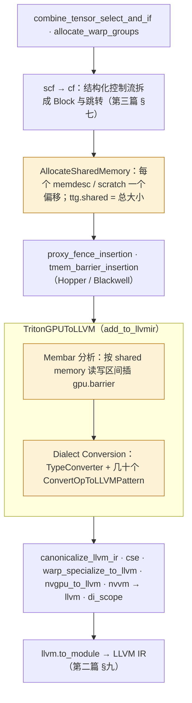
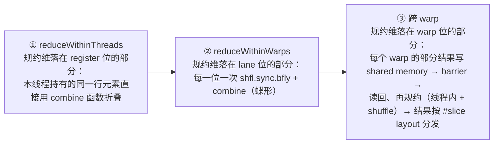

TTGIR 是一种"每个 op 作用在整个 tile 上"的 IR：`tt.load` 加载一个 `[128, 32]` 的张量，`tt.dot` 乘两个矩阵，`tt.reduce` 规约一整行。LLVM IR 是"每个线程执行标量 / 短向量指令"的 IR。中间这一步——**把 tile 级的 op 变成每个线程的指令序列**——是 Triton 编译器里代码量最大的部分（`lib/Conversion/TritonGPUToLLVM/` 与 `third_party/nvidia/lib/TritonNVIDIAGPUToLLVM/` 合计两万多行），也是前面所有 layout 决定最终"兑现"的地方：layout 说线程 t 的寄存器 r 持有 `T[i, j]`，这一步就要算出 `i`、`j` 是什么、`T[i, j]` 的地址是什么、该发哪条指令。

这一篇讲这次下降的机制：类型怎样变（一个张量变成一个 struct），Linear Layout 怎样在编译期展开成地址算术，几个关键 op（`load` / `store`、`reduce`、`dot`、`convert_layout`、`local_load`）各自变成什么，以及两个不属于任何 op 却决定正确性的分析：`AllocateSharedMemory` 给每个 shared memory 缓冲分偏移，`Membar` 决定在哪插 `bar.sync`。

总纲对这一篇提出的核心问题是：

> **TTGIR 里没有一处写 `bar.sync`，生成的 PTX 里却有十几个。每一个是哪个分析、根据什么信息插进去的？[^q0] 一个 `tt.reduce` 沿 axis=1 规约 `[128, 64]` 的张量，下降后哪一部分是寄存器内加法、哪一部分是 `shfl.sync`、哪一部分要经过 shared memory——这由什么决定？[^q1]**

## 一、总览

本文按 `make_llir` 的 pass 顺序展开：先是准备（`scf → cf`、`AllocateSharedMemory`），然后是主体 `TritonGPUToLLVM`——它的类型转换、公共机制（Linear Layout 的展开、PTX 拼装）、逐 op 的 pattern——其中 `Membar` 分析在主体开头运行；最后是几步收尾。产物是 LLVM 方言的 MLIR，交给第二篇讲过的 `translateModuleToLLVMIR` 与 `-O3`。



| 章 | 主题 | 内容 |
|---|---|---|
| 二 | 类型转换 | 张量 → `!llvm.struct<(T, T, …)>`；指针 → `!llvm.ptr<1>`；`memdesc` → `(ptr<3>, offsets…)`；函数签名多出来的两个参数 |
| 三 | 公共机制 | `emitIndices` / `applyLinearLayout`：基向量 → XOR 算术；`PTXBuilder`：拼内联汇编；`TargetInfo` |
| 四 | `load` / `store` | 向量宽度、谓词、`other`；`cp.async`；真实的 LLVM IR 与 PTX |
| 五 | `reduce` | 线程内 → warp 内 `shfl` → 跨 warp shared memory；rowsum 的实测 |
| 六 | `dot` 与 `local_load` | `mma.sync` 内联汇编与 fragment 的寄存器打包；`ldmatrix` 按 swizzle 算地址；`wgmma` 的描述符 |
| 七 | `convert_layout` | 三条路径的代码生成；shared memory 版本的 swizzle |
| 八 | AllocateSharedMemory | 活跃区间、干涉图、first-fit 着色；matmul 的 32 KB 怎么来 |
| 九 | Membar | RAW / WAR 区间相交；虚拟块上的不动点；为什么 `async_wait` 后面跟 barrier |
| 十 | 本文小结 | |
| 十一 | 自测 | 5 道题 |

源码：`lib/Conversion/TritonGPUToLLVM/`（`TypeConverter.cpp`、`Utility.cpp`、`ReduceOpToLLVM.cpp`、`ConvertLayoutOpToLLVM.cpp`、`MemoryOpToLLVM.cpp`、`AllocateSharedMemory.cpp`）、`third_party/nvidia/lib/TritonNVIDIAGPUToLLVM/`（`TritonGPUToLLVM.cpp`、`LoadStoreOpToLLVM.cpp`、`DotOpToLLVM/`、`PTXAsmFormat.cpp`、`TargetInfo.cpp`）、`lib/Analysis/{Allocation,Membar}.cpp`、`include/triton/Conversion/TritonGPUToLLVM/Utility.h`。实测 IR 来自三个 kernel：前几篇的 matmul（`sm_80`），以及一个向量加法 `add_kernel`（`BLOCK = 1024`）和一个行求和 `rowsum_kernel`（`N = 1024`），都是 `num_warps = 4`。

## 二、类型转换

### 1. 张量变成 struct

`TritonGPUToLLVMTypeConverter`（第四篇的 Dialect Conversion 框架，第二个实例）：

```cpp
addConversion([ctx](triton::PointerType type) { return LLVM::LLVMPointerType::get(ctx, 1); });      // !tt.ptr<T> → !llvm.ptr<1>（global）
addConversion([&](RankedTensorType type) { return convertTritonTensorType(type, targetInfo); });
addConversion([&](MemDescType type) { return convertMemDescType(type, targetInfo); });
addConversion([&](AsyncTokenType type) { return IntegerType::get(ctx, 32); });                      // token → i32（占位）

Type convertTritonTensorType(RankedTensorType type, ...) {
  unsigned numElementsPerThread = getTotalElemsPerThread(type);     // 由 layout 算出
  SmallVector<Type> types(numElementsPerThread, convertType(type.getElementType()));
  return LLVM::LLVMStructType::getLiteral(ctx, types);
}
```

**一个张量在 LLVM 层就是"本线程持有的那些元素"**——`tensor<128x32xbf16, #blocked>` 在 4 个 warp 上每线程 32 个元素，变成 `!llvm.struct<(bf16, bf16, …×32)>`；`tensor<128x128xf32, #mma>` 每线程 128 个，变成 128 元的 struct。struct 里元素的顺序就是 layout 的 `register` 维的顺序。整个 `[128, 32]` 张量在 IR 里不再作为整体存在——它只存在于 layout 的数学里。

指针张量同理：`tensor<128x32x!tt.ptr<bf16>, #blocked>` 变成 32 个 `!llvm.ptr<1>` 的 struct——每线程 32 个地址。第二篇提过 Triton 的 LLVM IR 里"大 struct 的 φ"问题，`BreakStructPhiNodesPass` 就是为它准备的。

### 2. `memdesc` 变成基址加偏移

```cpp
Type convertMemDescType(MemDescType type, ...) {
  auto ptrType = LLVM::LLVMPointerType::get(ctx, targetInfo.getAddressSpace(type.getMemorySpace()));   // shared → ptr<3>
  if (isa<TensorMemoryEncodingAttr>(type.getEncoding())) return ptrType;      // TMEM：只有地址
  SmallVector<Type> types = {ptrType};                                          // 基址
  for (int i = 0; i < rank; i++) types.push_back(IntegerType::get(ctx, 32));   // 每维一个偏移
  return LLVM::LLVMStructType::getLiteral(ctx, types);
}
```

`!ttg.memdesc<128x32xbf16, #shared, #smem>` → `!llvm.struct<(ptr<3>, i32, i32)>`：一个 shared memory 指针加两个维度偏移（`memdesc_subslice %a[0, 16]` 只改偏移不改基址）。layout（`#shared` 的 swizzle 参数）和 shape 都不在类型里了——它们在编译期被用掉，变成访问该缓冲的每条指令里的地址算术。

### 3. 函数签名

```llvm
define ptx_kernel void @matmul_kernel(ptr addrspace(1) %0, ptr addrspace(1) %1, ptr addrspace(1) %2, i32 %3, i32 %4, i32 %5, i32 %6, i32 %7, i32 %8,
                                      ptr addrspace(1) readnone captures(none) %9, ptr addrspace(1) readnone captures(none) %10) #0
attributes #0 = { nounwind "nvvm.reqntid"="128" }
@global_smem = external addrspace(3) global [0 x i8], align 16
```

9 个用户参数之后多了两个指针：**global scratch**（`tt.experimental_tensormap_create`、大规模 `scan` 等需要 global memory 暂存时用；本例 `readnone`——没用）和 **profile scratch**（Proton 插桩用）。`FuncOpToLLVM` 加上它们，运行时 launcher（下一篇）负责传。`"nvvm.reqntid" = "128"`：`num_warps × 32`，告诉 `ptxas` block 恰好 128 线程（第二篇 §五说的函数属性）。`@global_smem` 是**唯一**的 shared memory 符号，大小 0（"external"），实际大小在启动时以动态 shared memory 传入（`metadata["shared"]`）——所有缓冲都是它上面的偏移。

## 三、公共机制

### 1. `emitIndices`：把 layout 变成地址算术

每个 pattern 都要回答"本线程的第 r 个元素是张量的哪个下标"。`emitIndices(loc, rewriter, target, layout, type, withCTAOffset)` 返回一个 `[elemsPerThread × rank]` 的 `Value` 矩阵——每个元素每一维一个 SSA 值。实现是 `applyLinearLayout`：

```cpp
// 输入：layout 的 LL、以及 (register = 常量 r, lane = %tid & 31, warp = %tid >> 5, block = %ctaid)
// 输出：每个输出维一个 Value = 各输入位对应基向量的 XOR
SmallVector<std::pair<StringAttr, Value>> applyLinearLayout(loc, rewriter, const LinearLayout &layout, indices) {
  for (auto [inDim, inVal] : indices)                       // 对每个输入维
    for (int i = 0; i < layout.getInDimSizeLog2(inDim); i++) {   // 对该维的每一位
      Value bit = (inVal >> i) & 1;                               // 取出这一位
      for (auto outDim : outDims)
        out[outDim] ^= select(bit, constant(bases[inDim][i][outDim]), 0);   // 该位为 1 则 XOR 上基向量
    }
}
```

第七篇 §四.2 的数学直接变成了代码：**输出下标 = 各置位的基向量的 XOR**。`register` 维的值是编译期常量（第 r 个元素），所以那部分在编译期折叠；`lane` 与 `warp` 来自 `%tid.x`（`nvvm.read.ptx.sreg.tid.x`，每个 kernel 开头那两次读取），是运行时值——它们的位提取与 XOR 就是 LLVM IR 开头那串 `lshr / and / xor`：

```llvm
%15 = tail call i32 @llvm.nvvm.read.ptx.sreg.tid.x()
%16 = lshr i32 %15, 2
%17 = and i32 %16, 31
%18 = and i32 %15, 112
```

有两个优化让它不至于每个元素都算一遍：基向量是 2 的幂时 XOR 退化成加法 / 位拼接（`LinearLayout` 的 `getNumConsecutiveInOut` 告诉 pattern 连续的 `register` 位对应连续的下标，可以用一个基址加常量偏移）；`getFreeVariableMasks` 找出不影响输出的输入位（复制的元素），只算一份（`LoadOpConversion` 里 "For redundant registers, refer back to the canonical load"）。

### 2. `PTXBuilder`：拼内联汇编

第二篇说 Triton 的 GPU 指令几乎全是内联 PTX。`PTXAsmFormat.cpp` 提供一个小型 builder：

```cpp
PTXBuilder ptxBuilder;
auto *dstsOpr = ptxBuilder.newListOperand();                          // { $0, $1, $2, $3 }
for (...) dstsOpr->listAppend(ptxBuilder.newOperand("=r", init));      // 输出约束 =r
auto *addrOpr = ptxBuilder.newAddrOperand(ptr, "l", in_off);           // [ $4 + 0 ]，64 位地址约束 l
auto &ld = ptxBuilder.create("ld")->o("volatile", isVolatile).global().o("ca", cache == CA)...v(nWords).b(width);   // ld.global.v4.b32
ld(dstsOpr, addrOpr).maybePredicate(pred, "b");                       // @$5 ld.global.v4.b32 { $0, $1, $2, $3 }, [ $4 + 0 ];
Value ret = ptxBuilder.launch(rewriter, loc, retTy);                  // → llvm.inline_asm，约束串 "=r,=r,=r,=r,l,b"
```

它管理 `$N` 编号、约束串（`r` 32 位寄存器、`l` 64 位、`f` f32、`b` 谓词、`=` 输出、`0` 与第 0 个操作数绑定）和多条指令的拼接（`\n\t`）。生成的是 `llvm.inline_asm`，LLVM 层原样传给 PTX（第二篇 §五.6）。

### 3. `TargetInfo`

通用 pattern（`lib/Conversion/TritonGPUToLLVM/`）通过 `TargetInfoBase` 接口访问目标特有的东西：`shuffleXor / shuffleUp / shuffleIdx`（NVIDIA 发 `shfl.sync`，AMD 发 `ds_bpermute`）、`barrier()`、`loadShared / storeShared`（带谓词的 shared memory 访问）、`getAddressSpace`、`programId`、`printf` 的实现、warp 内规约的加速指令（NVIDIA 的 `redux.sync`）。`ReduceOpToLLVM`、`ConvertLayoutOpToLLVM`、`MemoryOpToLLVM` 是两个后端共用的，`LoadStoreOpToLLVM`、`DotOpToLLVM` 各自一份——因为访存指令与 MMA 指令差别太大。

## 四、`load` / `store`

### 1. 决定

`LoadOpConversion::matchAndRewrite`（`third_party/nvidia/.../LoadStoreOpToLLVM.cpp`）：

```cpp
unsigned vec = getVectorSize(ptr);                          // ① = min(128 / 元素位宽, AxisInfo 的 contiguity 与 alignment)
if (mask) vec = std::min(vec, getMaskAlignment(mask));      // ② mask 的 constancy 也限制
auto freeVarMasks = getFreeVariableMasks(ptr.getType());    // ③ 复制的元素不重复 load
for (size_t vecStart = 0; vecStart < numElems; vecStart += vec) {   // ④ 每 vec 个元素一条指令
  const size_t width = std::min(valueElemNBits * vec, 32 或更宽);   //    每个 PTX 操作数 32 位（或 64）
  const size_t nWords = totalWidth / width;                          //    v1 / v2 / v4
  PTXBuilder ptxBuilder;
  ... if (other) mov.u32 $dst, <other>  (每个目标寄存器先放默认值)    // ⑤ other：谓词为假时的值
  auto &ld = ptxBuilder.create("ld")->global().o("ca"/"cg"/...).o("L1::evict_first", ...).v(nWords).b(width);
  ld(dstsOpr, addrOpr).maybePredicate(pred, "b");                    // ⑥ @p ld.global.v4.b32
  ...
}
```

① 是第六篇 AxisInfo 的最终消费点：`getVectorSize = min(128 / pointeeBitWidth, contiguity)`，f32 最多 4、bf16 最多 8。② mask 的 constancy 决定一个谓词能覆盖几个元素——若 mask 每个元素可能不同（constancy 1），即使地址连续也只能标量 load。③ ④ 每线程的元素按 `vec` 分组，一组一条指令。⑤ `tl.load(..., other=0)` 的实现：先 `mov` 默认值进目标寄存器，再发**带谓词**的 load——谓词为假时 load 不执行，寄存器里留着默认值。⑥ 谓词、缓存修饰符（`.ca` / `.cg`、`L1::evict_last`）都是 PTX 指令的一部分。

`StoreOpConversion` 对称：`@p st.global.v4.b32 [addr], {…}`；atomic 走 `AtomicPTXBuilder`。

### 2. 实测：`add_kernel`

```python
offs = pid * 1024 + tl.arange(0, 1024); mask = offs < n
x = tl.load(x_ptr + offs, mask=mask)
```

TTGIR：`#blocked<{sizePerThread = [4], threadsPerWarp = [32], warpsPerCTA = [4], order = [0]}>`（Coalesce：f32 的 128 bit = 4 个），1024 / 128 = 8 元素每线程 → 两组。LLVM IR：

```llvm
%20 = tail call { i32, i32, i32, i32 } asm sideeffect
  "mov.u32 $0, 0x0;\0A\09mov.u32 $1, 0x0;\0A\09mov.u32 $2, 0x0;\0A\09mov.u32 $3, 0x0;\0A\09@$5 ld.global.v4.b32 { $0, $1, $2, $3 }, [ $4 + 0 ];",
  "=r,=r,=r,=r,l,b"(ptr addrspace(1) %17, i1 %14)
%29 = ... 同样一条，地址 %19、谓词 %15 ...
```

四条 `mov.u32 $N, 0x0`——没写 `other` 时默认 0（mask 掉的元素读到 0）；`@$5 ld.global.v4.b32`——一条 128 bit 的谓词 load；两个谓词 `%14`、`%15` 对应 mask 的 constancy 4（每 4 个元素一个谓词值，两组各一个）。PTX：

```text
	.reg .pred 	%p<3>;
	setp.lt.s32 	%p1, %r31, %r27;                       // offs[0..3] < n
	setp.lt.s32 	%p2, %r32, %r27;                       // offs[4..7] < n
	@%p1 ld.global.v4.b32 { %r1, %r2, %r3, %r4 }, [ %rd1 + 0 ];
	@%p2 ld.global.v4.b32 { %r5, %r6, %r7, %r8 }, [ %rd2 + 0 ];
	...
	@%p1 st.global.v4.b32 [ %rd5 + 0 ], { %r17, %r18, %r19, %r20 };
	@%p2 st.global.v4.b32 [ %rd6 + 0 ], { %r21, %r22, %r23, %r24 };
```

每线程 2 条 load × 2 个输入 + 2 条 store，全部 128 bit、全部带谓词。如果调用时 `n` 不是 16 的倍数（`tt.divisibility` 缺失），mask 的 constancy 变成 1，这里就是 8 条 `@%pN ld.global.b32`——**同一段 Python，两种 PTX，差别只在 AxisInfo**。

### 3. 流水化之后：`cp.async`

matmul 的 LLVM IR 里**没有一条 `ld.global`**——`tt.load` 在第九篇被 `async_copy_global_to_local` 取代，它的 lowering 是：

```llvm
tail call void asm sideeffect "cp.async.cg.shared.global [ $0 + 0 ], [ $1 + 0 ], 0x10, $2;", "r,l,r"(ptr addrspace(3) %74, ptr addrspace(1) %46, i32 %75)
```

`cp.async.cg.shared.global [smem], [gmem], 16, src_size`：global 直接到 shared，绕过寄存器，16 字节（`contiguity = 8` 个 bf16）；`$2`（`src_size`）是 mask 的实现——谓词为假时 `src_size = 0`，硬件写 16 字节的 0 而不读 global。共 24 条（prologue 2 × (A 4 + B 4) + 循环体 8）。`async_commit_group` / `async_wait` 变成 `llvm.nvvm.cp.async.commit.group` / `cp.async.wait.group` intrinsic。shared memory 地址是 `@global_smem + 缓冲偏移 + 按 #shared swizzle 算出的元素偏移`——swizzle 在写入时就做了，读的一侧（`ldmatrix`）用同一套公式反算。

## 五、`reduce`

### 1. 三级

`ReduceOpToLLVM.cpp` 把 `tt.reduce` 分成三步，每一步的"要不要做、做多少"都从**输入 layout 的 Linear Layout** 读出：



`ReduceOpHelper` 从 LL 算出：`getIntraWarpSizeWithUniqueData`（lane 位里有几位管规约维）、`getInterWarpSizeWithUniqueData`（warp 位里有几位）、需要的 scratch 大小（跨 warp 部分结果的数量 × 元素大小）。回答核心问题第二问：**三级各自的规模由规约维在 layout 里落在哪些输入位决定**——第七篇 §四.3 的基向量表直接给出答案。

### 2. 实测：`rowsum_kernel`

```python
x = tl.load(x_ptr + row * stride + tl.arange(0, 1024)); s = tl.sum(x, axis=0)
```

`#blocked<{sizePerThread = [4], threadsPerWarp = [32], warpsPerCTA = [4], order = [0]}>`，1024 个元素：`register` 3 位（8 个元素：4 连续 × 2 趟）、`lane` 5 位、`warp` 2 位，全部管规约维。LLVM IR 统计：

| 级 | 生成的指令 | 数量 |
|---|---|---|
| ① 线程内 | `fadd float` | 7（8 个元素折成 1） |
| ② warp 内 | `llvm.nvvm.shfl.sync.bfly.i32` + `fadd` | 5 次 shuffle（偏移 16、8、4、2、1）+ 5 次加 |
| ③ 跨 warp | `st.shared::cta.b32`（每 warp 的 lane 0 写 1 个值）→ `nvvm.barrier` → 读 4 个值 → 3 次 shuffle + 2 次加 → 广播 | scratch 16 字节（`metadata["shared"] = 16`）、2 个 barrier |

```llvm
%42 = tail call i32 @llvm.nvvm.shfl.sync.bfly.i32(i32 -1, i32 %41, i32 16, i32 31)   ; 全 warp 参与（mask -1），与 lane ^ 16 交换
%46 = tail call i32 @llvm.nvvm.shfl.sync.bfly.i32(i32 -1, i32 %45, i32 8, i32 31)
```

`shfl.sync.bfly` 的偏移就是 lane 位的基向量：lane 位 4（值 16）、3（8）、…、0（1）各一次——**蝶形规约的每一步对应 LL 里 lane 维的一位**。如果换成第七篇的 `#mma` layout 沿 dim 1 规约（自测第 2 题），寄存器位 3 个、lane 位 2 个、warp 位 1 个，就是 7 次加、2 次 shuffle、1 次 shared memory 交换。

第八篇的 `OptimizeThreadLocality` 就是用 reshape 把更多规约维挪进 `register` 位——让第 ① 级多做、②③ 少做。

## 六、`dot` 与 `local_load`

### 1. `mma.sync`

`DotOpToLLVM/MMAv2.cpp`（Ampere）：`tt.dot` 的 A、B 已经是 `#dot_op` layout、C 是 `#mma`。每个 warp 要发 `(M/16) × (N/8) × (K/16)` 条 `mma.m16n8k16`，每条的操作数是 fragment 在本线程的那几个寄存器：

```llvm
%562 = tail call { float, float, float, float } asm sideeffect
  "mma.sync.aligned.m16n8k16.row.col.f32.bf16.bf16.f32 { $0, $1, $2, $3 }, { $8, $9, $10, $11 }, { $12, $13 }, { $4, $5, $6, $7 };",
  "=f,=f,=f,=f,0,1,2,3,r,r,r,r,r,r"(float %284, float %285, float %286, float %287, i32 %468, i32 %471, i32 %474, i32 %477, i32 %516, i32 %519)
```

约束串读法：`=f,=f,=f,=f` 四个 f32 输出（D 的 c0..c3）；`0,1,2,3` 四个输入**绑定到输出 0..3 的同一寄存器**（累加器 C 就地累加）；`r,r,r,r` A 的四个 32 位寄存器（每个装两个 bf16——`kWidth = 2` 的打包）；`r,r` B 的两个。`[128, 128] × [128, 32]`、`warpsPerCTA = [2, 2]`：每 warp `[64, 64]`，K = 32 → 4 × 8 × 2 = 64 条——LLVM IR 里正好 64 条 `mma.sync`。**`DotOpToLLVM` 只是按 fragment 索引把 struct 里的元素挑出来、两两打包进 i32、按 (m, n, k) 三重循环发指令**——所有"哪个元素归哪个寄存器"的信息来自 `#dot_op` 与 `#mma` 的 LL。

### 2. `ldmatrix`

`local_load`（shared memory → `#dot_op` 寄存器）的 lowering 在 `MemoryOpToLLVM.cpp` 的 `lowerLdStMatrix`：当目标 layout 是 `#dot_op`、元素 16 位、shared layout 满足条件时，用 `ldmatrix.sync.aligned.m8n8.x4.b16`——一条指令让 32 个 lane 各提供一个 8 元素行的地址，硬件按 `mma` 的 fragment 布局把 4 个 8×8 矩阵分发进各 lane 的 4 个寄存器。matmul 的 LLVM IR 里 `@llvm.nvvm.ldmatrix.sync.aligned.m8n8.x4.b16.p3` 13 次、`.trans` 版本 13 次——B 是 `[K, N]` 行优先存的，`mma` 要它列优先，`.trans` 让硬件在分发时转置，**第八篇 `OptimizeDotOperands` 说的"转置折进 `ldmatrix.trans`"就是这里**。

每个 lane 提供的地址由两个 LL 复合得到：`#dot_op` 的 LL 说"我这个 lane 的这个寄存器要 `T[i, j]`"，`#swizzled_shared` 的 LL 说"`T[i, j]` 在缓冲的第几个字节"——`compose` 之后按 §三.1 展开成算术，XOR swizzle 变成几条 `xor` 指令。这就是第七篇 §七.1 说的"swizzle 参数按 `ldmatrix` 的读取模式算出"的兑现：读的一侧与写的一侧（`cp.async` 的目标地址）用同一个 LL，所以数据能对上。

### 3. `wgmma` 与 `tcgen05`

Hopper 的 `ttng.warp_group_dot` 在 `DotOpToLLVM/WGMMA.cpp`：操作数是 `memdesc`，lowering 算一个 64 位**矩阵描述符**（`#nvmma_shared` 的基址 >> 4、leading byte offset、stride byte offset、swizzle 模式的编码）塞进 `wgmma.mma_async.sync.aligned.m64n128k16.f32.bf16.bf16` 的操作数；累加器是 64 个 f32 寄存器（`m64n128` 每线程 64 个）。`warp_group_dot_wait` → `wgmma.wait_group.sync.aligned N`。Blackwell 的 `tc_gen5_mma` 在 `third_party/nvidia/lib/TritonNVIDIAGPUToLLVM/DotOpToLLVM/MMAv5.cpp`：`tcgen05.mma.cta_group::1.kind::f16 [tmem_addr], a_desc, b_desc, idesc, …`，由 `elect.sync` 选出的一个线程发出。

## 七、`convert_layout`

`ConvertLayoutOpToLLVM.cpp` 按第七篇 §四.6 的判定分三条路：

| 判定 | 生成什么 |
|---|---|
| `cvtReordersRegisters` | 纯 SSA 重排：新 struct 的第 r 个元素 = 旧 struct 的第 σ(r) 个，零指令（`llvm.extractvalue` / `insertvalue` 被 LLVM 折掉） |
| `cvtNeedsWarpShuffle` | `transferWithinWarp`：把 `dst⁻¹ ∘ src` 在 lane 维的部分分解成若干轮 `shfl.sync.idx`（每轮每个 lane 发一个值、收一个值）加寄存器 `select`；`getWarpLayoutConvertDecomposition` 算最少几轮 |
| 否则 | `transferWithinBlock`：算一个中间 shared memory 布局（`chooseShemLayoutForRegToRegConversion`——**在 LL 上搜索一个让写和读都无 bank conflict 的 swizzle**）；每线程 `st.shared` 自己的元素 → barrier → 按目标 layout `ld.shared` → 若 scratch 不够大则分多轮，每轮之间再 barrier |

第八篇 §五.3 的实验里 `#mma → #blocked` 生成 8 条 `st.shared::cta.v4.b32` 与 3 个 barrier（一轮 + 前后同步），`#mma → #dot_op` 零指令，就是这三条路里的第三与第一。epilogue 那一次转换的 32 KB scratch 就是第三条路的中间缓冲。

## 八、AllocateSharedMemory

### 1. 问题

TTGIR 里 shared memory 的使用者有两类：**显式**的 `ttg.local_alloc`（流水线缓冲、mbarrier）和**隐式**的 scratch（`convert_layout` 的中间缓冲、跨 warp `reduce` 的部分结果、`atomic` 的广播、`scan`、`histogram`……——每种 op 通过 `getScratchValueSize` 报告自己要多少）。它们的总和可能远超 SM 的 shared memory（A100 每 block 最多 163 KB，但用得多 occupancy 就低），而**它们的生命期不重叠**：流水线缓冲在循环里活，epilogue 的 `convert_layout` scratch 在循环之后活。`AllocateSharedMemory` 做的是**寄存器分配的 shared memory 版本**：算活跃区间，不重叠的复用同一段地址。

### 2. 算法

`lib/Analysis/Allocation.cpp`：

```cpp
void run() {
  getValuesAndSizes();     // ① 收集：每个 local_alloc 的字节数与对齐；每个需要 scratch 的 op 的字节数
  resolveLiveness();       // ② 活跃区间：用 MLIR 的 Liveness 分析算每个缓冲从第几条 op 活到第几条（op 按程序顺序编号）
  computeOffsets();        // ③ 分配
}
void allocate(buffers, interference) {
  // First-fit graph coloring
  for (auto x : buffers) {                                   // 干涉图：活跃区间相交的两个缓冲之间有边
    available = 全 true;
    for (auto y : interference.lookup(x)) if (colors[y] >= 0) available[colors[y]] = false;
    colors[x] = 第一个 available 的颜色;                      // 贪心着色
  }
  // 同色的缓冲不干涉，可以共用地址；offset = 该颜色之前所有颜色的最大尺寸之和 + 对齐
}
```

有 `LLVM_DEBUG` 注释坦白说 "We are wasting memory here"——颜色 c 的起点取前面所有颜色的**最大**尺寸之和，而不是精确的区间装箱。结果写成属性：`local_alloc` 与需要 scratch 的 op 得到 `allocation.offset = N`，模块得到 `ttg.shared = 总字节数`——就是 `metadata["shared"]`，运行时用它设动态 shared memory 大小。

matmul 的 `ttg.shared = 32768`：流水线的两个缓冲 `2 × 128 × 32 × 2 + 2 × 32 × 128 × 2 = 32768` 字节在循环内活跃；epilogue 的 `convert_layout` scratch `128 × 128 × 2 = 32768` 字节在循环后活跃；两者不干涉、同色、`offset = 0`——**总量是 32 KB 而不是 64 KB**。第八篇 §五.1 说的"复用同一段地址"就是这里。`rowsum` 的 16 字节是跨 warp 规约的 4 个 f32 部分结果。

### 3. 谁在读这些偏移

`TritonGPUToLLVM` 的每个 pattern 通过 `getSharedMemoryBase(loc, rewriter, targetInfo, op)` 拿 `@global_smem + allocation.offset`，之后的地址算术全在这个基址上。Blackwell 的 Tensor Memory 有一个平行的 `AllocateTensorMemory`（列而不是字节，`metadata["tmem_size"]`）。

## 九、Membar

### 1. 问题

回答核心问题第一问。shared memory 是 block 内所有线程共享的，一个线程写、另一个线程读，中间必须有 `bar.sync`（所有线程到齐、之前的写对所有人可见）。TTGIR 从不写 barrier——`convert_layout`、`reduce`、`local_load`、`async_wait` 各自只说"我读 / 写这段 shared memory"。`Membar` 分析（`lib/Analysis/Membar.cpp`，在 `TritonGPUToLLVM` pass 开头运行，用 `AllocateSharedMemory` 的结果）在 op 之间插 `gpu.barrier`（lowering 成 `bar.sync 0` / `llvm.nvvm.barrier.cta.sync.aligned.all`）。

### 2. 算法

```cpp
struct BlockInfo {
  SliceMapT syncReadSlices;    // 自上一个 barrier 以来，读过哪些 [offset, offset + size) 区间（含子切片信息）
  SliceMapT syncWriteSlices;   // 写过哪些
  bool isIntersected(const BlockInfo &other) {
    return /*RAW*/ isIntersected(syncWriteSlices, other.syncReadSlices) ||     // 之前写过、现在要读
           /*WAR*/ isIntersected(syncReadSlices, other.syncWriteSlices) ||     // 之前读过、现在要写（覆盖别人还没读完的）
           /*WAW*/ isIntersected(syncWriteSlices, other.syncWriteSlices);
  }
};
void MembarAnalysis::update(Operation *op, BlockInfo *blockInfo, ...) {
  if (containsLocalBarrier(op)) { blockInfo->sync(); }                        // ① 遇到已有 barrier：清空记录
  if (op->hasTrait<MemWaitOpTrait>() && !hasSyncPointBeforeMemoryEffect(op)) { // ② async_wait / wait_barrier：之后插 barrier
    insertBarrier(op, builder); blockInfo->sync(); return;
  }
  BlockInfo curBlockInfo = 本 op 的读写区间;                                     // ③ 从 MemoryEffectsOpInterface 拿它读 / 写哪个 memdesc，
                                                                               //    查 allocation 得到 [offset, size)；scratch op 同时算读和写
  if (blockInfo->isIntersected(curBlockInfo)) {                                // ④ 与之前未同步的访问相交
    builder->setInsertionPoint(op); insertBarrier(op, builder); blockInfo->sync();   //    → 本 op 之前插 barrier
  }
  blockInfo->join(curBlockInfo);                                               // ⑤ 记下本 op 的访问
}
```

沿程序顺序扫描，维护"自上一个 barrier 以来读写过的区间"，新 op 的访问与之相交（RAW、WAR 或 WAW）就在它前面插一个 barrier。区间用的正是 `AllocateSharedMemory` 的偏移——**两个缓冲同色（同地址）但不同时活跃**时，`Membar` 仍会看到"先写 A 后读 B、地址相交"而插 barrier，这是复用地址的正确性保证。`memdesc_subslice` 的信息让分析知道两个访问是同一缓冲的不同子块（不相交，不插）。

控制流：分析在**虚拟块**上跑不动点——`scf.for` 的循环体末尾的状态要流回开头（上一轮末尾写的、这一轮开头读，中间要 barrier），`scf.if` 的两个分支合并取并集。`RegionBranchOpInterface` 提供后继关系（第三篇 §六）。

### 3. matmul 的 10 个 barrier

`@llvm.nvvm.barrier.cta.sync.aligned.all` 在 matmul 的 LLVM IR 里出现 10 次。来源分类：

| 位置 | 个数 | 触发规则 |
|---|---|---|
| 每个 `async_wait` 之后 | prologue 1 + 循环体 2 + 收尾 1 | ② `MemWaitOpTrait`：`cp.async.wait.group` 只保证**本线程**发出的拷贝完成，其他线程写进同一缓冲的数据要 barrier 才可见；`ldmatrix` 读的是整个 tile |
| 循环体里 `async_copy` 覆盖缓冲之前 | 若干 | ④ WAR：上一轮 `ldmatrix` 读过这段区间（记录里有读），本轮 `cp.async` 要写同一区间——所有线程读完才能覆盖 |
| epilogue `convert_layout` 内部 | 2–3 | scratch op 同时是写和读：写之前与流水线缓冲（同地址！）的最后一次读 WAR，写与读之间 RAW，多轮之间 |
| `local_dealloc` 附近 | — | 释放不插 barrier，但释放后地址被复用的写会与之前的读 WAR |

这些 barrier **一个都不在 TTGIR 里**，全部由区间相交推出。`Membar` 不知道 `cp.async` 或 `ldmatrix` 是什么，它只看 `MemoryEffectsOpInterface` 报告的读写区间——第三篇讲的接口再一次让分析与 op 解耦。代价是保守：两个不同 warp 各自读写自己那一片的情况它也会插（它不做 warp 级的所有权分析），Triton 有一个 `canSkipBarSync` 回调（`TritonGPUToLLVM.cpp` 传给 `ModuleMembarAnalysis`）处理少数已知安全的模式，warp specialization 的分区之间则改用 mbarrier 而不是 `bar.sync`。

## 十、本文小结

1. 类型转换：张量 → 每线程持有元素的 `!llvm.struct`（元素数由 layout 算出），指针 → `!llvm.ptr<1>`，`memdesc` → `(ptr<3>, 每维偏移)`；layout 与 shape 在此消失，只剩地址算术。函数多两个 scratch 指针，`nvvm.reqntid = num_warps × 32`，唯一的 `@global_smem` 符号。
2. `emitIndices` / `applyLinearLayout` 把 LL 展开：输出下标 = 各置位输入位的基向量 XOR，`register` 位编译期折叠、`lane` / `warp` 位来自 `%tid.x`；复制的元素只算一份。`PTXBuilder` 拼内联 PTX 与约束串。`TargetInfo` 隔离 NVIDIA / AMD 差异。
3. `load`：`vec = min(128 / 位宽, contiguity, mask constancy)`，每 `vec` 个元素一条 `@p ld.global.vN.b32`，`other` 用先 `mov` 再谓词 load 实现；流水化后 load 变成 `cp.async.cg.shared.global … 16, src_size`，绕过寄存器。
4. `reduce` 三级：`register` 位 → 线程内加法，`lane` 位 → 每位一次 `shfl.sync.bfly`，`warp` 位 → shared memory 交换 + barrier；规模全由规约维落在 LL 的哪些位决定。rowsum：7 加 + 5 shuffle + 16 字节 scratch。
5. `dot`：按 fragment 索引从 struct 挑元素、打包成 i32、发 `mma.sync` 内联汇编（约束 `0,1,2,3` 让累加器就地）；`local_load` 到 `#dot_op` 用 `ldmatrix`（`.trans` 折转置），地址由 `#dot_op` 与 `#shared` 的 LL 复合算出；`wgmma` 用 64 位矩阵描述符，`tcgen05` 单线程发出。
6. `convert_layout` 三条路：寄存器重排零指令；warp 内若干轮 `shfl.idx`；否则经 shared memory，中间布局由 LL 搜索得到无 bank conflict 的 swizzle，多轮之间 barrier。
7. `AllocateSharedMemory`：收集显式缓冲与 op 的 scratch，Liveness 算活跃区间，干涉图 first-fit 着色，同色复用地址；`allocation.offset` 与 `ttg.shared`。matmul 的流水线缓冲与 epilogue scratch 各 32 KB、不重叠、总量 32 KB。
8. `Membar`：沿程序顺序（虚拟块上的不动点）维护自上一个 barrier 以来的读写区间，新访问与之 RAW / WAR / WAW 相交就在前面插 `gpu.barrier`；`MemWaitOpTrait` 的 op 后必插。matmul 的 10 个 barrier 全部由此推出。

## 十一、自测

1. `tl.load(ptr + offs, mask=offs < n, other=-1.0)`，f32，AxisInfo 给 contiguity 8、alignment 8、mask constancy 8，`num_warps = 4`，`BLOCK = 1024`。每线程几条 `ld.global`？什么形状？`other` 怎么实现？

   <details markdown="1"><summary>答案</summary>
   `vec = min(128 / 32 = 4, 8, 8) = 4`——f32 的 128 bit 上限是 4 个。每线程 8 个元素 → 2 条 `@p ld.global.v4.b32`。`other = -1.0`：每条 load 前 4 条 `mov.u32 $N, 0xbf800000`（−1.0 的位模式），谓词为假时寄存器保留这个值；若 `other` 是非常量张量则 `mov` 的源是寄存器（约束 `r`）。
   </details>

2. 把 rowsum 的 layout 改成 `#blocked<{sizePerThread = [32], threadsPerWarp = [32], warpsPerCTA = [1], order = [0]}>`、`num_warps = 1`。三级各做多少？shared memory 多少？

   <details markdown="1"><summary>答案</summary>
   1024 个元素、32 线程、每线程 32 个（`register` 5 位）、`lane` 5 位、`warp` 0 位。① 线程内 31 次加；② 5 次 `shfl.bfly`（16、8、4、2、1）+ 5 次加；③ 没有 warp 位——不需要 shared memory，`ttg.shared = 0`，0 个 barrier。代价是只有 1 个 warp、并行度低；`OptimizeThreadLocality` 走的是类似方向但保留多 warp：用 3D layout 让每个 warp 内先归约、循环外再跨 warp 一次。
   </details>

3. `Membar` 对下面的序列插几个 barrier、在哪？`A` 与 `B` 是两个 `local_alloc`，分配到**不同**偏移。

   ```text
   local_store %x, %A
   local_store %y, %B
   %p = local_load %A
   local_store %z, %A
   %q = local_load %B
   ```

   <details markdown="1"><summary>答案</summary>
   扫描：store A（记写 A）；store B（记写 B）；load A——与记录里的写 A 相交（RAW）→ **在 load A 之前插 barrier #1**，清空记录，记读 A；store A——与读 A 相交（WAR）→ **在 store A 之前插 barrier #2**，清空，记写 A；load B——记录里只有写 A，A、B 偏移不同、不相交 → 不插。共 2 个。若 A、B 被分配到同一偏移（生命期不重叠时才会），则 load B 与写 A 相交，会多插一个——这就是复用地址的正确性保证。
   </details>

4. 为什么 `cp.async.wait.group` 之后还需要 `bar.sync`？TMA 的 `wait_barrier`（mbarrier）之后呢？

   <details markdown="1"><summary>答案</summary>
   `cp.async.wait.group N` 只保证**执行它的线程**自己发出的 `cp.async` 组完成——128 个线程各自搬了 16 字节，每个线程只知道自己那份到了；接下来的 `ldmatrix` 要读整个 tile（别的线程搬的部分），所以需要 `bar.sync` 让所有线程的等待都完成且写入对所有人可见。`Membar` 用 `MemWaitOpTrait` 规则统一处理。mbarrier 不同：TMA 是**一个**引擎搬整个 tile，完成时按事务字节数到达 mbarrier；`wait_barrier` 是每个线程都执行的自旋等待，phase 翻转对所有线程同时可见，且 mbarrier 到达带有 release 语义、等待带 acquire——不需要额外的 `bar.sync`。`Membar` 对 `wait_barrier` 同样按 `MemWaitOpTrait` 处理，但 `hasSyncPointBeforeMemoryEffect` 与 `canSkipBarSync` 会省掉冗余的。
   </details>

5. `convert_layout` 走 shared memory 时，中间布局为什么要"搜索"，直接用行优先放不行吗？

   <details markdown="1"><summary>答案</summary>
   行优先的中间布局在写或读的一侧几乎必然有 bank conflict：源 layout 下同一时刻 32 个 lane 写的元素若落在同一列（如 `#mma` 的 lane 高 3 位管行），行优先存放让它们的地址相差整行、落在同一个 bank，写被串行化 8 倍；目标 layout 的读同理。`chooseShemLayoutForRegToRegConversion` 在 LL 上求一个 swizzle（本质是在 GF(2) 上找一个线性变换，使源的 lane 位与目标的 lane 位映到的 bank 位都是满秩的），让写和读两侧 32 个 lane 各落在 32 个不同 bank——第七篇 §四.7 说的"LL 可以被程序搜索、CuTe 靠人选"的具体例子。
   </details>

## 下一篇

LLVM 方言的 MLIR 经 `translateModuleToLLVMIR` 变成 LLVM IR、过 `-O3`、由 NVPTX 后端变成 PTX、由 `ptxas` 变成 cubin——第二篇已讲过这三步的机制。下一篇讲剩下的部分：Triton 编译流水线在 Python 侧的**组织**——`compile()` 的阶段循环、缓存 key 的每一个成分、`.json` 元数据里每个字段的来源与用途、生成的 C launcher 怎样把 Python 参数变成 `cuLaunchKernel`、`CompiledKernel` 的加载与 `n_regs / n_spills`；`TRITON_KERNEL_OVERRIDE` 与 `TRITON_KERNEL_DUMP`；然后把 AMD 后端（`third_party/amd`）的流水线并排放在旁边：同一个 TTIR、不同的 layout（`#mfma`）、不同的 pass 列表、`llc` 直出 ISA 与 `hsaco`。

[^q0]: 全部由 **`Membar` 分析**（`lib/Analysis/Membar.cpp`，在 `TritonGPUToLLVM` pass 开头运行）插入，依据两样信息：`AllocateSharedMemory` 给每个缓冲 / scratch 的 `[offset, offset + size)` 区间，和每个 op 通过 `MemoryEffectsOpInterface` 报告的对 shared memory 的读 / 写。算法沿程序顺序（虚拟块上的不动点，`scf.for` 末尾状态流回开头）维护"自上一个 barrier 以来读过、写过哪些区间"，新 op 的访问与之 RAW（先写后读）、WAR（先读后写）或 WAW 相交就在它之前插 `gpu.barrier`（→ `bar.sync 0`）；带 `MemWaitOpTrait` 的 op（`async_wait`、`wait_barrier`）之后必插——因为 `cp.async.wait.group` 只保证本线程自己的拷贝完成，其他线程搬的部分要 barrier 才可见。matmul 的 10 个：每个 `async_wait` 后一个（prologue、循环体两处、收尾），循环体里 `cp.async` 覆盖上一轮 `ldmatrix` 读过的缓冲之前（WAR），epilogue `convert_layout` 的 scratch 与流水线缓冲**同地址**（`AllocateSharedMemory` 复用）故写前 WAR、写读之间 RAW。详见[第八章](#八allocatesharedmemory)与[第九章](#九membar)。

[^q1]: 由**规约维在输入 layout 的 Linear Layout 里落在哪些输入位**决定，`ReduceOpToLLVM` 分三级：落在 `register` 位的部分 → `reduceWithinThreads`，本线程持有的同一行元素直接用 combine 函数折叠（纯寄存器加法）；落在 `lane` 位的部分 → `reduceWithinWarps`，每一位一次 `shfl.sync.bfly`（偏移就是该位的值：16、8、4、2、1）加一次 combine；落在 `warp` 位的部分 → 每个 warp 的部分结果写 shared memory、barrier、读回再规约，scratch 大小 = 部分结果数 × 元素大小。`[128, 64]` 沿 axis = 1：若是默认 `#blocked`（lane 5 位与 warp 1 位管列、寄存器管行）则线程内 0 次、shuffle 5 次、跨 warp 一次；若是 `#mma<{[2, 2]}>`（列由寄存器 3 位、lane 2 位、warp 1 位管）则 7 次加、2 次 shuffle、一次 shared memory 交换。实测 rowsum（1024 元素、`#blocked<{[4], [32], [4]}>`）：7 次 `fadd`、5 次 `shfl.sync.bfly`、16 字节 scratch、2 个 barrier。`OptimizeThreadLocality` 的目的就是把规约维挪进 `register` 位。详见[第五章](#五reduce)。
