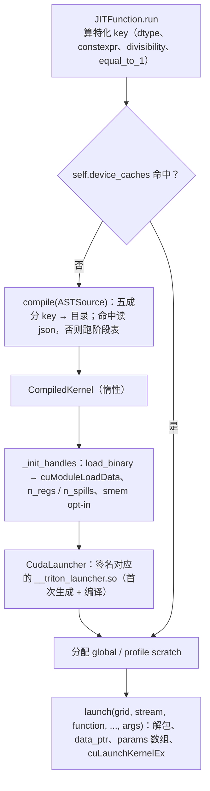

前六篇顺着 IR 往下走，讲的是每一站**做什么**。这一篇退一步，讲这些站是**怎样被组织起来**的：`compile()` 怎样按后端声明的阶段表逐级调用、每一级的产物存到哪、下一次调用为什么能跳过整条流水线；缓存目录名里那串 base32 是什么的哈希，改一个 pass 之后旧缓存为什么还会命中；`.json` 元数据里 34 个字段各从哪一级来、谁在用；kernel 加载时 `n_regs` / `n_spills` 从驱动查出来，启动时 Python 参数怎样经过一段运行时生成的 C 代码变成 `cuLaunchKernelEx`。

然后把 AMD 后端（`third_party/amd`）并排放在旁边。同一个 TTIR、同一套 MLIR 基础设施、同一个 LLVM，但 layout 是 `#amd_mfma`、pass 列表不同、没有 `ptxas`——LLVM 直接出 ISA 汇编与 ELF。在没有任何 GPU 的机器上把同一个 matmul 编到 `gfx942`，看两边的差别落在哪里。

总纲对这一篇提出的核心问题是：

> **同一个 `@triton.jit` 函数，用不同的 `BLOCK_SIZE` 调、用 stride 为 1 与不为 1 的张量调、在 A100 与 H100 上调，各产生几个 cache 目录？[^q0] 改了 Triton 的一个 pass 之后，旧的 cache 为什么仍然会被命中——怎样让它失效？[^q1]**

## 一、总览

| 章 | 主题 | 内容 |
|---|---|---|
| 二 | `compile()` 的骨架 | 阶段表；`ASTSource` 与 `IRSource`；`metadata` 字典的累积；缓存组 |
| 三 | 缓存 key | 五个成分；`triton_key`；`JITFunction.cache_key`；目录名；命中与失效 |
| 四 | 元数据 | 34 个字段的来源与消费者 |
| 五 | dump 与 override | `TRITON_KERNEL_DUMP`、`TRITON_KERNEL_OVERRIDE`、`ir_override`；从 `.ttgir` 文件编译 |
| 六 | 加载与启动 | `load_binary`；运行时生成的 C launcher；`cuLaunchKernelEx` 的属性；scratch |
| 七 | AMD 后端 | 阶段表；pass 列表的异同；`#amd_mfma`；LLVM 直出 ISA；实测 gfx942 |
| 八 | 本文小结 | |
| 九 | 自测 | 5 道题 |

Table: 本文的章节安排

源码：`python/triton/compiler/compiler.py`、`python/triton/runtime/{cache,jit,driver}.py`、`python/triton/knobs.py`、`include/triton/Tools/Sys/GetEnv.h`、`third_party/nvidia/backend/{compiler.py,driver.py,driver.c}`、`third_party/amd/backend/{compiler.py,driver.py}`。

## 二、`compile()` 的骨架

第五篇 §三讲过 `JITFunction.run` 怎样算出 `key` 并在未命中时调 `compile(ASTSource(...))`。`compile()` 本身（`compiler.py`）是一个与后端无关的循环：

```python
def compile(src, target=None, options=None, _env_vars=None):
    backend = make_backend(target)                                   # ① CUDABackend / HIPBackend
    if ir_source: src = IRSource(src, context, backend)              # ② 源可以是一个 .ttir / .ttgir / .llir / .ptx 文件
    options = backend.parse_options(dict(options or dict(), **src.parse_options()))
    env_vars = get_cache_invalidating_env_vars()
    key = get_cache_key(src, backend, options, env_vars=env_vars)    # ③ 五个成分
    hash = hashlib.sha256(key.encode("utf-8")).hexdigest()
    fn_cache_manager = get_cache_manager(hash)                        # ④ 一个 hash 一个目录
    metadata_group = fn_cache_manager.get_group(f"{src.name}.json") or {}
    if not always_compile and metadata_path is not None:
        return CompiledKernel(src, metadata_group, hash)             # ⑤ 命中：不解析、不编译

    metadata = {"hash": hash, "target": target, **options.__dict__, **env_vars, "triton_version": __version__}
    stages = dict(); backend.add_stages(stages, options, src.language)   # ⑥ 后端声明阶段表
    first_stage = list(stages.keys()).index(src.ext)                     #    从源的扩展名对应的阶段开始
    module = src.make_ir(target, options, codegen_fns, module_map, context)   # ⑦ ASTSource：跑前端；IRSource：解析文件
    for ext, compile_ir in list(stages.items())[first_stage:]:           # ⑧ 逐级
        next_module = compile_ir(module, metadata)                       #    每级读写 metadata
        ... override / dump / 存入缓存组 ...
        module = next_module
    metadata_group[f"{name}.json"] = fn_cache_manager.put(json.dumps(metadata), ...)
    fn_cache_manager.put_group(metadata_filename, metadata_group)        # ⑨ 最后写组文件——原子提交
    return CompiledKernel(src, metadata_group, hash)
```

- ⑥ 阶段表是后端给的：NVIDIA 是 `ttir → ttgir → llir → ptx → cubin`，AMD 是 `ttir → ttgir → llir → amdgcn → hsaco`；Gluon 源从 `ttgir` 开始（没有 `ttir` 阶段）。`compile()` 不知道任何阶段的内容，只按顺序调。
- ⑦ ⑧ **`metadata` 是一个跨阶段传递的可变字典**：每一级往里写自己算出的东西（`make_ttgir` 写 `shared`、`tmem_size`、`tensordesc_meta`，`make_llir` 写 `global_scratch_size`，`make_ptx` 写 `name`……），最后整个字典序列化成 `.json`。这就是第四章那 34 个字段的来历。
- ② 源可以是**一个 IR 文件**：`triton.compile("kernel.ttgir")` 从 `ttgir` 之后的阶段继续（`first_stage += 1`：文件本身被视为该阶段的产物，不再对它跑该阶段的 pass）。这是第十三篇"改一个 TTGIR 再编回去"调试法的基础，也是 lit 测试之外验证后半段流水线的方法。
- ⑨ 缓存组：一个 kernel 的所有产物（`.source`、`.ttir`、`.ttgir`、`.llir`、`.ptx`、`.cubin`、`.json`）先各自写成临时文件再重命名，最后写 `__grp__<name>.json`（列出组内所有文件的路径）——**组文件存在即整组完整**，多进程同时编译同一 kernel 时不会读到半成品。

## 三、缓存 key

### 1. 五个成分

```python
def get_cache_key(src, backend, backend_options, env_vars):
    key = f"{triton_key()}-{src.hash()}-{backend.hash()}-{backend_options.hash()}-{str(sorted(env_vars.items()))}"
```

| 成分 | 内容 | 什么会改变它 |
|---|---|---|
| `triton_key()` | 版本号 + `runtime/cache.py` 自身、`triton/compiler/**`、`triton/backends/**`、`triton/language/**` 所有 **Python** 文件内容的 SHA-256 + **`_C/libtriton.so` 整个二进制的 SHA-256** | 升级 Triton、改 Python 侧编译器代码、**重新构建 `libtriton.so`** |
| `src.hash()` | `ASTSource`：`fn.cache_key + str(attrs) + 排序后的签名 + constants`；`fn.cache_key` = 函数源码 + 它调用的所有 `@jit` 函数的源码（`DependenciesFinder` 递归）+ 用到的全局 `constexpr` 的值 + 起始行号 | 改 kernel 源码、改被调用的 `@jit` 函数、改全局常量；不同的 `constexpr` 实参、不同的 dtype、不同的 `tt.divisibility` 特化 |
| `backend.hash()` | NVIDIA：`f'{ptxas_version}-{arch}'`；AMD：`f'{target}'`（`hip:gfx942`） | 换 GPU 架构、换 `ptxas` 版本 |
| `backend_options.hash()` | `CUDAOptions` 全部字段（`num_warps`、`num_stages`、`num_ctas`、`enable_fp_fusion`、`maxnreg`、`extern_libs` 的路径与**内容哈希**……）的 SHA-256 | autotune 的每个配置、`debug=True`、换 libdevice |
| `env_vars` | `GetEnv.h` 里 `CACHE_INVALIDATING_ENV_VARS` 名单上**当前设置了**的环境变量及其值：`MLIR_ENABLE_DUMP`、`LLVM_IR_ENABLE_DUMP`、`DISABLE_MMA_V3`、`DISABLE_LLVM_OPT`、`TRITON_DISABLE_LINE_INFO`、`TRITON_F32_DEFAULT`、`TRITON_HIP_USE_ASYNC_COPY`……共约 40 个 | 设或不设这些变量 |

Table: 缓存键的五个成分

回答核心问题第一问。三种变化各落在哪个成分：

- **不同的 `BLOCK_SIZE`**：`constexpr` 实参进 `src.hash()` 的 `constants` → 每个值一个目录。
- **stride 为 1 与不为 1**：`stride == 1` 的整数参数被第五篇的特化机制提升为 `constexpr`（`equal_to_1`），其余整数按"是否 16 的倍数"分为两类（`tt.divisibility`），都进 `src.hash()` 的 `attrs` / `constants` → stride 为 1 一个目录、不为 1 但为 16 的倍数一个目录、既不为 1 也不是 16 的倍数第三个目录。指针参数按对齐（16 的倍数或否）同理。
- **A100 与 H100**：`backend.hash()` 的 `arch`（80 / 90）不同 → 各一个目录；且 TTGIR 起就完全不同（`#mma` 版本、`wgmma`），产物不可能共享。

所以"三种变化"叠加是乘法：2 个 `BLOCK_SIZE` × 3 种 stride 特化 × 2 种架构 = 最多 12 个目录，每个目录一套完整产物。

### 2. 目录名与内容

`hash` 是 key 的 SHA-256 十六进制；目录名是它的 base32（`~/.triton/cache/7G26FXWXQI5YNQJ3B34UJOLGK57PHFWFBB23QHJBVOCHWJC6TMGA/`），`TRITON_CACHE_DIR` 可以换根目录。本机编译 `add_kernel` 之后：

```text
__grp__add_kernel.json   ← 组文件：child_paths 列出下面每个文件的绝对路径
add_kernel.source        ← 前端产出的 TTIR（带 loc）
add_kernel.ttir          ← make_ttir 之后
add_kernel.ttgir
add_kernel.llir
add_kernel.ptx
add_kernel.cubin         ← 本机是 0 字节（假 ptxas）；真机上是 ELF
add_kernel.json          ← 元数据
```

`TRITON_STORE_BINARY_ONLY=1` 只存 `cubin` / `hsaco` / `json`（生产环境省磁盘）；`TRITON_ALWAYS_COMPILE=1` 忽略命中强制重编（调试用）；`TRITON_CACHE_MANAGER` / `TRITON_REMOTE_CACHE_BACKEND` 可以换成自定义实现（例如把缓存放到共享存储，让多机训练不必各编一遍）。

### 3. 为什么改了 pass 旧缓存仍命中

回答核心问题第二问。`triton_key()` 哈希的是 **Python 文件与 `libtriton.so`**。如果改的是 `lib/Dialect/TritonGPU/Transforms/Coalesce.cpp` 这类 C++ pass：

- 只改源码不重新构建 → `libtriton.so` 没变 → key 不变 → 旧缓存命中，**改动根本没生效**（这是新手最常见的困惑：改了 C++ 忘了 `pip install -e .` 或 `ninja`）。
- 重新构建了 → `libtriton.so` 内容变了 → `triton_key()` 变 → 所有 kernel 全部重编（`triton_key` 逐 MB 读整个 `.so` 算 SHA-256，这也是每个进程第一次编译前那几十毫秒的来源）。

所以在 3.8.0 里"改了 pass 旧缓存仍命中"只有一个原因：**没有重新构建**，或者构建产物没有装到 Python 实际 import 的那份 Triton 里（多个 venv、`pip install -e .` 指向别的 checkout）。确认方法：`python -c "import triton; print(triton.__file__)"`，比对 `_C/libtriton.so` 的修改时间。主动让缓存失效的手段，按粗到细：删 `~/.triton/cache`（或改 `TRITON_CACHE_DIR`）；`TRITON_ALWAYS_COMPILE=1`（忽略命中、每次都编，产物覆盖同一目录）；设一个在 `CACHE_INVALIDATING_ENV_VARS` 名单上的无害变量（如 `MLIR_ENABLE_TIMING=1`）改变 `env_vars` 成分、落到新目录——**注意：不在名单上的环境变量不进 key**，`TRITON_PTXAS_PATH` 就不在（它通过 `backend.hash()` 的 `ptxas_version` 间接生效，换了 `ptxas` 版本才变）。

反过来的坑：自定义 `knobs` 或补丁引入的新环境变量若影响编译产物却没加进名单，会造成"同一 key、不同产物"的静默错误——`GetEnv.h` 的注释要求每个影响编译的变量都登记。

## 四、元数据

`add_kernel.json` 的 34 个字段，按来源分：

| 来源 | 字段 | 消费者 |
|---|---|---|
| `compile()` 开头 | `hash`、`target {backend, arch, warp_size}`、`triton_version` | `CompiledKernel`；调试 |
| `CUDAOptions`（用户 + 默认） | `num_warps`、`num_ctas`、`num_stages`、`warp_size`、`maxnreg`、`ptx_version`、`ptx_options`、`ir_override`、`enable_fp_fusion`、`enable_reflect_ftz`、`launch_cooperative_grid`、`launch_pdl`、`supported_fp8_dtypes`、`deprecated_fp8_dot_operand_dtypes`、`default_dot_input_precision`、`allowed_dot_input_precisions`、`max_num_imprecise_acc_default`、`extern_libs`、`debug`、`backend_name`、`sanitize_overflow`、`arch`（`sm80`）、`instrumentation_mode` | 各阶段读；launcher 读 `num_warps`（blockDim）、`num_ctas`、`launch_pdl`、`launch_cooperative_grid` |
| `make_ttgir` | `tensordesc_meta`（每个 tensor descriptor 参数的 block shape 等，launcher 据此把 `TensorDescriptor` 编码成 `CUtensorMap`）、`shared`（`ttg.shared`）、`tmem_size`（Blackwell） | launcher：动态 shared memory 大小；`load_binary`：> 48 KB 时 opt-in |
| `make_llir` | `global_scratch_size` / `global_scratch_align`、`profile_scratch_size` / `_align` | launcher：启动前分配 scratch 并作为两个额外参数传入（第十篇 §二.3） |
| `make_ptx` / `make_amdgcn` | `name`（从 PTX 的 `.entry` / LLVM 的 `define amdgpu_kernel` 正则抓出来） | `cuModuleGetFunction` |
| 运行时（不在 json 里） | `n_regs`、`n_spills`、`n_max_threads` | 加载后由 `cuFuncGetAttribute` 查得（§六.1） |

Table: 元数据字段按来源分类

`CompiledKernel.metadata` 是这个 json 反序列化成的 namedtuple（`KernelMetadata`）；`packed_metadata` 是 launcher 需要的子集打包成元组（`num_warps, num_ctas, shared, ...`）。`asm` 字典按扩展名给出每级产物的文本（`k.asm["ttgir"]`）——第五篇起所有 IR dump 都是从这里拿的。

## 五、dump 与 override

三个机制，都以 `src.hash()`（**只含源码与特化**，不含 Triton 版本——"独立于编译器改动，便于跟踪同一个 kernel"）为目录名：

| 环境变量 | 行为 |
|---|---|
| `TRITON_KERNEL_DUMP=1`（目录 `TRITON_DUMP_DIR`，默认 `~/.triton/dump/<src.hash>/`） | 每级产物写一份到 dump 目录；`cubin` 阶段还用 `cuobjdump -sass` 生成 `.sass`（`get_sass`）——**读 SASS 的入口** |
| `TRITON_KERNEL_OVERRIDE=1`（目录 `TRITON_OVERRIDE_DIR`） | 每级完成后，若 override 目录里有同名文件（如 `matmul_kernel.ttgir`），用它**替换**本级产物（`parse(full_name, ext, context)`），后续阶段从被替换的 IR 继续；打印 `Overriding kernel with file …` |
| autotune config 的 `ir_override="path/to/x.ttgir"` | 同上，但按 kernel 配置指定而不是全局环境变量——"规模化覆盖" |

Table: dump 与 override 的环境变量

典型用法：`TRITON_KERNEL_DUMP=1` 跑一次拿到 `.ttgir`，手改（例如换一个 layout、删一个 `convert_layout`），拷到 override 目录，`TRITON_KERNEL_OVERRIDE=1` 再跑——**不改编译器就能试一个不同的编译决定**。第十三篇的二分法建立在它和 `triton.compile("x.ttgir")` 之上。`USE_IR_LOC=ttgir` 让后续 IR 的 `loc` 指向 dump 出来的 `.ttgir` 文件行号而不是 Python 行号，配合 `-lineinfo` 可以在 Nsight Compute 里把 SASS 对回 TTGIR。

## 六、加载与启动

### 1. 加载

`CompiledKernel` 构造时**不加载**——`_init_handles` 在第一次 `run` 时调用（惰性，让 `compile()` 可以在没有 GPU 的机器上跑，本系列所有 dump 都靠这一点）：

```c
// third_party/nvidia/backend/driver.c: load_binary(name, data, shared, device)
cuModuleLoadData(&mod, data);                                                // cubin 字节 → CUmodule（驱动此时若发现是 PTX 会 JIT）
cuModuleGetFunction(&fun, mod, name);
cuFuncGetAttribute(&n_regs, CU_FUNC_ATTRIBUTE_NUM_REGS, fun);                // 第二篇 §七.3
cuFuncGetAttribute(&n_spills, CU_FUNC_ATTRIBUTE_LOCAL_SIZE_BYTES, fun); n_spills /= 4;
cuFuncGetAttribute(&n_max_threads, CU_FUNC_ATTRIBUTE_MAX_THREADS_PER_BLOCK, fun);
if (shared > 49152 && shared_optin > 49152)                                   // 动态 shared memory 超过 48 KB 要 opt-in
  cuFuncSetAttribute(fun, CU_FUNC_ATTRIBUTE_MAX_DYNAMIC_SHARED_SIZE_BYTES, shared_optin - shared_static);
```

返回 `(module, function, n_regs, n_spills, n_max_threads)`。`shared_optin` 是设备的 `MAX_SHARED_MEMORY_PER_BLOCK_OPTIN`（A100 163 KB、H100 227 KB），源码里有一行 `assert(shared_optin <= 228 * 1024)`。

### 2. launcher：运行时生成的 C

Python 调 kernel 时参数是 `torch.Tensor`、`int`、`float`；`cuLaunchKernelEx` 要的是 `void **params`——一个指向各参数值的指针数组，类型必须与 kernel 签名逐个对应。Triton 的做法是**为每个签名生成一段 C 代码、用系统编译器编成 `.so`、缓存**（`driver.py` 的 `make_launcher`，`runtime/build.py` 负责编译，产物在缓存目录的 `__triton_launcher.so`）：

```c
static PyObject* launch(PyObject* self, PyObject* args) {
  ... PyArg_ParseTuple(args, "iiiKKOOOO" + 每个参数一个格式字符, &gridX, &gridY, &gridZ, &_stream, &_function, ..., &_arg0, &_arg1, ...);
  CUdeviceptr ptr_arg0 = getPointer(_arg0, 0);            // Tensor → data_ptr()（通过 __cuda_array_interface__ 或 .data_ptr()）
  void *params[] = { &ptr_arg0, &ptr_arg1, &ptr_arg2, &_arg3, ..., &global_scratch, &profile_scratch };   // constexpr 参数不在其中
  _launch(gridX, gridY, gridZ, num_warps, num_ctas, launch_cooperative_grid, launch_pdl, shared_memory, stream, function, params);
}
static void _launch(...) {
  CUlaunchConfig config = { .gridDimX = gridX * num_ctas, .gridDimY = gridY, .gridDimZ = gridZ,
                            .blockDimX = 32 * num_warps, .blockDimY = 1, .blockDimZ = 1,
                            .sharedMemBytes = shared_memory, .hStream = stream, .attrs = launchAttr };
  if (shared_memory > 228 * 1024) attr CU_LAUNCH_ATTRIBUTE_SHARED_MEMORY_MODE = ALLOW_OVERSIZED   // Blackwell
  if (launch_pdl) attr CU_LAUNCH_ATTRIBUTE_PROGRAMMATIC_STREAM_SERIALIZATION = 1                     // 与前一个 kernel 重叠 prologue
  if (launch_cooperative_grid) attr CU_LAUNCH_ATTRIBUTE_COOPERATIVE = 1
  if (num_ctas != 1) attr CU_LAUNCH_ATTRIBUTE_CLUSTER_DIMENSION = {num_ctas, 1, 1}, SCHEDULING_POLICY = SPREAD   // Hopper 集群
  cuLaunchKernelEx(&config, function, params, 0);
}
```

几个值得记住的点：**block 大小永远是 `32 × num_warps`、一维**——Triton 的 program 就是一个 block，`tl.program_id` 就是 `blockIdx`；grid 的 x 维乘上 `num_ctas`（集群里每个 CTA 是一个 block）；`constexpr` 参数和被特化为 1 的参数**不传**（它们已经编进 cubin，签名里没有）——这就是为什么同一个 Python 函数的不同特化需要不同的 launcher；`tt.divisibility` 特化的参数正常传（它只是编译时的假设）。`global_scratch` / `profile_scratch` 在 `CudaLauncher.__call__` 里按元数据大小分配后追加到参数末尾（第十篇 §二.3 多出来的两个指针）。

Tensor descriptor 参数（第九篇的 TMA）在这里被展开：`TensorDescriptor` Python 对象 → launcher 用 `tensordesc_meta` 里的 block shape、调驱动的 `cuTensorMapEncodeTiled` 填一个 128 字节的 `CUtensorMap`，按值（`__grid_constant__`）传给 kernel——TTIR 签名里一个 `!tt.tensordesc` 参数在 LLVM 层是 1 个 128 字节的参数加上 shape / stride 的标量（第九篇 TTIR 里 `%arg0: !tt.tensordesc<128x32xbf16>, %arg1: i32, %arg2: i32, %arg3: i64, %arg4: i64` 五个参数对应一个描述符）。

### 3. 全流程

把第五篇 §三与本篇接起来，一次 `kernel[grid](x, y, out, n, BLOCK_SIZE=1024)` 调用：



热路径（`device_caches` 命中）只剩最后两步：Python 层算 key、C 层解包与 `cuLaunchKernelEx`——Triton 的启动开销（几微秒到十几微秒）主要在这里，`torch.compile` 的 CUDA graph 或 Inductor 的 `triton.compile` 直调都是为了绕开它。

## 七、AMD 后端

### 1. 同一个 matmul 编到 gfx942

`GPUTarget("hip", "gfx942", 64)`（MI300X，**warp size 64**），`num_warps = 4`、`num_stages = 2`，在同一台没有 GPU 的 Mac 上编到 `hsaco`（AMD 的 ELF 可执行对象，`file` 报 `ELF 64-bit LSB shared object`）——**全程不需要 ROCm**：ISA 生成与链接都在进程内的 LLVM / lld 里完成。

```text
#blocked = #ttg.blocked<{sizePerThread = [1, 8], threadsPerWarp = [16, 4], warpsPerCTA = [4, 1], order = [1, 0]}>     // A：64 lane → 16 × 4
#blocked1 = #ttg.blocked<{sizePerThread = [2, 8], threadsPerWarp = [4, 16], warpsPerCTA = [4, 1], order = [1, 0]}>    // B
#mma = #ttg.amd_mfma<{version = 3, warpsPerCTA = [2, 2], instrShape = [32, 32, 8], isTransposed = true}>              // MFMA v3（CDNA3）
#shared = #ttg.swizzled_shared<{vec = 4, perPhase = 2, maxPhase = 8, order = [1, 0]}>
#shared1 = #ttg.amd_rotating_shared<{vec = 4, perPhase = 2, maxPhase = 8, order = [0, 1]}>                            // AMD 特有的 shared 布局
#linear = #ttg.linear<{register = [[1, 0], [0, 1], [0, 2], [0, 4]], lane = [[0, 8], [0, 16], [0, 32], [0, 64], [2, 0], [4, 0]], warp = [[8, 0], [16, 0]], block = []}>   // epilogue 用的中间 layout
```

对照 NVIDIA：

| | NVIDIA `sm_80` | AMD `gfx942` |
|---|---|---|
| warp（wave）大小 | 32 | **64** → 同样的 `sizePerThread = [1, 8]`，智能构造给 `threadsPerWarp = [16, 4]`（一个 wave 一趟 16 行） |
| Tensor Core layout | `#nvidia_mma<{versionMajor = 2, instrShape = [16, 8]}>` | `#amd_mfma<{version = 3, instrShape = [32, 32, 8]}>`——MFMA 指令 `v_mfma_f32_32x32x8_bf16`，一条算 32×32×8，输出 16 个 f32 / lane |
| 累加器 `[128, 128]` 每 lane | 128 个 f32 | 64 个（64 lane × 4 wave × 64 = 16384） |
| 操作数进 MMA | `ldmatrix` → `#dot_op` 寄存器 | `ds_read_b64` → `#dot_op<{parent = #mma}>` 寄存器（22 条） |
| global load | `cp.async` 直入 shared | `global_load_dwordx4`（12 条）进寄存器再 `ds_write`；gfx950 起有 `buffer_load … lds` 直入 LDS（`TRITON_HIP_USE_ASYNC_COPY`） |
| shared memory | `ttg.shared = 32768` | `16384`（`num_stages = 2`，`#amd_rotating_shared` 环形复用） |
| 等待 | 硬件 scoreboard + `bar.sync` | **编译器插 `s_waitcnt`**（24 条）+ `s_barrier` |

Table: 同一个 matmul 在 NVIDIA 与 AMD 上的对照

### 2. 阶段表与 pass 列表

```python
stages["ttir"]   = make_ttir      # 与 NVIDIA 完全相同的 8 个 pass
stages["ttgir"]  = make_ttgir     # 见下
stages["llir"]   = make_llir      # TritonAMDGPUToLLVM；datalayout；libdevice（ocml / ockl）；-O3
stages["amdgcn"] = make_amdgcn    # LLVM 后端：translate_to_asm → ISA 汇编文本；正则抓 kernel 名
stages["hsaco"]  = make_hsaco     # llvm-mc 汇编成 .o → lld 链接成 ELF（进程内，amd.link_hsaco）
```

`make_ttgir` 的骨架与 NVIDIA 相同、细节不同：

| 阶段 | 共用（`passes.ttgpuir.*`） | AMD 特有（`amd.passes.ttgpuir.*`） |
|---|---|---|
| layout | `convert_to_ttgpuir("hip:gfx942", num_warps, 64, …)`、`coalesce`、`f32_dot_tc`、`remove_layout_conversions`（多次）、`optimize_thread_locality`、`reduce_data_duplication` | `accelerate_matmul(arch, matrix_instr_nonkdim, kpack)`——选 MFMA 形状（`instrShape` 可由用户 `matrix_instr_nonkdim` 指定 16 或 32）；`optimize_epilogue`（累加器直接以 `#mfma` 存回，省转换）；`optimize_dot_operands`；`hoist_layout_conversions` / `sink_layout_conversions`；`in_thread_transpose`（gfx942：用 `v_perm` 在线程内转置代替 shared memory） |
| 循环 | `fuse_nested_loops`、`triton_licm`、`canonicalize`、`cse` | `schedule_loops(num_stages)`、`pipeline(use_async_copy, use_block_pingpong)`——**自己的流水器**（`third_party/amd/lib/TritonAMDGPUTransforms/`），`block_pingpong`（两组 wave 交替做 MMA 与访存，gfx942 / gfx950 的核心优化）、`coalesce_async_copy`、`move_up_prologue_loads` |
| 访存 | — | `canonicalize_pointers`、`convert_to_buffer_ops`（`tt.load` → `amdgpu.buffer_load`：用 128 位 buffer resource 描述符、32 位偏移，硬件做越界检查——mask 变成免费）、`optimize_buffer_op_ptr` |
| 收尾 | `combine_tensor_select_and_if`、`allocate_warp_groups`、`fold_true_cmpi` | `warp_pipeline`、`prepare_if_combining`、`fp_sanitizer` |

Table: AMD 后端 make_ttgir 的阶段与 pass

Blackwell / Hopper 特有的 TMA、TMEM、warp specialization pass 没有；对应的 CDNA 概念（`buffer_load … lds`、TDM on gfx1250）有自己的 pass。**共用的部分是所有与 layout 推理相关的通用 pass——它们只依赖 `DistributedEncodingTrait` 与 Linear Layout，`#amd_mfma` 实现了同一组接口就能用**（第七篇 §八.3 的接口设计在这里兑现）。

### 3. `make_llir` 到 `hsaco`：没有第二个编译器

```python
llvm.attach_datalayout(llvm_mod, "amdgcn-amd-amdhsa", arch, target_features)
kernel_fn.add_fn_attr("amdgpu-flat-work-group-size", f"1,{total_warps_num * warp_size}")   # 1,256
if waves_per_eu: kernel_fn.add_fn_attr("amdgpu-waves-per-eu", f"{waves_per_eu},{waves_per_eu}")   # 占用率提示 → 寄存器上限
kernel_fn.add_fn_attr("denormal-fp-math-f32", "preserve-sign" if allow_flush_denorm else "ieee")
llvm.optimize_module(llvm_mod, llvm.OPTIMIZE_O3, arch, '', [], enable_fp_fusion, ...)     # 注意：这里传了 arch → 有 TargetMachine（NVIDIA 路径没有，第二篇 §三.3）
```

```llvm
define amdgpu_kernel void @matmul_kernel(ptr addrspace(1) inreg readonly captures(none) %0, ...)
attributes #0 = { "amdgpu-flat-work-group-size"="1,256" "amdgpu-agpr-alloc"="0" ... }
```

`amdgpu_kernel` 调用约定、`inreg`（标量参数进 SGPR）、`amdgpu-flat-work-group-size = 1,256`（4 wave × 64）、`amdgpu-waves-per-eu`（第二篇 §七.5 的 `maxnreg` 在 AMD 上的对应：告诉编译器每个执行单元要驻留几个 wave，它据此限制 VGPR 数）。然后 `make_amdgcn` 调 LLVM 后端直出 ISA 汇编文本：

```text
	v_mfma_f32_32x32x8_bf16 v[18:33], v[128:129], v[98:99], v[18:33]      ; 48 条
	s_waitcnt lgkmcnt(0)                                                   ; 24 条
	global_load_dwordx4 ...                                                ; 12 条
	ds_read_b64 ...                                                        ; 22 条
; codeLenInByte = 5708
; NumVgprs: 144
; NumAgprs: 0
; TotalNumVgprs: 144
; ScratchSize: 0
; LDSByteSize: 0 bytes/workgroup (compile time only)
; Occupancy: 3
```

**第二篇核心问题的 AMD 版答案在编译器输出里直接写着**：144 个 VGPR、0 字节 spill（`ScratchSize`）、每 SIMD 驻留 3 个 wave（`Occupancy`）——不需要等加载，`make_amdgcn` 之后读 `k.asm["amdgcn"]` 的注释就知道（Triton 的 AMD 运行时为了接口一致仍在加载时用 `hipFuncGetAttribute` 查 `n_regs` / `n_spills`，但汇编文本里的数字在没有 GPU 的机器上就能拿到）。`make_hsaco` 用 `amd.assemble_amdgcn`（LLVM MC 层）把汇编变成目标文件、`amd.link_hsaco`（进程内 lld）链成 ELF；运行时 `hipModuleLoadData` 加载。没有 `ptxas`，没有闭源二进制，没有版本不同步的胶水；代价是 LLVM 的 AMDGPU 后端要独自承担指令调度、`s_waitcnt` 插入、寄存器分配的全部质量——这些在 NVIDIA 那边由 `ptxas` 多年的调优兜底。

`isTransposed = true` 与 `#amd_rotating_shared`、`#linear` 出现在 epilogue：AMD 的 `optimize_epilogue` 让 `[128, 128]` 累加器以转置的 MFMA layout 直接写回（每 lane 持有的 4 个连续元素沿 N 方向），避开 NVIDIA 路径那次 `#mma → #blocked` 的 shared memory 往返——第八篇 §五那个"消不掉的转换"在 AMD 上被换成了另一种 layout 选择。

## 八、本文小结

1. `compile()` 是后端无关的循环：`add_stages` 给阶段表，从源扩展名对应的阶段起逐级调用，`metadata` 字典跨阶段累积，产物写入缓存组，组文件最后写入保证原子；源可以是 IR 文件，从该阶段之后继续。
2. 缓存 key 五成分：`triton_key`（Python 编译器代码 + `libtriton.so` 哈希，或 `TRITON_VERSION`）、`src.hash`（源码 + 依赖函数 + 全局 constexpr + 签名 + constexpr 实参 + 特化属性）、`backend.hash`（`ptxas` 版本 + 架构 / `hip:arch`）、`options.hash`（全部编译选项）、登记名单上的环境变量。`BLOCK_SIZE`、stride 特化、架构分别落在第二、二、三成分，目录数是乘积。
3. 改 C++ pass 不重新构建（或构建没装进实际 import 的那份 Triton）→ `libtriton.so` 不变 → 命中旧缓存；重建后 `triton_key` 变化全部重编。失效手段：删缓存目录、`TRITON_ALWAYS_COMPILE`、改一个登记的环境变量。
4. 元数据 34 字段：选项、`make_ttgir` 的 `shared` / `tmem_size` / `tensordesc_meta`、`make_llir` 的 scratch 大小、`make_ptx` 的 `name`；`n_regs` / `n_spills` 加载时从驱动查。
5. `TRITON_KERNEL_DUMP` 按 `src.hash` 存每级产物（含 SASS），`TRITON_KERNEL_OVERRIDE` 用目录里的同名文件替换某级产物，`ir_override` 按 autotune 配置指定；`triton.compile("x.ttgir")` 从中段编译。
6. 加载惰性：`cuModuleLoadData`、`cuFuncGetAttribute`、> 48 KB shared memory opt-in。launcher 是按签名运行时生成并编译的 C：解包、`data_ptr`、`params[]`、`cuLaunchKernelEx`（block = `32 × num_warps`、grid.x × `num_ctas`、集群 / PDL / cooperative 属性），constexpr 与特化为 1 的参数不传，scratch 追加。
7. AMD：`ttir → ttgir → llir → amdgcn → hsaco`，layout 通用 pass 全部共用，`accelerate_matmul` 产 `#amd_mfma`，自己的流水器与 `block_pingpong`、`buffer_ops`、`in_thread_transpose`、`optimize_epilogue`；`make_llir` 的 `-O3` 带 TargetMachine；LLVM 直出 ISA（`NumVgprs` / `ScratchSize` / `Occupancy` 编译时可见）、进程内 lld 链接，无第二个编译器。gfx942 实测：wave 64、MFMA 32×32×8、144 VGPR、0 spill、24 条 `s_waitcnt`。

## 九、自测

1. 一个 kernel 有参数 `(x_ptr, y_ptr, n, scale: float, BLOCK: tl.constexpr)`。用户以 `n = 1000`、`1024`、`1`，`scale = 0.5`、`1.0`，`BLOCK = 256`、`512` 的所有组合调用 12 次。产生几个缓存目录？

   <details markdown="1"><summary>答案</summary>
   `n` 三个值落在三类特化：1000 不是 16 的倍数（无属性）、1024 是（`tt.divisibility = 16`）、1 被提升为 constexpr（`equal_to_1`）→ 3 种。`scale` 是 float，不参与整数特化，只有 dtype（`fp32`）进签名 → 1 种。`BLOCK` 2 个值 → 2 种。指针参数按对齐假设一致。共 3 × 2 = **6 个目录**（12 次调用中每两次共享一个）。`JITFunction.device_caches` 里也是 6 个条目。
   </details>

2. 团队把 `~/.triton/cache` 打包分发到训练集群以省编译时间。哪些情况下目标机器会命中、哪些会失效？

   <details markdown="1"><summary>答案</summary>
   命中要求 key 五成分全同：同一 Triton 安装（`triton_key` 哈希的 Python 文件与 `libtriton.so` 字节相同——同版本 wheel 即可）、同源码、同架构与**同 `ptxas` 版本**（`backend.hash`）、同选项、同一组登记环境变量的取值。失效：目标机 GPU 架构不同（A100 vs H100）；wheel 版本不同；任何一台机器设了 `MLIR_ENABLE_DUMP` 之类登记变量；`extern_libs` 路径不同（`options.hash` 含路径与内容哈希——打包的 wheel 里 libdevice 路径含安装前缀，前缀不同就失效）。另外组文件里 `child_paths` 是**绝对路径**，换目录必须同路径部署或用 `TRITON_CACHE_DIR` 指到相同位置。更稳妥的做法是实现 `TRITON_REMOTE_CACHE_BACKEND` 让所有机器共享一个远端缓存。
   </details>

3. 为什么 `constexpr` 参数不出现在 launcher 的 `params[]` 里，而 `tt.divisibility = 16` 的参数出现？如果把一个整数参数标成 `do_not_specialize`，对缓存目录数和 launcher 有什么影响？

   <details markdown="1"><summary>答案</summary>
   `constexpr` 在前端就折叠进 IR（第五篇），生成的 kernel 签名里没有它，所以 cubin 不接受这个参数；`tt.divisibility` 只是挂在参数上的**假设**属性，参数本身仍是运行时值、仍在签名里，必须传。`do_not_specialize`：该参数不再按 16 的倍数 / 等于 1 分类，所有取值共享一种特化 → 目录数除以 3（若之前三类都出现过）；launcher 中该参数总是传（即使值为 1 也不再提升为 constexpr）；代价是 AxisInfo 对它的 divisibility 只能取 1，相关的 load 向量化变差。
   </details>

4. AMD 路径的 `make_amdgcn` 之后就知道 `NumVgprs` 与 `ScratchSize`，NVIDIA 要到加载后。这个差别对 autotune 有什么实际影响？

   <details markdown="1"><summary>答案</summary>
   autotune 的 `prune_configs_by` / `early_config_prune` 可以用寄存器与 spill 信息淘汰配置。AMD 上这些信息在编译阶段就有——`k.asm["amdgcn"]` 里的 `; NumVgprs` / `; ScratchSize` / `; Occupancy` 注释与 `.amdhsa_next_free_vgpr` 指令——可以**不加载 kernel** 就剔除会 spill 的配置（Triton 自带的 `prune_configs_by` 目前仍用加载后的 `n_regs` / `n_spills`，但用户的 prune 函数可以直接解析汇编）；NVIDIA 上要 `_init_handles` 加载 cubin 后 `cuFuncGetAttribute` 才知道，需要 GPU 在场且多一次模块加载。此外 AMD 的数字对应最终机器码（LLVM 直出），NVIDIA 的 PTX 层看不到寄存器数（第二篇），只有 `ptxas -v` 的日志（`TRITON_DUMP_PTXAS_LOG`）或加载后属性可查。
   </details>

5. 同一个 matmul 在 gfx942 上 `num_stages = 2` 用了 16 KB LDS，`sm_80` 上 `num_stages = 3` 用 32 KB。把 AMD 的 `num_stages` 也设为 3，LDS 会变成多少？为什么 AMD 默认值更低？

   <details markdown="1"><summary>答案</summary>
   AMD 流水器的缓冲数同样是 stage 差：`num_stages = 3` → 2 个缓冲 → 2 × (8 + 8) KB = 32 KB（`#amd_rotating_shared` 的环形布局按缓冲数扩展）。默认更低的原因：gfx942 的 global load 进寄存器再 `ds_write`（无 `cp.async` 直入 LDS），多一级流水意味着更多在飞的 load **目标寄存器**（每级 A + B 每 lane 8 + 16 个 bf16 = 12 个 VGPR）而不只是 LDS；VGPR 上限 512 / lane 但占用率随之下降（本例已是 144 个、Occupancy 3）。`block_pingpong` 用两组 wave 交替来掩盖延迟，部分替代了深流水。gfx950 起有 `buffer_load … lds` 直入 LDS，`TRITON_HIP_USE_ASYNC_COPY` 打开后情形接近 NVIDIA。
   </details>

## 下一篇

Triton 走完了。下一篇换一条路：TVM。它的出发点与 Triton 相反——不是"用户定 tile、编译器定 layout"，而是 Halide 血统的"算法与调度分离"：用户（或搜索器）用调度原语显式写出完整的循环嵌套、每一层的存储位置、线程绑定；编译器负责把调度**忠实地**变成代码。看 TE 与 TensorIR 的调度原语、`sch.split / reorder / bind / cache_read / tensorize` 怎样一步步把一个 GEMM 变成 Tensor Core kernel，MetaSchedule 怎样在这个空间里搜索，Relax 图层与 MLC-LLM；然后把 Triton、TVM、XLA / StableHLO、IREE、Inductor、CUTLASS / CuTe 放进同一张设计空间表：谁决定什么、搜索空间多大、编译器可能做错的风险放在哪里。

[^q0]: 缓存目录名是五成分 key（`triton_key`、`src.hash`、`backend.hash`、`options.hash`、登记的环境变量）SHA-256 的 base32。**不同的 `BLOCK_SIZE`**：constexpr 实参进 `src.hash()` 的 `constants`，每个值一个目录。**stride 为 1 与不为 1**：第五篇的特化——等于 1 的整数被提升为 constexpr（`equal_to_1`），其余按是否 16 的倍数挂 `tt.divisibility`，都进 `src.hash()`，所以 stride = 1、stride 为 16 的倍数、stride 为其他值是三个目录（若三种都出现）。**A100 与 H100**：`backend.hash()` 是 `f'{ptxas_version}-{arch}'`，`arch` 80 与 90 不同，各一个目录（产物也确实不同：`#mma` 版本、`wgmma`）。三种变化相乘：2 × 3 × 2 最多 12 个目录，每个目录一套完整产物（`.source` / `.ttir` / `.ttgir` / `.llir` / `.ptx` / `.cubin` / `.json` 与组文件）。`JITFunction.device_caches` 是它们在进程内的镜像。详见[第三章 §1、§2](#三缓存-key)。

[^q1]: 因为 `triton_key()` 哈希的是版本号、Python 侧编译器代码（`triton/compiler/**`、`triton/backends/**`、`triton/language/**`、`runtime/cache.py`）与 `_C/libtriton.so` **整个二进制**——C++ pass 的改动只有在重新构建、`libtriton.so` 字节变化、且这份 `.so` 正是 Python import 到的那份之后才进 key；只改 `.cpp` 不重建（或装到了另一个 venv），旧缓存命中且改动根本没生效——`python -c "import triton; print(triton.__file__)"` 与 `.so` 的修改时间是第一件要查的事。让它失效：删 `~/.triton/cache`（或换 `TRITON_CACHE_DIR`）；`TRITON_ALWAYS_COMPILE=1` 忽略命中；改变一个在 `GetEnv.h` 的 `CACHE_INVALIDATING_ENV_VARS` 名单上的变量（如 `MLIR_ENABLE_TIMING=1`）——不在名单上的环境变量不进 key，`TRITON_PTXAS_PATH` 就不在（它经 `backend.hash()` 的 `ptxas_version` 间接生效）；或者正确地重新构建让 `libtriton.so` 变化。详见[第三章 §3](#三缓存-key)。
