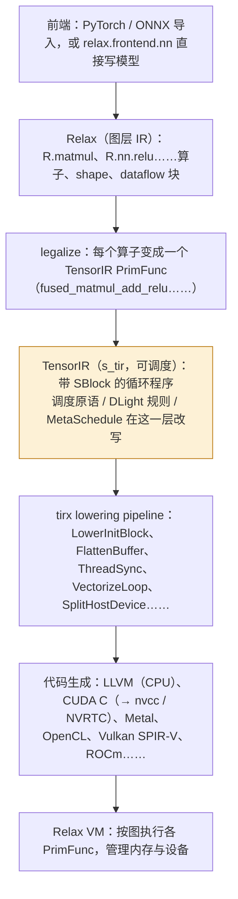

前七篇里 Triton 的每一个编译决定——layout、向量宽度、stage 数、warp 划分——都是编译器**自己**做的，用户只给 tile 大小与 `num_warps`。这一篇换一条路：TVM。它的出发点来自 Halide 的"算法与调度分离"：程序说**算什么**（`C[i, j] += A[i, k] * B[k, j]`），另有一份**调度**说怎么算（循环怎么切、哪一层放 shared memory、哪一层绑到线程、哪一段用 Tensor Core 指令替换）；编译器的职责是**忠实地**按调度生成代码，并用一套形式化的检查保证每一步调度变换不改变语义。于是"编译器可能做错"的风险从编译器搬到了调度的作者——人，或者搜索器（MetaSchedule），或者规则库（DLight）。

本篇用 TVM v0.26.0 在同一台没有 NVIDIA GPU 的 Mac 上跑：CPU 上一个 128³ 的 matmul 从 1089 μs 调到 52 μs，每一步调度原语前后的 TensorIR；一个 1024³ 的 GPU matmul 调度后生成 Metal 源码**在 Mac 的 GPU 上真跑**（700 GFLOP/s），同一份调度生成的 CUDA C；DLight 的 Tensor Core 规则给一个 Relax 模型里的 matmul 排出的完整 `wmma` 调度；MetaSchedule 32 次试验的搜索轨迹。然后把 Triton、TVM、XLA、IREE、Inductor、CUTLASS 放进同一张设计空间表。

总纲对这一篇提出的核心问题是：

> **同一个 `[M, N, K]` 的 GEMM，Triton 用户决定 `BLOCK_M / BLOCK_N / BLOCK_K` 和 `num_warps`，其余交给编译器；TVM 用户（或 MetaSchedule）决定完整的循环嵌套、每一层的存储位置和线程绑定。两者的搜索空间分别有多大？[^q0] 各自把"编译器可能做错"的风险放在了哪里？[^q1]**

## 一、总览

| 章 | 主题 | 内容 |
|---|---|---|
| 二 | 算法与调度分离 | Halide 血统；TVM 的分层：Relax → TensorIR → 目标代码；v0.26 的 `tirx` / `s_tir` 拆分 |
| 三 | TensorIR | PrimFunc、Buffer、SBlock、迭代变量的 S / R 标注、`T.init`；与 Triton IR 的对照 |
| 四 | 调度原语 | 一个 CPU matmul 的五步：`split / reorder / reverse_compute_at / vectorize / parallel / decompose_reduction`，每步的 IR 与耗时；一次被拒绝的变换 |
| 五 | GPU 调度 | `bind`、`cache_read("shared")`、`cache_write("local")`；生成的 Metal 与 CUDA 源码；编译器插的 barrier |
| 六 | 下降 | `s_tir` pipeline 的 pass 表；`tensorize` 与 Tensor Core intrinsic；生成的 LLVM IR |
| 七 | DLight 与 MetaSchedule | 规则库的 `wmma` 调度全文；搜索空间的表示（`sample_perfect_tile`）、trace、代价模型、32 次试验 |
| 八 | Relax 与 MLC-LLM | 图层：`nn.Module → Relax → legalize → TIR`；`get_pipeline("zero")` |
| 九 | 设计空间对照 | Triton / Gluon / TVM / XLA / IREE / Inductor / CUTLASS：谁决定什么、空间多大、风险在哪 |
| 十 | 本文小结 | |
| 十一 | 自测 | 5 道题 |

Table: 本文的章节安排

源码：`python/tvm/tirx/`（IR、lowering）、`python/tvm/s_tir/schedule/schedule.py`（调度原语的 Python 接口）、`src/s_tir/schedule/primitive/`（原语实现）、`src/s_tir/schedule/analysis/`（合法性检查）、`python/tvm/s_tir/dlight/gpu/matmul.py`、`python/tvm/s_tir/meta_schedule/`、`python/tvm/s_tir/tensor_intrin/cuda.py`、`python/tvm/relax/`、`docs/deep_dive/tensor_ir/`。运行：`PYTHONPATH=python`（TVM 的 `AGENTS.md` 明说不要 `pip install -e`），`build/` 用 Apple clang + Homebrew `llvm@22` 构建（v0.26 与 LLVM 23 不兼容）、`USE_METAL=ON`。

## 二、算法与调度分离

### 1. Halide 的遗产

Halide（2012，图像处理 DSL）提出：把**算法**（每个像素是什么函数）与**调度**（循环顺序、分块、向量化、并行、中间结果存哪）写成两份独立的代码。算法不变时，换一份调度就是换一个实现；调度的每一条语句都是**保语义的变换**，所以调度作者不可能写出结果错误的程序，只可能写出慢的。TVM（2018）把它搬到深度学习：算法用张量表达式（TE）或直接写 TensorIR，调度用一组**原语**（`split`、`reorder`、`bind`、`cache_read`、`tensorize`……）。

对照 Triton：Triton kernel 是**一份**代码，tile 大小与线程数是它的参数，其余（layout、流水、指令选择）由编译器的启发式决定，用户无法干预；TVM 的调度把这些决定全部暴露给作者，编译器不做启发式选择。两者在"谁决定"这个轴上处于两端，第九章展开。

### 2. TVM 的分层



v0.26 把原来的 `tir` 模块拆成两个：**`tirx`**——核心 IR 定义与 lowering pass（`PrimFunc`、`Buffer`、`SBlock`、表达式、语句），**`s_tir`**（Schedulable TIR）——调度原语、MetaSchedule、DLight、tensor intrinsic。TVMScript 里两者都通过 `from tvm.script import tirx as T` 访问。这与 MLIR 的"基础设施 / 内容"分离（第三篇）是同一种冲动：IR 与操作 IR 的工具分开。TVM 的目标列表（LLVM CPU、CUDA、Metal、OpenCL、Vulkan、ROCm、WebGPU、Hexagon……）比 Triton 宽得多——**它的代码生成器输出的是目标语言的源码或 LLVM IR，而不是某一家 GPU 的 PTX**，可移植性是设计目标之一。

## 三、TensorIR

### 1. 一个 PrimFunc

```python
@I.ir_module
class MyModule:
    @T.prim_func(s_tir=True)
    def main(A: T.Buffer((128, 128), "float32"), B: T.Buffer((128, 128), "float32"), C: T.Buffer((128, 128), "float32")):
        T.func_attr({"tirx.noalias": True})
        with T.sblock("root"):
            T.reads(); T.writes()
            Y = T.sblock_alloc_buffer((128, 128))                      # ① 中间缓冲
            for i, j, k in T.grid(128, 128, 128):                      # ② 循环
                with T.sblock("Y"):                                    # ③ block：调度的基本单位
                    vi, vj, vk = T.axis.remap("SSR", [i, j, k])        # ④ 迭代变量：S 空间、R 规约
                    with T.init():                                     # ⑤ 规约的初值
                        Y[vi, vj] = T.float32(0)
                    Y[vi, vj] = Y[vi, vj] + A[vi, vk] * B[vk, vj]
            for i, j in T.grid(128, 128):
                with T.sblock("C"):
                    vi, vj = T.axis.remap("SS", [i, j])
                    C[vi, vj] = T.max(Y[vi, vj], T.float32(0))
```

这是 matmul + ReLU。与 Triton 的 TTIR 对比，TensorIR 是**标量循环程序**：每个 `sblock` 的 body 计算一个元素，循环显式写出。信息藏在标注里：

- ③ **SBlock** 是调度的基本单位——一段计算加上它的**迭代域**（哪些迭代变量、各自范围）、**读写集合**（`T.reads / T.writes`，打印时自动推出）与可选的 `init`。调度原语作用在 block 与 loop 上，不作用在语句上。
- ④ 迭代变量的**类型**：`S`（spatial，数据并行——各迭代独立，可以任意重排、并行）与 `R`（reduce，规约——只能改顺序不能并行，除非用 `rfactor` / 跨线程规约）。`T.axis.remap("SSR", [i, j, k])` 把三个循环变量绑到三个 block 变量并标类型。**这是 TensorIR 能验证调度合法性的信息来源**：知道哪些轴独立，就知道 `reorder`、`parallel`、`vectorize` 什么时候安全。
- ⑤ `T.init` 让 block 成为"规约 block"——编译器知道第一次迭代要写初值，`decompose_reduction` 可以把它拆出去。
- ① `sblock_alloc_buffer` 声明的中间缓冲不指定存储位置，`cache_read / set_scope` 之后才决定它在 global、shared 还是寄存器。

对照 Triton：TTIR 里 `tt.dot` 是一个 op、`[128, 128]` 是一个值，"元素独立"由张量语义隐含；TensorIR 里矩阵乘是三层循环加标量乘加，"元素独立"由 `S / R` 标注声明。前者更抽象、能做的分析更少（Triton 不分析循环嵌套）；后者更接近 C，但每个 block 带足了做变换所需的信息。

### 2. `tirx` 的其余部分

`PrimFunc`（参数 + body + attrs）、`Buffer`（shape、dtype、strides、`scope`——`global` / `shared` / `shared.dyn` / `local` / `wmma.matrix_a`……）、`For`（`kind`：serial / parallel / vectorized / unrolled / **thread_binding**——绑到 `blockIdx.x` 等的循环就是 GPU 的线程结构）、`BufferLoad / BufferStore`、`Call`（intrinsic：`T.tvm_mma_sync`、`T.ptx_ldmatrix`、`T.tvm_fill_fragment`）。GPU 的线程层次不是特殊结构，就是 `For` 的一种 kind——`for i_0 in T.thread_binding(16, thread="blockIdx.y")`。

## 四、调度原语：一个 CPU matmul 的五步

### 1. 五步

`tvm.s_tir.Schedule(mod)` 持有一份 IR 与一份 **trace**（所有已应用原语的记录，可以重放、可以序列化——MetaSchedule 搜索的就是 trace）。每一步（Apple M 系列，`target="llvm"`，128³ f32，`time_evaluator`）：

| 步 | 原语 | 耗时 | 做了什么 |
|---|---|---|---|
| 0 | — | 1089 μs | 朴素三层循环，`k` 在最内层，B 按列跳读 |
| 1 | `j0, j1 = sch.split(j, [None, 8]); sch.reorder(j0, k, j1)` | 161 μs | `j` 切成 16 × 8，`k` 提到 `j1` 外——最内层连续访问 8 个 `B[k, j]` 与 8 个 `Y[i, j]`，缓存友好、可向量化 |
| 2 | `sch.reverse_compute_at(C_block, j0)` | 156 μs | ReLU 挪进 matmul 的 `j0` 循环里：每算完 8 个 `Y` 立刻算 8 个 `C`，`Y` 不用整块回写再读 |
| 3 | `sch.vectorize(j1); i0, i1 = sch.split(i, [None, 4]); sch.parallel(i0)` | 58 μs | 最内 8 个元素变 SIMD（LLVM IR 里出现 `<8 x float>` 与 `llvm.fmuladd`），外层多线程 |
| 4 | `sch.decompose_reduction(Y_block, k)` | 52 μs | 把 `Y = 0` 的初始化从 `k` 循环里拆出来成独立 block（`Y_init`），主循环少一个分支 |

Table: matmul 调度的五步与耗时

第 1 步后的 IR（`sch.mod.show()`）：

```python
for i, j_0, k, j_1 in T.grid(128, 16, 128, 8):
    with T.sblock("Y"):
        vi = T.axis.spatial(128, i)
        vj = T.axis.spatial(128, j_0 * 8 + j_1)          # 绑定变成仿射表达式
        vk = T.axis.reduce(128, k)
        T.reads(A[vi, vk], B[vk, vj])
        T.writes(Y[vi, vj])
        with T.init():
            Y[vi, vj] = T.float32(0.0)
        Y[vi, vj] = Y[vi, vj] + A[vi, vk] * B[vk, vj]
```

**block 的语义一个字没变**——`Y[vi, vj] += A[vi, vk] * B[vk, vj]`——变的只是外面的循环与 `vj` 的绑定表达式。这就是"算法 / 调度分离"在 IR 上的形态：block 是算法，block 之外的循环结构是调度。第 4 步后：

```python
for i_0 in T.parallel(32):
    for i_1, j_0 in T.grid(4, 16):
        for j_1_init in T.vectorized(8):
            with T.sblock("Y_init"): ...  Y[vi, vj] = T.float32(0.0)
        for k in range(128):
            for j_1 in T.vectorized(8):
                with T.sblock("Y_update"): ... Y[vi, vj] = Y[vi, vj] + A[vi, vk] * B[vk, vj]
        for ax0 in range(8):
            with T.sblock("C"): ... C[vi, vj] = T.max(Y[vi, vj], T.float32(0.0))
```

trace（`sch.trace.show()`）是这一切的可重放记录：

```python
def apply_trace(sch: s_tir.Schedule) -> None:
  b0 = sch.get_sblock(name="Y", func_name="main")
  l1, l2, l3 = sch.get_loops(block=b0)
  l4, l5 = sch.split(loop=l2, factors=[None, 8], preserve_unit_iters=True, disable_predication=False)
  sch.reorder(l4, l3, l5)
  b6 = sch.get_sblock(name="C", func_name="main")
  sch.reverse_compute_at(block=b6, loop=l4, preserve_unit_loops=False, index=-1)
  sch.vectorize(loop=l5)
  l7, l8 = sch.split(loop=l1, factors=[None, 4], preserve_unit_iters=True, disable_predication=False)
  sch.parallel(loop=l7)
  b9 = sch.decompose_reduction(block=b0, loop=l3)
```

### 2. 一次被拒绝的变换

第 4 步之后再对 `Y_update` 的最内层调 `sch.vectorize`：

```text
ScheduleError: An error occurred in the schedule primitive 'vectorize'.
Error message: The queried subtree root tirx.For#0 in SRef tree does not have compact dataflow,
because its child block tirx.SBlock#1 on SRef tree is neither a local complete block nor a local reduction block.
It violates condition #1 as a local complete block.
Definition of a local complete block:
1) All block vars are data parallel
2) Local Dominant: the block is the only writer of its output, dominating the reader of its output buffers under a given subtree
3) No overlap between the buffers the block reads and writes
It violates condition #1 as a local reduction block.
Definition of a reduction block:
1) The block has the `init` statement
...
```

`decompose_reduction` 之后 `Y_update` 没有了 `init`，也不是"完整 block"（它读写同一个缓冲），在这个子树上不满足向量化的前提，原语**拒绝执行**并解释了定义。这是 TVM 与 Triton 的一个根本差别：**调度原语带形式化的前置条件检查**（`src/s_tir/schedule/analysis/`：完整 block、规约 block、仿射绑定、支配关系、compact dataflow），不满足就报错而不是生成错误代码。前四步能过是因为向量化在 `decompose_reduction` 之前做——原语的**顺序**也是调度的一部分。

### 3. 原语一览

`Schedule` 类有六十多个方法，按用途分：

| 类别 | 原语 | Triton 里的对应决定 |
|---|---|---|
| 循环 | `split / fuse / reorder / loop_partition / add_unit_loop` | tile 大小（`BLOCK_*`）、`sizePerThread` 的排布 |
| 绑定与 kind | `bind(loop, "blockIdx.x" / "threadIdx.y")`、`parallel / vectorize / unroll` | `num_warps`、layout 的 `threadsPerWarp / warpsPerCTA`、`getVectorSize` |
| 存储 | `cache_read / cache_write(block, idx, scope)`、`set_scope`、`storage_align`、`reindex`、`transform_layout` | shared memory 缓冲（`local_alloc`）、swizzle（`#swizzled_shared`）、`#dot_op` 寄存器 fragment |
| 计算位置 | `compute_at / reverse_compute_at / compute_inline / reverse_compute_inline` | 算子融合（Triton 里由用户在一个 kernel 里写完） |
| 规约 | `decompose_reduction / rfactor / fuse_reduction_epilogue` | `reduce` 三级下降、`OptimizeThreadLocality` |
| 硬件指令 | `blockize / tensorize(loop, intrin)` | `AccelerateMatmul`（`#mma` + `mma.sync`） |
| 流水 | `annotate(loop, "software_pipeline_stage", [...])`、`"software_pipeline_order"`、`"double_buffer_scope"` | `num_stages` + `AssignLatencies / ScheduleLoops / Pipeline` |
| 采样（MetaSchedule 用） | `sample_perfect_tile / sample_categorical / sample_compute_location` | autotune 的 config 空间 |

Table: Schedule 原语一览及 Triton 里的对应

右列对得上的每一项都是 Triton 编译器**自己**决定、TVM 调度作者**显式**决定的东西。

## 五、GPU 调度

### 1. 手写一份

1024³ f32 matmul，目标 Metal（Mac 的 GPU）与 CUDA：

```python
sch = tvm.s_tir.Schedule(MM); blk = sch.get_sblock("C"); i, j, k = sch.get_loops(blk)
i0, i1, i2 = sch.split(i, factors=[None, 16, 4])          # block 64 行：16 个线程 × 每线程 4 行
j0, j1, j2 = sch.split(j, factors=[None, 16, 4])          # block 64 列
k0, k1 = sch.split(k, factors=[None, 16])                  # K 按 16 分块
sch.reorder(i0, j0, i1, j1, k0, k1, i2, j2)
sch.bind(i0, "blockIdx.y"); sch.bind(j0, "blockIdx.x")     # 网格
sch.bind(i1, "threadIdx.y"); sch.bind(j1, "threadIdx.x")   # 16 × 16 = 256 线程
A_sh = sch.cache_read(blk, 0, "shared"); sch.compute_at(A_sh, k0)     # A 的 [64, 16] 块进 shared memory，每个 k0 一次
B_sh = sch.cache_read(blk, 1, "shared"); sch.compute_at(B_sh, k0)
for rd in (A_sh, B_sh):                                    # 搬运循环：256 线程各搬 float4
    fused = sch.fuse(*sch.get_loops(rd)[-2:])
    _, ty, tx, vec = sch.split(fused, factors=[None, 16, 16, 4])
    sch.bind(ty, "threadIdx.y"); sch.bind(tx, "threadIdx.x"); sch.vectorize(vec)
C_loc = sch.cache_write(blk, 0, "local"); sch.reverse_compute_at(C_loc, j1)   # 累加器在寄存器，最后写回
sch.decompose_reduction(blk, k0)
```

十四行调度写出了 Triton 编译器为 matmul 自动做的一半事情（tile、线程映射、shared memory 缓冲、向量化搬运、寄存器累加器）——没有流水（`software_pipeline` 注解可以加）、没有 Tensor Core（`tensorize` 可以加，§六.2）。调度后的 TensorIR 里每一层循环都有了 kind：

```python
for i_0 in T.thread_binding(16, thread="blockIdx.y"):
    for j_0 in T.thread_binding(16, thread="blockIdx.x"):
        for i_1 in T.thread_binding(16, thread="threadIdx.y"):
            for j_1 in T.thread_binding(16, thread="threadIdx.x"):
                for i_2_init, j_2_init in T.grid(4, 4):
                    with T.sblock("C_init"): ... C_local[vi, vj] = T.float32(0.0)
                for k_0 in range(64):
                    for ax0_ax1_fused_0 in range(1):
                        for ax0_ax1_fused_1 in T.thread_binding(16, thread="threadIdx.y"):
                            for ax0_ax1_fused_2 in T.thread_binding(16, thread="threadIdx.x"):
                                for ax0_ax1_fused_3 in T.vectorized(4):
                                    with T.sblock("A_shared"): ... A_shared[v0, v1] = A[v0, v1]
                    ...
                    for k_1, i_2, j_2 in T.grid(16, 4, 4):
                        with T.sblock("C_update"): ... C_local[vi, vj] = C_local[vi, vj] + A_shared[vi, vk] * B_shared[vk, vj]
                for ax0, ax1 in T.grid(4, 4):
                    with T.sblock("C_local"): ... C[v0, v1] = C_local[v0, v1]
```

### 2. 生成的源码与真跑

`tvm.tirx.build(sch.mod, target="metal")` 生成 Metal Shading Language，在 Mac 的 GPU 上跑：

```c
kernel void main_kernel(device float* A_ptr [[ buffer(0) ]], device float* B_ptr [[ buffer(1) ]], device float* C_ptr [[ buffer(2) ]],
  uint2 blockIdx [[threadgroup_position_in_grid]], uint2 threadIdx [[thread_position_in_threadgroup]]) {
  thread float C_local[16];
  threadgroup float A_shared[1024];
  threadgroup float B_shared[1024];
  for (int i_2_init = 0; i_2_init < 4; ++i_2_init) for (int j_2_init = 0; j_2_init < 4; ++j_2_init) C_local[((i_2_init * 4) + j_2_init)] = 0.000000e+00f;
  for (int k_0 = 0; k_0 < 64; ++k_0) {
    threadgroup_barrier(mem_flags::mem_threadgroup);                         // ① 编译器插的
    *(threadgroup float4*)(A_shared + ...) = *(device float4*)(A_ptr + ...);  // ② vectorize → float4
    *(threadgroup float4*)(B_shared + ...) = *(device float4*)(B_ptr + ...);
    threadgroup_barrier(mem_flags::mem_threadgroup);                         // ①
    for (int k_1 = 0; k_1 < 16; ++k_1) for (int i_2 = 0; i_2 < 4; ++i_2) for (int j_2 = 0; j_2 < 4; ++j_2)
      C_local[((i_2 * 4) + j_2)] = (C_local[((i_2 * 4) + j_2)] + (A_shared[...] * B_shared[...]));
  }
  for (int ax0 = 0; ax0 < 4; ++ax0) for (int ax1 = 0; ax1 < 4; ++ax1) C_ptr[...] = C_local[((ax0 * 4) + ax1)];
}
```

```text
metal: 3.067 ms, 700 GFLOP/s          （1024³，f32，Apple M 系列 GPU）
```

同一份调度 `target={"kind": "cuda", "arch": "sm_80"}` 生成 CUDA C（没有 nvcc 时 TVM 把源码存进 `CUDAFallbackModule` 供以后编译；用 `tvm_callback_cuda_postproc` 钩子能看到）：

```c
extern "C" __global__ void __launch_bounds__(256) main_kernel(float* __restrict__ A_ptr, float* __restrict__ B_ptr, float* __restrict__ C_ptr) {
  __shared__ alignas(64) float A_shared_ptr[1024];
  __shared__ alignas(64) float B_shared_ptr[1024];
  for (int k_0 = 0; k_0 < 64; ++k_0) {
    __syncthreads();
    *(float4*)(A_shared_ptr + ...) = *(float4*)(A_ptr + ...);
    ...
```

① 调度里**没有写** barrier，两个 `threadgroup_barrier` / `__syncthreads` 是 lowering 的 `ThreadSync` pass 按 shared memory 的读写依赖插入的——与 Triton 的 `Membar`（第十篇 §九）同一件事、同一种分析（先写后读、先读后写）。② `vectorize(vec)` 变成 `float4`——Triton 里这是 AxisInfo + `getVectorSize` 的自动结果，这里是调度作者写的 `factors=[…, 4]` 加一句 `vectorize`。

**TVM 生成的是 CUDA C 源码而不是 PTX**：`nvcc`（或 NVRTC）是它的后端，`__launch_bounds__(256)` 对应 Triton 的 `nvvm.reqntid`；Tensor Core 用 `wmma::mma_sync` 或内联 PTX（`T.ptx_mma`）；寄存器分配、指令调度全部交给 `nvcc` + `ptxas`——两个第二编译器。

## 六、下降与 tensorize

### 1. `s_tir` pipeline

`tvm.tirx.build` 对调度好的 PrimFunc 跑 `python/tvm/s_tir/pipeline.py` 的 `default_s_tir_pipeline`——四十多个 pass，对应 Triton 的 `make_llir`：

```text
CanonicalizeLoop → LowerCrossThreadReduction（跨线程规约 → shuffle / shared memory）→ LowerInitBlock（init 变成 if k == 0）
→ PlanAndUpdateBufferAllocationLocation（缓冲分配挪到最内的合法作用域）→ ConvertBlocksToOpaque（去掉 block 结构，只剩循环）
→ LiftThreadBinding → ManifestSharedMemoryLocalStage → CompactBufferAllocation（shared 缓冲按实际访问范围收缩：[1024,1024] → [64,16]）
→ LowerAutoCopy → UnifyThreadBinding → LowerMatchBuffer → StmtSimplify → InjectPermutedLayout → AnnotateIrregularLoop
→ InjectSoftwarePipeline（按 software_pipeline_stage / order 注解展开 prologue / body / epilogue——TVM 的 PipelineExpander）
→ TransformMmaBufferLayout → LowerOpaqueBlock → FlattenBuffer（多维下标 → 一维偏移）→ BF16ComputeLegalize → NarrowDataType(32)
→ LoopPartition → VectorizeLoop（vectorized 循环 → 向量类型）→ InjectVirtualThread → InjectDoubleBuffer → StorageRewrite（缓冲复用——AllocateSharedMemory）
→ UnrollLoop → StmtSimplify → HoistIfThenElse → ThreadSync（插 barrier——Membar）→ SplitHostDevice → MakePackedAPI（host 端的参数解包——launcher）
→ LowerIntrin / LowerTVMBuiltin → 代码生成
```

同一组问题在两个编译器里有名字几乎一样的 pass：缓冲区收缩与复用、软件流水展开、barrier 插入、向量化、host / device 拆分。差别在**输入**：Triton 的 pass 在带 layout 的张量 op 上做决定，TVM 的 pass 在调度已经定死的标量循环上做机械转换——TVM 的 lowering 里没有启发式。

### 2. `tensorize`

Tensor Core 在 TVM 里是**用户（或规则）显式替换的 intrinsic**：`python/tvm/s_tir/tensor_intrin/cuda.py` 用 TVMScript 同时写出每个 intrinsic 的**描述**（它计算什么——一个 16×16×16 的 block）和**实现**（用 `T.ptx_mma` / `T.tvm_mma_sync` / `T.ptx_ldmatrix` 怎么算），注册成 `mma_f16f16f32`、`mma_ldmatrix_f16_a`、`mma_fill_16x16_f32`、`wmma_*` 等几十个名字。`sch.tensorize(loop, "mma_f16f16f32")` 做的是**模式匹配**：把 `loop` 下的 block 与 intrinsic 的描述比对（迭代域、读写、计算式结构一致），一致就替换成实现。Triton 里这是 `AccelerateMatmul` 自动选 `#mma` 加 `DotOpToLLVM` 生成 `mma.sync`；TVM 里 `tensorize` 之前用户要先用 `split / reorder / blockize` 把循环切成 16×16×16 的形状，用 `cache_read(..., "wmma.matrix_a")` 建 fragment 缓冲——**Triton 的 `#dot_op` layout 在这里是一个 `scope` 为 `wmma.matrix_a` 的缓冲**，其内部布局对 TVM 不透明（`TransformMmaBufferLayout` 与 `wmma` API 处理），Linear Layout 那套数学在 TVM 里不存在。

### 3. 生成的 LLVM IR（CPU）

`lib.inspect_source("ll")`：1168 行，入口 `define dllexport i32 @__tvm_ffi_main(ptr %self_handle, ptr %args, i32 %num_args, ptr %result)`——TVM 的 packed function 调用约定（参数是 `Any` 数组，`MakePackedAPI` 生成解包代码），对应 Triton 的 C launcher；向量类型 `<4 x float>`、`<8 x float>`，5 处 `llvm.fmuladd`。再往下是第二篇的 LLVM。

## 七、DLight 与 MetaSchedule

手写调度是专家活。TVM 在它之上有两层自动化，恰好对应"规则"与"搜索"两条路。

### 1. DLight：规则库

`python/tvm/s_tir/dlight/gpu/` 里每个文件是一条规则：`Matmul`、`GEMV`、`LowBatchGEMV`、`Reduction`、`GeneralReduction`、`Transpose`、`RMSNorm`、`Fallback`。`dl.ApplyDefaultSchedule(rules...)(mod)` 对模块里每个 PrimFunc 按顺序试规则，第一个匹配的给出调度。规则是**确定性的 Python 代码**——一串调度原语加几个按 shape / dtype / 目标查表的参数——零搜索时间，是 MLC-LLM 编译 LLM 的默认路径。

`Matmul` 规则在 `sm_80` 上对一个 Relax 模型里的 `[128, 1024] × [1024, 1024]` f16 矩阵乘（§八）排出的调度，就是 Triton 第七到十篇讲的全部决定的**显式版本**——`MatmulTensorization::apply` 的骨架：

```python
micro_size_x = micro_size_y = micro_size_k = 16; warp_size = 32
i_factors, j_factors, k_factors = (由 shape 查表：例如 [None, 1, 4, 2], [1, None, 4, 2], [None, 4])
reindex_a = sch.reindex(main_block, ("read", 0)); ...                         # 规范化访问下标
sch.transform_layout(reindex_a, ("write", 0), a_index_map); ...              # 布局变换
sch.pad_einsum(main_block, [1, 16 * x_pad_factor, 16 * y_pad_factor, 16 * k_pad_factor])   # 补齐到 16 的倍数
i, i_inner = sch.split(i, factors=[None, 16]); j, j_inner = ...; k, k_inner = ...
sch.reorder(i, j, k, i_inner, j_inner, k_inner)
block_outer = sch.blockize(i_inner)                                          # 16×16×16 的内层变成一个 block（tensorize 的单位）
i0, i1, i2, i3 = sch.split(i, factors=i_factors); j0, j1, j2, j3 = ...; k0, k1 = sch.split(k, k_factors)
sch.annotate(k0, "software_pipeline_order", [0, 3, 1, 4, 5, 2, 6]); sch.annotate(k0, "software_pipeline_stage", [0, 0, 0, 0, 0, 1, 1])   # 流水：哪些 stage、什么顺序
sch.annotate(k1, "software_pipeline_order", [0, 1, 2]); sch.annotate(k1, "software_pipeline_stage", [0, 0, 1])
sch.reorder(i0, j0, i1, j1, j2, i2, k0, k1, i3, j3)
sch.bind(sch.fuse(i0, j0), "blockIdx.x"); sch.bind(sch.fuse(i1, j1), "blockIdx.y"); sch.bind(sch.fuse(j2, i2), "threadIdx.y")   # warp 排布 = warpsPerCTA
for idx in (0, 1):                                                           # A、B 进 shared memory
    block_read = sch.cache_read(block, idx, "shared.dyn"); sch.compute_at(block_read, k0)
    _, f_1, f_2, f_3 = sch.split(fused, factors=[None, num_ty, warp_size, vector_size])
    sch.bind(f_2, "threadIdx.x"); sch.bind(f_1, "threadIdx.y"); sch.vectorize(f_3)                          # Coalesce
    sch.storage_align(block_read, 0, axis=-2, factor=16, offset=8)                                          # 行 padding 8 元素 —— 代替 swizzle 避 bank conflict
    sch.annotate(block_read, "tirx.manifest_shared_memory_local_stage", 1); sch.annotate(block_read, "double_buffer_scope", 0)   # 双缓冲
A_mat = sch.cache_read(block_outer, 0, "wmma.matrix_a"); B_mat = sch.cache_read(block_outer, 1, "wmma.matrix_b")   # fragment = #dot_op
sch.compute_at(A_mat, k1); sch.compute_at(B_mat, k1)
store = sch.cache_write(block_outer, 0, "wmma.accumulator"); ...            # 累加器 fragment = #mma
sch.decompose_reduction(block_outer, k0)
sch.tensorize(..., intrin_group["load_a"]); sch.tensorize(..., intrin_group["load_b"]); sch.tensorize(..., intrin_group["compute"]); sch.tensorize(..., intrin_group["store"]); sch.tensorize(..., intrin_group["init"])
```

产出的 TensorIR（节选）：

```python
relu_reindex_shared_dyn = T.sblock_alloc_buffer((1, 128, 1024), "float16", scope="shared.dyn")
relu_reindex_shared_dyn_wmma_matrix_a = T.sblock_alloc_buffer((1, 128, 1024), "float16", scope="wmma.matrix_a")
matmul_intermediate_reindex_shared_dyn_wmma_accumulator = T.sblock_alloc_buffer((1, 128, 1024), "float16", scope="wmma.accumulator")
for ax1_0_1_ax2_0_1_fused in T.thread_binding(8, thread="blockIdx.y"):
    for ax2_0_2_ax1_0_2_fused in T.thread_binding(16, thread="threadIdx.y"):          # 16 个 warp
        ... T.tvm_fill_fragment(C.data, 16, 16, 16, ...)                                # init → wmma::fill_fragment
        for ax3_0_0 in T.serial(16, annotations={"software_pipeline_order": [0, 3, 1, 4, 5, 2, 6], "software_pipeline_stage": [0, 0, 0, 0, 0, 1, 1]}):
            for ax0_ax1_fused_2 in T.thread_binding(32, thread="threadIdx.x"):
                for ax0_ax1_fused_3 in T.vectorized(4):
                    with T.sblock("relu_reindex_shared.dyn"):
                        T.sblock_attr({"buffer_dim_align": [[0, 1, 16, 8]], "double_buffer_scope": 0, "tirx.manifest_shared_memory_local_stage": 1})
                        relu_reindex_shared_dyn[v0, v1, v2] = relu[v1, v2]
            for ax3_0_1 in T.serial(4, annotations={"software_pipeline_order": [0, 1, 2], "software_pipeline_stage": [0, 0, 1]}):
                ... T.tvm_load_matrix_sync(C.data, 16, 16, 16, ..., "row_major")     # cache_read → wmma::load_matrix_sync
                ... T.tvm_mma_sync(C.data, ..., A.data, ..., B.data, ..., C.data, ...)   # tensorize → wmma::mma_sync
```

对照 Triton 第七到九篇：`blockIdx / threadIdx.y` 的排布是 `warpsPerCTA`；`cache_read("shared.dyn")` + `vectorize(4)` 是 Coalesce；`storage_align(…, 16, 8)` 是 `#swizzled_shared`（用 padding 而非 XOR）；`software_pipeline_stage` 是 `num_stages` 与 `ScheduleLoops`；`wmma.matrix_a` 是 `#dot_op`；`wmma.accumulator` 是 `#mma`；`tensorize` 是 `AccelerateMatmul` + `DotOpToLLVM`。**每一个 Triton 自动决定，这里是一行显式代码**——写在规则里而不是编译器里，所以用户可以复制一条规则改掉某一行（DLight 文档专门讲怎么写自定义规则）。

### 2. MetaSchedule：搜索

规则覆盖不到的形状交给搜索。MetaSchedule 的搜索空间不是"一组参数"而是**带采样点的 trace**：

```python
def apply_trace(sch):
  b0 = sch.get_sblock(name="C", func_name="main")
  sch.annotate(block_or_loop=b0, ann_key="meta_schedule.tiling_structure", ann_val="SSRSRS")      # ① 分块结构：S 空间层 / R 规约层的嵌套模式
  l2, l3, l4 = sch.get_loops(block=b0)
  v5, v6, v7, v8 = sch.sample_perfect_tile(loop=l2, n=4, max_innermost_factor=32, decision=[4, 8, 2, 4])   # ② 采样：i 切成四层，乘积 256
  l9, l10, l11, l12 = sch.split(loop=l2, factors=[v5, v6, v7, v8], ...)
  v13, v14, v15, v16 = sch.sample_perfect_tile(loop=l3, n=4, max_innermost_factor=32, decision=[2, 16, 2, 4])
  ...
  v21, v22 = sch.sample_perfect_tile(loop=l4, n=2, max_innermost_factor=32, decision=[32, 8])
  sch.reorder(l9, l17, l10, l18, l23, l11, l19, l24, l12, l20)                                           # ③ 按 SSRSRS 排列
  b25 = sch.cache_write(block=b0, write_buffer_index=0, storage_scope="global")
  sch.reverse_compute_at(block=b25, loop=l18, ...)
  sch.annotate(block_or_loop=b1, ann_key="meta_schedule.parallel", ann_val=64)
  sch.annotate(block_or_loop=b1, ann_key="meta_schedule.vectorize", ann_val=32)
  v26 = sch.sample_categorical(candidates=[0, 8, 32, 256], probs=[0.25, 0.25, 0.25, 0.25], decision=0)   # ④ 采样：展开因子
  sch.annotate(block_or_loop=b1, ann_key="meta_schedule.unroll_explicit", ann_val=v26)
```

这是 `PostOrderApply` 空间生成器用内置的 **schedule rule**（`MultiLevelTiling`、`AutoInline`、`ParallelizeVectorizeUnroll`、`RandomComputeLocation`、GPU 上还有 `MultiLevelTilingTensorCore`、`CrossThreadReduction`）对 256³ matmul 生成的三个设计空间之一。trace 里的 `sample_*` 是**决策点**（`decision=` 是这一次的取值），其余是决定性的结构。搜索 = 反复重放 trace、在决策点取不同的值、编译、在真机上测时、用代价模型（XGBoost，`cost_model/xgb_model.py`）预测下一批候选、进化搜索（`EvolutionarySearch`）。在 Mac CPU 上跑 32 次试验（`ms.tune_tir`，`LocalBuilder` 10 进程、`LocalRunner`）：

```text
 ID | Name |     FLOP | Weight | Speed (GFLOPS) | Latency (us) | Trials | Done
  0 | main | 33554432 |      1 |       225.6548 |     148.6981 |     16 |
  0 | main | 33554432 |      1 |       254.0569 |     132.0745 |     32 |    Y
XGB iter 0: tr-p-rmse 0.362819 → iter 21: 0.03891（代价模型在 16 个样本上拟合）
```

最优 trace 的决策：`i` 切成 `[128, 1, 2, 1]`、`j` 切成 `[1, 8, 4, 8]`、`k` 切成 `[128, 2]`、展开 256；后处理（`enter_postproc` 之后）把 `meta_schedule.parallel / vectorize / unroll` 注解落实成 `parallel(l40)`、`vectorize(l41)`、`pragma_auto_unroll_max_step`，最后 `decompose_reduction`。搜索的产物是一个**数据库**（`work_dir` 下的 JSON：每条 trace 与其测得的时间），`MetaScheduleApplyDatabase` 在编译时按 PrimFunc 的结构哈希查表应用——第十一篇 Triton 缓存的对应物，只是缓存的是调度而不是二进制。

## 八、Relax 与 MLC-LLM

TVM 的图层。`relax.frontend.nn` 用 PyTorch 风格写模型，`export_tvm` 得到 Relax `IRModule`：

```python
@R.function
def forward(x: R.Tensor((128, 1024), dtype="float16"), fc1_weight: R.Tensor((1024, 1024), dtype="float16"), fc1_bias: ..., fc2_weight: ..., fc2_bias: ...):
    R.func_attr({"num_input": 1})
    with R.dataflow():
        permute_dims: R.Tensor((1024, 1024), dtype="float16") = R.permute_dims(fc1_weight, axes=None)
        matmul: R.Tensor((128, 1024), dtype="float16") = R.matmul(x, permute_dims, out_dtype=None)
        add: R.Tensor((128, 1024), dtype="float16") = R.add(matmul, fc1_bias)
        relu: R.Tensor((128, 1024), dtype="float16") = R.nn.relu(add)
        ...
```

每个值带 shape 与 dtype（Relax 支持符号 shape：`R.Tensor(("n", 1024))`，运行时绑定——LLM 的动态序列长度靠它），`R.dataflow()` 块内无副作用、可以自由融合。`relax.get_pipeline("zero")` 做 legalize（每个算子 → TIR PrimFunc）与融合：上面的图变成三个 PrimFunc——`fused_matmul_add_relu`、`fused_matmul_add`、`transpose`（融合由 Relax 的 `FuseOps / FuseTIR` 按算子模式决定：matmul 后接逐元素的 add、relu 融进同一个 PrimFunc 的 epilogue——Triton 里由用户手写在一个 kernel 里，Inductor 里由 scheduler 自动融合）。然后 DLight 或 MetaSchedule 给每个 PrimFunc 调度，`relax.build` 生成 Relax VM 的可执行文件与各目标的 kernel。

MLC-LLM 就是这条路的产品：LLM 的每一层用 `relax.frontend.nn` 描述，DLight 的 `Matmul / GEMV / RMSNorm / GeneralReduction` 规则给出调度，同一份模型编到 CUDA、Metal、Vulkan、WebGPU、Android。它的核心卖点——**跨后端**——正是 TVM"生成目标语言源码 + 调度可移植"路线的收益，也是 Triton（只有 NVIDIA / AMD 后端、PTX / ISA 直出）不追求的。

## 九、设计空间对照

回答核心问题。把本系列出现过的编译器放在一张表里：

| 系统 | 用户决定 | 编译器 / 工具决定 | 搜索空间（GEMM） | 做错的风险在哪 |
|---|---|---|---|---|
| **Triton（`tl`）** | tile 形状（`BLOCK_M/N/K`）、`num_warps`、`num_stages`、算法（融合写在 kernel 里） | layout、向量宽度、`#mma` 形状与 `warpsPerCTA`、`kWidth`、流水 stage 分配、缓冲数、swizzle、barrier、指令选择 | 用户侧：`autotune` 的 config 列表，典型 10–50 个（tile × warps × stages 的一个子集） | **编译器的启发式**：Coalesce 的 128 bit 上限、`RemoveLayoutConversions` 的冲突规则、`warpsPerTileV2`、`AssignLatencies` 的均分——选错时用户无法干预；正确性由 verifier 与 pass 不变量保证，历史上 layout 相关 bug 不少 |
| **Gluon** | 上面全部 + layout、shared memory、barrier、TMA / wgmma / tcgen05 的显式调用、warp 划分 | 只剩 lowering（LL 展开、地址算术、PTX 拼装） | 无自动搜索；用户按硬件规格写 | **用户**：写错 layout 只报类型错误，忘了 wait 是数据竞争；换硬件要重写 |
| **TVM 手写调度** | 完整循环嵌套、每层的存储 scope、线程绑定、向量化、流水注解、`tensorize` 的 intrinsic | lowering（缓冲收缩复用、流水展开、barrier、向量类型）、然后 `nvcc` / LLVM | 无自动搜索 | **调度作者写慢**——但不会写错：每条原语有形式化前置条件，不满足即拒绝（§四.2）；lowering 无启发式 |
| **TVM DLight** | 无（选规则集） | 规则代码：确定性的调度原语序列，参数按 shape / dtype 查表 | 无搜索，秒级 | **规则覆盖**：匹配不上的形状落到 `Fallback`（慢）；规则里的表对新硬件不一定最优 |
| **TVM MetaSchedule** | 无（给搜索预算） | schedule rule 生成带采样点的 trace；进化搜索 + 代价模型在真机上测 | 每个 `sample_perfect_tile` 是一个循环长度的有序因子分解——256 切四层有几十种；三个循环、两个 `categorical`、compute location 相乘 **10⁴–10⁶** 条 trace；GPU 上再乘 Tensor Core 分块与 stage | **搜索时间**（每算子分钟到小时）与**代价模型的泛化**；正确性同手写调度由原语保证 |
| **XLA / StableHLO** | 无（写图） | 全部：融合、layout 赋值（`LayoutAssignment`）、tiling（Triton 或自研 emitter）、autotuning（`gemm_algorithm_picker` 在 cuBLAS / Triton 候选间测时） | 编译器内部 autotune：每个 GEMM 几十个候选 | **编译器**：用户几乎没有旋钮（`XLA_FLAGS`）；正确性靠 HLO 级 verifier 与大量数值测试 |
| **IREE** | 无（写图，MLIR 输入） | 全部：`linalg` 层 tiling / distribution / vectorization，`TransformDialect` 可选地让专家写变换脚本 | 编译器内部策略表；Transform dialect 脚本 = TVM 调度的 MLIR 版 | **编译器**，但留了专家通道（Transform dialect）——介于 XLA 与 TVM 之间 |
| **Inductor** | 无（`torch.compile`） | 融合（scheduler）、生成 Triton kernel（tile 由模板 + `max_autotune` 搜索）、layout 由 PyTorch 的 strides 决定 | `max_autotune` 对 GEMM 试 cuBLAS / Triton 模板 / CUTLASS 的几十个 config | **两层**：Inductor 的融合与模板选择 + Triton 编译器的全部启发式；两层都不可干预 |
| **CUTLASS / CuTe** | 全部：tile、warp 排布、layout（CuTe 代数）、流水、指令，C++ 模板参数 | `nvcc` 展开模板；`ptxas` | 人选，或 CUTLASS profiler 枚举模板实例 | **用户**（与 Gluon 同一端），加 C++ 模板的编译时间与可读性成本 |

Table: 各编译器的设计空间对照

两个观察：

1. **"用户定 tile、编译器定 layout"（Triton）与"用户定一切、编译器忠实执行"（TVM 调度、CUTLASS、Gluon）是同一个轴的两端，中间是 XLA / IREE / Inductor 的"用户什么都不定"**。轴的位置决定了风险的位置：越靠左（编译器决定多），错误的启发式越致命且越难绕开；越靠右，性能越依赖作者、可移植性越差。Triton 加 Gluon、IREE 加 Transform dialect、TVM 加 DLight / MetaSchedule，都是在**同一个系统里提供两个位置**——这条轴上没有单点最优。
2. **搜索空间的大小与"谁保证正确性"绑在一起**。Triton 的 autotune 空间小（几十个），因为每个 config 都要编译器走一遍全部启发式、每个都可能触发不同的 bug——空间大了测不过来；TVM 的 MetaSchedule 空间可以到 10⁶，因为每条 trace 由原语保证正确，搜索只关心速度，编译失败（超时、资源超限）只是"这一点不可行"。**把正确性放进原语的形式化检查，是 TVM 能做大规模搜索的前提**；Triton 把正确性放进 pass 的不变量与 verifier，就只能在小空间里由用户列举。

## 十、本文小结

1. TVM 继承 Halide 的算法 / 调度分离：block 是算法，block 外的循环结构是调度；调度原语保语义，编译器忠实执行、不做启发式选择。v0.26 把 IR（`tirx`）与调度工具（`s_tir`）拆开，TVMScript 是 IR 的文本形式，`sch.mod.show()` 随时可看。
2. TensorIR 的 `SBlock` 带迭代域、`S / R` 轴类型、读写集合与 `init`，是合法性检查的信息来源；GPU 线程结构是 `For` 的一种 kind。
3. CPU matmul 五步调度 1089 → 52 μs，每步 IR 可见；`vectorize` 在 `decompose_reduction` 之后被形式化检查拒绝——原语顺序也是调度的一部分。
4. GPU 调度十四行：`split / reorder / bind / cache_read("shared") / vectorize / cache_write("local")`；生成 Metal 在 Mac GPU 上跑到 700 GFLOP/s，同一调度生成 CUDA C；barrier 由 `ThreadSync` 插入（= Membar），`float4` 由 `vectorize` 显式指定（= AxisInfo + `getVectorSize`）。TVM 输出目标语言源码，`nvcc` + `ptxas` 是它的后端。
5. `s_tir` pipeline 四十多个 pass 与 Triton `make_llir` 同题异构（缓冲收缩复用、流水展开、barrier、向量化、host / device 拆分、packed API）；`tensorize` 用 TVMScript 描述 + 实现的 intrinsic 做模式替换，`wmma.matrix_a` scope 是 `#dot_op` 的对应物。
6. DLight 的 `Matmul` 规则把 Triton 第七到九篇的每个自动决定写成一行显式原语（`storage_align` 代替 swizzle、`software_pipeline_*` 注解代替 `num_stages`、`tensorize` 代替 `AccelerateMatmul`）；MetaSchedule 用带 `sample_*` 决策点的 trace 表示空间，进化搜索 + XGBoost 代价模型 + 真机测时，32 次试验 148 → 132 μs，产物是可复用的调度数据库。
7. Relax 图层 → legalize → 融合的 PrimFunc → DLight / MetaSchedule → 多后端 VM，MLC-LLM 靠它跨 CUDA / Metal / Vulkan / WebGPU。
8. 设计空间是一条轴：编译器决定一切（XLA、IREE、Inductor）— 用户定 tile（Triton）— 用户定一切（TVM 调度、CUTLASS、Gluon）；风险随位置从"编译器启发式"移向"作者水平与可移植性"。搜索空间的大小取决于正确性由谁保证：原语级形式化检查让 TVM 搜 10⁶，pass 不变量让 Triton 只能列几十个。

## 十一、自测

1. 把 §四的调度改成先 `decompose_reduction` 再 `vectorize(j1)`（对 `Y_update` 的内层）会被拒绝。写出一个**也能**把 `Y_update` 内层向量化的合法顺序，并说明为什么合法。

   <details markdown="1"><summary>答案</summary>
   在 `decompose_reduction` **之前** `vectorize(j1)`（§四正是这样做的）：此时 `Y` 仍是带 `init` 的规约 block，满足"局部规约 block"定义，`j1` 是空间轴，向量化合法；`decompose_reduction` 随后把 `init` 拆出去时保留了 `j1` 的 `vectorized` kind（输出 IR 里 `for j_1 in T.vectorized(8)` 出现在 `Y_init` 与 `Y_update` 两处）。原则：对同一个循环的 kind 变换要在会改变 block 性质的结构变换之前做；或者换用 `rfactor` 之类保持规约 block 性质的原语。
   </details>

2. §五的 GPU 调度里 `cache_read(blk, 0, "shared")` 之后 `A_shared` 声明为 `(1024, 1024)`，生成的 Metal 里却是 `A_shared[1024]`（64 × 16）。哪个 pass 做了这件事？Triton 里对应什么？

   <details markdown="1"><summary>答案</summary>
   `CompactBufferAllocation`：按 block 内实际访问的区域（`compute_at(A_sh, k0)` 之后每个 `k0` 迭代只访问 `[64, 16]` 的窗口）收缩缓冲，再由 `StorageRewrite` 分配与复用。Triton 里 shared memory 缓冲的大小从一开始就是 tile 的大小（`memdesc<128x32>`，由 layout / `local_alloc` 的类型给出），不存在"先声明整张再收缩"；复用对应 `AllocateSharedMemory` 的着色。
   </details>

3. DLight 的 `Matmul` 规则用 `storage_align(block_read, 0, axis=-2, factor=16, offset=8)` 避 bank conflict，Triton 用 `#swizzled_shared` 的 XOR。两种办法各有什么代价？

   <details markdown="1"><summary>答案</summary>
   padding（`storage_align`）：每行多 8 个 f16 = 16 字节，shared memory 用量增加 `8 / 16 = 50%`（行长 16 元素时）或 `8 / 64` 等按 tile 宽度不同，且地址算术保持仿射（编译器容易分析、`ldmatrix` 地址简单）。XOR swizzle：零额外空间，但地址含 XOR、不是仿射函数——TVM 的 TensorIR 分析（仿射绑定、区域推断）处理不了，所以 TVM 默认用 padding；Triton 的 Linear Layout 天生是 GF(2) 线性的，XOR 就是加法，代价为零。这是两个 IR 数学基础的差别落到一个具体决定上。
   </details>

4. MetaSchedule 对 256³ matmul 的 `sample_perfect_tile(loop=l2, n=4, max_innermost_factor=32)` 有多少种取值？三个循环合起来呢？

   <details markdown="1"><summary>答案</summary>
   256 = 2⁸ 切成 4 个有序因子（每个是 2 的幂、乘积 2⁸）：把 8 个 2 分到 4 个位置 = C(8+3, 3) = 165 种，再去掉最内因子 > 32（2⁶ 以上）的：最内因子取 2⁶、2⁷、2⁸ 的方案分别有 C(4, 2) = 6、C(3, 2) = 3、1 种，共 10 种，剩 155。`j` 同样 155，`k` 切两层 `n=2`：9 种减去最内 > 32 的 3 种 = 6。三者相乘 155 × 155 × 6 ≈ 1.44 × 10⁵，再乘 `sample_categorical` 的 4 种展开 ≈ 5.8 × 10⁵，再乘 `compute_at` 位置的采样与三个设计空间——10⁶ 量级。Triton 对同一 GEMM 的 autotune 表通常不到 50 行。
   </details>

5. Inductor 生成 Triton kernel、Triton 编译器再编它——两层自动决定叠加。用本篇的表说：一个 `torch.compile` 的 GEMM 慢了，可干预的旋钮有哪些、各在哪一层？TVM 路线对应的旋钮呢？

   <details markdown="1"><summary>答案</summary>
   Inductor 层：`torch._inductor.config.max_autotune`（让它在 cuBLAS / Triton 模板 / CUTLASS 间测时）、`max_autotune_gemm_backends`、模板的 config 表（`mm_configs`，可打补丁）、`coordinate_descent_tuning`；融合策略几乎不可干预。Triton 层：生成的 kernel 源码可以 `TORCH_LOGS=output_code` 拿到、手改后用 `TRITON_KERNEL_OVERRIDE` 或直接作为自定义 kernel 替换（`torch.library` 自定义算子）；编译器启发式本身不可干预，只有 `num_warps / num_stages` 等选项。TVM 路线：Relax 层 `FuseOps` 的模式表；调度层——DLight 换规则或写自定义规则（改一行 `i_factors`）、MetaSchedule 加预算或改 schedule rule、或直接手写调度并 `MetaScheduleApplyDatabase` 注入；lowering 无旋钮也无需旋钮。TVM 把可干预的位置放在调度这一层且全部显式，Inductor / Triton 的干预点分散在两层且都不完整——这就是"轴的位置决定风险位置"的实例。
   </details>

## 下一篇

十二篇讲完了机制与设计空间，下一篇讲手：编译器开发者的工作台——怎样构建 Triton、跑三层测试、看每一级 IR、二分定位一个错误的 pass、把它缩成 20 行 lit 测试、加一个 pass、读一个 PR。本系列所有真实 IR 都是在这台没有 NVIDIA GPU 的 Mac 上用这些工具跑出来的。

[^q0]: **Triton**：用户侧的搜索空间是 `autotune` 的 config 列表——`BLOCK_M × BLOCK_N × BLOCK_K × num_warps × num_stages` 的一个手选子集，典型 10–50 个；编译器对每个 config 做全部 layout / 流水 / 指令决定，没有第二层搜索。**TVM MetaSchedule**：空间是带采样点的 trace，`sample_perfect_tile` 对一个长 256 的循环切四层有 155 种取值（有序 2 的幂因子分解、最内 ≤ 32），三个循环相乘再乘展开因子的 `sample_categorical` 与 `compute_at` 位置采样与多个设计空间，**10⁴–10⁶** 条候选 trace；GPU 上 `MultiLevelTilingTensorCore` 再乘 Tensor Core 分块与 stage。手写调度与 Gluon、CUTLASS 没有自动搜索——空间由作者的经验圈定。XLA / Inductor 在编译器内部对 GEMM 做几十个候选的 autotune。详见[第七章 §2](#七dlight-与-metaschedule)与[第九章](#九设计空间对照)。

[^q1]: **Triton** 把风险放在**编译器的启发式**里：Coalesce 的 128 bit 上限、`RemoveLayoutConversions` 的冲突规则、`warpsPerTileV2`、`AssignLatencies` 的均分、warp 划分的固定形状——选错时用户没有旋钮，只能换 config 或退到 Gluon；正确性由 verifier 与 pass 不变量保证，但 layout 相关的 bug 历史上不少。**TVM** 把风险放在**调度的作者**（人、DLight 规则、MetaSchedule 搜索）身上：编译器不做启发式选择，只忠实 lowering；每条调度原语带形式化的前置条件（完整 block、规约 block、仿射绑定、支配关系——§四.2 的 `ScheduleError` 就是它在工作），不满足即拒绝，所以调度可以慢但不会错；于是风险变成"规则覆盖不到这个形状"（DLight 落到 `Fallback`）、"搜索预算不够 / 代价模型不准"（MetaSchedule）、"作者水平与可移植性"（手写）。两者是同一条轴的两端；Gluon（Triton 向右）与 DLight / MetaSchedule（TVM 向左）说明单点位置不够，每个系统都在补另一端。搜索空间的大小随之而定：正确性放在原语里才敢搜 10⁶。详见[第九章](#九设计空间对照)。
