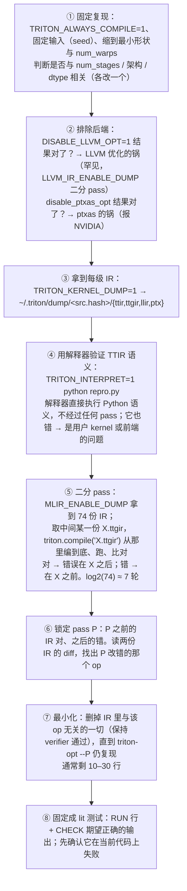

前十二篇讲机制。这一篇讲**手**：读懂了 Triton 编译器之后，怎样在自己的机器上改它、测它、定位它的错误。本系列所有真实 IR 都是在一台没有 GPU 的 Mac 上跑出来的——`triton-opt`、lit 测试、C++ 单元测试、从 Python 一路编到 PTX、AMD 的 ISA——这些工具的组合就是编译器开发者日常的工作台，GPU 只在最后一步（跑 cubin）才需要。

总纲对这一篇提出的核心问题是：

> **一个用户报告"某个形状的 kernel 结果错误"。从这个 Python 复现脚本出发，怎样在半小时内定位到是哪个 pass 引入的错误，并把它固定成一个 20 行的 lit 测试？[^q0]**

## 一、总览

| 章 | 主题 | 内容 |
|---|---|---|
| 二 | 搭工作台 | 构建 Triton 编译器（含 macOS）；三层测试各怎么跑；`triton-opt` 在哪 |
| 三 | 看 IR | `MLIR_ENABLE_DUMP` 的 148 次 dump；`triton-opt --mlir-print-ir-after-all`；`TRITON_KERNEL_DUMP`；LLVM / PTX 层的对应开关 |
| 四 | 定位一个错误 | 二分法：从 Python 到 pass；`triton.compile("x.ttgir")`；override；`--run-reproducer`；解释器 |
| 五 | 写一个 lit 测试 | `RUN` 行、`FileCheck` 与 `expected-remark`；最小化原则；两个真实例子 |
| 六 | 改编译器 | 加一个 pass 的完整清单；加一条 pattern；改 layout 相关代码时用什么验证；C++ 单元测试 |
| 七 | 读别人的改动 | Triton PR 的解剖；CODEOWNERS 与设计原则；跟上游 LLVM |
| 八 | 本文小结 | |
| 九 | 自测 | 5 道题 |

## 二、搭工作台

### 1. 构建

Triton 的编译器部分（C++、MLIR、LLVM）可以在**任何**有 C++ 编译器的机器上构建，包括 macOS-arm64：官方为每个 LLVM pin 提供预编译包（`cmake/llvm-info.json` 里每个平台一个 sha256），`pip install -e .` 时自动下载到 `~/.triton/llvm/`。

```bash
git clone https://github.com/triton-lang/triton && cd triton && git checkout v3.8.0
python3.12 -m venv .venv && source .venv/bin/activate
pip install -r python/requirements.txt          # cmake<4、ninja、pybind11、lit
TRITON_BUILD_PROTON=OFF pip install -e . -v     # 约 10–20 分钟（M 系列），463 个编译单元
```

本系列写作时遇到的两个 macOS 特有问题及解法：

- **`ptxas` 下载失败**：`CMakeLists.txt` 的 `download_and_copy_dependencies` 会从 NVIDIA 下载 `cuda_nvcc`（含 `ptxas`）、`cuda_cuobjdump`、`cuda_nvdisasm` 与 `cuda_cudart`；网络不通时用 `TRITON_PTXAS_PATH` / `TRITON_CUOBJDUMP_PATH` / `TRITON_NVDISASM_PATH` / `TRITON_CUDACRT_PATH` / `TRITON_CUDART_PATH` 指向任意已有路径跳过下载（`build_helpers.py::download_and_copy` 见 override 就不下）。
- **没有真的 `ptxas`**：`compile()` 在 `make_cubin` 会调它。写一个假 `ptxas` 脚本——对 `--version` 回答 `Cuda compilation tools, release 12.9, V12.9.86`（`NvidiaTool.from_path` 用正则 `release (\d+\.\d+)` 解析），其余情况 `touch` 输出文件——就能把 `ttir → ttgir → llir → ptx` 四级全部跑通，`cubin` 是 0 字节。第五篇起所有 dump 都这样来的。AMD 路径连这个都不需要：`hsaco` 由进程内的 LLVM 与 lld 产出。

产物：`python/triton/_C/libtriton.so`（Python 绑定 + 全部 pass）、`build/cmake.<platform>/bin/triton-opt`、`triton-tensor-layout`、`triton-llvm-opt`、`triton-lsp`（编辑器用的 MLIR 语言服务器）、`unittest/**` 下的 gtest 二进制。`make triton-opt`（`ninja -C $(BUILD_DIR) triton-opt`）只重建这一个工具，改一个 pass 之后 20 秒内能用。

### 2. 三层测试

| 层 | 位置 | 跑法 | 需要 GPU | 耗时（本机） |
|---|---|---|---|---|
| lit（IR 级） | `test/**/*.mlir`（277 个文件） | `lit build/cmake.*/test`；单个：`lit -v build/cmake.*/test/TritonGPU/combine.mlir` | 否 | 9.5 s 全部 |
| C++ 单元测试 | `unittest/` | `build/cmake.*/unittest/Tools/LinearLayout`（72 个）、`unittest/Dialect/TritonGPU/LinearLayoutConversions`（112 个） | 否 | 毫秒 |
| Python 端到端 | `python/test/unit/**` | `pytest -s --tb=short python/test/unit/language/test_core.py::test_dot` | **是**（`TRITON_INTERPRET=1` 时部分不需要） | 分钟到小时 |

`Makefile` 把它们包成 `make test-lit`、`make test-cpp`、`make test-unit`，`make test-nogpu` = 前两者。lit 的版本要与 LLVM pin 匹配：Homebrew 的 `lit 23` 拒绝 Triton 的 `lit.cfg.py`（`execute_external` 在 LLVM 23 弃用），`pip install 'lit<20'` 即可。

`lit` 做的事：读每个 `.mlir` 开头的 `// RUN:` 行，把 `%s` 换成文件路径、`triton-opt` 换成构建目录里的二进制，起子进程执行，非零退出即失败。`FileCheck` 与 `-verify-diagnostics` 是两种断言方式（§五）。

## 三、看 IR

### 1. 从 Python：`MLIR_ENABLE_DUMP`

```bash
MLIR_ENABLE_DUMP=1 TRITON_ALWAYS_COMPILE=1 python my_kernel.py 2> dump.log
```

对 `sm_80` 的一个 kernel，`dump.log` 里有 **74 次** `IR Dump Before …`（每个 pass 之前一次；`MLIR_ENABLE_DUMP=<kernel 名>` 只 dump 那个 kernel）。按顺序去掉重复就是 `make_ttir` + `make_ttgir` + `make_llir` 的完整 pass 表：

```text
InlinerPass CanonicalizerPass TritonRewriteTensorDescriptorToPointer CanonicalizerPass TritonCombineOps TritonReorderBroadcast CSEPass SymbolDCEPass TritonLoopUnroll                                                                      ← make_ttir（第五篇）
ConvertTritonToTritonGPU TritonGPUCoalesce TritonGPUF32DotTC TritonGPUPlanCTAPass TritonGPURemoveLayoutConversions TritonGPUOptimizeThreadLocality TritonGPUAccelerateMatmul TritonGPURemoveLayoutConversions TritonGPUOptimizeDotOperands CanonicalizerPass                          ← 第七、八篇
TritonNvidiaGPUOptimizeDescriptorEncodingPass TritonLoopAwareCSE TritonGPUFuseNestedLoops CanonicalizerPass TritonLoopInvariantCodeMotion CanonicalizerPass TritonGPUCombineTensorSelectAndIf NVGPUWarpSpecialization TritonGPUAssignLatencies TritonGPUScheduleLoops TritonGPUPipeline CanonicalizerPass TritonLoopAwareCSE TritonGPUPrefetch TritonGPUOptimizeDotOperands CanonicalizerPass TritonGPUCoalesceAsyncCopy TritonNvidiaGPUOptimizeTMemLayoutsPass TritonNvidiaGPUFuseTMEMLoadReducePass TritonGPURemoveLayoutConversions TritonNvidiaGPUInterleaveTMemPass TritonGPUReduceDataDuplication TritonGPUReorderInstructions TritonLoopAwareCSE SymbolDCEPass TritonGPUFenceInsertion TritonNvidiaGPUMMALoweringPass SCCPPass CSEPass CanonicalizerPass   ← 第九篇
TritonGPUCombineTensorSelectAndIf TritonGPUAllocateWarpGroups SCFToControlFlowPass GluonInline AllocateSharedMemoryNv TritonTensorMemoryAllocationPass TritonNvidiaGPUCheckMatmulTwoCTAPass TritonGPUProxyFenceInsertion TritonNvidiaGPUTMemBarrierInsertionPass ConvertTritonGPUToLLVM InitializeWSClusterBarriers CanonicalizeLLVMIR CSEPass ConvertWarpSpecializeToLLVM ReconcileUnrealizedCastsPass ConvertNVGPUToLLVM CanonicalizerPass CSEPass SymbolDCEPass ConvertNVVMToLLVMPass LLVMDIScope   ← 第十篇
```

`MLIR_DUMP_PATH=<dir>` 把每个 pass 的 IR 写成单独文件而不是混在 stderr；`MLIR_ENABLE_TIMING=1` 打每个 pass 的耗时；`MLIR_ENABLE_DIAGNOSTICS=warnings,remarks,stacktraces` 让 `emitRemark` 的信息（"MMA version 3 acceleration not applied…"、"Pipelining load that cannot use vectorized copy…"）显示出来——**默认 remark 是静音的**，很多"为什么编译器没做 X"的答案在这里。

### 2. 从 `triton-opt`

拿到某一级的 IR 文件（`TRITON_KERNEL_DUMP=1` 的 `~/.triton/dump/<hash>/*.ttgir`，或 `k.asm["ttgir"]`），用 `triton-opt` 跑任意 pass 子集：

```bash
triton-opt kernel.ttir --convert-triton-to-tritongpu="target=cuda:80 num-warps=4 threads-per-warp=32 num-ctas=1" -o a.ttgir
triton-opt a.ttgir --tritongpu-coalesce --tritongpu-remove-layout-conversions --mlir-print-ir-after-all 2> steps.log
triton-opt a.ttgir --tritongpu-accelerate-matmul --mlir-print-ir-after-failure   # 只在失败时打印
triton-opt x.ttgir --allocate-shared-memory --convert-triton-gpu-to-llvm=compute-capability=80   # 第十篇的实验
```

命令行名与 `compiler.py` 里的 `passes.ttgpuir.add_xxx` 一一对应（第四篇 §七）。`--mlir-print-op-generic` 看通用形式，`--mlir-print-debuginfo` 看 `loc`，`--mlir-disable-threading` 让崩溃栈可读。`triton-opt --help | rg tritongpu` 列出全部 pass 与选项。

调试构建（`TRITON_BUILD_WITH_CCACHE`、`DEBUG=1 pip install -e .`，或 CMake `-DCMAKE_BUILD_TYPE=Debug`）多出两样：`-debug-only=tritongpu-coalesce`（每个 pass 用 `LDBG(...)` 打的内部日志——`Coalesce.cpp` 打 order、perThread 的每一步，`RemoveLayoutConversions.cpp` 打代价模型的两个数），Python 侧对应 `TRITON_LLVM_DEBUG_ONLY=tritongpu-coalesce`；以及 MLIR 的 `-debug-only=greedy-rewriter`（每条 pattern 的 `notifyMatchFailure` 原因）。发行版 wheel 没有这些。

### 3. 更低的层

| 层 | 开关 / 工具 | 看什么 |
|---|---|---|
| LLVM IR 优化 | `LLVM_IR_ENABLE_DUMP=1`（每个 LLVM pass 之后）；`DISABLE_LLVM_OPT=1` 或 `=flag1,flag2` | `-O3` 改了什么；关掉某个 LLVM 优化排除嫌疑 |
| PTX | `NVPTX_ENABLE_DUMP=1`；`k.asm["ptx"]` | `.reg` 数、`ld.global.v4`、`mma.sync`、`bar.sync` 数 |
| ptxas | `TRITON_DUMP_PTXAS_LOG=1`；`disable_ptxas_opt` / `TRITON_DISABLE_PTXAS_OPT` | 寄存器、spill、`ptxas` 的警告 |
| SASS | `TRITON_KERNEL_DUMP=1` 自动生成 `.sass`（`cuobjdump -sass`）；`nvdisasm` | 最终指令、寄存器编号、`STL / LDL`（spill 的痕迹） |
| AMD | `AMDGCN_ENABLE_DUMP=1`；`k.asm["amdgcn"]` 末尾的 `; NumVgprs / ScratchSize / Occupancy` | 无需加载即知寄存器与 spill |
| layout | `triton-tensor-layout -l "<attr>" -t "tensor<…>"`（`--use-hw-view`） | 任意 layout 的线程 ↔ 元素表（第七篇） |
| 性能 | Proton（`proton` 命令，`TRITON_BUILD_PROTON`）、Nsight Compute + `-lineinfo`（默认开）+ `USE_IR_LOC=ttgir` | SASS 行对回 Python / TTGIR 行 |

## 四、定位一个错误

### 1. 二分：从 Python 到 pass

回答核心问题。用户给了 `repro.py`：某个 `(M, N, K)` 下 `matmul_kernel` 的结果与 `torch.matmul` 不符。步骤：



几个关键工具的细节：

- **`triton.compile("X.ttgir")`**（第十一篇 §二）：`IRSource` 从该阶段**之后**继续。要能把中间 IR 编到底，IR 必须是某个阶段边界（`ttgir` 边界是 `make_ttgir` 结束）；pass 中间的 IR 不能直接用 `compile()`，但可以先用 `triton-opt` 把剩余的 `make_ttgir` pass 跑完（按 §三.1 的表接着跑），再交给 `compile()`。或者用 **override**：`TRITON_KERNEL_OVERRIDE=1` 加 override 目录里的 `X.ttgir`，`compile()` 在 `ttgir` 阶段用你的文件替换产物——适合"手改一处再跑"。
- **`TRITON_INTERPRET=1`**：`python/triton/runtime/interpreter.py` 用 numpy 逐 op 解释 TTIR 语义（每个 `tl.*` 函数有 numpy 实现），CPU 上跑、可以 `print` 与 `pdb`。它是"编译器错还是 kernel 错"的分界线。
- **崩溃的复现**：pass 崩溃时 MLIR 打印一个 reproducer（含 `{-# external_resources: { mlir_reproducer: { pipeline: "...", ... } } #-}` 元数据）；保存成 `.mlir`，`triton-opt repro.mlir --run-reproducer` 用同样的 pipeline 重跑——Triton 自己的 `AGENTS.md` 把这条写成了给编码代理的规则。
- **verifier 报错**：`error: 'tt.dot' op operand … layout mismatch` 这类错误在 pass 之后的 `-verify-each` 处报出（第三篇 §五.2），报错位置就是出错的 pass；`--mlir-print-ir-after-failure` 给出当时的 IR。
- **结果错但不崩**是最难的，二分是唯一可靠的办法；两份 IR 的 diff 里通常只有几个 op 不同——用 `--mlir-print-ir-after-change` 只看改动的 pass 减少噪音。

### 2. 一个例子的量级

本系列第八篇的 `convert_layout` 计数（23 → 3 → 7 → 3）就是这个流程的一半：`after_coalesce.ttgir` 逐 pass 跑 `triton-opt`、每一步 `rg -c convert_layout`。若某一步结果错了，`diff` 前后两份 IR、删无关行、写 lit——整个流程在没有 GPU 的机器上可以做到第 ⑦ 步；只有 ④ ⑤ 的"跑、比对"需要 GPU（或用解释器替代 ④）。半小时是熟练之后的量级，第一次做一小时。

## 五、写一个 lit 测试

### 1. 两种断言

**`FileCheck`**：跑 pass、把输出喂给 `FileCheck`，按 `CHECK` 行匹配：

```mlir
// RUN: triton-opt %s -tritongpu-remove-layout-conversions | FileCheck %s
#layout0 = #ttg.blocked<{sizePerThread = [1], threadsPerWarp = [32], warpsPerCTA = [4], order = [0]}>
#layout1 = #ttg.blocked<{sizePerThread = [4], threadsPerWarp = [32], warpsPerCTA = [4], order = [0]}>
module attributes {"ttg.num-warps" = 4 : i32, "ttg.num-ctas" = 1 : i32} {
// CHECK-LABEL: @range
tt.func @range() -> tensor<1024xi32, #layout1> {
  %0 = tt.make_range {end = 1024 : i32, start = 0 : i32} : tensor<1024xi32, #layout0>
  %1 = ttg.convert_layout %0 : tensor<1024xi32, #layout0> -> tensor<1024xi32, #layout1>
  // CHECK-NOT: ttg.convert_layout
  // CHECK: tt.return %0 : tensor<1024xi32, #blocked
  tt.return %1: tensor<1024xi32, #layout1>
}
}
```

`CHECK-LABEL` 锚定函数、`CHECK` 顺序匹配、`CHECK-NOT` 断言两个 `CHECK` 之间不出现、`CHECK-NEXT` 紧邻下一行、`CHECK-DAG` 无序、`CHECK: %[[A:.+]] = …` 捕获 SSA 名再 `%[[A]]` 引用（`combine.mlir` 里的 `@remat`）、`CHECK-SAME` 同一行继续。输出里的属性别名是 `#blocked`、`#blocked1`……（打印器分配的），源文件里的 `#layout1` 不会出现在输出里——所以 `CHECK` 写 `#blocked`，或用 `// CHECK: [[$L:#.*]] = #ttg.blocked<{sizePerThread = [4]…` 先捕获别名。

**`-verify-diagnostics` + `expected-remark`**：pass 通过 `emitRemark` 报告分析结果，测试声明期望的 remark，MLIR 逐条核对——多一条、少一条、内容不同都失败。AxisInfo 的 `test-alignment.mlir` 全用它：


```mlir
// RUN: triton-opt %s -split-input-file -test-print-alignment -verify-diagnostics -o /dev/null
module {
  tt.func @splat_plus_range(%pid: i32 {tt.divisibility = 16 : i32}) {
    // expected-remark @below {{contiguity = [1], divisibility = [1024], constancy = [1], constant_value = 1024}}
    %c1024 = arith.constant 1024 : i32
    // expected-remark @below {{contiguity = [1], divisibility = [16384], constancy = [1], constant_value = <none>}}
    %0 = arith.muli %pid, %c1024 : i32
    // expected-remark @below {{contiguity = [1024], divisibility = [1073741824], constancy = [1], constant_value = <none>}}
    %1 = tt.make_range {end = 1024 : i32, start = 0 : i32} : tensor<1024xi32>
    // expected-remark @below {{contiguity = [1], divisibility = [16384], constancy = [1024], constant_value = <none>}}
    %2 = tt.splat %0 : i32 -> tensor<1024xi32>
    // expected-remark @below {{contiguity = [1024], divisibility = [1024], constancy = [1], constant_value = <none>}}
    %3 = arith.addi %2, %1 : tensor<1024xi32>
    tt.return
  }
}
```


这 16 行就是第六篇核心问题的可执行版本。写它时漏掉了 `%c1024` 那条 remark，`triton-opt` 报 `error: unexpected remark: %c1024_i32 = arith.constant 1024 : i32 => …`——**测试框架逼你把每个值的分析结果都写出来**，这正是它作为文档的价值。把 `divisibility = [1024]` 故意改成 `[512]`，报 `expected remark "…" was not produced` 加一条 `unexpected remark`——两个方向都会抓。

### 2. 最小化原则

Triton 的 PR 模板要求 lit 测试遵守 MLIR 的 [FileCheck best practices](https://mlir.llvm.org/getting_started/TestingGuide/#filecheck-best-practices)，特别是 "tests should be minimal"，并明说 "Usually running Python code and using the instructions it generates is not minimal"。从 dump 出来的几百行 TTGIR 缩到 20 行的手法：

1. 只保留出错 pass 的**输入**层级的 IR（不是 TTIR 从头编）；
2. 删掉与目标 op 无数据依赖的所有 op（用 `-symbol-dce`、`-canonicalize` 自动删死代码，再手删）；
3. 把 load 出来的值换成函数参数（`tt.func @f(%a: tensor<…, #layout>)`——`RemoveLayoutConversions` 把函数参数当锚点正是为了方便写测试，第八篇 §二.2）；
4. 把 shape 缩到能复现的最小 2 的幂；`num_warps` 缩到 1 或 2；
5. `-split-input-file` + `// -----` 分隔符让一个文件放多个独立用例，共享 `#layout` 定义要在每段里重写。

一个好的 lit 测试同时是**规格**：读 `combine.mlir` 的 60 个用例比读 `RemoveLayoutConversions.cpp` 更快知道它承诺做什么、不做什么。

## 六、改编译器

### 1. 加一个 pass 的清单

第四篇 §七 的链，反过来就是操作步骤：

| 步 | 文件 | 内容 |
|---|---|---|
| 1 | `include/triton/Dialect/TritonGPU/Transforms/Passes.td` | `def TritonGPUMyPass : Pass<"tritongpu-my-pass", "mlir::ModuleOp"> { summary; description; dependentDialects; options }` |
| 2 | `lib/Dialect/TritonGPU/Transforms/MyPass.cpp` | `#define GEN_PASS_DEF_TRITONGPUMYPASS` + `#include "…/Passes.h.inc"`；`struct MyPass : impl::TritonGPUMyPassBase<MyPass> { void runOnOperation() override; }` |
| 3 | 同目录 `CMakeLists.txt` | 把 `.cpp` 加进 `add_triton_library(TritonGPUTransforms …)` |
| 4 | `python/src/passes.cc` | `ADD_PASS_WRAPPER_0("add_my_pass", createTritonGPUMyPass)`（带选项用 `_1` / `_2`） |
| 5 | `third_party/nvidia/backend/compiler.py`（与 `amd`） | 在 `make_ttgir` 合适的位置 `passes.ttgpuir.add_my_pass(pm)` |
| 6 | `test/TritonGPU/my-pass.mlir` | lit 测试：`// RUN: triton-opt %s -tritongpu-my-pass \| FileCheck %s` |
| 7 | — | `make triton-opt && lit -v build/…/test/TritonGPU/my-pass.mlir`；再 `make` 全量、跑相关 pytest |

`triton-opt` 通过 `registerTritonGPUPasses()`（`bin/RegisterTritonDialects.h`）自动认识新 pass——`Passes.td` 生成的 `registerXxx` 被它调用，不用改 `triton-opt.cpp`。开发期不想每次全量 `make`：把 pass 编成插件（第四篇 §三.5），`triton-opt --load-pass-plugin`（`test/Plugins/` 有例子）。

### 2. 加一条 pattern

改写类的小改动多数不需要新 pass，而是往已有 pass 的 pattern 集里加一条（`Combine.cpp` 的 `populate…Patterns`、`ConvertLayoutOp::getCanonicalizationPatterns`）。纪律：所有修改经 `rewriter`（第四篇 §三.1）；先 `notifyMatchFailure` 排除不匹配的情况再改写；为每个分支写 lit 用例（匹配的、不匹配的各一个，`CHECK-NOT` 断言不匹配时没动）。`-debug-only=greedy-rewriter`（调试构建）看你的 pattern 为什么没命中。

### 3. 改 layout 相关代码

第七篇的 Linear Layout 与第十篇的 lowering 是最容易改错又最难用 lit 测出的地方——lit 只能断言 IR 文本，不能断言"这个 layout 转换生成的代码语义正确"。三层验证：

1. **C++ 单元测试**：`unittest/Tools/LinearLayoutTest.cpp`（65 个 `TEST_F`：`compose`、`invertAndCompose`、`quotient`、`reshape`……直接构造基向量表断言结果）与 `unittest/Dialect/TritonGPU/LinearLayoutConversionsTest.cpp`（112 个：每种 `#blocked` / `#mma` / `#dot_op` / shared 参数组合 → 期望的基向量表）。新 layout 或改转换函数，先在这里加用例——毫秒级、无 GPU。
2. **`triton-tensor-layout`** 肉眼核对小 shape 的线程表。
3. **Python 端到端**：`python/test/unit/language/test_core.py` 的 `test_convert2d` 等参数化用例（几百种 layout 对），需要 GPU；`TRITON_INTERPRET=1` 对 layout 无效（解释器没有 layout）。

### 4. 改前端

`code_generator.py` / `semantic.py` 的改动用 `python/test/unit/language/` 的 pytest；TTIR 级的行为可以用 `triton.compile` 在无 GPU 机器上拿 `k.asm["ttir"]` 断言（`test_filecheck.py` 提供了在 pytest 里跑 FileCheck 的 helper——用 Python 生成 IR 再用 `CHECK` 断言，适合前端）。

## 七、读别人的改动

### 1. Triton PR 的解剖

一个典型的编译器 PR（以 layout 或 pipeline 改动为例）由四部分组成，读的顺序建议倒过来：

1. **lit 测试的 diff**（`test/**/*.mlir`）：新增或改变的 `CHECK` 行**就是行为变化的精确陈述**——先读它，知道"改动前输出 A、改动后输出 B"。
2. **`Passes.td` / `*.td` 的 diff**：有没有新 op、新属性、新选项——接口变化。
3. **C++ 的 diff**：实现。有了 1 和 2，这部分是"怎么做到的"而不是"做了什么"。
4. **`compiler.py` 的 diff**：pass 顺序变了没有——顺序改动的影响面最大（第八篇的两次 `RemoveLayoutConversions` 夹着 `AccelerateMatmul` 就是顺序敏感的例子）。

PR 描述按模板要求写"为什么"（链接到 cbea.ms 的 commit 规范），并声明测试层级（`/test`、`/unittest`、`/python/test` 三选一或说明为何不需要）。`CODEOWNERS` 把 `lib/Dialect/TritonGPU/Transforms/Pipeliner/`、`third_party/nvidia/`、`third_party/amd/`、`python/triton/experimental/gluon/` 等目录分给不同维护者——看一个 PR 由谁 review 就知道它属于哪个子系统。`CONTRIBUTING.md` 的设计原则一句话："functional bug fixes … with minimized unit tests" 总是接受；性能改动要看"usefulness 与 complexity 的权衡"；"design changes that neither fix known functional nor performance issues are automatically considered controversial"。

### 2. 跟上游 LLVM

Triton 每隔几周把 `cmake/llvm-info.json` 的 `llvm_hash` 推进到 LLVM main 的新 commit（"LLVM bump" PR）。这类 PR 的 diff 几乎全是 API 适配：MLIR 的 builder 签名（`rewriter.create<Op>` → `Op::create(rewriter, …)`，3.8 已完成这次迁移）、属性从 `!nvvm.annotations` 迁到函数属性、`ConversionPatternRewriter` 的行为变化。读它们是了解 MLIR API 演化最直接的途径；自己改 Triton 时以当前 pin 的 API 为准（`~/.triton/llvm/llvm-<hash>/include/mlir/`），不要看 Homebrew 版 LLVM 的头文件——两者可能差几个月。第二篇 §三.3 提到的"3.8 release only" hack（关掉 `slp-copyable-elements`）就是 pin 与 `ptxas` 之间不同步的补丁，下一个 bump 会删掉。

## 八、本文小结

1. Triton 编译器可在 macOS 上构建；预编译 LLVM 自动下载；NVIDIA 工具下载可用 `TRITON_*_PATH` 跳过，假 `ptxas` 让 `compile()` 跑到 PTX；AMD 路径无需任何外部工具。`make triton-opt` 增量 20 秒。
2. 三层测试：lit（277 个文件、9.5 秒、无 GPU）、gtest（LinearLayout 72 + 转换 112、毫秒）、pytest（GPU，解释器可替代部分）。lit 版本需 < 20。
3. 看 IR：`MLIR_ENABLE_DUMP` 每 pass 一份（sm_80 一个 kernel 74 份，完整 pass 表在此）、`MLIR_ENABLE_DIAGNOSTICS` 打开被静音的 remark；`triton-opt` 任意 pass 子集 + `--mlir-print-ir-after-all/-failure/-change`；调试构建的 `-debug-only`；LLVM / PTX / ptxas / SASS / AMD 各有开关。
4. 定位错误：固定复现 → 排除 LLVM / ptxas → dump 每级 IR → 解释器判定编译器还是 kernel → 用 `triton.compile("X.ttgir")` 或 override 二分 74 份 IR（7 轮）→ 锁定 pass、diff → 最小化 → 写 lit 并确认先失败。崩溃用 `--run-reproducer`。
5. lit 的两种断言：`FileCheck`（`CHECK` / `-LABEL` / `-NOT` / `-NEXT` / `-DAG` / 捕获）与 `-verify-diagnostics` + `expected-remark`（AxisInfo 用；逼你写全每个值）。最小化：从出错 pass 的输入层级起、删无关 op、load 换函数参数、缩 shape、`-split-input-file`。
6. 加 pass 七步（`Passes.td` → `.cpp` → CMake → `passes.cc` → `compiler.py` → lit → 全量测试）；加 pattern 守 rewriter 纪律、正反用例；layout 改动先过 C++ 单元测试再肉眼核 `triton-tensor-layout`，端到端需 GPU。
7. 读 PR 倒序：lit diff（行为）→ `.td`（接口）→ C++（实现）→ `compiler.py`（顺序）；CODEOWNERS 定子系统；LLVM bump PR 是学 MLIR API 演化的材料，以 pin 的头文件为准。

## 九、自测

1. `MLIR_ENABLE_DUMP=1` 对一个 Gluon kernel 会 dump 多少个 pass？为什么比 `tl` kernel 少得多？

   <details markdown="1"><summary>答案</summary>
   `make_ttir` 不存在（Gluon 直接生成 TTGIR）；`make_ttgir` 走 `is_gluon` 分支，只有 inliner、canonicalizer、`resolve_auto_encodings`、`allocate_warp_groups` 等几个不改 layout 的 pass（第九篇 §七.3）；`make_llir` 与 `tl` 相同（约 20 个）。总数约 25–30，而 `tl` kernel 74。少的正是 Coalesce、RemoveLayoutConversions、AccelerateMatmul、Pipeline、WarpSpecialization 等全部自动决策 pass。
   </details>

2. 你手改了 dump 出来的 `X.ttgir`（删掉一个 `convert_layout`、把两端 layout 改成一致），想验证性能。用哪条路径最快把它跑起来？会在哪一步被拒绝？

   <details markdown="1"><summary>答案</summary>
   `TRITON_KERNEL_OVERRIDE=1`，把文件放到 `~/.triton/override/<src.hash>/<kernel>.ttgir`（目录名用 `TRITON_KERNEL_DUMP` 时的同名目录），再跑原来的 Python 脚本——`compile()` 在 `ttgir` 阶段用你的文件替换产物，后续 `make_llir` 起照常，launcher 与调用代码不变。可能被拒绝的地方：`parse()` 时 verifier（layout 不一致、类型不匹配——比如你改了 load 的 layout 但没改它的 ptr 操作数）；`make_llir` 里的 `AllocateSharedMemory` / `Membar` 不会拒绝，但删掉必要的 `convert_layout` 会让 `TritonGPUToLLVM` 的某个 pattern 报 "failed to legalize"（例如 `dot` 操作数不是 `#dot_op`）。注意缓存 key 不含 override 目录的内容——改了文件要 `TRITON_ALWAYS_COMPILE=1`。
   </details>

3. 一条你新加的 canonicalization pattern 在 lit 测试里不触发，但你确信形状匹配。列出三个最可能的原因与各自的排查手段。

   <details markdown="1"><summary>答案</summary>
   (1) pattern 没注册进该 pass 的 `RewritePatternSet`（或注册到了另一个 op 的 `getCanonicalizationPatterns`）——在 `matchAndRewrite` 开头加 `LDBG` / `llvm::errs()` 看是否被调用。(2) 匹配条件比想象的严：`matchPattern(…, m_Constant())` 对 `arith.constant dense<…>` 的张量常量与标量常量行为不同、`getDefiningOp<T>()` 遇到中间的 `convert_layout` 返回空（第五篇 §六.2 的 `addptr` 隔着 `broadcast` 就是此类）——调试构建 `-debug-only=greedy-rewriter` 看 `notifyMatchFailure` 的原因。(3) 另一条 benefit 更高的 pattern 先改写了同一个 op（或 `fold` 先动了手），你的 pattern 看到的已经不是原形状——`--mlir-print-ir-after-all` 与 `-debug-only=greedy-rewriter` 的顺序日志。
   </details>

4. 为什么 AxisInfo 的测试用 `-verify-diagnostics` + `expected-remark` 而不是 FileCheck？这种方式的代价是什么？

   <details markdown="1"><summary>答案</summary>
   AxisInfo 是分析而不是变换，pass 不改 IR，FileCheck 没有"输出"可匹配；`test-print-alignment` 用 `emitRemark` 把每个值的格元素挂到 op 的位置上，`-verify-diagnostics` 逐条核对期望——断言的粒度正好是"每个值的分析结果"，且多出的 remark 也报错，防止分析悄悄扩大范围。代价：每个有结果的 op 都必须写期望（哪怕是常量），测试冗长；期望字串是完整的四元组文本，分析的打印格式一变全部测试要改；无法用正则或部分匹配。
   </details>

5. 你要给 Triton 加一个新的分布式 layout（比如某个新硬件的 MMA 输出布局）。按本系列的知识，列出必须改动的文件与必须补的测试。

   <details markdown="1"><summary>答案</summary>
   文件：`TritonGPUAttrDefs.td`（`AttrDef`，参数、`mnemonic`、`DistributedEncoding` 基类、`genVerifyDecl`）；`lib/Dialect/TritonGPU/IR/Dialect.cpp`（`verify`、parse / print、`DistributedEncodingTrait` 的接口方法）；`LinearLayoutConversions.cpp`（`toLinearLayout`——最核心的一处，之后转换代价判定、`emitIndices`、`reduce` 三级、`convert_layout` 三条路全自动可用）；`AccelerateMatmul.cpp` 或对应 pass 让某个 op 选到这个 layout；若有专用指令则 `TritonGPUToLLVM` 里加 lowering pattern（`DotOpToLLVM/`）；`python/src/ir.cc` 若要从 Python / Gluon 构造它则加绑定，Gluon 的 `_layouts.py` 加类。测试：`LinearLayoutConversionsTest.cpp` 加基向量表用例（无 GPU、最先写）；`test/TritonGPU/` 加该 layout 出现的 lit（`accelerate-matmul.mlir` 风格）；`test/Conversion/` 加 lowering 的 lit；`triton-tensor-layout` 核对；最后 `test_core.py` 的 `convert2d` 参数化加入它，GPU 上跑。
   </details>

## 下一篇

系列总结与通关自测：把十三篇的每一站压成一张表——每一站的输入 IR、输出 IR、关键分析、可观察的开关；重答总纲提出的十四个问题；然后是一套跨篇的综合题：给一段 Triton kernel 与它的 TTGIR / PTX，指出每一个编译决定是哪个 pass 凭什么信息做的。

[^q0]: 八步，前七步不需要 GPU 也能做大半。① 固定复现（`TRITON_ALWAYS_COMPILE=1`、固定输入、缩形状），改 `num_stages` / dtype / `num_warps` 各一次看是否相关。② 排除后端：`DISABLE_LLVM_OPT=1` 或 `disable_ptxas_opt` 让结果变对则不是 Triton 的 pass。③ `TRITON_KERNEL_DUMP=1` 拿每级 IR。④ `TRITON_INTERPRET=1` 跑解释器——它绕过全部 pass，也错就是 kernel / 前端问题。⑤ `MLIR_ENABLE_DUMP=1` 拿 74 份逐 pass 的 IR，取中点 X：用 `triton-opt` 把 `make_ttgir` 剩余 pass 跑完（或直接是阶段边界）后 `triton.compile("X.ttgir")` 编到底跑一次比对，对则错误在 X 之后、错则在之前，约 7 轮锁定 pass P。⑥ diff P 前后的 IR 找出改错的 op。⑦ 最小化：只保留 P 的输入层级 IR，删无数据依赖的 op、load 换成带 layout 的函数参数、缩 shape 与 `num_warps`，直到 `triton-opt --P` 仍复现且 verifier 通过，通常 10–30 行。⑧ 写 lit：`// RUN: triton-opt %s -P | FileCheck %s`，`CHECK` 写**正确**的期望，确认在当前代码上失败、修复后通过；分析类错误用 `-verify-diagnostics` + `expected-remark`。崩溃类错误另有捷径：保存 MLIR 打印的 reproducer，`triton-opt repro.mlir --run-reproducer`。详见[第四章](#四定位一个错误)与[第五章](#五写一个-lit-测试)。
