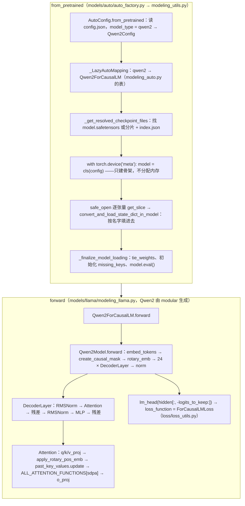

> **版本说明：**本文对着 **transformers 5.17.0**（2026-09-09 发布）的源码读，配套脚本在 `ai-learning-labs/hf-source-reading/`，模型用本地缓存的 Qwen2.5-0.5B。文中的文件路径、类名、函数名以该版本为准，不引用行号；transformers 的目录结构改得很快，读别的版本时请以本地源码对照——找入口的方法不变。

[工具箱第五篇](/hugging-face-ecosystem-six-libraries-and-a-lora-sft.html)用六行代码组装了一次 LoRA SFT，第一行就是 `AutoModelForCausalLM.from_pretrained(name)`。那一篇把它当黑盒：进去一个 Hub 名字，出来一个 `nn.Module`。这一篇把黑盒打开：这个函数怎么根据 `config.json` 里的一个字段挑出 `Qwen2ForCausalLM` 这个类、怎么在不占内存的情况下先搭出骨架再把 `safetensors` 里的 290 个张量填进去、`forward` 从 `input_ids` 到 `loss` 经过哪几个文件、attention 那一行为什么能在 eager / SDPA / FlashAttention 之间切换而模型代码一个字不改。

读完这一篇，[L4 第一篇](/transformer-architecture-from-a-sentence-to-the-next-token.html)画的那张结构图上的每个方框，你都能在 `modeling_llama.py` 里指出是哪个类的哪几行；也能回答工程里最常见的三个问题：为什么加载 8B 模型时内存不会先冲到 32 GB、为什么 `attn_implementation="sdpa"` 与 `"eager"` 的结果差到 $$10^{-4}$$、`labels` 传进去之后 loss 是怎么算的。

本篇要回答的核心问题是：

> **`AutoModelForCausalLM.from_pretrained("Qwen/Qwen2.5-0.5B")` 这一行执行时，transformers 做了哪几步？之后 `model(input_ids, labels=labels)` 的一次前向，经过了哪些文件的哪些函数？[^q0]**

## 一、总览

### 1. 一次加载与一次前向的调用链



上半是加载，下半是前向。加载的六步里只有第五步真正读磁盘、占内存；前向的五步里，第三、四步就是 L4 第一篇那张图的一个 block，第五步是 L0 第五篇讲的交叉熵。整个 `transformers` 包有 518 个模型目录，但 decoder-only 语言模型几乎全是 `modeling_llama.py` 的变体——所以本文读 Llama 的文件，用 Qwen2.5-0.5B 跑。

### 2. 本文的章节安排

| 章 | 主题 | 内容 |
|---|---|---|
| 二 | Auto 类怎么选类 | `model_type` → 配置类 → 模型类的两张表；`_LazyAutoMapping` 为什么是惰性的；`trust_remote_code` 走的另一条路 |
| 三 | 权重怎么装进去 | 三个文件的解析；meta 设备上的骨架；`safe_open` 与 `get_slice`；名字映射与 `missing / unexpected keys`；`tie_weights`；`dtype` 与 `device_map` |
| 四 | 一个 block 的代码 | `LlamaRMSNorm`、`LlamaRotaryEmbedding` + `apply_rotary_pos_emb`、`LlamaMLP`、`LlamaDecoderLayer`——与 L4 第一篇的公式逐行对应 |
| 五 | attention 那一行 | `LlamaAttention.forward`；`ALL_ATTENTION_FUNCTIONS` 注册表；`eager_attention_forward` 与 `sdpa_attention_forward` 的差别；GQA 的 `repeat_kv`；mask 怎么造 |
| 六 | KV cache | `DynamicCache` 与 `DynamicLayer.update` 的 `torch.cat`；`get_seq_length` 怎么决定 `position_ids`；一次 prefill + 一次 decode 的形状 |
| 七 | 从 logits 到 loss | `LlamaForCausalLM.forward` 的 `logits_to_keep`；`loss_function` 的分派；`ForCausalLMLoss` 的 shift、`-100` 与 `num_items_in_batch` |
| 八 | modular：518 个模型怎么维护 | `modular_qwen2.py` 继承 Llama 的类，`modeling_qwen2.py` 是生成物；读一个新模型先读它的 modular 文件 |
| 九 | 本文小结 | |
| 十 | 自测 | 五道题 |

Table: 本文的章节安排

## 二、Auto 类怎么选类

### 1. 两张表

`AutoModelForCausalLM` 本身没有 `__init__`，它是 `models/auto/auto_factory.py` 里 `_BaseAutoModelClass` 的子类，类属性 `_model_mapping` 指向一张表。`from_pretrained` 做的第一件事是把 `config.json` 读成配置对象：

```python
# models/auto/auto_factory.py  _BaseAutoModelClass.from_pretrained（节选）
config, kwargs = AutoConfig.from_pretrained(pretrained_model_name_or_path, return_unused_kwargs=True, ...)
...
model_class = _get_model_class(config, cls._model_mapping)
return model_class.from_pretrained(pretrained_model_name_or_path, *model_args, config=config, **kwargs)
```

两张表都在 `models/auto/` 目录下，都是 `model_type` 字符串开头的有序字典：

| 表 | 文件 | 一行长什么样 | 作用 |
|---|---|---|---|
| `CONFIG_MAPPING_NAMES` | `configuration_auto.py` | `("qwen2", "Qwen2Config")` | `config.json` 里的 `"model_type": "qwen2"` → 配置类 |
| `MODEL_FOR_CAUSAL_LM_MAPPING_NAMES` | `modeling_auto.py` | `("qwen2", "Qwen2ForCausalLM")` | 配置类 → 这个任务头的模型类 |

Table: Auto 类依赖的两张表

`AutoModelForCausalLM`、`AutoModelForSequenceClassification`、`AutoModel` 各有自己的第二张表，第一张表共用。所以"一个 Hub 名字怎么变成一个类"只有一条链：**`config.json` → `model_type` → 配置类 → 查本任务头的表 → 模型类**。配套脚本打印这条链：

```text
model_type qwen2 -> Qwen2ForCausalLM | config class Qwen2Config
```

### 2. 为什么是惰性的

表里存的是字符串 `"Qwen2ForCausalLM"` 而不是类对象。`_LazyAutoMapping.__getitem__` 拿到配置类后，先在 `_reverse_config_mapping` 里查回 `model_type`，再用 `importlib` 只导入 `transformers.models.qwen2` 这一个子模块取出类。518 个模型目录如果在 `import transformers` 时全部导入，光是 Python 的模块加载就要几秒——惰性表让 `import transformers` 只花几百毫秒，用到哪个模型才导入哪个。读源码时的副作用是：**在 `AutoModelForCausalLM` 上"跳转到定义"跳不到 `Qwen2ForCausalLM`**，要先去 `modeling_auto.py` 查表，再打开对应目录。

### 3. `trust_remote_code` 是另一条路

如果 `config.json` 里有 `auto_map` 字段（例如 `"AutoModelForCausalLM": "modeling_foo.FooForCausalLM"`），并且调用方传了 `trust_remote_code=True`，`from_pretrained` 走的是 `dynamic_module_utils.get_class_from_dynamic_module`：从 Hub 仓库下载那个 `.py` 文件到 `~/.cache/huggingface/modules/`，`exec` 之后取类。这就是"模型仓库自带建模代码"的机制，也是安全边界：那段代码是任意的 Python。被 transformers 正式收录之前的新模型（DeepSeek-V3 刚发布时）都走这条路；收录之后 `model_type` 进了两张表，`trust_remote_code` 就不再需要。

## 三、权重怎么装进去

### 1. 三个文件的解析

`PreTrainedModel.from_pretrained`（`modeling_utils.py`，一个几百行的函数）先做文件解析：`_get_resolved_checkpoint_files` 按优先级找 `model.safetensors`，找不到再找 `model.safetensors.index.json`（分片：index 的 `weight_map` 字段是"参数名 → 在哪个分片文件"），都没有才退回 `pytorch_model.bin`。0.5B 是单文件 988 MB；8B 是四个分片加一个 index。工具箱第五篇画过 safetensors 的字节布局（8 字节头长 + JSON 头 + 数据区），这里用到的正是那个设计——JSON 头里有每个张量的 dtype、shape、字节偏移，**不读数据区就知道全部形状**。

### 2. 先搭骨架，不分配内存

接着是本文最值得记住的一段：

```python
# modeling_utils.py  PreTrainedModel.from_pretrained（节选）
model_init_context = cls.get_init_context(dtype, is_quantized, _is_ds_init_called, allow_all_kernels)
config = copy.deepcopy(config)
with ContextManagers(model_init_context):
    model = cls(config, *model_args, **model_kwargs)
```

`get_init_context` 返回的上下文里有 `torch.device("meta")`。在 meta 设备下调用 `Qwen2ForCausalLM(config)`，所有 `nn.Linear`、`nn.Embedding` 的 `__init__` 照常执行，但张量**只有形状和 dtype，没有存储**——494M 参数的模型此刻占 0 字节。这是为什么加载 8B 模型时进程内存不会先冲到 32 GB 再降下来：骨架不占内存，权重直接从文件填到目标设备。L1 工具箱第四篇算的"权重 16 GB"是加载完成后的数字，加载过程没有额外的峰值。

### 3. `safe_open`、`get_slice` 与按名字填

`_load_pretrained_model` 对每个 safetensors 文件调 `safe_open(file, framework="pt", device="cpu", backend="mmap")`，然后：

```python
for k in file_pointer.keys():
    merged_state_dict[k] = file_pointer.get_slice(k)  # don't materialize yet
```

`get_slice` 返回的还不是张量，是一个"切片句柄"——真正的读盘发生在 `core_model_loading.convert_and_load_state_dict_in_model` 把它赋给模型参数的那一刻，而且是 mmap：操作系统按页把文件映射进来，读到哪页才加载哪页。所以 290 个张量的加载在配套脚本里显示为 `Loading weights: 100% 290/290 [00:00<00:00, 7030 it/s]`——快到看不见，因为大部分字节还没真的读。

"按名字填"是 `state_dict` 的语义：文件里的键 `model.layers.0.self_attn.q_proj.weight` 对应模型里 `model.layers[0].self_attn.q_proj.weight` 这个属性路径（工具箱第三篇讲 `state_dict` 时说过键名从属性路径来）。两边对不上的键分三类，`from_pretrained` 结束后都在 `loading_info` 里：

| 类别 | 含义 | 典型原因 |
|---|---|---|
| `missing_keys` | 模型有、文件没有 | 换了任务头（用基座权重初始化一个分类模型，`score.weight` 缺）；这些参数走 `_initialize_missing_keys` 随机初始化 |
| `unexpected_keys` | 文件有、模型没有 | 反过来（用带 lm_head 的权重初始化 `AutoModel`）；直接忽略 |
| `mismatched_keys` | 名字对上、形状不对 | 改了 `vocab_size`；默认报错，`ignore_mismatched_sizes=True` 才放过 |

Table: 加载时三类对不上的键

5.x 新增的 `core_model_loading.py` 把"改名字"和"改形状"做成了可组合的 `WeightConverter`——例如把旧 checkpoint 里分开存的 q/k/v 三个矩阵拼成一个 `qkv_proj`（`Concatenate`），或把 GPT-2 风格的 `Conv1D` 权重转置成 `nn.Linear`（`Transpose`）。读某个模型加载报错时，先看它的 `_checkpoint_conversion_mapping`。

### 4. 收尾：绑权重、初始化、`eval()`

`_finalize_model_loading` 做三件事：把 `missing_keys` 从 meta 设备搬到真实设备并初始化；`tie_weights`——`LlamaForCausalLM._tied_weights_keys = {"lm_head.weight": "model.embed_tokens.weight"}`，当 `config.tie_word_embeddings` 为真时让两者共用同一块存储（配套脚本验证 `data_ptr` 相同；这就是 0.5B 的 `lm_head` 不在参数量里的原因）；最后 `model.eval()`。**`from_pretrained` 返回的模型默认是 eval 模式**，dropout 关着——训练前 Trainer 会调 `model.train()`，自己写循环的人常忘。

### 5. `dtype` 与 `device_map`

`dtype=torch.bfloat16` 在 `_get_dtype` 里决定：不传时 5.x 默认用 `config.json` 里的 `torch_dtype`（Qwen2.5 是 bf16），传 `"auto"` 同义。骨架在 meta 设备上就按这个 dtype 建，填权重时 safetensors 里的 bf16 直接拷贝，不经过 fp32。`device_map="auto"` 走 accelerate 的 `_get_device_map`：按各 GPU 的空闲显存把 `_no_split_modules = ["LlamaDecoderLayer"]` 声明的最小单元（一整层）分配到设备上，放不下的层去 CPU 或磁盘——这是单机多卡推理不写并行代码就能跑起 70B 的原因，代价是层间的设备拷贝（[Infra 03 系列](/deep-dive-into-pytorch.html)讲它与真正的张量并行的区别）。

## 四、一个 block 的代码

### 1. 与结构图对照

L4 第一篇的结构图（自下而上：embedding → N × [RMSNorm → attention → 残差 → RMSNorm → FFN → 残差] → 最后的 RMSNorm → lm_head）在 `modeling_llama.py` 里就是这几个类：

| 图里的方框 | 类 / 函数 | 参数 |
|---|---|---|
| token embedding | `LlamaModel.embed_tokens = nn.Embedding(vocab_size, hidden_size)` | $$V \times d$$ |
| 位置信息 | `LlamaRotaryEmbedding` 算 cos / sin；`apply_rotary_pos_emb` 作用到 q、k 上 | 无参数（`inv_freq` 是 buffer） |
| RMSNorm | `LlamaRMSNorm` | $$d$$ |
| attention 子层 | `LlamaAttention`：`q_proj`、`k_proj`、`v_proj`、`o_proj` | 四个矩阵（GQA 时 k、v 更窄） |
| FFN 子层 | `LlamaMLP`：`gate_proj`、`up_proj`、`down_proj` + SiLU | 三个矩阵 |
| 一个 block | `LlamaDecoderLayer`：两个 RMSNorm + 上面两个子层 + 两条残差 | |
| 最后的 RMSNorm | `LlamaModel.norm` | $$d$$ |
| lm_head | `LlamaForCausalLM.lm_head = nn.Linear(hidden_size, vocab_size, bias=False)` | $$d \times V$$，常与 embedding 共享 |

Table: 结构图方框 → modeling_llama.py 里的类

### 2. RMSNorm：三行

```python
def forward(self, hidden_states):
    input_dtype = hidden_states.dtype
    hidden_states = hidden_states.to(torch.float32)
    variance = hidden_states.pow(2).mean(-1, keepdim=True)
    hidden_states = hidden_states * torch.rsqrt(variance + self.variance_epsilon)
    return self.weight * hidden_states.to(input_dtype)
```

公式 $$\text{RMSNorm}(x) = \frac{x}{\sqrt{\text{mean}(x^2) + \epsilon}} \cdot \gamma$$ 一行一个：先升到 fp32 算均方（bf16 下 896 个数的平方和会丢精度，L3 第二篇），乘 `rsqrt`，再降回输入 dtype 后乘 `weight`。类上的装饰器 `@use_kernel_forward_from_hub("RMSNorm")` 是 5.x 的 `kernels` 集成：设了 `use_kernels=True` 时这个 `forward` 会被 Hub 上的 fused kernel 替换，模型代码不改。

### 3. RoPE：算一次 cos / sin，每层用

```python
# LlamaRotaryEmbedding.compute_default_rope_parameters
inv_freq = 1.0 / (base ** (torch.arange(0, dim, 2, dtype=torch.float) / dim))
# LlamaRotaryEmbedding.forward
freqs = (inv_freq_expanded @ position_ids_expanded).transpose(1, 2)
emb = torch.cat((freqs, freqs), dim=-1)
cos = emb.cos() * self.attention_scaling
sin = emb.sin() * self.attention_scaling
```

`inv_freq` 就是 [L0 第三篇](/orthogonal-rotation-svd-and-low-rank.html) 的 $$\theta_i = \text{base}^{-2i/d_h}$$——`dim = head_dim = 64`，所以 `inv_freq` 有 32 个数（配套脚本打印 `(32,)`，fp32 buffer）。`freqs = inv_freq ⊗ position_ids` 是每个位置每一对的角度 $$m\theta_i$$；`cat((freqs, freqs))` 把 32 个角度复制成 64 个，因为 transformers 的实现把 64 维**前后两半**配对（第 $$i$$ 维与第 $$i + 32$$ 维一对），而不是相邻两维配对——这决定了 `rotate_half` 的写法：

```python
def rotate_half(x):
    x1 = x[..., : x.shape[-1] // 2]
    x2 = x[..., x.shape[-1] // 2 :]
    return torch.cat((-x2, x1), dim=-1)

def apply_rotary_pos_emb(q, k, cos, sin, unsqueeze_dim=1):
    cos = cos.unsqueeze(unsqueeze_dim); sin = sin.unsqueeze(unsqueeze_dim)
    q_embed = (q * cos) + (rotate_half(q) * sin)
    k_embed = (k * cos) + (rotate_half(k) * sin)
    return q_embed, k_embed
```

对一对 $$(x_1, x_2)$$，$$(x_1 \cos - x_2 \sin,\; x_2 \cos + x_1 \sin)$$ 正是二维旋转矩阵作用的结果——L0 第三篇的 $$R_\theta$$ 用逐元素乘写出来了，没有任何矩阵乘。`LlamaModel.forward` 里 `position_embeddings = self.rotary_emb(hidden_states, position_ids)` **只算一次**，然后传给全部 24 层——cos / sin 与层无关。`rope_type != "default"` 时（Llama 3 的 `llama3`、长上下文的 `yarn`、`dynamic`）换的只是 `inv_freq` 的算法（`modeling_rope_utils.ROPE_INIT_FUNCTIONS`）和 `attention_scaling`，L4 第七篇讨论的那些外推方法在代码里就是这张表的一项。

### 4. MLP：一行

```python
def forward(self, x):
    return self.down_proj(self.act_fn(self.gate_proj(x)) * self.up_proj(x))
```

SwiGLU：$$W_{down}\,(\text{SiLU}(W_{gate} x) \odot W_{up} x)$$。`act_fn = ACT2FN[config.hidden_act]`，`config.json` 里 `"hidden_act": "silu"`。三个矩阵 $$896 \times 4864$$ 就是工具箱第五篇那张参数表里一层 13M 参数的来源。

### 5. DecoderLayer：pre-norm 的两条残差

```python
residual = hidden_states
hidden_states = self.input_layernorm(hidden_states)
hidden_states, _ = self.self_attn(hidden_states=hidden_states, ...)
hidden_states = residual + hidden_states
residual = hidden_states
hidden_states = self.post_attention_layernorm(hidden_states)
hidden_states = self.mlp(hidden_states)
hidden_states = residual + hidden_states
```

与 L4 第一篇第六章 nanoGPT 的两行 `x = x + attn(ln_1(x)); x = x + mlp(ln_2(x))` 完全一样，只是写开了。`post_attention_layernorm` 这个名字容易误读——它是 MLP **之前**的 norm（"attention 之后"），仍是 pre-norm。类继承 `GradientCheckpointingLayer`：它重写了 `__call__`，`model.gradient_checkpointing_enable()` 之后每层的前向被 `torch.utils.checkpoint` 包住，反向时重算激活换显存（L1 工具箱第四篇的账）。

## 五、attention 那一行

### 1. `LlamaAttention.forward`

```python
input_shape = hidden_states.shape[:-1]                  # [B, T]
hidden_shape = (*input_shape, -1, self.head_dim)        # [B, T, h, d_h]
query_states = self.q_proj(hidden_states).view(hidden_shape).transpose(1, 2)   # [B, h, T, d_h]
key_states   = self.k_proj(hidden_states).view(hidden_shape).transpose(1, 2)   # [B, h_kv, T, d_h]
value_states = self.v_proj(hidden_states).view(hidden_shape).transpose(1, 2)
cos, sin = position_embeddings
query_states, key_states = apply_rotary_pos_emb(query_states, key_states, cos, sin)
if past_key_values is not None:
    key_states, value_states = past_key_values.update(key_states, value_states, self.layer_idx)
attention_interface = ALL_ATTENTION_FUNCTIONS.get_interface(self.config._attn_implementation, eager_attention_forward)
attn_output, attn_weights = attention_interface(self, query_states, key_states, value_states, attention_mask,
                                                dropout=0.0 if not self.training else self.attention_dropout,
                                                scaling=self.scaling, **kwargs)
attn_output = attn_output.reshape(*input_shape, -1).contiguous()
attn_output = self.o_proj(attn_output)
```

前四行是[工具箱第二篇](/numpy-pandas-matplotlib-for-algorithm-engineers.html)第四章画的 reshape / transpose：把 `[B, T, d]` 拆成 `[B, T, h, d_h]` 再把 head 维挪到前面。`view(hidden_shape)` 里的 `-1` 让同一段代码既能处理 q（14 个头）也能处理 k、v（2 个头）——GQA 在这里只是 `k_proj` 的输出维更窄。然后 RoPE、写 cache、**调一个函数指针**、拼回 `[B, T, d]`、过 `o_proj`。

### 2. 注册表：模型代码不改，实现随便换

`ALL_ATTENTION_FUNCTIONS` 是 `modeling_utils.py` 末尾的 `AttentionInterface`，一个字典：

```python
_global_mapping = {
    "flash_attention_4": flash_attention_forward,
    "flash_attention_3": flash_attention_forward,
    "flash_attention_2": flash_attention_forward,
    "flex_attention": flex_attention_forward,
    "sdpa": sdpa_attention_forward,
    "paged|sdpa": sdpa_attention_paged_forward,
    "paged|eager": eager_paged_attention_forward,
    ...
}
```

`config._attn_implementation` 是键；不传时 `get_correct_attn_implementation` 选 `"sdpa"`（配套脚本打印 `attn_impl sdpa`），装了 `flash_attn` 且显式传 `attn_implementation="flash_attention_2"` 才用它；`"eager"` 不在表里，是 `get_interface` 的默认值——就是同文件里的 `eager_attention_forward`。所有实现的签名相同：`(module, query, key, value, attention_mask, scaling, dropout, **kwargs) -> (attn_output, attn_weights)`。这是 transformers 5.x 相对 4.x 最大的结构改动之一：4.x 每个模型有 `LlamaAttention`、`LlamaFlashAttention2`、`LlamaSdpaAttention` 三个类，几百个模型 × 三份；5.x 一个类加一张表。要接自己的 attention kernel（vLLM 的 paged attention 就是这样接的），`ALL_ATTENTION_FUNCTIONS.register("my_attn", fn)` 之后传 `attn_implementation="my_attn"`。

### 3. eager 与 SDPA 各做什么

```python
# eager_attention_forward（modeling_llama.py）
key_states = repeat_kv(key, module.num_key_value_groups)        # [B, 2, T, 64] → [B, 14, T, 64]
value_states = repeat_kv(value, module.num_key_value_groups)
attn_weights = torch.matmul(query, key_states.transpose(2, 3)) * scaling   # Q Kᵀ / √d_h
if attention_mask is not None:
    attn_weights = attn_weights + attention_mask                   # 加 −∞（实际是 dtype 的最小值）
attn_weights = nn.functional.softmax(attn_weights, dim=-1, dtype=torch.float32).to(query.dtype)
attn_weights = nn.functional.dropout(attn_weights, p=dropout, training=module.training)
attn_output = torch.matmul(attn_weights, value_states)
attn_output = attn_output.transpose(1, 2).contiguous()           # [B, T, h, d_h]
```

这就是 L4 第一篇第三章手算的六步，一步一行，加上 GQA 的 `repeat_kv`（把 2 个 kv 头 `expand` 成 14 份——`expand` 不拷贝内存，`reshape` 之后才拷贝）和 fp32 的 softmax。`sdpa_attention_forward`（`integrations/sdpa_attention.py`）把中间四行换成一次 `torch.nn.functional.scaled_dot_product_attention(query, key, value, attn_mask=..., is_causal=..., scale=scaling, enable_gqa=True)`：PyTorch 内部选 FlashAttention / memory-efficient / math 三种 kernel 之一，**不物化 $$T \times T$$ 的权重矩阵**（所以 `attn_weights` 返回 `None`，`output_attentions=True` 在 sdpa 下拿不到注意力图，要切回 eager）。`enable_gqa=True` 让 kernel 自己处理头数不等，连 `repeat_kv` 都省了。

两者数学上相同，数值上不同：配套脚本在 fp32 下比较同一输入的 logits，最大差 $$1.7 \times 10^{-4}$$，argmax 全部一致；在 bf16 下差到 1.0——不是错误，是 bf16 只有 8 位尾数、两种实现的求和顺序不同（[L4 第十一篇](/floating-point-formats-and-mixed-precision.html)）。评测时对比两个 attention 实现的输出，必须在 fp32 下做。

### 4. mask 在哪里造

`LlamaModel.forward` 里 `causal_mask = create_causal_mask(config, inputs_embeds, attention_mask, past_key_values, position_ids)`（`masking_utils.py`）。它的核心是一个四参数的布尔函数：

```python
def causal_mask_function(batch_idx, head_idx, q_idx, kv_idx) -> bool:
    return kv_idx <= q_idx
```

传了 `attention_mask`（padding）时与 `padding_mask_function` 用 `and_masks` 合成；然后按 `_attn_implementation` 查 `ALL_MASK_ATTENTION_FUNCTIONS`——eager 要一个加法用的 `[B, 1, T, T]` 浮点张量（0 与最小值），sdpa 要布尔张量或者干脆 `None`（没有 padding 时 `allow_is_causal_skip` 让它返回 `None`，交给 SDPA 的 `is_causal=True`，kernel 自己算三角，省掉整个 mask 张量），flash 只要每个序列的长度。**同一个布尔函数，三种物化方式**——这也是 5.x 的重构：4.x 每个模型自己写 `_update_causal_mask`。

## 六、KV cache

### 1. `DynamicCache` 与一个 `torch.cat`

`use_cache=True` 且没传 cache 时，`LlamaModel.forward` 建 `past_key_values = DynamicCache(config=self.config)`：每层一个 `DynamicLayer`，`update` 是全部秘密：

```python
# cache_utils.py  DynamicLayer.update
if not self.is_initialized:
    self.lazy_initialization(key_states, value_states)
self.keys = torch.cat([self.keys, key_states], dim=-2)
self.values = torch.cat([self.values, value_states], dim=-2)
return self.keys, self.values
```

第 $$l$$ 层的 attention 把本步算出的 k、v 交给 `update`，它拼到历史后面，**返回拼好的全部**——attention 拿返回值算，所以 decode 时 q 只有 1 个 token，k、v 是全部 $$t$$ 个。`dim=-2` 是序列维：keys 形状 `[B, h_kv, t, d_h]`。配套脚本：prefill 5 个 token 后 `layers[0].keys` 是 `(1, 2, 5, 64)`，`get_seq_length() = 5`；喂 1 个 token 再前向，`get_seq_length() = 6`、logits 形状 `(1, 1, 151936)`。[L4 第二篇](/transformer-token-journey-training-and-inference.html)讲的 KV cache 账（每 token 每层 $$2 \times h_{kv} \times d_h \times 2$$ 字节）就是这两个张量的大小。

### 2. `position_ids` 从 cache 长度来

```python
past_seen_tokens = past_key_values.get_seq_length() if past_key_values is not None else 0
position_ids = torch.arange(inputs_embeds.shape[1], device=...) + past_seen_tokens
```

decode 第 6 个 token 时 `position_ids = [5]`——RoPE 才知道它在第 5 位。这就是为什么手写 decode 循环时忘了传 `past_key_values` 会得到乱码：不是 attention 看不见历史（那是另一个错），而是每个新 token 都被当成第 0 位旋转。

### 3. 别的 cache

`cache_utils.py` 里还有 `StaticLayer`（预分配到 `max_cache_len`，`index_copy_` 代替 `cat`，为 `torch.compile` 的静态形状服务）、`DynamicSlidingWindowLayer`（Mistral / Gemma 的滑窗，只留最近 $$w$$ 个）、`QuantizedLayer`（把久的 k、v 量化到 int4 / int8）。`torch.cat` 每步都分配新内存并拷贝整个历史——这是 transformers 自己的推理为什么只适合实验、[vLLM 系列](/deep-dive-into-vllm.html)的 PagedAttention 把 cache 按块管理的原因。

## 七、从 logits 到 loss

### 1. `logits_to_keep`

```python
# LlamaForCausalLM.forward
hidden_states = outputs.last_hidden_state
slice_indices = slice(-logits_to_keep, None) if isinstance(logits_to_keep, int) else logits_to_keep
logits = self.lm_head(hidden_states[:, slice_indices, :])
loss = None
if labels is not None:
    loss = self.loss_function(logits=logits, labels=labels, vocab_size=self.config.vocab_size, **kwargs)
```

`logits_to_keep=0` 的 `slice(0, None)` 是全部位置；`generate` 传 `1` 只算最后一个位置——lm_head 是 $$896 \times 151936$$ 的矩阵，prefill 时对全部 $$T$$ 个位置算 logits 是 $$T \times 136\text{M}$$ 次乘加和 $$T \times 151936 \times 4$$ 字节的 fp32 输出，只要最后一个就省 $$T$$ 倍。这个参数是 4.45 之后加的，专为 generate 的 prefill 省显存。

### 2. `loss_function` 是按类名分派的

`self.loss_function` 是 `PreTrainedModel` 的一个 property：读 `self.loss_type`，去 `loss/loss_utils.py` 的 `LOSS_MAPPING` 查。`loss_type` 在 `__init__` 里由类名决定——`Qwen2ForCausalLM` 匹配正则里的 `ForCausalLM`，于是 `LOSS_MAPPING["ForCausalLM"] = ForCausalLMLoss`（配套脚本打印 `loss_type ForCausalLM`）。所以 `LlamaForCausalLM.forward` 里没有 `CrossEntropyLoss`——loss 的公式统一在一个文件里，`ForMaskedLM`、`ForSequenceClassification`、`ForTokenClassification` 各一个函数，建模文件只负责算 logits。

### 3. `ForCausalLMLoss`：shift、`-100`、`num_items_in_batch`

```python
def ForCausalLMLoss(logits, labels, vocab_size, num_items_in_batch=None, ignore_index=-100, shift_labels=None, **kwargs):
    logits = logits.float()
    if shift_labels is None:
        labels = nn.functional.pad(labels, (0, 1), value=ignore_index)
        shift_labels = labels[..., 1:].contiguous()
    logits = logits.view(-1, vocab_size)
    shift_labels = shift_labels.view(-1).to(logits.device)
    return fixed_cross_entropy(logits, shift_labels, num_items_in_batch, ignore_index, **kwargs)
```

三件事：

1. **升 fp32**：logits 在 bf16 下过 softmax 会丢精度（L1 工具箱第三篇"多出来的四样"之二）。
2. **shift**：位置 $$t$$ 的 logits 预测 $$t+1$$ 的 token。实现是在 labels 末尾垫一个 `-100` 再整体左移一位——比 `logits[:, :-1]` 少一次拷贝。配套脚本验证：`labels = input_ids` 时模型的 `loss` 与手算 `cross_entropy(logits[0, :-1], input_ids[0, 1:])` 相等到最后一位，`3.9506`。
3. **`ignore_index=-100`**：labels 里的 `-100` 不计入——SFT 的 loss mask（第四篇 trl 造 labels 时把 prompt 位置全填 `-100`）就靠它。

`fixed_cross_entropy` 里的 `num_items_in_batch` 是 4.46 之后修的一个著名 bug：梯度累积时每个小 batch 各自 `mean`，token 多的 batch 与 token 少的 batch 权重一样，等价于每个 token 的权重不同。修法是 Trainer 先数出整个大 batch 的有效 token 数传进来，loss 改成 `sum / num_items_in_batch`——L1 工具箱第三篇讲梯度累积时提醒的"要除以累积步数"，Trainer 用这种方式做对了。

## 八、modular：518 个模型怎么维护

`models/qwen2/modeling_qwen2.py` 开头有一段大字警告：这个文件是从 `modular_qwen2.py` **自动生成**的，不要手改。打开 `modular_qwen2.py`，只有不到 200 行：

```python
from ..llama.modeling_llama import LlamaAttention, LlamaDecoderLayer, LlamaForCausalLM, LlamaMLP, ...
from ..mistral.modeling_mistral import MistralModel

class Qwen2MLP(LlamaMLP): ...              # 去掉 bias 参数
class Qwen2Attention(LlamaAttention): ...  # q/k/v 带 bias，加滑窗
class Qwen2DecoderLayer(LlamaDecoderLayer): ...
class Qwen2Model(MistralModel): ...        # 滑窗 mask
class Qwen2ForCausalLM(LlamaForCausalLM): ...
```

`utils/modular_model_converter.py` 把这些继承**展开**成一个自包含的 `modeling_qwen2.py`——因为 transformers 的一条设计原则是"每个模型的建模文件单独可读，不跨文件跳转"（他们叫 single-file policy），但几百个 Llama 变体的重复又要有人维护。modular 文件是给维护者看的 diff，modeling 文件是给读者看的全文。**读一个新模型时先打开它的 `modular_*.py`**：一眼看出它相对 Llama / Mistral 改了什么（Qwen2 的答案是 q/k/v 的 bias 和滑窗），改动之外的部分与 Llama 完全相同，不必重读。

## 九、本文小结

- `AutoModelForCausalLM.from_pretrained` 只有一条链：`config.json` 的 `model_type` → `configuration_auto.py` 的表 → 配置类 → `modeling_auto.py` 的表 → 模型类；表存字符串、按需导入。`trust_remote_code` 走 `auto_map` 下载 `.py` 的另一条路。
- 加载分两步：`torch.device("meta")` 下建骨架（0 字节），再从 safetensors 用 mmap 按名字填；对不上的键分 missing / unexpected / mismatched 三类。收尾 `tie_weights`、初始化缺失键、`model.eval()`。
- 一个 block 就是 `LlamaRMSNorm`（3 行）、`LlamaRotaryEmbedding` + `apply_rotary_pos_emb`（前后两半配对的旋转，cos / sin 每次前向只算一次）、`LlamaMLP`（1 行 SwiGLU）、`LlamaDecoderLayer`（两条 pre-norm 残差）。
- attention 是一次函数指针调用：`ALL_ATTENTION_FUNCTIONS[config._attn_implementation]`，默认 sdpa；eager 物化 $$T \times T$$ 权重、sdpa 不；mask 由一个 `kv_idx <= q_idx` 的布尔函数按实现物化。eager 与 sdpa 在 fp32 下差 $$10^{-4}$$，bf16 下差 1。
- KV cache 是每层一个 `torch.cat`；`position_ids` 从 `get_seq_length()` 来。
- loss 不在建模文件里：按类名分派到 `ForCausalLMLoss`，升 fp32、垫 `-100` 左移一位、`ignore_index=-100`、`num_items_in_batch` 修梯度累积。
- 读新模型先读 `modular_*.py`。

## 十、自测

1. 一个 Hub 仓库的 `config.json` 里 `"model_type": "qwen2"`、`"architectures": ["Qwen2ForSequenceClassification"]`。`AutoModelForCausalLM.from_pretrained` 会实例化哪个类？加载时会出现哪类键？

   <details markdown="1"><summary>答案</summary>
   `Qwen2ForCausalLM`——Auto 类只看 `model_type` 与自己的任务表，不看 `architectures`。分类头的权重 `score.weight` 文件里有、模型里没有 → `unexpected_keys`；模型的 `lm_head.weight` 若 `tie_word_embeddings` 为真则由 `tie_weights` 指向 embedding，否则文件里没有 → `missing_keys`，随机初始化并打警告。
   </details>

2. 为什么 `from_pretrained` 加载 8B bf16 模型时进程的峰值内存约等于最终的 16 GB，而不是 32 GB 或更多？

   <details markdown="1"><summary>答案</summary>
   骨架在 `torch.device("meta")` 下创建，参数只有形状没有存储；权重通过 `safe_open(..., backend="mmap")` + `get_slice` 惰性读取，按名字直接拷进目标 dtype / 设备的参数里，没有"先建一个 fp32 随机初始化的模型、再读一份 state_dict、再拷贝"的三份副本。`dtype` 在建骨架时就定了，bf16 权重不经过 fp32。
   </details>

3. `attn_implementation="sdpa"` 时 `output_attentions=True` 为什么拿不到注意力权重？想画注意力图该怎么做？

   <details markdown="1"><summary>答案</summary>
   `sdpa_attention_forward` 调 `scaled_dot_product_attention`，kernel 内部不物化 $$T \times T$$ 的 softmax 矩阵，返回 `attn_weights=None`。要画图用 `model.set_attn_implementation("eager")`（或加载时传 `attn_implementation="eager"`），`eager_attention_forward` 返回 fp32 softmax 后再转回 dtype 的权重。
   </details>

4. 手写 decode 循环：每步把新 token 单独喂给 `model(input_ids=new_token, past_key_values=cache, use_cache=True)`。如果忘了传 `past_key_values` 而是只喂新 token，输出会怎样？两处错分别是什么？

   <details markdown="1"><summary>答案</summary>
   输出是与上文无关的乱码。两处错：（一）attention 看不到历史——cache 为空，k、v 只有当前 1 个 token；（二）`position_ids` 由 `get_seq_length()` 推出，cache 为空时每个新 token 都是位置 0，RoPE 旋转角为 0。即使把整段历史重新喂进去（不用 cache），结果正确但每步是 $$O(t)$$ 的重算。
   </details>

5. `labels` 与 `input_ids` 相同、长度 $$T$$，其中前 $$p$$ 个位置的 labels 被置成 `-100`。`ForCausalLMLoss` 实际对多少个位置求平均？`num_items_in_batch` 传入时分母变成什么？

   <details markdown="1"><summary>答案</summary>
   垫一个 `-100` 后左移，`shift_labels` 的前 $$p-1$$ 个是 `-100`（原第 $$1..p-1$$ 位的 label 左移到 $$0..p-2$$），末位也是 `-100`，有效位置 $$T - p$$ 个（位置 $$p-1 \ldots T-2$$ 的 logits 预测原第 $$p \ldots T-1$$ 位的 token），`reduction="mean"` 对它们平均。传入 `num_items_in_batch` 时改为 `reduction="sum"` 再除以它——Trainer 传的是整个梯度累积周期里所有小 batch 的有效 token 总数，使每个 token 的权重相同。
   </details>

## 下一篇

本篇的前向在 `logits` 处结束。推理时接下来发生的事——temperature、top-k、top-p、repetition penalty 各是一个 `LogitsProcessor`，停止条件是 `StoppingCriteria`，`generate` 怎么在 prefill 与 decode 之间切换 `logits_to_keep`、怎么把 `DynamicCache` 传下去——是 `generation/utils.py` 那 4000 行的内容。下一篇沿 `model.generate(**inputs, max_new_tokens=32, do_sample=True, top_p=0.9)` 走一遍。

[^q0]: 加载六步：`AutoConfig` 读 `config.json` 取 `model_type` → `modeling_auto.py` 的表查到 `Qwen2ForCausalLM`（惰性导入）→ 解析 `model.safetensors`（或 index + 分片）→ `torch.device("meta")` 下 `cls(config)` 建骨架 → `safe_open` mmap 按名字填权重、归类 missing / unexpected / mismatched → `tie_weights`、初始化缺失键、`eval()`。前向：`Qwen2ForCausalLM.forward` → `Qwen2Model.forward`（`embed_tokens` → `create_causal_mask` → `rotary_emb` 算一次 cos / sin → 24 × `DecoderLayer`：RMSNorm → `Attention`（q/k/v_proj → RoPE → `cache.update` → `ALL_ATTENTION_FUNCTIONS[sdpa]` → o_proj）→ 残差 → RMSNorm → MLP → 残差 → `norm`）→ `lm_head` → `loss_function` 按类名分派到 `loss/loss_utils.py` 的 `ForCausalLMLoss`（升 fp32、垫 `-100` 左移、`ignore_index`）。详见[第三章](#三权重怎么装进去)至[第七章](#七从-logits-到-loss)。
