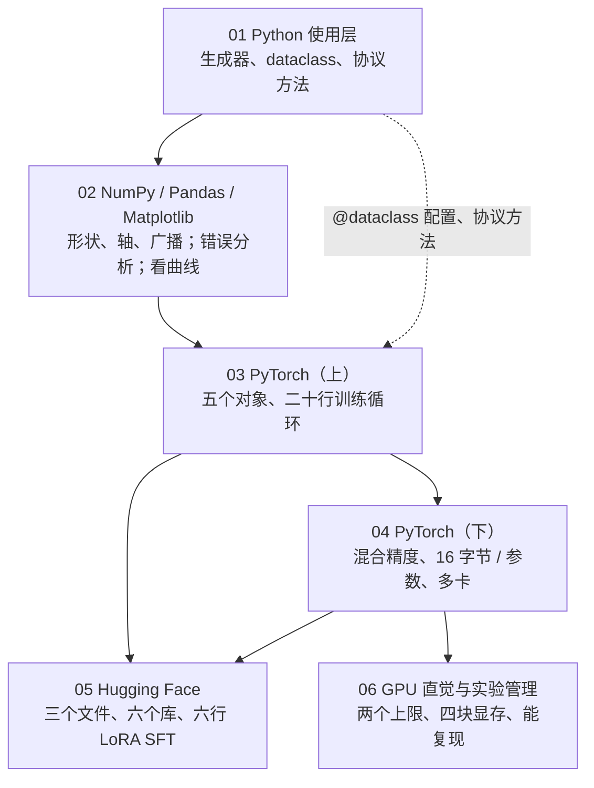
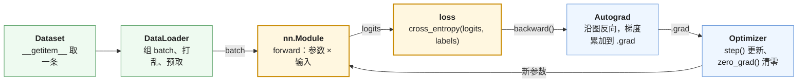
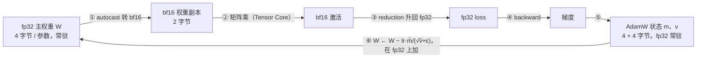
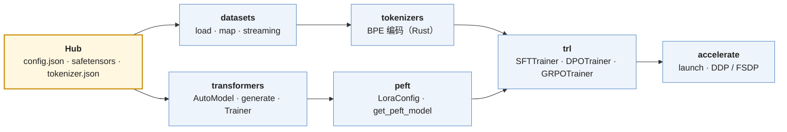

## 这个系列回答一个问题

> 一个想法，怎么变成**一次能跑、能算、能复现**的实验？

- 面向：会 Python、读过数学系列、还没写过训练代码的人
- 一句话主张：**「跑得动跑不动」最终是显存与算力的算术，不是对工具的熟悉程度**
- 每篇从要做的事出发把工具带出来，讲到能做为止，给一个**能算出来、能跑出来的数字**
- 同一个模型（Llama-3-8B）、同一张卡（H100 80 GB、3.35 TB/s、989 TFLOPS）、同一套 CPU 可跑的脚本

<aside class="notes" markdown="1">
总纲：/tooling-for-ai-algorithm-engineers.html。三种能力：会用、会算、会追溯。
</aside>

---

## 一次实验从数据到结论：六篇的位置



<aside class="notes" markdown="1">
语言 → 框架（形状 → 训练循环 → 资源）→ 生态 → 硬件与管理。结论出来后改数据或配方，再来一轮。
</aside>

---

## 六篇各算一笔账

| 篇 | 一个数字 |
|---|---|
| 01 Python | 19.4 MB 文件读成 `list` 要 **102.9 MB**，生成器 11.5 MB；8 线程 1.0×、8 进程 3.1× |
| 02 三剑客 | 30 行手写 attention 与 PyTorch 对到 **2.65 × 10⁻⁷** |
| 03 PyTorch 上 | 84 万参数的小 Transformer，一分钟 PPL **128 → 9.6**，首步 loss 5.07 ≈ ln 128 |
| 04 PyTorch 下 | 每个可训练参数 **16 字节**；8B 全量 128.5 GB / LoRA 16.7 GB / QLoRA 5.1 GB |
| 05 Hugging Face | Qwen2.5-0.5B 上 LoRA 可训练 1.78%；**85% 的 token 被 mask** |
| 06 GPU 直觉 | decode 每 token 搬 16 GB 权重 ÷ 3.35 TB/s ≈ **4.8 ms**；ridge ≈ 295 FLOP/字节 |

---

## 01 · Python 使用层

**结论**：训练代码里反复出现的那一小撮语法各是一个 Python **协议**，PyTorch 建在上面；生成器让峰值内存与文件大小无关；GIL 让 CPU 密集的线程不并行，进程池才有用。

| 语法 | 它是什么 | 对应的 PyTorch API |
|---|---|---|
| `__getitem__` / `__len__` | 序列协议 | `Dataset` |
| `yield` | 生成器 | `DataLoader` 的惰性取数 |
| `__call__` | 可调用对象 | `model(x)`（先跑 hooks 再 `forward`） |
| `@torch.no_grad()` | 装饰器 = 上下文管理器 | 推理评测必加 |
| `**kwargs` | 关键字透传 | `model(**batch)` |
| `@dataclass` | 配置对象 | `asdict(cfg)` 存成 `config.json` |

<aside class="notes" markdown="1">
原文 /python-in-use-for-algorithm-engineers.html。10 GB 语料在 16 GB 内存里过一遍：生成器流水线。
</aside>

<!-- v -->

### 两个能测出来的数字

- **内存**：19.4 MB 的 JSONL 读成 `list` 峰值 102.9 MB（5.3 倍）；生成器流水线 11.5 MB——与文件多大无关
- **并行**：CPU 密集的预处理，串行 0.46 s、8 线程 **0.46 s**（GIL）、8 进程 0.15 s（3.1×）
- 进程池的规矩：传给 `Pool.map` 的函数要在模块顶层、全局变量在子进程里是拷贝——`DataLoader` worker、`datasets.map(num_proc=8)`、DDP 的每个 rank 都是同一套规矩
- 读 traceback：从下往上、跳过 `_call_impl`、找自己文件的最后一帧

---

## 02 · 数据科学三剑客

**结论**：所有「沿哪个维度」是一个概念——轴；广播太宽容所以**形状错误常不报错**；与参考实现对数值到浮点精度，是验证手写算子的标准。

{: style="max-height: 420px"}

<aside class="notes" markdown="1">
原文 /numpy-pandas-matplotlib-for-algorithm-engineers.html。NumPy 建形状直觉，Pandas 做错误分析，Matplotlib 看曲线。
</aside>

<!-- v -->

### 一个数字不算结论：多 seed 与置信区间

{: style="max-height: 420px"}

- 评测表带上 `ci95 = 1.96 √(p(1−p)/n)`：80 道题 ±10.9，5 个点的差分辨不出
- loss 曲线：对数 x 轴、多 seed 阴影带；不重叠才算差别

<!-- v -->

### 手写 attention 与 PyTorch 对拍

```python
scores = np.einsum("btd,bsd->bts", q, k) / np.sqrt(d)      # [B, T, S]
scores = np.where(mask, scores, -np.inf)                   # 因果 mask
p = np.exp(scores - scores.max(-1, keepdims=True))         # 减最大值再 exp
p = p / p.sum(-1, keepdims=True)
out = np.einsum("bts,bsd->btd", p, v)                      # [B, T, D]
```

- 广播三条规则；`(3,) + (3, 1)` 悄悄变成 `(3, 3)`——关键处 `assert` 形状
- 与 `F.scaled_dot_product_attention` 最大误差 **2.65 × 10⁻⁷**：float32 约 1e-6、float64 约 1e-12 才叫「对了」

---

## 03 · PyTorch 使用层（上）：五个对象与二十行

**结论**：使用层只有五个对象；Autograd 做三件事（记图、累加、`no_grad`）；二十行训练循环里每一行对应一个概念，`Trainer` 是它加外壳。



<aside class="notes" markdown="1">
原文 /pytorch-in-use-five-objects-and-a-training-loop.html
</aside>

<!-- v -->

### 二十行里最容易踩的三行

```python
for step, (x, y) in enumerate(loader):
    logits = model(x)                                   # [B, T, V]
    loss = F.cross_entropy(logits.view(-1, V).float(),  # loss 用 fp32 算
                           y.view(-1), ignore_index=-100)
    loss.backward()                                     # 梯度是【累加】的
    torch.nn.utils.clip_grad_norm_(model.parameters(), 1.0)
    opt.step(); sched.step()
    opt.zero_grad(set_to_none=True)                     # 所以要清零
```

- 不 `zero_grad` 不是 bug 就是**梯度累积**（小 batch 模拟大 batch）
- 评测不加 `no_grad`：中间量等一个不会来的 `backward`，显存涨到 OOM
- 首步 loss 应 ≈ ln V：84 万参数、V = 128 → 5.07 ✓；一分钟 PPL 128 → 9.6

<!-- v -->

### 学习率调度：warmup + cosine

{: style="max-height: 400px"}

- `loss.item()` 为什么慢：CPU 异步发 kernel，`.item()` 要等 GPU 队列清空——别每步都取
- CPU 上开 bf16 `autocast` 慢 30 倍：精度的收益来自硬件

---

## 04 · PyTorch 使用层（下）：显存的账

**结论**：每个可训练参数 **16 字节**；激活是账外的一块、与参数量无关；「全量还是 LoRA」的第一道约束是有几张卡。

| 每个可训练参数 | bf16 副本 | 梯度 | fp32 主权重 | Adam m、v | 合计 |
|---|---|---|---|---|---|
| 字节 | 2 | 2 | 4 | 4 + 4 | **16** |

| Llama-3-8B | 算法 | 显存（不含激活） |
|---|---|---|
| 全量微调 | 16 字节 × 8.03B | **128.5 GB** |
| LoRA（r = 16，可训练 0.5%） | 底座 bf16 16 GB + 14 字节 × 42M | **16.7 GB** |
| QLoRA（4-bit 底座） | 底座 4 GB + 同上 | **5.1 GB** |

- 激活另算：B = 1、T = 4096 约 **16.5 GiB**；gradient checkpointing 多 30% 计算换 16.5 → 1 GiB
- FSDP 8 卡切状态：每卡 16 GB 放得下全量

<aside class="notes" markdown="1">
原文 /pytorch-in-use-mixed-precision-memory-ledger-and-multi-gpu.html。16 = 2（bf16 副本）+ 2（梯度，Megatron 配方）+ 4（fp32 主权重）+ 4 + 4（Adam 两个矩）。
</aside>

<!-- v -->

### 混合精度下一步训练的数据流



- `autocast` **不**把参数变成 bf16：减半的是矩阵乘的中间结果，训练状态仍是 16 字节 / 参数
- OOM 按爆的时机归因：加载后 → 权重；第一步 `backward` 后 → 梯度 + 状态；加了 LoRA 还 OOM → **看激活**

---

## 05 · Hugging Face 生态：六个库与六行 LoRA SFT

**结论**：六个库各管一段，六行组装；背后的每件事都在二十行里有位置；从 `compute_loss` 往下追源码是学后训练最快的路。



<aside class="notes" markdown="1">
原文 /hugging-face-ecosystem-six-libraries-and-a-lora-sft.html
</aside>

<!-- v -->

### Hub 上的三个文件

{: style="max-height: 380px"}

- `config.json` 里的数字就是结构：Qwen2.5-0.5B 24 层、hidden 896、词表 151936、`tie_word_embeddings`
- `tokenizer.json` + chat template：对话怎么变成 token、哪些 token 算 loss

<!-- v -->

### 六行 LoRA SFT，与它背后的六件事

```python
ds    = load_dataset("...", split="train")                  # datasets
tok   = AutoTokenizer.from_pretrained(name)                 # chat template → __getitem__
model = AutoModelForCausalLM.from_pretrained(name, dtype=torch.bfloat16)
model = get_peft_model(model, LoraConfig(r=16, lora_alpha=32, ...))  # ΔW = (α/r)·BA
trainer = SFTTrainer(model, train_dataset=ds, args=SFTConfig(...))   # loss mask = ignore_index=-100
trainer.train()                                             # 二十行加外壳
```

- Qwen2.5-0.5B：494M 参数、可训练 8.80M（1.78%）、训练状态 141 MB——CPU 都能微调
- 一条对话 85% 的 token 被 mask；20 步 loss 5.3 → 1.7，**答案对了却不会停**——结束符要进 loss

---

## 06 · GPU 直觉与实验管理

**结论**：两个上限（算力、带宽）之比是 ridge；decode 强度 ≈ 1 远低于 295，是 memory-bound，所以 batch 大才快；显存四块；七项记录齐了才谈复现。

{: style="max-height: 420px"}

<aside class="notes" markdown="1">
原文 /gpu-intuition-and-experiment-management.html
</aside>

<!-- v -->

### 用两个数字解释快慢

| 问题 | 算术 |
|---|---|
| decode 每 token 多久 | 搬 16.06 GB 权重 ÷ 3.35 TB/s ≈ **4.8 ms** → 209 token/s；4-bit 量化字节 1/4、时间也 1/4 |
| prefill 4096 token | 2 × 8B × 4096 ≈ 66 TFLOP ÷ 989 TFLOPS ≈ **67 ms**，compute-bound |
| 训练 MFU | 40–50% 算正常；反向 ≈ 2 × 前向 |
| 显存四块 | 权重 · 梯度与优化器状态 · 激活 · **KV cache**（131 KB / token） |

- 量化对推理有效、对训练用处不大，根本原因就是 decode 在 ridge 左边、训练在右边

<!-- v -->

### 三个月后能复现：七项记录

- 代码版本（commit）· 数据版本（`revision`）· 配置（`asdict(cfg)` → `config.json`）· 环境（`pip freeze`）· seed · 硬件 · 日志与 checkpoint
- 同 seed 两次完全一致要 `use_deterministic_algorithms`；换个 seed 差 **0.14**——20 步训练里 seed 的影响比很多「方法改进」都大
- profiler 表怎么读：慢先归到 GEMM、attention、`copy_`、launch 开销或 GPU 空转之一

---

## 贯穿六篇的五条线

| 线 | 从第一篇到第六篇 |
|---|---|
| 形状 | `__getitem__` 取一条 → 轴与广播 → Tensor → 激活的形状与大小 → KV cache 与 profiler 表里每个算子 |
| 字节的账 | `nbytes` → `dtype` → 16 字节 / 参数、128.5 GB → 0.5B 上验账 141 MB → 4.8 ms / token |
| 惰性与进程 | 生成器、GIL → `DataLoader` worker → `torchrun` 每 rank 一进程 → `datasets` 的 `streaming` / `num_proc` |
| 从封装回到二十行 | 协议对照表 → 二十行 → 六行 SFT 的每件事落在哪一行 → OOM 归四块、慢归 profiler 表 |
| 一个数字不算结论 | `ci95` 与阴影带 → seed 差 0.14 → 七项记录 |

越过这些表能解释的范围（一个算子太慢、一个 OOM 调参绕不过），就是进 Infra 地图的信号。

---

## 常见误区

- 预处理慢就开多线程——GIL 下 8 线程 1.0×，要**进程池**
- 形状错了会报错——广播太宽容，`(3,) + (3, 1)` 悄悄成 `(3, 3)`
- `autocast` 把参数变成 bf16、显存减半——参数精度不变，训练状态仍 16 字节 / 参数
- 加了 LoRA 还 OOM 是 LoRA 没生效——LoRA 只减那 14 字节，激活与参数量无关
- loss 降下来 SFT 就成了——0.5B 上答案对了却不会停，结束符要进 loss
- decode 慢是 GPU 算不过来——强度 1 远低于 ridge 295，时间全在搬 16 GB 权重
{: .fragments}

---

## 下一步

- **原文**：总纲 [/tooling-for-ai-algorithm-engineers.html](/tooling-for-ai-algorithm-engineers.html) · 总结与通关自测 [/algorithm-tooling-series-recap-and-self-test.html](/algorithm-tooling-series-recap-and-self-test.html)
- **配套代码**：[ai-learning-labs/algorithm-tooling](https://github.com/arganzheng/ai-learning-labs/tree/main/algorithm-tooling)——生成器内存实测、手写 attention 对拍、二十行训练循环、显存账、LoRA SFT、profiler
- **往后读**：L2 [经典机器学习](/classical-machine-learning-in-the-llm-era.html) → L3 [深度学习基础](/deep-learning-foundations.html)；越过这一层的问题去 [AI-Infra 地图](/ai-infra-learning-roadmap.html)

<aside class="notes" markdown="1">
收尾。
</aside>
