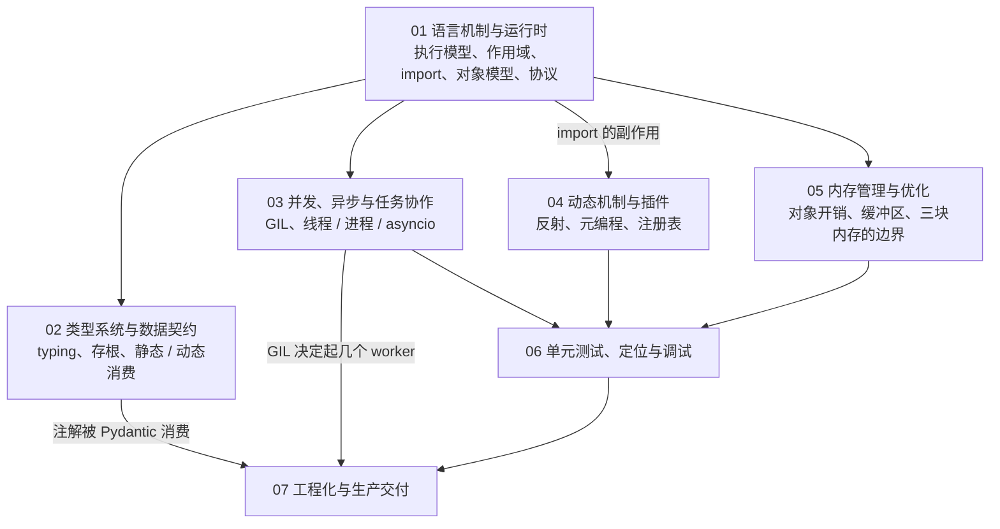
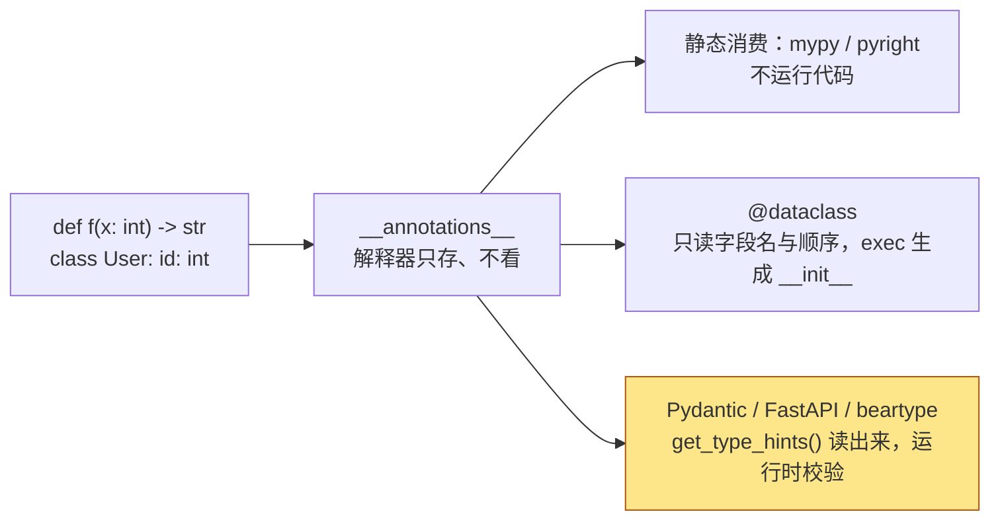
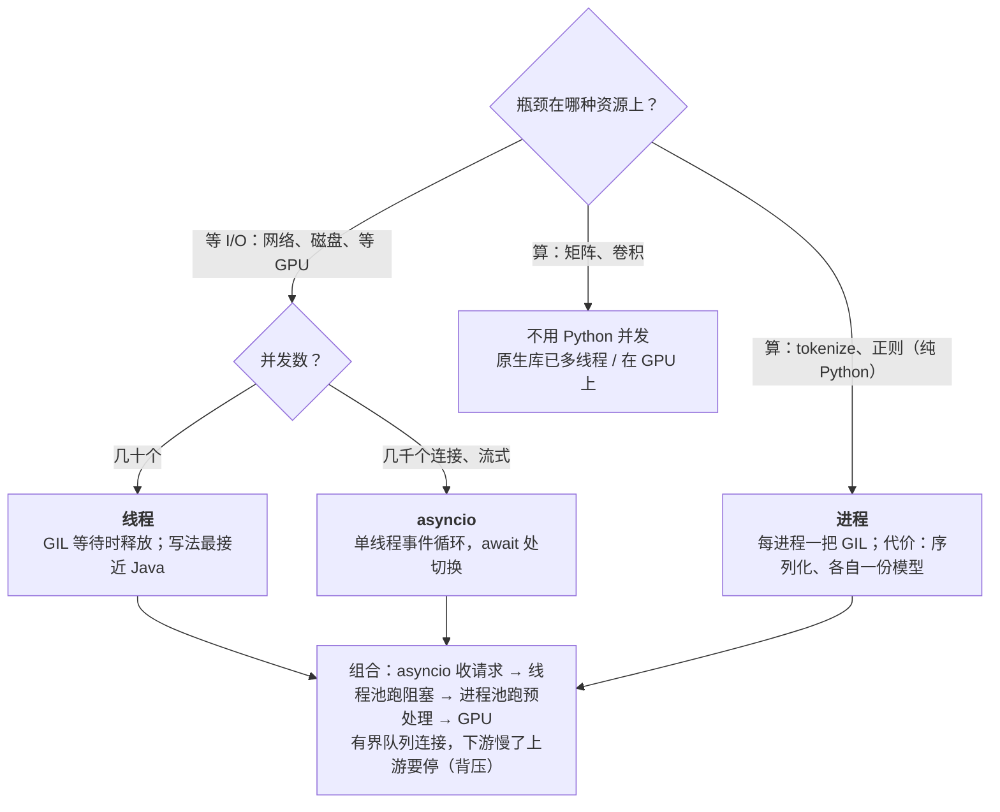
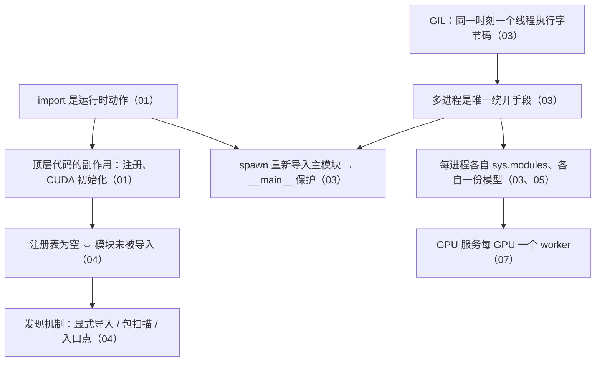

## 这个系列的一句话主张

> Python 的**语法**很容易，Python **工程**不容易——难的不是怎么写，而是语法背后**哪些机制在起作用、代价是什么、什么时候不该用**。

| 链 | 篇 |
|---|---|
| 代码怎么运转 | 01 语言机制与运行时 |
| 怎么写得健壮 | 02 类型系统与数据契约 |
| 怎么协作 | 03 并发、异步与任务协作 |
| 怎么扩展 | 04 动态机制与插件 |
| 内存怎么优化 | 05 内存管理 |
| 怎么确认没问题 | 06 测试、定位与调试 |
| 怎么交付 | 07 工程化与生产交付 |

参照系是 Java；例子取自 PyTorch、vLLM、FastAPI、Pydantic。

<aside class="notes" markdown="1">
总纲：/python-for-ai-infra.html。链有依赖：不理解 import 的副作用就看不懂插件注册（一 → 四）；不理解注解如何被消费就说不清 Pydantic（二 → 七）；不理解 GIL 就定不了 worker 数（三 → 七）。
</aside>

---

## 七篇怎么连起来

---

## 01 · 语言机制：每行「简单」语法背后是一个可替换的协议

**结论**：`import` 是**运行时动作**（执行模块顶层代码，注册与 CUDA 初始化都在这一步）；`obj.attr` 是一个固定算法；`model(x)` 查类型上的 `__call__`——**直接调 `forward` 绕过全部 hook**；装饰器在定义时执行一次；生成器是挂起的帧。

| 机制 | 规则 |
|---|---|
| 属性查找 | 数据描述符 → 实例字典 → 非数据描述符 → `__getattr__` |
| `sys.path[0]` | 由启动方式决定（脚本目录 / 当前目录 / 空） |
| `sys.modules` | 每进程一份——spawn 的子进程要重新导入 |
| `super()` | MRO 里的**下一个**，不是父类；协作式多继承漏一层之后全被跳过 |
| 生成器 | `break` 不等于 `close()`，`finally` 未必执行 |

<aside class="notes" markdown="1">
原文 /python-execution-model-scopes-imports-and-exceptions.html 与 /python-object-model-protocols-decorators-and-generators.html。
</aside>

---

## 02 · 类型系统：注解由谁消费

**结论**：**解释器只把注解存进 `__annotations__`**，谁读、怎么用由消费者决定——`@dataclass` 只当字段清单，**Pydantic 在类创建时构建验证树**。

<aside class="notes" markdown="1">
原文三篇：/python-type-expression-and-the-typing-toolbox.html、/python-type-information-distribution-and-consumption.html、/python-data-contract-design-dataclass-pydantic-and-settings.html。
</aside>

<!-- v -->

### 要点

- 版本：`Protocol` 3.8、`X | Y` 3.10、`ParamSpec` 3.10、`Self` 3.11；`get_type_hints()` 比 `__annotations__` 多做三件事（解析字符串、合并 MRO、去 Optional）
- 「过了 mypy 就是被检查过了」——默认不检查没标注的函数体；`check_untyped_defs` 或 `strict`
- `@runtime_checkable` 只查方法存在，不查签名

---

## 03 · 并发：按瓶颈选模型，不按 API 流行度

**结论**：**线程管阻塞 I/O**，**进程绕开 GIL**，**asyncio 管大量 I/O 协作**；背压、超时、取消、批处理是过载时的稳定手段。

<aside class="notes" markdown="1">
原文 /python-concurrency-asynchrony-and-task-collaboration.html。
</aside>

<!-- v -->

### 数字与陷阱

| 量 | 数 |
|---|---|
| 线程池默认大小 | $$\min(32, \text{cpu} + 4)$$ |
| OS 线程栈 vs 协程 | 约 8 MB vs 几 KB |
| `fork` | 只复制调用线程；3.14 起 Linux 默认 `forkserver` |
| `/dev/shm` | 默认 64 MB——DataLoader worker 常撞 |
| FastAPI `def` 端点 | 线程池 40 |

- 队列默认无界；`asyncio.Lock` 不可重入；`CancelledError` 是 `BaseException`
- 「`Future.cancel()` 能停掉运行中的线程」——线程不能取消、进程只能 kill、协程在下一个 `await` 点协作式取消
- 「在协程里调 `requests.get()` 没问题」——事件循环整个停摆；用异步客户端或 `asyncio.to_thread()`

---

## 04 · 动态机制与插件：只在启动时「选择」，热路径必须静态

**结论**：反射观察、元编程改造、动态加载导入；**插件化 = 注册表 + 发现 + 契约 + 边界**；侵入性递增：显式注册 → 装饰器 → 描述符 → `__init_subclass__` → 元类——**元类几乎总是最后的选择**。

| 操作 | 耗时 | 相对 |
|---|---|---|
| `obj.attr` | ≈ 10 ns | 1× |
| `getattr(obj, name)` | ≈ 23 ns | 2.3× |
| `inspect.signature` | ≈ 3700 ns | **约 370×** |

<aside class="notes" markdown="1">
原文 /python-reflection-metaprogramming-and-plugin-architecture.html。
</aside>

<!-- v -->

### 要点

- 三种发现机制：显式导入（默认）→ 包扫描（多到难维护）→ 入口点（要让别人扩展）；最灵活的失败定位最难
- 注册表为空 ⇔ 模块未被导入——第一篇的 import 副作用在这里兑现
- 用户输入能**选**名字、不能**造**名字（`getattr(module, user_input)` 是漏洞）
- 「子类自动注册应该用元类」——元类改变类的类型、语义隐式、让 mypy 失效；`__init_subclass__` 或类装饰器

---

## 05 · 内存管理：多数不是「泄漏」，是「被意外长期持有」

**结论**：三块内存——Python 对象、原生缓冲区（NumPy / torch CPU）、设备显存——边界不同、归还方式不同；**对象释放不等于 RSS 下降**（pymalloc 的 arena 只在全部 pool 释放后才归还 OS）。

| 机制 | 数 |
|---|---|
| 引用计数 | 归零立即释放；循环靠分代 GC，阈值 (700, 10, 10) |
| pymalloc | 管 ≤ 512 字节；arena 256 KB / pool 4 KB |
| 小整数缓存 | −5 到 256 |
| torch | `memory_reserved` ≥ `memory_allocated`；差值是缓存分配器 |

<aside class="notes" markdown="1">
原文 /python-memory-management-and-optimization.html。
</aside>

<!-- v -->

### 要点

- 定位：**先分三类**（仍被引用 / 分配器保留 / 原生或设备持有）再找源——`tracemalloc`、`gc.get_referrers`、`torch.cuda.memory_summary`
- 「RSS 不降就是泄漏」——先分类
- 「用 `__del__` 释放 GPU 句柄」——时机不可控、可能在解释器关闭时才调；用 `with` 或 `weakref.finalize`

---

## 06 · 测试、定位与调试：按症状选工具

**结论**：工具不难，难在**按症状选工具**；`raise ... from` 与带上下文的日志是所有工具的前提；日志分调试期与生产期，logger 与 handler 两道级别关卡。

| 症状 | 工具 |
|---|---|
| 协程没被等待 | `pytest -W error::RuntimeWarning`；`Mock` 不能 `await`，用 `AsyncMock` |
| Mock 没生效 | 替换「被测模块里实际用的名字」，不是定义处 |
| 进程卡死 / 段错误 | `python -X faulthandler`、`py-spy dump` |
| 内存增长 | `PYTHONTRACEMALLOC=25` 记录分配栈 |
| 动态调用看不到 | `inspect`、`sys.settrace`、结构化日志 |

- 「在库里 `logging.basicConfig()`」——它配置 root logger，篡改了应用的全局配置；库只 `getLogger(__name__)`，最多加 `NullHandler`

<aside class="notes" markdown="1">
原文 /python-unit-testing-troubleshooting-and-debugging.html。
</aside>

---

## 07 · 工程化与生产交付：Java 里框架强制的事交还给你

**结论**：**锁文件进 CI**（`uv sync --locked`）、**torch 交给固定 tag 的基础镜像**、静态检查是编译器的替代品；**GPU 服务每 GPU 一个 worker**，进程内靠 asyncio + 批处理。

| 量 | 数 |
|---|---|
| `pip install torch` | 2 GB+；环境 5–8 GB；镜像 8–12 GB |
| 装 torch | `--index-url`，**不用** `--extra-index-url`（pip 在多索引里选最高版本，可能装到 PyPI 默认变体） |
| CUDA 三层 | 驱动 / runtime / 库；同大版本向前兼容 |
| 4 个 worker × 14 GB 模型 | 56 GB 显存——「多开 worker 提吞吐」的代价 |
| tag | 不能是 `latest` |

- 「`requirements.txt` 全写 `==` 就可复现」——传递依赖仍浮动、无 hash；锁文件带 hash，`--frozen` 不做一致性检查
- 镜像分层：基础镜像（CUDA + torch）→ 依赖层 → 代码层，改代码不重装 torch

<aside class="notes" markdown="1">
原文 /python-engineering-and-production-delivery.html。
</aside>

---

## 一条贯穿线：import → 注册表 → GIL → worker 数

---

## 常见误区

- 「`import` 只是声明依赖」——它执行顶层代码
- 「`model.forward(x)` 与 `model(x)` 一样」——直接调 forward 绕过全部 hook
- 「`super()` 调父类」——调的是 MRO 里的下一个
- 「类型注解在运行时生效」——只有消费者主动读取时才生效
- 「`@dataclass` 会按注解校验」——`User(id="abc")` 静默通过
- 「多线程能加速 CPU 计算」——GIL；纯 Python CPU 用进程
- 「子类自动注册应该用元类」——`__init_subclass__` 几乎总是更好
- 「RSS 不降就是泄漏」——先分三类
- 「装 torch 用 `--extra-index-url`」——用 `--index-url`
- 「GPU 服务多开几个 worker 提吞吐」——每个 worker 一份模型进显存
{: .fragments}

---

## 七个出口

| 篇 | 一个判据 / 一个数 |
|---|---|
| 01 | 属性查找四步；`super()` = MRO 下一个；`sys.modules` 每进程一份 |
| 02 | 解释器只存 `__annotations__`；边界校验一次、内部零开销 |
| 03 | 线程池 min(32, cpu + 4)；线程 8 MB / 协程几 KB；`/dev/shm` 64 MB |
| 04 | `inspect.signature` 370×；能选名字不能造名字 |
| 05 | GC 阈值 (700, 10, 10)；pymalloc ≤ 512 B、arena 256 KB |
| 06 | `AsyncMock`；`-X faulthandler`；`PYTHONTRACEMALLOC=25` |
| 07 | `uv sync --locked`；`--index-url`；每 GPU 一个 worker |

---

## 下一步

- **往下**：《C++ 在 AI-Infra》——Python 之下的那一层；《PyTorch 深度实践》——这些机制在 PyTorch 里的形态（`__setattr__` 注册、Dispatcher、DataLoader 进程）
- **往上**：《vLLM 源码》——asyncio 引擎循环、多进程 worker、插件注册表的真实案例；《AI 平台工程》——镜像与交付
- 原文总纲：`/python-for-ai-infra.html`；通关自测在系列总结
