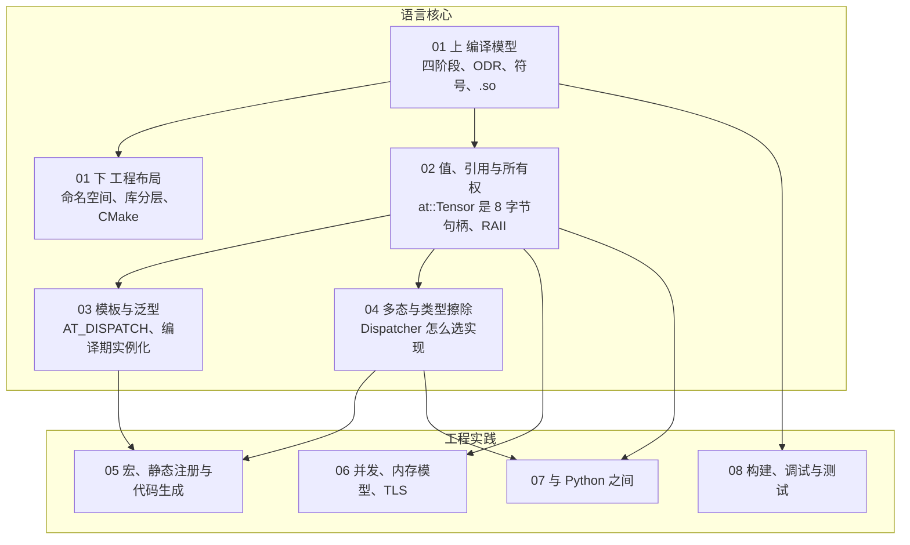
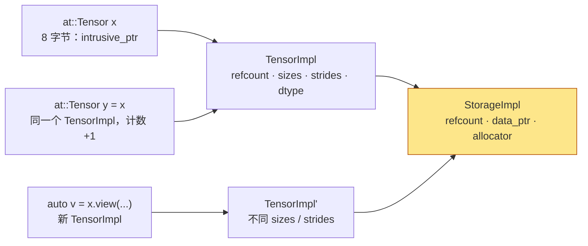
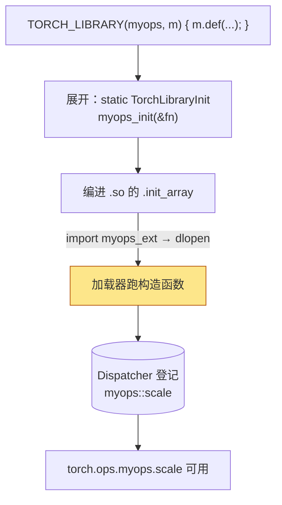
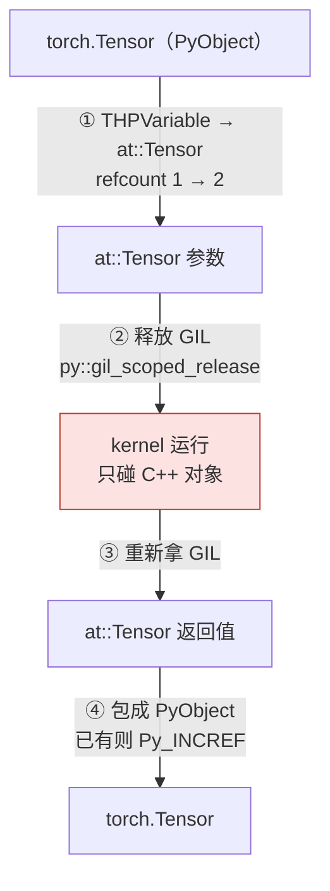

## 这个系列的一句话主张

> C++ 把 Java 交给**运行时**的决定——对象放在哪里、活多久、类型是什么、调哪个实现、线程状态怎么传、怎么与另一个运行时对话、编成什么——**全部前移到了编译期和链接期**，由程序员显式做出。

| | 语言核心 | 工程实践 |
|---|---|---|
| 篇 | 01 编译模型 · 02 对象模型 · 03 模板 · 04 多态 | 05 宏与注册 · 06 并发与 TLS · 07 Python 边界 · 08 工具链 |
| 方法 | 每篇从 PyTorch v2.10.0 / vLLM v0.15.0 的一段真实源码出发，Java 为参照，在 mini-c10 里再实现一遍 | |

<aside class="notes" markdown="1">
总纲：/cpp-for-ai-infra.html。这带来了性能和确定性，也带来了八篇讨论的全部复杂性。
</aside>

---

## 八篇怎么连起来



---

## 01 · 编译模型：`import torch` 加载了哪些 .so

**结论**：编译器只看得见**一个翻译单元**，符号由链接器与动态加载器在两个时刻解析；每类「找不到」只出现在一个阶段——`not declared`（编译）/ `undefined reference`（链接）/ `undefined symbol`（加载）。

{: style="max-height: 340px"}

<aside class="notes" markdown="1">
原文 /cpp-compilation-model-from-cpp-to-shared-object.html 与 /cpp-project-layout-namespaces-libraries-and-cmake.html。20 行源文件预处理后 40222 行。
</aside>

<!-- v -->

### 数字与顺序

| 量 | 数 |
|---|---|
| 四阶段 + 加载 | 预处理 → 编译 → 汇编 → 链接 → `ld.so` 加载 |
| 20 行源文件 | 预处理后 40,222 行 |
| `ld.so` 搜索顺序 | RPATH → `LD_LIBRARY_PATH` → RUNPATH → 系统 |
| `import torch` 的库链 | `libtorch_global_deps.so`（`RTLD_GLOBAL`）→ `_C` → `torch_python` → `torch` → `torch_cpu` → `c10` |

- 「`-ltorch_cpu` 已经依赖 `libc10.so`，不用再写 `-lc10`」——GNU ld 默认 `--no-copy-dt-needed-entries`，引用了 `c10::` 就显式 `-lc10`
- 库分层：依赖只能向下（第一篇的四层源码在 .so 上的形态）

---

## 02 · 对象模型：`Tensor y = x;` 之后发生了什么

**结论**：`Tensor` 是 **8 字节值句柄**，`=` 拷贝句柄、计数 +1；数据在所有句柄与 view 的计数归零那一刻释放。



<aside class="notes" markdown="1">
原文 /cpp-value-semantics-ownership-and-raii.html。del 后显存未降的四步排查：别的 Python 引用 → autograd 保存 → view 活着 → 在缓存池。
</aside>

<!-- v -->

### 要点

- `clone()` 才是新的一块数据；`Tensor` 8 字节 vs `shared_ptr` 16 字节 + 控制块：400M 个活 tensor 每加一个字多 3.2 GB
- 只读参数用 `const Tensor&` 省掉两次原子操作；但 `Tensor` 的 `const` 是**浅的**——in-place 算子的输出参数就是 `const Tensor&`

---

## 03 · 模板：`AT_DISPATCH` 里的 lambda 被编译了几次

**结论**：模板为每组参数生成一份代码；`AT_DISPATCH` 是一个 `switch`，每个 `case` 里 `using scalar_t = ...` 再粘贴 lambda——**N 个 dtype 就编 N 份**；运行期只有一个 `switch`。

```cpp
AT_DISPATCH_FLOATING_TYPES_AND2(kHalf, kBFloat16, self.scalar_type(), "my_op", [&] {
    // 这段 lambda 被复制进每个 case，scalar_t 在每个 case 里是不同的类型
    auto* p = self.data_ptr<scalar_t>();   // 不从返回值推导 → 必须显式 <scalar_t>
    ...
});
```

| 宏 | 编几份 |
|---|---|
| `AT_DISPATCH_FLOATING_TYPES` | 2（float、double）——**不含 Half / BFloat16** |
| `AT_DISPATCH_ALL_TYPES_AND_HALF` | 十几份 |
| vLLM 的 kernel | 3 dtype × 2 width = 6 份 |

- 「`TORCH_CHECK(x.is_floating_point())` 之后 `FLOATING_TYPES` 一定能处理」——Half / BFloat16 也是浮点，但不在那两个 `case` 里

<aside class="notes" markdown="1">
原文 /cpp-templates-and-generic-programming.html。
</aside>

---

## 04 · 多态与类型擦除：Dispatcher 不是虚函数

**结论**：`KernelFunction` = `intrusive_ptr<OperatorKernel>` + boxed 指针 + `void*` unboxed——**函数指针 + 模板生成的适配器**的手工类型擦除；`lookup` 一次数组下标，全程无虚调用；unboxed 为快，boxed（`Stack*` 上的 `IValue`）为通用层写一次。

| 可调用对象 | 大小 |
|---|---|
| 函数指针 | 8 字节 |
| `function_ref` | 16 字节（不拥有） |
| `std::function` | 32 字节 + 可能的堆分配 |
| `IValue` | 16 字节（4 tag + 8 payload） |

- 「Dispatcher 是 `Map<DispatchKey, Kernel>` 加接口虚调用」——签名一致性靠 `CppSignature` 校验，不靠接口
- 虚函数 / CRTP / 类型擦除 / `std::variant` 四种多态各在 PyTorch 哪里用

<aside class="notes" markdown="1">
原文 /cpp-polymorphism-and-type-erasure.html。
</aside>

---

## 05 · 宏与静态注册：算子怎么出现在 `torch.ops` 下

**结论**：`TORCH_LIBRARY` 展开成**静态对象**，`dlopen` 执行 `.init_array` 时其构造函数向 `Dispatcher` 登记——**调用者是加载器，不是用户代码**。



<aside class="notes" markdown="1">
原文 /cpp-macros-static-registration-and-codegen.html。
</aside>

<!-- v -->

### 要点

- 四种链接方式里只有「静态库直接链」注册表为空——未被引用的 .o 被链接器静默丢弃
- 宏三种用途：粘贴代码、拿源码位置、生成标识符；`TORCH_CHECK` 必须是宏的两个理由（`__FILE__/__LINE__`、惰性求值消息）
- `native_functions.yaml` 2,666 条目、一条生成十几处代码；跨库类型要 `C10_API` 导出 typeinfo
- 排查：`nm -C libmyops.so | grep TORCH_LIBRARY`；静态库用 `--whole-archive` / `-force_load`

---

## 06 · 并发、内存模型、TLS：`with torch.no_grad()` 在 C++ 层做了什么

**结论**：改的是一个 **`thread_local` 变量**；每线程一份、**新线程不继承**——worker 读到默认值 `True`，要跨线程必须用 `at::ThreadLocalState` + `ThreadLocalStateGuard` 显式传播。

| 机制 | 数 / 规则 |
|---|---|
| memory order | 六种；引用计数 relaxed 增、acq_rel 减 |
| `intrusive_ptr` 合并计数 | 64 位：低 32 强、高 31 弱、第 63 位 PyObject |
| 守卫三步骨架 | 构造时保存旧值并设新值 → 作用域内生效 → 析构恢复 |
| 线程数优先级 | `set_num_threads` > `OMP_NUM_THREADS` > `MKL_NUM_THREADS` > 核数 |
| `GRAIN_SIZE` | 32,768——`parallel_for` 少于它不切 |

- 「主线程 `no_grad` 里启动的线程也在 `no_grad` 下」——不是
- DataLoader worker、autograd 引擎线程、`at::launch` 都要传 TLS

<aside class="notes" markdown="1">
原文 /cpp-concurrency-memory-model-tls-and-guards.html。
</aside>

---

## 07 · 与 Python 之间：一个 Tensor 来回几次转换

**结论**：输入 3 次、输出 2 次类型转换，**无一步拷贝数据**；**GIL 转参数时持有、跑 kernel 时释放**——放掉 GIL 后 C++ 值随便用，不能碰 `PyObject*`。



<aside class="notes" markdown="1">
原文 /cpp-pybind11-python-c-api-and-abi.html。
</aside>

<!-- v -->

### 要点

- 引用三种：new / borrowed / stolen
- ABI 三层：CPython、libstdc++、PyTorch；2.7 起 Linux wheel 全部 CXX11 ABI，**v2.10.0 开关已删**——显式传 `-D_GLIBCXX_USE_CXX11_ABI=0` 反而制造 `__cxx11` 类 undefined symbol
- `cpp_extension` 检查 GCC ≥ 5、不检查 PyTorch 版本

---

## 08 · 工具链：不靠推理，靠矩阵

**结论**：一个 C++ 改动的八步清单：clangd → clang-format → Debug 构建 → gtest / pytest → clang-tidy → **ASan + UBSan** → **TSan** → CI 矩阵；未定义行为默认什么都不发生、数据悄悄错——**测试过了不等于没有内存错误**。

| 工具 | 代价 |
|---|---|
| `-O0` vs `-O2` | 慢 3–10 倍；`-g` 不影响速度 |
| ASan | 约 2× 时间 |
| TSan | 5–15×；与 ASan 互斥 |
| `detect_leaks=0` | 跑 PyTorch 时必开（解释器退出的假阳性） |
| CI 矩阵 | GCC ≥ 9.3、CUDA ≥ 12.0、C++17；`intrusive_ptr_test.cpp` 325 个测试 |

- 三张栈：Python 栈、C++ 栈、CUDA 栈——`gdb` + `py-bt` 拼起来看
- CI 里先跑「故意崩」自检确认 ASan 生效

<aside class="notes" markdown="1">
原文 /cpp-build-debug-and-test-toolchain.html。
</aside>

---

## 贯穿线：前移到编译期 / 链接期的七个决定

| 决定 | Java（运行时） | C++（编译 / 链接期） | 篇 |
|---|---|---|---|
| 符号在哪 | ClassLoader 运行时找 | 链接器 + `ld.so`，三个阶段三种错误 | 01 |
| 对象活多久 | GC | 引用计数 + RAII，析构时刻确定 | 02 |
| 类型是什么 | 泛型擦除，一份字节码 | 模板实例化，N 份机器码 | 03 |
| 调哪个实现 | 虚调用 | 函数指针 + 适配器，数组下标 | 04 |
| 怎么被发现 | 反射 / 注解扫描 | 静态对象构造函数 + `.init_array` | 05 |
| 线程状态怎么传 | `ThreadLocal` + 继承 | `thread_local` 不继承，显式传播 | 06 |
| 编成什么 | 一份 jar | 每个编译器 / ABI / CUDA 一份 wheel | 07 · 08 |

---

## 常见误区（一）

- 「找不到符号是运行时异常」——三类「找不到」都在业务代码运行之前
- 「`-ltorch_cpu` 依赖了 c10 就不用写 `-lc10`」——默认不通过依赖的依赖满足引用
- 「`Tensor y = x;` 是起别名不花钱」——8 字节句柄拷贝 + 两次原子操作
- 「`const Tensor&` 保证不改数据」——`const` 是浅的
- 「`AT_DISPATCH` 的 lambda 只编一份」——每个 case 一份机器码
- 「Dispatcher 是 Map + 虚调用」——手工类型擦除，一次数组下标
{: .fragments}

---

## 常见误区（二）

- 「编译链接没报错就一定注册上了」——静态库里未引用的 .o 被丢弃
- 「主线程 `no_grad` 里启动的线程也在 `no_grad` 下」——`thread_local` 不继承
- 「放掉 GIL 后不能用参数里的 Tensor」——GIL 保护解释器状态不是 C++ 内存
- 「2.10 上要传 `-D_GLIBCXX_USE_CXX11_ABI=1`」——开关已删，传 `=0` 反而出错
- 「测试过了就没有内存错误」——ASan 跑一遍
{: .fragments}

---

## 八个出口

| 篇 | 一个判据 / 一个数 |
|---|---|
| 01 | `not declared` / `undefined reference` / `undefined symbol` 三阶段；RPATH → LD_LIBRARY_PATH → RUNPATH |
| 02 | `Tensor` 8 字节；`y = x` / view / clone 三种关系；del 后四步排查 |
| 03 | `FLOATING_TYPES` 2 份、`ALL_TYPES_AND_HALF` 十几份；`data_ptr<T>()` 显式 |
| 04 | 函数指针 8 / `function_ref` 16 / `std::function` 32；`IValue` 16 |
| 05 | `.init_array`；`native_functions.yaml` 2,666 条；`nm -C` |
| 06 | 计数 relaxed 增、acq_rel 减；`GRAIN_SIZE` 32768；`ThreadLocalStateGuard` |
| 07 | 输入 3 次 / 输出 2 次转换零拷贝；GIL 跑 kernel 时释放 |
| 08 | ASan 2×、TSan 5–15×；`detect_leaks=0` |

---

## 下一步

- **往上**：《PyTorch 深度实践》第 5–6 篇——Dispatcher 与自定义算子的使用侧；《Python 在 AI-Infra》——边界的另一端
- **往下**：《GPU Kernel 工程》——kernel 本身；《ML 编译器》——生成 C++ / Triton 的那一层
- **实践**：《参与 AI-Infra 开源》——第八篇的工具链在真实 PR 里怎么用
- 原文总纲：`/cpp-for-ai-infra.html`；通关自测在系列总结
