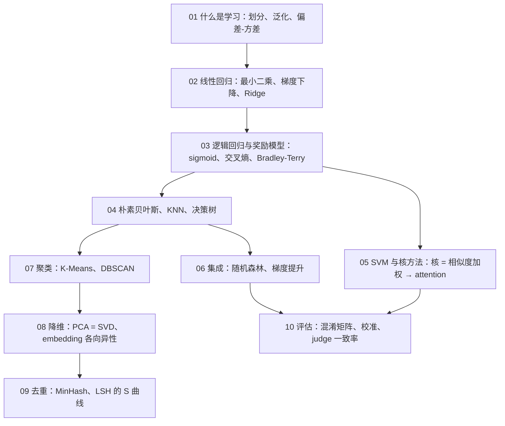

## 这个系列回答一个问题

> 看到 LLM 上的一个问题，能不能**叫出它的经典名字**——叫出名字，经典解法就在手边。

| LLM 上的问题 | 它的经典名字 |
|---|---|
| benchmark 污染 | 测试集泄漏 |
| reward hacking | 在一个过拟合的评估器上做优化 |
| weight decay | Ridge |
| RAG | KNN |
| attention | 核回归（1964） |
| judge 的长度偏好 | 系统误差 |
| 「20 个 benchmark 领先 12 个」 | 多重比较 |

<aside class="notes" markdown="1">
总纲：/classical-machine-learning-in-the-llm-era.html。每篇：小例子 → 画出来 → 十几行 NumPy 手写核心机制并与 sklearn 对数 → 在 LLM 里的形态与失效方式 → 一个真实数据案例。
</aside>

---

## 十篇的依赖：从「什么是学习」出发

---

## 01 · 什么是学习：划分、泛化、偏差-方差

**结论**：测试集只能看一次，参与过决策的数据就不再是测试集；过拟合是容量相对于数据太大；reward hacking = 在一个过拟合的评估器上做优化。

{: style="max-height: 440px"}

<aside class="notes" markdown="1">
原文 /what-is-learning-splits-generalization-and-bias-variance.html。次数 25：训练 MSE 0.040 低于噪声方差 0.09、验证 0.313。
</aside>

<!-- v -->

### 误差 = 偏差² + 方差 + 噪声

{: style="max-height: 400px"}

- 学习曲线：100 个点之后 15 次与 4 次一样好——**数据多了容量就不是问题**
- 在测试集上挑最好的：中位乐观 0.015，均值 0.255（长尾）——这就是「刷榜」

<!-- v -->

### 案例：加州房价，随机划分 vs 按地区划分

{: style="max-height: 400px"}

- 只用经纬度的 KNN：随机划分 RMSE **5.2 万**，按地区划分 **8.6 万**——分数是抄邻居抄出来的
- 划分方式必须模仿上线后的数据；近重复随机切 CV 0.060 vs 真实 0.10

---

## 02 · 线性回归：最小二乘、梯度下降与 Ridge / Lasso

**结论**：正规方程 $$X^\top Xw = X^\top y$$ 是把 $$y$$ 投影到特征平面；损失是一条斜沟，学习率上限 $$2/\lambda_{\max}$$；**Ridge = weight decay**。

{: style="max-height: 440px"}

<aside class="notes" markdown="1">
原文 /linear-regression-least-squares-ridge-and-lasso.html。GD 与闭式解差 1e-10；条件数 540 万 → 标准化后 1。
</aside>

<!-- v -->

### L1 为什么产生稀疏、L2 为什么只是缩小

{: style="max-height: 400px"}

- Lasso：50 个特征里 45 个无用的系数**恰好归零**；Ridge 只缩向零从不到零
- $$w \leftarrow (1 - 2\eta\lambda)w - \eta g$$ 与 Ridge 闭式解差 $$10^{-13}$$——weight decay 不是深度学习特有的技巧

<!-- v -->

### 案例：加州房价，猜均值 → Ridge / Lasso 十步

{: style="max-height: 400px"}

- 三次项无正则：训练 55k / 测试 **102k**——过拟合的形状；Ridge 拉回 60k；Lasso 368 列砍掉 322 列

---

## 03 · 逻辑回归与奖励模型：每个分类头的原型

**结论**：线性部分过 sigmoid，交叉熵的梯度是 $$(p - y)x$$；语言模型的输出层是 softmax 回归；**奖励模型 = 逻辑回归作用在特征差上、无偏置**；准确率的上限是标注一致性。

{: style="max-height: 420px"}

<aside class="notes" markdown="1">
原文 /linear-and-logistic-regression-the-skeleton-of-reward-models.html。P(A ≻ B) = σ(wᵀ(x_A − x_B))。
</aside>

<!-- v -->

### 奖励模型准确率为什么到 80% 就上不去

{: style="max-height: 400px"}

- 3000 对偏好：准确率 91.5% vs 上限 91.3%，$$w$$ 与真值相关 0.999
- 噪声 4.0 时准确率只有 71%，但 $$w$$ 相关仍 0.995——**贴着标签正确率就是学会了**，不是训得不够久

<!-- v -->

### 案例：垃圾短信，TF-IDF + 逻辑回归

- 精确率 **100%**、召回 87%（阈值 0.5）；阈值 0.2 时两者都到 0.92——**阈值是业务参数**
- 权重最大的词就是可解释性：推向 spam 的是 txt、call、free、claim、150p；推向 ham 的是 me、my、that
- 代码：`classical-ml/case_03_sms_spam.py`

---

## 04 · 三个基础分类器：朴素贝叶斯、KNN 与决策树

**结论**：「朴素」= 类内特征独立，不成立时证据重复计数；KNN 就是检索，前提是有好的 embedding；决策树容量随深度指数增长、一定过拟合。

{: style="max-height: 440px"}

<aside class="notes" markdown="1">
原文 /a-family-of-classifiers-from-naive-bayes-to-gradient-boosting.html
</aside>

<!-- v -->

### 维度灾难：KNN 为什么不能直接用在高维上

{: style="max-height: 380px"}

- 1000 维时最近与最远只差 10%——「最近邻」失去意义
- 先学出低维 embedding 再做近邻，**这就是检索（RAG）的前提**；k = 1 训练 100% 测试 0.83

<!-- v -->

### 案例：泰坦尼克，一棵深度 3 的树

{: style="max-height: 400px"}

- 深度 3 最好 83%；深度不限训练 1.000 测试 0.826
- `boat`（救生艇号）列能到 97%——**是泄漏**，上船时不知道

---

## 05 · SVM 与核方法：从最大间隔到 attention

**结论**：只有支持向量决定边界（hinge 在间隔 ≥ 1 处为零）；核 = 不升维算高维内积；**核回归的三步就是 attention 的三步**。

{: style="max-height: 440px"}

<aside class="notes" markdown="1">
原文 /svm-and-kernel-methods.html。C 0.01 → 82 个支持向量、100 → 36 个；圆环线性 0.58 → RBF 1.00。
</aside>

<!-- v -->

### 核回归 = attention

{: style="max-height: 380px"}

- 相似度 → 归一化 → 加权值，1964 年的 Nadaraya–Watson；与点积 attention 公式对到 $$10^{-15}$$
- 新的是 $$Q, K, V$$ 学出来；核 SVM 64000 样本 7.6 s vs 线性 0.01 s——核方法的代价是 $$n^2$$

<!-- v -->

### 案例：MNIST，重跑 LeCun 1998 年那张表

{: style="max-height: 400px"}

- 线性 7.4% → KNN 2.95% → RBF-SVM **1.43%**（60k 全量、16,122 个支持向量）——排序与 1998 年一致
- 10k → 60k 训练时间 40 倍

---

## 06 · 集成：随机森林与梯度提升

**结论**：bagging **只降方差**；残差 = 负梯度，梯度提升是函数空间的梯度下降；数据过滤用小模型不是因为它更准，是**只有它跑得起**。

{: style="max-height: 440px"}

<aside class="notes" markdown="1">
原文 /ensembles-random-forest-and-gradient-boosting.html。一棵树 0.826 → 200 棵 0.905，方差 0.094 → 0.007。
</aside>

<!-- v -->

### bagging 抹掉孤岛，但偏差不变

{: style="max-height: 360px"}

- self-consistency、多个 judge 平均——都是 bagging，**修不了系统性的错**
- 数据质量打分：8B 给 15T token 打分 = 训练算力的 33.3%，线性模型 0.004%——大模型标几十万段、小分类器过全部

<!-- v -->

### 案例：Adult 收入预测

- 一棵树 AUC 0.772 → 随机森林 0.917 → 梯度提升 **0.930**：表格数据上 GBDT > RF > 单树
- 学习率 × 轮数：lr 0.3 第 80 轮到顶后下滑，lr 0.1 在 222 轮，lr 0.03 到 400 轮还在缓升
- permutation 重要性用来**审计**：资本收益、年龄、教育年限居前，race、国籍、性别几乎为零

---

## 07 · 聚类：K-Means、DBSCAN 与「这批语料里有什么」

**结论**：两步都不增簇内平方和所以一定收敛，但到**局部最优**；聚类是探索不是预测，不需要「正确」。

{: style="max-height: 400px"}

<aside class="notes" markdown="1">
原文 /unsupervised-learning-kmeans-pca-and-embedding-clusters.html。inertia 最优 7281，随机初始化最差 16541，k-means++ 全在 7861 以内。
</aside>

<!-- v -->

### 形状决定算法：K-Means 切月牙，DBSCAN 沿密度

{: style="max-height: 360px"}

- 肘部：5 → 6 降 1000、6 → 7 降 500；78 句 embedding $$k = 7$$ ARI 1.0，模板页自成一簇
- 语料探索时 $$k$$ 取 50 还是 200 影响不大——**每簇抽几条读**

<!-- v -->

### 案例：RFM 客户分群

{: style="max-height: 400px"}

- 714 人（16%）贡献 **65%** 营业额；起名字与决定动作是人的事
- 颜色量化：k = 16 已经能看，k = 64 几乎看不出差别

---

## 08 · 降维：PCA、SVD、t-SNE 与 embedding 的各向异性

**结论**：PCA = 中心化数据的 SVD；t-SNE 只保局部，二维图上的距离不能信；**各向异性——所有向量挤在窄锥里，任意两句余弦都在 0.7 以上，先减均值**。

{: style="max-height: 420px"}

<aside class="notes" markdown="1">
原文 /dimensionality-reduction-pca-svd-tsne-and-umap.html。余弦均值 0.79、第一主成分占 26%；减均值后同 / 异主题差距 0.14 → 0.64。
</aside>

<!-- v -->

### PCA 看全局，t-SNE 看局部

{: style="max-height: 380px"}

- PCA 2 维 KNN 0.60 vs t-SNE 0.98；64 维里 29 维解释 95%
- 真实权重 90% 能量要 299/896 维——**W 本身不低秩**，LoRA 的低秩假设是关于 $$\Delta W$$ 的

<!-- v -->

### 案例：Eigenfaces

{: style="max-height: 340px"}

- 前 50 个主成分解释 88%，重建出眼镜；k = 20 能认出是谁
- PCA 为压缩不为精度：原始像素比 PCA 更准；whiten 放大噪声方向

---

## 09 · 去重：MinHash 与 LSH 的概率

**结论**：MinHash 相等的概率恰好等于 Jaccard；LSH 的 S 曲线过 50% 的位置就是阈值——「Jaccard > 0.7 算重复」不是经验值，是 $$b = 14, r = 8$$ 算出来的 0.685。

{: style="max-height: 440px"}

<aside class="notes" markdown="1">
原文 /deduplication-minhash-and-lsh-probabilities.html。标准差 √(J(1−J)/k)，k = 128 约 ±0.04。
</aside>

<!-- v -->

### 案例：wikitext 去重，暴力 vs LSH

{: style="max-height: 400px"}

- 暴力两两比较 **16 分钟** vs LSH **1.5 秒**；200 万对只剩 267 个候选
- 漏掉的是阈值的定义不是 bug；三层去重由便宜到贵：精确 → MinHash → embedding（同义句 Jaccard 0.00 但余弦 0.46）

---

## 10 · 评估：从混淆矩阵到 judge 的一致性

**结论**：不平衡时准确率没有信息；AUC 不看概率、校准要单独查；κ 扣掉随机一致、系统偏差平均不掉；同一套题用配对检验；多个 benchmark 要多重比较。

{: style="max-height: 420px"}

<aside class="notes" markdown="1">
原文 /evaluation-from-confusion-matrix-to-judge-agreement.html。正例 3% 全判负 95.6%；永远选 A 一致率 92% κ = 0；领先期望 10 ± 2.2。
</aside>

<!-- v -->

### AUC 高不等于概率可信：校准

{: style="max-height: 380px"}

- 过度自信 ECE 0.069 → 0.019，AUC 不变
- judge：永远选 A 可以 92% 一致、κ = 0；对换顺序量出位置偏差 **21 个点**
- 20 个 benchmark 领先 12 个：两个相同模型的随机期望 10 ± 2.2，12 在一个标准差以内

<!-- v -->

### 案例：银行营销，按成本定阈值

{: style="max-height: 400px"}

- 准确率无用、按成本定阈值、配对检验：差 0.001 AUC 的 $$p = 0.1$$——是噪声

---

## 贯穿十篇的几条线

| 线 | 在哪几篇 | 一句话 |
|---|---|---|
| 容量 vs 数据 | 一、二、四、五、六 | 过拟合的解药是数据、正则、集成；容量随深度 / 核宽 / 次数增长 |
| 测试集只能看一次 | 一、十 | 参与过决策的就不是测试集；多个 benchmark 要多重比较 |
| 相似度 → 加权 | 四、五、七、八、九 | KNN、核回归 / attention、K-Means、余弦、Jaccard——**距离怎么定义决定一切** |
| 偏差 vs 方差 | 一、三、六、十 | 集成只降方差；系统偏差（judge 位置偏好）平均不掉 |
| 概率不是分数 | 三、十 | 阈值是业务参数；AUC 不看概率、校准另查 |

---

## 常见误区

- 学习率越小越安全——上限由最大曲率定，太小在沟底爬不动；先标准化让碗变圆
- 奖励模型 78% 太低该训更久——上限是标注一致率，贴着它就是学会了
- KNN 直接用在原始高维特征上——1000 维最近与最远只差 10%
- attention 是全新机制——1964 年的核回归，新的是 Q、K、V 学出来
- K-Means 两次结果不同是 bug——局部最优是性质，用 k-means++ 与 `n_init`
- 两段文本余弦 0.85 说明很像——各向异性下所有对都在 0.7 以上，先减均值
- 过滤器准确率 95% 很好——正例 3% 时全判负也有 95.6%
- 20 个 benchmark 领先 12 个——随机期望 10 ± 2.2
{: .fragments}

---

## 下一步

- **原文**：总纲 [/classical-machine-learning-in-the-llm-era.html](/classical-machine-learning-in-the-llm-era.html) · 总结与通关自测 [/classical-ml-series-recap-and-self-test.html](/classical-ml-series-recap-and-self-test.html)
- **配套代码**：[ai-learning-labs/classical-ml](https://github.com/arganzheng/ai-learning-labs/tree/main/classical-ml)——每篇一个手写机制脚本 + 一个 `case_*.py` 真实数据案例（加州房价、垃圾短信、MNIST、泰坦尼克、Adult、RFM、Eigenfaces、wikitext 去重、银行营销）
- **往后读**：L3 [深度学习基础](/deep-learning-foundations.html)；评估那一篇的统计工具在数学系列[第八篇](/statistical-inference-and-fitting-scaling-laws.html)

<aside class="notes" markdown="1">
收尾。
</aside>
