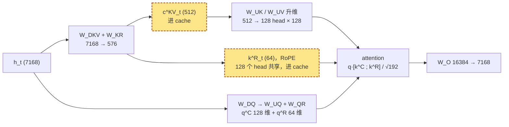
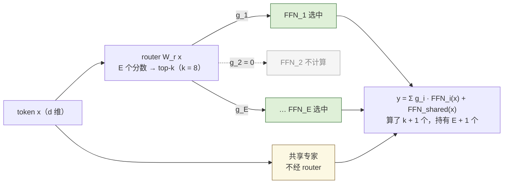
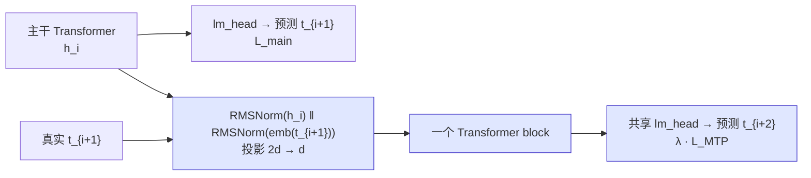
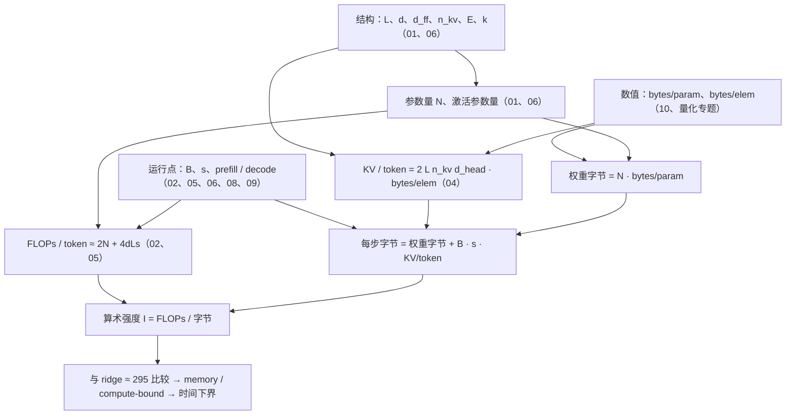

## 总览 · 从 GPT-2 到今天的 LLM

> 从熟悉的 Transformer 主干出发，读配置、数参数，再用算量、访存和 Roofline 理解现代 LLM 的结构改动与代价。

- 前置：[Transformer 原理与实现：从论文到手搓 GPT-2](/transformer-and-llm-structure-implementation-and-evolution.html)
- 正文：十篇，从 GPT-2 与 Llama 的结构差异到浮点格式与混合精度
- 共同实践线：`llm_cost.py`，把模型配置和硬件参数换算成成本表

---

## 01 · 从 GPT-2 到 Llama：五处改动与参数量

**结论**：沿着 GPT-2 的槽位比较现代模型，配置中的五处关键改动解释了 Llama 的结构选择；逐项计数得到 Llama-3-8B 的 **8,030,261,248** 个参数。

$$
N = L\big[d(2d + 2d_{kv}) + 3d \cdot d_{ff} + 2d\big] + 2Vd + d
$$

| Llama-3-8B | 每层 | × 32 层 | 占比 |
|---|---|---|---|
| attention（Q、O 各 d²，K、V 各 d·d_kv） | 41.94M | 1.34B | 17% |
| SwiGLU 三矩阵 3 × 4096 × 14336 | 176.16M | 5.64B | **70%** |
| embedding + lm_head（不共享）| — | 2 × 525.3M | 13% |

<aside class="notes" markdown="1">
原文 /gpt2-to-llama-five-changes-and-parameter-count.html；完整路线图见 /llm-architecture-evolution-roadmap-from-gpt2.html。
</aside>

---
## 02 · 前向的算量与访存量：一条 Roofline

**结论**：每参数每 token 2 FLOPs；decode 每步把 16 GB 权重读一遍、**算术强度在数值上就等于 B**，ridge 是 989 / 3.35 ≈ **295**——这就是「decode 是 memory-bound」的全部含义。

{: style="max-height: 400px"}

<aside class="notes" markdown="1">
原文 /transformer-flops-bytes-and-roofline.html。T ≥ max(FLOPs / P_peak, Bytes / BW)；ridge H100 295、A100 156、FP8 590。算力增长快于带宽，同一模型同一 batch 在新一代 GPU 上更容易 memory-bound。
</aside>

<!-- v -->

### 数字：8B 在一张 H100 上

| 量 | 数 |
|---|---|
| 每 token 权重 FLOPs | 2 × 7.5B = 15.0 G；attention 8K 4.3 G、128K 68.7 G |
| decode B = 1 | 读 16.06 GB / 3.35 TB/s = **4.8 ms**、208 token/s；算力时间 0.02 ms |
| 要 compute-bound | B ≈ 295，但 8K 下这些请求的 KV 要 295 GiB，剩 64 GB 放不下 |
| KV 读取强度 | 常数 g = 4，不随 B 摊薄；总强度趋于 18 → **单卡任何可行 batch 都 memory-bound** |
| 真正的约束 | B × s ≤ 52 万 token（64 GB / 128 KiB） |
| prefill 8K | 因果三角约 140 TFLOP；峰值 0.14–0.16 s 是物理下限，60% MFU 约 0.24–0.27 s |

- 训练 6ND（激活重算 8ND）；激活 $$sbh(34 + 5as/h)$$，8K 时每层 11 GiB 其中 10 GiB 是 s² 项
- 对 decode，「模型多大」的度量是字节不是 FLOPs：FFN 砍一半下界不变，INT4（量化专题）才降到 1.3 ms

---

## 03 · 位置编码与外推：RoPE 的波长

**结论**：RoPE 把 $$d_{head}$$ 维向量看成 64 对复数，每对以自己的波长旋转；8K 训练时 **14 对低频维度没转完一圈**——推到 32K 出现从未见过的相位。**不是装不下，是没见过。**

{: style="max-height: 380px"}

<aside class="notes" markdown="1">
原文 /positional-encoding-and-long-context.html。λ_i = 2π · base^(2i/d_head)：base 10000、d_head 128 时从 6.28 到 5.4 万；base 500000 把最低频拉到 256 万，让 128K 可区分，但「见过」仍靠长序列训练。
</aside>

---

## 04 · Attention 变体与 KV cache：MHA、GQA、MQA、MLA

**结论**：KV cache 每 token = $$2\,L\,n_{kv}\,d_{head} \cdot$$ bytes/elem，公式里**没有 $$n_h$$**——V3 128 头 61 层的 KV（68.6 KiB）比 8B 32 头（128 KiB）还小。

| 模型 | 结构 | KV / token | 128K 上下文 | decode attention 强度 |
|---|---|---|---|---|
| 8B 若用 MHA | 32 KV 头 | 512 KiB | 64 GiB | 1 |
| Llama-3-8B | GQA，8 KV 头（g = 4） | **128 KiB** | 16 GiB | 4 |
| Llama-3-70B | GQA，8 KV 头（g = 8） | 320 KiB | 40 GiB | 8 |
| DeepSeek-V3 | MLA，512 + 64 维 latent | **68.6 KiB** | 8.6 GiB | **242** |
| V3 若用 MHA | 128 头 × 128 | 3.81 MiB | 477 GiB | 1 |

<aside class="notes" markdown="1">
原文 /attention-variants-and-kv-cache.html。判断 MLA 看 kv_lora_rank；num_key_value_heads: 128 不能套 GQA 公式。容量四乘子：结构定元素个数、量化定 bytes/elem、分页定碎片率、prefix 共享定复用倍数。
</aside>

<!-- v -->

### MLA：只有 c^KV 与 k^R 进 cache

- 解耦 RoPE：位置相关的旋转吸不进与位置无关的升维矩阵，所以单独留 64 维
- decode 把 $$W_{UK}$$、$$W_{UV}$$ 吸收进 $$W_Q$$、$$W_O$$：等价于 128 头共享一个 576 维 KV 头的 MQA，强度约 242；代价 attention FLOPs 约 3.4 倍，所以 prefill 走非吸收路径

<!-- v -->

### 物化的 S = QKᵀ 有多大，FlashAttention 省了什么

- 8K 上下文、32 头：每层 $$s \times s$$ 的 logits **4 GiB**（BF16），写出 HBM 再读回
- FlashAttention：分块 + online softmax，从不物化 S，HBM 流量降到 $$O(s^2 d^2 / M)$$；算量不变
- 8B 单卡 8K 的最大并发约 **59**、128K 只有 **3**：KV 定并发
- MLA 不是免费的：多算 3.4 倍 attention FLOPs、维护两条等价路径、专用 kernel、不能从 MHA checkpoint 直接转换

---

## 05 · 长上下文的成本与结构手段

| | Llama-3-8B | Llama-3-70B |
|---|---|---|
| attention = 权重 FLOPs 的交叉点 | 约 28.6K | 约 53.8K |
| 128K 时 attention / 权重 FLOPs | 68.7 G / 15.0 G = **4.6 倍** | 344 G / 141 G |
| 128K prefill（60% MFU） | 6.5 PFLOP，约 **11 s** | 41 PFLOP，约 69 s |
| 128K 一条请求的 KV | 16 GiB | 40 GiB |

- 滑窗使 KV / 单步 attention 为 O(W)，整段 prefill 为 O(sW)（Mistral W = 4096）但丢信息；sink + 滑窗保留开头 4 个 token
- 交错局部 / 全局把系数变 1/k；MLA 减系数不减阶——两者正交可叠加
- 对 Infra：KV 定并发、二次项定 TTFT、chunked prefill 防一条 128K 请求独占 GPU 11 s

---

## Attention 的替代路线：固定状态与混合架构

- Full attention 为每个 token 保存 K/V，状态随序列长度 $$T$$ 线性增长；线性 attention 可把历史压进 $$d_k \times d_v$$ 的递归状态，SSM 则用 selective recurrence 更新状态
- Jamba、MiniMax-01、Qwen3-Next、Kimi Linear 在 full attention 与线性 / SSM 层之间做不同折中；MiniMax-M2 官方说明选择 full attention
- Qwen3-Next 配置：48 层中每 4 层 1 层 full attention，即 12 层 full + 36 层线性；BF16 矩阵状态估算 36 MiB
- 128K：混合结构约 3.04 GiB（KV + 矩阵状态），全 48 层 attention 对照为 12 GiB；1M 外推分别约 24.04 GiB / 96 GiB，配置最大位置为 262,144
- 来源：[Qwen3-Next 配置](https://huggingface.co/Qwen/Qwen3-Next-80B-A3B-Instruct/raw/main/config.json)、[Jamba](https://arxiv.org/html/2403.19887)、[MiniMax-M1](https://arxiv.org/html/2506.13585)、[MiniMax-M2 说明](https://www.minimax.io/news/why-did-m2-end-up-as-a-full-attention-model)、[Kimi Linear](https://arxiv.org/html/2510.26692)

---

## 06 · MoE：三个「参数量」分开算

**结论**：**总参数定显存**（671B，FP8 也放不进 8 卡 640 GB）、**激活参数定 FLOPs**（37B，是 70B 的一半）、**每步实际读取的参数定 decode 带宽**——中等 batch 下几乎读全部专家，稀疏省了算量没省访存。

| DeepSeek-V3，256 专家取 top-8 | B = 1 | B = 32 | B = 128 |
|---|---|---|---|
| 期望激活专家数 $$E[1 - (1 - k/E)^B]$$ | 8 | **163** | 252 |
| 每步读取的专家参数（FP8） | 37 GB | **434 GB** | 660 GB |
| 对比 dense 70B（BF16） | 141 GB | 141 GB | 141 GB |

<aside class="notes" markdown="1">
原文 /moe-compute-and-communication.html。Mixtral 8x7B：8 × 14336 取 top-2，总 46.7B、激活 12.9B，B = 8 就几乎读全部。V3 每专家 44.04M，58 个 MoE 层 + 1 共享专家。
</aside>

<!-- v -->

### MoE 层：router 打分、top-k 选择，只算选中的

<!-- v -->

### 部署为什么难：EP 与 all-to-all

- 出路是专家并行（EP32 每卡约 37 GB、EP320 每卡 19.6 GB，简化模型），代价：
  - 每层**两次 all-to-all**：每 token 每层 dispatch FP8 56 KiB + combine BF16 112 KiB，是 TP-8 all-reduce 的 6.7 倍；4096 token 的 prompt 58 层共 38 GiB
  - 每专家 GEMM 只有 $$Tk/E$$ 行，强度比 dense 低 E/k = 32 倍，过 ridge 需一层里约 9600 个 token
  - 最慢的卡决定全层时间 → 节点受限路由（每 token 最多 4 个节点）、aux-loss-free 均衡、冗余专家
- TP-8 不行：把 2048 宽的专家切成 256 列太瘦，且不减少每卡读的专家数

---

## 07 · MTP：改训练目标而不改主干

**结论**：每个位置额外预测 $$t_{i+2}$$，信号密度 ×(1 + D)，主干被逼编码更远的未来；模块**顺序**喂真实 $$t_{i+1}$$ 保持因果链（teacher forcing 的延伸）；推理时**丢弃**或当投机 draft。

<aside class="notes" markdown="1">
原文 /multi-token-prediction-mtp.html。自有参数：2 个 RMSNorm + 2d→d 投影 + 1 个 block，对 671B 不到 2%；λ 0.3 → 0.1。
</aside>

<!-- v -->

### 多花了什么、多得了什么

| | DeepSeek-V3（D = 1） | nanoGPT 0.8M 实验 |
|---|---|---|
| 额外参数 | 一个 block + 2d²，< 2% | +29% |
| 每步耗时 | — | +38% |
| 主任务 | 大规模上有收益（13B 以上明显） | 1.9375 对 1.9364，**不变** |
| MTP 头 | 当投机 draft：接受率 85–90%、TPS 约 1.8 倍 | t+2 命中 45%（知道 t+1 且多一层） |

- 「MTP 头 loss 更低所以更强」——条件不同；「小模型没收益所以无效」——规模依赖
- 顺序模块 vs 并行头是两条路线：并行头跳过中间 token 会干扰主干

---
## 08 · 投机解码：草稿、验证与收益条件

**结论**：先猜 γ 个 token、再用一次前向验证，接受 / 拒绝重采样让输出分布**严格等于**目标模型；验证 γ+1 个 token 只在 memory-bound 区间几乎免费。

| 量 | 8B 上的数字 | 边界 |
|---|---|---|
| 期望产出 | $$(1-\alpha^{\gamma+1})/(1-\alpha)$$：α=0.8、γ=4 → 3.36 token | γ 越大增量越小，草稿成本线性涨 |
| 加速比 | $$\mathbb{E}[\text{tokens}]/(\gamma c + 1)$$：c=0.1 → 2.4×，c=0.02 → 3.1× | 前提是验证 γ+1 个与验证 1 个同样贵 |
| 转折 batch | ridge/(γ+1) ≈ 60；60% MFU 下 B=64 掉到 1.6、B=128 低于 1 | 完全 compute-bound 时 3.36/5.4 ≈ 0.62 |
| 草稿来源 | 独立小模型、Medusa、EAGLE、n-gram、MTP 模块（α≈0.85–0.9，1.8×） | 改 α 与 c，改不了收益区间 |

Table: 投机解码的正确性、收益与边界

<aside class="notes" markdown="1">
原文 /speculative-decoding-draft-verify-and-payoff.html。单步：q(x)·min(1, p/q) = min(p, q)，拒绝后从 norm(max(0, p − q)) 重采样，两项相加恰好 p(x)。KV 回退要精确到位置：被拒绝位置本身的 KV 也要丢。
</aside>

---

## 09 · 多模态：一张图等于多少 token

**结论**：图片贵的**不是 encoder**（一次性、compute-bound、12 ms），是它变成的 token 在 decoder 里占的 **KV**——与同长文本同价、活到请求结束；1024² 在 Qwen2-VL 里 = 1369 个 token，一段无法被 tokenizer 压短的 system prompt。

{: style="max-height: 360px"}

<aside class="notes" markdown="1">
原文 /multimodal-vision-encoder-cost-and-image-token-kv.html。n_img = ⌈H/28⌉⌈W/28⌉：336² → 144、1024² → 1369、1920×1080 → 2691。
</aside>

<!-- v -->

### 三段各一笔账（70B 规格，1024² 一张图）

| 段 | 账 | 数 |
|---|---|---|
| vision encoder（0.63B ViT，5476 patch） | $$2N_{vit}n_p + 4L_{vit}n_p^2 d_{vit}$$ | 11.8 TFLOP，attention 二次项占 42%；一次性 |
| connector | 决定 token 数 | MLP 不压缩 576 · 2×2 merge 1369 · resampler 定长；同一张图 576–6404 差 11 倍 |
| decoder | prefill + KV | 193 TFLOP；**KV 428 MiB**，是 encoder 输出 21 MiB 的 **20 倍** |

- 比值 $$2Ln_{kv}d_{head}/d_{model}$$：70B 20、8B 16、Qwen2-VL-7B 8
- cross-attention 注入（Llama 3.2 Vision）用 0.5B 参数换序列长度，图片 KV 800 → 200 MiB
- 一分钟 720p 1 fps 视频 35,880 token；按像素预算，不按张数

---

## 09 · 输出侧：图像与语音生成的成本

- 离散自回归图像：Chameleon / Emu3 把图像变成 token；[Emu3 论文](https://arxiv.org/html/2409.18869v1)的 512×512 图像为 **4096 个 token 步**
- Diffusion 路线：[Transfusion](https://arxiv.org/html/2408.11039)报告 **16 个图像 patch**，但 patch 数不是去噪迭代数；不能从它推导固定采样步数
- 解耦路径：[Janus](https://arxiv.org/html/2410.13848)为视觉理解与生成使用不同的视觉编码路径；语言建模骨干共享
- 语音输出：[Qwen2.5-Omni](https://arxiv.org/html/2503.20215v1)的 Thinker-Talker 生成语音 token，再经流式音频解码；论文没有给出通用 tokens/s 或 forward-passes/s
- 成本分别按 AR token 步、diffusion 迭代或实测实时率核算；没有一手来源支持时不填固定数字
- 结构来源：[Chameleon](https://arxiv.org/html/2405.09818)、[Emu3](https://arxiv.org/html/2409.18869v1)、[Transfusion](https://arxiv.org/html/2408.11039)、[Janus](https://arxiv.org/html/2410.13848)、[Qwen2.5-Omni](https://arxiv.org/html/2503.20215v1)

---

## 10 · 浮点格式：指数位定范围，尾数位定精度

**结论**：前向反向要**范围**、权重更新要**精度**——所以 BF16 计算 + **FP32 master weights**；$$\Delta w / w \sim 10^{-4}$$ 低于 BF16 的单位舍入 $$2^{-8} = 0.004$$，1.0 + 0.001 会被舍回 1.0。

{: style="max-height: 330px"}

<aside class="notes" markdown="1">
原文 /floating-point-formats-and-mixed-precision.html。FP16 最大 65504、e^x 在 x > 11.09 溢出（BF16 / FP32 阈值 88.7）；E4M3 最大 448 无 inf。
</aside>

<!-- v -->

### 各格式能表示的范围，与训练里梯度的分布

{: style="max-height: 340px"}

- 训练状态 **16 B / 参数**（bf16 权重 2 + 梯度 2 + fp32 主权重 4 + Adam m、v 8）：8B 128 GB、70B 1.1 TB、671B 10.7 TB
- FP8 分工：E4M3 存权重与激活、E5M2 存梯度；V3 每 128 项提升到 FP32 累加，与 1 × 128 / 128 × 128 的分块 scale 对齐

<!-- v -->

### 数值丢失的四个位置，以及什么才是 bug

| 位置 | 例子 | 对策 |
|---|---|---|
| 大数吃小数 | 1.0 + 0.001 in BF16 | FP32 master weights |
| 长求和 | k = 4096 的点积在 BF16 累加噪声 ε√k ≈ 25% | FP32 累加器 |
| 指数溢出 | softmax 的 e^x，x > 11 在 FP16 溢出 | 减最大值 |
| 相消 | 方差 = E[x²] − E[x]² | Welford |

- 两个 kernel 的差异在 ε 到 ε√k 之间是噪声（BF16 GEMM 相对 FP32 参考 10⁻³–10⁻²）；大几个数量级或有系统性符号才是 bug
- QK-norm 把 attention logit 上界压到 $$\sqrt{d_{head}}\,g_q g_k \approx 11.3\,g_q g_k$$

---

## 现代 LLM 结构系列共用的成本模型

<!-- v -->

### 五条贯穿线

| 线 | 落点 |
|---|---|
| 一份代码 | 原理系列 01 六步手算 → 02 极小 GPT → 03 nanoGPT → 04 训起来；现代系列 01/02/04/06/07/08 在这些基线上逐项展开 |
| 一条 Roofline | $$I_{weight} = B$$、$$I_{KV} = g$$；MLA 把 g 抬到 242；MoE 专家强度 Tk/E；投机转折 ridge/(γ+1)（量化专题的 W4A16 在 ridge/4） |
| KV 与上下文 | 128 KiB/token 打开成四个乘子；B × s ≤ 显存 / KV；长上下文贵在 HBM 字节数不在调度 |
| 「参数量」拆成几个数 | N → N_gemm 7.5B → 总 / 激活 / 每步读取 → bytes/param 推理 2、训练 16（4.25 bit 与可训练 0.52% 在两个专题） |
| 字节里存了什么 | E4M3 / E5M2 分工、128 分块 scale、FP8 KV、FP8 dispatch；数值决定结构细节 |

---

## 常见误区（一）

- 「参数主要在 attention 里」——FFN 占一层 2/3，Llama 约 80%，知识主要在 FFN
- 「causal mask 给了位置信息」——mask 只说谁在左边，不说左边第几个
- 「推理就是训练的前向」——decode 是 [B, 1]、无 mask 矩阵、靠 KV cache、瓶颈在访存
- 「FFN 中间维度就是 4d」——Llama 是三矩阵 SwiGLU，14336 = 2/3 · 4d × 1.3 对齐
- 「每 token FLOPs = 2 × 全部参数」——embedding 是查表，8B 是 2 × 7.5B
- 「head 越多 KV 越大」——公式里只有 $$n_{kv}$$；V3 128 头 68.6 KiB
- 「decode 慢是算力不够」——B = 1 算力 0.02 ms、访存 4.8 ms，距 ridge 两个数量级
{: .fragments}

---

## 常见误区（二）

- 「batch 开到 300 把 H100 用满」——295 个 8K 请求的 KV 要 295 GiB；KV 读取强度是常数 g
- 「改 base 到 500000 就能免费用 128K」——只让长距离可区分，没见过的相位仍要训，二次项不减
- 「MoE 激活 37B 就像 dense 37B 部署」——显存按 671B，中等 batch 每步读 434 GB
- 「BF16 精度低应该用 FP16」——深度学习选范围不选精度
- 「投机解码总是加速」——只在 B ≲ ridge/(γ+1) ≈ 60；大 batch 下验证进入 compute-bound，加速比低于 1
- 「多模态贵在 vision encoder」——encoder 12 ms 用完即弃；贵的是 image token 的 KV，20 倍且活到请求结束
{: .fragments}

---
## 十篇的出口公式

| 篇 | 一个公式 / 一个数 |
|---|---|
| 01 | $$N = L[d(2d + 2d_{kv}) + 3d\,d_{ff} + 2d] + 2Vd + d$$；8,030,261,248 |
| 02 | ridge = 989 / 3.35 ≈ 295；$$I_{weight} = B$$、$$I_{KV} = g$$；训练 $$6ND$$ |
| 03 | $$\lambda_i = 2\pi\cdot\text{base}^{2i/d_{head}}$$；位置外推不等于长文理解 |
| 04 | KV/token = $$2Ln_{kv}d_{head}\cdot$$bytes；MLA 68.6 KiB、强度 242 |
| 05 | 交叉点 8B 28.6K；128K prefill 约 11 s，KV 16 GiB |
| 06 | $$E[1-(1-k/E)^B]$$：B = 32 → 163 个专家、434 GB |
| 07 | $$\mathcal L_{main} + \lambda\bar{\mathcal L}_{MTP}$$；接受率 85–90%、1.8 倍 |
| 08 | $$(1-\alpha^{\gamma+1})/(1-\alpha)$$ = 3.36；转折 ridge/(γ+1) ≈ 60 |
| 09 | $$n_{img} = \lceil H/28\rceil\lceil W/28\rceil$$；KV / encoder 输出 = 20 |
| 10 | BF16 单位舍入 2⁻⁸；16 B / 参数；ε√k |

---

## 下一步

- **往前**：《深度学习基础》——反向传播、初始化 / 归一化 / 残差、优化器、RNN 到 attention 的来历
- **往后（算法）**：《预训练》——tokenizer、scaling law、数据工程、训练配方
- **往后（算法）**：《高效推理与压缩》——量化（第 02 篇 Roofline 的收益区间在它的第 03 篇）、投机解码的草稿怎么训；《LoRA 专题》——参数高效微调的四本账
- **往后（Infra）**：《大模型推理系统揭秘》——把第 02 篇的 Roofline 变成 vLLM 的调度；《大规模训练工程》——把 16 B / 参数切到多卡
- 系列总纲：`/llm-architecture-evolution-roadmap-from-gpt2.html`；通关自测在系列总结

<aside class="notes" markdown="1">
系列总结 /transformer-and-llm-series-recap-and-self-test.html：A 判断与计算 15 题、B 跨篇综合 5 题、C 面试题 7 题。
</aside>
