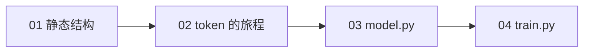
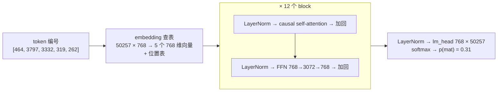
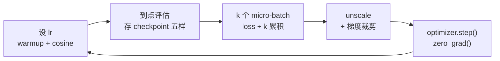

## 这个系列的一句话主张

> Transformer 的结构可以从五种运算读懂；沿着一个 token 的旅程，再把同一套结构写成代码并训练起来。

| 篇 | 内容 |
|---|---|
| 01–04 | 静态结构 → token 旅程 → nanoGPT `model.py` → `train.py` 与实际训练 |

<aside class="notes" markdown="1">
总纲：/transformer-and-llm-structure-implementation-and-evolution.html。现代 LLM 结构系列从这里的 GPT-2 基线继续展开。
</aside>

---

## 四篇怎么连起来



---

## 01 · Transformer 长什么样：只有五种运算

**结论**：embedding 查表 → **attention（唯一让 token 互相看的地方）** → FFN（逐 token 的非线性，知识在这，占一层 2/3）→ 残差 + LayerNorm → lm_head；attention 是集合运算不知道顺序，位置必须显式给。



<aside class="notes" markdown="1">
原文 /transformer-architecture-from-a-sentence-to-the-next-token.html。GPT-2 small：12 × 7.09M + embedding 38.6M + 位置表 0.79M = 124,439,808；FFN 占一层 66.6%。原始 Transformer 是 encoder-decoder，GPT 去掉 encoder 与 cross-attention。
</aside>

<!-- v -->

### 一个 attention 头的六步手算（d = 4、T = 3）

{: style="max-height: 400px"}

- $$\text{Attention}(Q,K,V) = \text{softmax}(QK^\top/\sqrt d + M)\,V$$；t2 的权重 (0.27, 0.27, 0.45)，与 PyTorch 对拍差 $$6 \times 10^{-8}$$
- 随机 $$q \cdot k$$ 的标准差是 $$\sqrt d$$：不除，d = 128 时 softmax 一个 token 独占

<!-- v -->

### GPT-2 真实的头在看什么

{: style="max-height: 400px"}

- 多头不增加算量：h 个小乘法 = 一个大乘法，只多一个 $$W_O$$
- 换序实验：把输入打乱，attention 输出跟着换位——所以位置必须另给（GPT-2 查表 / Llama RoPE）

---

## 02 · 一个 token 的旅程：训练侧与推理侧

**结论**：causal mask + teacher forcing 让一句话 = T 个训练样本；推理时旧 token 的 K、V 不变，**算一次存下来就是 KV cache**——训练 / prefill / decode 是三种形态。

{: style="max-height: 380px"}

<aside class="notes" markdown="1">
原文 /transformer-token-journey-training-and-inference.html。随机初始化 loss ≈ ln V：16 词 2.78、GPT-2 词表 10.8、65 字符 4.17。反向要用前向中间量，激活与 B × T 成正比。
</aside>

<!-- v -->

### prefill 与 decode：为什么前面的 token 不用重算

{: style="max-height: 360px"}

| 形态 | 输入 | 有反向 | 存什么 | 瓶颈 |
|---|---|---|---|---|
| 训练 | [B, T] 全位置有用 | 是 | 激活值 | 算力 |
| prefill | [B, T] 只取最后 | 否 | K、V | 算力（TTFT） |
| decode | [B, 1] | 否 | 追加 K、V | **访存**（TPOT） |

<!-- v -->

### 数字

- 有 / 无 KV cache 输出逐 token **一致**；prompt 256 生成 256 快 **7.9 倍**
- 代价：Llama-3-8B **128 KiB / token** = 32 层 × 2 × 8 个 KV 头 × 128 × 2 B
- KV cache 不存 Q——旧 token 的 Q 用过即弃
- 训练长上下文比推理多一份与 B × T 成正比的激活值

---

## 03 · 手搓 GPT（上）：nanoGPT model.py 逐行

**结论**：330 行、6 个类，结构本身（LayerNorm、CausalSelfAttention、MLP、Block）**不到 90 行**；与 HF GPT-2 对拍相对差 $$9 \times 10^{-5}$$。

```python
class Block(nn.Module):
    def forward(self, x):
        x = x + self.attn(self.ln_1(x))   # pre-norm：先 norm 再子层，残差直连
        x = x + self.mlp(self.ln_2(x))
        return x

# CausalSelfAttention.forward 的骨架
q, k, v = self.c_attn(x).split(self.n_embd, dim=2)          # 一次 GEMM 算 QKV
k = k.view(B, T, self.n_head, C // self.n_head).transpose(1, 2)  # 头换到第 1 维
y = F.scaled_dot_product_attention(q, k, v, is_causal=True)   # 融合 kernel
y = y.transpose(1, 2).contiguous().view(B, T, C)              # 拼回去
```

<aside class="notes" markdown="1">
原文 /nanogpt-model-py-line-by-line.html。wte.weight = lm_head.weight 共享省 31% 参数；所有权重 N(0, 0.02²)，写回残差流的 c_proj 再除 √(2L)；forward 传 targets 算全部位置，不传只算最后一个位置的 lm_head（省 99.9%）。
</aside>

<!-- v -->

### 每个类落在结构的哪个方框

| 类 | 行数 | 实现的是 |
|---|---|---|
| `LayerNorm` | 10 | 可选 bias（GPT-2 有、Llama 无） |
| `CausalSelfAttention` | 40 | `c_attn` 一次算 QKV · 拆头 · SDPA · `c_proj` |
| `MLP` | 12 | 768 → 3072 → GELU → 768 |
| `Block` | 10 | 上面两行 pre-norm |
| `GPT` | 200+ | 拼结构、共享权重、初始化、`generate`、`from_pretrained`、`configure_optimizers`、`estimate_mfu` |

- Llama 相对 GPT-2 只改五处：RMSNorm、RoPE、SwiGLU、GQA、去 bias（lm_head 不共享）
- 三个独立 Linear 与一个 `c_attn` 数学等价，合并只为一次 GEMM

---

## 04 · 手搓 GPT（下）：train.py 与训一个会续写的模型

**结论**：1.1 MB 莎士比亚、0.8M 参数、2000 步 7 分钟，loss 从 **ln 65 = 4.17 → 1.66**；层是串行的——参数与耗时线性、loss 收益递减。

{: style="max-height: 400px"}

<aside class="notes" markdown="1">
原文 /nanogpt-train-py-and-training-a-model-that-writes.html。默认配置每次迭代 40 × 12 × 1024 = 491,520 token；8 卡时每卡累积 5 次。MFU 0.2%：小 batch 在 MPS 上 launch-bound。
</aside>

<!-- v -->

### 训练循环每一步在做什么



- `get_batch`：`memmap` + 随机窗口 + `stack`，`y` 是 `x` 右移一位，没有 epoch
- 不除累积步数 ≠ 只是尺度不同：等价于学习率放大 k 倍；DDP 只在最后一个 micro-batch 同步
- checkpoint 五样：model、optimizer、model_args、iter_num、config——续训不带优化器状态，前几百步抖

---
