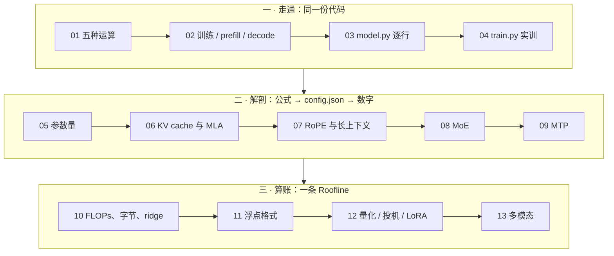
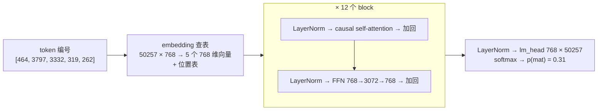
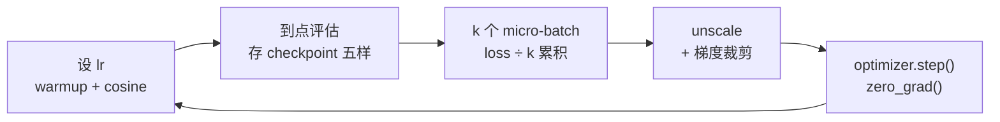
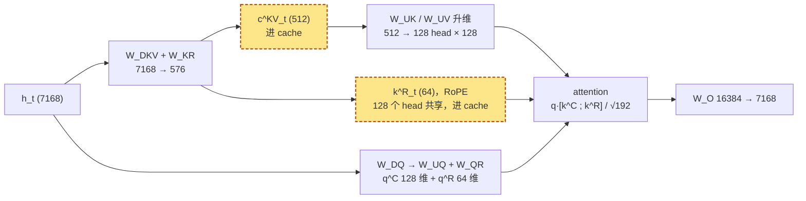
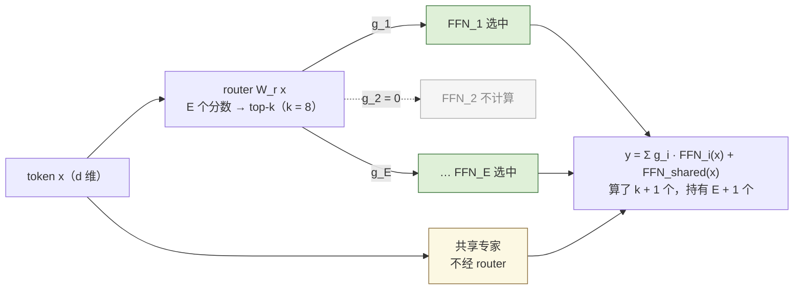
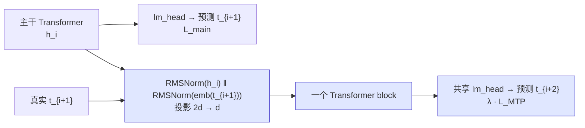
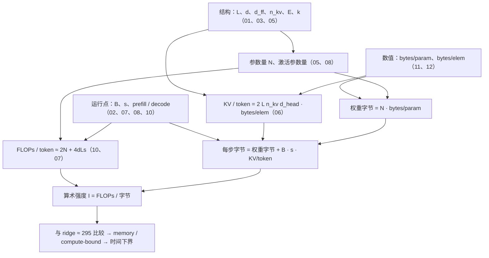

## 这个系列的一句话主张

> 所有 LLM 都是**同一种结构**，300 行能写出来；它之后的每一处演进都在回答一个**能用数字说清**的问题；成本由**结构、运行点、数值、方法**四组变量决定——代入 `config.json` 就能算，不必等 benchmark。

| 段 | 篇 | 方法 |
|---|---|---|
| 一 · 走通 | 01–04 | 同一份代码：d = 4 手算 → 带 KV cache 的极小 GPT → nanoGPT 训到会续写 |
| 二 · 解剖 | 05–09 | 公式 → 代入 Llama-3-8B / 70B、DeepSeek-V3 → 算出数字 |
| 三 · 算账 | 10–13 | 同一张卡 H100：80 GB、3.35 TB/s、BF16 989 TFLOPS |

<aside class="notes" markdown="1">
总纲：/transformer-and-llm-for-infra-engineers.html。三个模型：Llama-3-8B / 70B 代表 dense + GQA，DeepSeek-V3 代表 MLA + 细粒度 MoE + FP8；Mixtral 8x7B 与四个多模态模型作对照。
</aside>

---

## 十三篇怎么连起来



---

## 01 · Transformer 长什么样：只有五种运算

**结论**：embedding 查表 → **attention（唯一让 token 互相看的地方）** → FFN（逐 token 的非线性，知识在这，占一层 2/3）→ 残差 + LayerNorm → lm_head；attention 是集合运算不知道顺序，位置必须显式给。



<aside class="notes" markdown="1">
原文 /transformer-architecture-from-a-sentence-to-the-next-token.html。GPT-2 small：12 × 7.09M + embedding 38.6M + 位置表 0.79M = 124,439,808；FFN 占一层 66.6%。原始 Transformer 是 encoder-decoder，GPT 去掉 encoder 与 cross-attention。
</aside>

<!-- v -->

### 一个 attention 头的六步手算（d = 4、T = 3）

{: style="max-height: 400px"}

- $$\text{Attention}(Q,K,V) = \text{softmax}(QK^\top/\sqrt d + M)\,V$$；t2 的权重 (0.27, 0.27, 0.45)，与 PyTorch 对拍差 $$6 \times 10^{-8}$$
- 随机 $$q \cdot k$$ 的标准差是 $$\sqrt d$$：不除，d = 128 时 softmax 一个 token 独占

<!-- v -->

### GPT-2 真实的头在看什么

{: style="max-height: 400px"}

- 多头不增加算量：h 个小乘法 = 一个大乘法，只多一个 $$W_O$$
- 换序实验：把输入打乱，attention 输出跟着换位——所以位置必须另给（GPT-2 查表 / Llama RoPE）

---

## 02 · 一个 token 的旅程：训练侧与推理侧

**结论**：causal mask + teacher forcing 让一句话 = T 个训练样本；推理时旧 token 的 K、V 不变，**算一次存下来就是 KV cache**——训练 / prefill / decode 是三种形态。

{: style="max-height: 380px"}

<aside class="notes" markdown="1">
原文 /transformer-token-journey-training-and-inference.html。随机初始化 loss ≈ ln V：16 词 2.78、GPT-2 词表 10.8、65 字符 4.17。反向要用前向中间量，激活与 B × T 成正比。
</aside>

<!-- v -->

### prefill 与 decode：为什么前面的 token 不用重算

{: style="max-height: 360px"}

| 形态 | 输入 | 有反向 | 存什么 | 瓶颈 |
|---|---|---|---|---|
| 训练 | [B, T] 全位置有用 | 是 | 激活值 | 算力 |
| prefill | [B, T] 只取最后 | 否 | K、V | 算力（TTFT） |
| decode | [B, 1] | 否 | 追加 K、V | **访存**（TPOT） |

<!-- v -->

### 数字

- 有 / 无 KV cache 输出逐 token **一致**；prompt 256 生成 256 快 **7.9 倍**
- 代价：Llama-3-8B **128 KiB / token** = 32 层 × 2 × 8 个 KV 头 × 128 × 2 B
- KV cache 不存 Q——旧 token 的 Q 用过即弃
- 训练长上下文比推理多一份与 B × T 成正比的激活值

---

## 03 · 手搓 GPT（上）：nanoGPT model.py 逐行

**结论**：330 行、6 个类，结构本身（LayerNorm、CausalSelfAttention、MLP、Block）**不到 90 行**；与 HF GPT-2 对拍相对差 $$9 \times 10^{-5}$$。

```python
class Block(nn.Module):
    def forward(self, x):
        x = x + self.attn(self.ln_1(x))   # pre-norm：先 norm 再子层，残差直连
        x = x + self.mlp(self.ln_2(x))
        return x

# CausalSelfAttention.forward 的骨架
q, k, v = self.c_attn(x).split(self.n_embd, dim=2)          # 一次 GEMM 算 QKV
k = k.view(B, T, self.n_head, C // self.n_head).transpose(1, 2)  # 头换到第 1 维
y = F.scaled_dot_product_attention(q, k, v, is_causal=True)   # 融合 kernel
y = y.transpose(1, 2).contiguous().view(B, T, C)              # 拼回去
```

<aside class="notes" markdown="1">
原文 /nanogpt-model-py-line-by-line.html。wte.weight = lm_head.weight 共享省 31% 参数；所有权重 N(0, 0.02²)，写回残差流的 c_proj 再除 √(2L)；forward 传 targets 算全部位置，不传只算最后一个位置的 lm_head（省 99.9%）。
</aside>

<!-- v -->

### 每个类落在结构的哪个方框

| 类 | 行数 | 实现的是 |
|---|---|---|
| `LayerNorm` | 10 | 可选 bias（GPT-2 有、Llama 无） |
| `CausalSelfAttention` | 40 | `c_attn` 一次算 QKV · 拆头 · SDPA · `c_proj` |
| `MLP` | 12 | 768 → 3072 → GELU → 768 |
| `Block` | 10 | 上面两行 pre-norm |
| `GPT` | 200+ | 拼结构、共享权重、初始化、`generate`、`from_pretrained`、`configure_optimizers`、`estimate_mfu` |

- Llama 相对 GPT-2 只改五处：RMSNorm、RoPE、SwiGLU、GQA、去 bias（lm_head 不共享）
- 三个独立 Linear 与一个 `c_attn` 数学等价，合并只为一次 GEMM

---

## 04 · 手搓 GPT（下）：train.py 与训一个会续写的模型

**结论**：1.1 MB 莎士比亚、0.8M 参数、2000 步 7 分钟，loss 从 **ln 65 = 4.17 → 1.66**；层是串行的——参数与耗时线性、loss 收益递减。

{: style="max-height: 400px"}

<aside class="notes" markdown="1">
原文 /nanogpt-train-py-and-training-a-model-that-writes.html。默认配置每次迭代 40 × 12 × 1024 = 491,520 token；8 卡时每卡累积 5 次。MFU 0.2%：小 batch 在 MPS 上 launch-bound。
</aside>

<!-- v -->

### 训练循环每一步在做什么



- `get_batch`：`memmap` + 随机窗口 + `stack`，`y` 是 `x` 右移一位，没有 epoch
- 不除累积步数 ≠ 只是尺度不同：等价于学习率放大 k 倍；DDP 只在最后一个 micro-batch 同步
- checkpoint 五样：model、optimizer、model_args、iter_num、config——续训不带优化器状态，前几百步抖

---

## 05 · Transformer 解剖：从 config.json 算出 8.03B

**结论**：dense Transformer **没有隐藏参数**——每层四个 attention 矩阵 + 三个 SwiGLU 矩阵，乘层数加词表，Llama-3-8B 算出 **8,030,261,248**，精确到个位。

$$
N = L\big[d(2d + 2d_{kv}) + 3d \cdot d_{ff} + 2d\big] + 2Vd + d,\qquad d_{kv} = n_{kv}\,d_{head}
$$

| Llama-3-8B | 每层 | × 32 层 | 占比 |
|---|---|---|---|
| attention（Q、O 各 d²，K、V 各 d·d_kv） | 41.94M | 1.34B | 17% |
| SwiGLU 三矩阵 3 × 4096 × 14336 | 176.16M | 5.64B | **70%** |
| embedding + lm_head（不共享）| — | 2 × 525.3M | 13% |

<aside class="notes" markdown="1">
原文 /transformer-anatomy-and-parameter-count.html。14336 = 2/3 · 4d × 1.3 向上对齐到 1024 倍数。RoPE、softmax 没有参数。参与 GEMM 的是 7.5B（embedding 只查表）——下一段 15.0 GFLOPs 的来源。
</aside>

<!-- v -->

### 常见的算错方式，以及第一次分裂

| 错法 | 偏差 |
|---|---|
| 用 4d = 16384 当 d_ff | +10% |
| SwiGLU 按两个矩阵算 | −23% |
| 漏掉不共享的 lm_head | −6.5% |
| K、V 按 MHA 算（n_h 而非 n_kv） | +10% |
| 把 embedding 也乘 2 算进 FLOPs | +7% |

- 词表占比随规模下降：8B 13%、70B 3%、405B 约 1%
- **DeepSeek-V3**：骨架相同，attention 换 MLA 六个矩阵、FFN 换 257 个专家——总参数 671B、每 token 激活 37B，「参数量」第一次不再单独对应成本

---

## 06 · Attention 变体与 KV cache：MHA、GQA、MQA、MLA

**结论**：KV cache 每 token = $$2\,L\,n_{kv}\,d_{head} \cdot$$ bytes/elem，公式里**没有 $$n_h$$**——V3 128 头 61 层的 KV（68.6 KiB）比 8B 32 头（128 KiB）还小。

| 模型 | 结构 | KV / token | 128K 上下文 | decode attention 强度 |
|---|---|---|---|---|
| 8B 若用 MHA | 32 KV 头 | 512 KiB | 64 GiB | 1 |
| Llama-3-8B | GQA，8 KV 头（g = 4） | **128 KiB** | 16 GiB | 4 |
| Llama-3-70B | GQA，8 KV 头（g = 8） | 320 KiB | 40 GiB | 8 |
| DeepSeek-V3 | MLA，512 + 64 维 latent | **68.6 KiB** | 8.6 GiB | **242** |
| V3 若用 MHA | 128 头 × 128 | 3.81 MiB | 477 GiB | 1 |

<aside class="notes" markdown="1">
原文 /attention-variants-and-kv-cache.html。判断 MLA 看 kv_lora_rank；num_key_value_heads: 128 不能套 GQA 公式。容量四乘子：结构定元素个数、量化定 bytes/elem、分页定碎片率、prefix 共享定复用倍数。
</aside>

<!-- v -->

### MLA：只有 c^KV 与 k^R 进 cache



- 解耦 RoPE：位置相关的旋转吸不进与位置无关的升维矩阵，所以单独留 64 维
- decode 把 $$W_{UK}$$、$$W_{UV}$$ 吸收进 $$W_Q$$、$$W_O$$：等价于 128 头共享一个 576 维 KV 头的 MQA，强度约 242；代价 attention FLOPs 约 3.4 倍，所以 prefill 走非吸收路径

<!-- v -->

### 物化的 S = QKᵀ 有多大，FlashAttention 省了什么

- 8K 上下文、32 头：每层 $$s \times s$$ 的 logits **4 GiB**（BF16），写出 HBM 再读回
- FlashAttention：分块 + online softmax，从不物化 S，HBM 流量降到 $$O(s^2 d^2 / M)$$；算量不变
- 8B 单卡 8K 的最大并发约 **59**、128K 只有 **3**：KV 定并发
- MLA 不是免费的：多算 3.4 倍 attention FLOPs、维护两条等价路径、专用 kernel、不能从 MHA checkpoint 直接转换

---

## 07 · 位置编码与长上下文：RoPE 的波长

**结论**：RoPE 把 $$d_{head}$$ 维向量看成 64 对复数，每对以自己的波长旋转；8K 训练时 **14 对低频维度没转完一圈**——推到 32K 出现从未见过的相位。**不是装不下，是没见过。**

{: style="max-height: 380px"}

<aside class="notes" markdown="1">
原文 /positional-encoding-and-long-context.html。λ_i = 2π · base^(2i/d_head)：base 10000、d_head 128 时从 6.28 到 5.4 万；base 500000 把最低频拉到 256 万，让 128K 可区分，但「见过」仍靠长序列训练。
</aside>

<!-- v -->

### 长上下文的账：线性项、二次项，与交叉点

| | Llama-3-8B | Llama-3-70B |
|---|---|---|
| attention = 权重 FLOPs 的交叉点 | 约 28.6K | 约 53.8K |
| 128K 时 attention / 权重 FLOPs | 68.7 G / 15.0 G = **4.6 倍** | 344 G / 141 G |
| 128K prefill（60% MFU） | 6.5 PFLOP，约 **11 s** | 41 PFLOP，约 69 s |
| 128K 一条请求的 KV | 16 GiB | 40 GiB |

- 滑窗把 KV 与算量从 O(s) 变 O(W)（Mistral W = 4096）但丢信息；sink + 滑窗保留开头 4 个 token
- 交错局部 / 全局把系数变 1/k；MLA 减系数不减阶——两者正交可叠加
- 对 Infra：KV 定并发、二次项定 TTFT、chunked prefill 防一条 128K 请求独占 GPU 11 s

---

## 08 · MoE：三个「参数量」分开算

**结论**：**总参数定显存**（671B，FP8 也放不进 8 卡 640 GB）、**激活参数定 FLOPs**（37B，是 70B 的一半）、**每步实际读取的参数定 decode 带宽**——中等 batch 下几乎读全部专家，稀疏省了算量没省访存。

| DeepSeek-V3，256 专家取 top-8 | B = 1 | B = 32 | B = 128 |
|---|---|---|---|
| 期望激活专家数 $$E[1 - (1 - k/E)^B]$$ | 8 | **163** | 252 |
| 每步读取的专家参数（FP8） | 37 GB | **434 GB** | 660 GB |
| 对比 dense 70B（BF16） | 141 GB | 141 GB | 141 GB |

<aside class="notes" markdown="1">
原文 /moe-compute-and-communication.html。Mixtral 8x7B：8 × 14336 取 top-2，总 46.7B、激活 12.9B，B = 8 就几乎读全部。V3 每专家 44.04M，58 个 MoE 层 + 1 共享专家。
</aside>

<!-- v -->

### MoE 层：router 打分、top-k 选择，只算选中的



<!-- v -->

### 部署为什么难：EP 与 all-to-all

- 出路是专家并行（EP32 每卡约 37 GB、EP320 每卡 19.6 GB，简化模型），代价：
  - 每层**两次 all-to-all**：每 token 每层 dispatch FP8 56 KiB + combine BF16 112 KiB，是 TP-8 all-reduce 的 6.7 倍；4096 token 的 prompt 58 层共 38 GiB
  - 每专家 GEMM 只有 $$Tk/E$$ 行，强度比 dense 低 E/k = 32 倍，过 ridge 需一层里约 9600 个 token
  - 最慢的卡决定全层时间 → 节点受限路由（每 token 最多 4 个节点）、aux-loss-free 均衡、冗余专家
- TP-8 不行：把 2048 宽的专家切成 256 列太瘦，且不减少每卡读的专家数

---

## 09 · MTP：改训练目标而不改主干

**结论**：每个位置额外预测 $$t_{i+2}$$，信号密度 ×(1 + D)，主干被逼编码更远的未来；模块**顺序**喂真实 $$t_{i+1}$$ 保持因果链（teacher forcing 的延伸）；推理时**丢弃**或当投机 draft。



<aside class="notes" markdown="1">
原文 /multi-token-prediction-mtp.html。自有参数：2 个 RMSNorm + 2d→d 投影 + 1 个 block，对 671B 不到 2%；λ 0.3 → 0.1。
</aside>

<!-- v -->

### 多花了什么、多得了什么

| | DeepSeek-V3（D = 1） | nanoGPT 0.8M 实验 |
|---|---|---|
| 额外参数 | 一个 block + 2d²，< 2% | +29% |
| 每步耗时 | — | +38% |
| 主任务 | 大规模上有收益（13B 以上明显） | 1.9375 对 1.9364，**不变** |
| MTP 头 | 当投机 draft：接受率 85–90%、TPS 约 1.8 倍 | t+2 命中 45%（知道 t+1 且多一层） |

- 「MTP 头 loss 更低所以更强」——条件不同；「小模型没收益所以无效」——规模依赖
- 顺序模块 vs 并行头是两条路线：并行头跳过中间 token 会干扰主干

---

## 10 · 前向的算量与访存量：一条 Roofline

**结论**：每参数每 token 2 FLOPs；decode 每步把 16 GB 权重读一遍、**算术强度在数值上就等于 B**，ridge 是 989 / 3.35 ≈ **295**——这就是「decode 是 memory-bound」的全部含义。

{: style="max-height: 400px"}

<aside class="notes" markdown="1">
原文 /transformer-flops-bytes-and-roofline.html。T ≥ max(FLOPs / P_peak, Bytes / BW)；ridge H100 295、A100 156、FP8 590。算力增长快于带宽，同一模型同一 batch 在新一代 GPU 上更容易 memory-bound。
</aside>

<!-- v -->

### 数字：8B 在一张 H100 上

| 量 | 数 |
|---|---|
| 每 token 权重 FLOPs | 2 × 7.5B = 15.0 G；attention 8K 4.3 G、128K 68.7 G |
| decode B = 1 | 读 16.06 GB / 3.35 TB/s = **4.8 ms**、208 token/s；算力时间 0.02 ms |
| 要 compute-bound | B ≈ 295，但 8K 下这些请求的 KV 要 295 GiB，剩 64 GB 放不下 |
| KV 读取强度 | 常数 g = 4，不随 B 摊薄；总强度趋于 18 → **单卡任何可行 batch 都 memory-bound** |
| 真正的约束 | B × s ≤ 52 万 token（64 GB / 128 KiB） |
| prefill 8K | 峰值 0.14–0.16 s 是物理下限，60% MFU 约 0.25 s |

- 训练 6ND（激活重算 8ND）；激活 $$sbh(34 + 5as/h)$$，8K 时每层 11 GiB 其中 10 GiB 是 s² 项
- 对 decode，「模型多大」的度量是字节不是 FLOPs：FFN 砍一半下界不变，INT4 才降到 1.3 ms

---

## 11 · 浮点格式：指数位定范围，尾数位定精度

**结论**：前向反向要**范围**、权重更新要**精度**——所以 BF16 计算 + **FP32 master weights**；$$\Delta w / w \sim 10^{-4}$$ 低于 BF16 的单位舍入 $$2^{-8} = 0.004$$，1.0 + 0.001 会被舍回 1.0。

{: style="max-height: 330px"}

<aside class="notes" markdown="1">
原文 /floating-point-formats-and-mixed-precision.html。FP16 最大 65504、e^x 在 x > 11.09 溢出（BF16 / FP32 阈值 88.7）；E4M3 最大 448 无 inf。
</aside>

<!-- v -->

### 各格式能表示的范围，与训练里梯度的分布

{: style="max-height: 340px"}

- 训练状态 **16 B / 参数**（bf16 权重 2 + 梯度 2 + fp32 主权重 4 + Adam m、v 8）：8B 128 GB、70B 1.1 TB、671B 10.7 TB
- FP8 分工：E4M3 存权重与激活、E5M2 存梯度；V3 每 128 项提升到 FP32 累加，与 1 × 128 / 128 × 128 的分块 scale 对齐

<!-- v -->

### 数值丢失的四个位置，以及什么才是 bug

| 位置 | 例子 | 对策 |
|---|---|---|
| 大数吃小数 | 1.0 + 0.001 in BF16 | FP32 master weights |
| 长求和 | k = 4096 的点积在 BF16 累加噪声 ε√k ≈ 25% | FP32 累加器 |
| 指数溢出 | softmax 的 e^x，x > 11 在 FP16 溢出 | 减最大值 |
| 相消 | 方差 = E[x²] − E[x]² | Welford |

- 两个 kernel 的差异在 ε 到 ε√k 之间是噪声（BF16 GEMM 相对 FP32 参考 10⁻³–10⁻²）；大几个数量级或有系统性符号才是 bug
- QK-norm 把 attention logit 上界压到 $$\sqrt{d_{head}}\,g_q g_k \approx 11.3\,g_q g_k$$

---

## 12 · 量化、投机解码与 LoRA：三种方法，同一条 Roofline

**结论**：都不改结构，各改一个变量——量化改 $$W_{bytes}$$、投机改每步的 m、LoRA 改训练时的 N；前两者都在**兑现 memory-bound 区间里空转的算力**，过 ridge 收益同时消失。

{: style="max-height: 380px"}

<aside class="notes" markdown="1">
原文 /quantization-speculative-decoding-and-lora.html。T(m) = max(W_bytes / BW, 2Nm / F)；8B 访存 4.8 ms、算力每行 15.2 μs。
</aside>

<!-- v -->

### 三种方法各改哪个变量

| 方法 | 改的变量 | 8B 上的数 | 兑现条件 |
|---|---|---|---|
| INT4 g128 量化 | $$W_{bytes}$$：4.25 bit | 16 GB → 4.27 GB，4.8 → 1.27 ms | decode 且 B ≲ ridge/4 ≈ 79；prefill 反而多反量化 |
| 投机解码 | 每步的 m：验证 γ + 1 个 | α = 0.8、γ = 4：期望 3.36 token，加速 2.4 倍 | B ≲ ridge/(γ+1) ≈ 60；输出分布严格不变 |
| LoRA | 训练时的可训练 N | 41.9M（0.52%），状态 128 GB → 16.7 GB | 省的是 16 B/参数的状态；激活不变、反向仍穿过每层（约 4N） |

- GPTQ 用 Hessian 把误差补偿到未量化的列；AWQ 保护激活幅度最大的 1% 通道；SmoothQuant 把激活的离群迁到权重
- W8A8 字节减半且算力翻倍，对 prefill 也有效；实测 decode 约 3 倍而非 4 倍（lm_head 保留、KV 读取不减）

---

## 13 · 多模态：一张图等于多少 token

**结论**：图片贵的**不是 encoder**（一次性、compute-bound、12 ms），是它变成的 token 在 decoder 里占的 **KV**——与同长文本同价、活到请求结束；1024² 在 Qwen2-VL 里 = 1369 个 token，一段无法被 tokenizer 压短的 system prompt。

{: style="max-height: 360px"}

<aside class="notes" markdown="1">
原文 /multimodal-vision-encoder-cost-and-image-token-kv.html。n_img = ⌈H/28⌉⌈W/28⌉：336² → 144、1024² → 1369、1920×1080 → 2691。
</aside>

<!-- v -->

### 三段各一笔账（70B 规格，1024² 一张图）

| 段 | 账 | 数 |
|---|---|---|
| vision encoder（0.63B ViT，5476 patch） | $$2N_{vit}n_p + 4L_{vit}n_p^2 d_{vit}$$ | 11.8 TFLOP，attention 二次项占 42%；一次性 |
| connector | 决定 token 数 | MLP 不压缩 576 · 2×2 merge 1369 · resampler 定长；同一张图 576–6404 差 11 倍 |
| decoder | prefill + KV | 193 TFLOP；**KV 428 MiB**，是 encoder 输出 21 MiB 的 **20 倍** |

- 比值 $$2Ln_{kv}d_{head}/d_{model}$$：70B 20、8B 16、Qwen2-VL-7B 8
- cross-attention 注入（Llama 3.2 Vision）用 0.5B 参数换序列长度，图片 KV 800 → 200 MiB
- 一分钟 720p 1 fps 视频 35,880 token；按像素预算，不按张数

---

## 第三段共用的成本模型



<!-- v -->

### 五条贯穿线

| 线 | 落点 |
|---|---|
| 一份代码 | 01 六步手算 → 02 极小 GPT → 03 nanoGPT → 04 训起来 → 06/07/08 在它上改 GQA、RoPE、MoE → 09 挂 MTP |
| 一条 Roofline | $$I_{weight} = B$$、$$I_{KV} = g$$；MLA 把 g 抬到 242；MoE 专家强度 Tk/E；量化转折 ridge/4、投机 ridge/(γ+1) |
| KV 与上下文 | 128 KiB/token 打开成四个乘子；B × s ≤ 显存 / KV；长上下文贵在 HBM 字节数不在调度 |
| 「参数量」拆成几个数 | N → N_gemm 7.5B → 总 / 激活 / 每步读取 → bytes/param 16 与 4.25 bit → 可训练 0.52% |
| 字节里存了什么 | E4M3 / E5M2 分工、128 分块 scale、FP8 KV、FP8 dispatch；数值决定结构细节 |

---

## 常见误区（一）

- 「参数主要在 attention 里」——FFN 占一层 2/3，Llama 约 80%，知识主要在 FFN
- 「causal mask 给了位置信息」——mask 只说谁在左边，不说左边第几个
- 「推理就是训练的前向」——decode 是 [B, 1]、无 mask 矩阵、靠 KV cache、瓶颈在访存
- 「FFN 中间维度就是 4d」——Llama 是三矩阵 SwiGLU，14336 = 2/3 · 4d × 1.3 对齐
- 「每 token FLOPs = 2 × 全部参数」——embedding 是查表，8B 是 2 × 7.5B
- 「head 越多 KV 越大」——公式里只有 $$n_{kv}$$；V3 128 头 68.6 KiB
- 「decode 慢是算力不够」——B = 1 算力 0.02 ms、访存 4.8 ms，距 ridge 两个数量级
{: .fragments}

---

## 常见误区（二）

- 「batch 开到 300 把 H100 用满」——295 个 8K 请求的 KV 要 295 GiB；KV 读取强度是常数 g
- 「改 base 到 500000 就能免费用 128K」——只让长距离可区分，没见过的相位仍要训，二次项不减
- 「MoE 激活 37B 就像 dense 37B 部署」——显存按 671B，中等 batch 每步读 434 GB
- 「BF16 精度低应该用 FP16」——深度学习选范围不选精度
- 「量化就是加速」——只在 decode 且 B ≲ ridge/4；prefill 反而多反量化
- 「多模态贵在 vision encoder」——encoder 12 ms 用完即弃；贵的是 image token 的 KV，20 倍且活到请求结束
{: .fragments}

---

## 十三个出口公式

| 篇 | 一个公式 / 一个数 |
|---|---|
| 01 | $$\text{softmax}(QK^\top/\sqrt d + M)V$$；GPT-2 small 124,439,808 |
| 02 | 初始 loss = ln V；KV 128 KiB / token；KV cache 快 7.9 倍 |
| 03 · 04 | `x = x + attn(ln_1(x))`；ln 65 = 4.17 → 1.66，7 分钟 |
| 05 | $$N = L[d(2d + 2d_{kv}) + 3d\,d_{ff} + 2d] + 2Vd + d$$ = 8,030,261,248 |
| 06 | KV/token = $$2Ln_{kv}d_{head}\cdot$$bytes；MLA 68.6 KiB、强度 242 |
| 07 | $$\lambda_i = 2\pi\cdot\text{base}^{2i/d_{head}}$$；交叉点 8B 28.6K；128K prefill 11 s |
| 08 | $$E[1-(1-k/E)^B]$$：B = 32 → 163 个专家、434 GB |
| 09 | $$\mathcal L_{main} + \lambda\bar{\mathcal L}_{MTP}$$；接受率 85–90%、1.8 倍 |
| 10 | ridge = 989 / 3.35 ≈ 295；$$I_{weight} = B$$、$$I_{KV} = g$$；6ND |
| 11 | BF16 单位舍入 2⁻⁸；16 B / 参数；ε√k |
| 12 | $$T(m) = \max(W_{bytes}/BW,\ 2Nm/F)$$；$$(1-\alpha^{\gamma+1})/(1-\alpha)$$ |
| 13 | $$n_{img} = \lceil H/28\rceil\lceil W/28\rceil$$；KV / encoder 输出 = 20 |

---

## 下一步

- **往前**：《深度学习基础》——反向传播、初始化 / 归一化 / 残差、优化器、RNN 到 attention 的来历
- **往后（算法）**：《预训练》——tokenizer、scaling law、数据工程、训练配方
- **往后（Infra）**：《高效推理》——把第 10 篇的 Roofline 变成 vLLM / SGLang 的调度；《分布式训练》——把 16 B / 参数切到多卡
- 原文总纲：`/transformer-and-llm-for-infra-engineers.html`；通关自测 27 题在系列总结

<aside class="notes" markdown="1">
系列总结 /transformer-and-llm-series-recap-and-self-test.html：A 判断与计算 15 题、B 跨篇综合 5 题、C 面试题 7 题。
</aside>
